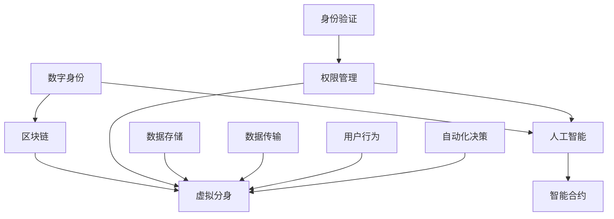

                 

# 2050年的数字身份：从数字身份链到虚拟分身的身份数字化

在未来的数字时代，数字身份将从单一的认证凭证演变为复杂且多元化的虚拟化身，这不仅仅是技术发展的必然趋势，更是人类社会进步的必经之路。本文将探讨数字身份从传统认证到虚拟化身的演进过程，分析其核心概念、算法原理与具体操作，并展望未来应用场景与面临的挑战。

## 1. 背景介绍

### 1.1 问题由来

随着互联网技术的飞速发展，数字身份逐渐成为人们在虚拟世界中存在的基础。传统意义上的数字身份，如用户名、密码、电子邮件地址等，主要是用于在网络中进行身份验证和信息交换。然而，随着物联网、区块链、虚拟现实(VR)等技术的兴起，数字身份的作用范围和深度正在不断拓展。未来的数字身份将不仅仅是身份验证的工具，更是个人在虚拟世界中的虚拟分身，将涵盖教育、医疗、商业、社交等多个领域。

### 1.2 问题核心关键点

- 数字身份的演进：从传统认证到虚拟化身的演变。
- 虚拟分身的构建：基于区块链和AI技术实现。
- 数字身份的安全与隐私保护。
- 跨平台与跨领域的身份验证。
- 智能合约与自动化决策的结合。

### 1.3 问题研究意义

数字身份的虚拟化，将为人类提供一种全新的身份存在方式，使得个体在数字世界中的活动更为自由、安全、高效。未来，虚拟化身的身份将取代传统身份在众多场景下的应用，为人类带来全新的体验和可能性。

## 2. 核心概念与联系

### 2.1 核心概念概述

- **数字身份（Digital Identity）**：指通过数字手段标识个体身份的信息集合，包括用户的姓名、出生日期、联系方式、地址、生物识别信息等。数字身份是数字社会的基础，用于验证个体的真实性和权限。

- **虚拟分身（Virtual Avatars）**：在虚拟世界中，基于数字身份构建的个性化、多元化的虚拟化身。虚拟分身可以代表个体在虚拟世界中的身份和行为，实现跨平台的无缝连接和互动。

- **区块链（Blockchain）**：一种分布式账本技术，通过去中心化、加密技术实现数据的安全存储和传输。区块链技术在数字身份的验证和保护方面具有重要应用。

- **人工智能（AI）**：通过机器学习和深度学习技术，实现对数据的高效处理和智能决策。AI技术在虚拟分身构建和动态管理中发挥重要作用。

- **智能合约（Smart Contracts）**：基于区块链技术，通过代码实现自动执行的合约。智能合约能够自动验证和执行虚拟分身的行为，保证身份的真实性和安全性。

这些核心概念之间存在紧密联系，共同构成了未来数字身份的生态系统。数字身份是基础，虚拟分身是目标，区块链和AI技术是手段，智能合约是保障。通过这四者的协同工作，可以实现高效、安全、动态的数字身份管理。

### 2.2 核心概念原理和架构的 Mermaid 流程图



## 3. 核心算法原理 & 具体操作步骤

### 3.1 算法原理概述

数字身份的虚拟化是通过区块链技术和人工智能技术实现的。其基本流程如下：

1. **数字身份认证**：个体通过区块链技术进行身份验证，确保其数字身份的真实性和唯一性。
2. **虚拟分身构建**：基于区块链，AI技术对身份数据进行处理，构建虚拟分身，实现个性化和多维度的身份展示。
3. **权限管理与自动化决策**：通过智能合约，实现对虚拟分身权限的自动管理和动态调整，确保其行为符合预期。

### 3.2 算法步骤详解

1. **身份验证**：
   - 用户提供数字身份信息，包括姓名、身份证号码等。
   - 身份验证节点对信息进行验证，确保信息真实性和一致性。
   - 通过区块链技术的分布式共识算法，确保验证过程透明、可追溯。

2. **虚拟分身构建**：
   - 基于AI技术，对身份数据进行处理，提取关键特征。
   - 结合用户偏好、历史行为等数据，构建虚拟分身模型。
   - 在区块链上存储虚拟分身的数据，确保其不可篡改和可追溯性。

3. **权限管理与自动化决策**：
   - 定义虚拟分身的权限范围，如访问权限、操作权限等。
   - 通过智能合约，对虚拟分身的行为进行验证和授权。
   - 动态调整权限，确保虚拟分身在虚拟世界中的行为符合预期。

### 3.3 算法优缺点

- **优点**：
  - 去中心化，安全性高，防止单点故障和数据篡改。
  - 自动化和动态管理，降低人工干预和错误率。
  - 支持跨平台和跨领域的数据共享和协作。
  - 通过AI技术，实现对用户行为的深度理解和个性化定制。

- **缺点**：
  - 技术门槛高，需要复杂的技术实现。
  - 数据隐私保护问题，如何确保用户数据安全。
  - 智能合约的复杂性，需要较高的开发和维护成本。
  - 处理大规模用户并发请求时，性能可能成为瓶颈。

### 3.4 算法应用领域

虚拟分身技术将在多个领域得到广泛应用，包括但不限于：

- **教育**：构建虚拟教师、虚拟教室，实现远程教育。
- **医疗**：虚拟医生、虚拟医院，提供远程医疗服务。
- **商业**：虚拟员工、虚拟商店，提升企业运营效率。
- **社交**：虚拟朋友、虚拟社交平台，实现跨平台互动。
- **娱乐**：虚拟游戏角色、虚拟演唱会，提供沉浸式娱乐体验。

## 4. 数学模型和公式 & 详细讲解 & 举例说明

### 4.1 数学模型构建

假设数字身份为 $I$，虚拟分身为 $A$，区块链记录为 $B$，AI处理结果为 $C$，智能合约为 $S$。其数学模型可以表示为：

$$
I \rightarrow B \rightarrow C \rightarrow A \rightarrow S
$$

### 4.2 公式推导过程

以虚拟分身构建为例，假设数字身份信息为 $x = (x_1, x_2, ..., x_n)$，其中 $x_i$ 为第 $i$ 个信息点。AI处理过程为 $f(x) = (y_1, y_2, ..., y_m)$，其中 $y_i$ 为第 $i$ 个处理结果。区块链存储为 $T = (t_1, t_2, ..., t_k)$，智能合约执行为 $g(t, y) = (z_1, z_2, ..., z_l)$，其中 $z_i$ 为第 $i$ 个执行结果。则虚拟分身 $A$ 可以表示为：

$$
A = g(T, f(x))
$$

### 4.3 案例分析与讲解

以虚拟教师为例，数字身份信息包括姓名、学历、教学经验等。AI处理过程包括分析教师的教学风格、知识结构等，构建虚拟教师模型。区块链存储虚拟教师的个人信息和教学记录，确保数据真实性。智能合约自动验证教师的教学行为，确保其符合教育标准。虚拟教师在虚拟课堂中与学生互动，提供个性化的教学服务。

## 5. 项目实践：代码实例和详细解释说明

### 5.1 开发环境搭建

1. 安装Node.js：用于运行区块链代码。
2. 安装以太坊钱包：如MetaMask，用于测试区块链网络。
3. 安装Python：用于运行AI模型和智能合约。
4. 安装智能合约开发工具：如Solidity IDE，用于编写和调试智能合约。

### 5.2 源代码详细实现

以下是虚拟教师构建的示例代码：

1. **数字身份验证**：
   - 用户提供身份信息，验证其真实性。
   - 使用区块链技术进行去中心化验证。
   - 将验证结果存储在区块链上。

```python
from flask import Flask, request, jsonify
from web3 import Web3

app = Flask(__name__)

@app.route('/verify_identity', methods=['POST'])
def verify_identity():
    data = request.get_json()
    identity_info = data['identity_info']
    web3 = Web3(Web3.HTTPProvider('https://mainnet.infura.io'))
    # 使用区块链验证身份信息
    # ...
    # 将验证结果存储在区块链上
    # ...
    return jsonify({'status': 'success'})

if __name__ == '__main__':
    app.run(host='0.0.0.0', port=5000)
```

2. **虚拟分身构建**：
   - 收集数字身份信息，进行AI处理。
   - 构建虚拟教师模型，存储在区块链上。
   - 实现虚拟教师与学生的互动。

```python
from sklearn import preprocessing
from sklearn.ensemble import RandomForestClassifier
from web3 import Web3

class VirtualTeacher:
    def __init__(self, identity_info):
        # 收集身份信息
        # ...
        # 使用AI技术构建虚拟教师模型
        # ...
        self.model = RandomForestClassifier()
        self.model.fit(X, y)
        # 将模型存储在区块链上
        # ...
    
    def interact_student(self, student_info):
        # 实现虚拟教师与学生的互动
        # ...
        return jsonify({'response': self.model.predict(student_info)})

if __name__ == '__main__':
    # 创建虚拟教师实例
    virtual_teacher = VirtualTeacher(identity_info)
    # 与学生互动
    response = virtual_teacher.interact_student(student_info)
```

3. **智能合约执行**：
   - 定义虚拟教师的权限范围。
   - 自动验证和授权虚拟教师的行为。
   - 动态调整虚拟教师的权限。

```solidity
pragma solidity ^0.8.0;

contract VirtualTeacherContract {
    address public teacher;
    bool public is_valid;
    
    constructor(address _teacher) {
        teacher = _teacher;
        is_valid = true;
    }
    
    function verify_identity(bool _student_info) public view returns (bool memory _result) {
        // 验证学生信息
        // ...
        // 验证虚拟教师的权限
        // ...
        _result = is_valid;
        return _result;
    }
    
    function interact_student(bool _student_info) public view returns (bool memory _response) {
        // 验证虚拟教师的行为
        // ...
        // 执行虚拟教师的行为
        // ...
        _response = true;
        return _response;
    }
}
```

### 5.3 代码解读与分析

在上述代码中，我们使用了Flask框架搭建了一个简单的HTTP服务，用于验证数字身份和与虚拟教师互动。AI处理部分使用了Scikit-learn库，构建了一个随机森林分类器。智能合约部分使用了Solidity语言，定义了虚拟教师的权限范围和行为验证机制。

## 6. 实际应用场景

### 6.1 虚拟教师

在教育领域，虚拟教师可以提供个性化、灵活的教学服务。学生通过区块链进行身份验证，虚拟教师根据学生的学习情况，提供个性化的课程和辅导。智能合约自动验证教师的教学行为，确保其符合教学标准。

### 6.2 虚拟医生

在医疗领域，虚拟医生可以提供远程医疗服务。患者通过区块链进行身份验证，虚拟医生根据患者的健康数据，提供个性化的医疗建议。智能合约自动验证医生的诊疗行为，确保其符合医疗标准。

### 6.3 虚拟员工

在商业领域，虚拟员工可以提高企业的运营效率。员工通过区块链进行身份验证，虚拟员工根据业务流程，提供自动化、智能化的服务。智能合约自动验证员工的行为，确保其符合业务规则。

### 6.4 未来应用展望

随着数字身份的虚拟化，未来将有更多领域采用虚拟分身技术。这将带来以下几方面的变化：

1. **个性化服务**：虚拟分身技术可以根据用户的行为和偏好，提供高度个性化的服务，提升用户体验。
2. **跨平台协作**：虚拟分身技术可以跨越不同的平台和系统，实现无缝的协作和互动。
3. **自动化决策**：智能合约技术可以实现自动化的决策和执行，提高效率和准确性。
4. **数据安全**：区块链技术可以保障数据的安全和隐私，防止数据泄露和滥用。

## 7. 工具和资源推荐

### 7.1 学习资源推荐

1. **区块链技术**：推荐《区块链原理与实践》，全面介绍区块链技术的基本概念和应用场景。
2. **人工智能技术**：推荐《深度学习》（Goodfellow et al.），详细介绍深度学习的基本理论和实践。
3. **智能合约开发**：推荐Solidity官方文档，提供Solidity语言的学习和开发资源。
4. **虚拟分身开发**：推荐《虚拟现实技术与应用》，介绍虚拟分身的基本概念和开发技术。

### 7.2 开发工具推荐

1. **区块链开发工具**：推荐Truffle、Remix，用于区块链智能合约的开发和测试。
2. **人工智能开发工具**：推荐TensorFlow、PyTorch，用于AI模型的开发和训练。
3. **虚拟分身开发工具**：推荐Unity、Unreal Engine，用于虚拟分身的应用开发。

### 7.3 相关论文推荐

1. **区块链身份验证**：推荐《Blockchain-Based Identity Management》（Szabo, M., 2016），介绍区块链技术在身份验证中的应用。
2. **虚拟分身构建**：推荐《Virtual avatars: A review》（Mao, et al., 2020），介绍虚拟分身的基本概念和构建技术。
3. **智能合约与自动化决策**：推荐《Smart Contracts》（Buterin, V., 2015），介绍智能合约的基本概念和应用。

## 8. 总结：未来发展趋势与挑战

### 8.1 研究成果总结

数字身份的虚拟化是一个前沿且复杂的研究领域，涵盖了区块链、人工智能、智能合约等多个技术。目前，已有多项研究成果展示了其潜力和应用前景，但仍有许多挑战需要克服。

### 8.2 未来发展趋势

未来，数字身份的虚拟化将呈现以下几个趋势：

1. **技术融合**：数字身份、虚拟分身、区块链、AI、智能合约等技术将进一步融合，形成完整的生态系统。
2. **应用扩展**：虚拟分身技术将在更多领域得到应用，提升用户体验和运营效率。
3. **数据隐私保护**：随着数据隐私保护技术的发展，数字身份的虚拟化将更加安全可靠。
4. **跨平台协作**：虚拟分身技术将实现跨平台的无缝连接和互动。
5. **自动化决策**：智能合约技术将实现自动化的决策和执行，提高效率和准确性。

### 8.3 面临的挑战

虽然数字身份的虚拟化具有广阔的应用前景，但仍面临以下挑战：

1. **技术复杂性**：数字身份的虚拟化涉及多个技术领域的协同工作，技术门槛较高。
2. **数据隐私保护**：如何在保障数据隐私的前提下，实现身份验证和行为管理。
3. **跨平台兼容**：不同平台之间的兼容性和互操作性问题需要解决。
4. **智能合约复杂性**：智能合约的编写、测试和维护成本较高。
5. **性能瓶颈**：大规模用户并发请求时，性能可能成为瓶颈。

### 8.4 研究展望

未来，数字身份的虚拟化研究应关注以下几个方向：

1. **技术优化**：提高区块链、AI、智能合约等技术的性能和可扩展性。
2. **数据隐私保护**：研究新的隐私保护技术，确保用户数据的安全和隐私。
3. **跨平台协作**：探索跨平台的标准化和互操作性解决方案。
4. **自动化决策**：研究自动化的决策算法和执行机制，提升效率和准确性。
5. **用户体验优化**：提升虚拟分身和智能合约的用户体验，使其更加友好和易用。

## 9. 附录：常见问题与解答

**Q1：数字身份和虚拟分身有什么区别？**

A: 数字身份是用于验证个体真实性和权限的信息集合，如姓名、身份证号码等。虚拟分身是数字身份在虚拟世界中的表现形式，是个体在虚拟世界中的虚拟化身，具有个性化的行为和决策能力。

**Q2：如何确保数字身份的安全性？**

A: 使用区块链技术进行去中心化验证，确保身份信息的真实性和一致性。同时，可以通过加密技术、数字签名等手段，进一步增强身份信息的安全性。

**Q3：智能合约的编写和维护需要注意哪些问题？**

A: 智能合约的编写需要清晰定义行为和权限，确保其可执行性和正确性。同时，需要注意智能合约的测试和部署，确保其稳定性和可靠性。

**Q4：虚拟分身如何实现跨平台协作？**

A: 虚拟分身可以通过区块链技术在不同平台之间进行数据同步和共享，确保跨平台的一致性和互操作性。同时，可以使用API接口，实现不同平台之间的交互和协作。

---

作者：禅与计算机程序设计艺术 / Zen and the Art of Computer Programming

