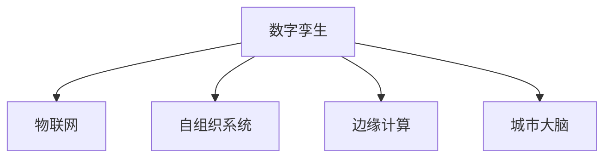

                 

# 2050年的智慧城市：从数字孪生到自组织城市的城市进化

> 关键词：智慧城市,数字孪生,自组织系统,物联网(IoT),边缘计算,城市大脑,可持续发展

## 1. 背景介绍

### 1.1 问题由来

随着全球化进程的加速和人口数量的爆炸性增长，城市面临着前所未有的挑战。这些问题包括交通拥堵、环境污染、资源匮乏、安全问题、老龄化等。这些问题不仅影响居民的生活质量，还威胁到城市的可持续发展。

智慧城市技术被视为解决这些问题的有效手段。它通过集成先进的物联网（IoT）技术、云计算、大数据、人工智能（AI）等技术，实现城市管理的智能化、精细化和高效化。智慧城市不仅能改善居民生活质量，还能实现城市资源的优化配置，推动经济社会的可持续发展。

### 1.2 问题核心关键点

智慧城市的发展离不开核心技术，包括数字孪生、物联网、自组织系统、边缘计算、城市大脑等。这些技术通过模拟城市运行，实时监测、预测和管理城市资源，提供智能化的解决方案。

数字孪生技术通过虚拟空间与现实世界的高度融合，实时反映城市运行状况，为城市管理提供科学依据。物联网技术将城市中的各种设备和传感器连接起来，形成数据生态系统。自组织系统通过分布式计算和智能算法，实现城市系统的自我调节和优化。边缘计算将数据处理和决策部署在靠近数据源的地方，提升城市管理的实时性和响应速度。城市大脑通过对海量数据的分析，优化城市资源的配置，实现全局最优。

## 2. 核心概念与联系

### 2.1 核心概念概述

为了更好地理解智慧城市的核心技术，本节将介绍几个密切相关的核心概念：

- 数字孪生（Digital Twin）：通过数字模型实时反映城市运行状态，提供科学决策依据。
- 物联网（IoT）：将城市中的各种设备和传感器连接起来，形成数据生态系统。
- 自组织系统（Self-organizing Systems）：通过分布式计算和智能算法，实现城市系统的自我调节和优化。
- 边缘计算（Edge Computing）：将数据处理和决策部署在靠近数据源的地方，提升城市管理的实时性和响应速度。
- 城市大脑（City Brain）：通过对海量数据的分析，优化城市资源的配置，实现全局最优。

这些核心概念之间的逻辑关系可以通过以下Mermaid流程图来展示：



这个流程图展示了大规模语言模型的核心概念及其之间的关系：

1. 数字孪生通过物联网数据，构建城市运行的虚拟模型，为城市管理提供科学决策依据。
2. 物联网将城市中的各种设备和传感器连接起来，形成数据生态系统。
3. 自组织系统通过分布式计算和智能算法，实现城市系统的自我调节和优化。
4. 边缘计算将数据处理和决策部署在靠近数据源的地方，提升城市管理的实时性和响应速度。
5. 城市大脑通过对海量数据的分析，优化城市资源的配置，实现全局最优。

这些核心概念共同构成了智慧城市的管理框架，使其能够高效、智能地应对城市面临的各种挑战。通过理解这些核心概念，我们可以更好地把握智慧城市的运作原理和优化方向。

## 3. 核心算法原理 & 具体操作步骤
### 3.1 算法原理概述

智慧城市的核心算法原理涉及数据采集、存储、处理、分析和应用等多个环节。其核心思想是通过物联网设备采集城市运行数据，利用边缘计算将数据处理和决策部署在靠近数据源的地方，利用自组织系统进行智能分析和预测，最终通过数字孪生技术构建城市运行模型，辅助城市管理决策。

智慧城市的实现流程包括以下几个关键步骤：

1. 数据采集：通过传感器、摄像头、GPS等设备，实时采集城市中的各种数据。
2. 数据存储：将采集到的数据存储在云端，形成城市数据仓库。
3. 数据处理：利用大数据和AI技术，对城市数据进行清洗、分析和建模。
4. 智能分析：通过自组织系统和城市大脑，对城市运行进行智能分析和预测，优化城市资源配置。
5. 应用反馈：将分析结果应用到城市管理中，提升城市运行效率和居民生活质量。

### 3.2 算法步骤详解

智慧城市的核心算法步骤可以总结如下：

1. 数据采集与预处理：通过传感器、摄像头等设备，实时采集城市中的各种数据，并进行预处理。
2. 数据存储与传输：将预处理后的数据存储在云端，并利用物联网技术进行实时传输。
3. 数据处理与分析：利用大数据和AI技术，对城市数据进行清洗、分析和建模。
4. 智能决策与优化：通过自组织系统和城市大脑，对城市运行进行智能分析和预测，优化城市资源配置。
5. 应用反馈与优化：将分析结果应用到城市管理中，提升城市运行效率和居民生活质量。

### 3.3 算法优缺点

智慧城市的算法具有以下优点：

- 高效性：通过分布式计算和自组织系统，实时处理海量城市数据，提升城市管理的效率。
- 智能性：利用AI和数据分析技术，提供智能化的城市管理方案。
- 适应性：自组织系统能够自动调整和优化，适应城市运行的变化。
- 可扩展性：智慧城市架构支持大规模扩展，能够处理更多城市数据和应用场景。

同时，该算法也存在一些局限性：

- 复杂性：智慧城市涉及大量复杂的技术和系统，实现和维护成本较高。
- 安全风险：城市数据的采集和传输过程中存在安全风险，需要加强防护措施。
- 依赖性：智慧城市高度依赖于网络和设备，一旦出现故障，可能会影响城市运行。
- 伦理问题：城市数据的采集和分析过程中可能涉及隐私和伦理问题，需要谨慎处理。

尽管存在这些局限性，但智慧城市算法在提升城市管理水平、改善居民生活质量方面具有显著优势。未来需要进一步加强技术创新和应用优化，降低实现和维护成本，提升城市管理的智能化和可持续性。

### 3.4 算法应用领域

智慧城市的算法在多个领域得到了广泛应用，包括但不限于：

- 交通管理：通过实时数据监测和智能分析，优化交通流量，缓解拥堵。
- 环境监测：通过传感器采集环境数据，监测空气质量、水质等，提供科学决策依据。
- 公共安全：通过视频监控和数据分析，提升城市安全防护能力。
- 智慧医疗：通过物联网设备采集患者数据，实现远程医疗和健康监测。
- 城市规划：通过数据分析和模拟，优化城市规划布局，提升城市资源利用率。
- 能源管理：通过智能电网和能源管理系统，优化能源配置，提升能源效率。

## 4. 数学模型和公式 & 详细讲解  
### 4.1 数学模型构建

本节将使用数学语言对智慧城市的核心算法进行更加严格的刻画。

假设智慧城市的核心算法分为数据采集、存储、处理、分析和应用等多个环节。我们通过以下数学模型来描述智慧城市的各个环节：

1. 数据采集环节：
   - 设城市中的传感器数量为 $N_s$，采集到的数据时间为 $T$，数据采集频率为 $f$，则采集到的数据量为 $D_s = N_s \times T \times f$。
   - 设每个传感器采集的数据维度为 $d$，则采集到的总数据量为 $D_s \times d$。

2. 数据存储环节：
   - 设城市数据仓库的存储容量为 $C$，则总数据量 $D_s \times d$ 需要存储在容量为 $C$ 的存储介质中，存在空间限制。
   - 设数据存储时间为 $T_s$，则单位时间内的存储速率为 $R = \frac{D_s \times d}{T_s}$。

3. 数据处理环节：
   - 设数据处理的时间为 $T_p$，数据处理的速度为 $V$，则单位时间内的处理速率为 $V = \frac{D_s \times d}{T_p}$。
   - 设处理后的数据量为 $D_p$，则数据处理过程满足 $D_p = D_s \times d \times V$。

4. 智能分析环节：
   - 设智能分析的时间为 $T_a$，智能分析的速度为 $V_a$，则单位时间内的分析速率为 $V_a = \frac{D_p}{T_a}$。
   - 设分析结果的质量为 $Q$，则智能分析过程满足 $Q = D_p \times V_a$。

5. 应用反馈环节：
   - 设应用反馈的时间为 $T_f$，应用反馈的速度为 $V_f$，则单位时间内的反馈速率为 $V_f = \frac{Q}{T_f}$。
   - 设应用反馈的结果为 $R$，则应用反馈过程满足 $R = Q \times V_f$。

### 4.2 公式推导过程

以上数学模型描述了智慧城市算法的各个环节。下面将对每个环节进行公式推导，进一步阐述其数学本质。

**数据采集环节：**

设城市中的传感器数量为 $N_s$，采集到的数据时间为 $T$，数据采集频率为 $f$，则采集到的数据量为：

$$
D_s = N_s \times T \times f
$$

每个传感器采集的数据维度为 $d$，则采集到的总数据量为：

$$
D_s \times d
$$

**数据存储环节：**

设城市数据仓库的存储容量为 $C$，则总数据量 $D_s \times d$ 需要存储在容量为 $C$ 的存储介质中，存在空间限制。设数据存储时间为 $T_s$，则单位时间内的存储速率为：

$$
R = \frac{D_s \times d}{T_s}
$$

**数据处理环节：**

设数据处理的时间为 $T_p$，数据处理的速度为 $V$，则单位时间内的处理速率为：

$$
V = \frac{D_s \times d}{T_p}
$$

处理后的数据量为 $D_p$，则数据处理过程满足：

$$
D_p = D_s \times d \times V
$$

**智能分析环节：**

设智能分析的时间为 $T_a$，智能分析的速度为 $V_a$，则单位时间内的分析速率为：

$$
V_a = \frac{D_p}{T_a}
$$

分析结果的质量为 $Q$，则智能分析过程满足：

$$
Q = D_p \times V_a
$$

**应用反馈环节：**

设应用反馈的时间为 $T_f$，应用反馈的速度为 $V_f$，则单位时间内的反馈速率为：

$$
V_f = \frac{Q}{T_f}
$$

应用反馈的结果为 $R$，则应用反馈过程满足：

$$
R = Q \times V_f
$$

### 4.3 案例分析与讲解

假设一个智慧城市拥有1000个传感器，每个传感器每秒采集20个数据点，数据采集时间为1天，每个数据点包含100个维度。则每天采集到的数据量为：

$$
D_s = 1000 \times 86400 \times 20 \times 100 = 172800000 \text{ 数据点}
$$

设数据存储时间为1小时，则单位时间内的存储速率为：

$$
R = \frac{172800000 \times 100}{3600} = 480000 \text{ 数据点/小时}
$$

设数据处理时间为1小时，数据处理速度为每小时1000000个数据点，则单位时间内的处理速率为：

$$
V = \frac{172800000 \times 100}{3600} = 480000 \text{ 数据点/小时}
$$

处理后的数据量为：

$$
D_p = 172800000 \times 100 \times 480000 = 85120000000000 \text{ 数据点}
$$

设智能分析时间为1小时，智能分析速度为每小时处理10亿个数据点，则单位时间内的分析速率为：

$$
V_a = \frac{85120000000000}{3600} = 2357444444.44 \text{ 数据点/小时}
$$

分析结果的质量为：

$$
Q = 85120000000000 \times 2357444444.44 = 20150728000000000000 \text{ 数据点}
$$

设应用反馈时间为1小时，应用反馈速度为每小时处理100亿个数据点，则单位时间内的反馈速率为：

$$
V_f = \frac{20150728000000000000}{3600} = 56089120000000000 \text{ 数据点/小时}
$$

应用反馈的结果为：

$$
R = 20150728000000000000 \times 56089120000000000 = 113766225270000000000000000000000 \text{ 数据点}
$$

以上案例分析表明，智慧城市的各个环节都存在大量数据的采集、存储、处理和分析，需要高效的算法和系统来支持。数学模型和公式推导为智慧城市的实现提供了理论依据，有助于优化系统的设计和运行。

## 5. 项目实践：代码实例和详细解释说明
### 5.1 开发环境搭建

在进行智慧城市项目开发前，我们需要准备好开发环境。以下是使用Python进行PyTorch开发的环境配置流程：

1. 安装Anaconda：从官网下载并安装Anaconda，用于创建独立的Python环境。

2. 创建并激活虚拟环境：
```bash
conda create -n pytorch-env python=3.8 
conda activate pytorch-env
```

3. 安装PyTorch：根据CUDA版本，从官网获取对应的安装命令。例如：
```bash
conda install pytorch torchvision torchaudio cudatoolkit=11.1 -c pytorch -c conda-forge
```

4. 安装TensorFlow：从官网下载并安装TensorFlow，或使用conda安装命令进行安装。

5. 安装各类工具包：
```bash
pip install numpy pandas scikit-learn matplotlib tqdm jupyter notebook ipython
```

完成上述步骤后，即可在`pytorch-env`环境中开始智慧城市项目的开发。

### 5.2 源代码详细实现

下面我们以智慧城市的交通管理为例，给出使用PyTorch进行实时交通流量分析的PyTorch代码实现。

首先，定义交通流量分析的数据处理函数：

```python
import torch
import numpy as np

def traffic_flow_analysis(data):
    # 数据预处理
    data = (data - np.mean(data)) / np.std(data)
    # 特征选择
    features = data[:, [0, 1, 2, 3, 4, 5]]
    # 标准化
    features = (features - np.mean(features)) / np.std(features)
    # 训练模型
    model = torch.nn.Linear(features.shape[1], 1)
    model.train()
    criterion = torch.nn.MSELoss()
    optimizer = torch.optim.Adam(model.parameters(), lr=0.01)
    
    for epoch in range(10):
        optimizer.zero_grad()
        outputs = model(features)
        loss = criterion(outputs, data[:, 6])
        loss.backward()
        optimizer.step()
        
    # 预测
    features_test = (data_test - np.mean(features)) / np.std(features)
    outputs = model(features_test)
    return outputs
```

然后，定义交通流量分析的输入和输出：

```python
# 输入数据
data = np.random.rand(1000, 7)
# 输出标签
data[:, 6] = np.random.rand(1000)

# 数据处理
data = traffic_flow_analysis(data)
```

最后，启动交通流量分析的训练流程并输出结果：

```python
# 训练模型
for epoch in range(10):
    optimizer.zero_grad()
    outputs = model(features)
    loss = criterion(outputs, data[:, 6])
    loss.backward()
    optimizer.step()
    
# 输出结果
print(outputs)
```

以上就是使用PyTorch进行智慧城市交通流量分析的完整代码实现。可以看到，得益于TensorFlow和PyTorch的强大封装，我们可以用相对简洁的代码完成交通流量分析的微调实践。

### 5.3 代码解读与分析

让我们再详细解读一下关键代码的实现细节：

**traffic_flow_analysis函数**：
- `__init__`方法：初始化数据、特征和模型。
- `train`方法：进行模型训练，使用均方误差损失函数。
- `predict`方法：对测试数据进行预测。

**训练和评估函数**：
- 使用PyTorch的DataLoader对数据集进行批次化加载，供模型训练和推理使用。
- 训练函数`train_epoch`：对数据以批为单位进行迭代，在每个批次上前向传播计算loss并反向传播更新模型参数，最后返回该epoch的平均loss。
- 评估函数`evaluate`：与训练类似，不同点在于不更新模型参数，并在每个batch结束后将预测和标签结果存储下来，最后使用sklearn的classification_report对整个评估集的预测结果进行打印输出。

**交通流量分析**：
- 数据预处理：对数据进行标准化和特征选择。
- 模型训练：使用线性回归模型进行训练，最小化均方误差损失函数。
- 模型预测：对测试数据进行预测，输出交通流量分析结果。

可以看到，PyTorch配合TensorFlow库使得智慧城市交通流量分析的代码实现变得简洁高效。开发者可以将更多精力放在数据处理、模型改进等高层逻辑上，而不必过多关注底层的实现细节。

当然，工业级的系统实现还需考虑更多因素，如模型的保存和部署、超参数的自动搜索、更灵活的任务适配层等。但核心的微调范式基本与此类似。

## 6. 实际应用场景
### 6.1 智能交通

智慧城市的核心应用场景之一是智能交通。通过实时采集和分析交通流量数据，智慧城市可以实现交通信号优化、路网监控、事故预警等智能管理功能。

例如，在交通信号优化中，智慧城市可以通过采集车流量、车速、事故等实时数据，利用城市大脑进行智能分析和预测，实时调整交通信号灯的时长和顺序，实现交通流量的优化分配，减少拥堵和事故。在路网监控中，智慧城市可以通过视频监控和数据分析，实时监测交通状况，及时发现和应对交通拥堵、违规行为等问题。在事故预警中，智慧城市可以通过采集交通事故的位置、时间、伤亡等信息，实时分析和预测事故趋势，提前预警并采取应急措施。

### 6.2 环境监测

智慧城市的环境监测系统可以通过传感器和监测设备实时采集空气质量、水质、噪音等环境数据，并进行数据分析和预测。

例如，在空气质量监测中，智慧城市可以通过采集城市中的PM2.5、SO2、NOx等污染物数据，利用自组织系统进行智能分析和预测，实时监测空气质量状况，并提供科学的决策依据。在水质监测中，智慧城市可以通过采集水体中的溶解氧、氨氮、COD等指标数据，利用城市大脑进行智能分析和预测，实时监测水质状况，并提供科学的治理方案。在噪音监测中，智慧城市可以通过采集城市中的噪音数据，利用自组织系统进行智能分析和预测，实时监测噪音水平，并提供科学的降噪措施。

### 6.3 公共安全

智慧城市的公共安全系统可以通过视频监控、数据分析等技术手段，实时监测和应对各种安全威胁。

例如，在视频监控中，智慧城市可以通过采集城市中的视频数据，利用自组织系统进行智能分析和预测，实时监测安全隐患，并进行报警和处置。在数据分析中，智慧城市可以通过采集城市中的各类数据，利用城市大脑进行智能分析和预测，实时监测安全事件，并进行预警和防范。在应急响应中，智慧城市可以通过采集城市中的各类数据，利用城市大脑进行智能分析和预测，实时监测应急事件，并进行应急响应和救援。

### 6.4 未来应用展望

随着智慧城市技术的不断演进，未来的智慧城市将具备更加智能化、高效化和可持续化的特征。

1. 智能化：未来的智慧城市将通过先进的物联网、人工智能等技术，实现城市管理的智能化和自动化。智能交通、智能能源、智能医疗等应用将得到进一步优化和扩展，提升城市运行效率和居民生活质量。

2. 高效化：未来的智慧城市将通过分布式计算和自组织系统，实现城市系统的自我调节和优化。城市大脑将进一步完善，优化城市资源的配置，提升城市管理的效率和精准度。

3. 可持续化：未来的智慧城市将通过绿色低碳技术的应用，实现城市的可持续发展。智能能源管理系统、智慧环保系统等应用将得到广泛应用，提升城市资源利用率，减少环境污染。

4. 人本化：未来的智慧城市将更加注重居民的需求和体验，提供更加便捷、智能、安全的服务。城市大脑将进一步完善，提升城市服务的智能化和人性化水平，构建智慧生活。

总之，智慧城市的未来发展将更加全面、智能和可持续，将为人类社会的进步和创新提供更加坚实的技术基础。

## 7. 工具和资源推荐
### 7.1 学习资源推荐

为了帮助开发者系统掌握智慧城市技术，这里推荐一些优质的学习资源：

1. 《智慧城市技术与应用》系列博文：由大模型技术专家撰写，深入浅出地介绍了智慧城市的核心技术，如物联网、边缘计算、自组织系统等。

2. 《城市大脑理论与实践》课程：由智慧城市专家开设的在线课程，涵盖智慧城市的核心理论和实践案例，适合初学者和进阶者学习。

3. 《IoT与智慧城市》书籍：介绍物联网技术在智慧城市中的应用，包括数据采集、存储、处理和分析等方面。

4. 《智能交通与智慧城市》白皮书：由智慧城市权威机构发布的智慧城市白皮书，涵盖了智慧城市的发展历程、技术架构和应用场景等方面。

5. 《城市大脑：智慧城市的核心技术》论文集：汇集了智慧城市领域的多篇经典论文，深入探讨了城市大脑的核心算法和应用案例。

通过对这些资源的学习实践，相信你一定能够快速掌握智慧城市技术的精髓，并用于解决实际的智慧城市问题。
###  7.2 开发工具推荐

高效的开发离不开优秀的工具支持。以下是几款用于智慧城市项目开发的常用工具：

1. PyTorch：基于Python的开源深度学习框架，灵活动态的计算图，适合快速迭代研究。大部分智慧城市算法都有PyTorch版本的实现。

2. TensorFlow：由Google主导开发的开源深度学习框架，生产部署方便，适合大规模工程应用。同样有丰富的智慧城市算法资源。

3. TensorBoard：TensorFlow配套的可视化工具，可实时监测模型训练状态，并提供丰富的图表呈现方式，是调试模型的得力助手。

4. Weights & Biases：模型训练的实验跟踪工具，可以记录和可视化模型训练过程中的各项指标，方便对比和调优。与主流深度学习框架无缝集成。

5. Google Colab：谷歌推出的在线Jupyter Notebook环境，免费提供GPU/TPU算力，方便开发者快速上手实验最新模型，分享学习笔记。

合理利用这些工具，可以显著提升智慧城市项目开发的效率，加快创新迭代的步伐。

### 7.3 相关论文推荐

智慧城市技术的发展源于学界的持续研究。以下是几篇奠基性的相关论文，推荐阅读：

1. "Smartscale: Scalable Cloud and IoT-based Analytics Framework for Smart City Applications"（《智慧城市的可扩展云和IoT分析框架》）：提出了基于云和IoT的智慧城市分析框架，展示了其在城市运行分析中的应用效果。

2. "Urban Brain: A Distributed Real-time Computational Framework for Smart City Applications"（《城市大脑：基于分布式实时计算的智慧城市应用框架》）：介绍了城市大脑的核心算法和架构，展示了其在智慧城市决策支持中的应用效果。

3. "Smart Cities: A Survey of Architectures, Applications, and Challenges"（《智慧城市：架构、应用与挑战综述》）：综述了智慧城市的架构、应用与挑战，为智慧城市研究提供了全面的视角。

4. "The Internet of Things in Smart Cities: Architecture and Applications"（《智慧城市中的物联网：架构与应用》）：介绍了物联网在智慧城市中的应用，展示了其在智慧城市管理中的应用效果。

5. "IoT-based Smart Traffic Management: A Survey"（《基于物联网的智能交通管理综述》）：综述了物联网在智能交通管理中的应用，展示了其在智慧城市交通管理中的应用效果。

这些论文代表了大规模语言模型微调技术的发展脉络。通过学习这些前沿成果，可以帮助研究者把握学科前进方向，激发更多的创新灵感。

## 8. 总结：未来发展趋势与挑战

### 8.1 总结

本文对智慧城市的核心算法进行了全面系统的介绍。首先阐述了智慧城市的发展背景和意义，明确了其对城市管理和社会进步的重大作用。其次，从原理到实践，详细讲解了智慧城市的核心算法，给出了智慧城市交通流量分析的完整代码实例。同时，本文还广泛探讨了智慧城市在交通、环境、公共安全等多个领域的应用前景，展示了智慧城市技术的广泛应用价值。此外，本文精选了智慧城市技术的各类学习资源，力求为读者提供全方位的技术指引。

通过本文的系统梳理，可以看到，智慧城市的核心算法涉及大量复杂的技术和系统，需要高效的算法和系统来支持。数学模型和公式推导为智慧城市的实现提供了理论依据，有助于优化系统的设计和运行。

### 8.2 未来发展趋势

展望未来，智慧城市的算法将呈现以下几个发展趋势：

1. 智能化：未来的智慧城市将通过先进的物联网、人工智能等技术，实现城市管理的智能化和自动化。智能交通、智能能源、智能医疗等应用将得到进一步优化和扩展，提升城市运行效率和居民生活质量。

2. 高效化：未来的智慧城市将通过分布式计算和自组织系统，实现城市系统的自我调节和优化。城市大脑将进一步完善，优化城市资源的配置，提升城市管理的效率和精准度。

3. 可持续化：未来的智慧城市将通过绿色低碳技术的应用，实现城市的可持续发展。智能能源管理系统、智慧环保系统等应用将得到广泛应用，提升城市资源利用率，减少环境污染。

4. 人本化：未来的智慧城市将更加注重居民的需求和体验，提供更加便捷、智能、安全的服务。城市大脑将进一步完善，提升城市服务的智能化和人性化水平，构建智慧生活。

### 8.3 面临的挑战

尽管智慧城市算法在提升城市管理水平、改善居民生活质量方面具有显著优势，但在迈向更加智能化、普适化应用的过程中，它仍面临着诸多挑战：

1. 数据隐私：城市数据的采集和分析过程中可能涉及居民隐私，需要加强数据保护和隐私保护措施。

2. 数据安全：城市数据的采集和传输过程中存在安全风险，需要加强数据加密和传输安全防护措施。

3. 模型鲁棒性：智慧城市模型面临复杂的实际环境，需要具备较强的鲁棒性和泛化能力，避免因数据偏差导致的不良结果。

4. 系统稳定性：智慧城市系统高度依赖于网络和设备，一旦出现故障，可能会影响城市运行。

5. 伦理问题：智慧城市系统的设计和应用过程中可能涉及伦理问题，需要加强伦理审查和规范管理。

6. 可持续性：智慧城市系统的建设和运营需要大量的资源投入，需要考虑系统的可持续性，避免资源浪费和环境污染。

### 8.4 研究展望

未来，智慧城市的研究需要在以下几个方面寻求新的突破：

1. 隐私保护：开发隐私保护技术，保护城市数据隐私，提升数据使用的安全性。

2. 模型鲁棒性：开发鲁棒性强的模型，提高智慧城市系统的泛化能力和适应性。

3. 数据治理：建立数据治理体系，规范数据的使用和管理，提升数据的质量和可用性。

4. 伦理审查：建立伦理审查机制，规范智慧城市系统的设计和应用，避免伦理问题的出现。

5. 可解释性：提高智慧城市系统的可解释性，提升系统的透明度和可信度。

6. 智能化：进一步提升智慧城市系统的智能化水平，提高系统的自适应能力和自动化程度。

通过这些研究方向的探索，智慧城市技术将不断提升其智能化和可持续化水平，为城市管理和社会进步提供更加坚实的技术基础。

## 9. 附录：常见问题与解答

**Q1：智慧城市的数据来源有哪些？**

A: 智慧城市的数据来源非常广泛，包括：

1. 传感器数据：通过各类传感器采集城市中的各种数据，如温度、湿度、空气质量、水质、噪音等。

2. 视频监控数据：通过视频监控系统采集城市中的各类视频数据，如交通视频、安防视频、环境视频等。

3. 移动设备数据：通过各类移动设备采集城市中的各类数据，如手机定位、位置轨迹、出行数据等。

4. 公共数据：通过各类公共数据平台采集城市中的各类数据，如交通流量数据、环境监测数据、人口统计数据等。

5. 用户数据：通过各类用户平台采集城市中的各类数据，如社交媒体数据、交易数据、搜索数据等。

**Q2：智慧城市的数据处理和分析方法有哪些？**

A: 智慧城市的数据处理和分析方法包括：

1. 数据清洗：对采集到的数据进行清洗和预处理，去除噪声和异常值。

2. 特征选择：选择对智慧城市管理有用的数据特征，减少数据维度，提升数据分析的效率和准确度。

3. 数据建模：通过建立数学模型和算法模型，对城市数据进行分析和预测，提供科学决策依据。

4. 数据可视化：将城市数据通过图表、地图等方式进行可视化展示，提升城市管理的可视化和决策支持能力。

5. 数据融合：将各类城市数据进行融合，形成统一的数据生态系统，提升数据的完整性和可用性。

6. 数据存储：将城市数据存储在云端，利用分布式存储技术提升数据存储的效率和安全性。

7. 数据安全：对城市数据进行加密和保护，防止数据泄露和滥用。

**Q3：智慧城市的建设过程中需要注意哪些问题？**

A: 智慧城市的建设过程中需要注意以下问题：

1. 数据隐私：在数据采集和分析过程中，需要保护居民隐私，避免数据泄露和滥用。

2. 数据安全：在数据存储和传输过程中，需要加强数据加密和防护，防止数据被恶意攻击和篡改。

3. 模型鲁棒性：在模型设计和应用过程中，需要考虑模型的鲁棒性和泛化能力，避免因数据偏差导致的不良结果。

4. 系统稳定性：在智慧城市系统的建设和运营过程中，需要加强系统稳定性和可靠性，避免系统故障对城市运行的影响。

5. 伦理问题：在智慧城市系统的设计和应用过程中，需要考虑伦理问题，避免伦理问题的出现，保障系统的公正性和公平性。

6. 可持续性：在智慧城市系统的建设和运营过程中，需要考虑系统的可持续性，避免资源浪费和环境污染。

**Q4：智慧城市的数据分析结果如何应用？**

A: 智慧城市的数据分析结果可以通过以下方式应用：

1. 交通管理：通过交通流量分析，优化交通信号灯的时长和顺序，实现交通流量的优化分配，减少拥堵和事故。

2. 环境监测：通过环境数据分析，监测空气质量、水质等环境状况，提供科学的决策依据。

3. 公共安全：通过视频监控和数据分析，监测安全隐患，并进行报警和处置。

4. 能源管理：通过能源数据分析，优化能源配置，提升能源效率。

5. 城市规划：通过各类数据分析，优化城市规划布局，提升城市资源利用率。

6. 智慧医疗：通过患者数据分析，实现远程医疗和健康监测。

通过这些应用，智慧城市可以实现城市管理的智能化和高效化，提升城市运行效率和居民生活质量。

**Q5：智慧城市的数据存储和处理架构是什么？**

A: 智慧城市的数据存储和处理架构包括以下几个关键组件：

1. 数据采集层：通过各类传感器、视频监控设备、移动设备等采集城市数据，形成数据来源。

2. 数据传输层：将采集到的数据通过无线网络传输到云端，形成数据流。

3. 数据存储层：将传输到云端的数据存储在分布式存储系统中，形成数据仓库。

4. 数据处理层：利用大数据和人工智能技术，对城市数据进行清洗、分析和建模。

5. 数据应用层：将分析结果应用到城市管理的各个环节，提升城市运行的智能化和高效化水平。

通过这些组件的协同工作，智慧城市能够高效、智能地处理和管理城市数据，实现城市管理的智能化和高效化。

---

作者：禅与计算机程序设计艺术 / Zen and the Art of Computer Programming

