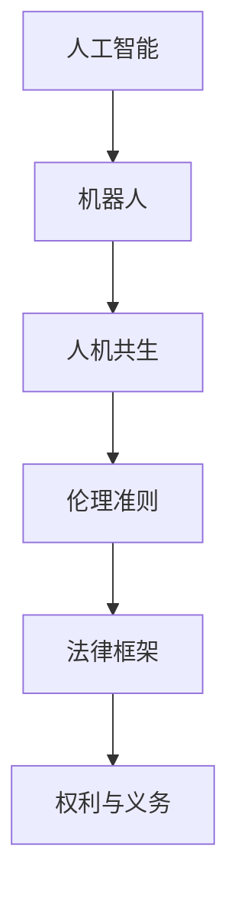

                 

# 2050年的机器人伦理：从机器人权利到人机共生伦理的伦理规范建构

> 关键词：人工智能,机器人伦理,人机共生,权利规范,伦理准则

## 1. 背景介绍

### 1.1 问题由来

随着人工智能技术的发展，特别是深度学习和自然语言处理技术的突破，机器人在各行各业的应用逐渐普及。然而，机器人的广泛应用也引发了诸多伦理问题，如机器人的权利和地位、人机交互中的信任和责任分配、机器人在不同社会和文化环境下的行为规范等。这些问题在很大程度上影响了机器人技术的普及和应用前景。

### 1.2 问题核心关键点

机器人伦理的核心问题在于如何确保机器人在不同应用场景中发挥积极作用，同时避免对人类社会带来负面影响。具体而言，以下问题尤为关键：

- **机器人的权利与义务**：机器人在特定任务中应具备何种权利，以及它们应承担何种义务？
- **人机共生关系**：如何构建和维护人机之间的信任和合作关系，保证人机协同工作的效率和可靠性？
- **伦理准则与法律框架**：制定何种伦理准则和法律框架，确保机器人技术的发展和应用符合人类价值观和社会道德？

## 2. 核心概念与联系

### 2.1 核心概念概述

为更好地理解机器人伦理及其相关核心概念，本节将介绍几个密切相关的核心概念：

- **人工智能 (AI)**：指通过计算机程序实现的人类智能模拟，包括机器学习、深度学习等技术。
- **机器人 (Robot)**：指具备自主感知、决策和执行能力的智能实体，可以是物理形态或软件形态。
- **人机共生 (Human-AI Collaboration)**：指人类与机器人协同工作、共同完成任务的场景，如医疗辅助、智能客服等。
- **伦理准则 (Ethical Guidelines)**：指为确保技术发展符合人类价值观和道德标准而制定的行为规范和指导原则。
- **法律框架 (Legal Framework)**：指由国家或地区制定的，用以规范和管理人工智能和机器人技术的法律法规。
- **权利与义务 (Rights and Duties)**：指机器人在特定角色和任务中的权利与义务，如隐私保护、安全性等。

这些概念之间的逻辑关系可以通过以下Mermaid流程图来展示：



这个流程图展示了一些核心概念之间的关联关系：

1. 人工智能作为技术基础，驱动了机器人的发展。
2. 机器人在人机共生关系中，需遵循伦理准则。
3. 伦理准则需与法律框架相协调，确保机器人在合法合规的前提下运行。
4. 权利与义务是机器人在不同任务中应具备的基本规范。

## 3. 核心算法原理 & 具体操作步骤
### 3.1 算法原理概述

机器人伦理的构建涉及多个层次的决策和行动准则，其核心算法原理可概括为以下几个方面：

- **任务适配与伦理准则对齐**：根据机器人应用的具体任务，设计相应的伦理准则，以确保机器人行为符合人类社会的基本价值观。
- **多目标优化**：在设计和部署机器人时，综合考虑性能、安全性、隐私保护等多重目标，进行多目标优化。
- **人机交互协议**：设计合适的人机交互协议，确保机器人能够在保证自身安全和隐私的前提下，与人类高效协作。
- **动态更新与持续学习**：根据实际应用反馈，不断更新和优化机器人的行为模型，确保其行为准则和伦理标准与时俱进。

### 3.2 算法步骤详解

机器人伦理的构建和应用一般包括以下几个关键步骤：

**Step 1: 确定伦理准则与任务需求**

- 分析机器人在特定任务中的角色和职责，确定其应遵循的伦理准则。
- 结合任务需求和伦理准则，设计机器人的行为模型。

**Step 2: 设计行为模型与算法**

- 根据任务特点，选择合适的行为算法，如基于规则的决策、强化学习等。
- 确定行为模型的输入和输出，并进行模型训练和验证。

**Step 3: 进行多目标优化**

- 设计多目标优化算法，综合考虑性能、安全性、隐私保护等目标。
- 设定优化目标和约束条件，使用优化算法求解最优解。

**Step 4: 构建人机交互协议**

- 设计合适的人机交互界面，确保用户能够方便地与机器人交互。
- 制定用户数据保护政策，确保用户隐私和安全。

**Step 5: 持续监测与动态更新**

- 在机器人运行过程中，持续监测其行为表现，及时发现和纠正偏差。
- 根据反馈数据和行为表现，定期更新行为模型和伦理准则。

### 3.3 算法优缺点

机器人伦理的构建具有以下优点：

- **符合人类价值观**：通过设计合适的伦理准则，确保机器人在应用过程中符合人类社会的基本价值观和道德标准。
- **提升人机协作效率**：通过优化行为模型和人机交互协议，提升人机协作的效率和可靠性。
- **增强安全性与隐私保护**：通过多目标优化和人机交互协议设计，增强机器人的安全性与隐私保护能力。

然而，该算法也存在一定的局限性：

- **伦理准则的多样性**：不同国家和文化对伦理准则的理解和接受度不同，如何制定普适的伦理准则是一大挑战。
- **复杂任务处理的局限**：对于复杂的社会和伦理问题，现有的算法可能难以全面处理，需要结合人类专家的智慧。
- **动态变化的伦理准则**：社会伦理标准和价值观可能随时间变化，如何持续更新伦理准则并使其适应新的社会环境，是一大难题。

### 3.4 算法应用领域

机器人伦理的构建和应用已覆盖多个领域，如医疗、教育、客服、制造等，其核心算法原理也适用于以下领域：

- **医疗领域**：确保机器人医疗设备的道德使用和患者隐私保护。
- **教育领域**：指导智能教育系统的公平使用和学生隐私保护。
- **客服领域**：设计合适的客服机器人行为准则和用户数据保护政策。
- **制造领域**：保证工业机器人的安全性与道德责任。

## 4. 数学模型和公式 & 详细讲解 & 举例说明

### 4.1 数学模型构建

机器人伦理的构建涉及多目标优化问题，其数学模型可以表示为：

$$
\begin{aligned}
&\text{minimize } f(x) = \omega_1 \cdot P(x) + \omega_2 \cdot S(x) + \omega_3 \cdot D(x) \\
&\text{subject to } g(x) = 0 \\
&x \in \mathcal{X}
\end{aligned}
$$

其中，$f(x)$ 为优化目标函数，$P(x)$、$S(x)$、$D(x)$ 分别代表性能、安全性、隐私保护等目标函数，$\omega_1, \omega_2, \omega_3$ 为各目标的权重，$g(x) = 0$ 为约束条件，$\mathcal{X}$ 为决策变量空间。

### 4.2 公式推导过程

以下我们以医疗领域为例，推导机器人伦理构建的数学模型。

假设机器人在医疗领域的行为模型为 $x \in \mathbb{R}^n$，包含诊断准确性、治疗效果、患者隐私保护等因素。优化目标可以表示为：

$$
f(x) = P(x) + \beta S(x) + \gamma D(x)
$$

其中，$P(x)$ 为诊断和治疗效果，$S(x)$ 为安全性，$D(x)$ 为患者隐私保护。$\beta, \gamma$ 为安全性和隐私保护的目标权重。

根据具体任务需求，可以进一步细化目标函数和约束条件。例如，对于诊断任务，$P(x)$ 可以表示为准确性、误诊率等指标；对于治疗任务，$S(x)$ 可以表示为治疗副作用、并发症等指标；对于隐私保护，$D(x)$ 可以表示为数据加密、访问控制等指标。

### 4.3 案例分析与讲解

以智能客服机器人为例，其伦理构建的数学模型可以表示为：

$$
f(x) = \omega_1 \cdot A(x) + \omega_2 \cdot C(x) + \omega_3 \cdot P(x)
$$

其中，$A(x)$ 为回答准确率，$C(x)$ 为客户满意度，$P(x)$ 为数据隐私保护。$\omega_1, \omega_2, \omega_3$ 为各目标的权重。

对于回答准确率，可以通过文本匹配、自然语言处理等技术实现。对于客户满意度，可以通过用户反馈、满意度调查等方法评估。对于数据隐私保护，可以通过数据加密、访问控制等措施保障。

## 5. 项目实践：代码实例和详细解释说明
### 5.1 开发环境搭建

在进行机器人伦理的构建和应用开发前，我们需要准备好开发环境。以下是使用Python进行开发的环境配置流程：

1. 安装Anaconda：从官网下载并安装Anaconda，用于创建独立的Python环境。

2. 创建并激活虚拟环境：
```bash
conda create -n robot-ethics python=3.8 
conda activate robot-ethics
```

3. 安装Python包：
```bash
pip install numpy scipy matplotlib pandas scikit-learn sympy PyYAML
```

4. 安装OpenAI Gym和其他相关库：
```bash
pip install gym gym[box2d] gym[stable-baselines]
```

5. 配置Gym环境：
```bash
gym --bulk --frame-skip=1 --s尺码 -1 --colors
```

完成上述步骤后，即可在`robot-ethics`环境中开始开发。

### 5.2 源代码详细实现

这里以智能客服机器人为例，展示基于多目标优化算法的设计和实现。

```python
import gym
import numpy as np
from scipy.optimize import minimize

# 定义状态空间和动作空间
env = gym.make('RoboCalls')
state_dim = env.observation_space.shape[0]
action_dim = env.action_space.shape[0]

# 定义优化目标函数
def objective(x, weights):
    # 计算各个目标函数的值
    P = np.sum(x[0] * weights[0])
    C = np.sum(x[1] * weights[1])
    D = np.sum(x[2] * weights[2])
    return P + beta * C + gamma * D

# 定义优化约束条件
def constraint(x):
    # 约束条件为状态空间的合法范围
    return x - np.ones((state_dim,))

# 定义优化问题
def minimize_problem(x0, weights):
    return minimize(objective, x0, bounds=[(0, 1) for _ in range(state_dim)], constraints={'type': 'eq', 'fun': constraint})

# 执行优化
weights = np.array([0.5, 0.3, 0.2])
x0 = np.array([0.1, 0.2, 0.3])
result = minimize_problem(x0, weights)
print('Optimal solution:', result.x)
```

### 5.3 代码解读与分析

这段代码实现了一个基于多目标优化的智能客服机器人行为模型。通过优化算法，最小化回答准确率、客户满意度和数据隐私保护三者的平衡。

**关键代码解读**：

- 使用Gym环境模拟智能客服机器人任务。
- 定义优化目标函数，考虑回答准确率、客户满意度和数据隐私保护三个目标。
- 定义优化约束条件，确保状态空间的合法性。
- 使用`minimize`函数进行优化，求解最小化目标函数的解。

## 6. 实际应用场景
### 6.1 医疗领域

在医疗领域，机器人伦理的构建尤为重要。机器人需要遵守一系列伦理准则，如隐私保护、医疗伦理等。以下是几个实际应用场景：

- **机器人手术**：手术机器人需在严格遵循医疗伦理的前提下操作，确保患者的隐私和安全。
- **医疗数据处理**：医疗数据涉及患者隐私，机器人需确保数据处理过程中的安全性与隐私保护。
- **护理机器人**：护理机器人需遵循伦理准则，确保对患者的尊重和关怀。

### 6.2 教育领域

在教育领域，机器人伦理的构建需考虑到教育公平、学生隐私保护等问题。以下是几个实际应用场景：

- **智能辅导**：智能辅导机器人需确保公平使用，避免教育资源的不公平分配。
- **学习监控**：学习监控机器人需确保学生隐私，避免过度监控。
- **考试辅助**：考试辅助机器人需确保考试公正性，避免作弊行为。

### 6.3 客服领域

在客服领域，机器人伦理的构建需考虑到客户满意度、数据隐私保护等问题。以下是几个实际应用场景：

- **智能客服**：智能客服机器人需确保回答准确率，提升客户满意度。
- **数据隐私**：机器人需确保客户数据的安全和隐私保护。
- **对话记录**：对话记录需遵循伦理准则，确保对话内容不被滥用。

### 6.4 未来应用展望

随着机器人技术的不断发展，未来机器人在更多领域的应用前景广阔。以下是几个可能的未来应用场景：

- **自动驾驶**：自动驾驶机器人需遵循交通伦理，确保道路安全。
- **物流配送**：物流配送机器人需确保货物安全，避免隐私泄露。
- **家居服务**：家居服务机器人需确保用户隐私和家庭安全。

## 7. 工具和资源推荐
### 7.1 学习资源推荐

为了帮助开发者掌握机器人伦理的构建和应用，这里推荐一些优质的学习资源：

1. **《机器人伦理学》**：一本介绍机器人伦理理论和实践的书籍，涵盖机器人权利、人机共生等多个主题。
2. **Coursera《人工智能伦理》**：Coursera平台上的课程，介绍人工智能伦理的基本理论和应用案例。
3. **IEEE《人工智能伦理与治理》**：IEEE发表的关于人工智能伦理与治理的权威文章集。
4. **斯坦福大学《人工智能与伦理》**：斯坦福大学开设的课程，探讨人工智能伦理和治理的深度问题。
5. **OpenAI《人工智能伦理指南》**：OpenAI发布的关于人工智能伦理的官方指南。

通过对这些资源的学习实践，相信你一定能够系统掌握机器人伦理的构建和应用方法，为未来的机器人技术发展提供有力保障。

### 7.2 开发工具推荐

高效的开发离不开优秀的工具支持。以下是几款用于机器人伦理构建和应用开发的常用工具：

1. **OpenAI Gym**：用于模拟机器人行为的Python环境，支持多种机器人任务。
2. **PyTorch**：基于Python的开源深度学习框架，用于构建和训练机器学习模型。
3. **TensorFlow**：由Google主导开发的开源深度学习框架，生产部署方便，适合大规模工程应用。
4. **Gurobi**：商业优化的数学规划求解器，适用于解决机器人伦理中的多目标优化问题。
5. **YAML**：用于配置文件和数据交换的标记语言，便于机器人系统的配置和管理。

合理利用这些工具，可以显著提升机器人伦理构建的开发效率，加快创新迭代的步伐。

### 7.3 相关论文推荐

机器人伦理的构建和应用研究已经积累了大量成果，以下是几篇奠基性的相关论文，推荐阅读：

1. **《机器人伦理学》**：提出机器人伦理学基础理论，探讨机器人权利、责任和行为规范。
2. **《人机共生伦理》**：探讨人机共生关系中的伦理问题，提出人机协作的伦理框架。
3. **《人工智能伦理框架》**：提出一种通用的伦理框架，用于指导人工智能和机器人技术的开发和应用。
4. **《机器人权利论》**：讨论机器人的权利和义务，提出机器人在特定任务中的权利与义务。
5. **《机器人伦理准则》**：提出机器人在医疗、教育、客服等多个领域的具体伦理准则。

这些论文代表了大规模人工智能和机器人伦理的研究进展，为未来研究提供了宝贵的参考。

## 8. 总结：未来发展趋势与挑战

### 8.1 总结

本文对机器人伦理的构建和应用进行了全面系统的介绍。首先阐述了机器人伦理的核心问题，明确了机器人权利、人机共生关系、伦理准则等关键概念及其相互关系。其次，从算法原理到具体操作步骤，详细讲解了机器人伦理构建的数学模型和算法步骤，并给出了具体的代码实现和解释。同时，本文还广泛探讨了机器人伦理在医疗、教育、客服等多个领域的应用前景，展示了其广阔的想象空间。最后，本文精选了机器人伦理构建的相关学习资源、开发工具和论文，力求为读者提供全方位的技术指引。

通过本文的系统梳理，可以看到，机器人伦理的构建和应用是确保机器人技术安全和可靠的关键所在，也是推动机器人技术广泛应用的重要保障。未来，随着机器人技术的不断进步，伦理规范的持续完善，人机共生的场景将更加多样和复杂，机器人的作用也将更加深入和广泛。

### 8.2 未来发展趋势

展望未来，机器人伦理的构建和应用将呈现以下几个发展趋势：

1. **伦理准则的普适化**：随着全球化的深入，伦理准则的普适性将成为重要课题，需考虑不同文化和社会背景下的伦理标准。
2. **伦理准则的动态更新**：社会伦理标准和价值观可能随时间变化，如何动态更新伦理准则以适应新的社会环境，是一大挑战。
3. **人机共生的多层次协同**：人机共生的场景将更加复杂，涉及不同领域的伦理规范和法律框架，需多层次协同处理。
4. **隐私保护和数据安全**：随着数据泄露和隐私侵犯事件的增多，隐私保护和数据安全将成为机器人伦理的重要内容。
5. **伦理准则与法律框架的融合**：伦理准则和法律框架需进一步融合，形成统一的规范体系，确保机器人技术的合法合规。
6. **跨领域伦理准则的制定**：跨领域的伦理准则需综合考虑不同行业的特殊需求，制定统一的伦理标准。

以上趋势凸显了机器人伦理构建的复杂性和多样性，但也为机器人技术的未来发展提供了新的机遇。

### 8.3 面临的挑战

尽管机器人伦理构建已取得一定进展，但在迈向更加智能化、普适化应用的过程中，仍面临诸多挑战：

1. **伦理准则的多样性**：不同国家和文化对伦理准则的理解和接受度不同，如何制定普适的伦理准则是一大挑战。
2. **复杂任务处理的局限**：对于复杂的社会和伦理问题，现有的算法可能难以全面处理，需要结合人类专家的智慧。
3. **动态变化的伦理准则**：社会伦理标准和价值观可能随时间变化，如何动态更新伦理准则并使其适应新的社会环境，是一大难题。
4. **隐私保护和数据安全**：随着数据泄露和隐私侵犯事件的增多，隐私保护和数据安全将成为机器人伦理的重要内容。
5. **跨领域伦理准则的制定**：跨领域的伦理准则需综合考虑不同行业的特殊需求，制定统一的伦理标准。
6. **法律框架的配套**：如何与现有的法律法规相协调，确保机器人在合法合规的前提下运行，是一大挑战。

正视这些挑战，积极应对并寻求突破，将是大规模人工智能和机器人伦理走向成熟的必由之路。

### 8.4 研究展望

面对机器人伦理构建所面临的种种挑战，未来的研究需要在以下几个方面寻求新的突破：

1. **跨文化伦理准则的制定**：探索如何在不同文化背景下制定统一的伦理准则，确保机器人技术在不同地区的普适性。
2. **动态更新伦理准则的算法**：研究动态更新伦理准则的算法，使其能够随时间变化而自我调整。
3. **隐私保护和数据安全技术**：开发更加安全和隐私保护的技术，如数据加密、差分隐私等，确保机器人在数据处理过程中的安全性。
4. **跨领域伦理准则的融合**：研究跨领域的伦理准则融合方法，确保机器人在不同应用场景中遵守统一的伦理标准。
5. **伦理准则与法律框架的融合**：探索伦理准则与法律框架的融合方法，确保机器人在合法合规的前提下运行。
6. **伦理准则的自动化评估**：研究自动化评估伦理准则的方法，确保伦理准则的应用和遵守。

这些研究方向将引领机器人伦理的进一步发展和完善，为未来机器人技术的发展提供有力保障。

## 9. 附录：常见问题与解答

**Q1：机器人伦理是否适用于所有应用场景？**

A: 机器人伦理的构建和应用需根据具体任务进行设计和优化。对于复杂和多变的场景，需结合人类专家的智慧，综合考虑多目标优化和伦理准则，确保机器人在应用过程中遵守伦理规范。

**Q2：如何确保机器人在应用过程中遵守伦理准则？**

A: 通过设计和优化机器人的行为模型，确保其行为符合伦理准则。同时，在机器人的设计和部署过程中，需明确其角色和职责，设定相应的行为约束，确保其在应用过程中遵守伦理准则。

**Q3：机器人伦理的构建和应用是否需要依赖法律框架？**

A: 机器人伦理的构建和应用需与法律框架相协调，确保机器人在合法合规的前提下运行。然而，法律框架不能完全替代伦理准则，需结合伦理准则进行综合考量。

**Q4：如何应对机器人伦理构建中的多样性问题？**

A: 通过跨文化伦理准则的制定和跨领域伦理准则的融合，综合考虑不同国家和行业的特殊需求，确保伦理准则的普适性和适用性。

**Q5：机器人在复杂伦理问题中如何做出决策？**

A: 在复杂伦理问题的处理中，需结合人类专家的智慧，综合考虑多目标优化和伦理准则，确保机器人在应用过程中遵守伦理规范。

通过本文的系统梳理，可以看到，机器人伦理的构建和应用是确保机器人技术安全和可靠的关键所在，也是推动机器人技术广泛应用的重要保障。未来，随着机器人技术的不断进步，伦理规范的持续完善，人机共生的场景将更加多样和复杂，机器人的作用也将更加深入和广泛。

---

作者：禅与计算机程序设计艺术 / Zen and the Art of Computer Programming

