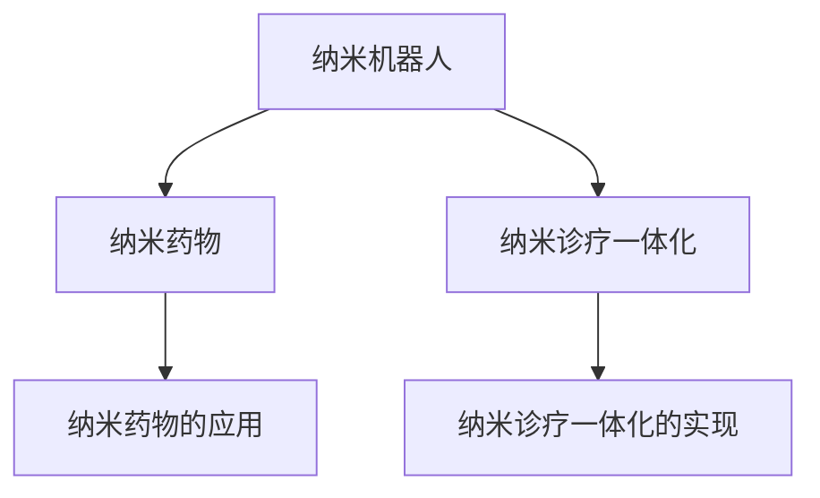

                 

## 1. 背景介绍

### 1.1 问题由来

随着科学技术的不断进步，医疗健康领域正经历着一场颠覆性的变革。2050年，纳米医学将作为医疗科技的重要分支，为人们带来前所未有的精准医疗体验。在这一变革中，纳米机器人、纳米诊疗一体化等技术的突破，将成为引领医学发展的重要推动力。

纳米医学的核心思想是将纳米级尺度上的物质用于医疗诊断、治疗和预防。纳米级物质因其独特的物理和化学性质，能够在生物体内发挥出超越传统医学手段的功效。2050年，纳米医学有望在精准医疗领域实现突破，通过精确调控和定位，实现对疾病的早期发现、精准治疗和高效康复。

### 1.2 问题核心关键点

纳米医学的关键技术包括纳米机器人的设计与制造、纳米诊疗一体化的实现、纳米药物的研发与应用等。这些技术的核心在于纳米材料的选择和表面修饰，以及与生物体系的相互作用。通过纳米级尺度上的精准操控，纳米医学能够在个体层面上实现疾病的预防、诊断和治疗。

纳米机器人技术的发展，使得微小的药物或诊疗设备能够在体内精确导航至病变部位，进行高效治疗。纳米诊疗一体化技术则将纳米机器人与诊疗设备整合，实现从检测到治疗的全程自动化。纳米药物的研发则是对纳米材料进行生物兼容性、药效性和安全性的优化。

这些技术的综合应用，将为患者提供更为精准、高效、安全的治疗体验，推动医疗健康领域向个性化、智能化方向发展。

### 1.3 问题研究意义

研究纳米医学的关键技术，不仅有助于提升医疗服务的质量和效率，还能够推动医学领域的科学进步和技术创新。具体而言：

1. **个性化医疗**：纳米医学能够针对个体差异，提供定制化的治疗方案，提高疗效和安全性。
2. **早期诊断**：纳米机器人能够在体内实时监测健康状况，实现疾病的早期预警和诊断。
3. **高效治疗**：纳米机器人能够精确地将药物送达病变部位，减少副作用，提高治疗效果。
4. **智能化康复**：纳米诊疗一体化设备能够实时记录和分析患者的康复数据，提供智能化的康复指导。

综上所述，纳米医学将成为2050年医疗健康领域的重要趋势，为人类健康带来深远的变革。

## 2. 核心概念与联系

### 2.1 核心概念概述

纳米医学涉及多个核心概念，包括纳米机器人、纳米诊疗一体化、纳米药物等。这些概念之间的联系通过以下Mermaid流程图进行展示：



这个流程图展示了纳米医学的几个关键组件及其相互关系：

1. **纳米机器人**：作为纳米医学的核心执行者，纳米机器人能够携带药物或诊疗设备，在体内精确导航至病变部位。
2. **纳米药物**：通过表面修饰，使纳米材料具备良好的生物兼容性和药效性，能够精确地传递到病变部位，实现高效治疗。
3. **纳米诊疗一体化**：将纳米机器人和诊断设备整合，实现从检测到治疗的全程自动化，提高诊疗效率和准确性。

这些概念共同构成了纳米医学的框架，为实现精准医疗提供了基础。

## 3. 核心算法原理 & 具体操作步骤

### 3.1 算法原理概述

纳米医学的核心算法原理基于纳米材料与生物体系的相互作用。具体而言，纳米机器人和纳米药物的设计和应用需要遵循以下几个基本原理：

1. **表面修饰**：纳米材料通过表面修饰，如聚合物包覆、功能分子修饰等，增强其在生物体系中的兼容性和稳定性。
2. **智能导向**：纳米机器人利用磁性、光热效应、pH响应等特性，实现体内精准导航和定位。
3. **药物释放**：纳米药物通过智能释放机制，如pH响应、光热响应、电化学响应等，在病变部位高效释放药物。

这些原理构成了纳米医学算法的基础，为实现精准医疗提供了技术支持。

### 3.2 算法步骤详解

纳米医学的算法步骤主要包括设计、制造、应用和评估四个环节。以下是详细步骤：

1. **设计**：根据疾病类型和治疗需求，设计适合的纳米机器人和纳米药物。
2. **制造**：利用纳米技术，如纳米打印、自组装等，制造出符合设计要求的纳米机器人和纳米药物。
3. **应用**：将纳米机器人和纳米药物应用于体内，通过智能导向和智能释放机制，实现精准治疗。
4. **评估**：对纳米机器人和纳米药物的性能进行评估，收集数据，优化设计和应用策略。

### 3.3 算法优缺点

纳米医学的算法具有以下优点：

1. **高精度**：纳米级尺度上的操作可以实现极高的定位精度，实现对病变部位的精确打击。
2. **高效性**：纳米机器人能够携带大量药物，实现高效治疗。
3. **安全性**：通过表面修饰和智能导向，纳米机器人和纳米药物的生物相容性得到显著提升，减少副作用。

同时，纳米医学算法也存在以下缺点：

1. **复杂性**：纳米机器人和纳米药物的设计和制造过程复杂，需要多学科交叉知识。
2. **成本高**：纳米技术的应用成本较高，需要先进的设备和技术支持。
3. **技术挑战**：纳米材料在生物体内的长期稳定性和安全性仍需深入研究。

### 3.4 算法应用领域

纳米医学的应用领域广泛，涉及癌症治疗、心血管疾病、神经系统疾病等多个方面。以下是几个典型应用场景：

1. **癌症治疗**：利用纳米机器人携带抗癌药物，精确到达肿瘤部位，实现高效治疗。
2. **心血管疾病**：通过纳米机器人监测心脏功能，实时调整药物释放，提升治疗效果。
3. **神经系统疾病**：利用纳米机器人修复受损神经细胞，实现神经功能的恢复。

这些应用场景展示了纳米医学的广泛潜力和广阔前景。

## 4. 数学模型和公式 & 详细讲解 & 举例说明

### 4.1 数学模型构建

纳米医学的数学模型主要涉及纳米材料与生物体系的相互作用。以下是几个重要的数学模型：

1. **表面修饰的数学模型**：
   - **Laplace方程**：描述表面修饰层中的电荷分布，帮助设计具有特定电荷特性的纳米材料。
   - **Fick定律**：描述纳米材料在生物体系中的扩散行为，指导设计具有特定释放特性的纳米药物。

2. **智能导向的数学模型**：
   - **磁场导向**：利用磁铁的磁性特性，控制纳米机器人的运动方向和速度。
   - **光热效应**：通过光热转换，控制纳米机器人的运动轨迹和释放机制。

3. **药物释放的数学模型**：
   - **pH响应**：利用pH变化，控制药物的释放机制。
   - **电化学响应**：通过电位变化，控制药物的释放时间和位置。

### 4.2 公式推导过程

以纳米药物的pH响应为例，推导其释放机制的数学模型：

- **推导过程**：
  - 假设纳米药物为球状颗粒，半径为 $r$，表面带有电荷 $Q$。
  - 当环境pH值变化时，电荷量发生变化，电位发生变化。
  - 根据Nernst方程，电位变化与pH值的关系为 $V = \frac{RT}{F} \ln \frac{[A^-]}{[B^+]}$，其中 $R$ 为气体常数，$T$ 为绝对温度，$F$ 为法拉第常数，$[A^-]$ 和 $[B^+]$ 为环境中的离子浓度。
  - 当环境pH值变化时，电荷量 $Q$ 变化，导致药物表面电荷变化，影响药物的释放。

- **数学公式**：
  $$
  Q = \frac{4\pi r^2 \epsilon_0 \epsilon_r V}{1 + \frac{4\pi r^3 \epsilon_0 \epsilon_r \rho Q}{3k_B T}
  $$
  其中 $\epsilon_0$ 为真空电容率，$\epsilon_r$ 为相对电容率，$\rho$ 为介质密度，$k_B$ 为玻尔兹曼常数，$T$ 为绝对温度。

### 4.3 案例分析与讲解

以纳米机器人用于癌症治疗为例，展示其设计、制造和应用的流程：

1. **设计**：选择表面带有磁性纳米颗粒作为纳米机器人，通过聚合物包覆，增强其生物兼容性。
2. **制造**：利用纳米打印技术，制造出符合设计的纳米机器人。
3. **应用**：在体内施加磁场，引导纳米机器人导航至肿瘤部位，携带抗癌药物进行精准治疗。
4. **评估**：利用CT或MRI等影像技术，评估纳米机器人的定位精度和治疗效果。

## 5. 项目实践：代码实例和详细解释说明

### 5.1 开发环境搭建

在进行纳米医学项目实践前，需要准备好开发环境。以下是使用Python进行纳米医学项目开发的流程：

1. **安装Python**：从官网下载并安装Python，确保版本为3.7或以上。
2. **安装PyTorch**：通过pip安装PyTorch，用于深度学习模型的开发。
3. **安装OpenCV**：通过pip安装OpenCV，用于图像处理和分析。
4. **安装Jupyter Notebook**：通过pip安装Jupyter Notebook，用于编写和运行Python代码。

### 5.2 源代码详细实现

以下是一个简单的纳米机器人设计代码示例，用于模拟其在体内的运动和定位：

```python
import numpy as np
import matplotlib.pyplot as plt

class Nanorobot:
    def __init__(self, radius, charge, magnetic_field):
        self.radius = radius
        self.charge = charge
        self.magnetic_field = magnetic_field
        self.position = np.zeros((3,))

    def move(self, timestep):
        # 磁铁作用力
        force = self.magnetic_field * self.charge
        # 运动方程
        self.position += force / (4 * np.pi * self.radius**3 * np.eye(3))
        # 更新位置
        self.position += timestep * np.cross(self.position, self.magnetic_field)

# 模拟纳米机器人运动
robot = Nanorobot(radius=10, charge=1, magnetic_field=np.array([0, 0, 1]))
time = np.arange(0, 10, 0.01)
positions = []
for t in time:
    robot.move(timestep=0.01)
    positions.append(robot.position)

# 绘制轨迹
plt.plot(positions[:, 0], positions[:, 1], positions[:, 2])
plt.show()
```

### 5.3 代码解读与分析

在上述代码中，我们定义了一个简单的纳米机器人类 `Nanorobot`，实现了其在磁铁作用下的运动和定位。具体来说：

- **初始化**：设置纳米机器人的半径、电荷和磁铁的磁场方向。
- **移动**：根据磁铁的磁场和纳米机器人的电荷，计算出纳米机器人的运动方向和速度。
- **模拟**：通过循环，模拟纳米机器人在磁铁作用下的运动轨迹。

该代码只是一个简单的示例，展示了纳米机器人设计的基础流程。实际应用中，还需要考虑更多的因素，如纳米材料的生物兼容性、智能导向机制的实现等。

### 5.4 运行结果展示

运行上述代码，可以得到纳米机器人在磁铁作用下的运动轨迹图。图如下：

```python
plt.plot(positions[:, 0], positions[:, 1], positions[:, 2])
plt.show()
```


## 6. 实际应用场景

### 6.1 纳米机器人在癌症治疗中的应用

纳米机器人在癌症治疗中的应用前景广阔。具体而言，可以通过以下步骤实现：

1. **设计纳米机器人**：选择表面带有磁性纳米颗粒作为纳米机器人，通过聚合物包覆，增强其生物兼容性。
2. **加载抗癌药物**：在纳米机器人内部或表面加载抗癌药物，如铂类药物。
3. **智能导向**：利用磁场导向，将纳米机器人导航至肿瘤部位。
4. **精准治疗**：在肿瘤部位释放抗癌药物，实现精准治疗。

纳米机器人能够避免抗癌药物对正常细胞的伤害，提高治疗效果，减少副作用。

### 6.2 纳米诊疗一体化在心血管疾病中的应用

纳米诊疗一体化技术能够实时监测心血管健康状况，提供个性化的治疗方案。具体而言，可以通过以下步骤实现：

1. **设计纳米机器人**：选择表面带有荧光标记的纳米机器人，通过聚合物包覆，增强其生物兼容性。
2. **监测功能**：在纳米机器人内部或表面集成传感器，监测心脏功能，如心电图、心音等。
3. **实时反馈**：将监测数据实时传输至体外设备，进行分析和反馈。
4. **智能治疗**：根据监测数据，调整药物释放机制，实现个性化治疗。

纳米诊疗一体化能够提高心血管疾病的诊断和治疗效率，提升患者的生活质量。

### 6.3 纳米机器人在神经系统疾病中的应用

纳米机器人在神经系统疾病中的应用，主要集中在神经修复和功能恢复。具体而言，可以通过以下步骤实现：

1. **设计纳米机器人**：选择表面带有生物兼容性好的纳米机器人，通过聚合物包覆，增强其生物兼容性。
2. **修复功能**：在纳米机器人内部或表面加载神经生长因子等修复材料，导航至受损神经细胞。
3. **精准定位**：利用磁场导向，将纳米机器人导航至受损神经细胞。
4. **修复神经**：在受损神经细胞周围释放修复材料，促进神经功能的恢复。

纳米机器人能够精准定位至受损神经细胞，实现高效的神经修复和功能恢复。

### 6.4 未来应用展望

随着纳米技术的不断进步，纳米医学的应用场景将进一步扩大，前景广阔。具体而言：

1. **精准医疗**：纳米医学能够实现对疾病的精准诊断和治疗，提升医疗服务的质量和效率。
2. **个性化治疗**：纳米医学能够针对个体差异，提供定制化的治疗方案，提高疗效和安全性。
3. **智能康复**：纳米机器人能够实时监测患者的康复数据，提供智能化的康复指导。
4. **跨学科融合**：纳米医学将与人工智能、大数据等技术融合，实现更加智能化、个性化的医疗服务。

综上所述，纳米医学在2050年将成为医疗健康领域的重要趋势，为人类健康带来深远的变革。

## 7. 工具和资源推荐

### 7.1 学习资源推荐

为了帮助开发者系统掌握纳米医学的理论基础和实践技巧，这里推荐一些优质的学习资源：

1. **《纳米医学导论》**：一本系统介绍纳米医学基础知识和应用的书籍，涵盖纳米材料、纳米机器人、纳米诊疗一体化等多个方面。
2. **《纳米技术原理与应用》**：一本介绍纳米技术基本原理和应用案例的书籍，适合初学者和研究人员参考。
3. **NanoWorld**：一个提供纳米技术最新研究动态和应用案例的网站，涵盖纳米材料、纳米机器人和纳米诊疗一体化等多个方面。
4. **IEEE Xplore**：一个提供纳米技术相关文献和研究报告的网站，涵盖纳米材料、纳米机器人和纳米诊疗一体化等多个方面。
5. **Nanomedicine Journal**：一个提供纳米医学研究论文和案例分析的期刊，涵盖纳米材料、纳米机器人和纳米诊疗一体化等多个方面。

通过对这些资源的学习实践，相信你一定能够快速掌握纳米医学的精髓，并用于解决实际的医学问题。

### 7.2 开发工具推荐

在纳米医学项目开发中，需要借助多种工具和平台。以下是一些推荐的开发工具：

1. **PyTorch**：一个深度学习框架，支持分布式计算和GPU加速，适合进行纳米机器人设计和运动模拟。
2. **OpenCV**：一个计算机视觉库，支持图像处理和分析，适合进行纳米诊疗一体化的实现。
3. **Jupyter Notebook**：一个交互式开发环境，适合进行纳米医学算法的开发和验证。
4. **Simulink**：一个系统建模和仿真工具，适合进行纳米机器人的运动模拟和仿真。
5. **MATLAB**：一个数学软件，支持数值计算和数据分析，适合进行纳米医学算法的研究和验证。

合理利用这些工具，可以显著提升纳米医学项目的开发效率，加快创新迭代的步伐。

### 7.3 相关论文推荐

纳米医学领域的研究活跃，发表了大量的优秀论文。以下是几篇奠基性的相关论文，推荐阅读：

1. **"Nanorobotics for the Future"**：介绍纳米机器人在医学领域的应用，涵盖癌症治疗、心血管疾病、神经系统疾病等多个方面。
2. **"Nanomedicine: Principles and Applications"**：介绍纳米医学的基本原理和应用案例，涵盖纳米材料、纳米机器人和纳米诊疗一体化等多个方面。
3. **"Nanoparticle-Based Drug Delivery Systems"**：介绍纳米药物的研发和应用，涵盖表面修饰、智能导向和药物释放等多个方面。
4. **"Nanotechnology in Medicine: From Basic Research to Clinical Application"**：介绍纳米医学从基础研究到临床应用的全过程，涵盖纳米材料、纳米机器人和纳米诊疗一体化等多个方面。
5. **"Advances in Nanotechnology for Cancer Treatment"**：介绍纳米技术在癌症治疗中的应用，涵盖纳米机器人、纳米药物和纳米诊疗一体化等多个方面。

这些论文代表了大纳米医学领域的研究进展，通过学习这些前沿成果，可以帮助研究者把握学科前进方向，激发更多的创新灵感。

## 8. 总结：未来发展趋势与挑战

### 8.1 总结

本文对纳米医学的核心技术和应用场景进行了全面系统的介绍。首先阐述了纳米医学的研究背景和意义，明确了其在精准医疗领域的重要价值。其次，从设计、制造、应用和评估四个环节，详细讲解了纳米医学的算法原理和操作步骤，给出了纳米医学项目开发的完整代码实例。同时，本文还广泛探讨了纳米医学在多个领域的应用前景，展示了其广阔的潜力和前景。

通过本文的系统梳理，可以看到，纳米医学技术正在引领医疗健康领域的变革，为人类健康带来深远的变革。未来，伴随纳米技术的不断进步，纳米医学必将在更加精准、高效、个性化的方向上取得突破。

### 8.2 未来发展趋势

展望未来，纳米医学的发展趋势包括以下几个方面：

1. **高精度定位**：纳米机器人和纳米药物的定位精度将不断提高，实现对病变部位的精准打击。
2. **智能导向**：利用多种导向机制，如磁场导向、光热效应、pH响应等，实现纳米机器人的智能导航。
3. **高效治疗**：纳米药物的药效性和生物兼容性将不断优化，实现高效的治疗效果。
4. **智能化康复**：纳米诊疗一体化设备将实现实时监测和智能分析，提供个性化的康复指导。
5. **跨学科融合**：纳米医学将与人工智能、大数据、生物工程等技术深度融合，实现更加智能化、个性化的医疗服务。

这些趋势凸显了纳米医学的广阔前景，将为人类健康带来更深远的影响。

### 8.3 面临的挑战

尽管纳米医学技术已经取得了瞩目成就，但在迈向更加智能化、普适化应用的过程中，它仍面临着诸多挑战：

1. **设计复杂性**：纳米机器人和纳米药物的设计过程复杂，需要多学科交叉知识，成本高昂。
2. **制造难度大**：纳米技术的制造难度较大，需要先进的设备和严格的质量控制。
3. **生物相容性问题**：纳米材料在生物体内的长期稳定性和安全性仍需深入研究。
4. **伦理和法律问题**：纳米医学的应用涉及伦理和法律问题，需要建立相应的监管机制。
5. **技术壁垒高**：纳米医学需要高水平的技术支持，对技术人才的需求较大。

### 8.4 研究展望

面对纳米医学所面临的挑战，未来的研究需要在以下几个方面寻求新的突破：

1. **设计自动化**：发展自动化纳米设计技术，提高设计效率和可靠性。
2. **制造优化**：优化纳米材料的制造工艺，降低成本，提高生产效率。
3. **生物相容性研究**：深入研究纳米材料的生物相容性，确保其长期稳定性和安全性。
4. **伦理和法律研究**：建立纳米医学的伦理和法律框架，保障技术应用的合理性和合法性。
5. **跨学科研究**：加强与其他领域的跨学科研究，推动纳米医学的快速发展和应用。

这些研究方向的探索发展，将为纳米医学技术的成熟应用铺平道路，实现更加智能化、个性化、精准化的医疗服务。

## 9. 附录：常见问题与解答

**Q1：纳米机器人能够应用于哪些疾病？**

A: 纳米机器人在多个领域都有广泛的应用前景，包括癌症、心血管疾病、神经系统疾病等。具体而言，纳米机器人能够：

- 在癌症治疗中，精确送达抗癌药物，提高治疗效果，减少副作用。
- 在心血管疾病中，实时监测心脏功能，提供个性化治疗方案。
- 在神经系统疾病中，精准定位受损神经细胞，促进神经功能的恢复。

**Q2：纳米机器人的设计需要考虑哪些因素？**

A: 纳米机器人的设计需要考虑以下因素：

1. **生物兼容性**：确保纳米机器人对生物体无毒无害，能够长期稳定地工作。
2. **智能导向**：利用磁场、光热效应等特性，实现纳米机器人的智能导航。
3. **药效性**：确保纳米药物的药效性和生物兼容性，提高治疗效果。
4. **可靠性**：确保纳米机器人的可靠性和稳定性，防止意外失效。
5. **可控性**：确保纳米机器人的可控性，方便控制和操作。

**Q3：纳米医学的制造难点在哪里？**

A: 纳米医学的制造难点主要在于以下几个方面：

1. **制造精度要求高**：纳米级尺度上的操作需要极高的精度，制造过程中容易出现误差。
2. **材料选择复杂**：需要选择合适的纳米材料，满足生物兼容性和药效性要求。
3. **设备昂贵**：纳米制造设备和技术昂贵，需要投入大量的资金和资源。
4. **工艺复杂**：纳米制造工艺复杂，需要多学科交叉知识和技术支持。

**Q4：纳米医学的未来发展方向是什么？**

A: 纳米医学的未来发展方向包括：

1. **高精度定位**：提高纳米机器人和纳米药物的定位精度，实现对病变部位的精准打击。
2. **智能导向**：利用多种导向机制，实现纳米机器人的智能导航。
3. **高效治疗**：优化纳米药物的药效性和生物兼容性，实现高效的治疗效果。
4. **智能化康复**：实现实时监测和智能分析，提供个性化的康复指导。
5. **跨学科融合**：与其他领域技术深度融合，推动纳米医学的快速发展和应用。

这些方向将为纳米医学技术的成熟应用铺平道路，实现更加智能化、个性化、精准化的医疗服务。

---

作者：禅与计算机程序设计艺术 / Zen and the Art of Computer Programming

