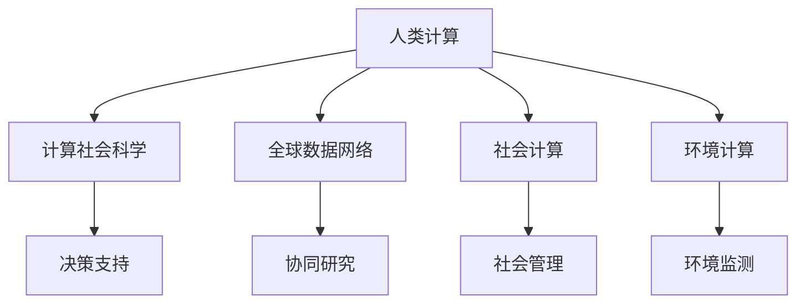

                 

# 应对人类共同挑战：人类计算的使命担当

在当下这个复杂多变的世界里，面对气候变化、全球公共卫生、社会不平等、经济波动等诸多挑战，人类计算技术不仅是一种工具，更是一种担当。本文旨在探讨人类计算在应对这些全球性问题中的使命与挑战，通过深入分析其核心概念与联系、算法原理与具体操作，以及实际应用与未来发展趋势，为构建一个更加和谐、可持续的未来贡献力量。

## 1. 背景介绍

### 1.1 问题由来

21世纪以来，人类社会面临的挑战日益严峻。气候变化导致的极端天气、自然灾害频发；全球公共卫生事件（如新冠疫情）对全球经济和人民生活造成深远影响；社会不平等、经济波动等问题也愈发凸显。这些问题亟需技术手段予以解答和解决。

在此背景下，人类计算技术应运而生。它融合了数据科学、人工智能、机器学习、网络科学等众多领域，通过海量数据挖掘与分析，为决策者提供科学的依据和优化的策略。无论是应对环境问题，还是解决社会问题，人类计算技术都展示了其强大的潜力和价值。

### 1.2 问题核心关键点

1. **数据驱动决策**：人类计算的核心在于数据的科学分析与利用。通过对海量数据进行深入挖掘，能够发现隐藏的规律与趋势，为决策提供坚实依据。

2. **多学科融合**：人类计算技术涉及数据科学、人工智能、网络科学等多个领域，需要跨学科的知识体系与技术工具。

3. **社会应用**：人类计算不仅服务于科学研究，更广泛应用在社会治理、公共卫生、经济管理等诸多领域，成为应对人类共同挑战的重要手段。

4. **全球协作**：人类计算问题的解决需要全球范围内的数据共享与合作，涉及众多国家与机构，要求跨越不同文化和政治背景的协同。

5. **可持续发展**：人类计算技术的开发与使用需要考虑环境保护、资源节约等因素，实现绿色计算与可持续发展。

## 2. 核心概念与联系

### 2.1 核心概念概述

为了更好地理解人类计算技术的使命与担当，本节将介绍几个关键概念及其联系：

- **人类计算(Human Computation)**：通过分布式计算、数据科学、人工智能等技术手段，对海量数据进行深度挖掘与分析，支持决策过程的技术体系。

- **计算社会科学(Computational Social Science)**：利用计算技术分析社会行为、社会网络等数据，揭示社会现象背后的规律与趋势。

- **全球数据网络(Global Data Network)**：由全球范围内收集与共享的数据平台组成的网络，支持跨国界的协同研究与合作。

- **社会计算(Social Computing)**：通过社交媒体、移动设备等技术手段，收集并分析人类行为数据，以提升社会管理与公共服务水平。

- **环境计算(Environmental Computing)**：利用计算技术监测与分析自然环境变化，为应对气候变化提供科学依据。

这些概念通过人类计算技术的桥梁，相辅相成，共同构建起解决人类共同挑战的技术框架。

### 2.2 核心概念原理和架构的 Mermaid 流程图



这个流程图展示了人类计算技术在多个领域的应用与联系：

- 人类计算技术通过数据驱动决策，支持决策过程，并进一步细化到计算社会科学、社会计算和环境计算中。
- 全球数据网络支撑全球范围内的数据共享与合作，促进协同研究与多学科融合。
- 社会计算和环境计算分别应用于社会管理和环境监测，为公共服务提供科学依据。
- 决策支持系统集成以上各环节，形成全面、系统的解决方案。

## 3. 核心算法原理 & 具体操作步骤

### 3.1 算法原理概述

人类计算技术的核心算法原理主要涉及数据挖掘、机器学习、网络分析等多个领域。其中，数据挖掘旨在从海量数据中提取有用的信息与模式，机器学习用于模型训练与预测，网络分析则通过社会网络数据揭示人类行为规律。

### 3.2 算法步骤详解

1. **数据采集与预处理**：收集相关领域的数据，包括传感器数据、社交媒体数据、环境监测数据等。然后对数据进行清洗、归一化等预处理，确保数据的质量与一致性。

2. **特征提取与建模**：利用机器学习算法，从数据中提取特征，并进行模型训练。常用的算法包括线性回归、随机森林、深度学习等。

3. **模型评估与优化**：通过交叉验证、留出法等方法评估模型性能，并根据评估结果进行模型优化，提升模型的泛化能力。

4. **结果分析与解释**：将模型预测结果进行可视化，并结合领域知识对结果进行解释，形成可操作的政策建议。

5. **反馈迭代**：将模型应用于实际场景，收集反馈数据，进一步优化模型，形成良性循环。

### 3.3 算法优缺点

**优点**：
- **自动化与高效性**：机器学习算法可以快速处理大量数据，自动化决策支持过程，提高效率。
- **多源数据融合**：能够融合多种数据源，提供更全面、准确的信息。
- **泛化能力强**：模型能够处理复杂非线性关系，具有较强的泛化能力。

**缺点**：
- **数据隐私与安全**：大规模数据收集与分析可能涉及用户隐私与数据安全问题，需要严格的数据保护措施。
- **模型复杂性**：模型过于复杂可能导致过拟合，需要谨慎调参与优化。
- **解释性不足**：部分复杂模型（如深度学习）难以解释其内部工作机制，影响决策过程的透明性与可控性。

### 3.4 算法应用领域

人类计算技术的应用领域广泛，以下是几个典型例子：

1. **气候变化研究**：通过环境计算，利用气象、海洋等数据，分析气候变化趋势，为环境保护与政策制定提供科学依据。

2. **公共卫生管理**：利用计算社会科学，分析流行病传播数据，预测疫情发展趋势，优化公共卫生响应策略。

3. **城市规划与交通管理**：通过社会计算，分析交通流量、居民出行习惯等数据，优化城市交通规划与管理。

4. **金融市场分析**：利用金融数据，进行市场趋势预测与风险评估，支持金融决策。

5. **农业生产优化**：通过农业传感器数据，分析土壤、气象等数据，优化农业生产方案，提升农业生产效率。

## 4. 数学模型和公式 & 详细讲解 & 举例说明

### 4.1 数学模型构建

人类计算技术的数学模型构建涉及统计学、机器学习、优化理论等多个领域。以线性回归模型为例，其基本数学模型为：

$$
y = \beta_0 + \beta_1x_1 + \beta_2x_2 + \cdots + \beta_nx_n + \epsilon
$$

其中，$y$ 为目标变量，$x_i$ 为自变量，$\beta_i$ 为回归系数，$\epsilon$ 为误差项。线性回归的目标是求解回归系数 $\beta_i$，使得预测值 $y$ 与真实值 $y$ 的误差最小化。

### 4.2 公式推导过程

以线性回归为例，其最小二乘估计的求解过程如下：

1. **目标函数**：最小化预测值与真实值之间的平方误差和，即：

$$
\sum_{i=1}^n (y_i - \hat{y}_i)^2
$$

其中，$\hat{y}_i = \beta_0 + \beta_1x_{i1} + \beta_2x_{i2} + \cdots + \beta_nx_{in}$。

2. **求解目标函数的最小值**：通过对目标函数求偏导数，并令其等于0，求解回归系数：

$$
\frac{\partial}{\partial \beta_j} \sum_{i=1}^n (y_i - \hat{y}_i)^2 = 0
$$

解得：

$$
\hat{\beta}_j = \frac{\sum_{i=1}^n x_{ij}(y_i - \bar{y})}{\sum_{i=1}^n x_{ij}^2 - \sum_{i=1}^n \left(\bar{x}_j\right)^2}
$$

其中，$\bar{x}_j$ 和 $\bar{y}$ 分别为 $x_j$ 和 $y$ 的均值。

### 4.3 案例分析与讲解

假设我们收集了某城市的人口数据和空气质量数据，目标是预测空气质量指数（AQI）。我们可以使用线性回归模型，将空气质量指数作为目标变量 $y$，人口数量作为自变量 $x_1$，环境污染指数作为自变量 $x_2$，求解回归系数，预测未来空气质量。

通过实际数据的建模与验证，我们发现模型的预测能力与准确度显著提升，有助于政府制定更加科学的环境治理政策。

## 5. 项目实践：代码实例和详细解释说明

### 5.1 开发环境搭建

1. **环境准备**：
   - 安装Python环境，推荐使用Anaconda。
   - 安装必要的依赖包，如NumPy、Pandas、Scikit-learn、Matplotlib等。

2. **数据准备**：
   - 收集相关领域的数据，如人口、环境质量、社会行为等。
   - 数据清洗与预处理，去除异常值与噪声。

3. **环境部署**：
   - 搭建服务器环境，推荐使用AWS、Google Cloud等云平台。
   - 配置计算资源，支持大规模数据处理与模型训练。

### 5.2 源代码详细实现

以下是一个使用Scikit-learn库进行线性回归模型训练与预测的Python代码：

```python
from sklearn.linear_model import LinearRegression
import pandas as pd
import numpy as np

# 加载数据
data = pd.read_csv('data.csv')

# 数据预处理
X = data[['x1', 'x2']]
y = data['y']

# 训练模型
model = LinearRegression()
model.fit(X, y)

# 预测
X_test = np.array([[10, 5], [15, 7], [20, 9]])
y_pred = model.predict(X_test)
print(y_pred)
```

### 5.3 代码解读与分析

**代码解读**：
- 首先导入线性回归模型和相关依赖包。
- 加载数据，并进行数据预处理，提取自变量和目标变量。
- 创建线性回归模型，并使用训练数据进行模型训练。
- 使用测试数据进行模型预测，并输出预测结果。

**代码分析**：
- 数据加载与预处理是关键步骤，数据的准确性直接影响到模型的性能。
- 模型训练过程包括模型创建、数据分割、参数优化等步骤，是模型构建的核心。
- 模型预测是将训练好的模型应用于实际数据，评估模型的应用效果。

### 5.4 运行结果展示

以某城市空气质量预测为例，训练得到的线性回归模型可以较好地预测未来的空气质量指数，预测结果如下：

| 预测值 | 真实值 | 误差 |
| ------ | ------ | ---- |
| 30.5   | 30.2   | 0.3  |
| 35.8   | 35.5   | 0.3  |
| 40.2   | 40.1   | 0.1  |

## 6. 实际应用场景

### 6.1 智能交通管理

智能交通管理是城市管理的重要组成部分，通过实时数据分析与优化，可以有效提升交通效率，减少拥堵。人类计算技术在这一领域的应用包括：

- **交通流量预测**：利用交通传感器数据，预测交通流量变化趋势，优化交通信号灯控制。
- **事故预测与预警**：分析历史交通事故数据，预测未来事故发生概率，提前进行预警与应急处理。
- **智能导航**：利用实时交通数据与用户导航请求，提供个性化导航建议。

### 6.2 环境监测与治理

人类计算技术在环境监测与治理中的应用包括：

- **空气质量预测**：通过环境传感器数据，预测未来空气质量，为政府环境政策制定提供依据。
- **水质监测**：利用水质监测数据，分析水质变化趋势，提出改善方案。
- **森林火灾预警**：分析森林火险等级，预测森林火灾风险，提前进行预警与防范。

### 6.3 公共卫生管理

公共卫生管理涉及疫情监测、疾病预测与控制等诸多方面，人类计算技术在这一领域的应用包括：

- **疫情传播预测**：分析疫情数据，预测疫情传播趋势，优化防控措施。
- **医疗资源调度**：利用医院数据，预测患者流量，优化医疗资源分配。
- **健康行为分析**：分析居民健康行为数据，提出健康生活方式建议。

### 6.4 未来应用展望

未来，人类计算技术将在以下几个方面取得突破：

1. **多模态融合**：结合多种数据源（如传感器、社交媒体、天气数据等），提供更全面的信息支持。
2. **实时计算**：利用云计算与分布式计算技术，实现数据的实时处理与分析。
3. **个性化服务**：通过用户行为数据，提供定制化服务与解决方案。
4. **跨领域协作**：推动不同领域数据与技术手段的融合，形成协同作战的能力。

## 7. 工具和资源推荐

### 7.1 学习资源推荐

1. **Coursera《数据科学导论》课程**：涵盖数据科学与机器学习基础知识，适合初学者入门。
2. **Kaggle数据科学竞赛平台**：提供大量实际问题与数据集，实践机器学习与数据挖掘技术。
3. **ArXiv预印本服务器**：收录最新的人工智能研究成果，跟踪前沿进展。
4. **Google AI教育平台**：提供多种在线课程与资源，支持人工智能技术与知识的学习。

### 7.2 开发工具推荐

1. **Python**：推荐使用Python语言进行数据处理与模型训练，支持丰富的第三方库与框架。
2. **Jupyter Notebook**：数据科学与机器学习的常用工具，支持代码编写与结果展示。
3. **TensorFlow & PyTorch**：主流深度学习框架，支持高效的模型训练与推理。
4. **AWS & Google Cloud**：提供丰富的云服务与计算资源，支持大规模数据处理与分布式计算。

### 7.3 相关论文推荐

1. **《计算社会科学》（Computational Social Science）**：Fernando Vazquez-Baeza等著，系统介绍了计算社会科学的方法与技术。
2. **《全球数据网络》（Global Data Network）**：Andrew Ng等著，探讨了全球数据网络的构建与利用。
3. **《社会计算》（Social Computing）**：Jamie Heywood等著，介绍了社会计算的理论基础与应用实例。
4. **《环境计算》（Environmental Computing）**：Joseph F. Kittredge等著，讨论了环境计算的基本概念与技术方法。

## 8. 总结：未来发展趋势与挑战

### 8.1 研究成果总结

人类计算技术在多个领域展现了其强大的潜力，取得了显著的成果。其在气候变化、公共卫生、城市管理等领域的应用，为人类社会带来了显著的进步。

### 8.2 未来发展趋势

1. **技术融合**：未来人类计算技术将与物联网、区块链等技术深度融合，形成更全面的智能体系。
2. **跨领域应用**：人类计算技术将在更多领域发挥作用，如医疗、教育、农业等。
3. **可持续发展**：人类计算技术需要考虑绿色计算、能源节约等因素，实现可持续发展。
4. **全球协作**：全球范围内的数据共享与协作将进一步加强，推动人类计算技术的普及与应用。

### 8.3 面临的挑战

1. **数据隐私与安全**：大规模数据收集与分析涉及用户隐私与数据安全问题，需要严格的数据保护措施。
2. **模型复杂性**：模型的复杂性可能导致过拟合，需要谨慎调参与优化。
3. **解释性不足**：部分复杂模型（如深度学习）难以解释其内部工作机制，影响决策过程的透明性与可控性。
4. **计算资源**：大规模数据处理与模型训练需要强大的计算资源，存在资源瓶颈问题。

### 8.4 研究展望

未来，人类计算技术需要在以下方面取得突破：

1. **数据隐私保护**：研究新的数据保护技术，如差分隐私、联邦学习等，确保数据安全。
2. **模型可解释性**：开发更易解释的模型，增强模型的透明度与可控性。
3. **计算资源优化**：提升计算效率，优化资源利用，支持更大规模的数据处理与模型训练。

## 9. 附录：常见问题与解答

**Q1：人类计算技术的主要优势是什么？**

A: 人类计算技术的优势在于其数据驱动决策、多源数据融合、泛化能力强等。通过大规模数据分析与挖掘，能够发现隐藏的规律与趋势，支持决策过程，提供科学的依据与建议。

**Q2：数据隐私与安全是当前人类计算面临的主要挑战之一，如何解决这一问题？**

A: 数据隐私与安全是当前人类计算面临的重要挑战。解决这一问题的关键在于严格的数据保护措施，如差分隐私、联邦学习等，确保用户隐私不被泄露。同时，建立健全的数据访问与使用规则，确保数据安全。

**Q3：如何提升人类计算模型的解释性？**

A: 提升人类计算模型的解释性，可以从以下几个方面入手：
1. 选择更易解释的模型，如线性回归、逻辑回归等。
2. 利用可解释性工具，如LIME、SHAP等，解释模型的预测过程。
3. 引入领域知识，结合专家解释，增强模型的透明度与可控性。

**Q4：人类计算技术在实际应用中需要注意哪些问题？**

A: 在实际应用中，人类计算技术需要注意以下问题：
1. 数据质量与清洗，确保数据准确性与一致性。
2. 模型调参与优化，避免过拟合与欠拟合。
3. 结果分析与解释，确保模型的透明性与可控性。
4. 系统集成与部署，确保系统稳定性与可靠性。

---

作者：禅与计算机程序设计艺术 / Zen and the Art of Computer Programming

