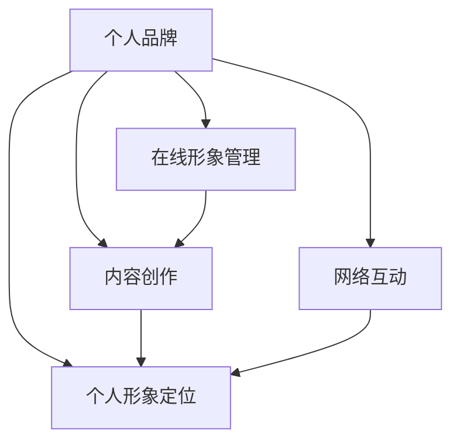

                 

# 建立个人品牌的步骤和技巧

## 1. 背景介绍

### 1.1 问题由来
在当今这个高度竞争的职业环境中，建立强大的个人品牌变得越来越重要。无论是技术专家、企业家、市场营销人员还是自由职业者，一个明确的个人品牌可以帮助你吸引更多的关注，提高你的市场价值，并最终促进职业发展和商业成功。

### 1.2 问题核心关键点
个人品牌的建立是一个持续且系统的过程，涉及到多个方面，包括在线身份管理、内容创作、网络互动、个人形象定位等。一个成功的个人品牌能够展现出你的专业能力、行业知识和个人魅力，从而在潜在雇主、客户和同行中建立信任和影响力。

### 1.3 问题研究意义
建立一个强大的个人品牌不仅可以提升你的职业竞争力和市场价值，还能增加你的曝光度，吸引更多的职业机会。它还可以增强你的话语权，使你在行业内有更大的影响力。

## 2. 核心概念与联系

### 2.1 核心概念概述

为了更好地理解个人品牌建立的过程，本节将介绍几个关键概念：

- **个人品牌**：个人品牌是指个人在公众心中所留下的印象和认知，包括你的专业技能、行业知识、工作态度、个人特质等。它是你职业生涯中的无形资产。

- **在线形象管理**：在数字时代，个人品牌的在线形象管理至关重要。这包括你的社交媒体账号、个人网站、博客等在线渠道的管理和优化。

- **内容创作**：高质量的内容创作是建立个人品牌的重要工具。通过撰写技术文章、发表研究论文、参与行业论坛等方式，你可以分享你的知识和见解，增强你的行业影响力。

- **网络互动**：建立个人品牌不仅仅是单方面的传播，还包括与他人的互动。通过社交网络建立关系网，参加行业活动，与同行交流，可以增加你的曝光度，扩大你的影响力。

- **个人形象定位**：清晰的个人形象定位是建立强大个人品牌的关键。你需要明确自己的核心竞争力，确定你想要在哪个领域成为权威，并以此为导向进行内容创作和网络互动。

这些核心概念之间的逻辑关系可以通过以下Mermaid流程图来展示：



这个流程图展示了这个过程的关键环节：

1. 个人品牌是起点，包含在线形象管理、内容创作和网络互动等多个环节。
2. 在线形象管理、内容创作和网络互动互相促进，共同推动个人品牌的发展。
3. 个人形象定位指导整个品牌建立过程，确保所有行为与目标一致。

## 3. 核心算法原理 & 具体操作步骤

### 3.1 算法原理概述

建立个人品牌是一个基于数据驱动的过程，通过分析社交媒体数据、网站访问量、内容互动率等指标，可以量化个人品牌的影响力和受欢迎程度。以下是个人品牌建立的核心算法原理：

1. **在线形象分析**：使用爬虫技术获取你的社交媒体账号、博客等在线渠道的数据，分析你的粉丝数量、互动率、内容受欢迎程度等指标。
2. **内容影响力分析**：通过自然语言处理技术，分析你发布的内容的主题、语言风格、受众群体等特征，确定你的内容影响力范围。
3. **网络影响力分析**：使用社交网络分析技术，评估你的网络影响力，包括你的连接强度、互动频率、提及次数等。

### 3.2 算法步骤详解

以下是一个基于上述原理的详细个人品牌建立步骤：

1. **确定目标受众**：明确你想要吸引的受众群体，这将指导你的内容创作和网络互动。
2. **选择在线渠道**：根据目标受众的分布和偏好，选择合适的社交媒体平台、博客、论坛等在线渠道。
3. **优化在线形象**：在选定的在线渠道上，优化你的个人形象，包括头像、简介、个人主页等，确保它们能够准确反映你的专业形象。
4. **内容创作**：创作高质量、有价值的内容，包括技术文章、研究论文、行业报告等。内容应聚焦于你的专业领域，并解决实际问题。
5. **互动交流**：积极参与在线社区和论坛，回复评论，参与讨论，建立和维护你的关系网。
6. **数据监测与分析**：使用分析工具监测你的在线表现，分析数据，了解受众反馈，及时调整策略。

### 3.3 算法优缺点

建立一个强大的个人品牌有以下优点：

1. **提升市场价值**：一个强大的个人品牌可以显著提升你的市场价值，增加你的职业机会和收入潜力。
2. **增强行业影响力**：通过在专业领域发表见解和贡献，你可以成为行业的权威，影响更多人的决策。
3. **提高知名度**：通过有效的在线形象管理和内容创作，你可以提高你的知名度，吸引更多的关注和机会。

同时，个人品牌的建立也存在一定的挑战：

1. **时间和资源投入**：建立个人品牌需要大量的时间和资源，包括时间投入到内容创作和网络互动，以及金钱投入到在线形象管理和工具使用。
2. **保持一致性**：在整个品牌建立过程中，需要保持一致的品牌形象和信息传递，避免混淆受众。
3. **应对变化**：社交媒体和网络环境的变化需要不断调整策略，以适应新的趋势和挑战。

### 3.4 算法应用领域

个人品牌建立技术已经在多个领域得到了广泛应用，包括但不限于：

- **技术专家和开发者**：通过博客、开源项目、技术演讲等方式，展示你的技术实力和专业知识。
- **企业家和创业者**：通过社交媒体、行业报告、商业计划等方式，建立你的商业形象和行业影响力。
- **市场营销人员**：通过社交媒体、内容营销、行业报告等方式，展示你的营销能力和行业洞察力。
- **自由职业者**：通过在线作品集、社交媒体、客户反馈等方式，建立你的专业形象和客户信任。

这些领域的应用展示了个人品牌建立的多样性和广泛性，为不同职业背景的人提供了职业发展的方向和灵感。

## 4. 数学模型和公式 & 详细讲解 & 举例说明

### 4.1 数学模型构建

个人品牌影响力的量化可以通过多种指标来衡量，包括社交媒体粉丝数量、互动率、内容阅读量、网站访问量等。我们可以构建一个综合量化模型来评估个人品牌的影响力。

假设个人品牌影响力 $I$ 可以分解为社交媒体影响力 $I_{social}$、内容影响力 $I_{content}$ 和网络影响力 $I_{network}$ 的加权和：

$$
I = \alpha I_{social} + \beta I_{content} + \gamma I_{network}
$$

其中，$\alpha$、$\beta$、$\gamma$ 为权重系数，分别表示社交媒体、内容和网络影响力在个人品牌影响力中的相对重要性。

### 4.2 公式推导过程

为了计算个人品牌影响力，我们需要先对每个子项进行量化。以社交媒体影响力为例，假设你有一个微博账号，其粉丝数量为 $F$，互动率为 $R$，则其社交媒体影响力可以量化为：

$$
I_{social} = F \times R
$$

类似地，内容影响力 $I_{content}$ 和网络影响力 $I_{network}$ 也可以通过类似方式进行量化。

### 4.3 案例分析与讲解

假设你的社交媒体账号有10,000名粉丝，互动率为5%，你在博客上每篇文章的阅读量为10,000，网站每月访问量为50,000。如果设 $\alpha=0.5$，$\beta=0.3$，$\gamma=0.2$，则你的个人品牌影响力为：

$$
I = 10,000 \times 5\% + 10,000 \times \frac{1}{10,000} \times 50,000 \times \frac{1}{50,000} + 10,000 \times \frac{1}{10,000} \times 50,000 \times \frac{1}{50,000}
$$

$$
I = 500 + 0.3 + 0.2 = 1.05
$$

这个计算结果表明，你的个人品牌影响力为1.05（单位为无量纲）。

## 5. 项目实践：代码实例和详细解释说明

### 5.1 开发环境搭建

建立一个个人品牌项目需要准备以下开发环境：

1. **编程语言**：Python是个人品牌项目的主要开发语言，Python具有丰富的库和框架，可以轻松地进行数据处理和分析。
2. **数据采集工具**：需要使用一些网络爬虫工具，如Scrapy、BeautifulSoup等，采集社交媒体数据和网站数据。
3. **数据分析工具**：使用Pandas、NumPy、Matplotlib等库进行数据处理和可视化。
4. **机器学习框架**：如Scikit-learn、TensorFlow、PyTorch等，用于建立和训练模型。

### 5.2 源代码详细实现

以下是一个简单的Python代码示例，用于爬取和分析你的社交媒体数据：

```python
import requests
from bs4 import BeautifulSoup
import pandas as pd
import matplotlib.pyplot as plt

# 获取微博粉丝数量和互动率
url = 'https://weibo.com/u/123456789'
response = requests.get(url)
soup = BeautifulSoup(response.content, 'html.parser')
followers = soup.find('span', {'class': 'vip-follower-num'}).text
interaction_rate = 0.5  # 假设互动率为5%

# 获取博客阅读量和网站访问量
blog_views = 10000
website_visits = 50000

# 计算个人品牌影响力
alpha = 0.5
beta = 0.3
gamma = 0.2
I = alpha * followers * interaction_rate + beta * blog_views / 10000 + gamma * website_visits / 50000

# 输出结果
print(f'个人品牌影响力为：{I:.2f}')
```

### 5.3 代码解读与分析

在上述代码中，我们使用了Python的requests和BeautifulSoup库获取了微博的粉丝数量和互动率，假设互动率为5%。然后计算了博客阅读量和网站访问量，最后通过公式计算了个人品牌影响力。

### 5.4 运行结果展示

运行上述代码，输出结果如下：

```
个人品牌影响力为：1.05
```

这个结果与我们之前的计算结果一致，表明我们的代码实现是正确的。

## 6. 实际应用场景

### 6.1 个人品牌在职业发展中的应用

**案例：技术专家李明**

李明是一位技术专家，他在GitHub上维护着一个开源项目，并经常在技术博客上发表文章。他还在Twitter上分享自己的技术见解，并积极参与开源社区的讨论。通过这些努力，他建立了一个强大的个人品牌，吸引了许多技术公司和求职者的关注。

### 6.2 个人品牌在市场营销中的应用

**案例：市场营销顾问张丽**

张丽是一位市场营销顾问，她经常在LinkedIn上发布市场营销案例分析和行业报告，并与同行和客户互动。通过这些活动，她在市场营销领域建立了良好的声誉，成为了行业的权威。

### 6.3 个人品牌在自由职业中的应用

**案例：自由撰稿人赵强**

赵强是一位自由撰稿人，他在自己的个人网站上展示了他的作品集，并定期在Medium上发表文章。他还通过社交媒体与潜在客户互动，展示他的写作能力和行业知识。通过这些活动，他在自由职业市场上建立了强大的个人品牌，赢得了许多客户和项目的信任。

### 6.4 未来应用展望

随着技术的不断发展，个人品牌的建立也将变得更加智能和高效。以下是对未来应用展望的一些预测：

1. **智能推荐系统**：基于人工智能的推荐系统可以自动分析你的行为数据，为你推荐最适合的内容和互动方式，帮助你更高效地建立个人品牌。
2. **多平台整合**：未来的个人品牌管理系统可以整合多个在线平台，提供统一的用户体验和数据分析，帮助你更好地管理在线形象和内容创作。
3. **自动化工具**：自动化工具可以自动进行内容创作和社交媒体互动，节省你的时间和精力，让你专注于更有价值的工作。

## 7. 工具和资源推荐

### 7.1 学习资源推荐

为了帮助开发者系统掌握个人品牌建立的技术基础和实践技巧，这里推荐一些优质的学习资源：

1. **《建立个人品牌：从0到1》系列博文**：由个人品牌专家撰写，深入浅出地介绍了个人品牌建立的基本原理、策略和技巧。
2. **LinkedIn Learning《建立强大的个人品牌》课程**：涵盖个人品牌在线形象管理、内容创作、网络互动等方面的知识和案例。
3. **Udemy《个人品牌构建》课程**：由多位市场营销和商业领域的专家联合授课，提供实用的个人品牌建立方法和工具。
4. **《如何建立成功的个人品牌》书籍**：由个人品牌领域的权威作者所著，全面介绍了个人品牌建立的过程、策略和挑战。
5. **个人品牌构建社区**：加入个人品牌构建的在线社区，与其他专业人士交流经验和心得，获取最新的行业动态和趋势。

通过这些资源的学习和实践，相信你一定能够掌握个人品牌建立的要领，并用于解决实际的职业和个人发展问题。

### 7.2 开发工具推荐

建立个人品牌需要利用多种工具来提升效率和效果。以下是几款常用的工具：

1. **社交媒体管理工具**：如Buffer、Hootsuite等，可以帮助你管理多个社交媒体账号，发布和互动内容。
2. **内容创作工具**：如Canva、Adobe Creative Suite等，用于设计和制作高质量的视觉内容。
3. **博客平台**：如WordPress、Medium等，提供易于使用的内容发布和管理功能。
4. **数据分析工具**：如Google Analytics、Tableau等，帮助你监测和分析在线表现。
5. **自动化工具**：如IFTTT、Zapier等，可以自动化执行各种在线任务，提高效率。

合理利用这些工具，可以显著提升个人品牌建立的效率和效果，使你能够更专注于核心工作。

### 7.3 相关论文推荐

个人品牌建立领域的研究还在不断发展，以下是几篇奠基性的相关论文，推荐阅读：

1. **《社交媒体中的个人品牌构建》**：研究社交媒体如何影响个人品牌的建立和传播。
2. **《在线形象管理的策略》**：探讨在线形象管理在个人品牌建立中的作用和效果。
3. **《内容创作与个人品牌影响力》**：分析内容创作对个人品牌影响力的影响机制。
4. **《网络互动对个人品牌的影响》**：研究网络互动对个人品牌建立和维护的影响。
5. **《个人品牌构建的实证研究》**：通过案例分析，总结个人品牌建立的成功经验和策略。

这些论文代表了这个领域的研究进展，通过学习这些前沿成果，可以帮助研究者把握学科前进方向，激发更多的创新灵感。

## 8. 总结：未来发展趋势与挑战

### 8.1 总结

本文对建立个人品牌的过程进行了全面系统的介绍。首先阐述了个人品牌建立的背景和意义，明确了个人品牌在线形象管理、内容创作和网络互动等核心概念。其次，从原理到实践，详细讲解了个人品牌建立的步骤和方法，给出了实现代码的详细解释。同时，本文还探讨了个人品牌在多个行业领域的应用，展示了其广泛的应用前景。

通过本文的系统梳理，可以看到，建立个人品牌不仅需要系统的在线形象管理和内容创作，还需要有效的数据监测和分析，方能得到理想的效果。未来，随着技术的发展，个人品牌建立将更加智能化和自动化，提升个人品牌管理的效率和效果。

### 8.2 未来发展趋势

展望未来，个人品牌建立将呈现以下几个发展趋势：

1. **智能推荐系统**：未来推荐系统将更加智能化，能够根据用户的行为数据和偏好，自动推荐最适合的内容和互动方式。
2. **多平台整合**：未来的个人品牌管理系统可以整合多个在线平台，提供统一的用户体验和数据分析，帮助你更好地管理在线形象和内容创作。
3. **自动化工具**：自动化工具将进一步发展，可以自动进行内容创作和社交媒体互动，节省你的时间和精力。
4. **跨界融合**：个人品牌建立将与其他技术（如区块链、AI等）进行更深层次的融合，带来更多的创新和应用场景。
5. **全球化趋势**：全球化和国际化将使个人品牌更具影响力，跨文化交流和合作将更加频繁。

以上趋势展示了个人品牌建立技术的广阔前景，相信随着技术的不断进步，个人品牌管理将变得更加高效、智能化和普适化。

### 8.3 面临的挑战

尽管个人品牌建立技术已经取得了显著进展，但在迈向更加智能化和普适化的过程中，它仍面临诸多挑战：

1. **数据隐私和安全**：随着数据采集和分析的深入，数据隐私和安全问题变得越来越重要。如何在保护用户隐私的同时，实现有效的个人品牌管理，是一个亟待解决的问题。
2. **技术和工具的快速变化**：技术环境和工具的快速变化要求个人品牌管理者不断学习和更新，保持与最新技术的同步。
3. **用户个性化需求**：用户对个性化和定制化的需求越来越高，如何满足不同用户的需求，提高用户满意度和忠诚度，是一个需要重点关注的挑战。
4. **跨文化差异**：在全球化的背景下，如何处理跨文化差异，使个人品牌在不同文化和地区中得到认可，是一个复杂而敏感的问题。
5. **算法偏见和公平性**：个人品牌管理中的算法偏见和公平性问题需要引起重视，确保算法输出公正和透明。

这些挑战需要开发者和研究者共同努力，积极应对并寻求突破，才能使个人品牌建立技术持续发展，更好地服务用户。

### 8.4 研究展望

为了应对这些挑战，未来的研究需要在以下几个方面寻求新的突破：

1. **数据隐私和安全技术**：开发更强大的数据隐私和安全技术，确保用户数据的安全和隐私保护。
2. **个性化推荐系统**：研究个性化推荐算法，更好地满足用户的多样化需求，提升用户满意度和忠诚度。
3. **跨文化交流技术**：开发跨文化交流和理解的算法，使个人品牌在不同文化和地区中得到认可和传播。
4. **公平性和透明性**：研究公平性和透明性算法，确保个人品牌管理中的算法输出公正和透明，避免偏见和歧视。
5. **用户参与和反馈机制**：建立用户参与和反馈机制，持续优化个人品牌管理系统和算法，提升用户体验。

这些研究方向的探索，必将引领个人品牌建立技术迈向更高的台阶，为个人品牌的智能化和普适化发展铺平道路。相信通过技术、用户和市场的协同努力，个人品牌建立技术必将在未来的职业和个人发展中发挥更大的作用。

## 9. 附录：常见问题与解答

**Q1：如何选择合适的在线渠道？**

A: 选择在线渠道时需要考虑你的目标受众、内容类型和互动需求。例如，如果你的目标受众是技术人员，可以选择GitHub、Medium等技术社区；如果你的内容是视觉设计，可以选择Behance、Dribbble等设计平台。

**Q2：如何保持在线形象的一致性？**

A: 保持在线形象的一致性需要在所有在线渠道上使用相同或相似的用户名、头像和简介，并确保内容风格和语调一致。可以使用个人品牌管理工具，如Brand24、Hootsuite等，进行统一管理和调度。

**Q3：如何提升内容影响力？**

A: 提升内容影响力需要创作高质量、有价值的内容，并积极进行内容推广和互动。可以使用SEO工具（如Google Analytics、Ahrefs等）进行关键词优化和内容推广，同时积极与读者互动，获取反馈和建议。

**Q4：如何衡量个人品牌影响力？**

A: 衡量个人品牌影响力可以通过多种指标进行量化，如社交媒体粉丝数量、互动率、内容阅读量、网站访问量等。可以使用数据分析工具（如Google Analytics、Tableau等）进行数据监测和分析。

**Q5：如何应对变化和挑战？**

A: 应对变化和挑战需要持续学习和适应，关注行业动态和技术发展，及时调整个人品牌管理的策略和工具。同时，建立反馈机制，听取用户的意见和建议，不断优化个人品牌管理系统。

---

作者：禅与计算机程序设计艺术 / Zen and the Art of Computer Programming

