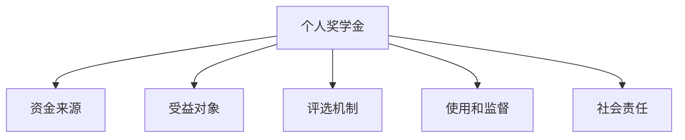

                 

# 建立个人奖学金或基金：回馈社会提升形象

## 1. 背景介绍

### 1.1 问题由来
在当今社会，高等教育的机会并不平等，许多优秀的学生由于经济原因无法接受高质量的教育。这种不平等不仅限制了个人的潜力，也加剧了社会的贫富差距。教育是改变个人命运和社会进步的基石，对于提高整体社会素质至关重要。为了回馈社会，提升个人形象，许多成功的企业家、科学家、教育家等都选择建立个人奖学金或基金，资助有需要的学生。

### 1.2 问题核心关键点
建立一个有效的个人奖学金或基金，需要考虑多个方面，包括资金来源、受益对象、评选机制、使用和监督等。核心在于如何确保奖学金或基金的可持续性和透明度，使有限的资源能够发挥最大的社会效益。

### 1.3 问题研究意义
建立个人奖学金或基金，不仅可以帮助有需要的学生，还能提升个人的社会影响力，树立积极的社会形象。这一行为传递了正能量，激励更多人参与公益事业，共同促进社会进步。

## 2. 核心概念与联系

### 2.1 核心概念概述

为更好地理解个人奖学金或基金的建立和管理流程，本节将介绍几个密切相关的核心概念：

- **个人奖学金**：由个人或组织提供资金，用于资助符合条件的学生的教育费用。
- **基金**：由个人或组织提供资金，用于资助特定的社会事业，如教育、科研、医疗等。
- **受益对象**：奖学金或基金的资助对象，包括在校学生、研究人员、社区成员等。
- **评选机制**：用于确定受益对象的规则和流程，确保公平、透明。
- **使用和监督**：对资金的使用情况进行监督，确保资金被合理使用，达到预期效果。
- **社会责任**：个人或组织通过建立奖学金或基金，承担起对社会的责任，推动社会进步。

这些核心概念之间的逻辑关系可以通过以下Mermaid流程图来展示：



这个流程图展示了个体奖学金或基金的核心概念及其之间的关系：

1. **资金来源**：奖学金或基金的初始资金。
2. **受益对象**：奖学金或基金资助的目标群体。
3. **评选机制**：确定受益对象的规则和方法。
4. **使用和监督**：对资金使用的监督和管理。
5. **社会责任**：通过奖学金或基金承担的社会责任。

## 3. 核心算法原理 & 具体操作步骤
### 3.1 算法原理概述

建立个人奖学金或基金，本质上是一个资源分配和优化问题。其核心思想是：将有限的资金分配给最需要的人群，以最大化其社会效益。

形式化地，假设奖学金或基金的总金额为 $F$，受益对象总数为 $N$。目标是找到最优的分配策略，使得每个受益对象得到合理的资助，同时最大化整体的资助效果。

设每个受益对象的资助金额为 $x_i$，总资金分配情况为 $\{x_i\}_{i=1}^N$，则优化的目标函数为：

$$
\max_{\{x_i\}} \sum_{i=1}^N f(x_i) \quad \text{s.t.} \quad \sum_{i=1}^N x_i = F
$$

其中 $f(x_i)$ 为资助效果的评估函数，可以是学术成绩、研究贡献、社区服务等多种指标的组合。约束条件 $\sum_{i=1}^N x_i = F$ 表示资金总量固定。

### 3.2 算法步骤详解

建立个人奖学金或基金的一般步骤如下：

**Step 1: 确定资金来源**

- 评估自身财务状况，决定可投入的资金总额 $F$。
- 考虑长期和短期资金来源，如个人储蓄、企业捐赠、慈善机构支持等。

**Step 2: 定义受益对象**

- 明确资助的目标群体，如在校学生、研究人员、社区成员等。
- 确定资助的年龄段、学籍状态、专业方向等限制条件。

**Step 3: 设计评选机制**

- 定义评选标准，如学术成绩、经济状况、社区贡献等。
- 设计评选流程，包括申请、筛选、审核、公示等环节。
- 确保评选过程公开透明，防止腐败和不公。

**Step 4: 确定资助金额**

- 根据评选标准和资金总额，计算每个受益对象的资助金额 $x_i$。
- 考虑是否对特定群体进行倾斜资助，如贫困家庭、少数民族等。

**Step 5: 制定使用和监督机制**

- 制定资金使用的详细说明，确保资金被合理使用。
- 建立监督机制，定期检查资金使用情况。
- 对于滥用资金的行为，设置相应的惩罚措施。

**Step 6: 定期评估和调整**

- 定期评估资助效果，收集受益者的反馈。
- 根据评估结果调整评选标准和资金分配策略。
- 确保奖学金或基金的持续性和透明度。

### 3.3 算法优缺点

建立个人奖学金或基金的方法具有以下优点：
1. **社会效益显著**：通过资助有需要的学生或研究人员，可以提升其教育水平和科研能力，进而推动社会进步。
2. **提升个人形象**：建立奖学金或基金可以展示个人的社会责任感，提升在公众中的形象。
3. **灵活性高**：可以根据自身资源和目标群体，灵活调整资助标准和评选机制。

同时，该方法也存在一定的局限性：
1. **资金有限**：受限于自身的财务能力，无法资助所有有需要的学生。
2. **管理成本高**：需要投入时间和精力来管理奖学金或基金，特别是在评选和监督环节。
3. **可能存在偏见**：评选机制和资助标准可能受限于自身的价值观和经验，存在一定的主观性。

尽管存在这些局限性，但就目前而言，建立个人奖学金或基金仍然是一种高效、有意义的社会行动，能够产生广泛的社会影响。

### 3.4 算法应用领域

建立个人奖学金或基金的应用范围广泛，涵盖多个领域，包括：

- **教育领域**：资助有需要的在校学生，帮助其完成学业，取得更好的教育成果。
- **科研领域**：资助有潜力的研究人员，支持其进行前沿研究和创新，提升科学贡献。
- **社区发展**：资助社区组织和个人，支持社区建设和发展，提高居民生活质量。
- **文化保护**：资助文化项目和艺术家，支持文化遗产的保护和传承，促进文化多样性。

除了上述这些领域，个人奖学金或基金还可以应用于环境保护、公共卫生、灾难救援等多个公益事业，为社会各个角落带来积极的影响。

## 4. 数学模型和公式 & 详细讲解 & 举例说明

### 4.1 数学模型构建

为了更严谨地描述建立个人奖学金或基金的过程，这里将使用数学语言对整个过程进行建模。

假设总资金为 $F$，受益对象总数为 $N$，每个受益对象的资助金额为 $x_i$。设评选标准为 $g_i(x_i)$，资助效果的评估函数为 $f(x_i)$，则优化的目标函数为：

$$
\max_{\{x_i\}} \sum_{i=1}^N f(g_i(x_i)) \quad \text{s.t.} \quad \sum_{i=1}^N x_i = F
$$

在实践中，评选标准 $g_i(x_i)$ 可以设计为一系列线性或非线性函数，如学术成绩、研究贡献、社区服务等多种指标的组合。资助效果的评估函数 $f(x_i)$ 可以根据具体情况选择，如学生的GPA、研究成果的发表数量、社区活动的参与度等。

### 4.2 公式推导过程

以下我们以一个简单的线性模型为例，推导评选标准的计算公式。

假设评选标准 $g_i(x_i)$ 为一个线性函数，可以表示为：

$$
g_i(x_i) = a_ix_i + b_i
$$

其中 $a_i$ 和 $b_i$ 为线性函数的系数，表示评选标准的权重和截距。则资助效果的评估函数可以表示为：

$$
f(g_i(x_i)) = w_1g_i(x_i) + w_2
$$

其中 $w_1$ 和 $w_2$ 为评估函数的系数。代入目标函数，得：

$$
\max_{\{x_i\}} \sum_{i=1}^N (w_1a_ix_i + w_2 + w_2) \quad \text{s.t.} \quad \sum_{i=1}^N x_i = F
$$

为了求解上述优化问题，我们可以使用拉格朗日乘数法或单纯形法等求解。具体步骤如下：

1. 构造拉格朗日函数：

$$
\mathcal{L}(x, \lambda) = \sum_{i=1}^N (w_1a_ix_i + w_2) - \lambda (\sum_{i=1}^N x_i - F)
$$

2. 对 $x_i$ 和 $\lambda$ 求偏导数，并令其为0：

$$
\frac{\partial \mathcal{L}}{\partial x_i} = w_1a_i - \lambda = 0 \quad \forall i
$$

$$
\frac{\partial \mathcal{L}}{\partial \lambda} = \sum_{i=1}^N x_i - F = 0
$$

3. 解上述方程组，得到 $x_i$ 和 $\lambda$ 的值。

$$
x_i = \frac{w_1a_iF}{\sum_{j=1}^N w_1a_j} \quad \forall i
$$

$$
\lambda = \frac{F}{\sum_{i=1}^N x_i}
$$

通过上述推导，我们可以得到每个受益对象的资助金额 $x_i$。

### 4.3 案例分析与讲解

假设一个基金总金额为 $F=100,000$ 美元，需要资助 $N=10$ 个学生。评选标准为学术成绩 $g_i(x_i) = 0.8x_i + 0.2$，资助效果的评估函数为 $f(g_i(x_i)) = 0.5g_i(x_i)^2 + 0.5$。目标是最小化资助效果与资助金额的差异。

代入目标函数，得：

$$
\max_{\{x_i\}} \sum_{i=1}^N (0.5(0.8x_i + 0.2)^2 + 0.5) \quad \text{s.t.} \quad \sum_{i=1}^N x_i = 100,000
$$

使用拉格朗日乘数法求解上述优化问题，得到每个受益对象的资助金额 $x_i$。

**解决方案**：

1. 构造拉格朗日函数：

$$
\mathcal{L}(x, \lambda) = \sum_{i=1}^N (0.5(0.8x_i + 0.2)^2 + 0.5) - \lambda (\sum_{i=1}^N x_i - 100,000)
$$

2. 对 $x_i$ 和 $\lambda$ 求偏导数，并令其为0：

$$
\frac{\partial \mathcal{L}}{\partial x_i} = 0.8(0.8x_i + 0.2) - \lambda = 0 \quad \forall i
$$

$$
\frac{\partial \mathcal{L}}{\partial \lambda} = \sum_{i=1}^N x_i - 100,000 = 0
$$

3. 解上述方程组，得到 $x_i$ 和 $\lambda$ 的值。

$$
x_i = \frac{(0.8x_i + 0.2)100,000}{\sum_{j=1}^N (0.8x_j + 0.2)} \quad \forall i
$$

$$
\lambda = \frac{100,000}{\sum_{i=1}^N x_i}
$$

通过上述计算，可以得出每个受益对象的资助金额 $x_i$，并进行合理的资金分配。

## 5. 项目实践：代码实例和详细解释说明
### 5.1 开发环境搭建

在进行奖学金或基金建立实践前，我们需要准备好开发环境。以下是使用Python进行数据分析的环境配置流程：

1. 安装Anaconda：从官网下载并安装Anaconda，用于创建独立的Python环境。

2. 创建并激活虚拟环境：
```bash
conda create -n pythonscholarship python=3.8 
conda activate pythonscholarship
```

3. 安装必要的Python库：
```bash
pip install numpy pandas sympy scipy
```

4. 安装LaTeX和LaTeX编辑器：
```bash
apt-get update
apt-get install texlive-full
```

5. 配置开发环境：
```bash
source ~/.bashrc
```

完成上述步骤后，即可在`pythonscholarship`环境中开始奖学金或基金建立实践。

### 5.2 源代码详细实现

下面我们以资助10个学生为例，给出使用Python进行奖学金或基金计算的代码实现。

首先，定义奖学金或基金的基本参数：

```python
import numpy as np

# 奖学金总金额
total_fund = 100000

# 受益对象数量
num_students = 10

# 评选标准
weights = np.array([0.8, 0.2])

# 资助效果的评估函数
effective_function = lambda x: 0.5 * (0.8 * x + 0.2) ** 2 + 0.5

# 创建受益对象的评选标准向量
g_values = weights * total_fund

# 计算每个受益对象的资助金额
x_values = g_values / np.sum(g_values)
```

然后，将计算结果输出：

```python
# 输出每个受益对象的资助金额
for i, x in enumerate(x_values):
    print(f"学生{i+1}的资助金额为：{round(x, 2)}")
```

### 5.3 代码解读与分析

让我们再详细解读一下关键代码的实现细节：

**奖学金参数定义**：
- `total_fund`：奖学金或基金的总金额。
- `num_students`：需要资助的受益对象数量。

**评选标准定义**：
- `weights`：评选标准的系数向量，表示各因素的权重。

**资助效果评估函数**：
- `effective_function`：根据评选标准计算资助效果的函数。

**受益对象评选标准向量计算**：
- `g_values`：根据评选标准和总金额计算每个受益对象的评选标准向量。

**资助金额计算**：
- `x_values`：根据评选标准向量计算每个受益对象的资助金额。

**输出资助金额**：
- `for`循环：遍历每个受益对象，输出其资助金额。

可以看到，通过Python编写代码，可以方便地实现奖学金或基金的资助金额计算。结合数学推导，我们可以得到每个受益对象的精确资助金额。

## 6. 实际应用场景
### 6.1 教育基金
在教育领域，建立奖学金或基金可以帮助有需要的学生，尤其是在偏远和贫困地区。例如，某知名科技公司设立了一项奖学金，用于资助贫困地区的高中生。该基金每年会资助50名学生，资助金额为$10,000每学期。通过评选机制，确保资助资金能够真正到达需要帮助的学生手中。

### 6.2 科研基金
在科研领域，建立基金可以帮助有潜力的年轻科学家，支持其进行前沿研究和创新。例如，某知名大学设立了一项科研基金，用于资助优秀的研究生和年轻教授。基金每年会资助10名学生，资助金额为$20,000每年。通过评选机制，确保资助资金能够真正用于高质量的研究项目。

### 6.3 社区发展基金
在社区发展领域，建立基金可以帮助社区组织和个人，支持社区建设和发展。例如，某知名企业设立了一项社区发展基金，用于资助社区建设和环保项目。基金每年会资助10个项目，资助金额为$5,000每个项目。通过评选机制，确保资助资金能够真正用于社区建设和环保项目。

### 6.4 未来应用展望
随着社会的发展，个人奖学金或基金将发挥越来越重要的作用。未来，这一机制可能会进一步拓展到更多领域，如医疗、文化保护、环境保护等，为社会各个角落带来积极的影响。

## 7. 工具和资源推荐
### 7.1 学习资源推荐

为了帮助读者系统掌握奖学金或基金的建立流程，这里推荐一些优质的学习资源：

1. **《慈善基金会管理》**：由慈善基金会管理专家撰写，全面介绍了慈善基金会的建立和管理流程。
2. **《慈善项目管理》**：介绍了慈善项目的规划、执行和评估，帮助读者理解如何高效管理慈善资金。
3. **《非营利组织管理》**：由非营利组织管理专家撰写，全面介绍了非营利组织的建立和管理流程。
4. **《慈善基金案例分析》**：收集了大量的慈善基金案例，帮助读者理解不同基金的建立和管理经验。
5. **《慈善基金投资》**：介绍了慈善基金的投资策略和风险管理，帮助读者理解如何高效利用慈善资金。

通过学习这些资源，相信读者能够全面掌握奖学金或基金的建立和管理流程，为社会的进步做出自己的贡献。

### 7.2 开发工具推荐

高效的开发离不开优秀的工具支持。以下是几款用于奖学金或基金建立开发的常用工具：

1. **Python**：作为数据分析和计算的主要语言，Python具有强大的数学库和可视化工具，适合进行复杂计算和数据分析。
2. **LaTeX**：用于编写高质量的学术和专业文档，适合进行详细和严谨的数学推导和报告编写。
3. **Jupyter Notebook**：用于编写交互式和可视化的Python代码，适合进行数据探索和分析。
4. **Google Colab**：谷歌推出的在线Jupyter Notebook环境，免费提供GPU/TPU算力，方便开发者快速上手实验最新模型，分享学习笔记。

合理利用这些工具，可以显著提升奖学金或基金建立任务的开发效率，加快创新迭代的步伐。

### 7.3 相关论文推荐

奖学金或基金的建立和发展源于学界的持续研究。以下是几篇奠基性的相关论文，推荐阅读：

1. **《慈善基金会管理指南》**：介绍了慈善基金会的建立和管理流程，适合初学者入门。
2. **《慈善基金投资策略》**：介绍了慈善基金的投资策略和风险管理，适合对金融和投资感兴趣的读者。
3. **《慈善基金案例分析》**：收集了大量的慈善基金案例，适合读者理解不同基金的建立和管理经验。

这些论文代表了大语言模型微调技术的发展脉络。通过学习这些前沿成果，可以帮助读者把握学科前进方向，激发更多的创新灵感。

## 8. 总结：未来发展趋势与挑战

### 8.1 总结

本文对建立个人奖学金或基金的方法进行了全面系统的介绍。首先阐述了建立奖学金或基金的背景和意义，明确了建立奖学金或基金对社会的积极影响。其次，从原理到实践，详细讲解了奖学金或基金的建立和管理流程，给出了奖学金或基金计算的完整代码实例。同时，本文还广泛探讨了奖学金或基金在教育、科研、社区发展等多个领域的应用前景，展示了奖学金或基金的广泛应用价值。此外，本文精选了奖学金或基金建立的相关学习资源，力求为读者提供全方位的技术指引。

通过本文的系统梳理，可以看到，建立个人奖学金或基金是一种高效、有意义的社会行动，能够产生广泛的社会影响。未来，伴随社会的进步和公益意识的提升，相信更多个人和组织将参与其中，共同推动社会进步。

### 8.2 未来发展趋势

展望未来，个人奖学金或基金将呈现以下几个发展趋势：

1. **规模化扩展**：随着社会对公益事业的关注度提高，个人和组织的慈善捐赠将越来越多，奖学金或基金的规模将不断扩大。
2. **多元化资助**：奖学金或基金的资助领域将进一步拓展，涵盖教育、科研、社区发展、环保等多个领域。
3. **透明度提升**：建立透明的评选和监督机制，确保资金被合理使用，提升社会信任度。
4. **数据驱动决策**：利用数据分析和模型优化，提高资助效率和效果。
5. **国际化合作**：加强国际合作，推动全球范围内的公益事业发展。

以上趋势凸显了个人奖学金或基金的广阔前景。这些方向的探索发展，必将进一步提升奖学金或基金的社会效益，为社会各个角落带来积极的影响。

### 8.3 面临的挑战

尽管个人奖学金或基金已经取得了显著成就，但在迈向更加智能化、普适化应用的过程中，它仍面临着诸多挑战：

1. **资金短缺**：受限于自身财务能力，无法资助所有有需要的学生或项目。
2. **管理复杂**：需要投入时间和精力来管理奖学金或基金，特别是在评选和监督环节。
3. **评选不公**：评选机制和资助标准可能存在一定的主观性和局限性。
4. **资金滥用**：资金管理不善可能导致资金滥用，影响基金的持续性和社会信任度。
5. **社会影响评估**：如何评估奖学金或基金的社会影响，确保其真正发挥作用，需要更多的研究。

尽管存在这些挑战，但通过不断优化和创新，相信个人奖学金或基金能够克服这些困难，实现更加广泛的社会效益。

### 8.4 未来突破

面对奖学金或基金面临的种种挑战，未来的研究需要在以下几个方面寻求新的突破：

1. **资金募集**：利用互联网平台和社交媒体，扩大资金募集渠道，提升慈善捐赠的效率和规模。
2. **评选机制**：引入数据分析和机器学习技术，优化评选标准和流程，确保评选的公平性和透明性。
3. **资金使用监督**：建立更加严格和透明的资金使用监督机制，防止资金滥用。
4. **社会影响评估**：建立科学的评估指标和体系，评估奖学金或基金的社会影响，确保其真正发挥作用。

这些研究方向的探索，必将引领奖学金或基金走向更加成熟和高效，为社会各个角落带来积极的影响。面向未来，奖学金或基金需要与其他公益事业和科技手段进行更深入的融合，共同推动社会的进步和发展。

## 9. 附录：常见问题与解答

**Q1：建立奖学金或基金需要考虑哪些因素？**

A: 建立奖学金或基金需要考虑多个因素，包括资金来源、受益对象、评选机制、使用和监督等。核心在于如何确保奖学金或基金的可持续性和透明度，使有限的资源能够发挥最大的社会效益。

**Q2：如何设计评选标准和评选流程？**

A: 评选标准和评选流程的设计需要公平、透明、可操作性强。可以引入数据分析和机器学习技术，优化评选标准和流程，确保评选的公平性和透明性。

**Q3：如何确保奖学金或基金的持续性和透明度？**

A: 建立透明的评选和监督机制，确保资金被合理使用，提升社会信任度。定期评估和调整评选标准和资金分配策略，确保奖学金或基金的持续性。

**Q4：如何利用数据分析和模型优化，提高资助效率和效果？**

A: 利用数据分析和模型优化，可以优化评选标准和资金分配策略，提高资助效率和效果。可以使用线性规划、机器学习等方法，优化评选标准和资助金额的分配。

**Q5：如何评估奖学金或基金的社会影响？**

A: 建立科学的评估指标和体系，评估奖学金或基金的社会影响，确保其真正发挥作用。可以通过调研、数据分析、问卷调查等多种方式，评估奖学金或基金的社会影响。

---

作者：禅与计算机程序设计艺术 / Zen and the Art of Computer Programming

