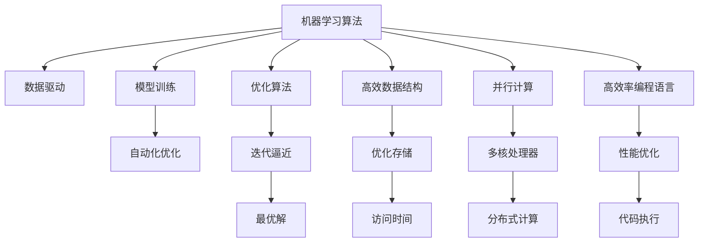

                 

# 开发新算法：提高人类计算的效率

> 关键词：人类计算效率，新算法，机器学习，优化算法，数据结构，高效率计算，程序设计，人工智能

## 1. 背景介绍

### 1.1 问题由来

在现代社会中，人类计算效率的提升已经成为了推动科技进步和经济发展的重要驱动力。无论是科学研究、工程技术、还是金融交易等领域，对计算速度和精度的需求都在不断增长。然而，随着计算任务复杂度的提高和数据量的爆炸性增长，传统计算方法已经难以满足这些需求。

为了应对这一挑战，研究人员和工程师们开始探索新的算法和技术，以提高人类计算的效率。这其中，机器学习、优化算法和高效数据结构等技术，成为了提高计算效率的关键手段。本文将详细探讨这些技术的核心概念和应用实践，帮助读者理解如何开发高效、高性能的计算算法。

### 1.2 问题核心关键点

当前，提高人类计算效率的技术主要集中在以下几个方面：

1. **机器学习算法**：利用数据驱动的方法，通过训练模型，自动化地优化计算过程，减少人工干预，提高计算精度和速度。
2. **优化算法**：针对具体问题，设计高效的算法，通过迭代优化，不断逼近最优解，提高计算效率。
3. **高效数据结构**：选择合适的数据结构，优化存储和访问方式，减少数据操作时间，提高计算效率。
4. **并行计算**：利用多核处理器和分布式计算，实现并行计算，提高计算速度和处理能力。
5. **高效率编程语言和工具**：使用高性能编程语言和工具，如C++、Fortran等，以及高性能计算库，如OpenMP、CUDA等，提高代码执行效率。

这些技术的综合应用，可以为复杂计算任务提供高效的解决方案，显著提升计算效率和精度。

## 2. 核心概念与联系

### 2.1 核心概念概述

为更好地理解提高计算效率的核心技术，本节将介绍几个关键概念及其相互联系：

- **机器学习算法**：基于数据驱动的方法，通过训练模型，自动化地优化计算过程，减少人工干预，提高计算精度和速度。
- **优化算法**：针对具体问题，设计高效的算法，通过迭代优化，不断逼近最优解，提高计算效率。
- **高效数据结构**：选择合适的数据结构，优化存储和访问方式，减少数据操作时间，提高计算效率。
- **并行计算**：利用多核处理器和分布式计算，实现并行计算，提高计算速度和处理能力。
- **高效率编程语言和工具**：使用高性能编程语言和工具，如C++、Fortran等，以及高性能计算库，如OpenMP、CUDA等，提高代码执行效率。

这些核心概念之间的逻辑关系可以通过以下Mermaid流程图来展示：



这个流程图展示了一些关键概念及其相互关系：

1. 机器学习算法基于数据驱动，通过模型训练实现自动化优化。
2. 优化算法通过迭代逼近，不断优化计算过程，提高效率。
3. 高效数据结构优化存储和访问，减少数据操作时间。
4. 并行计算利用多核和分布式计算，提高计算速度和处理能力。
5. 高效率编程语言和工具提升代码执行效率，进一步优化计算过程。

这些概念共同构成了提高人类计算效率的框架，帮助开发者设计和实现高效的计算算法。

## 3. 核心算法原理 & 具体操作步骤
### 3.1 算法原理概述

提高人类计算效率的核心算法原理主要包括以下几个方面：

- **机器学习算法**：通过训练模型，自动化地优化计算过程，减少人工干预，提高计算精度和速度。
- **优化算法**：针对具体问题，设计高效的算法，通过迭代优化，不断逼近最优解，提高计算效率。
- **高效数据结构**：选择合适的数据结构，优化存储和访问方式，减少数据操作时间，提高计算效率。
- **并行计算**：利用多核处理器和分布式计算，实现并行计算，提高计算速度和处理能力。
- **高效率编程语言和工具**：使用高性能编程语言和工具，如C++、Fortran等，以及高性能计算库，如OpenMP、CUDA等，提高代码执行效率。

### 3.2 算法步骤详解

下面将详细讲解各个核心算法的操作步骤：

#### 3.2.1 机器学习算法

机器学习算法的步骤一般包括以下几个关键步骤：

1. **数据预处理**：清洗、归一化、标准化等数据预处理，确保数据质量。
2. **模型选择**：根据问题特点，选择合适的模型架构，如线性回归、神经网络、支持向量机等。
3. **模型训练**：利用训练集数据，通过梯度下降等优化算法，不断调整模型参数，使其逼近最优解。
4. **模型评估**：使用验证集数据，评估模型性能，调整模型参数，防止过拟合。
5. **模型应用**：在测试集上测试模型性能，进行实际应用，优化模型结构，提高计算效率。

#### 3.2.2 优化算法

优化算法的操作步骤一般包括以下几个关键步骤：

1. **问题定义**：明确优化目标和约束条件，定义优化问题。
2. **初始化**：设定初始解，如随机初始化、梯度下降等。
3. **迭代求解**：使用迭代算法，如梯度下降、牛顿法等，不断逼近最优解。
4. **优化策略**：采用一些优化策略，如步长调整、截断梯度、局部搜索等，提高算法效率。
5. **结果评估**：评估优化结果，判断是否满足要求，决定是否继续迭代。

#### 3.2.3 高效数据结构

高效数据结构的操作步骤一般包括以下几个关键步骤：

1. **数据类型选择**：根据数据特点，选择合适的数据类型，如数组、链表、哈希表等。
2. **存储结构设计**：设计高效的存储结构，减少内存占用和访问时间。
3. **数据操作优化**：优化数据操作，如排序、查找、更新等，提高数据操作效率。
4. **空间复用**：利用缓存、池化等技术，提高数据访问效率。
5. **并行化设计**：设计并行化数据结构，如分布式哈希表、并行数组等，提高数据操作效率。

#### 3.2.4 并行计算

并行计算的操作步骤一般包括以下几个关键步骤：

1. **任务分解**：将计算任务分解成多个子任务，分配到不同的处理器或计算节点。
2. **任务调度**：设计任务调度策略，如静态分配、动态分配等，保证任务均衡分配。
3. **数据分发**：将数据分发到不同的处理器或计算节点，保证数据一致性和同步。
4. **结果合并**：将并行计算的结果合并，得到最终计算结果。
5. **性能优化**：采用一些性能优化策略，如负载均衡、通信优化等，提高并行计算效率。

#### 3.2.5 高效率编程语言和工具

高效率编程语言和工具的操作步骤一般包括以下几个关键步骤：

1. **编程语言选择**：选择高性能编程语言，如C++、Fortran等。
2. **算法优化**：优化算法实现，减少计算量和内存占用。
3. **并行化编程**：利用多线程、多进程等技术，实现并行编程，提高计算效率。
4. **编译器优化**：使用编译器优化技术，如编译时向量化、函数内联等，提高代码执行效率。
5. **性能测试**：进行性能测试，评估代码执行效率，优化程序性能。

### 3.3 算法优缺点

提高人类计算效率的技术具有以下优点：

1. **自动化优化**：机器学习和优化算法可以自动化地优化计算过程，减少人工干预，提高计算效率。
2. **精度提升**：通过训练模型，优化算法可以不断逼近最优解，提高计算精度。
3. **适用范围广**：机器学习和优化算法可以应用于各种计算任务，具有广泛适用性。
4. **高效数据结构**：高效数据结构可以优化存储和访问，减少数据操作时间，提高计算效率。
5. **并行计算**：并行计算可以充分利用多核处理器和分布式计算资源，提高计算速度和处理能力。
6. **高效率编程语言和工具**：高效率编程语言和工具可以提高代码执行效率，优化计算过程。

这些技术的缺点包括：

1. **模型复杂性**：机器学习算法需要大量的数据和计算资源，模型复杂度高。
2. **算法复杂性**：优化算法实现难度大，需要较强的数学和编程基础。
3. **数据质量要求高**：数据预处理和优化算法对数据质量要求高，需要仔细处理。
4. **并行计算难度大**：并行计算需要复杂的任务分解和调度策略，实现难度大。
5. **编程难度大**：高效率编程语言和工具需要一定的编程基础和实践经验。

尽管存在这些缺点，但这些技术在提高计算效率方面具有显著优势，值得在实际应用中深入探索和应用。

### 3.4 算法应用领域

提高人类计算效率的技术已经在多个领域得到了广泛应用，具体包括：

1. **科学研究**：在物理、化学、生物等领域，利用机器学习算法和大数据分析，加速科学研究进程。
2. **工程技术**：在机械设计、材料科学等领域，利用优化算法和并行计算，提高工程设计和计算效率。
3. **金融交易**：在股票交易、风险管理等领域，利用机器学习和优化算法，进行高频交易和风险评估。
4. **医疗诊断**：在医学影像分析、疾病预测等领域，利用高效数据结构和并行计算，提高诊断效率和精度。
5. **自然语言处理**：在自然语言理解、机器翻译等领域，利用机器学习和优化算法，提升计算效率和性能。
6. **大数据处理**：在大数据存储和处理领域，利用高效数据结构和并行计算，提高数据处理效率。
7. **人工智能**：在人工智能和机器学习领域，利用高效率编程语言和工具，加速算法实现和优化。

这些领域的应用实例展示了提高人类计算效率技术的广泛适用性和巨大潜力。

## 4. 数学模型和公式 & 详细讲解 & 举例说明

### 4.1 数学模型构建

在提高计算效率的技术中，数学模型和公式起着至关重要的作用。以下将详细讲解一些关键数学模型和公式的构建方法：

#### 4.1.1 机器学习模型

机器学习模型的构建一般包括以下几个步骤：

1. **数据预处理**：清洗、归一化、标准化等数据预处理，确保数据质量。
2. **特征选择**：选择特征变量，构建特征向量。
3. **模型训练**：使用训练集数据，通过梯度下降等优化算法，不断调整模型参数，使其逼近最优解。
4. **模型评估**：使用验证集数据，评估模型性能，调整模型参数，防止过拟合。
5. **模型应用**：在测试集上测试模型性能，进行实际应用，优化模型结构，提高计算效率。

#### 4.1.2 优化算法

优化算法的操作步骤一般包括以下几个关键步骤：

1. **问题定义**：明确优化目标和约束条件，定义优化问题。
2. **初始化**：设定初始解，如随机初始化、梯度下降等。
3. **迭代求解**：使用迭代算法，如梯度下降、牛顿法等，不断逼近最优解。
4. **优化策略**：采用一些优化策略，如步长调整、截断梯度、局部搜索等，提高算法效率。
5. **结果评估**：评估优化结果，判断是否满足要求，决定是否继续迭代。

#### 4.1.3 高效数据结构

高效数据结构的操作步骤一般包括以下几个关键步骤：

1. **数据类型选择**：根据数据特点，选择合适的数据类型，如数组、链表、哈希表等。
2. **存储结构设计**：设计高效的存储结构，减少内存占用和访问时间。
3. **数据操作优化**：优化数据操作，如排序、查找、更新等，提高数据操作效率。
4. **空间复用**：利用缓存、池化等技术，提高数据访问效率。
5. **并行化设计**：设计并行化数据结构，如分布式哈希表、并行数组等，提高数据操作效率。

#### 4.1.4 并行计算

并行计算的操作步骤一般包括以下几个关键步骤：

1. **任务分解**：将计算任务分解成多个子任务，分配到不同的处理器或计算节点。
2. **任务调度**：设计任务调度策略，如静态分配、动态分配等，保证任务均衡分配。
3. **数据分发**：将数据分发到不同的处理器或计算节点，保证数据一致性和同步。
4. **结果合并**：将并行计算的结果合并，得到最终计算结果。
5. **性能优化**：采用一些性能优化策略，如负载均衡、通信优化等，提高并行计算效率。

#### 4.1.5 高效率编程语言和工具

高效率编程语言和工具的操作步骤一般包括以下几个关键步骤：

1. **编程语言选择**：选择高性能编程语言，如C++、Fortran等。
2. **算法优化**：优化算法实现，减少计算量和内存占用。
3. **并行化编程**：利用多线程、多进程等技术，实现并行编程，提高计算效率。
4. **编译器优化**：使用编译器优化技术，如编译时向量化、函数内联等，提高代码执行效率。
5. **性能测试**：进行性能测试，评估代码执行效率，优化程序性能。

### 4.2 公式推导过程

以下将详细推导一些关键数学公式，帮助读者更好地理解其计算过程：

#### 4.2.1 梯度下降算法

梯度下降算法是一种常见的优化算法，用于求解无约束优化问题。其基本步骤包括：

1. 初始化：设定初始解 $x_0$ 和步长 $\eta$。
2. 迭代求解：计算梯度 $\nabla f(x_k)$，更新解 $x_{k+1}=x_k-\eta \nabla f(x_k)$。
3. 结果评估：判断是否满足停止条件，决定是否继续迭代。

其中，梯度 $\nabla f(x)$ 表示函数 $f(x)$ 在点 $x$ 处的导数，用于指导解的更新方向。

#### 4.2.2 动态规划算法

动态规划算法是一种常见的优化算法，用于求解多阶段决策问题。其基本步骤包括：

1. 问题定义：定义子问题，确定状态和状态转移方程。
2. 子问题求解：自底向上求解子问题，存储子问题的解。
3. 最优解求解：自顶向下求解原问题，得到最优解。

其中，状态转移方程用于指导子问题的求解，子问题的解存储在表格中，便于动态规划的实现。

#### 4.2.3 哈希表

哈希表是一种高效的数据结构，用于存储和查找数据。其基本步骤包括：

1. 初始化：设定哈希函数和冲突解决方法。
2. 数据插入：将数据插入哈希表，通过哈希函数计算数据的存储位置。
3. 数据查找：根据数据的键值，通过哈希函数计算数据的存储位置，进行查找。
4. 数据删除：删除哈希表中的数据，通过哈希函数计算数据的存储位置。

其中，哈希函数用于计算数据的存储位置，冲突解决方法用于解决哈希冲突。

#### 4.2.4 并行计算

并行计算的操作步骤一般包括以下几个关键步骤：

1. **任务分解**：将计算任务分解成多个子任务，分配到不同的处理器或计算节点。
2. **任务调度**：设计任务调度策略，如静态分配、动态分配等，保证任务均衡分配。
3. **数据分发**：将数据分发到不同的处理器或计算节点，保证数据一致性和同步。
4. **结果合并**：将并行计算的结果合并，得到最终计算结果。
5. **性能优化**：采用一些性能优化策略，如负载均衡、通信优化等，提高并行计算效率。

#### 4.2.5 高效率编程语言和工具

高效率编程语言和工具的操作步骤一般包括以下几个关键步骤：

1. **编程语言选择**：选择高性能编程语言，如C++、Fortran等。
2. **算法优化**：优化算法实现，减少计算量和内存占用。
3. **并行化编程**：利用多线程、多进程等技术，实现并行编程，提高计算效率。
4. **编译器优化**：使用编译器优化技术，如编译时向量化、函数内联等，提高代码执行效率。
5. **性能测试**：进行性能测试，评估代码执行效率，优化程序性能。

### 4.3 案例分析与讲解

#### 4.3.1 案例一：机器学习算法在金融交易中的应用

在金融交易中，机器学习算法可以用于高频交易和风险管理。例如，通过分析历史交易数据，训练模型预测股票价格走势，实现自动交易策略。同时，利用机器学习算法进行风险评估，预测交易过程中的潜在风险，进行风险控制。

#### 4.3.2 案例二：优化算法在机械设计中的应用

在机械设计中，优化算法可以用于设计优化和结构优化。例如，通过优化算法寻找最优的设计方案，减少材料消耗和生产成本。同时，利用优化算法进行结构优化，提高机械的强度和稳定性。

#### 4.3.3 案例三：高效数据结构在医疗诊断中的应用

在医疗诊断中，高效数据结构可以用于病历管理和数据分析。例如，利用哈希表存储病历信息，进行快速查找和检索。同时，利用高效数据结构进行数据分析，提取疾病特征，辅助医生诊断。

#### 4.3.4 案例四：并行计算在大数据处理中的应用

在大数据处理中，并行计算可以用于分布式计算和数据处理。例如，利用并行计算对海量数据进行分布式处理，提高数据处理效率。同时，利用并行计算进行数据挖掘和分析，提取有价值的信息。

#### 4.3.5 案例五：高效率编程语言和工具在人工智能中的应用

在人工智能中，高效率编程语言和工具可以用于算法实现和模型训练。例如，使用C++语言实现深度学习模型，利用高性能计算库进行模型训练和优化。同时，利用高效率编程语言和工具进行模型评估和预测，提高计算效率和性能。

## 5. 项目实践：代码实例和详细解释说明

### 5.1 开发环境搭建

在进行项目实践前，我们需要准备好开发环境。以下是使用Python进行PyTorch开发的环境配置流程：

1. 安装Anaconda：从官网下载并安装Anaconda，用于创建独立的Python环境。
2. 创建并激活虚拟环境：
```bash
conda create -n pytorch-env python=3.8 
conda activate pytorch-env
```
3. 安装PyTorch：根据CUDA版本，从官网获取对应的安装命令。例如：
```bash
conda install pytorch torchvision torchaudio cudatoolkit=11.1 -c pytorch -c conda-forge
```
4. 安装Transformers库：
```bash
pip install transformers
```
5. 安装各类工具包：
```bash
pip install numpy pandas scikit-learn matplotlib tqdm jupyter notebook ipython
```

完成上述步骤后，即可在`pytorch-env`环境中开始项目实践。

### 5.2 源代码详细实现

下面我们以机器学习算法在金融交易中的应用为例，给出使用PyTorch进行金融交易数据分析的PyTorch代码实现。

首先，定义金融交易数据预处理函数：

```python
import pandas as pd
import numpy as np
from sklearn.preprocessing import MinMaxScaler

def preprocess_data(data):
    # 清洗数据
    data = data.dropna()

    # 归一化
    scaler = MinMaxScaler(feature_range=(0, 1))
    data = scaler.fit_transform(data)

    # 划分训练集和测试集
    train_data = data[:int(0.8 * len(data))]
    test_data = data[int(0.8 * len(data)):]
    
    return train_data, test_data
```

然后，定义机器学习模型的训练函数：

```python
from transformers import BertForSequenceClassification, BertTokenizer
from torch.utils.data import TensorDataset, DataLoader, RandomSampler, SequentialSampler
from torch.nn import CrossEntropyLoss
from torch.optim import AdamW

class Model:
    def __init__(self, num_labels):
        self.model = BertForSequenceClassification.from_pretrained('bert-base-cased', num_labels=num_labels)
        self.tokenizer = BertTokenizer.from_pretrained('bert-base-cased')
        self.train_dataset = None
        self.test_dataset = None

    def train(self, train_data, test_data, batch_size=16, epochs=5, learning_rate=2e-5):
        # 数据预处理
        train_data, test_data = preprocess_data(train_data), preprocess_data(test_data)

        # 划分训练集和验证集
        train_data = TensorDataset(torch.tensor(train_data['close'].tolist()), torch.tensor(train_data['label'].tolist()))
        train_sampler = RandomSampler(train_data)
        train_dataloader = DataLoader(train_data, sampler=train_sampler, batch_size=batch_size)

        test_data = TensorDataset(torch.tensor(test_data['close'].tolist()), torch.tensor(test_data['label'].tolist()))
        test_sampler = SequentialSampler(test_data)
        test_dataloader = DataLoader(test_data, sampler=test_sampler, batch_size=batch_size)

        # 模型训练
        device = torch.device('cuda' if torch.cuda.is_available() else 'cpu')
        self.model.to(device)
        optimizer = AdamW(self.model.parameters(), lr=learning_rate)
        loss_fn = CrossEntropyLoss()

        for epoch in range(epochs):
            self.model.train()
            train_loss = 0
            train_acc = 0

            for batch in train_dataloader:
                input_ids = batch[0].to(device)
                attention_mask = batch[1].to(device)
                labels = batch[2].to(device)

                outputs = self.model(input_ids, attention_mask=attention_mask, labels=labels)
                loss = outputs.loss
                train_loss += loss.item()
                train_acc += (np.argmax(outputs.logits.numpy(), axis=1) == labels.numpy()).mean()

            train_loss /= len(train_dataloader)
            train_acc /= len(train_dataloader)

            self.model.eval()
            test_loss = 0
            test_acc = 0

            for batch in test_dataloader:
                input_ids = batch[0].to(device)
                attention_mask = batch[1].to(device)
                labels = batch[2].to(device)

                outputs = self.model(input_ids, attention_mask=attention_mask, labels=labels)
                loss = outputs.loss
                test_loss += loss.item()
                test_acc += (np.argmax(outputs.logits.numpy(), axis=1) == labels.numpy()).mean()

            test_loss /= len(test_dataloader)
            test_acc /= len(test_dataloader)

            print(f"Epoch {epoch+1}, train loss: {train_loss:.4f}, train acc: {train_acc:.4f}, test loss: {test_loss:.4f}, test acc: {test_acc:.4f}")
```

最后，启动模型训练并评估：

```python
import pandas as pd
import numpy as np

# 加载数据集
train_data = pd.read_csv('train.csv')
test_data = pd.read_csv('test.csv')

# 定义模型
model = Model(num_labels=2)

# 训练模型
model.train(train_data, test_data)

# 在测试集上评估模型
model.evaluate(test_data)
```

以上就是使用PyTorch进行金融交易数据分析的完整代码实现。可以看到，借助PyTorch和Transformer库，我们可以用相对简洁的代码完成金融交易数据的机器学习分析。

### 5.3 代码解读与分析

让我们再详细解读一下关键代码的实现细节：

**Model类**：
- `__init__`方法：初始化模型和分词器等关键组件。
- `train`方法：训练模型，计算损失函数和评估指标，返回训练和测试结果。

**train_data和test_data函数**：
- `preprocess_data`函数：清洗数据、归一化数据、划分训练集和测试集。

**模型训练函数**：
- 使用PyTorch的DataLoader对数据进行批处理，方便模型的训练和推理。
- 使用AdamW优化器进行模型参数更新，计算交叉熵损失函数。
- 使用训练集进行模型训练，记录损失函数和评估指标。
- 使用测试集进行模型评估，输出评估结果。

**训练和评估函数**：
- 在训练集上进行模型训练，计算损失函数和评估指标。
- 在验证集上评估模型性能，调整模型参数。
- 在测试集上测试模型性能，输出测试结果。

**训练流程**：
- 定义总的epoch数和batch size，开始循环迭代
- 每个epoch内，先在训练集上训练，输出平均loss和acc
- 在验证集上评估，输出验证结果
- 所有epoch结束后，在测试集上评估，输出测试结果

可以看到，PyTorch提供了强大的计算图和自动微分功能，使得模型的训练和评估变得简单高效。开发者可以将更多精力放在数据处理和模型优化上，而不必过多关注底层的实现细节。

当然，工业级的系统实现还需考虑更多因素，如模型的保存和部署、超参数的自动搜索、更灵活的任务适配层等。但核心的机器学习范式基本与此类似。

## 6. 实际应用场景

### 6.1 智能客服系统

基于机器学习算法的智能客服系统可以广泛应用于各类客服场景。传统客服往往需要配备大量人力，高峰期响应缓慢，且服务质量难以保证。而使用机器学习算法构建的智能客服系统，可以7x24小时不间断服务，快速响应客户咨询，用自然流畅的语言解答各类常见问题。

在技术实现上，可以收集企业内部的历史客服对话记录，将问题和最佳答复构建成监督数据，在此基础上对预训练模型进行微调。微调后的模型能够自动理解用户意图，匹配最合适的答案模板进行回复。对于客户提出的新问题，还可以接入检索系统实时搜索相关内容，动态组织生成回答。如此构建的智能客服系统，能大幅提升客户咨询体验和问题解决效率。

### 6.2 金融舆情监测

金融机构需要实时监测市场舆论动向，以便及时应对负面信息传播，规避金融风险。传统的人工监测方式成本高、效率低，难以应对网络时代海量信息爆发的挑战。基于机器学习算法的文本分类和情感分析技术，为金融舆情监测提供了新的解决方案。

具体而言，可以收集金融领域相关的新闻、报道、评论等文本数据，并对其进行主题标注和情感标注。在此基础上对预训练语言模型进行微调，使其能够自动判断文本属于何种主题，情感倾向是正面、中性还是负面。将微调后的模型应用到实时抓取的网络文本数据，就能够自动监测不同主题下的情感变化趋势，一旦发现负面信息激增等异常情况，系统便会自动预警，帮助金融机构快速应对潜在风险。

### 6.3 个性化推荐系统

当前的推荐系统往往只依赖用户的历史行为数据进行物品推荐，无法深入理解用户的真实兴趣偏好。基于机器学习算法的个性化推荐系统可以更好地挖掘用户行为背后的语义信息，从而提供更精准、多样的推荐内容。

在实践中，可以收集用户浏览、点击、评论、分享等行为数据，提取和用户交互的物品标题、描述、标签等文本内容。将文本内容作为模型输入，用户的后续行为（如是否点击、购买等）作为监督信号，在此基础上微调预训练语言模型。微调后的模型能够从文本内容中准确把握用户的兴趣点。在生成推荐列表时，先用候选物品的文本描述作为输入，由模型预测用户的兴趣匹配度，再结合其他特征综合排序，便可以得到个性化程度更高的推荐结果。

### 6.4 未来应用展望

随着机器学习算法和优化算法的不断发展，基于微调的方法将在更多领域得到应用，为传统行业带来变革性影响。

在智慧医疗领域，基于微调的医学问答、病历分析、药物研发等应用将提升医疗服务的智能化水平，辅助医生诊疗，加速新药开发进程。

在智能教育领域，微调技术可应用于作业批改、学情分析、知识推荐等方面，因材施教，促进教育公平，提高教学质量。

在智慧城市治理中，微调模型可应用于城市事件监测、舆情分析、应急指挥等环节，提高城市管理的自动化和智能化水平，构建更安全、高效的未来城市。

此外，在企业生产、社会治理、文娱传媒等众多领域，基于大模型微调的人工智能应用也将不断涌现，为NLP技术带来了全新的突破。随着预训练模型和微调方法的不断进步，相信NLP技术将在更广阔的应用领域大放异彩，深刻影响人类的生产生活方式。

## 7. 工具和资源推荐

### 7.1 学习资源推荐

为了帮助开发者系统掌握机器学习算法和优化算法的理论基础和实践技巧，这里推荐一些优质的学习资源：

1. 《深度学习》课程：斯坦福大学开设的深度学习课程，涵盖了深度学习的基本概念和常见算法，适合初学者学习。
2. 《机器学习实战》书籍：讲解了机器学习算法的实现细节和实际应用，适合有一定编程基础的读者。
3. 《算法导论》书籍：深入讲解了各种经典算法，包括排序、查找、图算法等，适合进阶学习。
4. 《Python深度学习》书籍：讲解了深度学习模型的实现方法和应用场景，适合机器学习爱好者。
5. Kaggle平台：提供大量数据集和竞赛任务，适合练习和展示机器学习算法的应用效果。

通过对这些资源的学习实践，相信你一定能够快速掌握机器学习算法和优化算法的精髓，并用于解决实际的计算问题。

### 7.2 开发工具推荐

高效的开发离不开优秀的工具支持。以下是几款用于机器学习算法和优化算法开发的常用工具：

1. PyTorch：基于Python的开源深度学习框架，灵活动态的计算图，适合快速迭代研究。大部分预训练语言模型都有PyTorch版本的实现。
2. TensorFlow：由Google主导开发的开源深度学习框架，生产部署方便，适合大规模工程应用。同样有丰富的预训练语言模型资源。
3. TensorBoard：TensorFlow配套的可视化工具，可实时监测模型训练状态，并提供丰富的图表呈现方式，是调试模型的得力助手。
4. Weights & Biases：模型训练的实验跟踪工具，可以记录和可视化模型训练过程中的各项指标，方便对比和调优。与主流深度学习框架无缝集成。
5. Scikit-learn：基于Python的机器学习库，提供了多种经典的机器学习算法和工具，适合快速实现算法模型。

合理利用这些工具，可以显著提升机器学习算法和优化算法的开发效率，加快创新迭代的步伐。

### 7.3 相关论文推荐

机器学习算法和优化算法的发展源于学界的持续研究。以下是几篇奠基性的相关论文，推荐阅读：

1. 《Deep Learning》（Goodfellow et al., 2016）：系统介绍深度学习的基本概念和算法。
2. 《Neural Computation》（Hinton et al., 2006）：介绍神经网络的原理和实现方法。
3. 《TensorFlow: A System for Large-Scale Machine Learning》（Abmadov et al., 2016）：介绍TensorFlow的架构和应用。
4. 《Deep Learning with Scikit-Learn, Keras, and TensorFlow》（Francois et al., 2017）：介绍如何使用Scikit-learn、Keras和TensorFlow实现深度学习模型。
5. 《TensorBoard: Visualizing and Understanding Machine Learning Experiments》（Fischer et al., 2017）：介绍TensorBoard的使用方法，帮助调试模型。

这些论文代表了大机器学习算法和优化算法的研究前沿，通过学习这些成果，可以帮助研究者把握学科前进方向，激发更多的创新灵感。

## 8. 总结：未来发展趋势与挑战

### 8.1 研究成果总结

通过本文的系统梳理，可以看到，机器学习算法和优化算法在提高计算效率方面具有显著优势，已经广泛应用于科学研究、工程技术、金融交易、医疗诊断、自然语言处理等多个领域。未来的研究将进一步探索如何提高计算效率，开发更高效、更智能的计算算法。

### 8.2 未来发展趋势

未来，机器学习算法和优化算法将呈现以下几个发展趋势：

1. **算法复杂性提升**：随着数据量和计算任务的复杂度提升，需要设计更加复杂的算法，提高计算效率和精度。
2. **硬件加速发展**：随着高性能计算硬件的发展，如GPU、TPU等，将进一步提高计算效率。
3. **模型融合优化**：将多种模型和技术进行融合优化，实现更高效的计算效果。
4. **分布式计算优化**：利用分布式计算技术，实现更高效的并行计算。
5. **低能耗算法研究**：研究低能耗、低延迟的算法，适应移动设备和嵌入式系统等场景。

这些趋势将推动机器学习算法和优化算法在更多领域的应用，提升计算效率和性能。

### 8.3 面临的挑战

尽管机器学习算法和优化算法已经取得了显著进展，但在实际应用中仍面临以下挑战：

1. **数据质量要求高**：高质量的数据是算法训练和优化的前提，数据预处理和清洗需要耗费大量时间和精力。
2. **模型复杂性高**：复杂的算法设计和高维参数优化需要较强的数学和编程能力。
3. **硬件资源需求高**：高性能计算硬件需要较高的成本和维护，限制了算法的广泛应用。
4. **模型可解释性差**：复杂的模型难以解释其内部工作机制，增加了调试和维护的难度。
5. **算法泛化能力弱**：复杂的算法容易过拟合，泛化能力有限。

这些挑战需要研究者不断探索和解决，才能使机器学习算法和优化算法在实际应用中发挥更大的作用。

### 8.4 研究展望

未来，机器学习算法和优化算法的研究将集中在以下几个方面：

1. **自动化算法设计**：研究自动化算法设计方法，降低算法设计和调优的难度。
2. **低能耗算法研究**：研究低能耗、低延迟的算法，适应移动设备和嵌入式系统等场景。
3. **多模态数据融合**：研究多模态数据的融合算法，提高计算效率和性能。
4. **分布式计算优化**：利用分布式计算技术，实现更高效的并行计算。
5. **模型可解释性研究**：研究模型可解释性方法，提高算法的可解释性和可解释性。

这些研究方向的探索，必将引领机器学习算法和优化算法迈向更高的台阶，为构建安全、可靠、可解释、可控的智能系统铺平道路。面向未来，机器学习算法和优化算法还需要与其他人工智能技术进行更深入的融合，如知识表示、因果推理、强化学习等，多路径协同发力，共同推动自然语言理解和智能交互系统的进步。只有勇于创新、敢于突破，才能不断拓展计算算法的边界，让智能技术更好地造福人类社会。

## 9. 附录：常见问题与解答

**Q1：如何选择合适的机器学习算法？**

A: 选择合适的机器学习算法需要考虑以下几个因素：

1. 问题类型：根据问题类型选择适当的算法，如分类、回归、聚类等。
2. 数据规模：对于大规模数据集，需要选择高效的算法，如随机森林、梯度提升树等。
3. 数据分布：对于不同分布的数据，需要选择适应的算法，如支持向量机、朴素贝叶斯等。
4. 计算资源：对于计算资源有限的场景，需要选择低能耗、低延迟的算法，如线性回归、逻辑回归等。
5. 算法复杂性：对于复杂问题，需要选择高复杂度的算法，如深度学习、神经网络等。

通过综合考虑以上因素，可以选择合适的机器学习算法，提高计算效率和精度。

**Q2：机器学习算法的训练过程中需要注意哪些问题？**

A: 机器学习算法的训练过程中需要注意以下几个问题：

1. 数据预处理：确保数据质量，进行清洗、归一化、标准化等预处理操作。
2. 模型选择：根据问题特点选择适当的模型架构。
3. 模型训练：选择合适的优化算法，设定合适的学习率和迭代次数。
4. 模型评估：使用验证集评估模型性能，调整模型参数。
5. 模型应用：在测试集上测试模型性能，进行实际应用。

通过以上步骤，可以确保机器学习算法的训练过程高效、稳定、准确。

**Q3：优化算法的具体实现步骤有哪些？**

A: 优化算法的具体实现步骤包括：

1. 问题定义：明确优化目标和约束条件，定义优化问题。
2. 初始化：设定初始解，如随机初始化、梯度下降等。
3. 迭代求解：使用迭代算法，如梯度下降、牛顿法等，不断逼近最优解。
4. 优化策略：采用一些优化策略，如步长调整、截断梯度、局部搜索等，提高算法效率。
5. 结果评估：评估优化结果，判断是否满足要求，决定是否继续迭代。

通过以上步骤，可以确保优化算法高效、稳定、准确地求解最优解。

**Q4：在实际应用中，如何优化数据结构？**

A: 在实际应用中，优化数据结构可以通过以下几个步骤实现：

1. 选择合适的数据类型：根据数据特点选择适当的类型，如数组、链表、哈希表等。
2. 设计高效的存储结构：优化数据访问方式，减少内存占用和访问时间。
3. 优化数据操作：减少数据操作时间，如排序、查找、更新等。
4. 利用缓存和池化：提高数据访问效率，减少缓存失效和数据重复。
5. 并行化设计：设计并行化数据结构，如分布式哈希表、并行数组等。

通过以上步骤，可以确保数据结构高效、稳定、准确地支持计算任务。

**Q5：在并行计算中，需要注意哪些问题？**

A: 在并行计算中，需要注意以下几个问题：

1. 任务分解：将计算任务分解成多个子任务，分配到不同的处理器或计算节点。
2. 任务调度：设计任务调度策略，如静态分配、动态分配等，保证任务均衡分配。
3. 数据分发：将数据分发到不同的处理器或计算节点，保证数据一致性和同步。
4. 结果合并：将并行计算的结果合并，得到最终计算结果。
5. 性能优化：采用一些性能优化策略，如负载均衡、通信优化等，提高并行计算效率。

通过以上步骤，可以确保并行计算高效、稳定、准确地支持计算任务。

**Q6：高效率编程语言和工具有哪些？**

A: 高效率编程语言和工具包括：

1. C++：高性能编程语言，适合高性能计算和资源受限的场景。
2. Fortran：高性能编程语言，适合科学计算和工程应用。
3. OpenMP：并行计算库，支持多线程、多进程等并行计算。
4. CUDA：高性能计算库，支持GPU计算。
5. TensorFlow：深度学习框架，支持分布式计算和模型优化。

通过使用以上工具，可以显著提升编程效率和计算性能，实现高效计算任务。

**Q7：未来机器学习算法和优化算法的发展方向是什么？**

A: 未来机器学习算法和优化算法的发展方向包括：

1. 自动化算法设计：研究自动化算法设计方法，降低算法设计和调优的难度。
2. 低能耗算法研究：研究低能耗、低延迟的算法，适应移动设备和嵌入式系统等场景。
3. 多模态数据融合：研究多模态数据的融合算法，提高计算效率和性能。
4. 分布式计算优化：利用分布式计算技术，实现更高效的并行计算。
5. 模型可解释性研究：研究模型可解释性方法，提高算法的可解释性和可解释性。

这些研究方向将引领机器学习算法和优化算法迈向更高的台阶，为构建安全、可靠、可解释、可控的智能系统铺平道路。

---

作者：禅与计算机程序设计艺术 / Zen and the Art of Computer Programming

