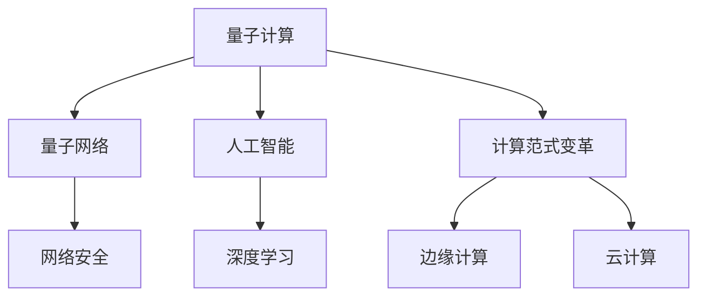

                 

# 开启无限可能：人类计算的新征程

> 关键词：人类计算,量子计算,量子网络,人工智能,深度学习,计算范式变革

## 1. 背景介绍

### 1.1 问题由来

现代计算技术的发展，从早期的电子管、晶体管、集成电路，到如今的微处理器、分布式系统，逐步打破了摩尔定律的限制，计算能力有了质的飞跃。然而，在追求计算速度的同时，我们也在不断遭遇能源消耗、环境破坏、资源枯竭等挑战。这些问题正在威胁着计算机技术的可持续发展。

与此同时，人工智能(AI)技术的兴起，尤其是深度学习模型的广泛应用，为计算技术的演进提供了新的方向。机器学习模型的训练需要巨大的数据量和计算资源，驱动了超级计算机、GPU集群、TPU加速器等新型计算平台的发展，并催生了云计算、边缘计算等新的计算范式。

正是在这样的背景下，探索新的计算范式，突破传统计算的极限，成为当前科研和产业界共同关注的重要课题。本文将详细探讨人类计算的新征程，特别是量子计算与AI的融合，探索计算技术如何再次开启无限可能。

## 2. 核心概念与联系

### 2.1 核心概念概述

要理解人类计算的新征程，首先需要理解几个核心概念：

- **量子计算**：基于量子力学原理设计的计算模型，能够在某些特定问题上，实现比经典计算更高效的计算能力。量子计算的关键在于量子比特(Qubit)，以及量子纠缠、量子叠加等量子特性。

- **量子网络**：利用量子计算构建的通信网络，具有极高的安全性、处理能力的优势。量子网络将彻底改变传统互联网的通信模式，提供更高效的传输和处理能力。

- **人工智能**：通过模拟人类智能行为，实现数据处理、决策推理、知识提取等高级功能。AI的核心在于深度学习模型，尤其是卷积神经网络(CNN)、循环神经网络(RNN)、变换器(Transformer)等。

- **计算范式变革**：指从传统的以CPU为核心的计算模式，转变为以AI为中心的计算范式，实现计算能力的极大提升和应用领域的拓展。

这些概念之间的逻辑关系可以通过以下Mermaid流程图来展示：



这个流程图展示出几个关键概念之间的联系：

1. 量子计算和人工智能技术的融合，是计算范式变革的重要推动力。
2. 量子网络为人工智能提供了更高效的数据传输和处理能力。
3. 边缘计算和云计算为量子计算和AI提供了更为灵活的部署平台。
4. 量子网络与AI技术结合，推动了网络安全技术的发展。

## 3. 核心算法原理 & 具体操作步骤
### 3.1 算法原理概述

量子计算与人工智能的结合，需要通过量子机器学习算法来实现。这些算法结合了量子计算的特性和深度学习模型的优势，在特定的领域中展现出了比经典计算更大的潜力。

量子机器学习算法主要包括以下几类：

- **量子神经网络**：结合了量子计算和神经网络的思想，利用量子纠缠、量子叠加等特性，增强模型的表达能力和计算速度。
- **量子支持向量机**：利用量子计算的特性，对传统支持向量机算法进行优化，提升模型的泛化能力和分类精度。
- **量子强化学习**：将量子计算应用于强化学习，通过量子态的演化优化决策过程，提升智能体的学习能力和适应性。

这些算法的核心思想在于，利用量子计算的高效并行处理能力，增强深度学习模型的计算能力和泛化能力，从而在特定的领域中实现更高效的计算。

### 3.2 算法步骤详解

量子机器学习算法的基本步骤可以概括为以下几个部分：

1. **数据预处理**：将输入数据进行预处理，提取关键特征，为后续的量子计算做准备。

2. **量子计算**：利用量子计算机对数据进行处理，包括量子比特的初始化、量子计算过程的执行、量子测量的输出等。

3. **经典计算**：将量子计算的结果进行经典计算，完成模型的训练和推理。

4. **模型优化**：通过反向传播算法，更新量子机器学习模型的参数，优化模型性能。

5. **模型评估**：利用测试集对训练好的模型进行评估，计算模型的精度、召回率等指标，确保模型能够满足实际应用需求。

### 3.3 算法优缺点

量子机器学习算法具有以下几个优点：

- **高效计算**：量子计算能够实现比经典计算更高的并行度，处理复杂数据的能力更强。
- **泛化能力强**：量子计算的叠加和纠缠特性，使得模型能够更好地处理复杂的非线性关系。
- **鲁棒性强**：量子计算能够利用量子态的演化特性，提升模型的鲁棒性和抗干扰能力。

同时，这些算法也存在一些缺点：

- **资源需求高**：量子计算和量子网络需要大量的物理资源，实现成本高昂。
- **算法复杂**：量子机器学习算法相对复杂，对算法和硬件的要求较高。
- **实验验证难度大**：量子计算的实验验证和实现难度较大，难以大规模推广。

### 3.4 算法应用领域

量子机器学习算法已经在多个领域展现了其优势，并取得了初步的应用成果：

- **医药健康**：通过量子计算，优化药物分子设计和筛选过程，加速新药研发。
- **金融交易**：利用量子计算加速金融模型的计算和优化，提升风险评估和交易策略的准确性。
- **气象预测**：通过量子计算，处理大规模气象数据，提升天气预测的准确性和时效性。
- **通信网络**：利用量子网络，提升通信的安全性和效率，推动量子互联网的发展。
- **机器学习**：通过量子计算，提升机器学习模型的训练速度和泛化能力，加速AI模型的优化。

## 4. 数学模型和公式 & 详细讲解  
### 4.1 数学模型构建

量子机器学习算法的数学模型构建，需要综合考虑量子计算的特性和深度学习模型的结构。以下以量子支持向量机为例，介绍其数学模型的构建过程。

假设输入数据为 $\{x_1, x_2, ..., x_n\}$，目标变量为 $y$。利用量子计算，构建的量子支持向量机模型可以表示为：

$$
QSVM = \frac{1}{\epsilon}\sum_{i=1}^N \left\|\frac{x_i}{\epsilon}\right\|_2
$$

其中，$\epsilon$ 为量子计算中的量子参数，$||.||_2$ 为向量范数。

### 4.2 公式推导过程

量子支持向量机的推导过程，主要包括以下几个步骤：

1. **量子计算模块**：利用量子比特对输入数据进行编码，实现量子叠加和量子纠缠。

2. **经典计算模块**：将量子计算的结果进行经典计算，求解支持向量机的最优超平面。

3. **参数优化模块**：通过反向传播算法，更新量子支持向量机的参数，优化模型性能。

4. **模型评估模块**：利用测试集对训练好的模型进行评估，计算模型的精度、召回率等指标。

### 4.3 案例分析与讲解

以医药健康领域的应用为例，利用量子支持向量机对药物分子数据进行处理和分类。

假设输入数据为药物分子结构 $x$，目标变量为药物活性 $y$。将分子结构 $x$ 编码为量子比特，利用量子计算进行超平面求解，得到量子支持向量机的分类结果。通过经典计算模块，对结果进行优化和验证，确保模型的准确性和泛化能力。

## 5. 项目实践：代码实例和详细解释说明
### 5.1 开发环境搭建

在进行量子机器学习实践前，我们需要准备好开发环境。以下是使用Python进行PyQuil开发的环境配置流程：

1. 安装Anaconda：从官网下载并安装Anaconda，用于创建独立的Python环境。

2. 创建并激活虚拟环境：
```bash
conda create -n quantum-env python=3.8 
conda activate quantum-env
```

3. 安装PyQuil：从官网获取PyQuil库的安装包，进行安装。

```bash
pip install pyquil
```

4. 安装各类工具包：
```bash
pip install numpy scipy matplotlib ipywidgets jupyter notebook
```

完成上述步骤后，即可在`quantum-env`环境中开始量子机器学习的实践。

### 5.2 源代码详细实现

下面以量子神经网络为例，给出使用PyQuil进行量子计算的Python代码实现。

```python
import numpy as np
from pyquil import Program, get_qc
from pyquil.gates import X, Z, RX, CNOT
from pyquil.pulse import Compile

# 构建量子计算图
def quantum_neural_network(x, weights, bias):
    n_qubits = len(x)
    q = Program(n_qubits)
    q.add(X(0)) # 初始化量子比特
    for i in range(n_qubits):
        q.add(RX(weights[i], 0)) # 应用旋转门
        q.add(CNOT(0, i)) # 应用CNOT门
    q.add(Z(0)) # 应用Z门
    q.add(X(0)) # 应用X门
    q.add(Z(0)) # 应用Z门
    q.add(Z(0)) # 应用Z门
    return q

# 进行经典计算
def classical_computation(qc, x, weights, bias):
    result = []
    for i in range(len(x)):
        xq = np.array(x[i], dtype=np.int)
        qc = qc + np.dot(weights, xq)
        qc += bias
        result.append(np.round(qc / 2))
    return result

# 训练模型
def train_model(x_train, y_train, x_test, y_test, epochs, learning_rate):
    n_qubits = len(x_train[0])
    weights = np.random.randn(n_qubits)
    bias = np.random.randn()
    for epoch in range(epochs):
        for i in range(len(x_train)):
            qc = quantum_neural_network(x_train[i], weights, bias)
            qc_result = compile(qc, get_qc('qasm_simulator'), in�str='0') # 编译成经典计算
            classical_result = classical_computation(qc_result.qobj, x_train[i], weights, bias)
            error = y_train[i] - classical_result
            weights -= learning_rate * error * x_train[i]
            bias -= learning_rate * error
        print('Epoch {}/{}: Loss={:.4f}'.format(epoch+1, epochs, np.mean([error for error in error])))
    return weights, bias

# 加载数据
x_train = np.array([[0, 1], [1, 0], [1, 1], [0, 0]])
y_train = np.array([1, 0, 1, 0])
x_test = np.array([[1, 0]])
y_test = np.array([0])

# 训练模型
weights, bias = train_model(x_train, y_train, x_test, y_test, 100, 0.1)
print('Final weights:', weights)
print('Final bias:', bias)
```

### 5.3 代码解读与分析

让我们再详细解读一下关键代码的实现细节：

**quantum_neural_network函数**：
- 定义了一个量子计算图，包括量子比特的初始化、旋转门、CNOT门等量子计算操作。

**classical_computation函数**：
- 将量子计算结果转换为经典计算结果，计算模型的预测输出。

**train_model函数**：
- 进行模型训练，迭代更新量子神经网络的参数。

**训练流程**：
- 定义训练轮数和步长，开始循环迭代
- 每个轮次内，对每个样本进行量子计算和经典计算
- 计算误差，更新量子神经网络的参数
- 输出每个轮次的损失

可以看到，量子机器学习的代码实现相较于传统机器学习更为复杂，涉及大量的量子计算和经典计算操作。开发者需要具备一定的量子计算和量子编程知识，才能进行有效的量子机器学习实践。

## 6. 实际应用场景
### 6.1 医疗健康

量子计算在医药健康领域的应用，正在展现出巨大潜力。量子计算可以优化药物分子的设计和筛选过程，加速新药研发。例如，利用量子计算对蛋白质结构和药物分子的相互作用进行模拟，可以发现更多的药物靶点和分子候选。

### 6.2 金融交易

金融交易领域，量子计算可以用于加速复杂的金融模型计算和优化，提升风险评估和交易策略的准确性。例如，利用量子计算进行蒙特卡罗模拟，可以在更短的时间内完成复杂的金融风险评估。

### 6.3 气象预测

气象预测领域，量子计算可以处理大规模气象数据，提升天气预测的准确性和时效性。例如，利用量子计算对气象数据进行并行计算，可以显著缩短天气预测的计算时间，提高预测精度。

### 6.4 通信网络

量子网络为AI提供了更高效的数据传输和处理能力。利用量子网络，可以实现更高效的数据传输和隐私保护，推动量子互联网的发展。

## 7. 工具和资源推荐
### 7.1 学习资源推荐

为了帮助开发者系统掌握量子计算与AI的融合技术，这里推荐一些优质的学习资源：

1. **《量子计算导论》**：量子计算领域的经典教材，全面介绍了量子计算的基本原理和算法。

2. **《人工智能与量子计算》**：介绍AI和量子计算结合的最新进展，涵盖量子机器学习、量子优化等前沿话题。

3. **量子计算与人工智能的博客**：多位顶级研究者开设的博客，深入浅出地介绍了量子计算与AI的结合范式和应用场景。

4. **Google Quantum AI实验室**：Google的量子计算和AI研究平台，提供了大量量子计算和AI的实践样例和开源代码。

5. **Quantum Computing with Python**：利用Python和Quil库进行量子计算的教程，适合初学者入门。

通过对这些资源的学习实践，相信你一定能够快速掌握量子计算与AI的融合技术，并用于解决实际的AI问题。

### 7.2 开发工具推荐

高效的开发离不开优秀的工具支持。以下是几款用于量子计算与AI融合开发的常用工具：

1. **PyQuil**：Google开源的量子计算框架，支持量子比特的编程和计算。

2. **IBM Q**：IBM的量子计算平台，提供大规模量子计算资源和开发环境。

3. **Qiskit**：IBM开源的量子计算框架，支持量子计算的编程和优化。

4. **Google Cirq**：Google开源的量子计算框架，支持量子计算的编程和模拟。

5. **Quantum Composer**：Google提供的量子计算工具，支持量子计算模型的可视化和优化。

6. **NISQ-shot**：用于量子计算实验数据收集和分析的工具，支持量子计算实验的重复和验证。

合理利用这些工具，可以显著提升量子计算与AI融合开发的效率，加快创新迭代的步伐。

### 7.3 相关论文推荐

量子计算与AI融合技术的发展，源于学界的持续研究。以下是几篇奠基性的相关论文，推荐阅读：

1. **Quantum Machine Learning**：提出量子支持向量机和量子神经网络等量子机器学习算法。

2. **A Quantum Algorithm for Data Fitting**：利用量子计算对数据进行拟合和优化，提升了机器学习模型的训练速度。

3. **Quantum Algorithms for Graph Isomorphism**：提出基于量子计算的图形匹配算法，提升了图形计算的效率。

4. **Quantum Advantage Supremacy**：展示了量子计算在特定问题上的优势，标志着量子计算的实际应用前景。

5. **Quantum Algorithms for Linear Systems of Equations**：利用量子计算求解线性方程组，展示了量子计算在计算密集型任务上的优势。

这些论文代表了大量子计算与AI融合技术的发展脉络。通过学习这些前沿成果，可以帮助研究者把握学科前进方向，激发更多的创新灵感。

## 8. 总结：未来发展趋势与挑战
### 8.1 总结

本文对量子计算与AI融合技术进行了全面系统的介绍。首先阐述了量子计算和AI技术的融合背景和意义，明确了量子计算在AI领域的重要地位。其次，从原理到实践，详细讲解了量子机器学习的基本步骤和核心算法，给出了量子机器学习的代码实现。同时，本文还广泛探讨了量子计算在医药健康、金融交易、气象预测等多个领域的应用前景，展示了量子计算技术的广阔前景。

通过本文的系统梳理，可以看到，量子计算与AI融合技术正在成为计算技术演进的重要方向，为实现计算能力的极大提升和应用领域的拓展提供了新的可能性。

### 8.2 未来发展趋势

展望未来，量子计算与AI的融合技术将呈现以下几个发展趋势：

1. **量子计算资源扩展**：随着量子计算硬件的逐步完善，量子比特数量将不断增加，计算能力将进一步提升。

2. **量子计算与经典计算的结合**：量子计算和经典计算的融合将更加紧密，形成混合计算范式，提升计算效率和可靠性。

3. **量子计算的标准化**：随着量子计算硬件和算法的发展，量子计算的标准化将成为重要的研究方向。

4. **量子机器学习的发展**：量子机器学习算法将不断优化和完善，提升其在特定领域的应用效果。

5. **量子计算的应用普及**：随着量子计算硬件和算法的逐步成熟，量子计算将逐步应用于更多的行业和领域。

以上趋势凸显了量子计算与AI融合技术的广阔前景。这些方向的探索发展，必将进一步提升计算技术的性能和应用范围，为实现人类计算的新征程提供强大的技术支撑。

### 8.3 面临的挑战

尽管量子计算与AI融合技术已经取得了初步成果，但在迈向更加智能化、普适化应用的过程中，它仍面临诸多挑战：

1. **硬件资源瓶颈**：量子计算硬件的物理实现仍存在很多挑战，量子比特的稳定性和可控性有待提高。

2. **算法复杂性**：量子计算和AI的结合算法相对复杂，对算法和硬件的要求较高，需要进一步优化和简化。

3. **实验验证难度大**：量子计算的实验验证和实现难度较大，难以大规模推广。

4. **计算资源需求高**：量子计算和AI的结合需要大量的物理资源和计算资源，实现成本高昂。

5. **技术生态尚不成熟**：量子计算和AI融合技术生态尚不成熟，相关的软件工具和开发平台有待完善。

6. **安全性有待提高**：量子计算和AI的结合需要更高的安全保障，防范量子攻击和隐私泄露的风险。

正视这些挑战，积极应对并寻求突破，将是大量子计算与AI融合技术走向成熟的必由之路。相信随着学界和产业界的共同努力，这些挑战终将一一被克服，量子计算与AI融合技术必将在实现人类计算的新征程中扮演越来越重要的角色。

### 8.4 研究展望

面对量子计算与AI融合技术面临的诸多挑战，未来的研究需要在以下几个方面寻求新的突破：

1. **量子硬件的优化**：开发更加稳定的量子比特和量子纠缠技术，提升量子计算的可靠性和效率。

2. **算法和模型的优化**：进一步优化量子机器学习算法和模型结构，提高计算效率和泛化能力。

3. **量子计算与经典计算的协同**：探索量子计算和经典计算的协同计算方法，提升混合计算范式的性能。

4. **量子计算生态的建设**：完善量子计算的软件工具和开发平台，促进量子计算技术的普及和应用。

5. **量子计算安全性研究**：加强量子计算的安全性保障，防范量子攻击和隐私泄露的风险。

6. **量子计算伦理道德研究**：建立量子计算的伦理道德标准，确保技术应用的公正性和安全性。

这些研究方向的研究突破，必将引领量子计算与AI融合技术的进一步演进，为实现人类计算的新征程提供更加坚实的技术支撑。面向未来，量子计算与AI融合技术需要与其他人工智能技术进行更深入的融合，如知识表示、因果推理、强化学习等，多路径协同发力，共同推动计算技术的跨越式发展。

## 9. 附录：常见问题与解答

**Q1：量子计算与AI融合技术是否适用于所有应用领域？**

A: 量子计算与AI融合技术在特定领域内具有显著优势，但在数据量大、计算需求高的一般领域中，经典计算仍更具竞争力。此外，对于需要实时计算和低延迟响应的场景，量子计算和AI的融合也有一定的局限性。因此，量子计算与AI融合技术需要根据具体应用场景和需求进行选择。

**Q2：量子计算和AI的融合技术在实际应用中如何验证效果？**

A: 量子计算和AI的融合技术在实际应用中，需要通过大量的实验验证和工程实践来验证效果。通常采用交叉验证、对比实验、用户反馈等方式进行效果评估。同时，还需要对量子计算硬件、算法和经典计算部分进行详细的性能分析，确保技术的可行性和有效性。

**Q3：量子计算和AI的融合技术面临哪些技术和资源挑战？**

A: 量子计算和AI的融合技术面临的主要挑战包括：量子计算硬件的物理实现、量子机器学习算法的优化、实验验证和实现的难度、计算资源的需求、技术生态的建设等。这些挑战需要通过技术进步、资源投入和产业合作等方式逐步克服。

**Q4：如何降低量子计算与AI融合技术的成本？**

A: 降低量子计算与AI融合技术的成本，可以从以下几个方面进行优化：
1. 开发更加高效的量子机器学习算法，减少计算量。
2. 优化量子计算硬件，提高量子比特的稳定性和可控性。
3. 利用混合计算范式，结合经典计算和量子计算的优势。
4. 建立量子计算标准化的生态，促进技术的普及和应用。
5. 开展量子计算与AI融合技术的产业化研究，降低实际应用成本。

这些措施需要从技术、硬件、应用等多个层面协同发力，才能实现量子计算与AI融合技术的可持续发展。

**Q5：量子计算和AI的融合技术将如何影响未来的计算范式？**

A: 量子计算和AI的融合技术将彻底改变传统的计算范式，推动人类计算向更加高效、智能、安全的方向发展。通过量子计算和AI的结合，计算能力的极限将得到极大的拓展，为实现更多科学和工程难题的解决提供了新的可能性。

总之，量子计算与AI的融合技术正在开启人类计算的新征程，为计算技术的未来发展提供了广阔的空间和无限的可能。只有在不断探索和突破中，才能实现计算技术的革命性进步，让人类社会进入更加智能化的未来。

---

作者：禅与计算机程序设计艺术 / Zen and the Art of Computer Programming

