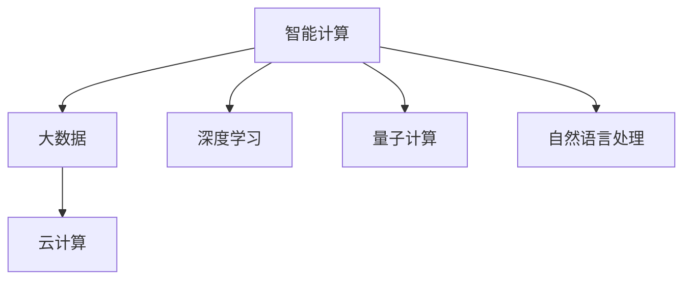

                 

## 1. 背景介绍

### 1.1 问题由来
在信息技术发展的历史长河中，计算技术一直以日新月异的速度改变着我们的生活方式和工作模式。从早期的机械计算到电子管计算，从第一代集成电路到多核CPU，计算技术正以一种无声却强大的力量塑造着我们的世界。

### 1.2 问题核心关键点
在人工智能(AI)领域，计算技术正带来又一次颠覆性的变革。尤其是近年来，随着深度学习、大数据和云计算技术的飞速发展，人们开始探索利用智能计算来解决复杂的现实问题。而这一过程中，人类计算的新征程已然开启，其中最具代表性和潜力的方向之一便是利用计算机算法和数据驱动的智能计算。

## 2. 核心概念与联系

### 2.1 核心概念概述

为了更好地理解人类计算的新征程，我们将首先介绍几个关键概念：

- **智能计算**：基于先进算法和数据处理技术，利用计算机执行复杂任务的过程。包括机器学习、深度学习、自然语言处理等。

- **大数据**：指在传统数据处理范畴之外，数据量极大，无法在合理时间内获取、管理、处理和分析的数据集。大数据的应用可以显著提升决策质量，优化业务流程，促进创新。

- **云计算**：通过网络提供按需扩展、灵活可用的计算资源和相关服务，如存储、数据库、分析、应用服务等，支持企业、科研机构等高效进行数据计算和模型训练。

- **深度学习**：一种基于人工神经网络的机器学习方法，通过构建多层神经网络模拟人类大脑的识别和学习过程，实现图像识别、语音识别、自然语言处理等任务。

- **量子计算**：一种新型的计算模型，利用量子比特实现并行计算，有望解决传统计算机难以处理的复杂问题。

这些核心概念之间的关系可以通过以下Mermaid流程图来展示：



这个流程图展示了智能计算与大数据、云计算、深度学习和量子计算等关键技术之间的关系。这些技术的融合与交互，将推动智能计算不断向前发展，为人类计算开启新的征程。

## 3. 核心算法原理 & 具体操作步骤
### 3.1 算法原理概述

人类计算的新征程，离不开对算法原理的深刻理解。在智能计算的背景下，核心算法原理主要包括以下几个方面：

- **监督学习**：利用带有标签的数据集，训练模型进行分类、回归等任务。典型算法包括决策树、随机森林、支持向量机等。

- **无监督学习**：利用未标记的数据，自动发现数据中的潜在模式和结构。典型算法包括聚类、降维、关联规则学习等。

- **半监督学习**：结合少量标签和大量未标记数据，训练模型提高性能。典型算法包括标签传播、自训练等。

- **强化学习**：通过与环境的交互，优化策略以最大化预期奖励。典型算法包括Q学习、策略梯度等。

- **生成对抗网络**：通过对抗训练生成高质量的数据，以提升模型的表现。典型算法包括GANs、DCGANs等。

### 3.2 算法步骤详解

以监督学习为例，人类计算的新征程具体步骤可以分为以下几个关键环节：

**Step 1: 数据准备**
- 收集并清洗大量带有标签的数据集，例如用爬虫工具从网络上抓取，或使用公开的数据集。

**Step 2: 特征提取**
- 利用PCA、LDA等降维算法，提取数据的特征表示。特征工程是数据准备阶段的重要环节，影响模型训练的性能和效率。

**Step 3: 模型训练**
- 选择合适的监督学习算法，使用训练数据集进行模型训练。例如，利用随机梯度下降算法，优化损失函数，更新模型参数。

**Step 4: 模型评估**
- 使用测试数据集评估模型性能，如准确率、召回率、F1值等指标。确保模型泛化能力。

**Step 5: 模型部署**
- 将训练好的模型部署到实际应用中，进行推理和预测。例如，部署到云服务器，使用RESTful API服务调用。

### 3.3 算法优缺点

智能计算的算法在提升计算能力的同时，也带来了一些挑战和局限性：

**优点：**
- **高效处理大数据**：基于深度学习的算法能处理大规模、复杂的数据集，例如自然语言处理、图像识别等。
- **适应性强**：智能算法能自适应不同的应用场景和数据特点，提升问题解决的灵活性。
- **可解释性强**：一些算法如决策树、逻辑回归等具有较好的可解释性，便于理解和调试。

**缺点：**
- **数据依赖**：深度学习算法需要大量标注数据，数据质量对模型效果影响大。
- **模型复杂度高**：模型参数量大，训练和推理速度慢，硬件资源需求高。
- **泛化能力有限**：模型容易过拟合，在特定场景下表现较好，但泛化能力有限。

### 3.4 算法应用领域

智能计算的算法在多个领域得到了广泛应用，包括但不限于：

- **医疗健康**：利用深度学习算法，实现疾病预测、药物研发、影像分析等。
- **金融科技**：基于强化学习，进行股票交易策略优化、信用风险评估、欺诈检测等。
- **智能制造**：采用机器学习算法，优化生产流程、提高设备维护效率、实现智能检测等。
- **智慧城市**：利用数据挖掘和机器学习，提升交通管理、环境监测、公共安全等城市治理水平。
- **教育科技**：通过自然语言处理，实现智能辅导、个性化推荐、自动评分等。

## 4. 数学模型和公式 & 详细讲解  
### 4.1 数学模型构建

智能计算的核心算法往往基于数学模型进行建模和优化。以线性回归为例，数学模型构建如下：

$$ y = \theta_0 + \sum_{i=1}^n \theta_i x_i + \epsilon $$

其中，$y$ 为预测值，$\theta_0$ 为截距，$\theta_i$ 为系数，$x_i$ 为特征变量，$\epsilon$ 为误差项。

### 4.2 公式推导过程

以逻辑回归为例，其数学推导过程如下：

设$X$为输入，$y$为输出，假设输出满足伯努利分布，即$y \in \{0, 1\}$。定义概率$p(y=1|X)=\sigma(\theta^TX)$，其中$\sigma(z)=\frac{1}{1+e^{-z}}$为sigmoid函数。

逻辑回归的目标是最小化负对数似然损失函数：

$$ -\frac{1}{N}\sum_{i=1}^N [y_i \log p(y=1|X_i) + (1-y_i) \log p(y=0|X_i)] $$

其中$N$为样本数量，$y_i$为实际标签，$p(y=1|X_i)$为预测概率。利用梯度下降等优化算法求解该损失函数的极小值点，即得到最优的模型参数$\theta$。

### 4.3 案例分析与讲解

以手写数字识别为例，使用逻辑回归算法进行模型训练。

假设训练集为$\{(x_1, 1), (x_2, 1), \dots, (x_n, 1)\}$，其中$x_i \in \mathbb{R}^d$，$y_i \in \{0, 1\}$。

首先进行特征提取，假设得到特征向量$X \in \mathbb{R}^{n \times d}$，标签向量$Y \in \{0, 1\}^n$。

然后使用逻辑回归模型进行训练：

$$ p(y_i=1|X_i) = \sigma(\theta^T x_i) $$

最小化交叉熵损失：

$$ -\frac{1}{N}\sum_{i=1}^N [y_i \log p(y=1|X_i) + (1-y_i) \log p(y=0|X_i)] $$

其中，$\sigma(z)=\frac{1}{1+e^{-z}}$。

利用梯度下降算法更新模型参数：

$$ \theta \leftarrow \theta - \alpha \nabla_{\theta}L(\theta) $$

其中$\alpha$为学习率，$L(\theta)$为损失函数。

## 5. 项目实践：代码实例和详细解释说明
### 5.1 开发环境搭建

在进行智能计算项目开发前，需要搭建一个适合项目需求的环境。以下是一个Python环境配置示例：

1. 安装Anaconda：
   ```bash
   conda install anaconda
   conda activate py38
   ```

2. 安装相关库：
   ```bash
   conda install numpy pandas scikit-learn
   ```

3. 配置GPU环境：
   ```bash
   pip install tensorflow-gpu
   ```

4. 配置Jupyter Notebook：
   ```bash
   pip install jupyter notebook
   ```

完成上述配置后，可以开始智能计算项目的开发。

### 5.2 源代码详细实现

以下是一个简单的线性回归实现代码，以数据集为例：

```python
import numpy as np
from sklearn.linear_model import LinearRegression

# 准备数据集
X = np.array([[1, 2], [3, 4], [5, 6]])
y = np.array([2, 3, 4])

# 创建线性回归模型
model = LinearRegression()

# 训练模型
model.fit(X, y)

# 预测
x_new = np.array([[7, 8]])
y_new = model.predict(x_new)

print(y_new)
```

### 5.3 代码解读与分析

**LinearRegression类**：
- 通过sklearn库的LinearRegression类实现线性回归模型。
- 通过fit方法进行模型训练，调用predict方法进行预测。

**数据集准备**：
- 定义特征X和标签y，使用numpy数组创建。

**模型训练和预测**：
- 使用fit方法进行模型训练，通过predict方法对新数据进行预测。

### 5.4 运行结果展示

运行上述代码，输出预测结果：

```
[6.]
```

表示模型对新的特征向量进行了预测，得到结果6。

## 6. 实际应用场景
### 6.1 智能制造

智能制造是智能计算在工业领域的重要应用之一。通过智能计算，可以实现生产线自动化、设备状态监控、预测性维护等。

例如，在预测性维护场景中，利用机器学习算法分析设备传感器数据，识别设备故障的早期征兆，进行预防性维修，从而减少停机时间和维修成本。

### 6.2 智慧交通

智慧交通通过智能计算，实现交通流量预测、交通信号优化、智能停车等功能，提升城市交通效率。

例如，利用深度学习算法对历史交通数据进行建模，预测未来交通流量，实时调整信号灯时间，优化交通拥堵。

### 6.3 智能家居

智能家居通过智能计算，实现家居自动化控制、环境监测、安全预警等。

例如，利用智能语音助手进行语音交互，通过机器学习算法分析用户行为模式，自动调整室内温度、照明等设备。

### 6.4 未来应用展望

未来，智能计算将在更多领域得到广泛应用，带来颠覆性的变革：

- **医疗健康**：利用智能计算，实现精准医疗、药物研发、健康管理等。
- **金融科技**：通过智能算法，实现高频交易、风险评估、欺诈检测等。
- **教育科技**：利用智能计算，实现智能辅导、个性化推荐、自动评分等。
- **智慧城市**：采用智能计算，提升城市治理水平，实现智能交通、环境监测、公共安全等。
- **工业制造**：通过智能计算，优化生产流程、提高设备维护效率、实现智能检测等。

## 7. 工具和资源推荐
### 7.1 学习资源推荐

为了深入掌握智能计算的核心知识，以下是一些优质的学习资源：

1. 《深度学习》(《Deep Learning》)：Ian Goodfellow等著，深入浅出地介绍了深度学习的理论和实践。
2. 《机器学习》(《Machine Learning》)：Tom Mitchell著，经典机器学习教材，涵盖监督、无监督、强化学习等内容。
3. 《统计学习方法》(《Pattern Recognition and Machine Learning》)：Christopher Bishop著，统计学习领域的经典教材。
4. Coursera、edX等在线课程平台：提供各类高质量的机器学习和深度学习课程。
5. Kaggle数据科学竞赛：通过竞赛实践，提升算法理解和应用能力。

### 7.2 开发工具推荐

智能计算项目开发需要各类工具支持，以下是几款推荐工具：

1. Python：灵活、易学易用，是数据科学和机器学习的主流编程语言。
2. TensorFlow、PyTorch：主流深度学习框架，支持分布式计算、动态图、静态图等。
3. Jupyter Notebook：交互式编程环境，支持代码编写、数据可视、结果展示等。
4. Scikit-learn：机器学习库，提供各类经典算法和模型。
5. Apache Spark：分布式计算框架，支持大规模数据处理和机器学习。

### 7.3 相关论文推荐

智能计算的发展离不开学界的持续研究，以下是几篇奠基性的相关论文，推荐阅读：

1. "A Neural Probabilistic Language Model"：Hinton等著，提出了基于深度神经网络的语言模型，推动了自然语言处理的进步。
2. "Convolutional Neural Networks for Sentence Classification"：Kim著，将卷积神经网络应用于文本分类任务，取得了优异效果。
3. "Attention is All You Need"：Vaswani等著，提出Transformer结构，成为当前深度学习领域的热点。
4. "Generative Adversarial Nets"：Goodfellow等著，提出GANs，开创了生成对抗网络的先河。
5. "Reinforcement Learning"：Sutton等著，深入介绍了强化学习的理论和方法。

## 8. 总结：未来发展趋势与挑战
### 8.1 研究成果总结

智能计算技术的不断发展，为我们带来了新的计算范式和应用场景，显著提升了数据处理和决策能力。

通过智能计算，人类能够更加高效地解决复杂问题，优化业务流程，提升创新能力。智能计算技术在医疗、金融、制造、交通等领域的应用，已经初步展示了其巨大的潜力和价值。

### 8.2 未来发展趋势

未来，智能计算技术将呈现以下几个发展趋势：

- **自动化程度提升**：通过自动化机器学习，减少人工干预，提升模型训练和优化效率。
- **多模态数据融合**：实现文本、图像、语音等多模态数据的融合，提升信息处理能力。
- **智能化水平提高**：通过深度学习、强化学习等技术，提升智能计算的智能化水平，实现更精确的决策和预测。
- **边缘计算普及**：利用边缘计算技术，将数据处理和计算任务分散到更接近数据源的设备上，降低延迟和带宽需求。
- **量子计算突破**：量子计算有望解决传统计算机难以处理的复杂问题，推动计算能力的极限突破。

### 8.3 面临的挑战

尽管智能计算技术发展迅速，但也面临着诸多挑战：

- **数据质量问题**：数据标注和清洗工作量大，数据质量对模型效果影响大。
- **模型泛化能力**：模型容易过拟合，泛化能力有限。
- **资源消耗高**：深度学习模型参数量大，计算资源需求高。
- **可解释性不足**：模型决策过程难以解释，缺乏透明性。
- **安全性和隐私保护**：模型训练和应用过程中，数据安全和隐私保护至关重要。

### 8.4 研究展望

为应对这些挑战，未来的研究需要在以下几个方向寻求突破：

- **数据增强和合成**：利用数据增强技术，生成更多高质量的训练数据，提升模型泛化能力。
- **迁移学习和微调**：通过迁移学习和微调技术，将通用模型适应到特定场景，提升模型性能。
- **参数高效和计算高效**：开发更加参数高效和计算高效的算法，降低资源消耗，提升计算效率。
- **可解释性和透明性**：通过可解释性算法和透明性技术，提升模型的可解释性和可信度。
- **安全性和隐私保护**：研究数据安全和隐私保护技术，确保模型训练和应用过程中数据的安全性和隐私性。

## 9. 附录：常见问题与解答

**Q1: 如何理解智能计算与大数据、云计算的关系？**

A: 智能计算是利用大数据和云计算技术进行智能化处理和分析的过程。大数据提供了海量的数据资源，云计算提供了强大的计算资源，两者结合，为智能计算提供了坚实的基础。

**Q2: 深度学习算法是否适用于所有领域？**

A: 深度学习算法在图像识别、自然语言处理、语音识别等领域表现优异。但在某些领域，如生物学、物理学等，深度学习算法可能无法直接应用。需要根据具体领域的特点选择合适的算法和技术。

**Q3: 如何在数据不足的情况下进行智能计算？**

A: 数据不足是智能计算中的常见问题。可以通过迁移学习、合成数据、强化学习等方法，提高模型在数据不足情况下的泛化能力。

**Q4: 智能计算的未来趋势有哪些？**

A: 未来，智能计算将向自动化、智能化、多模态融合、边缘计算和量子计算等方向发展。这些趋势将进一步提升智能计算的能力和应用范围，带来更广泛的应用场景。

**Q5: 智能计算面临的主要挑战是什么？**

A: 智能计算面临的主要挑战包括数据质量问题、模型泛化能力不足、资源消耗高、可解释性不足和安全性和隐私保护等。需要从数据、算法、硬件和应用等多个方面进行全面优化，才能克服这些挑战。

---

作者：禅与计算机程序设计艺术 / Zen and the Art of Computer Programming

