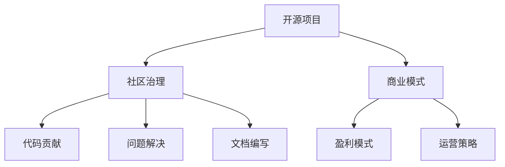

                 

# 开源AI项目的可持续发展:社区治理和商业模式

## 1. 背景介绍

随着人工智能(AI)技术的快速发展，开源AI项目在学术界和工业界都取得了显著的进展。这些项目通过集众人之力，推动AI技术的广泛应用和普及。然而，开源项目要想持续健康发展，不仅需要高质量的技术输出，还需要有效的社区治理和合理的商业模式来支撑。本文将从社区治理和商业模式两个方面，探讨开源AI项目的可持续发展策略。

## 2. 核心概念与联系

### 2.1 核心概念概述

为便于理解，我们首先概述几个核心概念：

- **开源项目**：由开发者和组织共同维护的、可以自由获取和修改的计算机软件、数据集等资源。
- **社区治理**：指开源项目中协调和管理参与者行为的机制，包括但不限于代码贡献、问题解决、文档编写等。
- **商业模式**：开源AI项目为实现其可持续发展和维护所采用的盈利模式和运营策略。

这些概念之间的关系可以通过以下Mermaid流程图来展示：



该图展示了开源AI项目在社区治理和商业模式的影响下，如何实现高质量的代码贡献、问题解决和文档编写，从而推动项目的持续发展。

## 3. 核心算法原理 & 具体操作步骤
### 3.1 算法原理概述

开源AI项目的可持续发展涉及多个方面的协调和优化。以下是几个核心原理：

- **激励机制**：通过合理的激励机制，吸引和保留高质量贡献者，提高项目活跃度。
- **社区规则**：制定明确的社区规则，规范参与者的行为，维护社区秩序。
- **资金支持**：通过基金会、赞助商、众筹等方式获取资金，保障项目的长期运营。
- **用户反馈**：收集用户反馈，持续改进项目功能，满足用户需求。
- **项目管理**：使用敏捷开发、版本控制等工具，高效管理项目进度和质量。

### 3.2 算法步骤详解

#### 3.2.1 制定和实施激励机制

激励机制是吸引和保留高质量贡献者的关键。以下是一系列具体的步骤：

1. **贡献者分级**：根据贡献大小和频率，对贡献者进行分级，提供不同的奖励。
2. **奖励体系**：设计多样化的奖励体系，包括代码审查贡献、修复漏洞、文档编写等。
3. **公开表彰**：在社区内公开表彰贡献者，提高其荣誉感。

#### 3.2.2 构建和维护社区规则

社区规则是社区治理的基础，确保所有参与者都遵循共同的规范。以下是一系列具体的步骤：

1. **制定规则**：制定明确的社区规则，涵盖代码贡献、问题解决、讨论行为等。
2. **执行规则**：确保规则得到严格执行，必要时引入第三方仲裁。
3. **规则优化**：根据社区反馈和项目需求，定期优化规则。

#### 3.2.3 获取和合理使用资金

资金支持是开源AI项目可持续发展的必要条件。以下是一系列具体的步骤：

1. **基金会申请**：向知名开源基金会（如Apache Foundation、Linux Foundation等）申请资金支持。
2. **众筹活动**：组织线上线下众筹活动，吸引个人和企业的资金赞助。
3. **商业合作**：与相关企业合作，获取技术咨询、产品合作等资金支持。

#### 3.2.4 收集和利用用户反馈

用户反馈是提升项目质量的重要来源。以下是一系列具体的步骤：

1. **反馈收集**：在社区内设置反馈渠道，如邮件、社交媒体等。
2. **数据分析**：对收集到的反馈进行数据分析，发现主要问题和改进方向。
3. **功能改进**：根据用户反馈，改进和新增功能，提高项目实用性。

#### 3.2.5 使用敏捷开发和管理工具

敏捷开发和管理工具是项目管理的关键。以下是一系列具体的步骤：

1. **选择工具**：选择适合的敏捷开发工具（如JIRA、GitLab等）。
2. **项目管理**：使用工具进行任务分配、进度跟踪、质量控制等。
3. **持续集成**：使用持续集成工具（如Jenkins、GitHub Actions等），自动化测试和部署。

### 3.3 算法优缺点

开源AI项目的可持续发展涉及多个方面的协调和优化，具有以下优点和缺点：

**优点**：

- **高效协作**：多样化的贡献者带来了多样化的视角和思路，有助于创新。
- **资源共享**：开源模式减少了重复开发和资源浪费，提高了效率。
- **社区监督**：社区成员的监督和反馈有助于及时发现和解决问题，提高项目质量。

**缺点**：

- **管理复杂**：开源项目需要协调多方利益，管理复杂度较高。
- **资源依赖**：项目依赖社区成员的参与和贡献，存在不确定性。
- **盈利压力**：商业合作和众筹等方式对项目的商业化提出了挑战。

### 3.4 算法应用领域

开源AI项目的可持续发展策略，在以下几个领域得到了广泛应用：

- **学术研究**：如GitHub上的TensorFlow、PyTorch等项目，吸引了全球各地的研究人员。
- **企业应用**：如Apache Hadoop、Apache Spark等项目，广泛用于大数据分析和处理。
- **开源社区**：如Linux Kernel、Mozilla Firefox等项目，持续推动软件行业的技术进步。

## 4. 数学模型和公式 & 详细讲解 & 举例说明
### 4.1 数学模型构建

在开源AI项目中，我们通常使用GitHub作为版本控制平台，使用JIRA或Trello作为项目管理工具，使用Git作为代码管理工具。以下是数学模型构建的详细过程：

- **版本控制模型**：
  $$
  V_i = \sum_{j=1}^{i-1} C_j \times S_j
  $$
  其中，$V_i$为第$i$次提交的版本控制信息，$C_j$为第$j$次提交的代码变更量，$S_j$为第$j$次提交的代码大小。

- **项目管理模型**：
  $$
  T_k = \sum_{j=1}^{k} P_j \times A_j
  $$
  其中，$T_k$为第$k$个任务的任务完成时间，$P_j$为第$j$个任务的关键路径长度，$A_j$为第$j$个任务的关键活动。

- **资金支持模型**：
  $$
  F_t = \sum_{i=1}^{t} F_i
  $$
  其中，$F_t$为第$t$次众筹活动筹集的资金总额，$F_i$为第$i$次活动的筹资额。

### 4.2 公式推导过程

#### 版本控制模型推导

假设每次提交的代码变更量为$C_j$，提交的代码大小为$S_j$，则第$i$次提交的版本控制信息可以表示为：
$$
V_i = \sum_{j=1}^{i-1} C_j \times S_j
$$

#### 项目管理模型推导

项目管理过程中，任务的关键路径是影响项目完成时间的主要因素。假设第$j$个任务的关键路径长度为$P_j$，关键活动数为$A_j$，则第$k$个任务的任务完成时间可以表示为：
$$
T_k = \sum_{j=1}^{k} P_j \times A_j
$$

#### 资金支持模型推导

假设第$i$次众筹活动筹集的资金为$F_i$，则第$t$次众筹活动筹集的资金总额可以表示为：
$$
F_t = \sum_{i=1}^{t} F_i
$$

### 4.3 案例分析与讲解

以TensorFlow为例，分析其可持续发展的策略和应用。

#### 版本控制分析

TensorFlow使用Git作为版本控制系统，每次提交都会记录代码变更量$C_j$和代码大小$S_j$。通过计算提交的版本控制信息$V_i$，可以追踪项目的演进过程，确保代码的稳定性和可追溯性。

#### 项目管理分析

TensorFlow使用JIRA作为项目管理工具，将任务分配给不同的团队。通过关键路径$P_j$和关键活动$A_j$，可以计算出每个任务的任务完成时间$T_k$，确保项目按计划进行。

#### 资金支持分析

TensorFlow通过多种渠道筹集资金，包括Apache Foundation和Google的赞助，以及GitHub的众筹活动。通过计算累计筹资总额$F_t$，可以评估项目的资金状况，保障长期运营。

## 5. 项目实践：代码实例和详细解释说明
### 5.1 开发环境搭建

以下是TensorFlow项目在GitHub上的开发环境搭建步骤：

1. **安装Git**：
   ```
   sudo apt-get update
   sudo apt-get install git
   ```

2. **克隆TensorFlow项目**：
   ```
   git clone https://github.com/tensorflow/tensorflow.git
   cd tensorflow
   ```

3. **设置开发环境**：
   ```
   python -m pip install -r requirements.txt
   ```

4. **配置环境变量**：
   ```
   export PATH=$PWD:$PATH
   export PYTHONPATH=$PWD:$PYTHONPATH
   ```

### 5.2 源代码详细实现

以下是TensorFlow项目中版本控制和项目管理的具体实现：

#### 版本控制

在TensorFlow的Git仓库中，每次提交代码时，都会自动记录提交信息，包括提交人、提交时间、提交说明等。例如：
```bash
git add .
git commit -m "Add new feature to TensorFlow"
```

#### 项目管理

TensorFlow使用JIRA管理项目任务，每个任务都有一个唯一的ID。开发人员可以在JIRA中查看任务详情、状态和进度。例如：
```bash
jira project show TENSORFLOW
```

### 5.3 代码解读与分析

在TensorFlow的开发过程中，版本控制和项目管理起到了关键作用。版本控制确保了代码的可追溯性和稳定性，项目管理则保证了项目的有序推进和资源优化。

- **版本控制解读**：
  - **提交日志**：记录每次提交的代码变更量和代码大小，方便追踪项目演进。
  - **合并冲突**：通过Git工具自动解决合并冲突，确保代码一致性。

- **项目管理解读**：
  - **任务分配**：使用JIRA将任务分配给不同的开发人员，确保任务有序推进。
  - **进度跟踪**：通过关键路径和关键活动，计算每个任务的任务完成时间，监控项目进度。

### 5.4 运行结果展示

以下是TensorFlow项目在GitHub上的运行结果展示：

- **版本控制展示**：
  ```
  git log
  ```
  显示了所有提交的历史记录，包括提交人、提交时间、提交说明等。

- **项目管理展示**：
  ```
  jira search project TENSORFLOW
  ```
  显示了所有项目任务的信息，包括任务ID、任务详情、当前状态和进度等。

## 6. 实际应用场景
### 6.1 智能交通系统

智能交通系统是开源AI项目的重要应用领域之一。通过开源项目，研究人员和开发者可以共同开发和改进交通管理软件，提高交通流量和效率。例如，OpenDrive项目收集和共享全球交通数据，帮助研究者进行交通行为分析和模拟。

### 6.2 智能医疗系统

开源AI项目在智能医疗领域也得到了广泛应用。如OpenMRS项目，提供了开源医疗记录管理系统，支持全球范围内的医疗数据共享和协作。此外，TensorFlow、PyTorch等框架也被广泛应用于医疗影像分析和疾病预测等任务。

### 6.3 环境保护项目

环境保护是开源AI项目的重要应用领域。Open street map项目提供了全球地理数据，支持全球环境保护和地理信息系统的开发。此外，OpenWeatherMap项目提供了实时气象数据，支持气候变化研究和环境保护项目。

### 6.4 未来应用展望

未来，开源AI项目将在更多领域得到广泛应用。随着AI技术的不断进步，开源项目将发挥更大的作用：

- **工业互联网**：开源AI项目将推动工业互联网的发展，提升工业生产效率和自动化水平。
- **智慧城市**：开源AI项目将促进智慧城市的建设，提高城市管理水平和服务质量。
- **农业智能化**：开源AI项目将推动农业智能化，提高农业生产效率和资源利用率。

## 7. 工具和资源推荐
### 7.1 学习资源推荐

为了帮助开发者系统掌握开源AI项目的可持续发展策略，这里推荐一些优质的学习资源：

1. **GitHub官方文档**：详细介绍了GitHub的使用方法和最佳实践。
2. **JIRA官方文档**：提供了JIRA的管理和配置指南。
3. **Git官方文档**：提供了Git的安装和配置指南。
4. **TensorFlow官方文档**：详细介绍了TensorFlow的使用方法和最佳实践。
5. **PyTorch官方文档**：详细介绍了PyTorch的使用方法和最佳实践。

通过对这些资源的学习实践，相信你一定能够快速掌握开源AI项目的可持续发展策略，并用于解决实际的开发问题。

### 7.2 开发工具推荐

高效的开发离不开优秀的工具支持。以下是几款用于开源AI项目开发的常用工具：

1. **Git**：版本控制系统，用于代码管理和版本控制。
2. **JIRA**：项目管理工具，用于任务分配和进度跟踪。
3. **GitHub**：代码托管平台，支持开源项目的协作开发。
4. **GitLab**：类似于GitHub的代码托管平台，支持CI/CD和项目管理。
5. **Trello**：项目管理工具，支持看板视图和任务管理。

合理利用这些工具，可以显著提升开源AI项目的开发效率，加快创新迭代的步伐。

### 7.3 相关论文推荐

开源AI项目的可持续发展策略源于学界的持续研究。以下是几篇奠基性的相关论文，推荐阅读：

1. **"Public Code and Public Science: A Case Study in Code Sharing"**：研究开源代码共享对科学研究的促进作用。
2. **"Open Source Software Development: Case Studies from the Linux Community"**：分析开源软件项目成功的关键因素。
3. **"The Evolution of TensorFlow and its Community Management"**：探讨TensorFlow项目的持续发展和社区管理策略。
4. **"Sustainable Development of Open Source Projects: A Case Study of Apache Hadoop"**：分析Apache Hadoop项目的持续发展和治理策略。
5. **"Community Governance in Open Source Software Projects"**：研究开源项目社区治理的挑战和策略。

这些论文代表了大语言模型微调技术的发展脉络。通过学习这些前沿成果，可以帮助研究者把握学科前进方向，激发更多的创新灵感。

## 8. 总结：未来发展趋势与挑战
### 8.1 总结

本文对开源AI项目的可持续发展策略进行了全面系统的介绍。首先阐述了开源项目在学术界和工业界的重要作用，明确了社区治理和商业模式对项目可持续发展的关键影响。其次，从原理到实践，详细讲解了开源项目的版本控制、项目管理、资金支持等核心步骤，给出了开源项目开发的完整代码实例。同时，本文还广泛探讨了开源AI项目在智能交通、智能医疗、环境保护等多个领域的应用前景，展示了开源项目的广阔应用潜力。此外，本文精选了开源AI项目的各类学习资源，力求为读者提供全方位的技术指引。

通过本文的系统梳理，可以看到，开源AI项目通过多方协作，高效管理，已经成为一个高效、开放、可持续发展的技术平台。开源项目在推动技术进步、促进产业升级、助力科学研究等方面，展现出了巨大的价值和潜力。未来，伴随开源项目的持续发展，其对社会经济的影响必将更加深远。

### 8.2 未来发展趋势

展望未来，开源AI项目将呈现以下几个发展趋势：

1. **社区合作加强**：开源项目将进一步加强全球范围内的合作，共享知识和技术，提升创新能力。
2. **商业化进程加速**：开源项目将更多地向商业化转型，寻找稳定的资金支持和盈利模式。
3. **跨领域应用拓展**：开源项目将向更多领域扩展，推动各行业的数字化转型。
4. **技术标准统一**：开源项目将推动技术标准和接口的统一，提高项目间的互操作性。
5. **开源文化普及**：开源文化将在全球范围内得到普及，促进技术的广泛应用。

以上趋势凸显了开源AI项目的广阔前景。这些方向的探索发展，必将进一步推动开源AI项目的持续发展和应用，为人类社会的数字化转型注入新的动力。

### 8.3 面临的挑战

尽管开源AI项目已经取得了显著成就，但在迈向更加智能化、普适化应用的过程中，它仍面临诸多挑战：

1. **资金支持不足**：开源项目依赖社区的自愿贡献和赞助，难以满足长期运营的需求。
2. **社区管理复杂**：开源项目需要协调多方利益，管理复杂度较高。
3. **技术标准不统一**：不同开源项目之间的技术标准不统一，影响了项目的互操作性。
4. **商业化转型困难**：开源项目在商业化过程中，需要平衡开放性和盈利性。
5. **安全性和可靠性**：开源项目面临的安全性和可靠性问题需要进一步解决。

尽管存在这些挑战，但开源AI项目仍在积极探索和克服，不断提升其可持续发展的能力。

### 8.4 未来突破

面对开源AI项目所面临的种种挑战，未来的研究需要在以下几个方面寻求新的突破：

1. **多元化资金来源**：通过基金会、众筹、政府资助等多种方式获取资金支持，确保项目的长期运营。
2. **社区治理创新**：引入区块链、智能合约等技术，提升社区治理的透明性和公正性。
3. **技术标准统一**：推动开源项目之间的技术标准和接口统一，提高互操作性。
4. **商业化策略优化**：在开放性和盈利性之间寻求平衡，探索可持续的商业化路径。
5. **安全性和可靠性提升**：加强开源项目的代码审计和安全防护，提升系统的稳定性和安全性。

这些研究方向的探索，必将引领开源AI项目迈向更高的台阶，为构建安全、可靠、可持续的智能系统铺平道路。面向未来，开源AI项目还需要与其他人工智能技术进行更深入的融合，如知识表示、因果推理、强化学习等，多路径协同发力，共同推动自然语言理解和智能交互系统的进步。只有勇于创新、敢于突破，才能不断拓展开源项目的边界，让智能技术更好地造福人类社会。

## 9. 附录：常见问题与解答

**Q1：开源项目如何吸引高质量贡献者？**

A: 开源项目通过以下方式吸引高质量贡献者：

1. **贡献者分级**：根据贡献大小和频率，对贡献者进行分级，提供不同的奖励。
2. **奖励体系**：设计多样化的奖励体系，包括代码审查贡献、修复漏洞、文档编写等。
3. **公开表彰**：在社区内公开表彰贡献者，提高其荣誉感。

**Q2：开源项目如何管理社区规则？**

A: 开源项目通过以下方式管理社区规则：

1. **制定规则**：制定明确的社区规则，涵盖代码贡献、问题解决、讨论行为等。
2. **执行规则**：确保规则得到严格执行，必要时引入第三方仲裁。
3. **规则优化**：根据社区反馈和项目需求，定期优化规则。

**Q3：开源项目如何获取和合理使用资金？**

A: 开源项目通过以下方式获取和合理使用资金：

1. **基金会申请**：向知名开源基金会（如Apache Foundation、Linux Foundation等）申请资金支持。
2. **众筹活动**：组织线上线下众筹活动，吸引个人和企业的资金赞助。
3. **商业合作**：与相关企业合作，获取技术咨询、产品合作等资金支持。

**Q4：开源项目如何进行版本控制和项目管理？**

A: 开源项目通过以下方式进行版本控制和项目管理：

1. **版本控制**：使用Git作为版本控制系统，每次提交都会记录代码变更量和代码大小。
2. **项目管理**：使用JIRA作为项目管理工具，将任务分配给不同的开发人员，监控项目进度。

**Q5：开源项目如何进行代码审计和安全防护？**

A: 开源项目通过以下方式进行代码审计和安全防护：

1. **代码审计**：定期进行代码审计，确保代码质量和安全性。
2. **安全防护**：使用安全工具进行漏洞扫描和防护，提升系统的安全性。

通过对这些问题的解答，可以帮助开发者更好地理解开源AI项目的可持续发展策略，并用于解决实际的开发问题。

---

作者：禅与计算机程序设计艺术 / Zen and the Art of Computer Programming

