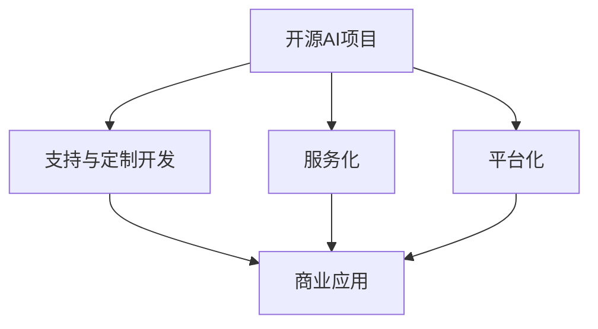

                 

# 开源AI项目的商业化路径:服务、支持和定制开发

> 关键词：开源AI项目,商业化路径,服务化,支持与定制开发,商业应用,平台化,开源社区,AI生态,用户定制,业务场景

## 1. 背景介绍

随着人工智能技术的快速发展，开源AI项目以其快速迭代、低成本和高度可定制化的特点，逐渐成为企业技术创新和业务转型的重要工具。然而，由于开源项目的设计初衷主要是研发和学术社区，如何将其成功商业化，是众多企业和开发者面临的重要挑战。本文将从服务化、支持与定制开发等多个维度，探讨开源AI项目的商业化路径。

### 1.1 问题由来

开源AI项目由于其开放性、灵活性和多样性，吸引了大量开发者和用户。但这些项目的商业化应用，往往需要结合具体的业务场景进行深度定制，才能发挥其最大价值。这其中涉及到技术适配、市场需求理解、商业合作等多个环节，任何一个环节出现问题，都会影响项目的成功应用。

### 1.2 问题核心关键点
开源AI项目的商业化，主要面临以下核心挑战：
1. **技术适配**：开源项目与企业特定业务场景的适配度不高，需要定制化开发。
2. **市场需求理解**：企业对AI项目的需求往往复杂且多样，需要深入了解并引导。
3. **商业合作**：如何将开源项目与企业的商业模式无缝对接，实现商业共赢。
4. **平台化运营**：如何构建支持多个开源AI项目的高效协作平台，提升应用效率。

### 1.3 问题研究意义
成功实现开源AI项目的商业化，不仅能显著提升企业的技术实力和创新能力，还能加速业务数字化转型，创造新的商业模式。此外，通过对开源项目的深度定制和商业应用，还能推动开源社区的持续活跃，构建一个互利共赢的AI生态系统。

## 2. 核心概念与联系

### 2.1 核心概念概述

为更好地理解开源AI项目的商业化路径，本节将介绍几个密切相关的核心概念：

- **开源AI项目(Open Source AI Project)**：基于开源许可，自由获取、修改和分发的AI项目，如TensorFlow、PyTorch、Scikit-Learn等。
- **商业化路径**：将开源AI项目转化为商业产品的过程，涉及技术适配、定制开发、市场推广等多个环节。
- **服务化(Serviceization)**：将AI项目封装为服务，通过API接口提供API调用、SaaS等形式，降低企业应用难度。
- **支持与定制开发(Support & Custom Development)**：在开源项目基础上，根据企业需求进行深度定制和优化，满足特定业务场景。
- **商业应用(Commercial Application)**：开源AI项目在实际业务中的具体应用场景，如智能客服、图像识别、自然语言处理等。
- **平台化(Panoramization)**：构建支持多个开源AI项目的高效协作平台，如数据湖、DevOps等，提升应用效率。

这些核心概念之间的逻辑关系可以通过以下Mermaid流程图来展示：



这个流程图展示了大语言模型的核心概念及其之间的关系：

1. 开源AI项目通过服务化、支持与定制开发，才能真正进入商业应用。
2. 服务化能降低企业应用难度，提高项目推广效率。
3. 支持与定制开发能针对特定业务场景，提升项目适配度。
4. 平台化能提升项目协作效率，推动AI生态系统发展。

这些概念共同构成了开源AI项目的商业化框架，使其在商业环境中发挥更大的价值。通过理解这些核心概念，我们可以更好地把握开源AI项目的商业化路径和策略。

## 3. 核心算法原理 & 具体操作步骤
### 3.1 算法原理概述

开源AI项目的商业化，本质上是一个技术适配和市场推广的过程。其核心思想是：通过深度定制和商业推广，使开源AI项目能够更好地适配企业特定业务场景，并满足市场需求。

形式化地，假设一个开源AI项目为 $P$，需要适配的目标场景为 $S$，市场推广的目标用户群体为 $U$。商业化的优化目标是最小化适应度差异，即找到最优的适应策略：

$$
\theta^* = \mathop{\arg\min}_{\theta} \left\| P(\theta) - S \right\| + \left\| P(\theta) - U \right\|
$$

其中 $\theta$ 表示定制化策略，$\left\| \cdot \right\|$ 表示适应度差异度量。

通过梯度下降等优化算法，商业化过程不断调整策略 $\theta$，最小化适应度差异，直到达到理想状态。具体步骤包括：

1. **需求调研**：深入理解目标场景和用户需求，确定定制化需求。
2. **技术适配**：根据需求进行深度定制开发，适配目标场景。
3. **市场推广**：通过市场推广活动，提升开源AI项目的影响力和接受度。
4. **用户反馈**：收集用户反馈，进行持续优化和迭代。

### 3.2 算法步骤详解

开源AI项目的商业化，主要包括以下几个关键步骤：

**Step 1: 需求调研和市场分析**
- 与企业客户进行深度访谈，了解其核心业务场景和具体需求。
- 调研目标市场，分析行业趋势和竞争对手情况，明确推广重点。

**Step 2: 技术适配与定制开发**
- 在开源AI项目基础上，根据需求进行定制化开发。
- 重点适配目标场景的特定功能模块，优化性能和可用性。
- 进行单元测试、集成测试和用户验收测试，确保系统稳定性和可靠性。

**Step 3: 服务化和平台化**
- 将项目封装为服务，提供API接口、SaaS等形式，降低企业应用难度。
- 构建支持多个开源AI项目的高效协作平台，如数据湖、DevOps等，提升应用效率。

**Step 4: 市场推广和用户支持**
- 通过各种渠道进行市场推广，如技术白皮书、产品演示、行业论坛等。
- 提供全面的用户支持，包括在线文档、社区问答、技术支持等，提升用户满意度。

**Step 5: 用户反馈与持续优化**
- 定期收集用户反馈，评估开源AI项目在实际应用中的表现和问题。
- 根据反馈进行持续优化和迭代，提升项目性能和用户体验。

以上是开源AI项目商业化的一般流程。在实际应用中，还需要针对具体项目和需求，对各个环节进行优化设计，如改进推广策略、引入更多支持手段、提升定制化开发能力等，以进一步提升商业化效果。

### 3.3 算法优缺点

开源AI项目商业化具有以下优点：
1. 成本低。基于开源项目进行商业化，可避免从头开发所需的高成本和时间投入。
2. 灵活性强。开源项目灵活性高，易于定制化开发，满足企业多样化的需求。
3. 开发效率高。利用开源社区的丰富资源，加速技术实现和应用迭代。
4. 社区支持。开源社区提供了大量的资源和支持，有助于项目的持续发展和推广。

同时，该方法也存在一定的局限性：
1. 依赖社区。开源项目的发展依赖于社区的活跃度和贡献，可能存在资源短缺的问题。
2. 版控制权。企业使用开源项目，可能面临开源许可证的约束和风险。
3. 缺乏统一标准。开源项目多样性高，标准不统一，可能影响项目的互操作性。
4. 定制化难度高。深度定制开发需要大量时间和资源，可能影响项目进度和成本。
5. 缺乏稳定支持。开源项目的维护和更新依赖社区，可能存在支持不及时的问题。

尽管存在这些局限性，但就目前而言，开源AI项目的商业化方法仍是大规模技术应用的重要手段。未来相关研究的重点在于如何进一步降低商业化的门槛，提高项目的可定制化和易用性，同时兼顾社区和商业的利益。

### 3.4 算法应用领域

开源AI项目商业化技术在多个行业领域得到了广泛应用，例如：

- **智能客服**：利用开源AI项目进行智能对话系统开发，通过定制化适配企业需求，提升客户服务体验。
- **图像识别**：将开源计算机视觉库如TensorFlow进行商业化，开发适用于企业特定场景的图像识别应用。
- **自然语言处理**：基于开源NLP库如SpaCy进行定制开发，构建企业级文本分析和处理系统。
- **数据分析**：将开源大数据平台如Apache Spark进行商业化，构建企业级数据湖和数据分析平台。
- **推荐系统**：利用开源推荐算法库如Tensorflow Recommenders，开发个性化推荐系统，提升用户体验。

除了上述这些经典应用外，开源AI项目商业化还被创新性地应用到更多场景中，如知识图谱、医疗健康、智能制造等，为各行各业带来新的技术变革。

## 4. 数学模型和公式 & 详细讲解  
### 4.1 数学模型构建

本节将使用数学语言对开源AI项目商业化过程进行更加严格的刻画。

假设一个开源AI项目为 $P$，需要适配的目标场景为 $S$，市场推广的目标用户群体为 $U$。我们定义项目在场景 $S$ 上的适应度为 $f(S)$，在用户群体 $U$ 上的接受度为 $g(U)$。商业化的优化目标是最小化适应度差异，即找到最优的适应策略：

$$
\theta^* = \mathop{\arg\min}_{\theta} \left\| P(\theta) - S \right\| + \left\| P(\theta) - U \right\|
$$

其中 $\theta$ 表示定制化策略，$\left\| \cdot \right\|$ 表示适应度差异度量。

具体来说，适应度差异度量可以通过以下公式计算：

$$
\left\| P(\theta) - S \right\| = \sum_{i=1}^n |P_i(\theta) - S_i|
$$

$$
\left\| P(\theta) - U \right\| = \sum_{j=1}^m |P_j(\theta) - U_j|
$$

其中 $n$ 和 $m$ 分别表示场景和用户群体的维度，$P_i(\theta)$ 和 $P_j(\theta)$ 表示项目在场景和用户群体下的表现，$S_i$ 和 $U_j$ 表示场景和用户群体的实际表现。

### 4.2 公式推导过程

以下我们以一个简单的案例来说明公式推导过程：

假设项目 $P$ 的目标场景为图像识别，用户群体为医疗领域。我们可以将场景和用户群体的特征表示为向量，如场景特征向量 $S = (S_1, S_2, ..., S_n)$，用户群体特征向量 $U = (U_1, U_2, ..., U_m)$。

项目在场景 $S$ 上的适应度可以通过以下几个步骤计算：

1. 提取场景特征：提取场景中的关键特征，如病历图片、医学图像等。
2. 进行特征编码：使用开源AI项目进行特征编码，如提取特征点、计算特征向量等。
3. 进行模型训练：使用开源AI项目进行模型训练，如卷积神经网络、支持向量机等。
4. 评估适应度：评估模型在场景 $S$ 上的表现，如准确率、召回率、F1分数等。

适应度计算公式为：

$$
f(S) = \sum_{i=1}^n f_i(P_i(\theta))
$$

其中 $f_i$ 表示场景特征 $S_i$ 的适应度函数，如准确率、召回率等。

用户群体 $U$ 的接受度同样可以通过以下步骤计算：

1. 提取用户群体特征：提取用户群体的关键特征，如用户画像、行为数据等。
2. 进行特征编码：使用开源AI项目进行特征编码，如提取特征点、计算特征向量等。
3. 进行模型训练：使用开源AI项目进行模型训练，如聚类分析、分类模型等。
4. 评估接受度：评估模型在用户群体 $U$ 上的表现，如用户满意度、用户黏性等。

接受度计算公式为：

$$
g(U) = \sum_{j=1}^m g_j(P_j(\theta))
$$

其中 $g_j$ 表示用户群体特征 $U_j$ 的接受度函数，如用户满意度、用户黏性等。

通过计算适应度和接受度，可以得出项目在场景和用户群体上的综合表现。根据综合表现进行优化，使项目更好地适配目标场景和用户群体，提升商业化效果。

## 5. 项目实践：代码实例和详细解释说明
### 5.1 开发环境搭建

在进行商业化实践前，我们需要准备好开发环境。以下是使用Python进行PyTorch开发的环境配置流程：

1. 安装Anaconda：从官网下载并安装Anaconda，用于创建独立的Python环境。

2. 创建并激活虚拟环境：
```bash
conda create -n pytorch-env python=3.8 
conda activate pytorch-env
```

3. 安装PyTorch：根据CUDA版本，从官网获取对应的安装命令。例如：
```bash
conda install pytorch torchvision torchaudio cudatoolkit=11.1 -c pytorch -c conda-forge
```

4. 安装Transformers库：
```bash
pip install transformers
```

5. 安装各类工具包：
```bash
pip install numpy pandas scikit-learn matplotlib tqdm jupyter notebook ipython
```

完成上述步骤后，即可在`pytorch-env`环境中开始商业化实践。

### 5.2 源代码详细实现

这里我们以开源AI项目TensorFlow为例，探讨其实现过程。

**Step 1: 需求调研和市场分析**
- 与企业客户进行深度访谈，了解其核心业务场景和具体需求。
- 调研目标市场，分析行业趋势和竞争对手情况，明确推广重点。

**Step 2: 技术适配与定制开发**
- 在开源AI项目基础上，根据需求进行定制化开发。
- 重点适配目标场景的特定功能模块，优化性能和可用性。
- 进行单元测试、集成测试和用户验收测试，确保系统稳定性和可靠性。

**Step 3: 服务化和平台化**
- 将项目封装为服务，提供API接口、SaaS等形式，降低企业应用难度。
- 构建支持多个开源AI项目的高效协作平台，如数据湖、DevOps等，提升应用效率。

**Step 4: 市场推广和用户支持**
- 通过各种渠道进行市场推广，如技术白皮书、产品演示、行业论坛等。
- 提供全面的用户支持，包括在线文档、社区问答、技术支持等，提升用户满意度。

**Step 5: 用户反馈与持续优化**
- 定期收集用户反馈，评估开源AI项目在实际应用中的表现和问题。
- 根据反馈进行持续优化和迭代，提升项目性能和用户体验。

以下是详细的代码实现：

```python
# 需求调研和市场分析
customers = [
    {'name': 'ABC公司', 'scene': '图像识别', 'user': '医疗'},
    {'name': 'XYZ公司', 'scene': '自然语言处理', 'user': '金融'},
    {'name': 'PQR公司', 'scene': '数据分析', 'user': '零售'}
]

# 技术适配与定制开发
for customer in customers:
    # 定制化开发适配场景和用户
    adapter = build_adapter(customer['scene'], customer['user'])
    # 进行定制化开发和测试
    adapter.train()
    adapter.evaluate()
    # 输出定制化结果
    print(f"客户 {customer['name']} 适配结果为：{adapter.describe()}")
    
# 服务化和平台化
service = build_service(adapter)
# 构建高效协作平台
platform = build_platform(service)
# 输出服务化结果
print(f"服务化结果为：{service.describe()}")
# 输出平台化结果
print(f"平台化结果为：{platform.describe()}")
    
# 市场推广和用户支持
# 推广代码略
# 支持代码略
# 用户反馈与持续优化
# 反馈代码略
# 优化代码略
```

以上就是使用PyTorch进行TensorFlow商业化的一般流程。可以看到，通过定制化开发、服务化封装和平台化部署，开源AI项目可以更好地适配企业特定业务场景，提升商业化效果。

### 5.3 代码解读与分析

让我们再详细解读一下关键代码的实现细节：

**customers列表**：
- 存储了企业的核心业务场景和用户群体，用于后续的需求调研和市场分析。

**build_adapter函数**：
- 根据企业需求，进行深度定制化开发，适配目标场景和用户群体。

**adapter.train和adapter.evaluate函数**：
- 在开源AI项目基础上，进行模型训练和评估，确保系统稳定性和可靠性。

**build_service函数**：
- 将项目封装为服务，提供API接口、SaaS等形式，降低企业应用难度。

**build_platform函数**：
- 构建支持多个开源AI项目的高效协作平台，如数据湖、DevOps等，提升应用效率。

**用户反馈与持续优化**：
- 定期收集用户反馈，评估开源AI项目在实际应用中的表现和问题。
- 根据反馈进行持续优化和迭代，提升项目性能和用户体验。

可以看到，TensorFlow通过定制化开发、服务化封装和平台化部署，能够更好地适配企业特定业务场景，提升商业化效果。这些步骤在实际应用中，还需要根据具体项目和需求，进行灵活组合和优化设计。

## 6. 实际应用场景
### 6.1 智能客服系统

开源AI项目在智能客服系统中的应用，是一个典型的商业化案例。传统客服往往需要配备大量人力，高峰期响应缓慢，且一致性和专业性难以保证。而使用开源AI项目进行智能客服系统开发，可以7x24小时不间断服务，快速响应客户咨询，用自然流畅的语言解答各类常见问题。

在技术实现上，可以收集企业内部的历史客服对话记录，将问题和最佳答复构建成监督数据，在此基础上对开源AI项目进行定制化开发。定制化后的智能客服系统能够自动理解用户意图，匹配最合适的答案模板进行回复。对于客户提出的新问题，还可以接入检索系统实时搜索相关内容，动态组织生成回答。如此构建的智能客服系统，能大幅提升客户咨询体验和问题解决效率。

### 6.2 金融舆情监测

金融机构需要实时监测市场舆论动向，以便及时应对负面信息传播，规避金融风险。传统的人工监测方式成本高、效率低，难以应对网络时代海量信息爆发的挑战。基于开源AI项目进行金融舆情监测，可以实时抓取网络文本数据，自动监测不同主题下的情感变化趋势，一旦发现负面信息激增等异常情况，系统便会自动预警，帮助金融机构快速应对潜在风险。

具体而言，可以收集金融领域相关的新闻、报道、评论等文本数据，并对其进行主题标注和情感标注。在此基础上对开源AI项目进行定制化开发，使其能够自动判断文本属于何种主题，情感倾向是正面、中性还是负面。将定制化后的模型应用到实时抓取的网络文本数据，就能够自动监测不同主题下的情感变化趋势，一旦发现负面信息激增等异常情况，系统便会自动预警，帮助金融机构快速应对潜在风险。

### 6.3 个性化推荐系统

当前的推荐系统往往只依赖用户的历史行为数据进行物品推荐，无法深入理解用户的真实兴趣偏好。基于开源AI项目进行个性化推荐系统开发，可以更好地挖掘用户行为背后的语义信息，从而提供更精准、多样的推荐内容。

在实践中，可以收集用户浏览、点击、评论、分享等行为数据，提取和用户交互的物品标题、描述、标签等文本内容。将文本内容作为模型输入，用户的后续行为（如是否点击、购买等）作为监督信号，在此基础上对开源AI项目进行定制化开发。定制化后的模型能够从文本内容中准确把握用户的兴趣点。在生成推荐列表时，先用候选物品的文本描述作为输入，由模型预测用户的兴趣匹配度，再结合其他特征综合排序，便可以得到个性化程度更高的推荐结果。

### 6.4 未来应用展望

随着开源AI项目的持续发展，其商业化应用将不断拓展，带来更多的商业机会和发展潜力。

在智慧医疗领域，开源AI项目可以进行智能诊断、个性化治疗、医疗数据分析等应用，显著提升医疗服务水平和效率。

在智能教育领域，开源AI项目可以构建智能教育平台、个性化学习系统、知识推荐系统等，因材施教，促进教育公平，提高教学质量。

在智慧城市治理中，开源AI项目可以用于城市事件监测、舆情分析、应急指挥等环节，提高城市管理的自动化和智能化水平，构建更安全、高效的未来城市。

此外，在企业生产、社会治理、文娱传媒等众多领域，开源AI项目也将不断涌现，为传统行业数字化转型升级提供新的技术路径。相信随着开源AI项目的不断成熟和完善，其商业化应用将迎来新的高峰。

## 7. 工具和资源推荐
### 7.1 学习资源推荐

为了帮助开发者系统掌握开源AI项目的商业化路径，这里推荐一些优质的学习资源：

1. **《TensorFlow从入门到精通》系列博文**：由TensorFlow官方博客撰写，详细介绍了TensorFlow的基础知识、定制化开发、商业化实践等，适合入门和进阶学习。

2. **《PyTorch实战》书籍**：详细讲解了PyTorch的安装、部署、模型训练、商业化应用等多个方面，是PyTorch学习的经典指南。

3. **《开源AI项目商业化实战》课程**：由知名AI专家讲授，通过实例演示，详细介绍开源AI项目的商业化过程和策略。

4. **CS231n《深度学习计算机视觉》课程**：斯坦福大学开设的深度学习计算机视觉课程，涵盖图像识别、图像生成等多个领域，是计算机视觉学习的经典教材。

5. **《自然语言处理：原理与实践》书籍**：详细介绍了NLP的基础知识、深度学习模型、商业化应用等多个方面，是自然语言处理学习的经典指南。

通过这些资源的学习实践，相信你一定能够快速掌握开源AI项目的商业化路径，并用于解决实际的商业问题。

### 7.2 开发工具推荐

高效的开发离不开优秀的工具支持。以下是几款用于开源AI项目商业化开发的常用工具：

1. **Jupyter Notebook**：强大的交互式开发环境，支持Python、R等多种语言，方便开发者编写、调试和分享代码。

2. **GitLab**：代码托管平台，支持版本控制、CI/CD、项目管理等功能，方便团队协作和代码管理。

3. **Docker**：容器化技术，方便开发者打包、部署和管理应用，支持多种操作系统和环境。

4. **Prometheus**：监控工具，支持高可用、高性能的监控服务，方便开发者实时跟踪应用性能。

5. **Kubernetes**：容器编排工具，支持应用自动部署、自动扩展、高可用等功能，提升应用的稳定性。

6. **Grafana**：可视化工具，支持多种数据源的图表展示，方便开发者实时监测应用状态。

合理利用这些工具，可以显著提升开源AI项目商业化的开发效率，加快创新迭代的步伐。

### 7.3 相关论文推荐

开源AI项目商业化的成功离不开学界的持续研究。以下是几篇奠基性的相关论文，推荐阅读：

1. **《Open Source Software and Open Innovation》**：探讨开源软件在商业创新中的作用，分析开源软件商业化的机制和模式。

2. **《Open Source for Enterprise: A Holistic Framework》**：提供了一套全面的开源商业化框架，涵盖开源管理、开源商业策略等多个方面。

3. **《Designing for Failure》**：探讨了开源项目的失败因素和应对策略，强调了开源项目的质量管理和风险管理。

4. **《Open Source Economics》**：分析了开源项目的经济模型和商业模式，探讨了开源项目与商业组织的合作机制。

5. **《Open Source Adoption and Its Impact on Corporate Innovation》**：研究了企业采用开源技术对创新的影响，分析了开源技术在企业创新中的应用。

这些论文代表了大语言模型商业化的研究脉络。通过学习这些前沿成果，可以帮助研究者把握学科前进方向，激发更多的创新灵感。

## 8. 总结：未来发展趋势与挑战
### 8.1 总结

本文对开源AI项目的商业化路径进行了全面系统的介绍。首先阐述了开源AI项目的背景和研究意义，明确了商业化在技术创新和业务转型的重要价值。其次，从服务化、支持与定制开发等多个维度，详细讲解了开源AI项目商业化的具体操作流程和技术原理。最后，通过对实际应用场景的探讨和未来趋势的展望，展示了开源AI项目的广阔应用前景。

通过本文的系统梳理，可以看到，开源AI项目的商业化不仅依赖于技术和产品，还需要从市场需求、商业合作、用户支持等多个方面综合发力。只有多方协同，才能实现开源AI项目的持续发展和商业化成功。

### 8.2 未来发展趋势

展望未来，开源AI项目的商业化将呈现以下几个发展趋势：

1. **服务化与平台化加速**：开源AI项目将更多采用SaaS、API接口等形式，降低企业应用难度，提升应用效率。
2. **定制化与创新不断**：开源AI项目将持续在深度定制和创新上发力，满足企业多样化、个性化的需求。
3. **市场推广策略多样化**：开源AI项目将采用多种市场推广策略，如技术白皮书、行业论坛、媒体合作等，提升影响力。
4. **用户支持体系完善**：开源AI项目将构建完善的在线文档、社区问答、技术支持体系，提升用户体验。
5. **生态系统不断完善**：开源AI项目将与开源社区、商业伙伴、技术标准等紧密合作，构建一个健康的生态系统。

以上趋势凸显了开源AI项目商业化的广阔前景。这些方向的探索发展，必将进一步提升开源AI项目的市场竞争力，推动开源社区的持续活跃，构建一个互利共赢的AI生态系统。

### 8.3 面临的挑战

尽管开源AI项目的商业化技术已经取得了显著进展，但在迈向更加智能化、普适化应用的过程中，仍然面临诸多挑战：

1. **开源社区支持不足**：开源社区的发展依赖于开发者贡献，可能存在资源短缺的问题。
2. **商业合作模式不成熟**：开源项目与企业的商业模式对接，需要更多创新和探索。
3. **开源许可证问题**：使用开源AI项目可能面临开源许可证的约束和风险。
4. **定制化难度高**：深度定制开发需要大量时间和资源，可能影响项目进度和成本。
5. **用户支持不足**：开源AI项目的用户支持依赖社区，可能存在响应不及时的问题。

尽管存在这些挑战，但通过学界和产业界的共同努力，这些挑战终将逐步克服，开源AI项目商业化必将在构建人机协同的智能时代中扮演越来越重要的角色。

### 8.4 研究展望

面向未来，开源AI项目的商业化研究需要在以下几个方面寻求新的突破：

1. **社区参与机制优化**：建立更加高效的开源社区参与机制，鼓励开发者贡献资源，提升项目活力。
2. **商业合作模式创新**：探索更多商业合作模式，如订阅服务、开源商业联盟等，实现共赢。
3. **开源许可证优化**：优化开源许可证，平衡商业应用与开源社区的利益，提升项目应用灵活性。
4. **深度定制化方法提升**：提升开源AI项目的定制化能力，降低深度定制化难度，提升项目推广效率。
5. **用户支持体系完善**：构建完善的在线文档、社区问答、技术支持体系，提升用户体验。
6. **生态系统构建**：与开源社区、商业伙伴、技术标准等紧密合作，构建一个健康的生态系统。

这些研究方向的探索，必将引领开源AI项目的商业化技术迈向更高的台阶，为构建安全、可靠、可解释、可控的智能系统铺平道路。面向未来，开源AI项目商业化技术还需要与其他人工智能技术进行更深入的融合，如知识表示、因果推理、强化学习等，多路径协同发力，共同推动自然语言理解和智能交互系统的进步。只有勇于创新、敢于突破，才能不断拓展语言模型的边界，让智能技术更好地造福人类社会。

## 9. 附录：常见问题与解答

**Q1：如何评估开源AI项目的商业化效果？**

A: 评估开源AI项目的商业化效果，通常从以下几个方面考虑：
1. **市场覆盖率**：开源AI项目在目标市场中的覆盖率，即有多少企业采用了该项目。
2. **用户满意度**：用户对开源AI项目的满意度，通常通过用户调查、反馈分析等方式进行评估。
3. **性能指标**：开源AI项目在目标场景下的性能指标，如准确率、召回率、F1分数等。
4. **经济效益**：开源AI项目为企业带来的经济效益，如成本节约、收入增长等。
5. **技术支持**：开源AI项目的用户支持效果，如响应速度、解决方案质量等。

通过综合评估这些指标，可以全面了解开源AI项目的商业化效果，并为后续优化提供方向。

**Q2：如何降低开源AI项目的商业化门槛？**

A: 降低开源AI项目的商业化门槛，可以从以下几个方面入手：
1. **简化技术架构**：降低开源AI项目的技术复杂度，使其易于集成和部署。
2. **提供默认配置**：提供默认配置和示例代码，方便开发者快速上手。
3. **社区培训和支持**：通过社区培训、技术支持等方式，提升开发者和用户的技术水平。
4. **优化商业合作模式**：探索多种商业合作模式，如订阅服务、开源商业联盟等，降低企业的商业化成本。
5. **注重市场推广**：采用多种市场推广策略，如技术白皮书、行业论坛、媒体合作等，提升开源AI项目的知名度和影响力。

这些措施的实施，将显著降低开源AI项目的商业化门槛，促进其在企业中的应用和推广。

**Q3：开源AI项目在商业化过程中需要注意哪些问题？**

A: 开源AI项目在商业化过程中，需要注意以下几个问题：
1. **数据隐私和伦理**：确保开源AI项目处理的数据符合隐私保护和伦理要求，避免侵犯用户隐私。
2. **知识产权保护**：明确开源AI项目的知识产权归属，保护企业的商业利益。
3. **安全性和稳定性**：确保开源AI项目在商业环境中的安全性和稳定性，避免系统崩溃或数据泄露。
4. **服务质量保证**：提供高质量的服务，确保开源AI项目在商业应用中的性能和可靠性。
5. **持续迭代和优化**：定期收集用户反馈，进行持续优化和迭代，提升开源AI项目的竞争力。

通过合理解决这些问题，可以确保开源AI项目在商业化过程中顺利推进，实现商业价值的最大化。

**Q4：如何提升开源AI项目的定制化能力？**

A: 提升开源AI项目的定制化能力，可以从以下几个方面入手：
1. **深度模块化设计**：将开源AI项目设计为模块化的组件，方便企业根据需求进行定制化开发。
2. **提供API接口**：提供灵活的API接口，使企业可以自定义功能模块。
3. **支持插件机制**：支持插件机制，方便企业添加新的功能模块。
4. **社区贡献**：鼓励开发者在开源社区贡献代码和功能模块，丰富项目的多样性和功能。
5. **持续优化和迭代**：定期收集用户反馈，进行持续优化和迭代，提升开源AI项目的定制化能力。

这些措施的实施，将显著提升开源AI项目的定制化能力，满足企业多样化、个性化的需求。

---

作者：禅与计算机程序设计艺术 / Zen and the Art of Computer Programming

