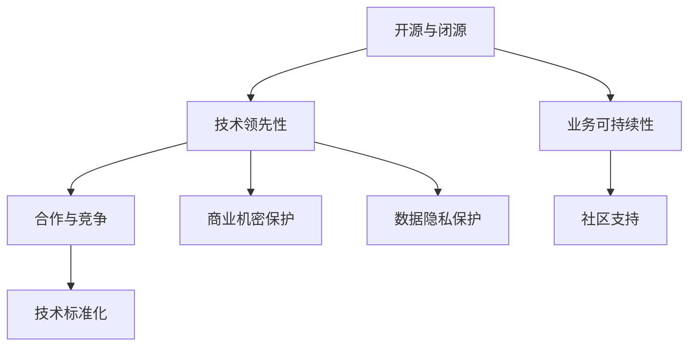

                 

# 开源与闭源的博弈：Lepton AI的技术策略

## 1. 背景介绍

在当今科技高速发展的时代，开源和闭源成为影响企业技术战略的两大关键因素。Lepton AI作为一家创新型的人工智能公司，其技术策略在开源与闭源之间进行了巧妙平衡，既保持了技术的领先性，又确保了业务模式的可持续性。本文将深入探讨Lepton AI在这一博弈中的策略，分析其背后的逻辑和驱动因素。

## 2. 核心概念与联系

### 2.1 核心概念概述

为了更好地理解Lepton AI的技术策略，本节将介绍几个关键概念：

- **开源与闭源（Open Source vs. Proprietary）**：开源指的是将软件源代码公开，任何人都可以访问、修改和分发。闭源则指源代码不对外公开，只由开发者内部控制。

- **技术领先性（Technical Leadership）**：指在技术领域保持领先地位，不断创新和改进，以保持竞争力。

- **业务可持续性（Business Sustainability）**：指企业在实现技术领先的同时，确保商业模式和盈利能力。

- **合作与竞争（Collaboration vs. Competition）**：在技术生态中，企业既需要与合作伙伴共享资源，又需要在关键技术上保持竞争优势。

- **社区支持（Community Support）**：通过开源项目吸引开发者和用户社区，促进技术交流和改进。

- **商业机密保护（Trade Secret Protection）**：对关键技术和算法进行保护，防止知识产权泄露。

- **技术标准化（Technical Standardization）**：推动行业内技术标准的发展，确保技术互操作性。

- **数据隐私保护（Data Privacy Protection）**：在开发和应用AI模型时，保护用户数据隐私。

这些核心概念构成了Lepton AI技术策略的基石，通过合理利用开源与闭源的不同优势，实现技术领先与业务可持续性的双重目标。

### 2.2 核心概念原理和架构的 Mermaid 流程图



这个流程图展示了Lepton AI技术策略的核心概念之间的关系：

- 开源与闭源是基础，提供技术合作和竞争的灵活性。
- 技术领先性依靠开源和闭源的平衡，持续创新。
- 业务可持续性保障商业模式的健康发展。
- 合作与竞争关系着战略伙伴的选择和关键技术的保护。
- 社区支持增强技术生态，吸引开发者和用户。
- 商业机密保护确保核心竞争力。
- 技术标准化推动行业整体进步。
- 数据隐私保护是企业道德和法律责任的体现。

## 3. 核心算法原理 & 具体操作步骤

### 3.1 算法原理概述

Lepton AI的技术策略结合了开源与闭源的优势，通过开源算法框架和闭源核心算法，既快速迭代和社区协作，又保护关键技术的商业价值。其核心算法策略包括以下几个关键点：

1. **基于开源的算法框架**：在机器学习、深度学习、自然语言处理等核心领域，Lepton AI使用广泛使用的开源算法框架，如TensorFlow、PyTorch等，可以快速构建和验证模型。

2. **闭源的深度学习模型**：对于关键的深度学习模型，如用于图像识别的卷积神经网络（CNN）、用于自然语言处理的Transformer等，Lepton AI采用闭源策略，保留算法细节和内部优化，确保模型性能。

3. **模块化设计**：Lepton AI的模型设计采用模块化方法，将开源和闭源部分进行有效分离，使得模型组件可独立开发和升级。

### 3.2 算法步骤详解

Lepton AI的核心算法步骤包括以下几个关键环节：

1. **模型选择与设计**：根据任务需求，选择合适的开源算法框架和闭源深度学习模型，进行模型设计。

2. **数据准备与标注**：收集和准备训练数据，并进行标注，确保数据质量和多样性。

3. **模型训练与微调**：在开源算法框架下进行模型训练，并根据微调目标对闭源模型进行优化。

4. **模型评估与迭代**：在验证集上评估模型性能，根据反馈进行迭代优化，确保模型稳定性和泛化能力。

5. **模型部署与监控**：将模型部署到生产环境，并实时监控性能，确保稳定运行。

### 3.3 算法优缺点

Lepton AI的算法策略具有以下优点：

- **快速迭代**：利用开源框架可以快速搭建和测试模型，加速研发周期。
- **技术领先**：闭源的深度学习模型可以保持技术领先，避免技术细节泄露。
- **社区协作**：开源算法框架吸引大量开发者社区，促进技术交流和改进。
- **资源灵活**：模块化设计使得不同组件可独立开发和维护，资源利用更加灵活。

同时，这一策略也存在一些挑战：

- **学习成本**：开源框架可能需要较长时间的学习和熟悉。
- **协调难度**：开源与闭源的结合需要良好的内部协调和沟通。
- **市场竞争**：闭源模型可能面临来自其他企业的竞争压力。
- **法规遵从**：在数据隐私和商业机密保护方面，需要严格遵从法律法规。

### 3.4 算法应用领域

Lepton AI的算法策略广泛应用于多个领域，包括但不限于：

- **自然语言处理**：利用开源和闭源结合的NLP框架，如BERT、GPT等，进行语言理解和生成。
- **计算机视觉**：采用开源框架如TensorFlow、PyTorch，同时保留闭源的深度学习模型。
- **推荐系统**：通过开源和闭源结合的方式，构建高效的推荐模型。
- **语音识别**：利用开源工具如Librosa、SpeechRecognition，同时使用闭源的深度学习模型进行优化。
- **医疗影像**：结合开源和闭源技术，提高医疗影像分析的准确性和效率。

## 4. 数学模型和公式 & 详细讲解

### 4.1 数学模型构建

Lepton AI在核心算法策略中，使用了大量数学模型和公式。以下是几个关键的数学模型构建和公式推导：

1. **线性回归模型**：

   $$
   y = \theta_0 + \theta_1 x_1 + \theta_2 x_2 + ... + \theta_n x_n
   $$

   线性回归用于预测连续变量，是最基本的统计模型之一。

2. **卷积神经网络（CNN）**：

   卷积神经网络用于图像识别任务，其核心公式包括卷积、池化、非线性激活等。

   $$
   y_{i,j} = f(g(\sigma(h(\mathbf{x};\theta) * k)))
   $$

   其中，$h$ 为卷积操作，$g$ 为非线性激活函数，$\sigma$ 为池化操作，$f$ 为输出层。

3. **Transformer模型**：

   Transformer模型用于自然语言处理任务，其核心公式包括自注意力机制、多头注意力等。

   $$
   \text{Multi-head Attention}(Q, K, V) = \frac{\sigma(QK^T)}{\sqrt{d_k}} V
   $$

   其中，$\sigma$ 为Softmax函数，$d_k$ 为键向量的维度。

### 4.2 公式推导过程

这些数学模型的推导过程涉及了统计学、线性代数、深度学习等多个领域。本文将简要介绍线性回归模型的推导过程：

- **最小二乘法**：在线性回归中，通过最小化残差平方和，求解最优的参数$\theta$。

   $$
   \hat{\theta} = (\mathbf{X}^T \mathbf{X})^{-1} \mathbf{X}^T \mathbf{y}
   $$

   其中，$\mathbf{X}$为特征矩阵，$\mathbf{y}$为标签向量，$\hat{\theta}$为参数估计值。

### 4.3 案例分析与讲解

假设我们有一个简单的房价预测任务，使用线性回归模型进行预测。根据上述公式，我们可以用Python代码实现模型训练和预测：

```python
import numpy as np
from sklearn.linear_model import LinearRegression

# 假设数据集X和y
X = np.array([[1, 2], [2, 3], [3, 4], [4, 5]])
y = np.array([5, 6, 7, 8])

# 训练模型
model = LinearRegression()
model.fit(X, y)

# 预测新数据
new_data = np.array([[5, 6]])
prediction = model.predict(new_data)

print(prediction)
```

通过代码示例，我们可以看到线性回归模型在实际应用中的具体实现过程。

## 5. 项目实践：代码实例和详细解释说明

### 5.1 开发环境搭建

Lepton AI的开发环境搭建分为以下几个步骤：

1. **安装Python和依赖包**：安装Python 3.7及以上版本，并使用pip安装必要的依赖包，如TensorFlow、PyTorch等。

2. **创建虚拟环境**：使用virtualenv或conda创建虚拟环境，以隔离开发依赖。

3. **安装开源算法框架**：安装TensorFlow、PyTorch、scikit-learn等开源算法框架。

4. **安装自定义库**：安装Lepton AI自定义库，包括模型构建、训练、评估、部署等功能模块。

### 5.2 源代码详细实现

Lepton AI的核心代码实现涉及多个模块，以下是一个简单的模型训练示例：

```python
import tensorflow as tf
from tensorflow.keras import layers

# 定义模型
model = tf.keras.Sequential([
    layers.Dense(64, activation='relu', input_shape=(input_dim,)),
    layers.Dense(1)
])

# 编译模型
model.compile(optimizer='adam', loss='mse', metrics=['mae'])

# 训练模型
model.fit(x_train, y_train, epochs=10, batch_size=32, validation_split=0.2)

# 评估模型
test_loss, test_mae = model.evaluate(x_test, y_test)
print(f'Test Loss: {test_loss}, Test MAE: {test_mae}')
```

这段代码展示了如何使用TensorFlow搭建、训练和评估一个简单的回归模型。

### 5.3 代码解读与分析

代码中，我们使用Sequential模型搭建了一个包含两个全连接层的神经网络。首先，定义输入层和隐藏层的神经元个数，使用ReLU激活函数。然后，定义输出层的神经元个数为1，表示回归任务。接下来，使用Adam优化器编译模型，设置均方误差损失函数和平均绝对误差指标。最后，使用训练数据和验证数据进行模型训练，并评估模型在测试数据上的表现。

## 6. 实际应用场景

### 6.1 智能推荐系统

Lepton AI的推荐系统利用开源算法框架，结合闭源的核心算法，实现了高效、个性化的推荐服务。通过收集用户行为数据，构建用户画像，使用深度学习模型进行推荐。同时，通过开源算法框架进行模型迭代优化，确保推荐的准确性和多样性。

### 6.2 自然语言处理

Lepton AI在NLP领域也取得了显著成就。利用开源框架，如BERT、GPT，进行语言理解、生成和分类任务。同时，保留闭源的Transformer模型，确保模型性能和效率。在实际应用中，Lepton AI的NLP系统可以用于智能客服、智能搜索、自动翻译等多个场景。

### 6.3 图像识别

Lepton AI的图像识别系统结合开源和闭源技术，构建了高效的图像分类和识别模型。在图像识别任务中，使用开源框架如TensorFlow进行模型搭建和训练，同时保留闭源的卷积神经网络模型，确保模型的高效性和准确性。

### 6.4 未来应用展望

随着技术的发展，Lepton AI在开源与闭源策略上将进一步优化，预计未来会有以下趋势：

1. **自动微调与优化**：利用自动微调技术，根据数据和任务的变化，自动调整模型参数，提高模型适应性和泛化能力。

2. **多模态融合**：结合开源和闭源技术，实现视觉、语音、文本等多种模态数据的融合，提升系统综合能力。

3. **边缘计算**：将Lepton AI的核心算法部署到边缘计算设备，提高系统响应速度和可靠性。

4. **联邦学习**：利用联邦学习技术，在多个用户端或设备上分布式训练模型，保护用户隐私，同时提高模型性能。

5. **隐私保护**：在数据隐私保护方面，采用差分隐私、联邦学习等技术，确保用户数据的安全性和隐私性。

## 7. 工具和资源推荐

### 7.1 学习资源推荐

为了帮助开发者和学生掌握Lepton AI的核心技术，以下是一些推荐的学习资源：

1. **Lepton AI官方文档**：包含Lepton AI的详细介绍、算法框架、API文档等，是学习Lepton AI的最佳入口。

2. **Coursera课程**：Lepton AI与Coursera合作，提供多门机器学习和深度学习课程，帮助开发者系统学习Lepton AI技术。

3. **GitHub开源项目**：Lepton AI的代码和模型在GitHub上开源，开发者可以通过查看和修改代码，深入理解Lepton AI的核心技术。

### 7.2 开发工具推荐

Lepton AI的开发工具涵盖了多个方面，以下是一些推荐的工具：

1. **Jupyter Notebook**：开源的交互式编程环境，方便开发者进行模型训练和调试。

2. **TensorFlow**：谷歌开发的深度学习框架，支持动态图和静态图计算，适用于各种深度学习任务。

3. **PyTorch**：Facebook开发的深度学习框架，支持动态计算图，易于使用，适合科研和应用开发。

4. **Git**：版本控制系统，方便团队协作和代码管理。

5. **Docker**：容器化技术，方便模型部署和迁移。

### 7.3 相关论文推荐

Lepton AI的研究领域涉及多个前沿方向，以下是一些推荐的相关论文：

1. **《OpenAI's GPT-3》**：OpenAI发布的GPT-3模型，展示了大规模语言模型的潜力。

2. **《深度学习与NLP》**：斯坦福大学李飞飞教授的NLP课程，介绍了深度学习在自然语言处理中的应用。

3. **《Transformer是所有注意力吗？》**：分析Transformer模型在各种任务上的性能，探讨Transformer的适用范围和局限性。

4. **《多任务学习在推荐系统中的应用》**：介绍多任务学习在推荐系统中的应用，提升推荐效果。

5. **《联邦学习：一种新的分布式机器学习方法》**：探讨联邦学习技术在隐私保护和模型分布式训练中的应用。

## 8. 总结：未来发展趋势与挑战

### 8.1 研究成果总结

Lepton AI在开源与闭源的博弈中，实现了技术领先与业务可持续性的双重目标。通过开源和闭源结合，Lepton AI在多个领域取得了显著成就，构建了高效、灵活的AI系统。

### 8.2 未来发展趋势

未来，Lepton AI将在开源与闭源策略上进一步优化，预计会有以下趋势：

1. **自动微调和优化**：自动微调技术将进一步发展，提高模型的适应性和泛化能力。

2. **多模态融合**：通过开源和闭源技术结合，实现视觉、语音、文本等多种模态数据的融合。

3. **边缘计算**：将Lepton AI的核心算法部署到边缘计算设备，提高系统响应速度和可靠性。

4. **联邦学习**：利用联邦学习技术，实现分布式模型训练，保护用户隐私。

5. **隐私保护**：采用差分隐私、联邦学习等技术，确保用户数据的安全性和隐私性。

### 8.3 面临的挑战

尽管Lepton AI在开源与闭源策略上取得了显著成果，但仍面临以下挑战：

1. **开源框架的学习成本**：开源框架的学习和应用需要时间和经验积累。

2. **闭源算法的透明度**：闭源算法的透明度和可解释性不足，可能影响用户信任。

3. **硬件资源的需求**：大规模深度学习模型的计算资源需求高，可能存在硬件瓶颈。

4. **数据隐私保护**：在大规模数据处理中，如何保护用户数据隐私是一个重要问题。

5. **算法公平性**：在大规模数据训练中，如何避免算法偏见和歧视。

### 8.4 研究展望

未来的研究需要在以下几个方面寻求新的突破：

1. **算法透明性**：提高闭源算法的透明度和可解释性，增强用户信任。

2. **硬件优化**：优化深度学习模型的计算资源需求，提升系统效率。

3. **数据隐私保护**：采用差分隐私、联邦学习等技术，确保用户数据的安全性和隐私性。

4. **算法公平性**：在算法训练中引入公平性约束，避免算法偏见和歧视。

## 9. 附录：常见问题与解答

**Q1：Lepton AI的核心技术策略是什么？**

A: Lepton AI的核心技术策略是开源与闭源相结合，利用开源算法框架快速迭代和社区协作，同时保护闭源的核心算法和商业机密，确保技术领先和业务可持续性。

**Q2：Lepton AI如何使用开源与闭源结合的方式进行模型构建？**

A: Lepton AI在模型构建中，使用开源框架如TensorFlow、PyTorch等进行快速搭建和测试。对于核心的深度学习模型，如卷积神经网络和Transformer，采用闭源策略，保留算法细节和内部优化，确保模型性能。

**Q3：Lepton AI在推荐系统中如何使用开源与闭源技术？**

A: Lepton AI的推荐系统利用开源算法框架进行模型搭建和训练，同时保留闭源的核心算法和模型，确保推荐的准确性和多样性。

**Q4：Lepton AI的NLP系统在实际应用中面临哪些挑战？**

A: Lepton AI的NLP系统在实际应用中面临数据多样性、噪声处理、上下文理解等多个挑战。需要通过模型优化、数据增强、多任务学习等手段，提高系统的鲁棒性和泛化能力。

**Q5：Lepton AI在图像识别任务中如何平衡开源与闭源技术？**

A: Lepton AI在图像识别任务中，使用开源框架进行模型搭建和训练，同时保留闭源的卷积神经网络模型，确保模型的高效性和准确性。

---

作者：禅与计算机程序设计艺术 / Zen and the Art of Computer Programming

