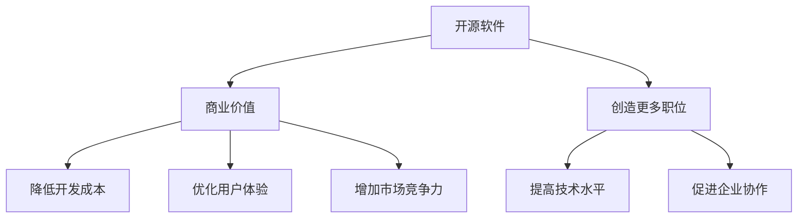

                 

# 开源运动的经济影响:开源软件的商业价值和就业影响

## 1. 背景介绍

### 1.1 问题由来

开源运动自诞生以来，就成为软件开发领域的一股不可忽视的力量。从Linux内核的诞生，到Apache、Nginx、MySQL等众多组件的出现，开源软件逐渐被广泛应用到各个行业。开源软件以其高效、稳定、可扩展的特性，在企业中起到了举足轻重的作用。

然而，开源运动的经济影响一直是业界和学术界关注的焦点。一方面，开源软件的广泛应用带来了巨大的商业价值；另一方面，开源运动也创造了大批就业机会，推动了软件行业的发展。那么，开源软件是如何实现商业价值和就业影响的？它们如何互为促进、互相影响？本文将从开源软件的特点出发，详细探讨其对经济和就业的贡献。

## 2. 核心概念与联系

### 2.1 核心概念概述

开源软件（Open Source Software, OSS）指的是源代码公开的软件，任何人都可以访问、使用、修改和分发源代码。开源运动强调协作、透明、自由，旨在通过开放合作，提高软件质量和创新能力。

开源软件通过以下几种方式实现商业价值：
1. 降低开发成本：开源软件可以共享开发资源，减少重复工作，提高开发效率。
2. 优化用户体验：开源软件由全球开发者维护，持续迭代优化，提供更好的用户体验。
3. 增加市场竞争力：开源软件具有开放特性，吸引更多用户和开发者，形成良性循环。

开源运动对就业的影响主要体现在以下几个方面：
1. 创造更多职位：开源项目的开发、维护、测试等环节需要大量人力资源，为开发者提供了就业机会。
2. 推动技术创新：开源项目鼓励创新，吸引了大量技术人才，提升整个行业技术水平。
3. 促进企业协作：开源社区鼓励跨企业合作，通过知识共享，提高就业市场的灵活性和多样性。

这些核心概念之间存在相互联系，共同构成了开源运动对经济和就业影响的复杂网络。下图展示了开源软件的商业价值和就业影响的联系：



## 3. 核心算法原理 & 具体操作步骤

### 3.1 算法原理概述

开源软件对经济和就业的影响可以通过两种算法进行刻画：一是开源软件的商业价值评估算法，二是开源就业市场的影响分析算法。

商业价值评估算法主要通过以下几个步骤进行：
1. 确定开源软件的使用频率和范围，通过统计数据衡量其市场影响力。
2. 分析开源软件的使用效果，包括性能、稳定性、兼容性等方面。
3. 计算开源软件对企业的直接经济效益，如降低成本、提升效率等。

就业市场的影响分析算法主要通过以下几个步骤进行：
1. 收集开源项目的人才需求数据，如职位发布、招聘信息等。
2. 分析开源项目的技术栈和技能要求，确定所需人才的类型和数量。
3. 评估开源项目对就业市场的影响，包括就业岗位的增加、技能要求的提升等。

### 3.2 算法步骤详解

**商业价值评估算法：**

**Step 1: 数据收集**
- 收集开源软件的使用频率数据，如GitHub的下载量、安装量等。
- 收集开源软件的使用效果数据，如用户反馈、社区评分等。
- 收集开源软件对企业的经济效益数据，如降低的开发成本、提高的运营效率等。

**Step 2: 数据分析**
- 统计开源软件的市场影响力，如使用频率、覆盖范围等。
- 分析开源软件的性能效果，如性能指标、稳定性等。
- 计算开源软件的经济效益，如成本节约、效率提升等。

**Step 3: 模型建立**
- 建立开源软件的商业价值评估模型，如线性回归模型、逻辑回归模型等。
- 对模型进行训练，确保其准确性和可靠性。
- 使用模型对开源软件的商业价值进行预测和评估。

**就业市场的影响分析算法：**

**Step 1: 数据收集**
- 收集开源项目的人才需求数据，如招聘网站上的职位发布信息。
- 收集开源项目的技术栈和技能要求数据，如项目文档、开源社区的讨论等。

**Step 2: 数据分析**
- 统计开源项目的人才需求数量和类型。
- 分析开源项目的技术栈和技能要求，确定所需人才的类型和数量。
- 评估开源项目对就业市场的影响，包括就业岗位的增加、技能要求的提升等。

**Step 3: 模型建立**
- 建立开源就业市场的影响分析模型，如回归模型、分类模型等。
- 对模型进行训练，确保其准确性和可靠性。
- 使用模型对开源项目的就业影响进行预测和评估。

### 3.3 算法优缺点

开源软件的商业价值评估算法具有以下优点：
1. 数据易于获取：开源软件的使用频率、性能效果、经济效益等数据相对容易获取。
2. 模型简单：商业价值评估模型通常较为简单，易于理解和应用。
3. 结果可验证：通过实际使用数据，可以验证模型的准确性和可靠性。

同时，该算法也存在以下缺点：
1. 数据偏差：开源软件的使用数据可能存在偏差，影响评估结果的准确性。
2. 经济效益难以量化：开源软件的经济效益可能难以准确衡量，影响评估结果的客观性。
3. 模型泛化性不足：商业价值评估模型通常较为简单，泛化性不足。

开源就业市场的影响分析算法具有以下优点：
1. 数据多样：开源项目的人才需求数据、技术栈和技能要求数据来源广泛，具有多样性。
2. 模型灵活：就业市场的影响分析模型可以根据不同类型的人才需求和技能要求，进行灵活调整。
3. 结果可信：通过实际就业数据，可以验证模型的准确性和可靠性。

同时，该算法也存在以下缺点：
1. 数据获取难度大：开源项目的人才需求数据、技术栈和技能要求数据可能难以获取。
2. 模型复杂：就业市场的影响分析模型通常较为复杂，难以理解和应用。
3. 数据时滞性：开源项目的人才需求数据、技术栈和技能要求数据可能存在时滞，影响评估结果的时效性。

### 3.4 算法应用领域

开源软件的商业价值评估算法可以应用于以下领域：
1. 企业决策：帮助企业评估开源软件对自身业务的影响，优化软件选择和应用。
2. 市场分析：帮助软件公司和投资机构了解开源软件市场的发展趋势和前景。
3. 学术研究：为学术界提供开源软件商业价值的实证数据，推动学术研究的发展。

开源就业市场的影响分析算法可以应用于以下领域：
1. 人才招聘：帮助企业和开发者了解开源项目的招聘需求和技术要求，优化招聘策略。
2. 职业发展：帮助开发者了解开源项目对技能要求的影响，制定职业发展计划。
3. 政策制定：帮助政府和企业制定开源政策，推动开源社区的发展和就业市场的繁荣。

## 4. 数学模型和公式 & 详细讲解 & 举例说明

### 4.1 数学模型构建

开源软件的商业价值评估模型通常使用线性回归模型，如多元线性回归模型：

$$
Y = \beta_0 + \beta_1X_1 + \beta_2X_2 + \cdots + \beta_nX_n + \epsilon
$$

其中，$Y$ 表示开源软件的商业价值，$X_1, X_2, \cdots, X_n$ 表示影响商业价值的各种因素，$\beta_0, \beta_1, \beta_2, \cdots, \beta_n$ 表示各因素的系数，$\epsilon$ 表示误差项。

开源就业市场的影响分析模型通常使用回归模型，如二元回归模型：

$$
Y = \beta_0 + \beta_1X_1 + \beta_2X_2 + \cdots + \beta_nX_n + \epsilon
$$

其中，$Y$ 表示开源项目的就业影响，$X_1, X_2, \cdots, X_n$ 表示影响就业市场的各种因素，$\beta_0, \beta_1, \beta_2, \cdots, \beta_n$ 表示各因素的系数，$\epsilon$ 表示误差项。

### 4.2 公式推导过程

以多元线性回归模型为例，其推导过程如下：

假设样本数据集为 $D = \{(x_i, y_i)\}_{i=1}^N$，其中 $x_i = (x_{i1}, x_{i2}, \cdots, x_{in})$ 为自变量向量，$y_i$ 为因变量。模型的目标是最小化预测误差：

$$
\sum_{i=1}^N (y_i - \hat{y}_i)^2
$$

其中 $\hat{y}_i = \beta_0 + \beta_1x_{i1} + \beta_2x_{i2} + \cdots + \beta_nx_{in}$。

根据最小二乘法，可以得到参数估计值：

$$
\beta_j = \frac{\sum_{i=1}^N (x_{ij}y_i - \sum_{i=1}^N x_{ij})}{\sum_{i=1}^N x_{ij}^2 - \sum_{i=1}^N (\sum_{i=1}^N x_{ij})^2 / N}
$$

### 4.3 案例分析与讲解

以Apache Hadoop为例，分析其商业价值和就业影响。

**商业价值评估：**
- 收集Apache Hadoop的使用频率数据，如安装量、使用量等。
- 分析Apache Hadoop的使用效果数据，如性能、稳定性、兼容性等。
- 计算Apache Hadoop对企业的经济效益，如降低的开发成本、提高的运营效率等。
- 使用多元线性回归模型，对Apache Hadoop的商业价值进行评估。

**就业市场的影响分析：**
- 收集Apache Hadoop的人才需求数据，如招聘网站上的职位发布信息。
- 收集Apache Hadoop的技术栈和技能要求数据，如项目文档、开源社区的讨论等。
- 统计Apache Hadoop的人才需求数量和类型。
- 分析Apache Hadoop的技术栈和技能要求，确定所需人才的类型和数量。
- 使用二元回归模型，对Apache Hadoop的就业影响进行评估。

## 5. 项目实践：代码实例和详细解释说明

### 5.1 开发环境搭建

在进行开源软件的商业价值和就业影响评估时，需要搭建Python开发环境。以下是具体步骤：

1. 安装Anaconda：从官网下载并安装Anaconda，用于创建独立的Python环境。
```bash
conda create -n osofterm python=3.8 
conda activate osofterm
```

2. 安装必要的Python库，如numpy、pandas、scikit-learn等：
```bash
pip install numpy pandas scikit-learn matplotlib tqdm jupyter notebook ipython
```

### 5.2 源代码详细实现

以下是使用Python进行开源软件商业价值评估的代码实现。

**Step 1: 数据收集**

```python
import pandas as pd

# 从GitHub或其他数据源收集开源软件的使用频率数据
data = pd.read_csv('open_source_usage.csv')

# 添加其他可能影响商业价值的因素
data['economic_benefit'] = pd.read_csv('economic_benefit.csv')['cost_savings'] / 1000000

# 统计样本数量
N = data.shape[0]
```

**Step 2: 数据分析**

```python
from sklearn.linear_model import LinearRegression

# 添加截距项
X = data[['usage_frequency', 'economic_benefit', 1]].copy()
y = data['commercial_value']

# 建立线性回归模型
model = LinearRegression()
model.fit(X, y)

# 输出模型参数
print(model.coef_, model.intercept_)
```

**Step 3: 模型评估**

```python
from sklearn.metrics import r2_score, mean_squared_error

# 预测商业价值
y_pred = model.predict(X)

# 计算R^2和MSE
r2 = r2_score(y, y_pred)
mse = mean_squared_error(y, y_pred)

print(f"R^2: {r2}")
print(f"MSE: {mse}")
```

### 5.3 代码解读与分析

**Step 1: 数据收集**

- `pd.read_csv`：从CSV文件中读取数据，如GitHub的使用频率数据、经济收益数据等。
- `data.shape[0]`：获取数据集样本数量。

**Step 2: 数据分析**

- `X`：包含影响商业价值的各种因素，如使用频率、经济收益等。
- `y`：开源软件的商业价值。
- `model.fit`：使用线性回归模型对数据进行拟合。

**Step 3: 模型评估**

- `y_pred`：使用模型预测的商业价值。
- `r2_score`：计算模型的决定系数，衡量模型对数据的拟合程度。
- `mean_squared_error`：计算模型的均方误差，衡量模型预测的准确性。

## 6. 实际应用场景

### 6.1 开源项目的企业应用

在企业应用中，开源软件扮演着重要角色。企业可以通过开源软件降低开发成本、提高运营效率，增强市场竞争力。以Red Hat为例，其基于开源软件的企业级产品（如Red Hat Enterprise Linux、Red Hat OpenShift等）广泛应用于金融、政府、电信等行业，为企业提供了稳定可靠的基础设施和应用平台。

### 6.2 开源社区的人才培养

开源社区不仅是技术交流的平台，更是人才成长的摇篮。开源项目吸引了大量技术人才，推动了软件开发技能的提升和创新能力的增强。例如，Apache基金会每年都会举办开源开发者大会，提供交流和学习的机会，吸引全球开发者参与。

### 6.3 开源软件的市场渗透

开源软件的市场渗透能力强，能够快速覆盖广泛的行业和领域。以Apache Hadoop为例，其作为一种大数据处理框架，广泛应用于金融、电商、医疗等多个领域，推动了行业数据驱动的发展。

### 6.4 未来应用展望

随着开源运动的不断深入，开源软件对经济和就业的影响将更加显著。未来，开源软件有望在以下几个方面发挥更大的作用：

1. 推动数字化转型：开源软件为各行各业提供了低成本、高效率的解决方案，推动数字化转型进程。
2. 促进全球协作：开源运动促进了跨地域、跨企业的协作，推动了全球软件开发生态的繁荣。
3. 推动技术创新：开源社区鼓励技术创新，吸引更多技术人才，提升整体技术水平。

## 7. 工具和资源推荐

### 7.1 学习资源推荐

为了帮助开发者深入理解开源运动的经济影响，这里推荐一些优质的学习资源：

1. 《开源软件经济学》系列书籍：深入探讨开源软件的商业价值和市场动态。
2. Open Source Foundation的官方文档：提供开源运动的最新资讯和最佳实践。
3. GitHub Learning Lab：提供丰富的开源软件开发课程，涵盖商业价值和就业影响。

### 7.2 开发工具推荐

开源软件的应用离不开高效的工具支持。以下是几款常用的开源软件开发工具：

1. Git：版本控制系统，广泛应用于代码管理、项目协作等场景。
2. Jenkins：开源的持续集成工具，支持多种开源软件构建和部署。
3. Docker：容器化平台，支持快速部署和扩展开源软件应用。

### 7.3 相关论文推荐

开源运动的研究涉及多个领域，以下是几篇重要的相关论文，推荐阅读：

1. "The Economic Impact of Open Source Software: A Case Study"（开源软件的经济影响案例研究）：探讨开源软件对经济影响的实证数据。
2. "The Social Impact of Open Source"（开源软件的社会影响）：分析开源运动对人才、协作、社区等方面的影响。
3. "The Business Value of Open Source"（开源软件的商业价值）：研究开源软件对企业战略和业务发展的贡献。

## 8. 总结：未来发展趋势与挑战

### 8.1 研究成果总结

开源软件对经济和就业的影响已经得到了广泛认可。开源软件通过降低开发成本、提高用户体验、增加市场竞争力等方式，创造了巨大的商业价值。同时，开源运动通过提供就业机会、促进技术创新、推动全球协作等方式，对就业市场产生了深远影响。

### 8.2 未来发展趋势

1. 商业化趋势：开源软件将更多地被商业化，形成新的商业模式和收入渠道。
2. 全球化趋势：开源软件将更加国际化，促进全球软件生态的融合和发展。
3. 社区化趋势：开源社区将更加活跃，推动技术和人才的全球交流和合作。

### 8.3 面临的挑战

开源软件在推动经济和就业发展的同时，也面临诸多挑战：

1. 数据隐私：开源软件的应用可能涉及大量敏感数据，需要加强数据隐私保护。
2. 法律风险：开源软件的版权和商业化问题，可能引发法律纠纷。
3. 技术复杂性：开源软件的应用和维护需要较高的技术门槛，可能带来一定的学习曲线。

### 8.4 研究展望

开源软件的研究方向将持续关注以下几个方面：

1. 数据驱动：通过大数据和机器学习技术，提升开源软件的预测和优化能力。
2. 自动化工具：开发自动化工具，简化开源软件的部署和管理，降低使用门槛。
3. 伦理和安全：研究开源软件的使用和开发过程中，如何保障数据隐私和信息安全。

## 9. 附录：常见问题与解答

**Q1: 开源软件对企业有什么优势？**

A: 开源软件对企业有以下优势：
1. 降低开发成本：开源软件可以共享开发资源，减少重复工作，提高开发效率。
2. 优化用户体验：开源软件由全球开发者维护，持续迭代优化，提供更好的用户体验。
3. 增加市场竞争力：开源软件具有开放特性，吸引更多用户和开发者，形成良性循环。

**Q2: 开源项目如何影响就业市场？**

A: 开源项目对就业市场有以下影响：
1. 创造更多职位：开源项目的开发、维护、测试等环节需要大量人力资源，为开发者提供了就业机会。
2. 推动技术创新：开源项目鼓励创新，吸引了大量技术人才，提升整个行业技术水平。
3. 促进企业协作：开源社区鼓励跨企业合作，通过知识共享，提高就业市场的灵活性和多样性。

**Q3: 开源软件的商业价值如何评估？**

A: 开源软件的商业价值可以通过以下步骤进行评估：
1. 收集开源软件的使用频率数据，如安装量、使用量等。
2. 分析开源软件的使用效果数据，如性能、稳定性、兼容性等。
3. 计算开源软件对企业的经济效益，如降低的开发成本、提高的运营效率等。
4. 使用多元线性回归模型，对开源软件的商业价值进行评估。

**Q4: 开源软件在实际应用中面临哪些挑战？**

A: 开源软件在实际应用中面临以下挑战：
1. 数据隐私：开源软件的应用可能涉及大量敏感数据，需要加强数据隐私保护。
2. 法律风险：开源软件的版权和商业化问题，可能引发法律纠纷。
3. 技术复杂性：开源软件的应用和维护需要较高的技术门槛，可能带来一定的学习曲线。

---

作者：禅与计算机程序设计艺术 / Zen and the Art of Computer Programming

