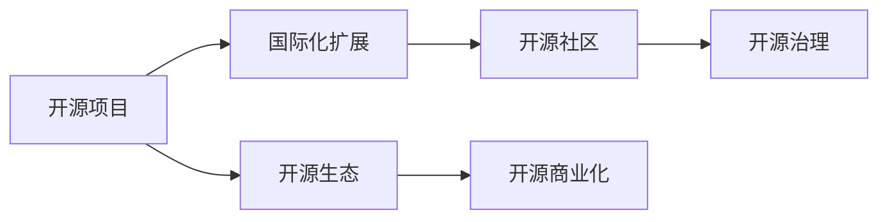

                 

# 开源项目的国际化：扩大市场和收入来源

> 关键词：开源项目, 国际化, 全球市场, 开源社区, 开源治理, 开源生态, 国际化扩展, 开源商业化, 开源治理模型, 开源合作

## 1. 背景介绍

在当前全球化的互联网时代，开源项目已成为推动技术创新和产业发展的关键力量。但与此同时，开源项目面临着如何在全球范围内扩大其影响力和收入来源的挑战。本文旨在深入探讨如何通过国际化的策略，将开源项目成功推向全球市场，实现商业化和可持续发展。

## 2. 核心概念与联系

### 2.1 核心概念概述

- **开源项目**：指采用开源许可证发布的软件项目，其源代码公开可获取，用户可以自由使用、修改和分发。
- **国际化**：指开源项目在全球范围内的推广和扩展，涵盖语言、文化和区域等多个维度。
- **开源社区**：由开发者、贡献者、用户和利益相关方组成的社群，共同推动开源项目的发展。
- **开源治理**：指管理开源项目的一系列原则、流程和工具，确保项目健康、可持续的发展。
- **开源生态**：由开源项目、社区、企业、投资者等构成的生态系统，形成良性互动和价值循环。
- **开源商业化**：指将开源项目的技术成果转化为商业产品和服务，实现市场化运作和盈利。

这些核心概念之间存在密切的联系。国际化是开源项目成功商业化的基础，而良好的开源治理则是国际化扩展和商业化的保障。通过国际化，开源项目可以吸引全球贡献者和用户，扩展市场和收入来源；而通过开源治理，确保项目运作规范、透明、高效，赢得更广泛的支持和认可。

### 2.2 核心概念原理和架构的 Mermaid 流程图

## 3. 核心算法原理 & 具体操作步骤

### 3.1 算法原理概述

开源项目的国际化主要通过以下几个关键步骤实现：

1. **市场调研与分析**：识别全球潜在市场，分析目标用户的需求、痛点和竞争状况。
2. **本地化适配**：将开源项目适配到不同地区，包括语言本地化、文化适配和法规遵从。
3. **社区与合作**：建立全球社区网络，与本地开发者和组织合作，推进项目本地化。
4. **商业化策略**：制定商业化路径，将开源项目技术转化为产品和服务，实现盈利。
5. **持续优化与反馈**：基于用户反馈和市场动态，不断优化和调整国际化策略。

### 3.2 算法步骤详解

1. **市场调研与分析**
    - **目标市场识别**：通过问卷调查、市场报告和用户访谈等方式，识别目标市场的规模、增长潜力和用户需求。
    - **竞争状况分析**：分析目标市场中的主要竞争对手，评估其优劣势，找到差异化竞争点。
    - **用户痛点挖掘**：通过深度访谈和用户反馈，了解用户的实际需求和痛点，制定相应的本地化策略。

2. **本地化适配**
    - **语言本地化**：根据目标市场的主要语言，对开源项目进行多语言翻译和本地化适配，确保文本、界面和文档的一致性和易用性。
    - **文化适配**：考虑目标市场的文化差异，调整项目的行为规范、工作流程和用户体验，使之符合本地习惯。
    - **法规遵从**：确保项目符合目标市场的法律法规要求，如数据保护、版权和合规性要求。

3. **社区与合作**
    - **建立全球社区网络**：通过GitHub、社交媒体和线上会议等平台，建立与目标市场的开发者、用户和利益相关方的联系。
    - **合作与伙伴关系**：与本地组织和机构建立合作伙伴关系，共同推进项目本地化和技术传播。
    - **本地化贡献者培养**：提供培训、支持和激励措施，培养本地贡献者，形成良性循环。

4. **商业化策略**
    - **产品和服务定制**：根据目标市场的特定需求，定制和优化开源项目，推出针对市场的产品和服务。
    - **价值链整合**：整合开源项目、社区、企业和技术合作伙伴，形成完整的价值链，提供综合解决方案。
    - **定价策略**：根据目标市场的经济水平和接受度，制定合理的定价策略，平衡成本和收益。

5. **持续优化与反馈**
    - **用户反馈收集**：建立用户反馈机制，定期收集和分析用户意见，了解项目在本地化的效果和问题。
    - **市场动态监控**：监测目标市场的技术趋势和竞争动态，及时调整国际化策略。
    - **迭代优化**：根据反馈和市场变化，不断优化和调整本地化策略，确保项目的持续发展和竞争力。

### 3.3 算法优缺点

**优点：**
1. **全球市场潜力大**：通过国际化，开源项目可以开拓新市场，扩大用户基数，提升品牌影响力。
2. **多元贡献者网络**：全球化带来多样化的贡献者和资源，促进项目的技术创新和持续改进。
3. **商业化收益高**：成功国际化的开源项目可以实现多元化收入来源，包括产品销售、服务订阅、企业合作等。

**缺点：**
1. **文化差异挑战**：不同文化背景对项目的需求和期望差异较大，本地化适配和市场推广需要高度关注。
2. **语言和法规障碍**：语言多样性和法规差异增加了项目管理的复杂度，需要额外的投入和时间。
3. **资源分散风险**：全球扩展意味着资源的高度分散，项目管理和协调成本较高。
4. **市场竞争激烈**：全球市场竞争激烈，需要较强的战略规划和执行能力，避免资源浪费和市场失败。

### 3.4 算法应用领域

开源项目的国际化策略广泛应用于多个领域，包括但不限于：

- **云计算与基础设施**：通过本地化适配和市场推广，提升云服务器的全球市场占有率。
- **物联网与边缘计算**：利用开源平台和技术，推动全球物联网设备的互联互通和智能化应用。
- **大数据与分析**：在数据收集、处理和分析等方面，提供面向全球的解决方案和工具。
- **移动应用与平台**：开发跨平台移动应用，满足全球用户的不同需求，拓展应用市场。
- **开源软件与工具**：提供开源软件和工具，促进全球开发者和用户的技术创新和协作。

## 4. 数学模型和公式 & 详细讲解 & 举例说明

### 4.1 数学模型构建

假设一个开源项目在全球市场的用户数量为 $U$，市场规模为 $S$，项目在目标市场的用户转化率为 $\eta$，本地化适配的成本为 $C_{loc}$，商业化收益为 $R_{bus}$。则国际化扩展的期望收益 $R_{ext}$ 可以表示为：

$$
R_{ext} = U \times \eta \times S \times R_{bus} - C_{loc}
$$

### 4.2 公式推导过程

1. **用户数量计算**：
    - 全球用户数量 $U$：
    $$
    U = \sum_{i=1}^N u_i
    $$
    其中 $u_i$ 为目标市场 $i$ 的用户数量。

2. **市场规模计算**：
    - 目标市场规模 $S$：
    $$
    S = \sum_{i=1}^N s_i
    $$
    其中 $s_i$ 为目标市场 $i$ 的市场规模。

3. **用户转化率计算**：
    - 用户转化率 $\eta$：
    $$
    \eta = \frac{c_u}{U}
    $$
    其中 $c_u$ 为目标市场用户的实际购买转化率。

4. **本地化成本计算**：
    - 本地化成本 $C_{loc}$：
    $$
    C_{loc} = \sum_{i=1}^N c_{loc_i}
    $$
    其中 $c_{loc_i}$ 为目标市场 $i$ 的本地化成本。

5. **商业化收益计算**：
    - 商业化收益 $R_{bus}$：
    $$
    R_{bus} = \sum_{i=1}^N r_i
    $$
    其中 $r_i$ 为目标市场 $i$ 的商业化收益。

### 4.3 案例分析与讲解

以Kubernetes为例，Kubernetes是谷歌开源的容器编排系统，成功实现了国际化扩展：

1. **市场调研与分析**：
    - 识别主要市场：全球范围内的企业云计算市场。
    - 竞争状况分析：与AWS、Azure等竞争对手比较，发现市场需求量大但竞争激烈。
    - 用户痛点挖掘：企业希望简化容器管理，提高资源利用率。

2. **本地化适配**：
    - 语言本地化：支持多语言版本，增加用户界面和文档的可用性。
    - 文化适配：与当地云平台合作，优化云资源配置和管理。
    - 法规遵从：确保数据安全和合规性，符合GDPR等法规要求。

3. **社区与合作**：
    - 建立全球社区网络：通过GitHub、Slack等平台，建立开发者和用户社区。
    - 合作与伙伴关系：与AWS、Azure等云平台合作，推动Kubernetes的集成和应用。
    - 本地化贡献者培养：提供培训和认证，培养本地Kubernetes专家和社区领袖。

4. **商业化策略**：
    - 产品和服务定制：推出针对不同云平台和市场的Kubernetes产品和服务。
    - 价值链整合：整合开源项目、社区和企业，提供综合解决方案。
    - 定价策略：推出按需付费和免费版本，平衡成本和收益。

5. **持续优化与反馈**：
    - 用户反馈收集：通过社区和用户反馈，了解Kubernetes在各地的使用情况和改进需求。
    - 市场动态监控：监测云计算市场的发展动态，及时调整国际化策略。
    - 迭代优化：根据反馈和市场变化，不断优化和改进Kubernetes。

## 5. 项目实践：代码实例和详细解释说明

### 5.1 开发环境搭建

1. **环境准备**：
    - 安装最新版本的Python和相关的依赖库。
    - 配置GitHub和CI/CD工具，如Jenkins、Travis CI等。
    - 设置国际化环境的开发和测试工具，如Locales和Gettext。

2. **代码管理和版本控制**：
    - 使用Git进行代码管理和版本控制，记录本地化开发和测试的详细日志。
    - 使用GitHub Issues和Pull Requests，跟踪项目本地化进度和问题。
    - 建立本地化翻译团队，分工合作，确保翻译质量。

### 5.2 源代码详细实现

1. **多语言翻译**：
    - 使用Python的gettext模块，支持多语言翻译和本地化。
    - 在项目源代码中添加翻译注释和标签，生成翻译文件，自动更新本地化文档。
    - 创建本地化测试环境，进行翻译质量验证和自动化测试。

2. **文化适配**：
    - 根据目标市场的文化习惯，修改项目行为规范和用户界面。
    - 在项目文档中添加文化适配说明，提供指导和支持。
    - 设计用户友好的本地化界面，提高用户体验。

3. **法规遵从**：
    - 在代码中嵌入数据保护和合规性检查，确保用户数据安全。
    - 提供隐私政策和合规性文档，清晰说明项目合规措施。
    - 建立合规性审核流程，定期检查和改进。

### 5.3 代码解读与分析

1. **多语言翻译实现**：
    - 使用Python的gettext模块，实现翻译文件的生成和更新。
    - 利用po文件和翻译缓存，提高翻译效率。
    - 通过测试和验证，确保翻译质量。

2. **文化适配实现**：
    - 修改代码中的日期格式、时间表示和货币符号，符合目标市场习惯。
    - 根据文化差异，调整项目行为规范和用户界面，提高本地化适配度。
    - 提供文化适配指南，帮助用户和开发者快速上手。

3. **法规遵从实现**：
    - 在代码中添加数据保护和合规性检查，如GDPR、CCPA等。
    - 生成和更新合规性文档，提供用户和开发者参考。
    - 建立合规性审核流程，定期检查和改进。

### 5.4 运行结果展示

1. **多语言翻译结果**：
    - 展示项目在不同语言下的翻译质量，确保文本一致性和易用性。
    - 列出翻译团队的贡献和审核记录，展示翻译工作的进展。

2. **文化适配结果**：
    - 展示项目在不同文化背景下的用户界面和行为规范，确保一致性和易用性。
    - 列出文化适配的改进措施和效果，展示用户体验的提升。

3. **法规遵从结果**：
    - 展示项目在不同市场下的合规性文档和审核记录，确保用户数据安全。
    - 列出法规遵从的改进措施和效果，展示项目的合规性和可靠性。

## 6. 实际应用场景

### 6.1 云计算与基础设施

开源云计算平台如Kubernetes、OpenStack等，通过国际化扩展，成功进入全球市场。例如，Kubernetes在亚马逊AWS、微软Azure和谷歌云平台上的应用，显著提升了其市场份额和影响力。

### 6.2 物联网与边缘计算

开源物联网平台如Apache Kafka、MQTT等，通过本地化适配和市场推广，满足了全球用户的需求，拓展了应用范围。例如，Apache Kafka在亚洲、欧洲和北美的广泛应用，推动了物联网技术的普及。

### 6.3 大数据与分析

开源大数据平台如Apache Hadoop、Apache Spark等，通过国际化扩展，推动了全球数据处理和分析的发展。例如，Apache Spark在北美、欧洲和亚洲的广泛应用，支持了全球大数据生态系统的建设。

### 6.4 移动应用与平台

开源移动应用平台如React Native、Flutter等，通过本地化适配和市场推广，满足了全球用户的不同需求，拓展了应用市场。例如，React Native在iOS和Android平台上的广泛应用，推动了跨平台应用的普及。

### 6.5 开源软件与工具

开源软件和工具如Linux、Git等，通过国际化扩展，满足了全球开发者和用户的需求，推动了技术的普及和创新。例如，Linux在多个操作系统平台的广泛应用，推动了操作系统技术的发展。

## 7. 工具和资源推荐

### 7.1 学习资源推荐

1. **《开源项目管理的最佳实践》**：深入介绍开源项目管理和治理的最佳实践，涵盖国际化扩展的各个方面。
2. **《开源社区发展与维护》**：详细讲解开源社区的发展和维护策略，包括国际化扩展的案例和经验。
3. **《开源商业化的成功案例》**：通过成功案例分析，展示开源项目商业化的具体路径和策略。

### 7.2 开发工具推荐

1. **GitHub**：全球最大的开源代码托管平台，提供版本控制、协作工具和市场推广平台。
2. **Jenkins**：开源的CI/CD工具，支持自动化构建、测试和部署，提高开发效率和质量。
3. **Locales**：多语言翻译和本地化工具，支持多种语言的翻译和文档本地化。
4. **Gettext**：Python的多语言翻译模块，支持翻译文件生成和自动化测试。
5. **OpenShift**：开源的Kubernetes平台，支持云服务和容器编排，推动Kubernetes的国际化扩展。

### 7.3 相关论文推荐

1. **《开源项目国际化扩展的挑战与策略》**：深入探讨开源项目国际化扩展的挑战和策略，提供实用的解决方案和建议。
2. **《开源项目商业化的理论与实践》**：结合理论和实践，分析开源项目商业化的路径和策略，提供可行的商业化模式。
3. **《开源项目社区管理的最佳实践》**：介绍开源项目社区管理的最佳实践，涵盖国际化扩展的社区建设和管理。

## 8. 总结：未来发展趋势与挑战

### 8.1 研究成果总结

1. **国际化扩展的重要性**：通过国际化扩展，开源项目可以扩大市场和用户基数，提升品牌影响力和商业化收益。
2. **本地化适配的关键性**：本地化适配是国际化扩展的核心环节，必须考虑语言、文化和法规等多个维度。
3. **社区与合作的重要性**：建立全球社区网络，与本地开发者和组织合作，推进项目本地化。
4. **商业化策略的灵活性**：根据目标市场的特定需求，定制和优化开源项目，实现盈利。

### 8.2 未来发展趋势

1. **技术创新加速**：随着新技术的发展，开源项目将不断推陈出新，推动全球技术进步。
2. **市场竞争激烈**：全球市场竞争激烈，开源项目需要持续创新和优化，保持竞争力。
3. **社区参与度提升**：全球社区的参与和贡献，将进一步推动开源项目的发展和国际化扩展。
4. **法规遵从复杂化**：随着全球法规环境的不断变化，开源项目需要更加注重法规遵从，确保合规性。
5. **商业化路径多样化**：开源项目可以探索多种商业化路径，如产品销售、服务订阅、企业合作等。

### 8.3 面临的挑战

1. **文化差异挑战**：不同文化背景对项目的需求和期望差异较大，本地化适配和市场推广需要高度关注。
2. **语言和法规障碍**：语言多样性和法规差异增加了项目管理的复杂度，需要额外的投入和时间。
3. **资源分散风险**：全球扩展意味着资源的高度分散，项目管理和协调成本较高。
4. **市场竞争激烈**：全球市场竞争激烈，需要较强的战略规划和执行能力，避免资源浪费和市场失败。

### 8.4 研究展望

1. **自动化本地化工具**：开发自动化本地化工具，提高翻译和适配效率，降低成本。
2. **多文化协作平台**：建立多文化协作平台，促进全球贡献者和用户的交流和合作。
3. **法规遵从智能化**：利用人工智能技术，自动检测和遵守不同市场的法规要求，提高合规性。
4. **商业化策略优化**：优化商业化策略，结合本地市场需求，提供更符合用户期望的产品和服务。
5. **用户体验提升**：通过用户反馈和市场动态，不断优化和改进本地化策略，提升用户体验和满意度。

## 9. 附录：常见问题与解答

**Q1：开源项目国际化的具体步骤是什么？**

A: 开源项目国际化的具体步骤包括：
1. 市场调研与分析，识别目标市场。
2. 本地化适配，包括语言本地化、文化适配和法规遵从。
3. 社区与合作，建立全球社区网络。
4. 商业化策略，制定商业化路径和定价策略。
5. 持续优化与反馈，基于用户反馈和市场动态，不断优化和调整国际化策略。

**Q2：如何进行开源项目的本地化适配？**

A: 开源项目的本地化适配主要包括以下几个方面：
1. 语言本地化：将项目支持多种语言，并针对不同语言进行文本翻译和本地化适配。
2. 文化适配：根据目标市场的文化习惯，调整项目的行为规范和用户界面。
3. 法规遵从：确保项目符合目标市场的法律法规要求，如数据保护和隐私政策。

**Q3：如何评估开源项目国际化扩展的收益？**

A: 开源项目国际化扩展的期望收益可以通过以下数学模型计算：
1. 用户数量计算：通过市场调研识别目标市场，计算全球用户数量。
2. 市场规模计算：识别目标市场规模，评估市场潜力。
3. 用户转化率计算：分析目标市场的用户转化率，确保用户转化效果。
4. 本地化成本计算：估算本地化适配的成本，确保项目经济性。
5. 商业化收益计算：评估不同市场的商业化收益，平衡成本和收益。

**Q4：开源项目国际化的主要难点是什么？**

A: 开源项目国际化的主要难点包括：
1. 文化差异：不同文化背景对项目的需求和期望差异较大，本地化适配和市场推广需要高度关注。
2. 语言和法规障碍：语言多样性和法规差异增加了项目管理的复杂度，需要额外的投入和时间。
3. 资源分散：全球扩展意味着资源的高度分散，项目管理和协调成本较高。
4. 市场竞争：全球市场竞争激烈，需要较强的战略规划和执行能力，避免资源浪费和市场失败。

**Q5：开源项目国际化扩展的案例有哪些？**

A: 开源项目国际化扩展的成功案例包括：
1. Kubernetes：通过本地化适配和市场推广，成功进入全球云计算市场。
2. Apache Kafka：满足全球物联网用户需求，推动物联网技术的普及。
3. Apache Hadoop：推动全球大数据处理和分析的发展。
4. React Native：通过本地化适配和市场推广，拓展了应用市场。
5. Linux：推动操作系统技术的发展和全球应用。

---

作者：禅与计算机程序设计艺术 / Zen and the Art of Computer Programming

