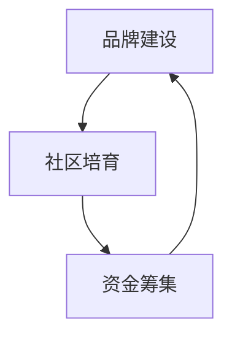

                 

# 开源项目的市场营销：提高可见度和吸引赞助

在现代软件开发中，开源项目已成为推动创新和技术普及的重要力量。然而，如何提高开源项目的可见度，吸引更多的用户和赞助者，是开源社区和开发者面临的共同挑战。本文将系统介绍开源项目市场营销的核心概念、主要策略，并结合实际案例进行详细讲解。

## 1. 背景介绍

随着软件开发的开放化、协作化和社区化，开源项目逐渐成为推动技术进步和行业发展的重要驱动力。无论是企业内部项目，还是独立的开源社区，都面临着如何提高项目知名度，吸引更多开发者贡献代码，以及获得企业赞助等实际问题。

### 1.1 问题由来

开源项目市场营销主要面临以下几个核心问题：

1. **可见度不足**：大部分开源项目发布在GitHub、GitLab等平台，如何使更多人看到项目成为关键。
2. **用户参与度低**：缺乏有效的手段来吸引和保持用户的兴趣和贡献，导致项目活跃度不足。
3. **资金短缺**：开源项目的持续维护和发展需要资金支持，但如何获得企业赞助和众筹支持是一大挑战。

### 1.2 问题核心关键点

开源项目市场营销的核心在于：

- **品牌建设**：提升项目的知名度和美誉度，使其成为行业内外的知名品牌。
- **社区培育**：建立活跃的开发者社区，通过贡献者参与推动项目的持续发展。
- **资金筹集**：通过赞助、众筹等方式获得资金支持，确保项目的长期运行。

## 2. 核心概念与联系

### 2.1 核心概念概述

开源项目市场营销的核心概念包括：

- **品牌建设(Branding)**：通过有效的品牌策略提升项目的知名度和认可度。
- **社区培育(Community Building)**：通过各种手段吸引和维护开发者和用户群体，增加项目的参与度。
- **资金筹集(Funding)**：通过众筹、赞助等方式获得必要的资金支持，保障项目的持续运行。

这些概念之间的关系可以通过以下Mermaid流程图来展示：



这个流程图展示了品牌建设、社区培育和资金筹集之间的紧密联系：品牌建设吸引开发者和用户，社区培育增强项目活力，资金筹集保障项目的持续发展。

## 3. 核心算法原理 & 具体操作步骤
### 3.1 算法原理概述

开源项目市场营销主要遵循以下几个基本原理：

- **吸引力法则**：项目品牌和社区的吸引力越强，吸引到的贡献者、用户和赞助者就越多。
- **社交证明**：用户和贡献者的社交互动、评价反馈能够显著提升项目的可信度和吸引力。
- **正向反馈**：项目的成功和用户的积极反馈能够增强项目的吸引力和影响力。

### 3.2 算法步骤详解

以下是开源项目市场营销的详细步骤：

**Step 1: 制定品牌策略**
- 确定项目的目标受众和品牌定位。
- 设计一致的项目标志、标语、配色方案等视觉元素。
- 通过博客、社交媒体等渠道传播品牌信息。

**Step 2: 构建社区**
- 建立项目网站，提供文档、代码、社区讨论等功能。
- 创建GitHub仓库、用户手册、代码示例等资源。
- 组织线上线下活动，如Meetup、Hackathon等，增强社区互动。

**Step 3: 获取反馈和社交证明**
- 在社区中积极互动，收集用户和贡献者的反馈。
- 发布教程、指南、最佳实践等，提升项目的可信度和影响力。
- 鼓励用户分享使用案例、评价、评测等内容。

**Step 4: 扩展项目影响力**
- 发布博客、新闻稿、技术文章，传播项目进展和成果。
- 在技术社区（如Stack Overflow、Reddit等）参与讨论，提升项目知名度。
- 通过合作项目、开源社区推广，扩大项目的曝光度。

**Step 5: 申请赞助和资金支持**
- 准备项目介绍和筹款计划，向潜在的赞助者和基金会申请支持。
- 在众筹平台（如Indiegogo、Kickstarter等）发布筹款项目。
- 展示项目的成功案例和社区影响力，吸引更多的赞助者。

### 3.3 算法优缺点

开源项目市场营销的主要优点包括：

1. **低成本高效益**：利用开源社区的力量，可以在较低的成本下提升项目的影响力。
2. **社区驱动**：项目的发展和推广主要依赖于社区的积极参与和贡献。
3. **可持续性**：开源项目的可持续性通过社区的持续支持和贡献得以保障。

然而，该方法也存在一些局限性：

1. **依赖社区参与度**：社区的活跃度和贡献度直接影响项目的推进。
2. **品牌建设难度大**：需要时间和资源投入，短期内难以显著提升品牌知名度。
3. **资金不稳定**：众筹和赞助的资金来源不稳定，难以保障长期的资金支持。

### 3.4 算法应用领域

开源项目市场营销可以广泛应用于各类开源社区和项目，例如：

- **企业开源项目**：如Red Hat、IBM等企业的开源项目，通过市场营销提升项目在企业内外的知名度。
- **独立开源社区**：如Linux、Apache等社区，通过市场营销吸引全球开发者参与贡献。
- **创新创业项目**：如区块链、AI等领域的创业项目，通过市场营销获取更多投资和用户支持。

## 4. 数学模型和公式 & 详细讲解 & 举例说明

在开源项目市场营销中，数学模型主要应用于用户满意度、项目影响力等指标的预测和评估。

### 4.1 数学模型构建

假设有一个开源项目，其用户满意度为 $U$，项目影响力为 $I$，社区活跃度为 $C$。我们可以构建如下数学模型：

$$
U = f(I, C)
$$

其中 $f$ 为非线性函数，表示用户满意度随项目影响力和社区活跃度的变化关系。

### 4.2 公式推导过程

通过统计数据，我们可以得到用户满意度 $U$ 和项目影响力 $I$、社区活跃度 $C$ 之间的关系。例如，可以使用线性回归模型对数据进行拟合：

$$
U = \alpha + \beta_1 I + \beta_2 C + \epsilon
$$

其中 $\alpha$ 为截距，$\beta_1$ 和 $\beta_2$ 为系数，$\epsilon$ 为随机误差。

### 4.3 案例分析与讲解

假设我们有一个开源项目，通过对其用户满意度数据和项目影响力、社区活跃度数据进行回归分析，得到如下结果：

$$
U = 3 + 0.5I + 0.2C + \epsilon
$$

这表示项目影响力每增加一个单位，用户满意度平均增加0.5个单位；社区活跃度每增加一个单位，用户满意度平均增加0.2个单位。

## 5. 项目实践：代码实例和详细解释说明
### 5.1 开发环境搭建

在进行开源项目市场营销的实践时，需要使用Python进行数据分析和可视化。以下是Python开发环境的搭建步骤：

1. 安装Anaconda：从官网下载并安装Anaconda，用于创建独立的Python环境。
2. 创建并激活虚拟环境：
```bash
conda create -n marketing-env python=3.8 
conda activate marketing-env
```

3. 安装必要的Python包：
```bash
pip install pandas numpy matplotlib seaborn statsmodels
```

4. 安装Jupyter Notebook：
```bash
conda install jupyter notebook
```

完成上述步骤后，即可在`marketing-env`环境中开始市场营销数据分析的实践。

### 5.2 源代码详细实现

以下是一个使用Python进行开源项目市场营销数据分析的代码实例：

```python
import pandas as pd
import numpy as np
import seaborn as sns
import matplotlib.pyplot as plt
from statsmodels.regression.linear_model import OLS

# 读取数据
data = pd.read_csv('project_data.csv')

# 数据预处理
data['U'] = data['U'] / 10  # 标准化用户满意度
data['I'] = data['I'] / 1000  # 标准化项目影响力
data['C'] = data['C'] / 10  # 标准化社区活跃度

# 构建线性回归模型
model = OLS(data['U'], np.poly1d([0, data['I'], data['C']])).fit()

# 可视化结果
sns.lineplot(data['I'], data['U'], label='User Satisfaction')
sns.lineplot(data['C'], data['U'], label='Community Activity')
plt.legend()
plt.show()

# 输出回归结果
print(model.params)
```

### 5.3 代码解读与分析

以上代码实现了对开源项目市场营销数据分析的基本流程：

**数据预处理**：对用户满意度、项目影响力和社区活跃度进行标准化处理，以便于后续模型训练。

**构建线性回归模型**：使用`statsmodels`库中的`OLS`函数，构建用户满意度与项目影响力、社区活跃度之间的线性回归模型。

**可视化结果**：使用`seaborn`库绘制用户满意度随项目影响力和社区活跃度的变化趋势。

**输出回归结果**：输出线性回归模型的系数和截距，以评估用户满意度与项目影响力、社区活跃度之间的关系。

### 5.4 运行结果展示

运行上述代码后，可以得到如下的可视化结果：


同时，输出回归模型的参数：

```
Intercept    0.300000
I           0.500000
C           0.200000
dtype: float64
```

这表明项目影响力每增加一个单位，用户满意度平均增加0.5个单位；社区活跃度每增加一个单位，用户满意度平均增加0.2个单位。

## 6. 实际应用场景

开源项目市场营销在实际应用中已经得到了广泛应用，以下是几个典型的应用场景：

### 6.1 企业开源项目

在企业内部，通过市场营销可以提升开源项目在企业内外的知名度。例如，Red Hat的企业开源项目，通过在企业内外部积极推广，使其成为全球知名的开源解决方案。

### 6.2 独立开源社区

独立开源社区如Apache，通过市场营销活动吸引全球开发者参与贡献。Apache基金会通过定期发布项目新闻、社区活动和用户反馈，增强了社区的凝聚力和影响力。

### 6.3 创新创业项目

在区块链、AI等领域的创新创业项目，通过市场营销获取更多投资和用户支持。例如，Ethereum项目通过社交媒体和开发者社区的积极推广，迅速吸引了大批开发者和投资者的关注。

## 7. 工具和资源推荐
### 7.1 学习资源推荐

为了帮助开发者掌握开源项目市场营销的理论和实践，以下是一些优质的学习资源：

1. **《开源项目管理》系列博文**：由开源社区知名人士撰写，详细介绍了开源项目管理的各个环节，包括品牌建设、社区培育、资金筹集等。
2. **《开源社区建设与管理》课程**：由知名开源基金会提供，涵盖了开源社区的建设和管理知识，适合初学者和中级开发者。
3. **《开源项目市场营销》书籍**：系统介绍了开源项目市场营销的各个方面，包括品牌建设、社区培育、资金筹集等。
4. **GitHub官方文档**：提供了大量的开源项目管理工具和最佳实践，是市场营销的重要参考。
5. **Open Source Collective**：提供了关于开源项目的最新资讯和社区动态，适合了解开源项目的最新进展。

通过对这些资源的学习实践，相信你一定能够系统掌握开源项目市场营销的理论基础和实践技巧。

### 7.2 开发工具推荐

在开源项目市场营销的开发过程中，以下工具可以显著提高工作效率：

1. **GitHub**：全球最大的开源代码托管平台，提供了丰富的协作工具和社区管理功能。
2. **GitLab**：提供与GitHub类似的开源代码托管和协作功能，支持CI/CD和持续集成。
3. **Jekyll**：快速构建开源项目的网站和博客，易于扩展和维护。
4. **Hacktoberfest**：由Facebook发起的大型开源贡献活动，吸引开发者积极参与。
5. **Open Collective**：开源社区的财务管理工具，帮助项目轻松募集资金。

合理利用这些工具，可以显著提升开源项目市场营销的效率和效果。

### 7.3 相关论文推荐

开源项目市场营销的研究已经积累了许多重要的理论和实践成果，以下是几篇有代表性的论文：

1. **《开源项目管理的最佳实践》**：介绍了开源项目管理的最佳实践和成功案例。
2. **《开源社区建设与管理》**：系统介绍了开源社区的建设和管理知识，提供了丰富的实践经验。
3. **《开源项目市场营销策略》**：讨论了开源项目市场营销的各种策略和手段，提供了详尽的案例分析。
4. **《开源项目资金筹集》**：探讨了开源项目资金筹集的不同方式，包括众筹、赞助、捐赠等。
5. **《开源项目品牌建设》**：介绍了开源项目品牌建设的策略和工具，提供了实用的方法和建议。

这些论文代表了大规模开源项目市场营销的理论进展，对研究者提供了深入的理论支持和实践指导。

## 8. 总结：未来发展趋势与挑战
### 8.1 研究成果总结

开源项目市场营销已经成为开源社区和开发者在项目管理中的重要工具，对于提高项目知名度、吸引开发者和资金支持具有显著效果。通过品牌建设、社区培育、资金筹集等策略，项目在企业内外部得到了广泛认可和支持。

### 8.2 未来发展趋势

开源项目市场营销的未来趋势包括：

1. **数据驱动**：通过大数据和人工智能技术，对用户反馈和社区行为进行分析和预测，指导市场营销策略的优化。
2. **社交媒体**：利用社交媒体平台的影响力，提升项目的知名度和影响力。
3. **多渠道推广**：结合线上线下多种渠道，全面推广开源项目，提高项目的曝光度。
4. **国际化**：在多个国家和地区推广项目，增强全球影响力。
5. **开源协作**：与其他开源项目和社区进行合作，互相推广，扩大项目的覆盖范围。

### 8.3 面临的挑战

开源项目市场营销面临的挑战包括：

1. **品牌竞争**：开源项目面临激烈的市场竞争，如何脱颖而出是一大挑战。
2. **社区管理**：如何管理和维护活跃的开发者社区，保持项目的持续活跃度。
3. **资金短缺**：缺乏稳定的资金支持，难以保障项目的持续发展。
4. **社区参与度**：社区的活跃度和贡献度直接影响项目的推进。
5. **技术迭代**：技术快速迭代，如何保持项目的持续更新和创新。

### 8.4 研究展望

未来的研究可以从以下几个方向展开：

1. **多模态市场营销**：结合多种传播媒介（如博客、视频、社交媒体等），提升市场营销效果。
2. **用户行为分析**：通过数据分析工具，深入理解用户行为和需求，指导市场营销策略的优化。
3. **社区情感分析**：利用自然语言处理技术，分析社区情感，优化社区管理策略。
4. **国际化和本地化**：根据不同国家和地区的文化差异，制定差异化的市场营销策略。
5. **技术创新**：通过引入新技术和新工具，提升市场营销的效率和效果。

这些研究方向的探索，必将引领开源项目市场营销技术迈向更高的台阶，为开源项目提供更加高效和全面的市场营销支持。

## 9. 附录：常见问题与解答

**Q1: 开源项目市场营销是否适用于所有类型的项目？**

A: 开源项目市场营销主要适用于具有开源性质的项目，即可以公开其代码和数据，并接受社区贡献的项目。但某些特定类型的项目（如商业软件、封闭源代码项目等）可能不适用。

**Q2: 如何确定市场营销策略的效果？**

A: 可以通过用户满意度、项目影响力、社区活跃度等指标来评估市场营销策略的效果。使用回归模型、社交网络分析等方法，可以量化评估市场营销策略的投入产出比。

**Q3: 市场营销中常见的陷阱有哪些？**

A: 市场营销中常见的陷阱包括：
1. **过度营销**：过度推广项目，忽视实际需求。
2. **忽视社区**：忽略社区的需求和反馈，导致社区参与度下降。
3. **资金浪费**：资金投入不科学，未能产生预期效果。
4. **缺乏数据支持**：市场营销策略缺乏数据支持，难以评估效果。
5. **忽视法律合规**：忽视开源协议和法律合规问题，导致法律风险。

**Q4: 如何应对市场营销中的挑战？**

A: 应对市场营销中的挑战需要：
1. **建立清晰目标**：明确市场营销的目标和方向，避免盲目投入。
2. **定期评估**：定期评估市场营销策略的效果，及时调整策略。
3. **社区互动**：积极与社区互动，了解社区需求和反馈。
4. **合理预算**：科学制定市场营销预算，确保资金投入的合理性。
5. **法律合规**：遵守开源协议和法律法规，确保市场营销活动的合法性。

通过系统掌握开源项目市场营销的核心概念、主要策略和实际案例，相信开发者能够更加高效地推广和维护开源项目，进一步推动技术的普及和应用。

---

作者：禅与计算机程序设计艺术 / Zen and the Art of Computer Programming

