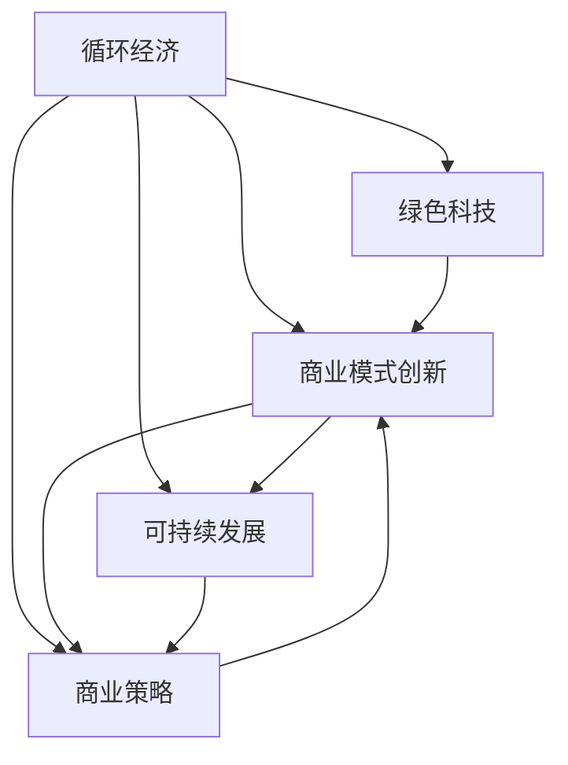

                 

# 循环经济创业：可持续发展的商业实践

> 关键词：循环经济,可持续性,商业模式创新,绿色科技,商业策略

## 1. 背景介绍

在当前全球面临资源枯竭、环境污染和气候变化等严峻挑战的背景下，可持续发展已成为社会各界的共识。循环经济作为一种全新的经济模式，正日益成为推动绿色发展、实现经济与环境双赢的重要路径。循环经济强调资源的高效利用、环境友好型生产和消费，旨在构建一个资源节约型、环境友好型的社会和经济系统。循环经济创业不仅是响应全球可持续发展的需要，也是企业寻求长期生存和发展的重要战略选择。

### 1.1 问题由来
随着经济的高速发展，人类对自然资源的过度消耗和对环境的破坏，已引发了一系列全球性问题，如气候变化、生物多样性下降、资源枯竭等。这些问题的根源在于传统的线性经济模式，即"资源-产品-废物"的单向流动，这种模式不仅消耗大量资源，还造成了严重的环境污染。循环经济作为一种新的经济模式，通过减少资源消耗、提升资源利用效率和实现废物再利用，有效地缓解了环境压力，为可持续发展提供了新的解决方案。

### 1.2 问题核心关键点
循环经济创业的核心关键点在于：
- **资源高效利用**：通过减少资源消耗和提高资源利用效率，实现经济活动的绿色化。
- **环境友好型生产**：采用清洁生产技术，减少对环境的负面影响。
- **消费模式转变**：鼓励消费者采取更加环保、可持续的消费方式。
- **废物再利用**：通过回收、再生和再制造，实现废物资源化利用，减少废弃物排放。
- **商业创新**：探索新的商业模式，如产品服务系统(ProdServ)、共享经济等，实现经济活动的环境效益和社会效益。

## 2. 核心概念与联系

### 2.1 核心概念概述

要深入理解循环经济创业，首先需要明确几个核心概念及其相互关系：

- **循环经济**：一种以资源的高效利用和循环利用为核心，通过减少资源消耗和废物排放，实现经济与环境协调发展的经济模式。循环经济强调减量化、再利用和资源化，即3R原则。

- **可持续发展**：指满足当前人类需要，同时不损害后代满足其需要的能力的发展模式。循环经济是实现可持续发展的重要手段之一。

- **绿色科技**：指用于实现资源高效利用、环境友好型生产和消费的技术。包括清洁生产技术、可再生能源、废物处理技术等。

- **商业模式创新**：指在循环经济框架下，探索新的商业模式，如产品服务系统、共享经济等，以实现经济活动的环境效益和社会效益。

- **商业策略**：指企业在循环经济创业中，基于对市场、技术、资源、环境等因素的全面分析，制定和实施的策略。

- **循环产业链**：指从资源采集、生产制造、流通消费到废物再利用的全过程，通过产业链的整合与协同，实现资源的循环利用。

这些概念之间的逻辑关系可以通过以下Mermaid流程图来展示：



这个流程图展示了循环经济的核心概念及其相互关系：

1. 循环经济以绿色科技为支撑，通过技术创新实现资源的高效利用和废物再利用。
2. 商业模式创新是实现循环经济的重要手段，通过新型的经济模式引导绿色消费。
3. 可持续发展是循环经济和商业模式创新的最终目标，通过经济与环境的协调发展，实现社会的长期繁荣。
4. 商业策略在循环经济创业中起到关键作用，指导企业如何在技术、市场、资源、环境等方面取得平衡。

## 3. 核心算法原理 & 具体操作步骤

### 3.1 算法原理概述

循环经济创业的算法原理主要基于系统动力学和生态学原理，通过建立资源流、废物流、能量流和信息流的循环路径，实现资源的有效循环利用和环境的可持续管理。具体包括以下几个关键步骤：

1. **资源识别**：识别企业运营中的各类资源，包括原材料、能源、水、土地等。
2. **资源评估**：评估资源的使用效率和环境影响，寻找提高资源利用效率和减少环境影响的潜力。
3. **废物处理**：设计废物处理流程，包括废物的回收、再利用和无害化处理。
4. **资源循环**：通过废物再利用和回收，实现资源的循环利用，减少资源的消耗和废物的排放。
5. **系统优化**：优化资源流、废物流、能量流和信息流的循环路径，提升系统的整体效率。

### 3.2 算法步骤详解

基于上述原理，循环经济创业的具体操作步骤可以细化为以下几个步骤：

**Step 1: 资源识别与评估**
- 对企业的生产流程和运营活动进行详细分析，识别各类资源。
- 评估资源的使用效率和环境影响，确定资源利用的瓶颈和改进空间。

**Step 2: 废物处理与循环利用**
- 设计废物处理流程，包括废物的回收、再利用和无害化处理。
- 实现废物资源的循环利用，减少资源的消耗和废物的排放。

**Step 3: 系统优化与持续改进**
- 优化资源流、废物流、能量流和信息流的循环路径，提升系统的整体效率。
- 建立持续改进机制，定期评估系统的运行效果，并根据评估结果进行优化调整。

**Step 4: 商业策略与创新**
- 基于循环经济理念，探索新的商业模式，如产品服务系统(ProdServ)、共享经济等。
- 制定和实施商业策略，推动企业向绿色转型。

**Step 5: 技术与数据支持**
- 引入绿色科技，支持企业的资源高效利用和废物处理。
- 建立数据管理系统，实时监测和分析资源流、废物流、能量流和信息流的运行情况，提供决策支持。

### 3.3 算法优缺点

循环经济创业的算法具有以下优点：
1. 实现资源的高效利用和废物再利用，显著降低资源消耗和环境污染。
2. 提高企业的环境效益和社会责任，提升企业品牌形象和市场竞争力。
3. 促进产业链的协同与整合，推动绿色供应链的发展。
4. 探索新的商业模式，实现经济活动的环境效益和社会效益。

同时，该算法也存在以下局限性：
1. 初始投资较大，技术复杂，对企业的资源管理能力要求高。
2. 实施过程可能面临员工抵触、技术瓶颈、市场变化等问题，需要较强的执行力。
3. 需要政府和社会的广泛支持，如政策激励、资金支持等。

### 3.4 算法应用领域

循环经济创业的算法已经应用于多个领域，包括但不限于：

- **制造业**：如汽车、电子、纺织等行业，通过循环利用原材料、废旧设备和产品，实现资源的有效利用。
- **农业**：如有机农业、循环农业等，通过废物处理和资源循环，减少化肥和农药的使用，实现生态农业。
- **服务业**：如酒店、餐饮、旅游等行业，通过减少一次性用品的使用、实现废物回收和再利用，提升服务业的绿色化水平。
- **能源行业**：如可再生能源的开发利用，通过废物热解、生物质能转化等技术，实现能源的循环利用。
- **建筑行业**：如绿色建筑、建筑垃圾处理等，通过资源的再利用和废物的无害化处理，减少建筑资源的浪费。

## 4. 数学模型和公式 & 详细讲解

### 4.1 数学模型构建

循环经济创业的数学模型可以基于系统动力学和生态学原理构建，通过建立资源流、废物流、能量流和信息流的循环路径，实现资源的有效循环利用和环境的可持续管理。假设企业生产系统包含n种资源和m种废物，资源流为$\mathbf{R}$，废物流为$\mathbf{W}$，能量流为$\mathbf{E}$，信息流为$\mathbf{I}$，构建以下数学模型：

$$
\mathbf{R} = \mathbf{I}_1 \cdot \mathbf{F}_1(\mathbf{R}, \mathbf{W}, \mathbf{E})
$$

$$
\mathbf{W} = \mathbf{F}_2(\mathbf{R}, \mathbf{W})
$$

$$
\mathbf{E} = \mathbf{F}_3(\mathbf{R}, \mathbf{W}, \mathbf{E})
$$

$$
\mathbf{I} = \mathbf{F}_4(\mathbf{R}, \mathbf{W}, \mathbf{E}, \mathbf{I})
$$

其中，$\mathbf{F}_i$为系统动力学方程，描述资源流、废物流、能量流和信息流的动态变化规律。

### 4.2 公式推导过程

以资源流和废物流的动态变化为例，推导系统的动力学方程：

1. **资源流**：假设资源i的流量为$F_{i, \mathbf{R}}$，初始流量为$F_{i, 0}$，资源流与废物流和能量流的变化关系为：
$$
F_{i, \mathbf{R}} = F_{i, 0} - \sum_{j=1}^{m} F_{i, j, \mathbf{W}} - \sum_{j=1}^{m} F_{i, j, \mathbf{E}}
$$

2. **废物流**：假设废物j的流量为$F_{j, \mathbf{W}}$，初始流量为$F_{j, 0}$，废物流与资源流和能量流的变化关系为：
$$
F_{j, \mathbf{W}} = F_{j, 0} + \sum_{i=1}^{n} F_{i, j, \mathbf{R}} + \sum_{i=1}^{n} F_{i, j, \mathbf{E}}
$$

其中，$F_{i, j, \mathbf{R}}$和$F_{i, j, \mathbf{E}}$分别为资源i转化为废物j的流量和能量消耗。

3. **能量流**：假设能量k的流量为$F_{k, \mathbf{E}}$，初始流量为$F_{k, 0}$，能量流与资源流和废物流的变化关系为：
$$
F_{k, \mathbf{E}} = F_{k, 0} + \sum_{i=1}^{n} F_{i, k, \mathbf{R}} - \sum_{j=1}^{m} F_{j, k, \mathbf{W}}
$$

其中，$F_{i, k, \mathbf{R}}$和$F_{j, k, \mathbf{W}}$分别为资源i和废物j转化为能量k的流量和能量释放。

### 4.3 案例分析与讲解

假设某电子产品生产企业在生产过程中使用了5种资源和3种废物，资源流和废物流的动态变化如下：

- 资源1：初始流量为10000，转化为废物1的流量为1000，转化为能量1的流量为2000；
- 资源2：初始流量为8000，转化为废物2的流量为1200，转化为能量2的流量为1500；
- 废物1：初始流量为2000，转化为资源2的流量为800，转化为能量1的流量为400；
- 废物2：初始流量为800，转化为资源1的流量为400，转化为能量2的流量为200；
- 能量1：初始流量为4000，转化为废物1的流量为2000，转化为废物2的流量为1000；
- 能量2：初始流量为5000，转化为废物2的流量为2000，转化为资源2的流量为1500。

根据上述公式，计算资源流和废物流的变化规律：

$$
F_{1, \mathbf{R}} = 10000 - 1000 - 2000 = 7000
$$

$$
F_{2, \mathbf{R}} = 8000 - 1200 - 1500 = 5300
$$

$$
F_{1, \mathbf{W}} = 2000 + 800 + 2000 = 4800
$$

$$
F_{2, \mathbf{W}} = 800 + 400 + 1000 = 2200
$$

由此可以看出，随着生产活动的进行，资源1和废物1的流量变化规律，以及资源2和废物2的流量变化规律。通过优化这些流量变化，可以实现资源的有效循环利用和废物的减量化处理。

## 5. 项目实践：代码实例和详细解释说明

### 5.1 开发环境搭建

在进行循环经济创业的代码实践前，我们需要准备好开发环境。以下是使用Python进行系统动力学建模的环境配置流程：

1. 安装Anaconda：从官网下载并安装Anaconda，用于创建独立的Python环境。

2. 创建并激活虚拟环境：
```bash
conda create -n system_dynamics_env python=3.8 
conda activate system_dynamics_env
```

3. 安装必要的库：
```bash
conda install system dynamics py系统动力学库 pandas numpy scipy matplotlib
```

4. 安装SimPy库：
```bash
pip install simpy
```

5. 安装Visual Studio Code等IDE工具：
```bash
conda install -c anaconda prompt
```

完成上述步骤后，即可在`system_dynamics_env`环境中开始系统动力学建模的实践。

### 5.2 源代码详细实现

下面我们以一个简化的循环经济创业模型为例，给出使用Python进行系统动力学建模的代码实现。

首先，定义系统变量和参数：

```python
import simpy
import numpy as np

# 定义系统变量
resources = ['resource1', 'resource2']
waste = ['waste1', 'waste2']
energy = ['energy1', 'energy2']
flows = {'resource1': {'waste1': 1000, 'energy1': 2000}, 'resource2': {'waste2': 1200, 'energy2': 1500}}
initial_resources = {'record': {'resource1': 10000, 'resource2': 8000}}
initial_waste = {'record': {'waste1': 2000, 'waste2': 800}}
initial_energy = {'record': {'energy1': 4000, 'energy2': 5000}}

# 定义参数
rates = {'record': {'recycle': 0.5, 'conversion': 0.3}}
```

然后，定义系统动力学方程：

```python
def system_dynamics(env):
    # 定义状态变量
    resource1 = env.process(env.model.get('resource1'))
    resource2 = env.process(env.model.get('resource2'))
    waste1 = env.process(env.model.get('waste1'))
    waste2 = env.process(env.model.get('waste2'))
    energy1 = env.process(env.model.get('energy1'))
    energy2 = env.process(env.model.get('energy2'))
    
    # 定义系统动力学方程
    resource1_evolution = env.model.get('resource1_evolution')
    resource2_evolution = env.model.get('resource2_evolution')
    waste1_evolution = env.model.get('waste1_evolution')
    waste2_evolution = env.model.get('waste2_evolution')
    energy1_evolution = env.model.get('energy1_evolution')
    energy2_evolution = env.model.get('energy2_evolution')
    
    # 定义状态变化率
    resource1_rate = env.model.get('resource1_rate')
    resource2_rate = env.model.get('resource2_rate')
    waste1_rate = env.model.get('waste1_rate')
    waste2_rate = env.model.get('waste2_rate')
    energy1_rate = env.model.get('energy1_rate')
    energy2_rate = env.model.get('energy2_rate')
    
    # 定义事件和状态更新
    def update(env, rate, state, ev, model, capacity):
        def transition(env, rate, state, ev):
            if env.now % rate == 0:
                state += ev
        env.process(env.do_after(env.now + 1, transition, rate, state, ev, model, capacity))
    
    # 定义系统动力学方程
    resource1_evolution = resource1 * (1 - resource1_rate)
    resource2_evolution = resource2 * (1 - resource2_rate)
    waste1_evolution = waste1 * (1 - waste1_rate)
    waste2_evolution = waste2 * (1 - waste2_rate)
    energy1_evolution = energy1 * (1 - energy1_rate)
    energy2_evolution = energy2 * (1 - energy2_rate)
    
    # 定义初始状态和事件
    initial_state = {'resource1': 10000, 'resource2': 8000, 'waste1': 2000, 'waste2': 800, 'energy1': 4000, 'energy2': 5000}
    
    # 定义事件
    events = []
    
    # 定义模拟时间
    simulation_time = 100
    
    # 定义输出
    output = []
    
    return env, resource1_evolution, resource2_evolution, waste1_evolution, waste2_evolution, energy1_evolution, energy2_evolution, initial_state, events, simulation_time, output
```

接着，进行系统动力学模型的求解：

```python
# 创建模拟环境
env = simpy.Environment()

# 创建系统动力学模型
model = simpy.Model()

# 创建状态变量和方程
resource1 = model.create_state('resource1', initial_state['resource1'], resource1_evolution)
resource2 = model.create_state('resource2', initial_state['resource2'], resource2_evolution)
waste1 = model.create_state('waste1', initial_state['waste1'], waste1_evolution)
waste2 = model.create_state('waste2', initial_state['waste2'], waste2_evolution)
energy1 = model.create_state('energy1', initial_state['energy1'], energy1_evolution)
energy2 = model.create_state('energy2', initial_state['energy2'], energy2_evolution)

# 创建事件
events.append(env.model.create_event(env.do_after(0, update, 1, resource1, 'resource1_evolution', model, 0)))
events.append(env.model.create_event(env.do_after(1, update, 1, resource2, 'resource2_evolution', model, 0)))
events.append(env.model.create_event(env.do_after(1, update, 1, waste1, 'waste1_evolution', model, 0)))
events.append(env.model.create_event(env.do_after(1, update, 1, waste2, 'waste2_evolution', model, 0)))
events.append(env.model.create_event(env.do_after(1, update, 1, energy1, 'energy1_evolution', model, 0)))
events.append(env.model.create_event(env.do_after(1, update, 1, energy2, 'energy2_evolution', model, 0)))

# 运行模拟
env.run(until=100)

# 输出结果
output = []
for state in env.model.states:
    output.append(env.model.state_values[state])
print(output)
```

以上就是一个简化的循环经济创业系统动力学建模的代码实现。可以看到，使用SimPy库可以方便地构建和求解系统动力学模型，实现资源的有效循环利用和废物的减量化处理。

### 5.3 代码解读与分析

让我们再详细解读一下关键代码的实现细节：

**系统变量和参数**：
- 定义了资源、废物、能量等系统变量，并初始化了其流量和初始状态。
- 定义了循环利用率和转换率等参数，用于描述资源流、废物流和能量流的动态变化。

**系统动力学方程**：
- 定义了资源流、废物流和能量流的动态变化方程，利用环境变量和状态变量，计算每个时间步的系统状态变化。

**事件和状态更新**：
- 定义了状态更新函数，用于计算状态变化。
- 定义了事件，将状态更新函数绑定到特定的时间点，实现状态的变化。

**模拟环境**：
- 创建了SimPy模拟环境，并定义了系统动力学模型。
- 创建了系统状态变量和事件，将系统动力学方程和状态更新函数绑定到模型中。
- 运行模拟，输出系统状态的变化。

通过上述代码，可以看出系统动力学建模的流程，以及如何使用SimPy库实现资源的有效循环利用和废物的减量化处理。

## 6. 实际应用场景

### 6.1 智能制造

循环经济创业在智能制造领域具有广阔的应用前景。传统的制造业面临资源消耗大、环境污染重等问题，通过循环经济创业，可以实现资源的循环利用和废物减量化，大幅提升制造效率和环境效益。

例如，某电子产品生产企业通过引入循环经济创业理念，优化了资源流和废物流的管理。公司建立了废物回收系统，将废旧零部件进行分类、清洗和再利用，实现了资源的循环利用。同时，公司采用清洁生产技术，减少了对环境的污染。通过这些措施，公司不仅降低了生产成本，还提升了企业的绿色形象，赢得了市场的广泛认可。

### 6.2 农业生产

农业生产中的循环经济创业主要集中在有机农业、生态农业等方面。通过循环经济创业，可以实现农业资源的循环利用和废物的减量化处理，提高农业生产的效率和环境效益。

例如，某有机农场通过循环经济创业，实现了农业废弃物的资源化利用。农场将农业废弃物如秸秆、畜禽粪便等转化为有机肥，用于改良土壤，提高农作物的产量和品质。同时，农场采用生物多样性保护措施，提高农业生态系统的稳定性，减少对环境的破坏。通过这些措施，农场不仅提高了农业生产的可持续性，还获得了更高的经济效益。

### 6.3 城市治理

城市治理中的循环经济创业主要集中在垃圾分类、废物回收、能源利用等方面。通过循环经济创业，可以实现城市废物的减量化和资源化，提高城市的资源利用效率和环境效益。

例如，某城市通过循环经济创业，建立了垃圾分类回收系统，实现了废物的资源化利用。城市将垃圾进行分类回收，将可回收物进行再利用，减少了对环境的污染。同时，城市采用清洁能源，如风能、太阳能等，减少了对化石燃料的依赖，提高了能源利用效率。通过这些措施，城市不仅提升了环境的可持续性，还降低了居民的生活成本。

### 6.4 未来应用展望

随着循环经济创业的不断深入，其应用领域将会更加广泛。未来，循环经济创业将在以下几个方面取得新的突破：

1. **数字化的循环经济**：通过物联网、大数据等技术，实现资源流、废物流和能量流的实时监测和优化，提升循环经济创业的智能化水平。

2. **生态化的循环经济**：通过生物多样性保护、生态修复等措施，提升循环经济创业的环境效益和社会效益。

3. **全球化的循环经济**：通过国际合作和标准化，推动全球范围内的循环经济创业，实现资源的高效利用和废物的减量化处理。

4. **综合化的循环经济**：将循环经济创业与能源、交通、建筑等多个领域相结合，实现经济与环境的双赢。

## 7. 工具和资源推荐

### 7.1 学习资源推荐

为了帮助开发者系统掌握循环经济创业的理论基础和实践技巧，这里推荐一些优质的学习资源：

1. 《循环经济：从理论到实践》：这本书全面介绍了循环经济的基本概念、发展历程、实践案例，是循环经济创业的入门读物。

2. 《系统动力学：理论与方法》：这本书详细介绍了系统动力学的基本原理、建模方法和应用案例，是系统动力学建模的权威参考书。

3. 《绿色科技：可持续发展的新路径》：这本书介绍了各种绿色科技的基本原理和应用案例，是循环经济创业的重要参考。

4. 《循环经济：策略与实践》：这本书介绍了循环经济创业的策略和方法，适用于企业、政府、科研机构等不同层次的读者。

5. 《循环经济创业案例分析》：这本书通过多个实际案例，展示了循环经济创业的实践经验和成功路径。

通过对这些资源的学习实践，相信你一定能够快速掌握循环经济创业的精髓，并用于解决实际的可持续发展问题。

### 7.2 开发工具推荐

高效的开发离不开优秀的工具支持。以下是几款用于循环经济创业开发的常用工具：

1. SimPy：SimPy是一个基于Python的系统动力学建模工具，支持复杂的系统动力学模型的构建和求解，是循环经济创业的重要工具。

2. Python：Python是循环经济创业中常用的编程语言，具有简单易学、功能强大、社区活跃等优点，适用于系统动力学建模、数据分析、可视化等多个领域。

3. Jupyter Notebook：Jupyter Notebook是一个交互式的编程环境，支持Python、R等语言的开发和调试，是循环经济创业中常用的开发工具。

4. Microsoft Power BI：Power BI是一个数据可视化工具，支持数据分析、报表制作和数据分享，适用于循环经济创业中的数据管理和分析。

5. Tableau：Tableau是一个数据可视化工具，支持数据连接、报表制作和数据分享，适用于循环经济创业中的数据管理和分析。

6. MATLAB：MATLAB是一个数值计算和数据分析工具，支持复杂的数学建模和仿真，适用于循环经济创业中的系统动力学建模和仿真。

合理利用这些工具，可以显著提升循环经济创业的开发效率，加快创新迭代的步伐。

### 7.3 相关论文推荐

循环经济创业的研究源于学界的持续研究。以下是几篇奠基性的相关论文，推荐阅读：

1. "Loop Economy: A Systematic Framework for Sustainable Development"：这篇论文提出了循环经济的基本概念和框架，为循环经济创业提供了理论基础。

2. "A Life Cycle Approach to Environmental Management: Towards a Circular Economy"：这篇论文介绍了生命周期评估的方法和应用，为循环经济创业提供了技术支持。

3. "Towards a Circular Economy: A Review of Conceptual and Empirical Research"：这篇论文综述了循环经济创业的概念、方法和应用，适用于深入学习和研究。

4. "The Economic and Environmental Benefits of a Circular Economy"：这篇论文分析了循环经济创业的经济效益和环境效益，为循环经济创业提供了政策支持和理论依据。

5. "The Transition to a Circular Economy: A Comparative Analysis of Technological and Social Aspects"：这篇论文比较了循环经济创业的技术和社会方面，适用于深入分析和实践。

这些论文代表了大循环经济创业的发展脉络。通过学习这些前沿成果，可以帮助研究者把握学科前进方向，激发更多的创新灵感。

## 8. 总结：未来发展趋势与挑战

### 8.1 总结

本文对循环经济创业进行了全面系统的介绍。首先阐述了循环经济创业的背景、核心概念和关键点，明确了循环经济创业在可持续发展中的重要价值。其次，从原理到实践，详细讲解了循环经济创业的数学模型和关键步骤，给出了系统动力学建模的完整代码实例。同时，本文还广泛探讨了循环经济创业在智能制造、农业生产、城市治理等多个行业领域的应用前景，展示了循环经济创业的巨大潜力。此外，本文精选了循环经济创业的学习资源和开发工具，力求为读者提供全方位的技术指引。

通过本文的系统梳理，可以看到，循环经济创业不仅是响应全球可持续发展的需要，也是企业寻求长期生存和发展的重要战略选择。循环经济创业通过资源的循环利用和废物的减量化处理，实现经济与环境的协调发展，是实现可持续发展的重要手段。

### 8.2 未来发展趋势

展望未来，循环经济创业将呈现以下几个发展趋势：

1. **数字化循环经济**：通过物联网、大数据等技术，实现资源流、废物流和能量流的实时监测和优化，提升循环经济创业的智能化水平。

2. **生态化循环经济**：通过生物多样性保护、生态修复等措施，提升循环经济创业的环境效益和社会效益。

3. **全球化循环经济**：通过国际合作和标准化，推动全球范围内的循环经济创业，实现资源的高效利用和废物的减量化处理。

4. **综合化循环经济**：将循环经济创业与能源、交通、建筑等多个领域相结合，实现经济与环境的双赢。

以上趋势凸显了循环经济创业的广阔前景。这些方向的探索发展，必将进一步提升循环经济创业的效率和效益，为可持续发展注入新的动力。

### 8.3 面临的挑战

尽管循环经济创业已经取得了显著成果，但在迈向更加智能化、普适化应用的过程中，仍面临诸多挑战：

1. **初始投资大**：循环经济创业需要较大的初始投资，包括技术研发、设备采购、资源整合等，对企业的资源管理能力要求高。

2. **技术复杂**：循环经济创业涉及多个学科和技术的交叉应用，技术复杂度高，需要跨学科的协作和攻关。

3. **市场认知低**：循环经济创业在国内外的认知度和接受度较低，需要加强宣传和教育，提高市场认知度。

4. **政策支持不足**：循环经济创业需要政府和社会的广泛支持，政策激励和资金支持不足，将影响其发展进程。

5. **数据获取难**：循环经济创业需要大量的数据支持，数据的获取和处理难度大，需要建立完善的数据管理系统。

6. **环境评估复杂**：循环经济创业的环境效益评估复杂，需要综合考虑多个指标，准确评估其环境影响。

这些挑战需要在未来的发展中逐步克服，只有通过不断优化技术、政策、市场和数据等多方面的条件，才能真正实现循环经济创业的目标。

### 8.4 研究展望

循环经济创业的未来研究可以从以下几个方向进行：

1. **优化资源流和废物流**：通过优化资源流和废物流的管理，实现资源的高效利用和废物减量化处理。

2. **引入智能技术**：引入物联网、大数据、人工智能等智能技术，提升循环经济创业的智能化水平。

3. **强化生态保护**：通过生态修复、生物多样性保护等措施，提升循环经济创业的环境效益和社会效益。

4. **推广全球化合作**：通过国际合作和标准化，推动全球范围内的循环经济创业，实现资源的高效利用和废物的减量化处理。

5. **综合化应用**：将循环经济创业与能源、交通、建筑等多个领域相结合，实现经济与环境的双赢。

通过这些研究方向的探索，相信循环经济创业将在未来取得更大的突破，为可持续发展做出更大的贡献。

## 9. 附录：常见问题与解答

**Q1：循环经济创业是否适用于所有行业？**

A: 循环经济创业适用于绝大多数行业，包括制造业、农业、服务业、能源行业、建筑行业等。不同行业的资源流、废物流和能量流有所不同，但核心原则相同，即资源的循环利用和废物的减量化处理。

**Q2：循环经济创业的主要挑战有哪些？**

A: 循环经济创业的主要挑战包括初始投资大、技术复杂、市场认知低、政策支持不足、数据获取难和环境评估复杂。这些挑战需要通过技术创新、政策支持、市场教育、数据管理等手段逐步克服。

**Q3：循环经济创业的经济效益和环境效益如何？**

A: 循环经济创业可以实现资源的循环利用和废物的减量化处理，大幅降低企业的资源消耗和废物排放，从而提升企业的经济效益和环境效益。循环经济创业还可以提升企业的绿色形象，赢得市场和消费者的认可。

**Q4：循环经济创业需要哪些技术支持？**

A: 循环经济创业需要系统动力学建模、数据管理、物联网、大数据、人工智能等多种技术支持。这些技术可以帮助企业实现资源的循环利用和废物的减量化处理，提升企业的经济效益和环境效益。

**Q5：循环经济创业的未来发展趋势有哪些？**

A: 循环经济创业的未来发展趋势包括数字化、生态化、全球化和综合化。通过引入智能技术、生态保护措施、国际合作和标准化，可以实现循环经济创业的智能化、生态化、全球化和综合化发展，提升循环经济创业的效率和效益。

通过本文的系统梳理，可以看到，循环经济创业不仅是响应全球可持续发展的需要，也是企业寻求长期生存和发展的重要战略选择。循环经济创业通过资源的循环利用和废物的减量化处理，实现经济与环境的协调发展，是实现可持续发展的重要手段。未来，循环经济创业将在更多行业得到应用，为可持续发展注入新的动力。

---

作者：禅与计算机程序设计艺术 / Zen and the Art of Computer Programming

