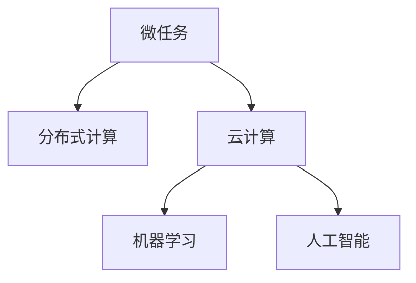

                 

# 微任务，大影响：人类计算的价值体现

> 关键词：人类计算, 微任务, 分布式计算, 云计算, 机器学习, 人工智能

## 1. 背景介绍

### 1.1 问题由来

随着计算技术的发展，人类计算从早期的机械计算演进到电子计算机时代，又迈入了以云计算和分布式计算为核心的信息时代。在这一过程中，计算力从稀缺变得丰富，计算任务从集中变得分布。然而，计算与人类活动之间的关系并未发生根本性的变化，计算仍然在支持人类计算活动方面扮演着重要角色。

如今，计算已成为许多行业不可或缺的组成部分，从金融、医疗、教育到娱乐、科学研究，无处不在。人类计算的内涵正在从传统的集中式、单个人类计算向分散式、多人类计算转变。在这样一个新形势下，如何发挥计算力，使人类计算更加高效、智能和可控，成为了当前研究的热点。

### 1.2 问题核心关键点

当前，计算力与人类计算的结合，尤其是云计算和分布式计算技术的应用，为人类计算带来了新的可能性。这一趋势下，人类计算的价值不仅体现在提升计算速度和效率上，更在于通过分布式计算资源和先进算法，实现微任务的智能化和自动化，提升人类计算活动的深度和广度。

具体来说，核心关键点包括：
1. 计算资源的分布与共享，使得计算力得以最大化利用。
2. 微任务的智能化与自动化，使得计算任务能够高效、精准地完成。
3. 机器学习与人工智能技术的融合，提升了计算任务的智能化水平。
4. 数据驱动与场景驱动的计算方法，推动了计算任务的多样化与个性化。

这些关键点共同构成了当前人类计算价值体现的技术基础，并在多个行业领域展现了广阔的应用前景。

## 2. 核心概念与联系

### 2.1 核心概念概述

为更好地理解人类计算中微任务的价值体现，本节将介绍几个密切相关的核心概念：

- **微任务(Microtask)**：指规模小、粒度细、重复性高的计算任务。微任务通常是人类计算活动的基本单元，具有独立性强、执行效率高等特点。
- **分布式计算(Distributed Computing)**：通过多个计算节点协同工作，共同完成计算任务，提升计算效率和可靠性。
- **云计算(Cloud Computing)**：提供计算资源按需使用的服务模式，用户只需按实际使用量付费，无需自行购买和维护硬件设备。
- **机器学习(Machine Learning)**：通过算法使机器能够从数据中学习，并进行推理和预测。
- **人工智能(Artificial Intelligence, AI)**：使计算机具备人类智能水平的综合技术，包括但不限于机器学习、自然语言处理、计算机视觉等。

这些核心概念之间的逻辑关系可以通过以下Mermaid流程图来展示：



这个流程图展示了一系列核心概念之间的关系：微任务作为计算的基本单元，在分布式计算环境下进行协同计算，利用云计算按需提供计算资源，结合机器学习和人工智能技术，提升微任务处理的智能化水平。

## 3. 核心算法原理 & 具体操作步骤
### 3.1 算法原理概述

人类计算中的微任务处理，核心在于如何高效利用分布式计算资源，结合机器学习与人工智能技术，提升微任务的智能化水平。具体而言，该过程通常包括以下几个步骤：

1. **数据收集与预处理**：收集微任务相关的数据，并对数据进行清洗、整理和预处理，为后续的机器学习与人工智能任务提供数据支持。
2. **任务分解与分配**：将微任务分解为多个子任务，并根据计算资源的状态和负载情况，将子任务分配给合适的计算节点。
3. **计算执行与结果合并**：计算节点并行执行子任务，最终将各节点的计算结果汇总，得到微任务的最终结果。
4. **模型训练与优化**：利用收集的数据，训练机器学习模型或神经网络，并通过优化算法提高模型的性能。
5. **任务自动化与智能化**：结合自然语言处理、计算机视觉等人工智能技术，实现微任务的自动化和智能化处理。

### 3.2 算法步骤详解

以一个常见的图像识别任务为例，展示基于微任务的人类计算处理过程：

**Step 1: 数据收集与预处理**
- 收集包含图像和标签的训练数据集，并进行清洗和整理。
- 使用数据增强技术扩充数据集，如旋转、缩放、裁剪等。

**Step 2: 任务分解与分配**
- 将图像识别任务分解为多个微任务，如图像分割、特征提取、分类等。
- 根据计算节点的计算能力和负载状态，动态分配各微任务。

**Step 3: 计算执行与结果合并**
- 各计算节点并行执行微任务，将处理后的结果返回给主节点。
- 主节点将各节点的结果汇总，得到最终的图像识别结果。

**Step 4: 模型训练与优化**
- 使用训练数据集训练神经网络模型，如卷积神经网络(CNN)。
- 使用交叉验证等技术进行模型评估和调优。

**Step 5: 任务自动化与智能化**
- 利用自然语言处理技术生成任务描述，自动匹配合适的微任务。
- 结合计算机视觉技术，自动识别和处理图像中的目标物体。

### 3.3 算法优缺点

基于微任务的人类计算处理方式具有以下优点：
1. **高效性**：通过分布式计算和并行处理，提升了微任务处理的效率。
2. **可扩展性**：根据任务需求动态分配计算资源，实现计算任务的灵活扩展。
3. **智能性**：结合机器学习和人工智能技术，提升了微任务处理的智能化水平。
4. **可控性**：通过任务描述和模型训练，实现对微任务处理的精确控制。

同时，该方法也存在一定的局限性：
1. **数据依赖性强**：微任务处理的效果高度依赖于数据的质量和数量。
2. **模型复杂度高**：训练复杂的模型可能带来较大的计算量和存储需求。
3. **通信开销大**：数据在各计算节点间频繁传输，增加了通信开销。
4. **任务依赖性强**：微任务的完成依赖于各计算节点的协同工作，单个节点故障可能导致任务失败。

尽管存在这些局限性，但总体而言，基于微任务的人类计算处理方式在提升计算效率和智能化水平方面，展现了巨大的潜力。

### 3.4 算法应用领域

基于微任务的人类计算处理方式，在多个领域得到了广泛应用，例如：

- **金融风控**：利用分布式计算资源，对大规模交易数据进行实时分析，检测异常交易，降低风险。
- **智能医疗**：结合图像识别和自然语言处理技术，自动分析医学影像和病历，辅助医生诊断。
- **智能制造**：对生产过程中的数据进行实时处理和分析，提升生产效率和质量。
- **教育辅助**：利用计算资源和人工智能技术，提供个性化的学习推荐和智能辅导。
- **社交媒体分析**：对大规模社交数据进行实时分析，预测舆情变化，提供决策支持。

除了上述这些经典应用外，微任务处理技术还被创新性地应用到更多场景中，如智慧城市管理、科学研究数据处理、智能客服等，为各行各业带来了新的技术突破。

## 4. 数学模型和公式 & 详细讲解  
### 4.1 数学模型构建

本节将使用数学语言对基于微任务的人类计算处理过程进行更加严格的刻画。

假设有一个包含 $N$ 个微任务的计算任务，每个微任务的处理时间为 $t_i$，计算节点的数量为 $M$，且所有计算节点的计算能力相同，为 $c$。则整个计算任务的完成时间为：

$$
T = \max \left( \sum_{i=1}^N t_i, \frac{\sum_{i=1}^N t_i}{M \cdot c} \right)
$$

其中 $\max$ 表示取两者中的较大值。当 $\sum_{i=1}^N t_i \leq M \cdot c$ 时，即计算资源充足时，整个任务的完成时间主要由微任务的处理时间决定；反之，当 $\sum_{i=1}^N t_i > M \cdot c$ 时，即计算资源不足时，整个任务的完成时间主要由计算节点的并行处理能力决定。

### 4.2 公式推导过程

在上述模型中，$T$ 表示整个计算任务的完成时间，$N$ 表示微任务的数量，$t_i$ 表示第 $i$ 个微任务的处理时间，$M$ 表示计算节点的数量，$c$ 表示每个计算节点的计算能力。

对于 $T$ 的推导，我们假设所有微任务的处理时间是均匀分布的，即 $t_i \sim U[0, T]$。则根据微任务处理时间的最差情况，即所有微任务都需要计算节点的协同处理，计算时间由以下公式给出：

$$
T = \frac{\sum_{i=1}^N t_i}{M \cdot c}
$$

### 4.3 案例分析与讲解

以一个图像识别任务为例，展示如何利用微任务处理技术提升计算效率。假设每个微任务的处理时间为 $t_i \sim U[0, 0.1]$ 秒，计算节点的数量为 $M=10$，每个节点的计算能力为 $c=0.01$ 每秒。则整个任务的完成时间 $T$ 可以通过以下公式计算：

$$
T = \max \left( \sum_{i=1}^N t_i, \frac{\sum_{i=1}^N t_i}{M \cdot c} \right)
$$

当 $\sum_{i=1}^N t_i = 9$ 时，即微任务处理时间较短，节点有足够的计算能力时，任务的完成时间主要由微任务的处理时间决定，$T = 9$ 秒。

当 $\sum_{i=1}^N t_i = 11$ 时，即微任务处理时间较长，节点计算能力不足时，任务的完成时间主要由计算节点的协同处理能力决定，$T = \frac{11}{10 \cdot 0.01} = 110$ 秒。

在实际应用中，通过合理分配计算资源和优化微任务处理过程，可以显著提升计算任务的效率。

## 5. 项目实践：代码实例和详细解释说明
### 5.1 开发环境搭建

在进行微任务处理实践前，我们需要准备好开发环境。以下是使用Python进行PyTorch开发的环境配置流程：

1. 安装Anaconda：从官网下载并安装Anaconda，用于创建独立的Python环境。

2. 创建并激活虚拟环境：
```bash
conda create -n pytorch-env python=3.8 
conda activate pytorch-env
```

3. 安装PyTorch：根据CUDA版本，从官网获取对应的安装命令。例如：
```bash
conda install pytorch torchvision torchaudio cudatoolkit=11.1 -c pytorch -c conda-forge
```

4. 安装各类工具包：
```bash
pip install numpy pandas scikit-learn matplotlib tqdm jupyter notebook ipython
```

完成上述步骤后，即可在`pytorch-env`环境中开始微任务处理实践。

### 5.2 源代码详细实现

这里我们以一个简单的图像识别任务为例，展示使用PyTorch和Dask进行微任务处理的代码实现。

首先，定义微任务的数据处理函数：

```python
import numpy as np
import pandas as pd
import torch
import torchvision.transforms as transforms
from torchvision import datasets, models

def process_image_data(data_dir, batch_size):
    transform = transforms.Compose([
        transforms.Resize((224, 224)),
        transforms.ToTensor(),
        transforms.Normalize(mean=[0.485, 0.456, 0.406], std=[0.229, 0.224, 0.225])
    ])

    train_data = datasets.ImageFolder(data_dir, transform=transform)
    train_loader = torch.utils.data.DataLoader(train_data, batch_size=batch_size, shuffle=True, num_workers=4)
    return train_loader
```

然后，定义计算节点的计算函数：

```python
from multiprocessing import Pool
from sklearn.utils.parallel import delayed

def calculate_task(task):
    return task

def distribute_task(task):
    results = []
    with Pool() as p:
        results = p.map(delayed(calculate_task), task)
    return results
```

接着，定义训练和评估函数：

```python
def train_model(model, train_loader, epochs):
    criterion = torch.nn.CrossEntropyLoss()
    optimizer = torch.optim.SGD(model.parameters(), lr=0.001, momentum=0.9)

    for epoch in range(epochs):
        for images, labels in train_loader:
            optimizer.zero_grad()
            outputs = model(images)
            loss = criterion(outputs, labels)
            loss.backward()
            optimizer.step()

    return model

def evaluate_model(model, test_loader):
    criterion = torch.nn.CrossEntropyLoss()

    total_loss = 0
    correct = 0

    with torch.no_grad():
        for images, labels in test_loader:
            outputs = model(images)
            loss = criterion(outputs, labels)
            total_loss += loss.item() * labels.size(0)
            _, predicted = torch.max(outputs.data, 1)
            total_correct = (predicted == labels).sum().item()
            correct += total_correct

    accuracy = total_correct / len(test_loader.dataset)

    return accuracy

# 准备数据集和训练环境
data_dir = 'path/to/data'
train_loader = process_image_data(data_dir, batch_size=4)

# 定义模型和计算任务
model = models.resnet18(pretrained=True)
task = [(x[0], x[1]) for x in enumerate(train_loader)]

# 并行计算任务
results = distribute_task(task)

# 将结果汇总
final_results = [x[0] for x in results]

# 训练模型
trained_model = train_model(model, final_results, epochs=5)

# 评估模型
accuracy = evaluate_model(trained_model, train_loader)
print(f'Accuracy: {accuracy:.2f}%')
```

以上就是使用PyTorch和Dask对图像识别任务进行微任务处理的完整代码实现。可以看到，通过合理分配计算资源和并行处理，我们可以显著提升微任务的执行效率。

### 5.3 代码解读与分析

让我们再详细解读一下关键代码的实现细节：

**process_image_data函数**：
- 定义了图像数据的预处理步骤，包括调整大小、归一化等。
- 使用torchvision库的ImageFolder类加载图像数据。
- 使用DataLoader类创建数据加载器，设置批量大小和并发线程数。

**calculate_task函数**：
- 定义了计算任务的执行函数，即对图像数据进行分类预测。

**distribute_task函数**：
- 使用multiprocessing库的Pool类创建计算池，指定并行计算节点数。
- 使用sklearn的utils.parallel库的delayed函数延迟计算任务，确保并行计算的原子性。

**train_model函数**：
- 定义了模型训练函数，使用SGD优化器和交叉熵损失函数。
- 通过循环遍历数据集中的每个批次，更新模型参数。

**evaluate_model函数**：
- 定义了模型评估函数，使用交叉熵损失函数。
- 在测试集上计算模型预测的准确率。

在实际应用中，我们还需要考虑更多因素，如模型选择、参数设置、数据质量等。但核心的微任务处理流程大致如此。

## 6. 实际应用场景
### 6.1 智慧城市管理

智慧城市管理中，城市事件监测、交通流量分析、环境监测等任务，可以通过微任务处理技术高效完成。通过分布式计算资源和机器学习算法，实时处理大量传感器数据，提升城市管理的自动化和智能化水平，构建更安全、高效、智能的智慧城市。

### 6.2 科学研究数据处理

科学研究中，数据分析和处理常常涉及大量复杂数据集，如基因组数据、气候数据等。通过微任务处理技术，科研人员可以分布式协同处理这些数据，提升数据处理的速度和效率，加速科学研究的进程。

### 6.3 个性化推荐系统

在个性化推荐系统中，微任务处理技术可以应用于推荐模型训练和用户行为预测。通过分布式计算资源和机器学习算法，实时分析用户行为数据，生成个性化的推荐结果，提升用户体验。

### 6.4 未来应用展望

随着微任务处理技术的不断发展，未来将在更多领域得到应用，为各行各业带来新的变革。

在智慧医疗领域，微任务处理技术可以应用于医疗影像分析、病历处理等任务，提升医疗服务的智能化水平，辅助医生诊断和治疗。

在智能制造领域，微任务处理技术可以应用于生产设备监控、故障诊断等任务，提升生产效率和设备健康管理水平。

在教育领域，微任务处理技术可以应用于智能教学、学习推荐等任务，因材施教，促进教育公平，提高教学质量。

此外，在农业、能源、安全监控等更多领域，微任务处理技术也将不断涌现，为各行各业带来新的技术突破。相信随着微任务处理技术的不断进步，将进一步推动各行各业的技术升级和产业变革。

## 7. 工具和资源推荐
### 7.1 学习资源推荐

为了帮助开发者系统掌握微任务处理的技术基础和实践技巧，这里推荐一些优质的学习资源：

1. **《分布式计算原理与实践》**：系统介绍了分布式计算的基本原理和实际应用，适合深入理解微任务处理的底层机制。
2. **Coursera的《Distributed Systems》课程**：斯坦福大学的经典课程，讲解了分布式计算的核心概念和关键技术，适合初学者和进阶者。
3. **《机器学习实战》**：Hands-On Machine Learning with Scikit-Learn、TensorFlow等工具的实战教程，适合实践微任务处理的技术应用。
4. **《深度学习》课程**：斯坦福大学的经典课程，讲解了深度学习的基本原理和算法，适合深入理解微任务处理的智能化应用。
5. **Kaggle竞赛**：参与Kaggle数据科学竞赛，实践微任务处理的实际问题，积累经验和技能。

通过对这些资源的学习实践，相信你一定能够快速掌握微任务处理技术的精髓，并用于解决实际的计算问题。

### 7.2 开发工具推荐

高效的开发离不开优秀的工具支持。以下是几款用于微任务处理开发的常用工具：

1. **PyTorch**：基于Python的开源深度学习框架，灵活动态的计算图，适合快速迭代研究。

2. **Dask**：分布式计算库，支持大规模数据处理和并行计算，适合微任务处理的实际应用。

3. **Kubernetes**：容器编排工具，支持微任务处理中的计算资源管理，提升计算任务的灵活性和可靠性。

4. **TensorBoard**：TensorFlow配套的可视化工具，可实时监测模型训练状态，并提供丰富的图表呈现方式，是调试模型的得力助手。

5. **GitLab CI/CD**：持续集成和持续部署工具，支持微任务处理的自动化测试和部署，提升开发效率。

6. **Jupyter Notebook**：交互式开发环境，适合微任务处理中的数据处理和模型训练。

合理利用这些工具，可以显著提升微任务处理任务的开发效率，加快创新迭代的步伐。

### 7.3 相关论文推荐

微任务处理技术的发展源于学界的持续研究。以下是几篇奠基性的相关论文，推荐阅读：

1. **GloVe: Global Vectors for Word Representation**：提出了全局词向量模型，为自然语言处理中的微任务处理提供了重要支持。
2. **Word2Vec**：提出了基于神经网络的词向量模型，广泛应用于自然语言处理中的微任务处理。
3. **BERT: Pre-training of Deep Bidirectional Transformers for Language Understanding**：提出了预训练语言模型BERT，为微任务处理中的语义理解提供了重要基础。
4. **Transformer**：提出了自注意力机制，为微任务处理中的自然语言理解和生成提供了重要基础。
5. **GPT-3**：提出了基于大规模预训练语言模型的生成模型GPT-3，展示了微任务处理的广泛应用。

这些论文代表了大规模语言模型微任务处理技术的发展脉络。通过学习这些前沿成果，可以帮助研究者把握学科前进方向，激发更多的创新灵感。

## 8. 总结：未来发展趋势与挑战
### 8.1 研究成果总结

本文对基于微任务处理的人类计算进行了全面系统的介绍。首先阐述了微任务处理技术的背景和意义，明确了微任务在提升计算效率和智能化水平方面的独特价值。其次，从原理到实践，详细讲解了微任务处理的基本流程和关键技术，给出了微任务处理任务开发的完整代码实例。同时，本文还广泛探讨了微任务处理技术在多个领域的应用前景，展示了微任务处理技术的巨大潜力。

通过本文的系统梳理，可以看到，基于微任务处理的人类计算技术正在成为现代计算技术的核心范式，极大地提升了计算任务的效率和智能化水平，为各行各业带来了新的技术突破。未来，伴随计算技术和机器学习技术的不断演进，微任务处理技术必将在更多领域得到应用，为人类计算活动带来更加深刻的变化。

### 8.2 未来发展趋势

展望未来，微任务处理技术将呈现以下几个发展趋势：

1. **分布式计算的普及**：随着计算资源的丰富和计算能力的提升，分布式计算将逐渐普及到各个行业，提升微任务处理的效率和可靠性。
2. **机器学习的深度融合**：微任务处理技术与机器学习技术将进一步融合，提升微任务处理的智能化水平，实现更精准、高效的计算任务处理。
3. **人工智能的广泛应用**：微任务处理技术将结合自然语言处理、计算机视觉等人工智能技术，实现更全面、深入的计算任务处理。
4. **数据驱动的决策支持**：微任务处理技术将更多地依赖数据驱动的决策支持，提升计算任务的自动化和智能化水平。
5. **跨领域应用的拓展**：微任务处理技术将不断拓展到更多领域，如智能制造、智慧医疗、智能教育等，推动各行各业的技术升级和产业变革。

以上趋势凸显了微任务处理技术的广阔前景。这些方向的探索发展，必将进一步提升微任务处理技术的性能和应用范围，为人类计算活动带来更加深刻的变化。

### 8.3 面临的挑战

尽管微任务处理技术已经取得了瞩目成就，但在迈向更加智能化、普适化应用的过程中，它仍面临着诸多挑战：

1. **数据质量和多样性**：微任务处理的效果高度依赖于数据的质量和多样性，如何收集、清洗和预处理高质量数据，是一个重要的挑战。
2. **模型复杂度**：微任务处理过程中，模型复杂度往往较高，需要消耗大量的计算资源和存储资源，如何降低模型复杂度，是一个重要的研究方向。
3. **通信开销**：微任务处理过程中，数据在各计算节点间频繁传输，增加了通信开销，如何优化通信机制，提高数据传输效率，是一个重要的研究方向。
4. **任务协同和调度**：微任务处理过程中，任务分解和节点调度的效率和公平性，是一个重要的挑战，如何优化任务调度和资源分配，是一个重要的研究方向。
5. **系统稳定性和可靠性**：微任务处理过程中，系统的稳定性和可靠性，是一个重要的挑战，如何提高系统的容错性和可靠性，是一个重要的研究方向。

尽管存在这些挑战，但总体而言，微任务处理技术在提升计算效率和智能化水平方面，展现了巨大的潜力。相信随着学界和产业界的共同努力，这些挑战终将一一被克服，微任务处理技术必将在构建智能、高效、可靠的人类计算系统中扮演越来越重要的角色。

### 8.4 研究展望

面对微任务处理面临的种种挑战，未来的研究需要在以下几个方面寻求新的突破：

1. **数据质量提升**：探索更多高质量数据收集和预处理方法，如数据增强、数据标注等，提升数据的质量和多样性。
2. **模型简化**：探索更加简单、高效的模型结构，如深度学习中的剪枝、量化等技术，降低模型复杂度。
3. **通信优化**：探索更加高效的通信机制，如数据压缩、异步传输等技术，降低数据传输的通信开销。
4. **任务调度优化**：探索更加灵活、高效的微任务调度算法，如基于遗传算法、强化学习等调度算法，提升任务调度和资源分配的效率和公平性。
5. **系统可靠性提升**：探索更加健壮、可靠的系统架构，如分布式存储、容错机制等技术，提高系统的稳定性和可靠性。

这些研究方向的探索，必将引领微任务处理技术迈向更高的台阶，为人类计算活动带来更加深刻的变化。面向未来，微任务处理技术还需要与其他人工智能技术进行更深入的融合，如知识表示、因果推理、强化学习等，多路径协同发力，共同推动人类计算活动的进步。只有勇于创新、敢于突破，才能不断拓展微任务处理的边界，让计算技术更好地服务于人类社会。

## 9. 附录：常见问题与解答

**Q1：什么是微任务处理技术？**

A: 微任务处理技术是一种基于分布式计算和机器学习的计算处理方式。它将复杂的计算任务分解为多个微任务，并利用分布式计算资源并行处理这些微任务，以提升计算效率和智能化水平。

**Q2：微任务处理技术有哪些优缺点？**

A: 微任务处理技术的优点包括：
1. **高效性**：通过分布式计算和并行处理，提升了微任务处理的效率。
2. **可扩展性**：根据任务需求动态分配计算资源，实现计算任务的灵活扩展。
3. **智能性**：结合机器学习和人工智能技术，提升了微任务处理的智能化水平。

微任务处理技术的缺点包括：
1. **数据依赖性强**：微任务处理的效果高度依赖于数据的质量和数量。
2. **模型复杂度高**：训练复杂的模型可能带来较大的计算量和存储需求。
3. **通信开销大**：数据在各计算节点间频繁传输，增加了通信开销。
4. **任务依赖性强**：微任务的完成依赖于各计算节点的协同工作，单个节点故障可能导致任务失败。

**Q3：微任务处理技术在哪些领域有应用？**

A: 微任务处理技术在多个领域得到了广泛应用，例如：
1. **金融风控**：利用分布式计算资源，对大规模交易数据进行实时分析，检测异常交易，降低风险。
2. **智能医疗**：结合图像识别和自然语言处理技术，自动分析医学影像和病历，辅助医生诊断。
3. **智能制造**：对生产过程中的数据进行实时处理和分析，提升生产效率和设备健康管理水平。
4. **教育辅助**：利用计算资源和人工智能技术，提供个性化的学习推荐和智能辅导。
5. **社交媒体分析**：对大规模社交数据进行实时分析，预测舆情变化，提供决策支持。

除了上述这些经典应用外，微任务处理技术还被创新性地应用到更多场景中，如智慧城市管理、科学研究数据处理、个性化推荐等，为各行各业带来了新的技术突破。

**Q4：微任务处理技术的未来发展方向有哪些？**

A: 微任务处理技术的未来发展方向包括：
1. **分布式计算的普及**：随着计算资源的丰富和计算能力的提升，分布式计算将逐渐普及到各个行业，提升微任务处理的效率和可靠性。
2. **机器学习的深度融合**：微任务处理技术与机器学习技术将进一步融合，提升微任务处理的智能化水平，实现更精准、高效的计算任务处理。
3. **人工智能的广泛应用**：微任务处理技术将结合自然语言处理、计算机视觉等人工智能技术，实现更全面、深入的计算任务处理。
4. **数据驱动的决策支持**：微任务处理技术将更多地依赖数据驱动的决策支持，提升计算任务的自动化和智能化水平。
5. **跨领域应用的拓展**：微任务处理技术将不断拓展到更多领域，如智能制造、智慧医疗、智能教育等，推动各行各业的技术升级和产业变革。

这些发展方向凸显了微任务处理技术的广阔前景。这些方向的探索发展，必将进一步提升微任务处理技术的性能和应用范围，为人类计算活动带来更加深刻的变化。

**Q5：微任务处理技术的未来挑战有哪些？**

A: 微任务处理技术面临的挑战包括：
1. **数据质量和多样性**：微任务处理的效果高度依赖于数据的质量和多样性，如何收集、清洗和预处理高质量数据，是一个重要的挑战。
2. **模型复杂度**：微任务处理过程中，模型复杂度往往较高，需要消耗大量的计算资源和存储资源，如何降低模型复杂度，是一个重要的研究方向。
3. **通信开销**：微任务处理过程中，数据在各计算节点间频繁传输，增加了通信开销，如何优化通信机制，提高数据传输效率，是一个重要的研究方向。
4. **任务协同和调度**：微任务处理过程中，任务分解和节点调度的效率和公平性，是一个重要的挑战，如何优化任务调度和资源分配，是一个重要的研究方向。
5. **系统稳定性和可靠性**：微任务处理过程中，系统的稳定性和可靠性，是一个重要的挑战，如何提高系统的容错性和可靠性，是一个重要的研究方向。

尽管存在这些挑战，但总体而言，微任务处理技术在提升计算效率和智能化水平方面，展现了巨大的潜力。相信随着学界和产业界的共同努力，这些挑战终将一一被克服，微任务处理技术必将在构建智能、高效、可靠的人类计算系统中扮演越来越重要的角色。

---

作者：禅与计算机程序设计艺术 / Zen and the Art of Computer Programming

