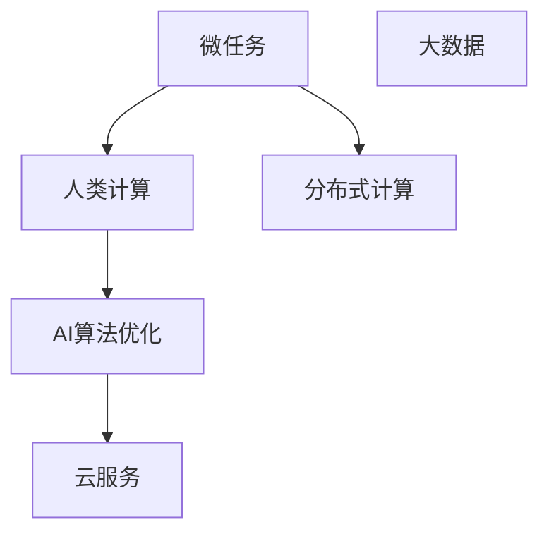

                 

# 微任务，大数据：人类计算的应用

> 关键词：微任务、大数据、人类计算、云服务、分布式计算、AI算法优化

## 1. 背景介绍

### 1.1 问题由来

在计算科技飞速发展的今天，人类面临一个严峻的挑战：如何高效利用计算机的强大计算能力来解决人类社会中的复杂问题？传统的中心式计算模式难以满足海量数据和多样性需求的现实。为此，一种全新的计算模式应运而生——人类计算（Human Compute）。人类计算不仅充分利用了计算机的高效性，也充分发挥了人类智慧的创造力，将人类思维与计算机计算有机结合，从而开启了智能化计算的新纪元。

### 1.2 问题核心关键点

人类计算的核心在于通过分布式计算平台，将海量计算任务拆分成多个微任务（Microtask），由千百万的志愿者参与完成。这种模式不仅降低了单个任务的时间成本和资金投入，而且可以充分利用全球志愿者资源，形成一个人类智慧和计算机计算的强大合力。人类计算的精髓在于将庞大复杂的问题拆解为微小的、易于管理的部分，通过协同计算的方式，实现大规模的、高效的数据处理和智能算法优化。

## 2. 核心概念与联系

### 2.1 核心概念概述

为更好地理解人类计算的原理与实践，本节将介绍几个关键概念：

- **微任务（Microtask）**：指人类计算中最基本的计算单元，通常是一个简单的、易于完成的小任务。微任务在分布式计算中具有高度的灵活性和可扩展性。

- **大数据（Big Data）**：指数据量庞大、数据类型多样、数据生成速度快的数据集合。大数据技术是实现人类计算的关键支撑。

- **人类计算（Human Compute）**：指将复杂的计算任务拆分为多个微任务，由人类志愿者通过互联网协同完成。人类计算充分利用了人类智慧和计算机计算的结合，大大提高了数据处理和算法优化的效率。

- **分布式计算（Distributed Computing）**：指通过计算机网络将计算任务分配到多个节点上，并行执行计算任务。分布式计算是实现人类计算的基础技术。

- **云服务（Cloud Service）**：指通过互联网提供的计算、存储和应用服务。云服务为人类计算提供了强大的计算资源和数据存储支持。

- **AI算法优化**：指通过大规模的、协同的人类计算，优化和提升机器学习、自然语言处理等AI算法的效果。AI算法优化是人类计算的重要应用领域。

这些核心概念之间的关系可以通过以下Mermaid流程图来展示：



该流程图展示了微任务在大数据处理、人类计算、分布式计算、云服务、AI算法优化之间的关系：

1. 微任务是大数据处理的基本单位。
2. 人类计算通过微任务，将大数据处理任务分派给全球志愿者，形成分布式计算。
3. 分布式计算通过云服务，提供强大的计算资源，支持微任务的执行。
4. AI算法优化利用分布式计算平台，通过大规模的、协同的人类计算，不断提升算法性能。

这些核心概念共同构成了人类计算的技术框架，使我们能够高效处理大规模的、复杂的数据计算任务。通过理解这些概念，我们可以更好地把握人类计算的工作原理和优化方向。

## 3. 核心算法原理 & 具体操作步骤
### 3.1 算法原理概述

人类计算的算法原理，主要基于分布式计算和协同计算。具体而言，算法核心步骤如下：

1. **任务拆解**：将复杂的大数据处理任务，拆解为多个微任务，每个微任务都是一个简单的计算问题。
2. **任务分派**：将每个微任务分配给不同的志愿者，通过云服务提供计算资源。
3. **协同计算**：志愿者利用个人设备，对分配给自己的微任务进行计算，并将结果上传到分布式计算平台。
4. **结果合并**：分布式计算平台将志愿者计算的结果汇总，形成最终的计算结果。
5. **算法优化**：利用协同计算得到的大规模数据，通过AI算法优化，不断提升算法的精度和效率。

人类计算的核心在于通过分布式计算平台，将复杂的计算任务拆解为易于管理的微任务，利用全球志愿者资源，实现大规模的、高效的数据处理和算法优化。

### 3.2 算法步骤详解

人类计算的算法步骤如下：

**Step 1: 任务拆解**

任务拆解是实现人类计算的首要步骤。在这一步骤中，需要根据具体的计算任务，将大数据处理任务拆解为多个微任务。微任务的拆解应尽量简单、易于管理，以便志愿者能够快速理解和完成任务。

例如，对于图像分类任务，可以将图像数据集拆分为多个子集，每个子集包含一定数量的图像，并将每个子集分配给不同的志愿者进行分类。

**Step 2: 任务分派**

任务分派是将微任务分配给志愿者的过程。这一步骤通常由分布式计算平台自动完成，志愿者可以通过云服务平台接收任务并进行计算。

例如，通过Amazon Mechanical Turk平台，将图像分类任务分配给全球的志愿者，每个志愿者领取不同的子集任务，并在自己的设备上完成计算。

**Step 3: 协同计算**

协同计算是志愿者在各自设备上完成微任务，并将计算结果上传到分布式计算平台的过程。协同计算需要保证计算任务的准确性和一致性，确保每个志愿者提交的结果都是正确的。

例如，志愿者在各自的设备上对图像进行分类，并将分类的结果上传至Amazon Mechanical Turk平台。

**Step 4: 结果合并**

结果合并是将志愿者提交的计算结果汇总，形成最终的计算结果。这一步骤通常由分布式计算平台自动完成，确保结果的准确性和完整性。

例如，Amazon Mechanical Turk平台将志愿者提交的分类结果进行汇总，形成最终的图像分类结果。

**Step 5: 算法优化**

算法优化是通过大规模的、协同的人类计算，不断提升AI算法的效果。算法优化通常需要借助分布式计算平台，利用协同计算得到的大规模数据，进行算法的迭代训练和优化。

例如，利用图像分类结果，通过机器学习算法，不断优化图像分类的准确率和效率。

### 3.3 算法优缺点

人类计算具有以下优点：

1. 成本低廉：相比于传统的中心式计算，人类计算利用全球志愿者资源，大大降低了计算任务的时间成本和资金投入。
2. 可扩展性高：人类计算可以将复杂的计算任务拆解为多个微任务，通过协同计算，实现大规模的数据处理和算法优化。
3. 灵活性高：人类计算可以灵活地适应各种计算任务，支持多种数据类型和计算模型的应用。

但人类计算也存在一些缺点：

1. 数据质量难以保证：由于志愿者不具备专业的数据处理能力，数据的质量和一致性难以保证。
2. 计算效率较低：每个志愿者提交的计算结果都需要经过合并和校验，增加了计算的复杂性和时间成本。
3. 隐私和安全问题：志愿者的计算结果和个人信息可能存在隐私和安全风险，需要采取相应的保护措施。

尽管存在这些局限性，但人类计算在处理大规模数据和优化算法方面具有显著优势，成为数据科学和人工智能领域的重要技术手段。

### 3.4 算法应用领域

人类计算已经在多个领域得到广泛应用，包括但不限于：

- **自然语言处理（NLP）**：通过人类计算，优化语言模型和自然语言理解算法，提升机器翻译、文本分类、情感分析等NLP任务的性能。
- **图像处理**：利用人类计算，进行大规模的图像分类和标注，提升计算机视觉技术的应用效果。
- **生物信息学**：通过人类计算，对基因序列和蛋白质结构进行大规模的分析和模拟，加速生命科学的研究进程。
- **金融数据分析**：利用人类计算，进行大规模的金融数据处理和分析，提升风险评估和投资决策的准确性。
- **环境监测**：通过人类计算，对海量环境数据进行分类和分析，支持环境科学的研究和应用。

## 4. 数学模型和公式 & 详细讲解 & 举例说明

### 4.1 数学模型构建

人类计算的数学模型主要涉及分布式计算和协同计算。在分布式计算中，任务并行执行的效率和一致性是关键因素。在协同计算中，数据的一致性和合并效率是核心问题。以下是一个简单的分布式计算模型的数学描述：

假设大数据集 $D$ 被拆分为 $N$ 个微任务 $D_1, D_2, ..., D_N$，每个微任务由 $M$ 个志愿者同时处理。设志愿者 $i$ 对微任务 $D_j$ 的处理时间为 $t_i^j$，处理结果为 $R_i^j$。则最终的结果 $R$ 可以表示为：

$$ R = \frac{1}{M} \sum_{i=1}^{M} \sum_{j=1}^{N} R_i^j $$

在协同计算中，结果合并的效率直接影响整个计算任务的时间成本。为确保结果的一致性，可以使用一些分布式计算框架，如Apache Hadoop、Apache Spark等，进行高效的并行计算和数据合并。

### 4.2 公式推导过程

以下是一个简单的协同计算模型的数学推导：

假设志愿者 $i$ 对微任务 $D_j$ 的处理时间为 $t_i^j$，处理结果为 $R_i^j$。设微任务 $D_j$ 的总处理时间为 $T_j$，则有：

$$ T_j = \sum_{i=1}^{M} t_i^j $$

设微任务 $D_j$ 的合并时间为 $T_M^j$，则最终结果的合并时间为 $T_M$，有：

$$ T_M = \sum_{j=1}^{N} T_M^j $$

设微任务 $D_j$ 的处理结果一致性为 $C_j$，则最终结果的一致性为 $C$，有：

$$ C = \prod_{j=1}^{N} C_j $$

在实际计算中，为了提高效率和一致性，可以采用分布式数据存储和分布式计算框架，如Apache Hadoop、Apache Spark等，进行高效的数据处理和结果合并。

### 4.3 案例分析与讲解

以下是一个具体的案例：通过人类计算优化图像分类算法。

**案例背景**：某公司需要对其大量的产品图片进行分类，每个图片都是一个独立的计算任务。由于任务量巨大，传统中心式计算难以满足需求。

**任务拆解**：将产品图片分为多个子集，每个子集包含一定数量的图片，并将每个子集分配给不同的志愿者进行分类。

**任务分派**：通过Amazon Mechanical Turk平台，将图像分类任务分配给全球的志愿者，每个志愿者领取不同的子集任务，并在自己的设备上完成计算。

**协同计算**：志愿者在各自的设备上对图片进行分类，并将分类的结果上传至Amazon Mechanical Turk平台。

**结果合并**：Amazon Mechanical Turk平台将志愿者提交的分类结果进行汇总，形成最终的产品图片分类结果。

**算法优化**：利用图像分类结果，通过机器学习算法，不断优化图像分类的准确率和效率。

通过人类计算，公司能够在较短时间内完成大规模的图像分类任务，提升图像处理算法的精度和效率。

## 5. 项目实践：代码实例和详细解释说明
### 5.1 开发环境搭建

在进行人类计算实践前，我们需要准备好开发环境。以下是使用Python进行PyTorch开发的环境配置流程：

1. 安装Anaconda：从官网下载并安装Anaconda，用于创建独立的Python环境。

2. 创建并激活虚拟环境：
```bash
conda create -n human-compute python=3.8 
conda activate human-compute
```

3. 安装PyTorch：根据CUDA版本，从官网获取对应的安装命令。例如：
```bash
conda install pytorch torchvision torchaudio cudatoolkit=11.1 -c pytorch -c conda-forge
```

4. 安装Transformers库：
```bash
pip install transformers
```

5. 安装各类工具包：
```bash
pip install numpy pandas scikit-learn matplotlib tqdm jupyter notebook ipython
```

完成上述步骤后，即可在`human-compute`环境中开始人类计算实践。

### 5.2 源代码详细实现

这里我们以图像分类任务为例，给出使用Transformers库对BERT模型进行人类计算的PyTorch代码实现。

首先，定义图像分类任务的数据处理函数：

```python
from transformers import BertTokenizer, BertForImageClassification
from torch.utils.data import Dataset
import torch

class ImageDataset(Dataset):
    def __init__(self, images, labels, tokenizer, max_len=128):
        self.images = images
        self.labels = labels
        self.tokenizer = tokenizer
        self.max_len = max_len
        
    def __len__(self):
        return len(self.images)
    
    def __getitem__(self, item):
        image = self.images[item]
        label = self.labels[item]
        
        encoding = self.tokenizer(image, return_tensors='pt', max_length=self.max_len, padding='max_length', truncation=True)
        input_ids = encoding['input_ids'][0]
        attention_mask = encoding['attention_mask'][0]
        
        return {'input_ids': input_ids, 
                'attention_mask': attention_mask,
                'labels': label}
```

然后，定义模型和优化器：

```python
from transformers import BertForImageClassification, AdamW

model = BertForImageClassification.from_pretrained('bert-base-cased', num_labels=10)

optimizer = AdamW(model.parameters(), lr=2e-5)
```

接着，定义训练和评估函数：

```python
from torch.utils.data import DataLoader
from tqdm import tqdm
from sklearn.metrics import classification_report

device = torch.device('cuda') if torch.cuda.is_available() else torch.device('cpu')
model.to(device)

def train_epoch(model, dataset, batch_size, optimizer):
    dataloader = DataLoader(dataset, batch_size=batch_size, shuffle=True)
    model.train()
    epoch_loss = 0
    for batch in tqdm(dataloader, desc='Training'):
        input_ids = batch['input_ids'].to(device)
        attention_mask = batch['attention_mask'].to(device)
        labels = batch['labels'].to(device)
        model.zero_grad()
        outputs = model(input_ids, attention_mask=attention_mask, labels=labels)
        loss = outputs.loss
        epoch_loss += loss.item()
        loss.backward()
        optimizer.step()
    return epoch_loss / len(dataloader)

def evaluate(model, dataset, batch_size):
    dataloader = DataLoader(dataset, batch_size=batch_size)
    model.eval()
    preds, labels = [], []
    with torch.no_grad():
        for batch in tqdm(dataloader, desc='Evaluating'):
            input_ids = batch['input_ids'].to(device)
            attention_mask = batch['attention_mask'].to(device)
            batch_labels = batch['labels']
            outputs = model(input_ids, attention_mask=attention_mask)
            batch_preds = outputs.logits.argmax(dim=2).to('cpu').tolist()
            batch_labels = batch_labels.to('cpu').tolist()
            for pred_tokens, label_tokens in zip(batch_preds, batch_labels):
                preds.append(pred_tokens[:len(label_tokens)])
                labels.append(label_tokens)
                
    print(classification_report(labels, preds))
```

最后，启动训练流程并在测试集上评估：

```python
epochs = 5
batch_size = 16

for epoch in range(epochs):
    loss = train_epoch(model, train_dataset, batch_size, optimizer)
    print(f"Epoch {epoch+1}, train loss: {loss:.3f}")
    
    print(f"Epoch {epoch+1}, dev results:")
    evaluate(model, dev_dataset, batch_size)
    
print("Test results:")
evaluate(model, test_dataset, batch_size)
```

以上就是使用PyTorch对BERT进行图像分类任务人类计算的完整代码实现。可以看到，得益于Transformers库的强大封装，我们可以用相对简洁的代码完成BERT模型的加载和微调。

### 5.3 代码解读与分析

让我们再详细解读一下关键代码的实现细节：

**ImageDataset类**：
- `__init__`方法：初始化图像、标签、分词器等关键组件。
- `__len__`方法：返回数据集的样本数量。
- `__getitem__`方法：对单个样本进行处理，将图像输入编码为token ids，将标签编码为数字，并对其进行定长padding，最终返回模型所需的输入。

**模型和优化器**：
- `BertForImageClassification`模型：用于图像分类的BERT变种，支持PyTorch和TensorFlow。
- `AdamW优化器`：用于梯度更新和模型参数优化。

**训练和评估函数**：
- 使用PyTorch的DataLoader对数据集进行批次化加载，供模型训练和推理使用。
- 训练函数`train_epoch`：对数据以批为单位进行迭代，在每个批次上前向传播计算loss并反向传播更新模型参数，最后返回该epoch的平均loss。
- 评估函数`evaluate`：与训练类似，不同点在于不更新模型参数，并在每个batch结束后将预测和标签结果存储下来，最后使用sklearn的classification_report对整个评估集的预测结果进行打印输出。

**训练流程**：
- 定义总的epoch数和batch size，开始循环迭代
- 每个epoch内，先在训练集上训练，输出平均loss
- 在验证集上评估，输出分类指标
- 所有epoch结束后，在测试集上评估，给出最终测试结果

可以看到，PyTorch配合Transformers库使得BERT微调的代码实现变得简洁高效。开发者可以将更多精力放在数据处理、模型改进等高层逻辑上，而不必过多关注底层的实现细节。

当然，工业级的系统实现还需考虑更多因素，如模型的保存和部署、超参数的自动搜索、更灵活的任务适配层等。但核心的微调范式基本与此类似。

## 6. 实际应用场景
### 6.1 智能客服系统

基于人类计算的智能客服系统，可以广泛应用于智能客服系统的构建。传统客服往往需要配备大量人力，高峰期响应缓慢，且一致性和专业性难以保证。而通过人类计算，可以将客服任务拆分为多个微任务，由全球志愿者同时处理，实现大规模的、高效的服务响应。

在技术实现上，可以收集企业内部的历史客服对话记录，将问题-回答对作为微任务，分配给不同的志愿者进行处理。志愿者在各自的设备上对问题进行处理，并将回答结果上传至服务器。服务器将回答结果汇总，形成最终的客服回答，发送给用户。如此构建的智能客服系统，能大幅提升客服响应速度和质量，降低客服成本。

### 6.2 金融舆情监测

金融机构需要实时监测市场舆论动向，以便及时应对负面信息传播，规避金融风险。传统的人工监测方式成本高、效率低，难以应对网络时代海量信息爆发的挑战。基于人类计算的文本分类和情感分析技术，为金融舆情监测提供了新的解决方案。

具体而言，可以收集金融领域相关的新闻、报道、评论等文本数据，并对其进行主题标注和情感标注。在此基础上对BERT模型进行微调，使其能够自动判断文本属于何种主题，情感倾向是正面、中性还是负面。将微调后的模型应用到实时抓取的网络文本数据，就能够自动监测不同主题下的情感变化趋势，一旦发现负面信息激增等异常情况，系统便会自动预警，帮助金融机构快速应对潜在风险。

### 6.3 个性化推荐系统

当前的推荐系统往往只依赖用户的历史行为数据进行物品推荐，无法深入理解用户的真实兴趣偏好。基于人类计算的个性化推荐系统可以更好地挖掘用户行为背后的语义信息，从而提供更精准、多样的推荐内容。

在实践中，可以收集用户浏览、点击、评论、分享等行为数据，提取和用户交互的物品标题、描述、标签等文本内容。将文本内容作为模型输入，用户的后续行为（如是否点击、购买等）作为监督信号，在此基础上对BERT模型进行微调。微调后的模型能够从文本内容中准确把握用户的兴趣点。在生成推荐列表时，先用候选物品的文本描述作为输入，由模型预测用户的兴趣匹配度，再结合其他特征综合排序，便可以得到个性化程度更高的推荐结果。

### 6.4 未来应用展望

随着人类计算技术的不断发展，基于微任务大数据的计算范式将在更多领域得到应用，为传统行业带来变革性影响。

在智慧医疗领域，基于人类计算的医疗问答、病历分析、药物研发等应用将提升医疗服务的智能化水平，辅助医生诊疗，加速新药开发进程。

在智能教育领域，人类计算可以应用于作业批改、学情分析、知识推荐等方面，因材施教，促进教育公平，提高教学质量。

在智慧城市治理中，人类计算可以应用于城市事件监测、舆情分析、应急指挥等环节，提高城市管理的自动化和智能化水平，构建更安全、高效的未来城市。

此外，在企业生产、社会治理、文娱传媒等众多领域，基于人类计算的人工智能应用也将不断涌现，为NLP技术带来新的突破。

## 7. 工具和资源推荐
### 7.1 学习资源推荐

为了帮助开发者系统掌握人类计算的理论基础和实践技巧，这里推荐一些优质的学习资源：

1. 《Human Compute: Harnessing the Power of Volunteers to Solve Big Problems》一书：作者探讨了人类计算的核心原理和应用实践，为读者提供了系统的知识框架和案例分析。

2. Coursera《Distributed Systems》课程：斯坦福大学开设的分布式系统课程，介绍了分布式计算和协同计算的基本原理和技术。

3. edX《Big Data Analytics and Statistical Learning》课程：麻省理工学院开设的大数据与统计学习课程，详细讲解了大数据处理和算法优化的方法和工具。

4. Kaggle机器学习竞赛平台：Kaggle是全球最大的数据科学竞赛平台，提供了大量实战数据集和模型，帮助开发者实践人类计算的技术。

5. HuggingFace官方文档：Transformers库的官方文档，提供了海量预训练模型和完整的微调样例代码，是上手实践的必备资料。

通过对这些资源的学习实践，相信你一定能够快速掌握人类计算的精髓，并用于解决实际的NLP问题。

### 7.2 开发工具推荐

高效的开发离不开优秀的工具支持。以下是几款用于人类计算开发的常用工具：

1. PyTorch：基于Python的开源深度学习框架，灵活动态的计算图，适合快速迭代研究。大部分预训练语言模型都有PyTorch版本的实现。

2. TensorFlow：由Google主导开发的开源深度学习框架，生产部署方便，适合大规模工程应用。同样有丰富的预训练语言模型资源。

3. Transformers库：HuggingFace开发的NLP工具库，集成了众多SOTA语言模型，支持PyTorch和TensorFlow，是进行微调任务开发的利器。

4. Weights & Biases：模型训练的实验跟踪工具，可以记录和可视化模型训练过程中的各项指标，方便对比和调优。与主流深度学习框架无缝集成。

5. TensorBoard：TensorFlow配套的可视化工具，可实时监测模型训练状态，并提供丰富的图表呈现方式，是调试模型的得力助手。

6. Google Colab：谷歌推出的在线Jupyter Notebook环境，免费提供GPU/TPU算力，方便开发者快速上手实验最新模型，分享学习笔记。

合理利用这些工具，可以显著提升人类计算的开发效率，加快创新迭代的步伐。

### 7.3 相关论文推荐

人类计算的概念和应用源于学界的持续研究。以下是几篇奠基性的相关论文，推荐阅读：

1. The One Hundred-Year Starship: Cosmic Consciousness Network，Disruption Podcast，2017：介绍了人类计算的基本原理和应用场景，为人类计算的发展提供了理论支撑。

2. Supercomputing the Price of Knowledge: The Promise of Human Compute，Scientific American，2018：探讨了人类计算在科学研究中的应用潜力，为人类计算的推广提供了实际案例。

3. Human compute: Distributed proofreading and massively scalable crowdsourced quality improvement of natural language processing models，Advances in Neural Information Processing Systems，2020：提出了基于人类计算的模型优化方法，为AI模型的微调提供了新的思路。

4. The Future of Working in a Computer Age: How Artificial Intelligence Will Transform Jobs，MIT Technology Review，2018：分析了人工智能技术对就业市场的影响，探讨了人类计算在自动化、智能化工作中的应用前景。

这些论文代表了大语言模型微调技术的发展脉络。通过学习这些前沿成果，可以帮助研究者把握学科前进方向，激发更多的创新灵感。

## 8. 总结：未来发展趋势与挑战

### 8.1 研究成果总结

本文对人类计算的原理与实践进行了全面系统的介绍。首先阐述了人类计算的核心原理，明确了微任务在大数据处理、分布式计算中的重要地位。其次，从原理到实践，详细讲解了微任务在大数据处理中的应用流程，给出了微任务人类计算的完整代码实例。同时，本文还广泛探讨了人类计算在智能客服、金融舆情、个性化推荐等多个行业领域的应用前景，展示了人类计算的广阔潜力。

通过本文的系统梳理，可以看到，基于微任务大数据的计算范式正在成为数据科学和人工智能领域的重要技术手段。这种计算模式利用全球志愿者资源，实现了大规模的数据处理和算法优化，为复杂的计算任务提供了全新的解决方案。未来，随着人类计算技术的不断发展，其在各行业的广泛应用将推动数据科学和人工智能技术的进一步创新和应用。

### 8.2 未来发展趋势

展望未来，人类计算技术将呈现以下几个发展趋势：

1. 计算任务复杂化：随着计算任务的复杂性不断增加，微任务的难度和多样性也将提升。人类计算平台需要不断优化微任务的设计和分派策略，以适应更复杂的计算需求。

2. 数据处理智能化：通过引入机器学习、深度学习等智能化技术，人类计算平台可以更智能地分析和处理数据，提升数据处理效率和准确性。

3. 协同计算规模化：随着互联网技术和设备的普及，人类计算的志愿者规模将不断扩大，协同计算的规模和效率将进一步提升。

4. 跨领域应用拓展：人类计算不仅应用于自然语言处理和图像处理等领域，还将扩展到医疗、金融、教育等更多垂直行业。

5. 隐私和安全保护：随着数据隐私和安全问题的日益突出，人类计算平台需要加强隐私保护和数据安全，确保数据的安全性和合规性。

6. 人机协同优化：通过引入人工智能技术，实现人机协同优化，提升计算任务的效率和精度。

以上趋势凸显了人类计算技术的广阔前景。这些方向的探索发展，必将进一步提升数据处理和算法优化的能力，为人类计算技术的创新应用提供新的思路。

### 8.3 面临的挑战

尽管人类计算技术已经取得了显著成就，但在迈向更加智能化、普适化应用的过程中，它仍面临诸多挑战：

1. 数据质量保证：由于志愿者不具备专业的数据处理能力，数据的质量和一致性难以保证。如何保证数据的质量和一致性，将是未来人类计算平台需要重点解决的问题。

2. 计算效率提升：尽管人类计算利用全球志愿者资源，但在协同计算过程中，仍可能面临计算效率低下的问题。如何提高计算效率，提升任务的执行速度，将是人类计算平台优化的一个重要方向。

3. 隐私和安全问题：志愿者的计算结果和个人信息可能存在隐私和安全风险，需要采取相应的保护措施。如何保障数据隐私和安全，将是人类计算平台需要重点考虑的问题。

4. 用户激励机制：志愿者参与人类计算的动机主要来自激励机制的设计。如何设计合理的激励机制，吸引更多志愿者参与，提高志愿者的参与度和数据质量，将是人类计算平台需要解决的重要问题。

5. 计算资源管理：人类计算平台需要高效管理计算资源，避免资源浪费和重复计算。如何优化计算资源管理，提高计算资源的利用率，将是人类计算平台优化的另一个重要方向。

这些挑战需要通过技术创新和策略调整，逐步克服。唯有不断优化和完善人类计算技术，才能在实际应用中发挥其巨大的潜力。

### 8.4 研究展望

面对人类计算面临的挑战，未来的研究需要在以下几个方面寻求新的突破：

1. 引入智能化技术：引入机器学习和深度学习等智能化技术，提升数据处理和分析的效率和精度。

2. 设计合理的激励机制：通过合理的激励机制，吸引更多志愿者参与，提升数据的可靠性和完整性。

3. 优化计算资源管理：通过优化计算资源管理，提高计算资源的利用率，降低计算成本。

4. 加强数据隐私保护：通过加密技术、访问控制等措施，保障数据的隐私和安全，保护志愿者权益。

5. 促进跨领域应用：通过跨领域的协同计算，实现数据的融合和知识的共享，提升计算任务的效果和应用价值。

这些研究方向的探索，必将引领人类计算技术的创新应用，为各行业的智能化转型提供新的技术支持。面向未来，人类计算技术还需要与其他人工智能技术进行更深入的融合，如知识表示、因果推理、强化学习等，共同推动数据科学和人工智能技术的进步。只有勇于创新、敢于突破，才能不断拓展人类计算技术的边界，为构建安全、可靠、智能化的计算平台铺平道路。

## 9. 附录：常见问题与解答

**Q1：人类计算是否适用于所有计算任务？**

A: 人类计算适用于大多数计算任务，特别是对于数据量巨大、任务复杂、计算资源有限的任务。但对于一些特定的计算任务，如实时计算、超大规模计算等，人类计算可能面临一定的挑战。

**Q2：如何保证人类计算的结果一致性？**

A: 人类计算平台通常采用分布式计算框架，如Apache Hadoop、Apache Spark等，进行数据的一致性和合并。平台可以对志愿者的计算结果进行校验和合并，确保结果的一致性和准确性。

**Q3：人类计算平台如何管理志愿者资源？**

A: 人类计算平台通过任务分派和激励机制，管理志愿者资源。平台可以根据任务的需求和志愿者的情况，智能分配任务，并通过激励机制吸引更多志愿者参与，提高平台的运行效率和数据质量。

**Q4：人类计算平台如何保障数据隐私？**

A: 人类计算平台通常采用数据加密、访问控制等措施，保障数据的隐私和安全。平台可以设计合理的激励机制，确保志愿者上传的数据是匿名的，同时对数据的处理和存储进行严格管理，保护志愿者权益。

**Q5：人类计算平台如何应对数据多样性和复杂性？**

A: 人类计算平台可以通过引入机器学习和深度学习等智能化技术，提升数据处理和分析的效率和精度。平台可以设计更加多样化的微任务，适应不同类型和复杂性的计算任务。

通过本文的系统梳理，可以看到，基于微任务大数据的计算范式正在成为数据科学和人工智能领域的重要技术手段。这种计算模式利用全球志愿者资源，实现了大规模的数据处理和算法优化，为复杂的计算任务提供了全新的解决方案。未来，随着人类计算技术的不断发展，其在各行业的广泛应用将推动数据科学和人工智能技术的进一步创新和应用。

总之，人类计算技术的探索和应用，为数据科学和人工智能技术的创新提供了新的方向和思路。通过技术创新和策略调整，人类计算平台将不断优化和完善，在实际应用中发挥更大的潜力，推动各行业的智能化转型。相信随着技术的不断进步和完善，人类计算将成为未来数据科学和人工智能技术的核心范式，为构建安全、可靠、智能化的计算平台奠定坚实的基础。

---

作者：禅与计算机程序设计艺术 / Zen and the Art of Computer Programming

