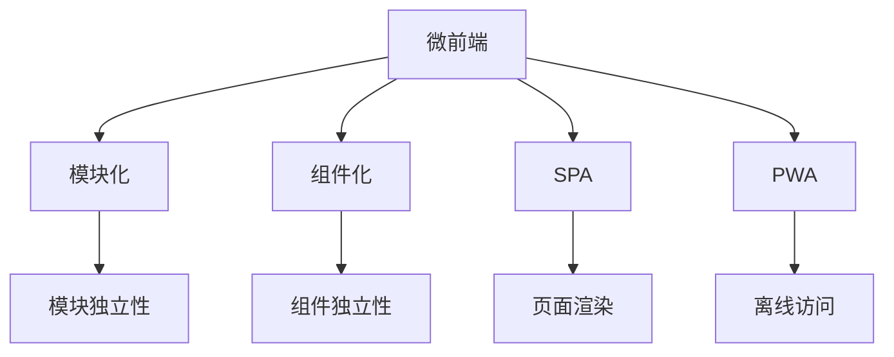

                 

# 微前端架构：大型Web应用的模块化方案

> 关键词：微前端, 模块化, Web应用, 大型Web应用, 组件化, SPA, 渐进式Web应用

## 1. 背景介绍

随着Web应用的复杂性不断增加，传统的单页面应用(Single Page Application, SPA)逐渐显现出诸多问题，如页面渲染慢、加载时间长、开发效率低下等。如何在保持应用性能的同时，提升开发效率，成为当前Web开发的重要课题。微前端(Micro Frontend)架构应运而生，成为解决这些问题的有效方案。

### 1.1 问题由来

在现代Web开发中，SPA已经成为了主流模式，开发者通过构建一个包含所有依赖的巨应用来满足各种业务需求。但SPA的单一代码库结构，导致了以下问题：

1. **页面渲染慢**：因为要加载大量静态资源，SPA的初次加载速度较慢，用户体验不佳。
2. **更新频繁**：当需要更新某些功能时，需要重新编译整个应用，增加了开发成本和迭代周期。
3. **开发效率低下**：多个组件的代码耦合严重，代码复用性差，导致团队协作效率低下。
4. **维护困难**：大规模应用难以维护，代码量大，问题定位困难。
5. **性能瓶颈**：应用在运行时的性能瓶颈难以定位，无法通过优化局部组件来提升整体性能。

针对这些问题，微前端架构提供了一种可行的解决方案，即通过将大型Web应用拆分成多个独立的、可复用的组件，每个组件独立部署和更新，从而提升开发效率和应用性能。

### 1.2 问题核心关键点

微前端架构的核心思想是将大型Web应用拆分为多个独立的功能模块，每个模块独立构建、部署和维护。这些模块可以是代码库、静态资源或第三方库，通过独立的域名或路径访问。其核心要点包括：

- **模块独立性**：每个模块独立构建，拥有自己的依赖和代码库。
- **松耦合性**：模块之间通过轻量级通信机制进行通信，减少代码耦合。
- **渐进式部署**：模块可以独立部署，新功能可以渐进式加入应用中。
- **前后端分离**：通过前后端分离，提升开发效率和运维稳定性。

微前端架构可以有效解决传统SPA模式下的问题，通过模块化、组件化和渐进式开发，提升Web应用的性能和可维护性。

## 2. 核心概念与联系

### 2.1 核心概念概述

为更好地理解微前端架构的原理和架构，本节将介绍几个密切相关的核心概念：

- **微前端(Micro Frontend)**：一种模块化Web开发模式，通过将大型Web应用拆分为多个独立的功能模块，每个模块独立构建、部署和维护。
- **SPA(Single Page Application)**：一种Web开发模式，整个应用在一个页面中渲染，通过路由切换实现不同功能的切换。
- **模块化(模块化开发)**：将大型应用拆分为多个小的、独立的功能模块，每个模块独立构建、维护。
- **组件化(组件化开发)**：将应用拆分为多个小的、可复用的UI组件，提升代码复用性和开发效率。
- **渐进式Web应用(PWA)**：通过前后端分离和微前端技术，使Web应用具备原生应用的特性，如离线访问、性能优化等。

这些核心概念之间的逻辑关系可以通过以下Mermaid流程图来展示：



这个流程图展示了几类Web开发模式及其之间的联系：

1. 微前端架构通过模块化拆分，形成多个独立模块，每个模块独立构建、部署。
2. 每个模块采用组件化开发，形成小的、可复用的UI组件。
3. 微前端和SPA模式都属于Web应用开发模式，但SPA是微前端的一种实现方式。
4. PWA是在微前端基础上，通过前后端分离和渐进式开发，提升Web应用的性能和用户体验。

这些概念共同构成了微前端架构的理论基础，使得开发者能够通过模块化、组件化等手段，提升Web应用的开发效率和性能。

## 3. 核心算法原理 & 具体操作步骤
### 3.1 算法原理概述

微前端架构的原理相对简单，但其操作流程涉及多个关键步骤。总体而言，微前端架构通过将大型Web应用拆分为多个独立的模块，每个模块独立构建、部署和维护，从而提升开发效率和应用性能。

### 3.2 算法步骤详解

微前端架构的具体实现步骤如下：

**Step 1: 需求分析和设计**

- 进行需求分析，确定应用的模块划分和组件设计。
- 根据业务需求，设计模块之间的接口和通信机制。
- 确定模块的加载策略，如懒加载、按需加载等。

**Step 2: 模块拆分和构建**

- 根据需求分析和设计，将应用拆分为多个独立的模块。
- 每个模块独立构建，包括编写代码、安装依赖等。
- 使用模块化的构建工具，如Webpack等，打包每个模块的资源，形成独立的模块包。

**Step 3: 部署和集成**

- 将打包好的模块包部署到相应的服务器上。
- 在应用中使用模块的路由和加载策略，加载和集成模块。
- 通过模块之间的通信机制，实现不同模块的功能互动。

**Step 4: 迭代和优化**

- 对每个模块进行独立迭代和优化。
- 优化模块的性能、代码复用性和开发效率。
- 不断完善模块之间的通信和交互机制，提升应用的整体性能。

### 3.3 算法优缺点

微前端架构具有以下优点：

- **提升开发效率**：通过模块化和组件化开发，每个模块独立构建和维护，提升了开发效率和代码复用性。
- **优化性能**：模块独立加载和部署，减少了应用的初次加载时间，提升了应用的运行性能。
- **降低维护难度**：模块独立拆分，降低了代码耦合性，便于维护和扩展。
- **增强可扩展性**：新功能可以渐进式加入，模块可以独立迭代和优化。

但微前端架构也存在一些缺点：

- **初始开发成本高**：需要额外设计模块拆分和通信机制，增加了开发成本。
- **复杂度高**：微前端架构相对复杂，需要掌握多套开发和部署工具。
- **性能优化难度大**：模块间的通信和数据交互可能带来性能瓶颈，需要优化。

### 3.4 算法应用领域

微前端架构主要应用于大型Web应用的开发和维护，其典型应用场景包括：

- **企业级应用**：如ERP、CRM等大型企业系统，通过微前端架构提升开发效率和应用性能。
- **电商平台**：如淘宝、京东等电商平台，通过微前端架构实现不同业务的独立部署和更新。
- **内容管理系统**：如CMS、博客平台等，通过微前端架构提升内容的发布和管理效率。
- **医疗系统**：如HIS、EMR等医疗系统，通过微前端架构提升系统的可维护性和用户体验。

## 4. 数学模型和公式 & 详细讲解 & 举例说明

### 4.1 数学模型构建

在微前端架构中，数学模型的构建主要涉及模块之间的通信机制和数据交互模型。以下将通过一个简单的案例来说明微前端架构中模块通信的数学模型。

假设我们有A、B两个模块，A模块包含数据模块data.js和视图模块view.js，B模块包含数据模块data2.js和视图模块view2.js。A和B模块需要共享数据，我们通过数据代理对象来实现数据共享。

**通信模型**：
- A模块的数据代理对象d1和B模块的数据代理对象d2共享同一个数据源data.js。
- A模块的视图代理对象v1和B模块的视图代理对象v2共享同一个视图数据。

**数据共享模型**：
- 当A模块的数据代理对象d1更新数据时，B模块的数据代理对象d2也会相应更新。
- 当B模块的数据代理对象d2更新数据时，A模块的数据代理对象d1也会相应更新。

通过上述模型，我们可以实现两个模块之间的数据共享，提升模块之间的协作效率。

### 4.2 公式推导过程

**数据共享公式推导**：
- 设A模块的数据代理对象为d1，B模块的数据代理对象为d2，共享数据为data.js。
- d1对data.js的更新操作为updateData(d)，d2对data.js的更新操作为updateData2(d)。
- 更新公式为：
  $$
  d2.data = updateData2(d1.data)
  $$
  其中d1.data表示A模块的数据，d2.data表示B模块的数据。

**视图共享公式推导**：
- 设A模块的视图代理对象为v1，B模块的视图代理对象为v2，共享视图数据为view.js。
- v1的视图更新操作为updateView(v)，v2的视图更新操作为updateView2(v)。
- 更新公式为：
  $$
  v2.view = updateView2(v1.view)
  $$
  其中v1.view表示A模块的视图数据，v2.view表示B模块的视图数据。

### 4.3 案例分析与讲解

以一个典型的微前端应用为例，说明如何使用微前端架构实现数据和视图的共享。

假设我们有一个博客平台，分为前台和后台两个模块，前台负责展示博客内容，后台负责博客管理。前台模块包含数据模块data.js和视图模块view.js，后台模块包含数据模块data2.js和视图模块view2.js。

**数据共享案例**：
- 后台模块新增一篇博客，触发数据代理对象d2对data2.js的更新。
- 数据代理对象d2通过网络请求将更新后的数据传递给前台模块的数据代理对象d1。
- 数据代理对象d1将更新后的数据写入data.js中。
- 前台模块的视图代理对象v1读取data.js中的数据，并更新视图数据。

**视图共享案例**：
- 前台模块展示一篇博客，触发视图代理对象v1对view.js的更新。
- 视图代理对象v1通过网络请求将更新后的视图数据传递给后台模块的视图代理对象v2。
- 视图代理对象v2将更新后的视图数据写入view2.js中。
- 后台模块的视图代理对象v2将视图数据展示给管理员。

通过上述案例，可以看到微前端架构通过模块化和组件化设计，有效提升了应用的可维护性和性能。

## 5. 项目实践：代码实例和详细解释说明
### 5.1 开发环境搭建

在进行微前端架构的开发实践前，我们需要准备好开发环境。以下是使用Webpack和React进行微前端架构开发的流程：

1. 安装Node.js和npm。
2. 安装Webpack和React。
3. 创建项目目录，初始化npm包管理工具。
4. 创建主入口文件index.html。
5. 创建各模块的入口文件，并配置Webpack的配置文件。

### 5.2 源代码详细实现

这里我们以一个简单的博客平台为例，说明如何使用React和Webpack实现微前端架构。

假设我们的博客平台分为前台和后台两个模块，前台模块包含博客展示和评论功能，后台模块包含博客管理和评论管理功能。

**主入口文件index.html**：
```html
<!DOCTYPE html>
<html>
  <head>
    <meta charset="UTF-8">
    <title>微前端架构示例</title>
  </head>
  <body>
    <app></app>
    <script src="index.js"></script>
  </body>
</html>
```

**React组件实现**：
- 创建博客展示组件BlogPage：
```javascript
import React, { useState, useEffect } from 'react';

function BlogPage() {
  const [blogs, setBlogs] = useState([]);

  useEffect(() => {
    fetch('https://api.example.com/blog')
      .then(response => response.json())
      .then(data => setBlogs(data))
      .catch(error => console.error(error));
  }, []);

  return (
    <div>
      <h1>博客列表</h1>
      <ul>
        {blogs.map((blog, index) => (
          <li key={index}>{blog.title}</li>
        ))}
      </ul>
    </div>
  );
}

export default BlogPage;
```

- 创建评论组件Comment：
```javascript
import React, { useState } from 'react';

function Comment({ blog }) {
  const [content, setContent] = useState('');
  const [newComment, setNewComment] = useState('');

  const handleSubmit = (e) => {
    e.preventDefault();
    fetch('https://api.example.com/comment', {
      method: 'POST',
      headers: {
        'Content-Type': 'application/json'
      },
      body: JSON.stringify({ content, blogId: blog.id })
    })
    .then(response => response.json())
    .then(data => setNewComment(data.message))
    .catch(error => console.error(error));
  };

  return (
    <div>
      <h2>评论 {blog.title}</h2>
      <form onSubmit={handleSubmit}>
        <input type="text" value={content} onChange={e => setContent(e.target.value)} />
        <button type="submit">提交评论</button>
      </form>
      <div>{newComment}</div>
    </div>
  );
}

export default Comment;
```

**Webpack配置文件webpack.config.js**：
```javascript
const path = require('path');
const React = require('react');
const ReactDOMServer = require('react-dom/server');
const Webpack = require('webpack');
const express = require('express');
const fs = require('fs');
const { createBrowserBundle } = require('webpack-express');

const webpack = new Webpack.Webpack({
  entry: './src/index.js',
  output: {
    path: path.resolve(__dirname, 'dist'),
    filename: 'index.js',
    publicPath: '/',
  },
  module: {
    rules: [
      {
        test: /\.js$/,
        exclude: /node_modules/,
        use: {
          loader: 'babel-loader',
        },
      },
    ],
  },
});

const app = express();
const server = createBrowserBundle(webpack, app);

app.get('/', (req, res) => {
  const bundle = fs.readFileSync('dist/bundle.js');
  res.send(bundle);
});

app.get('/blog', (req, res) => {
  const bundle = fs.readFileSync('dist/blog.js');
  res.send(bundle);
});

app.get('/comment', (req, res) => {
  const bundle = fs.readFileSync('dist/comment.js');
  res.send(bundle);
});

app.listen(3000, () => {
  console.log('Server is running on port 3000');
});
```

### 5.3 代码解读与分析

让我们详细解读一下关键代码的实现细节：

**React组件**：
- **BlogPage**组件：使用useState和useEffect钩子进行状态管理，通过fetch获取博客数据，并渲染博客列表。
- **Comment**组件：使用useState钩子进行表单状态管理，通过fetch将评论提交到后端API，并渲染评论内容。

**Webpack配置文件**：
- **entry**字段：指定入口文件，这里我们使用了Webpack提供的createBrowserBundle函数。
- **output**字段：指定输出路径和文件名。
- **module**字段：定义代码转译规则，这里使用Babel转译ES6+代码。
- **app.get**函数：定义静态资源文件的路由。

通过上述代码，可以看到微前端架构的实现流程：

1. 使用Webpack打包各模块的代码和资源，形成独立的模块包。
2. 通过服务器配置，将各模块的入口文件暴露给前端。
3. 在前端中动态加载各模块，实现模块的独立渲染和加载。

## 6. 实际应用场景
### 6.1 企业级应用

微前端架构在企业级应用中具有广阔的应用前景。以一个大型企业ERP系统为例，该系统包含多个模块，如订单管理、财务管理、人力资源管理等。

**模块拆分**：
- 将ERP系统拆分为订单模块、财务模块、人力模块等。
- 每个模块独立构建和维护，使用微前端架构进行开发。

**组件化**：
- 每个模块采用组件化开发，形成小的、可复用的UI组件。
- 通过组件化的方式，提升代码复用性和开发效率。

**渐进式部署**：
- 新功能可以渐进式加入，模块可以独立迭代和优化。
- 通过微前端架构，确保应用在不断更新的同时，不影响现有功能的运行。

### 6.2 电商平台

微前端架构在电商平台中同样具有应用价值。以淘宝平台为例，该平台包含商品展示、用户管理、订单管理等多个模块。

**模块拆分**：
- 将淘宝平台拆分为商品模块、用户模块、订单模块等。
- 每个模块独立构建和维护，使用微前端架构进行开发。

**组件化**：
- 每个模块采用组件化开发，形成小的、可复用的UI组件。
- 通过组件化的方式，提升代码复用性和开发效率。

**渐进式部署**：
- 新功能可以渐进式加入，模块可以独立迭代和优化。
- 通过微前端架构，确保应用在不断更新的同时，不影响现有功能的运行。

### 6.3 内容管理系统

微前端架构在内容管理系统(CMS)中也有广泛应用。以WordPress平台为例，该平台包含文章管理、评论管理、用户管理等多个模块。

**模块拆分**：
- 将WordPress平台拆分为文章模块、评论模块、用户模块等。
- 每个模块独立构建和维护，使用微前端架构进行开发。

**组件化**：
- 每个模块采用组件化开发，形成小的、可复用的UI组件。
- 通过组件化的方式，提升代码复用性和开发效率。

**渐进式部署**：
- 新功能可以渐进式加入，模块可以独立迭代和优化。
- 通过微前端架构，确保应用在不断更新的同时，不影响现有功能的运行。

### 6.4 未来应用展望

随着微前端架构的不断发展，其在Web应用的各个领域都将得到广泛应用。未来，微前端架构的应用场景将包括：

- **大型企业系统**：如ERP、CRM等大型企业系统，通过微前端架构提升开发效率和应用性能。
- **电商平台**：如淘宝、京东等电商平台，通过微前端架构实现不同业务的独立部署和更新。
- **内容管理系统**：如CMS、博客平台等，通过微前端架构提升内容的发布和管理效率。
- **医疗系统**：如HIS、EMR等医疗系统，通过微前端架构提升系统的可维护性和用户体验。

微前端架构的不断演进，将带来Web应用开发模式的深刻变革，为应用性能和开发效率带来质的提升。

## 7. 工具和资源推荐
### 7.1 学习资源推荐

为了帮助开发者系统掌握微前端架构的理论基础和实践技巧，这里推荐一些优质的学习资源：

1. **《微前端架构实战》**：讲解微前端架构的核心原理和实现方法，提供详细的代码实例和最佳实践。
2. **《Webpack官方文档》**：提供Webpack的详细使用指南和API文档，是微前端架构开发的基础。
3. **《React官方文档》**：提供React的详细使用指南和API文档，是微前端架构开发的核心。
4. **《Webpack入门教程》**：讲解Webpack的基础概念和使用方法，适合微前端架构的入门学习。
5. **《微前端架构设计模式》**：讲解微前端架构的设计模式和应用场景，提供丰富的案例和示例。

通过对这些资源的学习实践，相信你一定能够快速掌握微前端架构的精髓，并用于解决实际的Web开发问题。

### 7.2 开发工具推荐

高效的开发离不开优秀的工具支持。以下是几款用于微前端架构开发的常用工具：

1. **Webpack**：模块化构建工具，支持多模块打包和静态资源管理。
2. **React**：UI组件化开发框架，支持组件化开发和前后端分离。
3. **Babel**：代码转译工具，支持ES6+代码转译和模块化构建。
4. **Webpack-Dev-Server**：开发时使用的本地服务器，支持热加载和实时重构。
5. **Webpack-express**：Webpack和Node.js集成，支持静态资源管理和微前端架构部署。

合理利用这些工具，可以显著提升微前端架构的开发效率和应用性能，加快创新迭代的步伐。

### 7.3 相关论文推荐

微前端架构的发展源于学界的持续研究。以下是几篇奠基性的相关论文，推荐阅读：

1. **《Micro Frontends: The Architectural Strategy for Incremental Responsive Web Applications》**：提出微前端架构的基本概念和实现方法，是微前端架构的奠基性论文。
2. **《The Good, Bad, and the Ugly of Micro Frontends》**：深入探讨微前端架构的优点和缺点，提出改进建议。
3. **《React Micro-Frontend Architecture with Next.js》**：介绍微前端架构在React和Next.js中的应用，提供详细的代码示例。
4. **《Micro-Frontend Architecture with Webpack and React》**：讲解Webpack和React在微前端架构中的具体应用，提供全面的技术指南。

这些论文代表了大前端架构的研究进展，为微前端架构的发展提供了理论支撑。

## 8. 总结：未来发展趋势与挑战

### 8.1 总结

本文对微前端架构进行了全面系统的介绍。首先阐述了微前端架构的背景和意义，明确了微前端架构在提升Web应用性能和开发效率方面的独特价值。其次，从原理到实践，详细讲解了微前端架构的数学模型和关键步骤，给出了微前端架构项目开发的完整代码实例。同时，本文还广泛探讨了微前端架构在企业级应用、电商平台、内容管理系统等各个领域的应用前景，展示了微前端架构的巨大潜力。

通过本文的系统梳理，可以看到，微前端架构通过模块化、组件化等手段，提升了Web应用的开发效率和性能。未来，伴随微前端架构的不断演进，将有更多的Web应用从中受益。

### 8.2 未来发展趋势

展望未来，微前端架构将呈现以下几个发展趋势：

1. **模块化拆分更加细粒度**：未来的微前端架构将更加细粒度地拆分应用模块，形成更小的、更独立的模块。
2. **组件化开发更加丰富**：组件化的开发方式将更加丰富，支持更多的UI组件和模块复用。
3. **前后端分离更加彻底**：前后端分离的开发模式将更加彻底，通过微前端架构实现前端和后端的独立部署和更新。
4. **渐进式部署更加灵活**：新功能的部署更加灵活，通过微前端架构实现渐进式部署。
5. **微前端技术更加成熟**：微前端架构的技术将更加成熟，工具和库的生态系统将更加完善。

以上趋势凸显了微前端架构的发展潜力，必将带来Web应用开发模式的深刻变革，为应用性能和开发效率带来质的提升。

### 8.3 面临的挑战

尽管微前端架构已经取得了一定的进展，但在迈向更加智能化、普适化应用的过程中，它仍面临着诸多挑战：

1. **开发成本高**：微前端架构需要额外设计和实现模块拆分和通信机制，增加了开发成本。
2. **复杂度高**：微前端架构相对复杂，需要掌握多套开发和部署工具。
3. **性能优化难度大**：模块间的通信和数据交互可能带来性能瓶颈，需要优化。
4. **协同开发难度大**：多个微前端模块之间的协同开发难度大，代码调试和版本控制复杂。

### 8.4 研究展望

面对微前端架构所面临的挑战，未来的研究需要在以下几个方面寻求新的突破：

1. **优化模块通信机制**：通过引入更加高效的通信机制，如WebSocket、消息队列等，提升模块之间的通信效率。
2. **提升开发效率**：通过工具和库的优化，降低微前端架构的开发成本和复杂度。
3. **优化性能**：通过代码分割、懒加载等技术，优化微前端架构的性能和加载速度。
4. **支持更多框架**：将微前端架构推广到更多的开发框架和工具中，实现全栈支持。

这些研究方向的探索，必将引领微前端架构技术迈向更高的台阶，为Web应用开发模式带来革命性变革。面向未来，微前端架构还需要与其他技术进行更深入的融合，如DevOps、CI/CD等，多路径协同发力，共同推动Web应用的持续演进。总之，微前端架构的未来发展前景广阔，必将带来Web应用开发模式的深刻变革，为应用性能和开发效率带来质的提升。

## 9. 附录：常见问题与解答

**Q1：微前端架构与单页面应用(SPA)的区别是什么？**

A: 微前端架构与单页面应用(SPA)都是Web应用的开发模式，但两者的区别在于拆分粒度和独立性。SPA将整个应用放在一个页面中渲染，所有模块共享一个入口和资源，而微前端架构将应用拆分为多个独立的模块，每个模块独立构建、部署和维护。微前端架构通过模块化和组件化，提升了应用的开发效率和性能。

**Q2：微前端架构如何实现模块之间的通信？**

A: 微前端架构通过数据代理和视图代理对象实现模块之间的通信。数据代理对象负责模块间的数据传递，视图代理对象负责模块间的视图更新。具体实现时，可以使用WebSocket、消息队列等机制，实现模块之间的双向通信。

**Q3：微前端架构的性能瓶颈有哪些？**

A: 微前端架构的性能瓶颈主要在于模块之间的通信和数据交互。模块间的通信和数据传递可能带来一定的性能开销，需要进行优化。优化的方法包括使用WebSocket、消息队列等高效通信机制，使用代码分割、懒加载等技术，优化模块加载和渲染性能。

**Q4：微前端架构如何实现前后端分离？**

A: 微前端架构通过前后端分离，实现前端和后端的独立构建和部署。具体实现时，前端和后端分别使用不同的技术栈和工具，通过API接口进行数据交互。微前端架构的实现工具包括Webpack、React、Vue等，可以灵活选择适合的技术栈。

**Q5：微前端架构的开发成本高吗？**

A: 微前端架构的开发成本相对较高，需要额外设计和实现模块拆分和通信机制。但通过模块化和组件化，提升了开发效率和代码复用性，长期来看可以显著降低开发成本。同时，通过微前端架构的优化和改进，可以不断降低开发成本，提升开发效率。

---

作者：禅与计算机程序设计艺术 / Zen and the Art of Computer Programming

