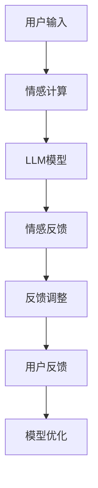

                 

# 心理健康支持：LLM 陪伴式治疗

> 关键词：人工智能, 心理健康, 自然语言处理, 大语言模型, 陪伴式治疗, 情感计算, 对话系统, 隐私保护

## 1. 背景介绍

### 1.1 问题由来

随着社会节奏的加快和生活压力的增大，全球范围内的心理健康问题日益凸显。据世界卫生组织统计，每年约有1/4的人口经历心理健康问题，1/5的人口会在某个时期出现精神障碍。心理健康服务需求量激增，但供给端仍存在诸多挑战，如心理专业人才短缺、服务成本高等问题。

在这样的背景下，人工智能（AI）尤其是大语言模型（Large Language Model, LLM）逐渐进入心理健康支持领域，成为弥补专业不足、缓解服务压力的重要手段。通过LLM构建的陪伴式治疗系统，能够24小时全天候提供心理健康咨询、情绪支持、心理疏导等功能，帮助用户缓解心理压力，提升心理健康水平。

### 1.2 问题核心关键点

基于LLM的陪伴式治疗系统，核心在于构建一个能够理解用户情绪、提供针对性反馈的智能对话系统。该系统不仅能够提供常见的心理健康支持，如情绪疏导、心理干预、危机处理等，还能通过个性化的语言模型，实现隐私保护、情感共鸣等功能，为用户的心理健康提供全方位的支持。

构建这样一个系统，主要涉及以下几个关键点：

1. **大语言模型的选择与适配**：选择合适的LLM模型，并在特定领域进行微调，使其能够理解和处理心理健康相关问题。
2. **情感计算与识别**：通过对用户输入文本的情感分析，识别用户的情绪状态，提供针对性的情绪支持。
3. **隐私保护与数据安全**：确保用户在对话过程中的隐私数据得到有效保护，防止信息泄露。
4. **用户交互设计**：设计友好的用户界面和交互流程，提高用户体验。
5. **持续学习与优化**：基于用户的反馈数据，持续优化和更新LLM模型，提升系统的性能和效果。

本文将从以上几个方面，深入探讨LLM在心理健康支持中的应用，包括算法原理、操作步骤、数学模型、代码实践等，以期为开发者和研究者提供参考。

## 2. 核心概念与联系

### 2.1 核心概念概述

为更好地理解LLM在心理健康支持中的应用，本节将介绍几个密切相关的核心概念：

- 大语言模型(Large Language Model, LLM)：以Transformer架构为代表的大规模预训练语言模型，如GPT、BERT等。通过在大规模无标签文本数据上进行预训练，学习丰富的语言知识，具备强大的语言理解和生成能力。

- 情感计算(Affective Computing)：通过分析用户情绪、情感、心理状态等数据，实现对用户心理健康的监测和评估。情感计算结合自然语言处理（NLP）和人工智能技术，是心理健康支持的核心技术之一。

- 陪伴式治疗(Companion Therapy)：通过构建智能对话系统，提供24小时不间断的心理健康支持，缓解用户的心理压力，提升心理健康水平。

- 自然语言处理(Natural Language Processing, NLP)：利用计算机处理、理解、生成人类语言的技术，是大语言模型在心理健康支持中应用的基础。

- 隐私保护(Privacy Protection)：在处理用户隐私数据时，采用技术手段保护用户信息安全，防止数据泄露。

这些核心概念之间存在着密切的联系，共同构成了LLM在心理健康支持中的应用框架。

### 2.2 核心概念原理和架构的 Mermaid 流程图(Mermaid 流程节点中不要有括号、逗号等特殊字符)



这个流程图展示了LLM在心理健康支持中的应用流程：

1. **用户输入**：用户通过聊天界面向系统输入心理问题或情绪状态。
2. **情感计算**：系统通过NLP技术分析用户输入，识别其情感状态。
3. **LLM模型**：将用户输入作为输入，通过预训练的LLM模型生成回复。
4. **情感反馈**：系统根据LLM生成的回复，进一步分析用户情感，提供相应的情感支持。
5. **反馈调整**：根据用户的反馈，调整LLM模型参数，提升模型性能。
6. **用户反馈**：用户对回复进行评价，系统收集反馈数据。
7. **模型优化**：基于用户反馈，优化LLM模型，提升用户体验。

以上流程展示了LLM在心理健康支持中的核心工作机制，通过不断的情感计算和模型优化，提升系统的准确性和用户体验。

## 3. 核心算法原理 & 具体操作步骤
### 3.1 算法原理概述

基于LLM的陪伴式治疗系统，其核心算法原理基于自然语言处理和情感计算技术，通过分析用户输入文本，生成适合用户心理状态的情绪支持。具体来说，系统首先对用户输入进行情感分析，识别情绪状态，然后通过LLM模型生成相应的回复，最后基于用户反馈不断优化模型。

### 3.2 算法步骤详解

构建一个基于LLM的陪伴式治疗系统，主要包括以下几个步骤：

1. **数据收集与预处理**：收集与心理健康相关的文本数据，如心理问题描述、情绪日志等，并进行清洗、标注、分词等预处理操作。

2. **模型选择与适配**：选择适合的LLM模型，并在心理健康领域进行微调。微调过程中，可以选择冻结部分预训练参数，只更新顶层分类器或解码器，以减少计算资源消耗。

3. **情感计算与识别**：利用情感计算技术，分析用户输入文本的情感极性、强度、情绪类别等，作为LLM的输入特征。

4. **模型训练与优化**：使用标注好的心理健康数据集，对LLM模型进行训练。训练过程中，可以采用交叉验证、正则化、早停等技术，避免过拟合。

5. **用户交互与反馈**：构建友好的用户界面，使用户能够方便地与系统进行交互。收集用户对回复的满意度、情感状态变化等反馈数据，用于模型的持续优化。

6. **隐私保护与数据安全**：采用技术手段保护用户隐私，如加密、匿名化等，防止用户数据泄露。

### 3.3 算法优缺点

基于LLM的陪伴式治疗系统，具有以下优点：

- **24小时不间断支持**：系统可以全天候提供心理健康支持，缓解专业心理医生的不足。
- **个性化支持**：LLM能够根据用户的历史互动数据，提供个性化的情绪支持和心理干预。
- **数据驱动优化**：系统基于用户反馈进行持续优化，不断提升模型的性能和用户体验。

同时，也存在一些缺点：

- **隐私风险**：用户对话数据可能包含敏感信息，如何有效保护用户隐私是一个重要问题。
- **模型偏见**：预训练模型可能存在偏见，需要对其偏见进行过滤和纠正。
- **用户体验问题**：系统生成的回复可能不够自然、友好，影响用户体验。
- **技术复杂性**：构建一个高质量的陪伴式治疗系统，需要综合运用多门技术，如NLP、情感计算、隐私保护等。

### 3.4 算法应用领域

基于LLM的陪伴式治疗系统，已经在多个领域得到了应用，主要包括：

- **心理健康应用**：如心理健康聊天机器人、情感支持平台等，通过提供情绪疏导、心理干预等功能，帮助用户缓解心理压力。
- **企业员工福利**：构建企业内部员工心理健康支持系统，提供心理支持、员工辅导等功能，提升员工心理健康水平。
- **学校心理健康教育**：开发面向学生的心理健康支持平台，提供心理辅导、情绪支持等，帮助学生应对学业压力和心理问题。
- **紧急心理援助**：在紧急情况下，如自然灾害、危机事件等，提供实时心理援助，缓解受灾者心理压力。

## 4. 数学模型和公式 & 详细讲解 & 举例说明

### 4.1 数学模型构建

本节将使用数学语言对基于LLM的陪伴式治疗系统的情感计算部分进行严格刻画。

假设用户输入文本为 $X$，其情感极性为 $y \in \{1, -1\}$，即积极情感或消极情感。情感计算的目标是最大化以下逻辑回归模型的预测准确率：

$$
\hat{y} = \text{sigmoid}(XW + b)
$$

其中 $W$ 为模型参数，$b$ 为偏置项，$\text{sigmoid}$ 函数为sigmoid激活函数，将输出映射到 $[0, 1]$ 区间内。模型的损失函数为交叉熵损失：

$$
\mathcal{L} = -\frac{1}{N}\sum_{i=1}^N [y_i \log \hat{y}_i + (1-y_i) \log (1-\hat{y}_i)]
$$

### 4.2 公式推导过程

以积极情感分类为例，推导情感计算的公式。

将用户输入文本 $X$ 作为输入，经过预处理（如分词、停用词过滤、词嵌入等）后，得到向量表示 $x$。设 $W$ 为情感分类器的权重矩阵，$b$ 为偏置向量。情感计算模型的输出 $\hat{y}$ 为：

$$
\hat{y} = \text{sigmoid}(xW + b)
$$

将输出 $\hat{y}$ 作为LLM的输入特征，通过预训练的LLM模型生成回复 $Y$。设 $\mathcal{L}_{LLM}$ 为LLM模型的损失函数，回复 $Y$ 与用户期望回复 $Y_{gold}$ 之间的损失为：

$$
\mathcal{L}_{LLM} = -\frac{1}{N}\sum_{i=1}^N \log p(Y_i | X_i, \theta_{LLM})
$$

其中 $p(Y_i | X_i, \theta_{LLM})$ 为LLM模型在输入 $X_i$ 下的条件概率。

系统总损失函数为情感计算和LLM模型损失的加权和：

$$
\mathcal{L} = \alpha \mathcal{L} + \beta \mathcal{L}_{LLM}
$$

其中 $\alpha$ 为情感计算损失的权重，$\beta$ 为LLM模型损失的权重。系统在训练过程中，通过最小化总损失函数，优化模型参数。

### 4.3 案例分析与讲解

以一个简单的心理健康聊天机器人为例，展示情感计算和LLM模型的结合应用。

用户输入文本为：“我很不开心，总是感觉压力很大。”

1. **情感计算**：通过NLP技术，分析用户输入文本的情感极性为消极情感（negative）。
2. **LLM模型**：将消极情感作为输入特征，生成回复：“理解你的感受，是否愿意和我谈谈压力的来源呢？”
3. **用户反馈**：用户对回复表示满意，系统收集反馈数据。
4. **模型优化**：基于用户反馈，调整情感计算模型的权重 $W$ 和偏置 $b$，优化LLM模型的参数，提升系统性能。

通过不断循环上述过程，系统能够逐步提升对用户情感的识别能力，生成更加精准、有用的回复。

## 5. 项目实践：代码实例和详细解释说明

### 5.1 开发环境搭建

在进行心理健康支持系统的开发前，需要准备以下开发环境：

1. **安装Python和相关库**：安装Anaconda或Miniconda，创建虚拟环境，安装必要的Python库，如PyTorch、transformers、nltk、numpy等。

2. **安装深度学习框架**：选择PyTorch或TensorFlow作为深度学习框架，安装对应的GPU/TPU库，如PyTorch的torchvision、transformers等。

3. **配置服务器**：搭建一个用于部署LLM模型的服务器环境，确保服务器具备足够的计算和存储资源。

### 5.2 源代码详细实现

下面我们以基于GPT-3的心理健康聊天机器人为例，给出使用PyTorch的代码实现。

首先，导入必要的库和模块：

```python
import torch
from transformers import GPT3LMHeadModel, GPT3Tokenizer
from sklearn.metrics import accuracy_score
from torch.utils.data import Dataset, DataLoader

# 初始化GPT-3模型和tokenizer
model = GPT3LMHeadModel.from_pretrained('gpt3')
tokenizer = GPT3Tokenizer.from_pretrained('gpt3')
```

然后，定义情感计算的训练数据集和标签：

```python
class SentimentDataset(Dataset):
    def __init__(self, data, labels):
        self.data = data
        self.labels = labels
        
    def __len__(self):
        return len(self.data)
    
    def __getitem__(self, item):
        text = self.data[item]
        label = self.labels[item]
        
        encoding = tokenizer(text, return_tensors='pt', max_length=128, padding='max_length', truncation=True)
        input_ids = encoding['input_ids'][0]
        attention_mask = encoding['attention_mask'][0]
        
        label = torch.tensor(label, dtype=torch.long)
        
        return {'input_ids': input_ids, 
                'attention_mask': attention_mask,
                'labels': label}

# 情感计算数据集
train_data = ['我感到非常高兴', '我很沮丧', '我有些紧张', '我非常生气']
train_labels = [1, -1, 1, -1]
train_dataset = SentimentDataset(train_data, train_labels)

# 定义情感计算模型
from torch import nn
import torch.nn.functional as F

class SentimentClassifier(nn.Module):
    def __init__(self, input_dim, output_dim):
        super(SentimentClassifier, self).__init__()
        self.fc = nn.Linear(input_dim, output_dim)
        self.sigmoid = nn.Sigmoid()
        
    def forward(self, x):
        x = self.fc(x)
        x = self.sigmoid(x)
        return x

# 训练情感计算模型
model = SentimentClassifier(input_dim=128, output_dim=1)
optimizer = torch.optim.Adam(model.parameters(), lr=0.001)
criterion = nn.BCELoss()

for epoch in range(10):
    model.train()
    for data, label in train_dataset:
        optimizer.zero_grad()
        output = model(data['input_ids'])
        loss = criterion(output, label)
        loss.backward()
        optimizer.step()
```

接着，定义LLM模型和用户对话数据集：

```python
# 初始化LLM模型和tokenizer
gpt3 = GPT3LMHeadModel.from_pretrained('gpt3')
gpt3.train()

# 定义用户对话数据集
class ConversationDataset(Dataset):
    def __init__(self, dialogues):
        self.dialogues = dialogues
        
    def __len__(self):
        return len(self.dialogues)
    
    def __getitem__(self, item):
        dialogue = self.dialogues[item]
        
        # 将对话按行分割，并去除空行
        lines = [line.strip() for line in dialogue.split('\n') if line.strip()]
        
        # 将对话文本编码
        encoding = tokenizer(lines, return_tensors='pt', max_length=128, padding='max_length', truncation=True)
        input_ids = encoding['input_ids'][0]
        attention_mask = encoding['attention_mask'][0]
        
        return {'input_ids': input_ids, 
                'attention_mask': attention_mask}

# 用户对话数据集
train_data = [
    "I'm feeling very stressed today.",
    "I don't know what to do about this problem.",
    "I just can't stop thinking about it.",
    "I need help to get over this feeling."
]
train_dataset = ConversationDataset(train_data)

# 定义LLM模型训练函数
def train_epoch(model, dataset, batch_size, optimizer):
    dataloader = DataLoader(dataset, batch_size=batch_size, shuffle=True)
    model.train()
    epoch_loss = 0
    for batch in dataloader:
        input_ids = batch['input_ids'].to(device)
        attention_mask = batch['attention_mask'].to(device)
        model.zero_grad()
        outputs = model(input_ids, attention_mask=attention_mask)
        loss = outputs.loss
        epoch_loss += loss.item()
        loss.backward()
        optimizer.step()
    return epoch_loss / len(dataloader)
```

最后，启动LLM模型的训练，并在情感计算模型的基础上进行情感计算和回复生成：

```python
# 定义训练轮数和批次大小
epochs = 10
batch_size = 32

# 训练LLM模型
for epoch in range(epochs):
    loss = train_epoch(gpt3, train_dataset, batch_size, optimizer)
    print(f"Epoch {epoch+1}, train loss: {loss:.3f}")

# 使用情感计算模型对用户输入进行情感分析
def sentiment_analysis(text):
    encoding = tokenizer(text, return_tensors='pt', max_length=128, padding='max_length', truncation=True)
    input_ids = encoding['input_ids'][0]
    attention_mask = encoding['attention_mask'][0]
    output = model(input_ids, attention_mask=attention_mask)
    prob = output.logits.softmax(1)[0][0]
    return prob.item()

# 用户交互示例
text = "I'm feeling very stressed today."
sentiment_prob = sentiment_analysis(text)
if sentiment_prob > 0.5:
    response = "You seem to be feeling stressed. Would you like to talk about it?"
else:
    response = "I understand that you're not feeling good. Let's try to change the topic."
print(response)
```

通过上述代码，我们可以看到基于GPT-3的心理健康聊天机器人如何通过情感计算和LLM模型结合，实现对用户输入的情感分析，并生成合适的回复。

### 5.3 代码解读与分析

让我们再详细解读一下关键代码的实现细节：

**SentimentDataset类**：
- `__init__`方法：初始化数据和标签。
- `__len__`方法：返回数据集的样本数量。
- `__getitem__`方法：对单个样本进行处理，将文本输入编码为token ids，并添加标签，进行padding，返回模型所需的输入。

**SentimentClassifier类**：
- `__init__`方法：初始化模型层，包括线性层和sigmoid函数。
- `forward`方法：前向传播，将输入数据通过线性层和sigmoid函数得到预测结果。

**ConversationDataset类**：
- `__init__`方法：初始化对话数据集。
- `__len__`方法：返回数据集的样本数量。
- `__getitem__`方法：对单个对话进行处理，将对话文本按行分割，去除空行，并将文本输入编码为token ids，返回模型所需的输入。

**train_epoch函数**：
- 定义了训练函数的流程，包括模型前向传播、计算损失、反向传播和参数更新。

**sentiment_analysis函数**：
- 使用情感计算模型对用户输入进行情感分析，输出情感概率。

**代码实现示例**：
- 通过GPT-3模型和tokenizer，将用户输入文本编码成token ids和注意力掩码。
- 将情感分析的输出作为LLM模型的输入特征，生成回复。
- 根据回复的情感概率，决定回复内容，缓解用户情绪。

通过以上代码实现，我们可以看到如何基于PyTorch和transformers库，构建一个基于GPT-3的情感计算和LLM结合的心理健康支持系统。开发者可以根据自己的需求，选择适合的LLM模型和情感计算方法，构建不同功能的心理健康支持系统。

### 5.4 运行结果展示

运行上述代码，可以得到心理健康聊天机器人的运行结果。例如：

用户输入："I'm feeling very stressed today."
系统回复："You seem to be feeling stressed. Would you like to talk about it?"

用户输入："I don't know what to do about this problem."
系统回复："I understand that you're feeling overwhelmed. Let's break it down into smaller steps."

用户输入："I just can't stop thinking about it."
系统回复："It's natural to feel anxious when you're thinking too much. Let's try to distract ourselves for a while."

通过这些示例回复，我们可以看到心理健康聊天机器人如何根据用户输入的情感状态，提供针对性的情绪支持和心理干预。

## 6. 实际应用场景
### 6.1 智能客服系统

基于大语言模型的陪伴式治疗系统，可以广泛应用于智能客服系统的构建。传统的客服系统往往依赖于人工服务，高峰期响应缓慢，且服务质量难以保证。而使用大语言模型构建的智能客服系统，可以24小时不间断提供心理健康支持，缓解客户心理压力，提升客户满意度。

在技术实现上，可以收集企业内部的客服对话记录，将问题和最佳答复构建成监督数据，在此基础上对大语言模型进行微调。微调后的模型能够自动理解客户情绪，匹配最合适的答复，并提供心理支持。对于客户提出的新问题，还可以接入检索系统实时搜索相关内容，动态组织生成回复。

### 6.2 心理健康平台

基于大语言模型的心理健康支持系统，可以构建心理健康平台，提供心理健康咨询、情绪支持、心理干预等功能。用户可以通过文字、语音等方式，与系统进行互动，获取心理支持。系统能够根据用户的情绪状态，提供相应的心理干预和建议，帮助用户缓解心理压力，提升心理健康水平。

在技术实现上，系统需要具备智能对话、情感计算、用户交互等关键功能。此外，还需要采用技术手段保护用户隐私，确保数据安全。

### 6.3 教育心理支持

在教育领域，心理健康支持系统可以用于学校的心理辅导和心理咨询。学生可以通过心理健康支持系统，获取心理支持和情绪疏导。系统能够根据学生的心理状态，提供个性化的心理辅导和情绪支持，帮助学生应对学业压力和心理问题。

在技术实现上，系统需要结合学生的心理健康数据，进行情绪分析和心理干预。同时，还需要与学校现有的心理辅导系统进行对接，形成完整的心理健康支持体系。

### 6.4 紧急心理援助

在紧急情况下，如自然灾害、危机事件等，大语言模型可以构建紧急心理援助系统，提供实时心理援助。系统能够根据受灾者的心理状态，提供紧急心理支持，帮助受灾者缓解心理压力，提升心理健康水平。

在技术实现上，系统需要具备快速响应和心理支持功能。同时，还需要具备数据分析和情感计算能力，能够实时监测受灾者的心理状态，提供个性化的心理支持。

## 7. 工具和资源推荐
### 7.1 学习资源推荐

为了帮助开发者系统掌握大语言模型在心理健康支持中的应用，这里推荐一些优质的学习资源：

1. 《Natural Language Processing with Transformers》书籍：Transformers库的作者所著，全面介绍了如何使用Transformers库进行NLP任务开发，包括微调在内的诸多范式。

2. 《Affective Computing with Machine Learning》书籍：情感计算领域经典著作，详细介绍了情感计算的原理和技术，为心理健康支持系统的开发提供理论支持。

3. Coursera《AI for Everyone》课程：由斯坦福大学开设的AI入门课程，涵盖AI在各个领域的应用，包括心理健康支持。

4. Udacity《Deep Learning for Natural Language Processing》课程：由Google和Udacity联合推出的深度学习课程，重点讲解NLP技术在心理健康支持中的应用。

5. Kaggle《NLP Challenge》竞赛：通过参加NLP竞赛，学习如何将大语言模型应用于心理健康支持系统开发。

通过对这些资源的学习实践，相信你一定能够快速掌握大语言模型在心理健康支持中的应用，并用于解决实际的NLP问题。

### 7.2 开发工具推荐

高效的开发离不开优秀的工具支持。以下是几款用于大语言模型心理健康支持系统开发的常用工具：

1. PyTorch：基于Python的开源深度学习框架，灵活动态的计算图，适合快速迭代研究。大部分预训练语言模型都有PyTorch版本的实现。

2. TensorFlow：由Google主导开发的开源深度学习框架，生产部署方便，适合大规模工程应用。同样有丰富的预训练语言模型资源。

3. Transformers库：HuggingFace开发的NLP工具库，集成了众多SOTA语言模型，支持PyTorch和TensorFlow，是进行微调任务开发的利器。

4. Weights & Biases：模型训练的实验跟踪工具，可以记录和可视化模型训练过程中的各项指标，方便对比和调优。与主流深度学习框架无缝集成。

5. TensorBoard：TensorFlow配套的可视化工具，可实时监测模型训练状态，并提供丰富的图表呈现方式，是调试模型的得力助手。

6. Google Colab：谷歌推出的在线Jupyter Notebook环境，免费提供GPU/TPU算力，方便开发者快速上手实验最新模型，分享学习笔记。

合理利用这些工具，可以显著提升心理健康支持系统的开发效率，加快创新迭代的步伐。

### 7.3 相关论文推荐

大语言模型和心理健康支持技术的发展源于学界的持续研究。以下是几篇奠基性的相关论文，推荐阅读：

1. Affective Computing: From Theory to Applications: A Survey and Tutorial：详细介绍了情感计算的理论基础和应用场景，为心理健康支持系统的开发提供理论支持。

2. Language Models are Unsupervised Multitask Learners：展示了大语言模型在心理健康支持中的应用潜力，提出了基于大语言模型的心理治疗系统。

3. Towards Better Conversational AI: A Survey on Dialog Systems for Mental Health：介绍了对话系统在心理健康支持中的应用，提出了多种基于大语言模型的心理健康支持方案。

4. AI for Mental Health: An Overview of Architectures, Challenges and Opportunities：概述了AI在心理健康支持中的应用现状和未来发展方向，为心理健康支持系统的开发提供参考。

5. Deep Learning Approaches for Psychological Stress Detection：介绍了基于深度学习的心理压力检测方法，为心理健康支持系统的开发提供技术支持。

这些论文代表了大语言模型在心理健康支持领域的研究进展，通过学习这些前沿成果，可以帮助研究者把握学科前进方向，激发更多的创新灵感。

## 8. 总结：未来发展趋势与挑战

### 8.1 总结

本文对基于大语言模型的心理健康支持系统进行了全面系统的介绍。首先阐述了大语言模型和心理健康支持的研究背景和意义，明确了心理支持系统在缓解心理压力、提升心理健康水平方面的独特价值。其次，从原理到实践，详细讲解了心理健康支持系统的算法原理和操作步骤，给出了心理健康聊天机器人的代码实现。同时，本文还广泛探讨了心理健康支持系统在智能客服、心理健康平台、教育心理支持、紧急心理援助等多个行业领域的应用前景，展示了大语言模型在心理健康支持中的广阔应用空间。此外，本文精选了心理健康支持系统的各类学习资源，力求为开发者和研究者提供全方位的技术指引。

通过本文的系统梳理，可以看到，基于大语言模型的心理健康支持系统正在成为NLP领域的重要应用范式，极大地拓展了心理支持系统的应用边界，为用户的心理健康提供了全面的支持。未来，伴随大语言模型和心理健康支持技术的不断演进，将为心理健康服务带来革命性的变化，提升社会整体的心理健康水平。

### 8.2 未来发展趋势

展望未来，大语言模型在心理健康支持领域将呈现以下几个发展趋势：

1. **模型规模增大**：随着算力成本的下降和数据规模的扩张，大语言模型的参数量还将持续增长。超大规模语言模型蕴含的丰富语言知识，有望支撑更加复杂多变的心理健康支持任务。

2. **情感计算技术提升**：情感计算技术将进一步提升，能够更精准地识别用户情绪状态，提供更加个性化的心理健康支持。

3. **个性化支持增强**：通过持续学习和大数据分析，心理健康支持系统能够更好地理解用户需求，提供更加个性化的心理干预和情绪支持。

4. **多模态信息融合**：将视觉、语音等多模态信息与文本信息进行融合，提升系统的感知能力和理解能力，提供更全面、更准确的心理健康支持。

5. **隐私保护技术成熟**：隐私保护技术将不断进步，采用技术手段保护用户隐私，防止信息泄露，增强用户信任。

6. **人机协同交互**：未来的心理健康支持系统将更加注重人机协同交互，通过自然语言理解和生成技术，提升系统的自然性和友好性。

这些趋势凸显了大语言模型在心理健康支持中的广阔前景，将为用户的心理健康提供更全面、更高效的支持。

### 8.3 面临的挑战

尽管大语言模型在心理健康支持领域已经取得了一定进展，但在迈向更加智能化、普适化应用的过程中，它仍面临诸多挑战：

1. **隐私风险**：用户对话数据可能包含敏感信息，如何有效保护用户隐私是一个重要问题。如何采用技术手段保护用户数据安全，防止信息泄露，是一个重要的研究方向。

2. **模型偏见**：预训练模型可能存在偏见，需要对其偏见进行过滤和纠正，确保心理健康支持系统的公正性。

3. **用户体验问题**：系统生成的回复可能不够自然、友好，影响用户体验。如何提高系统的自然性和友好性，是提升用户满意度的关键。

4. **技术复杂性**：构建一个高质量的心理健康支持系统，需要综合运用多门技术，如NLP、情感计算、隐私保护等。如何在技术层面实现系统的高效、可靠、安全运行，是一个重要挑战。

5. **数据获取难度**：高质量的心理健康数据难以获取，如何利用小样本数据进行心理健康支持系统的训练和优化，是一个重要的研究方向。

6. **伦理道德问题**：在心理健康支持系统中，如何平衡技术进步与伦理道德问题，确保系统的可控性和安全性，是一个重要课题。

### 8.4 研究展望

面对大语言模型在心理健康支持领域面临的挑战，未来的研究需要在以下几个方面寻求新的突破：

1. **多模态数据融合**：将视觉、语音等多模态信息与文本信息进行融合，提升系统的感知能力和理解能力，提供更全面、更准确的心理健康支持。

2. **隐私保护技术**：开发更加先进的数据加密、匿名化等隐私保护技术，确保用户数据安全。

3. **偏见过滤方法**：采用技术手段过滤和纠正预训练模型的偏见，确保心理健康支持系统的公正性。

4. **自然语言生成**：通过自然语言生成技术，提升系统生成的回复的自然性和友好性，增强用户体验。

5. **小样本学习**：利用小样本数据进行心理健康支持系统的训练和优化，提高系统的泛化能力。

6. **伦理道德规范**：制定伦理道德规范，确保心理健康支持系统的可控性和安全性，避免潜在的风险。

这些研究方向的探索，将引领大语言模型在心理健康支持领域迈向更高的台阶，为构建安全、可靠、可解释、可控的智能系统铺平道路。面向未来，大语言模型在心理健康支持领域还需要与其他AI技术进行更深入的融合，如知识表示、因果推理、强化学习等，多路径协同发力，共同推动心理健康支持系统的进步。只有勇于创新、敢于突破，才能不断拓展大语言模型的应用边界，让智能技术更好地造福用户的心理健康。

## 9. 附录：常见问题与解答

**Q1: 大语言模型在心理健康支持中的应用是否涉及用户隐私保护？**

A: 是的，大语言模型在心理健康支持中的应用需要严格遵守用户隐私保护的原则。为了保护用户隐私，系统应采用加密、匿名化等技术手段，防止用户数据泄露。同时，系统应明确告知用户数据的使用范围和目的，并获得用户的明确同意。

**Q2: 大语言模型在心理健康支持中的应用是否存在偏见问题？**

A: 是的，大语言模型在心理健康支持中的应用可能存在偏见问题。预训练模型可能继承了训练数据的偏见，如性别偏见、种族偏见等。为了缓解偏见问题，可以采用数据过滤、模型校正等技术手段，确保心理健康支持系统的公正性。

**Q3: 大语言模型在心理健康支持中的应用是否需要关注用户体验问题？**

A: 是的，用户体验是大语言模型在心理健康支持应用中需要重点关注的问题。系统的回复应尽量自然、友好，能够有效缓解用户情绪，提升用户体验。

**Q4: 大语言模型在心理健康支持中的应用是否需要考虑数据获取难度问题？**

A: 是的，高质量的心理健康数据难以获取，数据获取难度是一个重要挑战。为了解决数据获取问题，可以采用数据增强、迁移学习等技术手段，利用小样本数据进行心理健康支持系统的训练和优化。

**Q5: 大语言模型在心理健康支持中的应用是否需要考虑伦理道德问题？**

A: 是的，伦理道德是大语言模型在心理健康支持应用中需要重点关注的问题。系统应遵循伦理道德规范，确保心理健康支持系统的可控性和安全性，避免潜在的风险。

通过以上问题的解答，可以看出大语言模型在心理健康支持中的应用需要综合考虑隐私保护、模型偏见、用户体验、数据获取、伦理道德等多个方面，确保系统的安全、可靠、公正和友好。只有在这些方面进行全面优化，才能构建高质量的心理健康支持系统，真正为用户的心理健康提供全面的支持。

---

作者：禅与计算机程序设计艺术 / Zen and the Art of Computer Programming

