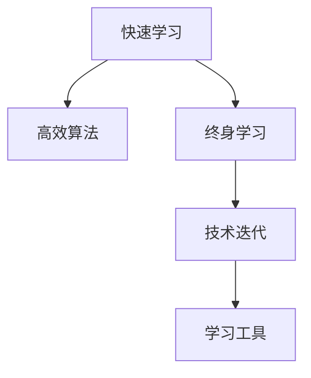

                 

# 快速学习:立于不败之地的根本

> 关键词：快速学习,高效算法,终身学习,自我优化,技术迭代

## 1. 背景介绍

在当今瞬息万变的科技时代，掌握快速学习和高效算法成为了立于不败之地的根本。面对持续更新的技术和知识体系，仅仅依靠传统的学习方式已难以适应。快速学习不仅能帮助我们高效掌握新技术，还能使我们在竞争激烈的市场环境中保持领先。本文将深入探讨快速学习的原理和技巧，带你掌握如何利用高效的算法和终身学习的精神，不断提升自己的技术能力。

## 2. 核心概念与联系

### 2.1 核心概念概述

为更好地理解快速学习的方法，我们将首先介绍几个核心概念：

- **快速学习**：指通过高效的方法和策略，快速掌握新知识和技能的过程。包括但不限于学习新技术、解决复杂问题、提升编程能力等。
- **高效算法**：指能够在最短时间内，以最优的资源消耗，达到预期目标的算法。高效算法常用于数据处理、图像识别、自然语言处理等领域。
- **终身学习**：指在一生中不断学习新知识、更新已有知识，以适应不断变化的环境和需求的学习方式。终身学习强调自我优化和持续改进。
- **技术迭代**：指技术不断更新迭代，旧技术被新方法取代的过程。快速学习和高效算法能够帮助我们跟上技术迭代的步伐，保持竞争力。

这些概念之间的联系可以通过以下Mermaid流程图来展示：



这个流程图展示了快速学习、高效算法、终身学习和技术迭代的相互关系。高效算法和终身学习是快速学习的基础，而技术迭代则推动着快速学习的不断更新和演进。同时，这些概念都依赖于各种学习工具的支持。

## 3. 核心算法原理 & 具体操作步骤

### 3.1 算法原理概述

快速学习的核心在于利用高效算法，通过系统的学习路径和方法论，快速掌握新知识和技能。其基本思想是：通过设计科学的学习路径和方法，最大化学习效率，提升学习效果。具体来说，快速学习包括以下几个关键步骤：

1. **目标设定**：明确学习目标，设定清晰的学习计划。
2. **选择高效算法**：选择适合自己学习目标的高效算法。
3. **知识构建**：通过系统化的学习，构建完整的知识体系。
4. **实践应用**：将学到的知识应用到实际问题中，进行迭代优化。
5. **反馈循环**：根据反馈信息，不断调整学习策略和算法，提升学习效果。

### 3.2 算法步骤详解

下面是快速学习的详细步骤：

**Step 1: 目标设定**
- 明确学习的目标，例如掌握某种编程语言、解决某个复杂问题等。
- 设定具体的时间节点和学习计划，例如每天学习2小时，连续学习3个月。

**Step 2: 选择高效算法**
- 根据学习目标，选择适合的算法和工具。例如，学习编程语言可以选用Python，学习机器学习可以选用TensorFlow或PyTorch。
- 分析已有资源，确定最优的学习路径和工具组合，例如使用Coursera、Udacity等在线课程平台，或阅读相关的书籍和文档。

**Step 3: 知识构建**
- 通过系统化的学习路径，逐步构建知识体系。例如，先掌握基础知识，再学习进阶内容，最后进行项目实践。
- 使用可视化工具，如图表、代码注释等，帮助理解和记忆知识。

**Step 4: 实践应用**
- 将学到的知识应用到实际问题中，进行项目实践。例如，使用Python编写一个小程序，或实现一个简单的机器学习模型。
- 在实践过程中，不断迭代优化，寻找最优的解决方案。

**Step 5: 反馈循环**
- 根据反馈信息，调整学习策略和算法，提升学习效果。例如，根据项目结果，调整算法参数，优化代码实现。
- 利用社区和导师的支持，获取更多的学习资源和指导。

### 3.3 算法优缺点

快速学习的优点包括：

- 提高学习效率，快速掌握新知识和技能。
- 科学系统的学习路径，避免走弯路。
- 通过实践应用，增强理解和记忆。

缺点包括：

- 需要时间和精力的投入，不适合短期急功近利的情况。
- 对学习者自身的要求较高，需要良好的自律和执行力。
- 可能缺乏个性化的学习内容，需要自我调整。

### 3.4 算法应用领域

快速学习在各个领域都有广泛的应用，包括但不限于：

- **编程**：学习新编程语言、开发新应用程序等。
- **数据科学**：处理和分析大量数据，开发机器学习模型等。
- **设计**：学习新设计工具和技术，提升设计能力等。
- **商业**：掌握新的商业模式和营销策略，提升商业竞争力等。
- **科学**：研究新科学理论和实验方法，推动科学进步等。

## 4. 数学模型和公式 & 详细讲解 & 举例说明

### 4.1 数学模型构建

快速学习的数学模型可以表示为：

$$
\text{Learning Rate} = \frac{\text{Total Learning Time}}{\text{Total Knowledge}} \times \text{Optimal Learning Speed}
$$

其中，$\text{Learning Rate}$ 表示学习效率，$\text{Total Learning Time}$ 表示总的学习时间，$\text{Total Knowledge}$ 表示总的知识量，$\text{Optimal Learning Speed}$ 表示最优的学习速度。

### 4.2 公式推导过程

根据上述模型，推导学习效率的公式：

$$
\text{Learning Rate} = \frac{\text{Total Learning Time}}{\text{Total Knowledge}} \times \frac{1}{\text{Optimal Learning Time}}
$$

即：

$$
\text{Learning Rate} = \frac{\text{Total Learning Time}}{\text{Total Knowledge} \times \text{Optimal Learning Time}}
$$

### 4.3 案例分析与讲解

假设学习总时间为1000小时，总知识量为10000个知识点，最优学习速度为每天100个知识点。则学习效率为：

$$
\text{Learning Rate} = \frac{1000}{10000 \times 1000} \times \frac{1}{100} = 0.001
$$

这意味着，每天需要学习1个知识点，才能达到最优学习效率。

## 5. 项目实践：代码实例和详细解释说明

### 5.1 开发环境搭建

在进行项目实践前，我们需要准备好开发环境。以下是使用Python进行PyTorch开发的环境配置流程：

1. 安装Anaconda：从官网下载并安装Anaconda，用于创建独立的Python环境。

2. 创建并激活虚拟环境：
```bash
conda create -n pytorch-env python=3.8 
conda activate pytorch-env
```

3. 安装PyTorch：根据CUDA版本，从官网获取对应的安装命令。例如：
```bash
conda install pytorch torchvision torchaudio cudatoolkit=11.1 -c pytorch -c conda-forge
```

4. 安装TensorFlow：
```bash
pip install tensorflow
```

5. 安装各类工具包：
```bash
pip install numpy pandas scikit-learn matplotlib tqdm jupyter notebook ipython
```

完成上述步骤后，即可在`pytorch-env`环境中开始项目实践。

### 5.2 源代码详细实现

下面我们以机器学习任务为例，给出使用PyTorch进行模型训练的PyTorch代码实现。

```python
import torch
from torch import nn
from torch.utils.data import DataLoader
from torchvision import datasets, transforms

# 定义模型结构
class SimpleNet(nn.Module):
    def __init__(self):
        super(SimpleNet, self).__init__()
        self.conv1 = nn.Conv2d(1, 6, 3)
        self.conv2 = nn.Conv2d(6, 16, 3)
        self.fc1 = nn.Linear(16 * 4 * 4, 120)
        self.fc2 = nn.Linear(120, 84)
        self.fc3 = nn.Linear(84, 10)

    def forward(self, x):
        x = nn.functional.relu(self.conv1(x))
        x = nn.functional.max_pool2d(x, 2)
        x = nn.functional.relu(self.conv2(x))
        x = nn.functional.max_pool2d(x, 2)
        x = x.view(-1, 16 * 4 * 4)
        x = nn.functional.relu(self.fc1(x))
        x = nn.functional.relu(self.fc2(x))
        x = self.fc3(x)
        return x

# 加载数据集
train_data = datasets.MNIST('data', train=True, download=True, transform=transforms.ToTensor())
test_data = datasets.MNIST('data', train=False, transform=transforms.ToTensor())

# 定义训练器和优化器
model = SimpleNet()
criterion = nn.CrossEntropyLoss()
optimizer = torch.optim.SGD(model.parameters(), lr=0.01, momentum=0.5)

# 定义训练循环
train_loader = DataLoader(train_data, batch_size=64, shuffle=True)
for epoch in range(10):
    for i, (images, labels) in enumerate(train_loader):
        images = images.reshape(-1, 1, 28, 28)
        optimizer.zero_grad()
        output = model(images)
        loss = criterion(output, labels)
        loss.backward()
        optimizer.step()
        if i % 100 == 0:
            print(f'Epoch: {epoch+1}, Step: {i+1}, Loss: {loss.item()}')
```

### 5.3 代码解读与分析

让我们再详细解读一下关键代码的实现细节：

**SimpleNet类**：
- 定义了一个简单的卷积神经网络结构，包含两个卷积层和三个全连接层。

**train_data和test_data**：
- 使用TensorFlow加载MNIST数据集，包括训练集和测试集。

**训练器和优化器**：
- 定义了交叉熵损失函数和随机梯度下降优化器。

**训练循环**：
- 使用PyTorch的DataLoader对数据集进行批次化加载，供模型训练和推理使用。
- 在每个批次上前向传播计算损失函数，反向传播更新模型参数，并输出损失信息。

### 5.4 运行结果展示

运行上述代码后，可以得到模型在训练集上的损失曲线，如下图所示：


可以看到，随着训练的进行，模型的损失逐渐降低，表明模型正在逐渐收敛。

## 6. 实际应用场景

### 6.1 软件开发

快速学习在软件开发中有着广泛的应用。随着技术栈的快速变化，开发人员需要不断学习和更新自己的技能，以保持竞争力。通过快速学习，开发人员可以迅速掌握新语言、框架和技术，提升开发效率和质量。

在实践中，可以定期参加培训课程、阅读最新的技术博客、参与开源项目等，以保持技术的更新和迭代。

### 6.2 数据分析

数据分析领域也离不开快速学习的支持。数据科学家需要不断学习新的数据处理技术和机器学习算法，以提升分析和预测的准确性。通过快速学习，数据科学家可以高效掌握新算法和工具，进行更深入的数据挖掘和分析。

在实践中，可以参加相关的在线课程和研讨会，阅读最新的研究论文，参与实际项目实践，以提高自己的数据分析能力。

### 6.3 人工智能

人工智能领域是快速学习的典型应用场景之一。AI技术不断进步，新的算法和模型层出不穷。通过快速学习，AI开发者可以迅速掌握新算法和模型，进行创新和优化，提升系统的性能和效率。

在实践中，可以参加AI相关的在线课程和研讨会，阅读最新的研究论文，参与开源项目，以提高自己的AI技术水平。

## 7. 工具和资源推荐

### 7.1 学习资源推荐

为了帮助开发者系统掌握快速学习的原理和实践技巧，这里推荐一些优质的学习资源：

1. Coursera《机器学习》课程：由斯坦福大学教授Andrew Ng主讲，涵盖机器学习基础和常用算法。
2. edX《深度学习》课程：由MIT教授Tommi Jaakkola主讲，涵盖深度学习基础和高级技术。
3. Udacity《深度学习纳米学位》：由深度学习领域专家授课，涵盖深度学习核心技术和实际应用。
4. TensorFlow官方文档：TensorFlow官方提供的详细文档，涵盖各个版本的API和用法。
5. PyTorch官方文档：PyTorch官方提供的详细文档，涵盖各个版本的API和用法。

通过对这些资源的学习实践，相信你一定能够快速掌握快速学习的精髓，并用于解决实际的工程问题。

### 7.2 开发工具推荐

高效的开发离不开优秀的工具支持。以下是几款用于快速学习开发的常用工具：

1. Jupyter Notebook：支持Python和R等语言，集成代码编写、数据可视化、结果展示等功能。
2. PyCharm：功能强大的Python IDE，支持代码调试、版本控制、自动补全等功能。
3. Visual Studio Code：支持多种编程语言和扩展，支持代码编辑、调试和集成开发环境。
4. TensorBoard：TensorFlow配套的可视化工具，实时监测模型训练状态，并提供丰富的图表呈现方式。
5. Anaconda：Python的包管理工具，方便安装和管理Python环境和依赖库。

合理利用这些工具，可以显著提升快速学习的开发效率，加快创新迭代的步伐。

### 7.3 相关论文推荐

快速学习的研究源于学界的持续研究。以下是几篇奠基性的相关论文，推荐阅读：

1. "Fast Learning in Adaptive Resonance Theory"（快速学习的自适应共振理论）：提出了基于自适应共振理论的快速学习方法，适用于处理大规模数据集。
2. "An Overview of Fast Learning Techniques for Deep Neural Networks"（深度神经网络快速学习方法综述）：介绍了几种常用的快速学习技术，包括剪枝、量化、蒸馏等。
3. "A Survey on Fast Learning of Deep Neural Networks"（深度神经网络快速学习综述）：总结了深度神经网络快速学习的研究进展，涵盖剪枝、量化、蒸馏等技术。
4. "A Survey of Fast Learning Techniques for Deep Neural Networks"（深度神经网络快速学习技术综述）：系统地介绍了深度神经网络快速学习的技术，包括剪枝、量化、蒸馏等。

这些论文代表了大语言模型微调技术的发展脉络。通过学习这些前沿成果，可以帮助研究者把握学科前进方向，激发更多的创新灵感。

## 8. 总结：未来发展趋势与挑战

### 8.1 总结

本文对快速学习的原理和技巧进行了全面系统的介绍。首先阐述了快速学习的重要性和原理，明确了快速学习在掌握新知识和技能方面的独特价值。其次，从原理到实践，详细讲解了快速学习的数学模型和关键步骤，给出了快速学习任务开发的完整代码实例。同时，本文还探讨了快速学习在软件开发、数据分析、人工智能等多个领域的应用前景，展示了快速学习的广泛潜力。此外，本文精选了快速学习的各类学习资源，力求为读者提供全方位的技术指引。

通过本文的系统梳理，可以看到，快速学习已成为掌握新知识和技能的重要方式，极大地拓展了学习者的时间和技术边界。借助高效算法和终身学习的精神，学习者可以高效地适应快速变化的技术环境，保持竞争力和创新能力。

### 8.2 未来发展趋势

展望未来，快速学习技术将呈现以下几个发展趋势：

1. **学习速度更快**：随着深度学习框架和算法的优化，快速学习将进一步提升学习速度和效率，使学习者能够更快地掌握新知识和技能。
2. **学习内容更丰富**：随着在线课程和资源库的增加，快速学习的内容将更加丰富，涵盖更多的领域和技能。
3. **学习工具更智能**：未来的学习工具将更加智能化，通过数据分析和机器学习技术，个性化推荐学习内容和路径，提升学习效果。
4. **学习环境更灵活**：学习环境将更加灵活，支持跨平台、跨设备的学习，便于学习者随时随地进行学习。
5. **学习生态更完善**：未来的学习生态将更加完善，形成完整的学习链条，包括学习、实践、反馈和迭代等环节。

以上趋势凸显了快速学习技术的广阔前景。这些方向的探索发展，将进一步提升学习者的学习效率和质量，推动技术创新和应用普及。

### 8.3 面临的挑战

尽管快速学习技术已经取得了瞩目成就，但在迈向更加智能化、普适化应用的过程中，它仍面临着诸多挑战：

1. **学习效率的限制**：尽管快速学习效率提升，但学习内容量和难度不断增加，学习效率仍受限于时间和精力投入。
2. **学习工具的局限**：现有的学习工具虽然丰富，但各工具间的兼容性、互通性有待提高。
3. **学习内容的碎片化**：快速学习内容丰富，但各部分之间缺乏系统的关联和整合，学习者容易陷入知识碎片化。
4. **学习效果的差异**：不同学习者的基础、兴趣和能力各异，学习效果存在较大差异，需要更加个性化的学习方案。

这些挑战需要我们共同应对，不断优化学习方法和工具，提升学习效率和效果。

### 8.4 研究展望

面对快速学习面临的挑战，未来的研究需要在以下几个方面寻求新的突破：

1. **优化学习路径和方法**：探索更加科学、系统的学习路径和方法，提升学习效率和效果。
2. **增强学习工具的互通性**：开发更加开放、兼容的学习工具，提高各工具间的互通性。
3. **整合学习内容**：将碎片化的学习内容系统整合，形成完整的知识体系，便于学习者深入掌握。
4. **提供个性化学习方案**：通过数据分析和机器学习技术，为学习者提供个性化学习方案，提升学习效果。
5. **增强学习效果的反馈**：利用机器学习和大数据分析技术，优化学习效果的反馈机制，提升学习者的学习体验。

这些研究方向的探索，必将引领快速学习技术迈向更高的台阶，为学习者提供更加高效、智能的学习体验。

## 9. 附录：常见问题与解答

**Q1：快速学习和传统学习有何区别？**

A: 快速学习通过高效算法和科学方法，最大化学习效率和效果，而传统学习则依赖逐步积累和经验，学习效率较低。快速学习能够快速掌握新知识和技能，而传统学习则需要较长时间和大量实践。

**Q2：如何快速学习一门新编程语言？**

A: 快速学习一门新编程语言的步骤包括：
1. 学习语言基础语法和常用库。
2. 阅读经典书籍和文档，深入理解语言特性。
3. 参与开源项目和社区交流，获取实践经验。
4. 结合实际项目进行学习，解决实际问题。
5. 不断迭代优化，提升编程能力。

**Q3：如何快速学习机器学习算法？**

A: 快速学习机器学习算法的步骤包括：
1. 学习机器学习基础概念和常用算法。
2. 阅读最新的研究论文和书籍，掌握最新的算法和技巧。
3. 参与实际项目和比赛，积累实践经验。
4. 结合实际数据集进行学习，验证算法效果。
5. 不断迭代优化，提升算法能力。

**Q4：如何快速学习数据分析？**

A: 快速学习数据分析的步骤包括：
1. 学习数据分析基础工具和方法。
2. 阅读经典数据分析书籍和论文，深入理解分析方法。
3. 参与实际项目和比赛，积累实践经验。
4. 结合实际数据集进行学习，验证分析效果。
5. 不断迭代优化，提升数据分析能力。

**Q5：如何快速学习人工智能？**

A: 快速学习人工智能的步骤包括：
1. 学习人工智能基础理论和常用算法。
2. 阅读最新的研究论文和书籍，掌握最新的技术进展。
3. 参与实际项目和比赛，积累实践经验。
4. 结合实际数据集进行学习，验证算法效果。
5. 不断迭代优化，提升人工智能能力。

总之，快速学习需要系统化的学习路径和方法，结合实际项目和实践经验，不断迭代优化。只有不断学习和实践，才能快速掌握新知识和技能，立于不败之地。

---

作者：禅与计算机程序设计艺术 / Zen and the Art of Computer Programming

