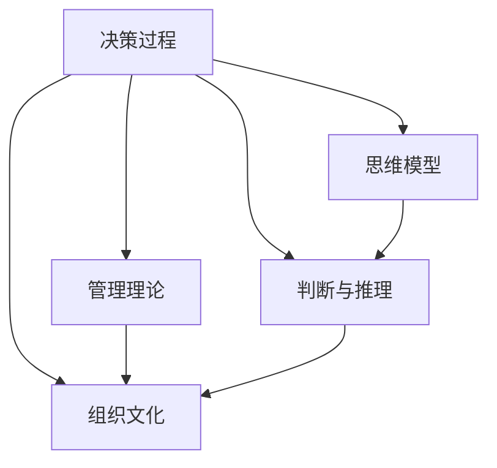

                 

# 思维体系与管理者决策质量的关系

> 关键词：决策过程, 管理理论, 思维模型, 判断与推理, 组织文化

## 1. 背景介绍

在当今快速变化和复杂多变的商业环境中，决策制定者面临的任务愈加艰巨。无论是中高层管理者还是一线管理人员，都需要迅速而准确地作出各种决策，影响组织的战略、运营和绩效。然而，决策质量常常是企业成功的关键因素，影响着组织的成长和发展。因此，深入探索影响管理者决策质量的因素显得尤为重要。其中，思维体系作为管理者决策过程中的核心环节，对决策质量的影响尤为显著。

## 2. 核心概念与联系

### 2.1 核心概念概述

本节将介绍几个与管理者决策质量密切相关的核心概念，并阐述这些概念之间的逻辑联系。

- **决策过程**：管理者进行决策的一系列步骤，包括问题识别、信息收集、选项评估和决策实施等环节。
- **管理理论**：指导管理实践的理论框架，包括行为理论、组织理论和战略理论等。
- **思维模型**：用于组织思维和推理的工具，如SWOT分析、PEST分析、波特五力模型等。
- **判断与推理**：决策过程中的核心能力，涉及定性与定量分析、概率推断和因果推理等。
- **组织文化**：影响员工行为和决策的外部环境因素，如信任、透明度和开放性等。

### 2.2 核心概念原理和架构的 Mermaid 流程图



此图展示了决策过程中各个核心概念之间的相互联系。管理理论提供决策的理论指导，思维模型提供决策的工具和方法，判断与推理是决策的核心能力，组织文化则影响决策过程的执行环境和结果。

## 3. 核心算法原理 & 具体操作步骤

### 3.1 算法原理概述

管理者决策质量的高低受到多种因素的共同影响，其中思维体系作为决策过程中的关键环节，对决策质量的影响尤为显著。合理构建和管理者的思维体系，能够显著提升其决策质量。

### 3.2 算法步骤详解

构建和优化管理者的思维体系，一般遵循以下步骤：

1. **识别决策类型**：明确决策问题的性质和决策类型，如战略性、战术性或运营性决策。
2. **制定决策目标**：明确决策的目标和期望结果，基于管理理论进行目标设定。
3. **信息收集与处理**：使用有效的信息收集和处理工具，确保决策所需信息的完整性和准确性。
4. **选择决策方法**：根据决策类型和目标，选择合适的思维模型和判断推理方法。
5. **实施与反馈**：执行决策并跟踪结果，收集反馈信息，持续改进决策体系。

### 3.3 算法优缺点

构建和管理者的思维体系，有以下优点：

- **提升决策效率**：合理使用思维模型和判断推理方法，能够快速识别问题并找到解决方案。
- **增强决策效果**：系统化的决策过程有助于消除主观偏见，提高决策的科学性和客观性。
- **提升组织绩效**：有效的决策支持管理者的领导力，增强组织的战略执行能力和市场竞争力。

但同时，也存在以下缺点：

- **构建难度高**：构建有效的思维体系需要深厚的理论知识和实践经验。
- **灵活性受限**：固定的思维模型和判断推理方法，可能难以应对复杂和动态的决策环境。
- **成本较高**：系统化的决策过程需要较高的资源投入，包括时间和财务成本。

### 3.4 算法应用领域

构建和管理者的思维体系，广泛应用于各类管理场景，包括但不限于以下领域：

- **企业战略制定**：使用PEST分析和波特五力模型，制定长期发展战略。
- **项目管理与执行**：应用SWOT分析和甘特图，规划和管理项目进度和资源。
- **人力资源管理**：使用胜任力模型和绩效评估方法，优化人才选拔和培养。
- **财务决策与分析**：利用财务预测和投资组合分析，优化财务资源配置。
- **市场营销与品牌管理**：采用市场细分和品牌价值链模型，制定市场推广策略。
- **风险管理与控制**：应用风险评估和风险矩阵，识别和应对潜在风险。

## 4. 数学模型和公式 & 详细讲解 & 举例说明

### 4.1 数学模型构建

假设管理者面临一个需要优化的问题，记为 $P$，其对应的目标函数为 $f(P)$，需优化的决策变量为 $\mathbf{x}$，则决策问题可以形式化为：

$$
\max \quad f(\mathbf{x})
$$

满足约束条件：

$$
g_i(\mathbf{x}) \leq 0, \quad i=1,2,...,m
$$

$$
h_j(\mathbf{x}) = 0, \quad j=1,2,...,p
$$

其中，$g_i(\mathbf{x})$ 和 $h_j(\mathbf{x})$ 分别表示不等式约束和等式约束。

### 4.2 公式推导过程

为了求解上述优化问题，可以使用线性规划、非线性规划或整数规划等方法。以下以线性规划为例，推导求解步骤：

1. **构建线性规划模型**：将决策问题转化为线性规划模型，并利用标准形式表示：

$$
\min \quad \mathbf{c}^T\mathbf{x}
$$

$$
\text{s.t.} \quad A\mathbf{x} \leq \mathbf{b}
$$

$$
\mathbf{x} \geq \mathbf{0}
$$

其中，$\mathbf{c}$ 和 $\mathbf{b}$ 分别为系数和常数向量。

2. **求解线性规划**：使用单纯形法、内点法等方法求解线性规划问题，得到最优解 $\mathbf{x}^*$。

3. **结果分析与验证**：根据模型目标和约束条件，分析最优解的合理性，并进行必要调整。

### 4.3 案例分析与讲解

假设某公司的目标是最大化其销售收入，记为 $P$，涉及的决策变量包括广告预算、产品定价和市场份额。

**目标函数**：

$$
f(P) = \text{销售收入} - \text{成本} + \text{利润}
$$

**约束条件**：

- 广告预算不超过总预算的10%：

$$
0.1B \geq A
$$

- 产品定价不低于成本：

$$
P \geq C
$$

- 市场份额不超过饱和点：

$$
S \leq 100
$$

使用线性规划方法求解上述问题，得到最优广告预算 $A^*$ 和产品定价 $P^*$，使公司销售收入最大化。

## 5. 项目实践：代码实例和详细解释说明

### 5.1 开发环境搭建

在Python环境中，使用PuLP库进行线性规划问题的求解。

首先，安装PuLP库：

```bash
pip install pulp
```

然后，导入必要的库：

```python
from pulp import LpProblem, LpVariable, lpSum
```

### 5.2 源代码详细实现

定义决策问题，并进行求解：

```python
# 创建决策问题
prob = LpProblem("Maximize Sales", sense=LpProblem.MAXIMIZE)

# 定义决策变量
A = LpVariable("Ad Budget", lowBound=0, highBound=10000)
P = LpVariable("Price", lowBound=20, highBound=100)
S = LpVariable("Market Share", lowBound=0, highBound=100)

# 定义目标函数
prob += 1000 * A + 10 * P - 50 * S

# 定义约束条件
prob += 0.1 * 10000 <= A
prob += P >= 20
prob += S <= 100

# 求解问题
prob.solve()

# 输出结果
print(f"Optimal solution: {prob.objective.value()}")
print(f"Ad Budget: {A.value()}")
print(f"Product Price: {P.value()}")
print(f"Market Share: {S.value()}")
```

### 5.3 代码解读与分析

上述代码中，使用PuLP库创建线性规划问题，定义了广告预算 $A$、产品定价 $P$ 和市场份额 $S$ 三个决策变量，并设置目标函数和约束条件。最后调用 `solve()` 方法求解问题，输出最优解。

## 6. 实际应用场景

### 6.1 企业战略制定

在企业战略制定中，使用PEST分析和波特五力模型，对内外部环境进行分析，识别战略机会和风险。管理者通过构建和优化思维体系，制定并实施长远的战略规划，提升企业的市场竞争力。

### 6.2 项目管理与执行

在项目管理中，使用甘特图和关键路径方法，明确项目目标和关键节点，优化资源配置和进度管理。通过构建思维模型，管理者能够更系统地进行项目规划和执行，提升项目成功率。

### 6.3 人力资源管理

在人力资源管理中，使用胜任力模型和绩效评估方法，识别员工的优势和不足，制定个性化的培养和发展计划。通过优化思维体系，管理者能够更科学地进行人才选拔和培养，提升员工绩效。

### 6.4 财务决策与分析

在财务决策中，使用财务预测和投资组合分析，评估投资项目和财务策略的可行性和收益性。通过构建系统化的决策体系，管理者能够更准确地进行财务决策，提升财务绩效。

### 6.5 市场营销与品牌管理

在市场营销中，使用市场细分和品牌价值链模型，进行市场分析和品牌建设。通过优化思维体系，管理者能够更有效地进行市场推广和品牌管理，提升市场竞争力。

### 6.6 风险管理与控制

在风险管理中，使用风险评估和风险矩阵，识别和应对潜在风险。通过构建思维体系，管理者能够更系统地进行风险评估和控制，提升组织的安全性和稳定性。

## 7. 工具和资源推荐

### 7.1 学习资源推荐

为了深入学习管理者的思维体系和决策过程，推荐以下学习资源：

1. **《管理学原理》**：介绍管理理论的基础知识和管理决策的一般方法。
2. **《决策分析》**：详细讲解决策过程和优化问题的数学建模与求解方法。
3. **《思维模型与决策工具》**：介绍常用的思维模型和决策工具，并给出实际应用案例。
4. **《组织行为学》**：分析组织文化和管理者行为对决策过程的影响。
5. **在线课程**：如Coursera上的《数据科学导论》和《统计学方法》课程。

### 7.2 开发工具推荐

以下是几款常用的管理决策和思维建模工具：

1. **Excel**：强大的数据处理和图表展示工具，常用于财务分析和项目管理。
2. **Tableau**：数据可视化工具，用于数据探索和决策支持。
3. **PuLP**：Python库，用于数学建模和优化问题求解。
4. **Anki**：间隔重复记忆软件，用于知识管理和个人学习。
5. **MindManager**：思维导图工具，用于梳理思维模型和决策流程。

### 7.3 相关论文推荐

深入了解管理者的思维体系和决策过程，需要阅读以下经典论文：

1. **《决策分析》**：H. E. Kisselberg等著，详细讲解决策过程和优化问题的数学建模与求解方法。
2. **《组织行为学》**：J. D. Schmidt等著，分析组织文化和管理者行为对决策过程的影响。
3. **《管理学原理》**：R. M. Cyert等著，介绍管理理论的基础知识和管理决策的一般方法。
4. **《思维模型与决策工具》**：E. J. Sharp等著，介绍常用的思维模型和决策工具，并给出实际应用案例。

## 8. 总结：未来发展趋势与挑战

### 8.1 研究成果总结

本节对影响管理者决策质量的因素进行了系统分析，特别是思维体系在决策过程中所起到的关键作用。研究表明，合理构建和管理者的思维体系，能够显著提升其决策质量。未来，相关研究将进一步探索如何构建更高效、更灵活的决策体系，提升组织绩效。

### 8.2 未来发展趋势

展望未来，管理者的思维体系将呈现以下几个发展趋势：

1. **数据驱动决策**：在数字化转型的大背景下，利用大数据和AI技术，提升决策的科学性和数据驱动性。
2. **跨学科融合**：将管理学、心理学、经济学等学科的知识和方法，与数据科学和技术手段相结合，构建更加全面的决策体系。
3. **敏捷决策**：在快速变化的环境中，管理者需要具备灵活和敏捷的决策能力，能够迅速响应变化和调整策略。
4. **模型自动化**：开发更多的自动决策模型和智能决策支持系统，提高决策效率和效果。
5. **透明和可解释性**：提高决策过程的透明性和可解释性，增强管理者的决策信心和透明度。

### 8.3 面临的挑战

构建和管理者的思维体系，仍面临以下挑战：

1. **数据质量问题**：数据质量和数据治理的挑战，影响决策的科学性和准确性。
2. **技术复杂性**：新兴技术和工具的复杂性，增加决策过程的学习成本。
3. **伦理和法律问题**：决策过程的伦理和法律约束，影响决策的可行性和可执行性。
4. **组织变革**：组织文化的变革和内部阻力，影响决策体系的有效实施。
5. **技能差距**：管理者技能和能力的差异，影响决策的质量和效果。

### 8.4 研究展望

未来研究需要从以下几个方面进行突破：

1. **数据治理和质量提升**：建立数据治理框架，提升数据质量和数据治理能力，确保数据驱动决策的准确性和可靠性。
2. **跨学科研究和应用**：加强跨学科研究和应用，构建综合性决策模型，提升决策的科学性和系统性。
3. **自动化决策系统**：开发更加智能和自适应的决策支持系统，提高决策效率和效果。
4. **伦理和法律合规**：加强决策过程的伦理和法律合规性研究，确保决策的合法性和公正性。
5. **组织变革和管理培训**：推动组织文化的变革和员工培训，提升管理者决策能力，增强决策体系的执行力。

## 9. 附录：常见问题与解答

**Q1：如何构建和管理者的思维体系？**

A: 构建和管理者的思维体系需要以下几个步骤：
1. 明确决策问题和目标。
2. 收集和分析相关信息。
3. 选择合适的思维模型和判断推理方法。
4. 实施决策并跟踪结果，收集反馈信息，持续改进决策体系。

**Q2：决策过程中的思维模型有哪些？**

A: 常用的决策思维模型包括：
1. SWOT分析：分析组织的优势、劣势、机会和威胁。
2. PEST分析：分析宏观环境中的政治、经济、社会和技术因素。
3. 波特五力模型：分析行业竞争力和市场地位。
4. 甘特图：规划和管理项目进度和资源。
5. 关键路径法：确定项目中的关键节点和关键路径。
6. 绩效评估模型：评估员工和项目的绩效。

**Q3：如何应对决策过程中的不确定性和风险？**

A: 应对决策过程中的不确定性和风险，可以采取以下措施：
1. 数据驱动决策，利用大数据和AI技术，提升决策的科学性和可靠性。
2. 使用风险评估和风险矩阵，识别和应对潜在风险。
3. 建立灵活和敏捷的决策体系，快速响应变化和调整策略。
4. 利用跨学科知识和跨领域方法，提高决策的全面性和系统性。
5. 加强组织文化的变革和员工培训，提升管理者决策能力，增强决策体系的执行力。

**Q4：决策过程中的伦理和法律问题有哪些？**

A: 决策过程中的伦理和法律问题包括：
1. 数据隐私和数据治理问题，如数据收集和使用的合法性和合规性。
2. 决策过程中的公平和公正问题，如避免歧视和偏见。
3. 法律合规性问题，如确保决策过程符合相关法律法规。

**Q5：如何评估和管理者的决策质量？**

A: 评估和管理者的决策质量需要综合考虑以下几个方面：
1. 决策的目标和结果，是否达到了预期的效果。
2. 决策的过程和方法，是否科学、合理和系统化。
3. 决策的影响和后果，是否产生了正面效果。
4. 决策的透明性和可解释性，是否易于理解和解释。

以上问题及解答，希望能帮助管理者更好地理解和应用决策过程中的思维体系，提升决策质量，实现组织的长期发展和战略目标。

---

作者：禅与计算机程序设计艺术 / Zen and the Art of Computer Programming

