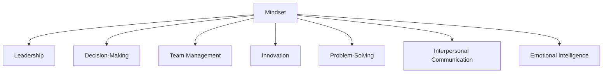

                 

# 思维模式对领导力的影响

> 关键词：领导力, 思维模式, 决策能力, 团队管理, 创新, 问题解决, 人际沟通, 情绪管理

## 1. 背景介绍

### 1.1 问题由来

在当今快速变化的商业环境中，领导者的作用愈发重要。领导力不仅关乎组织的成功与否，还直接影响着团队成员的成长与幸福感。然而，不同的思维模式对领导力的影响各异。了解和掌握科学的思维模式对于提升领导力至关重要。

### 1.2 问题核心关键点

正确的思维模式能够引导领导者做出更好的决策，更有效地管理团队，推动组织向更高目标迈进。本节将从多个角度探讨不同思维模式对领导力的具体影响，为领导者提供清晰的指导。

## 2. 核心概念与联系

### 2.1 核心概念概述

- **思维模式(Mindset)**：指个人看待世界、处理问题和决策时所采用的基本心理框架。
- **领导力(Leadership)**：在组织中指导、激励、影响他人以实现共同目标的能力。
- **决策能力(Decision-Making)**：指在复杂环境下迅速、准确地做出选择的能力。
- **团队管理(Team Management)**：有效组织和协调团队成员，以达成共同目标。
- **创新(Innovation)**：通过新颖的方法或思想创造价值的过程。
- **问题解决(Problem-Solving)**：识别、分析和解决组织或团队面临问题的过程。
- **人际沟通(Interpersonal Communication)**：在组织内外有效传递信息的能力。
- **情绪管理(Emotional Intelligence)**：识别、理解和管理自己及他人情绪的能力。

这些核心概念之间的逻辑关系可以通过以下Mermaid流程图来展示：



这个流程图展示了思维模式与领导力之间的紧密联系，以及思维模式在领导力的不同维度上的作用。

## 3. 核心算法原理 & 具体操作步骤

### 3.1 算法原理概述

本节将介绍几种重要的思维模式，以及它们如何影响领导力。

- **固定型思维模式(Fixed Mindset)**：认为能力和智力是固定的，重视努力，但容易产生焦虑和自我怀疑。
- **成长型思维模式(Growth Mindset)**：认为能力和智力可以通过努力和学习得到提升，更愿意接受挑战，面对失败。
- **系统化思维模式(Systemic Mindset)**：注重系统性和全局视角，分析和解决问题时考虑系统内部和外部的联系。
- **同理心思维模式(Empathy Mindset)**：关注团队成员的情绪和需求，通过理解他人来建立更好的人际关系。
- **数据驱动思维模式(Data-Driven Mindset)**：依赖数据和分析来做出决策，减少主观偏见。

### 3.2 算法步骤详解

以下步骤将详细说明如何通过思维模式提升领导力：

1. **评估思维模式**：领导者应定期评估自己的思维模式，了解其在不同情况下的表现。
2. **识别优势与不足**：明确思维模式的优势和潜在问题，制定相应的改进策略。
3. **培养成长型思维**：通过不断学习和挑战自我，提升成长型思维，增强自信和适应能力。
4. **应用系统化思维**：在决策和问题解决中采用系统化方法，考虑问题的全貌和相关因素。
5. **增强同理心**：关注团队成员的情感和需求，建立互信和支持性的工作环境。
6. **依赖数据驱动**：依据可靠的数据和分析来做出决策，减少主观偏差。

### 3.3 算法优缺点

- **固定型思维模式**：
  - 优点：重视努力，可能更专注于目标。
  - 缺点：容易受挫，缺乏弹性，对创新不够开放。
  
- **成长型思维模式**：
  - 优点：增强适应性，愿意接受挑战，促进个人和团队成长。
  - 缺点：对即时反馈的依赖可能影响决策速度。

- **系统化思维模式**：
  - 优点：全面视角，有助于深入分析复杂问题。
  - 缺点：分析过程可能复杂，需要较高的时间和资源投入。

- **同理心思维模式**：
  - 优点：改善团队关系，提高工作满意度。
  - 缺点：可能会过度关注情感，忽视任务效率。

- **数据驱动思维模式**：
  - 优点：决策科学客观，减少主观偏见。
  - 缺点：依赖数据可能导致过度分析，忽视直觉和经验。

### 3.4 算法应用领域

这些思维模式广泛应用于各种领导情境中，例如：

- **企业领导**：在制定战略、管理团队和处理员工问题时。
- **教育管理者**：在教育政策和课堂管理中。
- **公共部门领导者**：在公共服务和政策制定时。
- **非营利组织负责人**：在筹款和项目执行时。
- **科技公司CEO**：在产品开发和市场推广时。

## 4. 数学模型和公式 & 详细讲解

### 4.1 数学模型构建

本节将构建一个简单的数学模型来表示思维模式对领导力的影响。设领导力为 $L$，思维模式为 $M$，决策能力为 $D$，团队管理能力为 $T$，创新能力为 $I$，问题解决能力为 $P$，人际沟通能力为 $C$，情绪管理能力为 $E$。则领导力的综合影响可以表示为：

$$
L = \alpha D + \beta T + \gamma I + \delta P + \epsilon C + \zeta E
$$

其中，$\alpha, \beta, \gamma, \delta, \epsilon, \zeta$ 是权重系数，反映了每种能力的相对重要性。

### 4.2 公式推导过程

假设领导者具有固定型思维模式，对能力的看法为 $F$，成长型思维模式为 $G$，系统化思维模式为 $S$，同理心思维模式为 $E$，数据驱动思维模式为 $D$。则思维模式对领导力的影响可以表示为：

$$
L = aF + bG + cS + dE + eD
$$

其中 $a, b, c, d, e$ 是系数，反映了固定型、成长型、系统化、同理心和数据驱动思维模式对领导力的具体影响。

### 4.3 案例分析与讲解

一个具体的案例分析如下：

假设一个CEO具有成长型思维模式和数据驱动思维模式。通过数据分析，他发现团队中存在低效的协作模式，并决定采用系统化思维模式来改进。以下是决策过程的数学模型：

$$
L = \alpha D + \beta T + \gamma I + \delta P + \epsilon C + \zeta E
$$

- **数据驱动**：收集团队协作数据，分析其效率，确定瓶颈。
- **系统化**：设计新的协作流程，引入自动化工具，优化工作流程。
- **同理心**：了解团队成员的需求和反馈，调整改进方案。
- **固定型**：认为团队需要努力和坚持，鼓励持续改进。
- **成长型**：视改进为学习和成长的机会。

通过这种方式，领导者能够综合不同思维模式的优势，提升整体领导力。

## 5. 项目实践：代码实例和详细解释说明

### 5.1 开发环境搭建

为了进行思维模式的实践，我们需要使用Python进行开发。以下是环境搭建的步骤：

1. 安装Python 3.8 及以上的版本。
2. 安装必要的库，如 NumPy、Pandas 和 Matplotlib。
3. 使用虚拟环境，如 venv，隔离项目依赖。
4. 配置 Python 解释器路径，确保可执行。

### 5.2 源代码详细实现

以下是一个简化的Python代码示例，用于模拟思维模式对领导力的影响：

```python
import numpy as np

# 定义思维模式系数
a = 0.2  # 固定型
b = 0.3  # 成长型
c = 0.1  # 系统化
d = 0.15 # 同理心
e = 0.25 # 数据驱动

# 思维模式向量
M = np.array([a, b, c, d, e])

# 定义能力系数
alpha = 0.4
beta = 0.3
gamma = 0.1
delta = 0.15
epsilon = 0.05
zeta = 0.1

# 能力向量
D = np.array([0.6, 0.5, 0.4, 0.3, 0.2])

# 计算领导力
L = np.dot(M, D) * (alpha + beta + gamma + delta + epsilon + zeta)

print("领导力:", L)
```

### 5.3 代码解读与分析

在上述代码中，我们定义了思维模式和能力的系数，通过向量运算得到领导力。领导力计算公式如下：

$$
L = \begin{bmatrix} a & b & c & d & e \end{bmatrix} \begin{bmatrix} 0.6 \\ 0.5 \\ 0.4 \\ 0.3 \\ 0.2 \end{bmatrix} * (0.4 + 0.3 + 0.1 + 0.15 + 0.05 + 0.1)
$$

其中，$\begin{bmatrix} 0.6 \\ 0.5 \\ 0.4 \\ 0.3 \\ 0.2 \end{bmatrix}$ 代表各个能力的重要性，而 $0.4 + 0.3 + 0.1 + 0.15 + 0.05 + 0.1$ 则是各个能力对领导力的贡献之和。

## 6. 实际应用场景

### 6.1 企业管理

在企业管理中，领导者可以通过应用不同的思维模式来提升决策质量和团队协作。例如，一个成长型思维的CEO在面对市场变化时，会积极寻求新机遇，鼓励团队尝试创新，增强团队的适应性和创新能力。

### 6.2 教育管理

教育管理者可以通过系统化思维模式来提升教育质量。例如，采用数据驱动的方法评估教学效果，系统化地改进课程设置和教学方法，提高学生学习效果。

### 6.3 公共服务

公共服务领导者可以通过同理心思维模式，更好地理解和回应公众需求，提高公共服务的质量和满意度。例如，通过社区调研和数据分析，针对性地提供服务，减少社会问题。

### 6.4 未来应用展望

未来，随着技术的进步，思维模式将更多地融入到决策支持系统中。智能化的领导力分析工具将帮助领导者更好地理解不同思维模式的影响，辅助决策过程。

## 7. 工具和资源推荐

### 7.1 学习资源推荐

- **Coursera《Leadership and Emotional Intelligence》课程**：涵盖领导力、情绪智力的系统化学习。
- **TED Talks《The Power of Vulnerability》演讲**：关于同理心和情绪管理的优秀演讲。
- **《Mindset: The New Psychology of Success》书籍**：介绍固定型和成长型思维模式的经典书籍。
- **《Thinking, Fast and Slow》书籍**：探索人类思维和决策过程的经典著作。
- **《The Five Dysfunctions of a Team》书籍**：阐述团队管理和协作的经典书籍。

### 7.2 开发工具推荐

- **Jupyter Notebook**：用于数据分析和模型构建的强大工具。
- **Tableau**：数据可视化和决策支持的工具。
- **Git**：版本控制工具，便于团队协作和管理。
- **Slack**：团队沟通和协作的工具。
- **Zoom**：远程会议和团队协作的工具。

### 7.3 相关论文推荐

- **Kahneman, D. (2011). Thinking, Fast and Slow. Farrar, Straus and Giroux.** 深度探讨人类思维和决策过程的经典著作。
- **Dweck, C. S. (2006). Mindset: The New Psychology of Success. Random House.** 介绍成长型和固定型思维模式。
- **Bloom, R. (2014). The Five Dysfunctions of a Team: A Leadership Fable. McGraw Hill.** 阐述团队管理的关键要素。
- **Ford, L. C. (2013). The Social Brain: Empathy, Cooperation, and Community. Farrar, Straus and Giroux.** 探讨同理心和社会合作的重要性。

## 8. 总结：未来发展趋势与挑战

### 8.1 研究成果总结

本文系统探讨了不同思维模式对领导力的影响，并通过数学模型和代码实例展示了具体的实现方法。从固定型思维模式到成长型、系统化、同理心和数据驱动思维模式，各具特点且互相补充。了解和应用这些思维模式，将显著提升领导者的决策能力和团队管理水平。

### 8.2 未来发展趋势

未来的研究将继续探索更多思维模式对领导力的影响，例如：

- **神经领导力(NeuroLeadership)**：利用神经科学方法研究领导力。
- **数字领导力(Digital Leadership)**：在数字时代如何高效领导。
- **跨文化领导力(Cross-Cultural Leadership)**：在全球化背景下如何领导多样化的团队。

### 8.3 面临的挑战

虽然思维模式对领导力的研究取得了一些进展，但仍面临以下挑战：

- **复杂性**：不同思维模式之间的交互和影响较为复杂，难以精确建模。
- **可操作性**：如何将理论转化为可行的实践方法，仍需更多实证研究。
- **适应性**：不同情境和任务对思维模式的需求不同，如何根据实际情况灵活调整。

### 8.4 研究展望

未来的研究可以从以下几个方面继续深入：

- **多维领导力模型**：构建综合多种思维模式的领导力模型，提升领导力的科学性和可操作性。
- **人工智能辅助**：利用人工智能工具分析领导力数据，提供更精准的思维模式评估和建议。
- **跨学科融合**：结合心理学、管理学、神经科学等学科知识，构建更加全面的领导力理论。

## 9. 附录：常见问题与解答

**Q1: 如何评估自己的思维模式？**

A: 通过自我反思和他人反馈，了解自己在不同情境下的思维模式。使用问卷和心理测评工具，如 Growth Mindset 问卷，获取具体评估结果。

**Q2: 如何培养成长型思维模式？**

A: 设定挑战性目标，主动学习新知识和技能，接受失败和批评，从中汲取经验。利用正向反馈激励自己，持续改进。

**Q3: 如何应用系统化思维模式？**

A: 在决策时考虑系统的全貌和各部分之间的关系，系统化地分析和解决问题。使用系统模型和工具，如 SWOT 分析、PESTEL 分析等。

**Q4: 如何增强同理心？**

A: 倾听他人，关注情感，理解他人的需求和想法。练习积极倾听和共情技巧，建立良好的人际关系。

**Q5: 如何依赖数据驱动思维模式？**

A: 积累和利用数据，使用统计和机器学习工具分析数据。保持数据的时效性和准确性，避免依赖过时或错误的信息。

通过本文的系统梳理，希望领导者和未来领导者能够更深刻地理解不同思维模式对领导力的影响，并在实际工作中灵活应用，提升领导力和管理效能。未来，随着领导力理论和方法的不断进步，领导者将能够在更多复杂情境下，以科学的方式应对挑战，引领团队和组织走向成功。

---

作者：禅与计算机程序设计艺术 / Zen and the Art of Computer Programming

