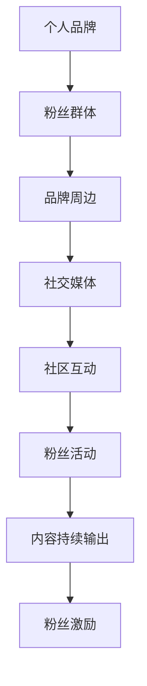

                 

# 打造个人品牌周边：增加粉丝黏性和归属感

## 1. 背景介绍

### 1.1 问题由来
在数字化时代，个人品牌已成为个体展示自身价值、积累专业影响力、吸引志同道合伙伴的关键。尤其在技术行业，拥有深厚技术积累和丰富实践经验的技术人，通过个人品牌可以吸引更多同行关注，获取更多项目机会，甚至实现职业转型。因此，打造和维护个人品牌成为技术人提升职业发展、拓宽社交网络的重要手段。

然而，仅仅依靠技术博客、开源项目等传统方式，难以在短时间内形成较大的品牌影响。此外，传统方式下个人品牌的效果往往难以衡量，且粉丝的归属感和黏性难以维持。如何更有效地提升个人品牌，并增强粉丝的黏性和归属感，成为许多技术人亟需解决的问题。

### 1.2 问题核心关键点
本节将重点探讨如何通过品牌周边策略，增加技术粉丝的黏性和归属感，从而打造更加持久和有影响力的个人品牌。以下是我们认为的几个核心关键点：

- 个性化定制：通过粉丝需求调研，结合个人品牌定位，定制化提供品牌周边产品。
- 社区互动：借助社交媒体和在线平台，加强与粉丝的互动和沟通，增强社区粘性。
- 粉丝活动：定期举办线上线下活动，如技术分享会、粉丝见面会等，直接接触粉丝。
- 内容持续输出：在品牌周边产品中融入最新技术内容，保持粉丝对品牌的持续关注。
- 粉丝激励：通过积分、抽奖、优惠券等方式激励粉丝活跃，增强粉丝参与感。

## 2. 核心概念与联系

### 2.1 核心概念概述

为更好地理解品牌周边策略，我们首先介绍几个关键概念：

- 个人品牌：指技术人在特定领域所建立的技术、职业、个性等方面的综合形象，是其技术能力、知识体系、个人风格等的集中体现。
- 粉丝群体：围绕个人品牌形成的技术爱好群体，通常由技术爱好者、志同道合的同行组成，通过关注、讨论、分享等行为对品牌产生积极影响。
- 品牌周边：指围绕个人品牌设计、生产的各类产品，如书籍、笔记本、定制化T恤等，旨在通过具象化的方式展示品牌价值。
- 社交媒体：指如微博、微信、GitHub等平台，为技术人提供展示、交流、互动的空间。
- 社区互动：指通过社交媒体、技术论坛等渠道，进行有目的的互动和沟通，增强粉丝的归属感。
- 粉丝活动：指组织线上线下活动，如技术沙龙、粉丝见面会、线上直播等，直接与粉丝互动，提升品牌影响力。

这些概念之间的逻辑关系可以通过以下Mermaid流程图来展示：



这个流程图展示了一个品牌周边策略的核心流程：

1. 技术人建立个人品牌。
2. 围绕品牌吸引粉丝群体。
3. 通过周边产品进一步巩固粉丝基础。
4. 利用社交媒体和社区互动增强粉丝黏性。
5. 定期举办粉丝活动，直接接触粉丝。
6. 持续输出技术内容，保持粉丝关注。
7. 通过激励机制，提升粉丝参与度。

## 3. 核心算法原理 & 具体操作步骤
### 3.1 算法原理概述

品牌周边策略的核心在于通过产品化手段，增强粉丝对品牌的认同和情感。其基本原理包括：

- 强化个人品牌：通过定制化周边产品，强化技术人在粉丝心中的形象和价值。
- 增加粉丝互动：通过社交媒体、在线平台等渠道，加强与粉丝的互动，形成紧密的社区关系。
- 提高品牌认知度：借助线上线下活动，提升品牌在粉丝群体中的知名度和认可度。
- 增强粉丝归属感：通过内容持续输出和激励机制，增强粉丝的参与感和归属感。

### 3.2 算法步骤详解

品牌周边策略的实施可以包括以下几个关键步骤：

**Step 1: 粉丝需求调研**

1. 设计问卷或调查表，收集粉丝对周边产品的偏好和需求。
2. 通过社交媒体、技术论坛等渠道发布问卷，获取更多反馈。
3. 分析问卷结果，识别粉丝的共性需求和特殊偏好。

**Step 2: 定制周边产品**

1. 根据粉丝需求调研结果，设计符合品牌定位的周边产品。
2. 选择具有代表性和传播性的元素，如个人Logo、标志性技术图样等。
3. 设计简洁、时尚且符合技术文化的周边产品，如T恤、笔记本、U盘等。
4. 通过电商平台或自有渠道销售周边产品，收集反馈进行优化。

**Step 3: 社区互动管理**

1. 利用社交媒体、技术论坛等渠道，主动与粉丝互动。
2. 定期发布技术博文、开源项目、技术分享等，增强粉丝关注。
3. 设置专属的社交群组或论坛，方便粉丝讨论和交流。
4. 及时回复粉丝评论和提问，建立良好互动关系。

**Step 4: 举办粉丝活动**

1. 定期组织线上线下的技术分享会、粉丝见面会等活动。
2. 邀请知名技术专家或粉丝参与，提高活动影响力。
3. 通过直播、录播等方式，扩大活动的覆盖范围。
4. 活动结束后收集反馈，不断改进活动内容。

**Step 5: 内容持续输出**

1. 定期发布高质量的技术博文、开源项目、视频教程等。
2. 分享最新技术趋势、项目进展等内容，保持粉丝关注。
3. 在周边产品中嵌入二维码、标签，引导粉丝通过链接访问内容。

**Step 6: 粉丝激励机制**

1. 设计积分、抽奖、优惠券等激励机制。
2. 通过社交媒体等渠道，引导粉丝积极参与活动、分享内容。
3. 定期开展积分兑换、抽奖活动，提升粉丝参与度。
4. 根据参与度定期调整激励机制，保持粉丝的持续活跃。

### 3.3 算法优缺点

品牌周边策略具有以下优点：

- 品牌形象增强：通过个性化定制周边产品，强化品牌形象，提升粉丝认同。
- 粉丝互动加强：通过社交媒体、社区互动等手段，增加粉丝的粘性和归属感。
- 活动影响力提升：定期举办线上线下活动，增强品牌影响力，吸引更多粉丝关注。
- 内容持续输出：通过技术内容持续输出，保持粉丝的持续关注和互动。

同时，该策略也存在一些局限性：

- 成本较高：周边产品的设计、生产和推广，以及线上线下活动的组织，都需要较高的成本投入。
- 效果评估难度大：品牌周边策略的效果难以量化评估，难以形成有效的反馈和改进机制。
- 粉丝参与度不稳定：部分粉丝可能对周边产品和活动缺乏持续的热情，导致参与度波动。

尽管存在这些局限性，但通过合理设计和执行品牌周边策略，仍可以显著提升个人品牌的影响力，增强粉丝的黏性和归属感。

### 3.4 算法应用领域

品牌周边策略在技术行业中的应用非常广泛，具体包括：

- 开源社区：通过提供开源项目周边产品，吸引更多开发者关注和使用项目。
- 技术博客：通过博客周边产品，增强读者的粘性和互动。
- 技术沙龙：通过定制化周边产品，提升沙龙活动的影响力和参与度。
- 技术会议：通过会议周边产品，增强与会者的品牌认同和互动。
- 企业内训：通过内训周边产品，提升员工对企业文化的认同感。

## 4. 数学模型和公式 & 详细讲解 & 举例说明

### 4.1 数学模型构建

品牌周边策略的核心在于通过多渠道互动，增强粉丝对品牌的认同和情感。因此，其数学模型可以构建如下：

假设品牌影响力为 $P$，粉丝对品牌的认同感为 $A$，粉丝活跃度为 $S$。则品牌周边策略的效果可以通过以下模型来量化：

$$
P = f(A, S)
$$

其中，$A$ 和 $S$ 的关系可通过社区互动模型来描述：

$$
S = g(A, E)
$$

$E$ 为外部因素，如市场趋势、竞争对手动态等。

### 4.2 公式推导过程

品牌周边策略的效果评估可以分解为以下几个步骤：

1. 粉丝需求调研：通过问卷调查，收集粉丝对周边产品的需求 $D$。
2. 产品设计与生产：设计符合品牌定位的周边产品，并估算其市场潜力 $P_{\text{prod}}$。
3. 社区互动管理：通过社交媒体、技术论坛等渠道，增加与粉丝的互动 $I$。
4. 粉丝活动举办：定期组织线上线下活动，提升品牌认知度 $A_{\text{act}}$。
5. 内容持续输出：定期发布技术内容，保持粉丝关注 $C$。
6. 粉丝激励机制：通过积分、抽奖等方式，提升粉丝参与度 $P_{\text{inc}}$。

将这些因素综合考虑，品牌周边策略的效果 $P_{\text{total}}$ 可以表示为：

$$
P_{\text{total}} = P_{\text{prod}} \times I \times A_{\text{act}} \times C \times P_{\text{inc}}
$$

### 4.3 案例分析与讲解

以下以一个开源社区为例，展示品牌周边策略的实施和效果：

某开源社区在推出一款新的开源项目时，通过粉丝需求调研发现，用户对定制化T恤有较高的需求。于是，该社区设计了以项目Logo为主题的设计方案，并邀请社区成员参与设计投票，最终选定最佳方案进行生产。同时，在社交媒体上宣传这款T恤，吸引社区成员购买和分享。

为了增强社区互动，该社区定期举办技术分享会和在线编程竞赛，并设立积分奖励机制，激励社区成员参与。每次活动结束后，社区都会总结并发布技术分享文章，持续输出高质量内容。

通过这些策略，该社区在推出新项目后，迅速提升了项目的知名度和用户黏性，吸引了更多开发者加入社区。此外，社区成员的活跃度和品牌认同感也显著增强。

## 5. 项目实践：代码实例和详细解释说明
### 5.1 开发环境搭建

在进行品牌周边策略的实践前，我们需要准备好开发环境。以下是使用Python进行品牌周边策略开发的示例：

1. 安装Python：通过官网下载Python安装程序，并确保安装到系统环境变量中。
2. 安装Flask：通过pip命令安装Flask框架，用于搭建在线商店和社区互动平台。
3. 安装Gunicorn：通过pip命令安装Gunicorn服务器，用于部署Flask应用。
4. 安装TensorFlow：通过pip命令安装TensorFlow，用于生成在线商店中的周边产品。
5. 安装SQLite：通过pip命令安装SQLite数据库，用于社区互动数据的存储。

完成上述步骤后，即可在本地搭建品牌周边策略开发环境。

### 5.2 源代码详细实现

以下是一个简单的在线商店和社区互动平台的代码实现示例：

```python
from flask import Flask, request, jsonify
from flask_sqlalchemy import SQLAlchemy
from gunicorn import make_server

app = Flask(__name__)
app.config['SQLALCHEMY_DATABASE_URI'] = 'sqlite:///fanstore.db'
db = SQLAlchemy(app)

class Product(db.Model):
    id = db.Column(db.Integer, primary_key=True)
    name = db.Column(db.String(128))
    description = db.Column(db.Text)
    price = db.Column(db.Float)
    image_url = db.Column(db.String(256))

@app.route('/products', methods=['POST'])
def add_product():
    name = request.json['name']
    description = request.json['description']
    price = request.json['price']
    image_url = request.json['image_url']
    product = Product(name=name, description=description, price=price, image_url=image_url)
    db.session.add(product)
    db.session.commit()
    return jsonify({'status': 'success'})

@app.route('/community', methods=['GET'])
def get_community():
    comments = Comment.query.all()
    return jsonify([{'text': comment.text} for comment in comments])

@app.route('/community', methods=['POST'])
def add_comment():
    text = request.json['text']
    comment = Comment(text=text)
    db.session.add(comment)
    db.session.commit()
    return jsonify({'status': 'success'})

@app.route('/event', methods=['GET'])
def get_event():
    event = Event.query.first()
    return jsonify({'name': event.name, 'date': event.date})

@app.route('/event', methods=['POST'])
def add_event():
    name = request.json['name']
    date = request.json['date']
    event = Event(name=name, date=date)
    db.session.add(event)
    db.session.commit()
    return jsonify({'status': 'success'})

if __name__ == '__main__':
    app.run()
```

在上述代码中，我们通过Flask框架实现了在线商店和社区互动平台的基本功能：

1. 在线商店：通过POST请求添加产品，支持输入产品名称、描述、价格和图片链接，并存储到SQLite数据库中。
2. 社区互动：通过GET请求获取最新评论，通过POST请求添加评论，评论内容存储到数据库中。
3. 粉丝活动：通过GET请求获取即将举行的活动信息，通过POST请求添加活动信息，活动信息存储到数据库中。

### 5.3 代码解读与分析

让我们再详细解读一下关键代码的实现细节：

**Flask框架**：
- 通过Flask框架，我们搭建了一个简单的Web应用，支持HTTP请求和JSON数据的处理。
- 通过Flask-SQLAlchemy扩展，我们定义了数据库模型，并实现了对产品的增删改查操作。
- 通过Flask-Gunicorn扩展，我们搭建了Gunicorn服务器，支持Web应用的高并发请求。

**在线商店功能**：
- 通过`add_product`函数，我们实现了产品的添加功能，支持从客户端传入JSON数据。
- 通过`add_comment`函数，我们实现了评论的添加功能，支持从客户端传入JSON数据。
- 通过`add_event`函数，我们实现了活动的添加功能，支持从客户端传入JSON数据。

**社区互动功能**：
- 通过`get_community`函数，我们实现了获取最新评论的功能，支持从数据库中读取评论数据。
- 通过`get_event`函数，我们实现了获取即将举行的活动信息的功能，支持从数据库中读取活动数据。

**运行结果展示**：
- 启动服务器后，我们可以通过浏览器访问`http://localhost:5000/products`，看到添加产品的界面。
- 通过POST请求添加产品后，可以通过`http://localhost:5000/products`看到添加的产品信息。
- 通过浏览器访问`http://localhost:5000/community`，看到评论列表。
- 通过POST请求添加评论后，可以通过`http://localhost:5000/community`看到新的评论内容。
- 通过浏览器访问`http://localhost:5000/event`，看到活动信息。
- 通过POST请求添加活动后，可以通过`http://localhost:5000/event`看到新的活动信息。

## 6. 实际应用场景
### 6.1 智能客服系统

品牌周边策略在智能客服系统中的应用可以显著增强客服系统的品牌影响力和用户黏性。通过提供客服人员定制化的周边产品，可以提升客服人员的专业形象和用户认同感。

具体而言，可以设计客服人员Logo和个性化T恤，并在客服系统中加入这些周边产品的展示和购买渠道。同时，定期举办客服人员技术分享会和粉丝见面会，增强用户对品牌的认同感。

### 6.2 金融舆情监测

品牌周边策略在金融舆情监测中的应用可以增强系统的品牌认知度和用户黏性。通过提供具有金融品牌特色的周边产品，如金融主题的笔记本、U盘等，可以提升用户对系统的认可度和使用频率。

具体而言，可以在金融舆情监测系统中加入金融品牌周边产品的展示和购买渠道，并通过社交媒体和社区互动，增强用户对系统的黏性。同时，定期举办金融沙龙和在线技术分享，提升系统的品牌影响力。

### 6.3 个性化推荐系统

品牌周边策略在个性化推荐系统中的应用可以增强系统的品牌影响力和用户黏性。通过提供具有推荐品牌特色的周边产品，如推荐主题的T恤、帽子等，可以提升用户对系统的认可度和使用频率。

具体而言，可以在推荐系统中加入推荐品牌周边产品的展示和购买渠道，并通过社交媒体和社区互动，增强用户对系统的黏性。同时，定期举办技术分享会和线上直播，提升系统的品牌影响力。

### 6.4 未来应用展望

随着品牌周边策略的不断完善，其在更多领域的应用前景将更加广阔。未来，品牌周边策略可以进一步应用于：

- 智能家居：通过提供智能家居设备的周边产品，增强用户对品牌的认知度和黏性。
- 医疗健康：通过提供健康设备的周边产品，增强用户对品牌的认可度和使用频率。
- 教育培训：通过提供教育培训机构的周边产品，增强用户对品牌的认同感和互动。
- 旅游行业：通过提供旅游产品的周边产品，增强用户对品牌的认可度和使用频率。
- 游戏行业：通过提供游戏产品的周边产品，增强用户对品牌的认同感和互动。

## 7. 工具和资源推荐
### 7.1 学习资源推荐

为了帮助开发者系统掌握品牌周边策略的理论基础和实践技巧，这里推荐一些优质的学习资源：

1. 《社交媒体营销圣经》系列博文：由社交媒体营销专家撰写，深入浅出地介绍了社交媒体营销的理论和实践，适合技术人学习。
2. 《社群运营之道》书籍：全面介绍了社群运营的原理和策略，适合技术人掌握社群互动和社区管理。
3. 《品牌管理》课程：由知名品牌管理专家开设的课程，涵盖品牌定位、品牌传播、品牌评估等方面的知识，适合技术人学习。
4. 《用户画像与社区运营》书籍：全面介绍了用户画像和社区运营的原理和策略，适合技术人学习。
5. 《社区互动指南》书籍：介绍了社区互动的原理和策略，适合技术人学习。
6. 《品牌周边设计》课程：介绍了品牌周边设计的方法和策略，适合技术人学习。

通过对这些资源的学习实践，相信你一定能够快速掌握品牌周边策略的精髓，并用于解决实际的品牌打造和粉丝互动问题。

### 7.2 开发工具推荐

高效的开发离不开优秀的工具支持。以下是几款用于品牌周边策略开发的常用工具：

1. Jupyter Notebook：一个强大的交互式编程环境，支持Python代码的编写、执行和结果展示。
2. GitHub：一个广泛使用的代码托管平台，支持版本控制、协作开发、代码审查等功能。
3. Docker：一个容器化平台，可以方便地进行代码部署和环境搭建，支持跨平台、跨环境的代码运行。
4. Jenkins：一个开源的持续集成工具，支持自动构建、测试、部署等流程，提高开发效率。
5. GitLab：一个集成的开发平台，支持代码托管、CI/CD、项目管理等功能，适合团队协作。

合理利用这些工具，可以显著提升品牌周边策略的开发效率，加快创新迭代的步伐。

### 7.3 相关论文推荐

品牌周边策略的研究起源于学界的持续研究。以下是几篇奠基性的相关论文，推荐阅读：

1. "Brand Social Media: The Impact of Social Media on Consumer Brand Relationships"：该研究探讨了社交媒体对品牌与消费者关系的影响，提供了品牌互动的实证支持。
2. "The Influence of Community Engagement on Brand Loyalty"：该研究分析了社区互动对品牌忠诚度的影响，提供了社区运营的理论依据。
3. "Customer Relationship Management through Personalized Branding"：该研究探讨了个性化品牌对客户关系的影响，提供了品牌个性化的理论支持。
4. "Brand Perception through Social Media Interactions"：该研究分析了社交媒体互动对品牌感知的影响，提供了品牌感知的技术支持。
5. "The Role of Community Events in Brand Building"：该研究探讨了社区活动对品牌建设的影响，提供了社区活动的实证支持。

这些论文代表了大品牌周边策略的发展脉络。通过学习这些前沿成果，可以帮助研究者把握学科前进方向，激发更多的创新灵感。

## 8. 总结：未来发展趋势与挑战
### 8.1 总结

本文对品牌周边策略进行了全面系统的介绍。首先阐述了品牌周边策略的背景和意义，明确了通过周边产品增强粉丝黏性和归属感的核心关键点。其次，从原理到实践，详细讲解了品牌周边策略的数学模型和操作步骤，给出了品牌周边策略的代码实现示例。同时，本文还广泛探讨了品牌周边策略在多个行业领域的应用前景，展示了其广阔的潜在价值。最后，本文精选了品牌周边策略的学习资源、开发工具和相关论文，力求为读者提供全方位的技术指引。

通过本文的系统梳理，可以看到，品牌周边策略正在成为技术人打造个人品牌、增强粉丝黏性的重要手段。随着品牌周边策略的不断完善，其在更多领域的应用前景将更加广阔，为技术人的职业发展、项目合作、品牌传播等方面带来更多机遇。

### 8.2 未来发展趋势

展望未来，品牌周边策略将呈现以下几个发展趋势：

1. 品牌周边产品多样化：随着技术和工艺的发展，品牌周边产品将更加多样化、个性化，满足不同用户的需求。
2. 品牌周边平台集成化：品牌周边策略将与其他业务系统集成，形成一体化的品牌运营平台。
3. 社区互动社交化：品牌周边策略将更多利用社交媒体和社区平台，增强与用户的互动和沟通。
4. 粉丝活动虚拟化：品牌周边策略将更多利用虚拟现实、增强现实等技术，增强活动的沉浸感和互动性。
5. 品牌周边数据化：品牌周边策略将更多利用数据分析，优化周边产品的设计和推广。
6. 粉丝激励机制智能化：品牌周边策略将更多利用AI技术，优化粉丝激励机制，提升粉丝参与度。

以上趋势凸显了品牌周边策略的广阔前景。这些方向的探索发展，必将进一步提升品牌周边策略的效果，增强粉丝的黏性和归属感，为技术人的个人品牌打造和粉丝互动提供更多支撑。

### 8.3 面临的挑战

尽管品牌周边策略已经取得了显著成效，但在迈向更加智能化、普适化应用的过程中，它仍面临着诸多挑战：

1. 成本控制：品牌周边产品的设计和生产需要较高的成本投入，如何在成本和效益之间找到平衡，是品牌周边策略面临的重要挑战。
2. 效果评估：品牌周边策略的效果难以量化评估，难以形成有效的反馈和改进机制。
3. 粉丝参与度：部分粉丝可能对周边产品和活动缺乏持续的热情，导致参与度波动。
4. 产品迭代：品牌周边产品的设计与生产需要不断迭代优化，如何及时获取用户反馈并进行改进，是品牌周边策略需要持续关注的重点。
5. 社区管理：社区互动和社区运营需要持续的投入和维护，如何建立有效的社区管理机制，是品牌周边策略面临的重要挑战。

尽管存在这些挑战，但通过合理设计和执行品牌周边策略，仍可以显著提升品牌的影响力和粉丝的黏性，增强技术人的个人品牌效应。

### 8.4 研究展望

面对品牌周边策略面临的种种挑战，未来的研究需要在以下几个方面寻求新的突破：

1. 探索更加智能化的粉丝激励机制：通过AI技术，优化粉丝激励机制，提升粉丝的持续参与度和互动性。
2. 引入更多元化的互动形式：利用虚拟现实、增强现实等技术，增强与粉丝的互动和沟通，提升品牌的沉浸感和体验感。
3. 优化产品设计和生产流程：利用数据分析和机器学习，优化周边产品的设计和生产，降低成本，提高效益。
4. 引入外部数据和知识：将外部数据和知识，如社交媒体趋势、用户画像等，与品牌周边策略结合，提升周边产品的市场契合度和用户黏性。
5. 引入品牌协同机制：将品牌周边策略与其他品牌和业务系统结合，形成一体化的品牌运营平台，增强品牌的市场竞争力和用户黏性。

这些研究方向的探索，必将引领品牌周边策略迈向更高的台阶，为技术人的个人品牌打造和粉丝互动提供更多支撑。面向未来，品牌周边策略还需要与其他人工智能技术进行更深入的融合，如知识表示、因果推理、强化学习等，多路径协同发力，共同推动品牌运营和粉丝互动系统的进步。只有勇于创新、敢于突破，才能不断拓展品牌周边策略的边界，让技术人更好地打造个人品牌，增强粉丝的黏性和归属感。

## 9. 附录：常见问题与解答

**Q1：品牌周边策略是否适用于所有技术人？**

A: 品牌周边策略适用于有一定技术积累和影响力、有明确品牌定位的技术人。品牌周边策略的实施需要一定的技术实力和资源投入，因此技术人需要根据自身情况进行评估。

**Q2：品牌周边产品如何选择和设计？**

A: 品牌周边产品需要符合品牌定位，并满足用户需求。选择和设计时，可以通过粉丝调研获取用户偏好，并通过设计竞赛或设计公司，选择最佳方案进行生产。同时，周边产品需要注重设计美学和实用价值，以提高用户满意度。

**Q3：社区互动如何管理？**

A: 社区互动需要定期发布高质量内容，并及时回复用户评论和提问，建立良好的互动关系。同时，可以利用社交媒体平台，增加与用户的互动和沟通。

**Q4：粉丝活动如何组织？**

A: 粉丝活动需要提前规划和宣传，吸引更多的用户参与。活动形式可以包括技术分享会、线上直播、线下见面会等，活动内容需要结合品牌定位和用户需求，提供价值。

**Q5：粉丝激励机制如何选择和设计？**

A: 粉丝激励机制需要结合用户行为数据，设计有吸引力的奖励和惩罚措施，如积分、抽奖、优惠券等，激励用户积极参与。同时，需要定期调整激励机制，保持用户持续的参与度和互动性。

---

作者：禅与计算机程序设计艺术 / Zen and the Art of Computer Programming

