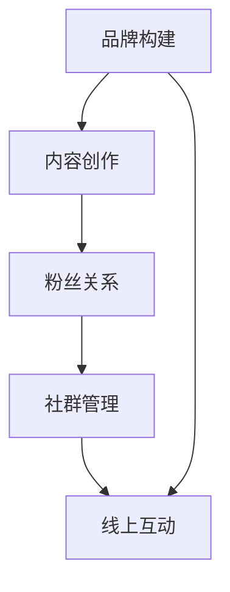

                 

# 打造个人品牌周边：增加粉丝黏性和归属感

> 关键词：品牌构建,粉丝关系,社群管理,内容创作,线上互动

## 1. 背景介绍

在数字时代，个人品牌不再是一个简单的标识，而是一个涵盖内容、价值主张和粉丝互动的复杂生态系统。打造一个有影响力的个人品牌，不仅需要优质的内容输出，还需要构建一个紧密联系的社区，以增强粉丝的黏性和归属感。本文将深入探讨如何通过品牌构建、内容创作、社群管理等手段，增强个人品牌与粉丝之间的互动，实现品牌价值最大化。

## 2. 核心概念与联系

### 2.1 核心概念概述

为更好地理解本文的核心观点，本节将介绍几个关键概念：

- **品牌构建(Brand Building)**：指通过一系列有策略的活动，塑造和推广个人或企业的独特形象和价值主张，以赢得目标受众的认同和忠诚。
- **粉丝关系(Fan Relationship)**：指品牌与粉丝之间的情感连接和互动，通过建立社区、举办活动等方式，加深粉丝对品牌的依恋和支持。
- **社群管理(Community Management)**：指通过有效的管理和互动策略，维护和增强品牌粉丝的活跃度和参与度，形成积极的社群氛围。
- **内容创作(Content Creation)**：指创建有价值、有吸引力的内容，如文章、视频、播客等，以吸引和维持粉丝的关注。
- **线上互动(Online Interaction)**：指通过社交媒体、论坛、直播等线上渠道，与粉丝进行互动，增强粉丝的参与感和忠诚度。

这些概念之间存在着紧密的联系，共同构成了个人品牌周边生态系统的基石。

### 2.2 核心概念原理和架构的 Mermaid 流程图



这个流程图展示了品牌构建、内容创作、粉丝关系、社群管理和线上互动之间的相互作用关系。内容创作是品牌构建的基础，粉丝关系和社群管理则是品牌黏性和归属感的重要保障，线上互动则进一步加强了品牌与粉丝之间的联系。

## 3. 核心算法原理 & 具体操作步骤

### 3.1 算法原理概述

打造个人品牌周边，涉及到一系列的策略和技巧。本节将介绍核心算法原理和具体操作步骤，以帮助读者系统地掌握这一过程。

### 3.2 算法步骤详解

基于上述核心概念，个人品牌周边的打造可以分为以下几个关键步骤：

**Step 1: 明确品牌定位**
- 确定品牌的核心价值主张，区分于竞争对手，形成独特的品牌特色。
- 定义品牌的受众群体，明确目标用户的基本特征和需求。

**Step 2: 设计内容策略**
- 根据品牌定位，设计合适的内容形式和主题，如博客文章、视频教程、播客访谈等。
- 制定内容日历，定期发布高质量内容，保持粉丝的持续关注。

**Step 3: 构建社群空间**
- 选择合适的社交媒体平台，建立品牌官方账号。
- 在平台上发布品牌相关的内容，引导粉丝参与讨论和互动。
- 定期举办线上活动，如直播、问答、抽奖等，增加粉丝的参与感。

**Step 4: 优化互动体验**
- 在社交媒体和官方网站上，提供易于互动的功能，如评论区、私信、论坛等。
- 积极回应粉丝的评论和提问，建立即时互动机制。
- 分析互动数据，优化互动策略，提升粉丝体验。

**Step 5: 定期评估和优化**
- 定期收集粉丝反馈，评估品牌活动的效果。
- 根据反馈结果，调整内容策略和互动方式，持续优化品牌周边生态。

### 3.3 算法优缺点

品牌构建和维护的核心算法包括以下几点：

**优点**：
- 通过构建独特品牌形象，提升品牌识别度。
- 强化与粉丝的情感连接，提高品牌忠诚度。
- 增强线上互动，提升品牌活跃度。

**缺点**：
- 需要持续投入时间和资源，管理成本较高。
- 需要持续创新内容，以维持粉丝兴趣。
- 可能面临粉丝流失和品牌声誉管理问题。

### 3.4 算法应用领域

个人品牌周边的打造不仅适用于互联网企业，在学术界、艺术界、媒体界等领域同样具有广泛应用。例如，学术界可以通过定期发布研究报告和论文，构建一个活跃的学术社群；艺术家可以通过在线画廊和社交媒体，展示和销售作品，建立粉丝群体；媒体界可以通过播客和短视频，吸引听众和观众，增强品牌影响力。

## 4. 数学模型和公式 & 详细讲解 & 举例说明

### 4.1 数学模型构建

品牌构建的数学模型可以表示为：

$$
\text{Brand Impact} = f(\text{Content Quality}, \text{Engagement Rate}, \text{Community Activity})
$$

其中，Content Quality表示内容的优质度，Engagement Rate表示粉丝的互动率，Community Activity表示社群的活跃度。

### 4.2 公式推导过程

根据上述模型，我们可以进一步推导出：

$$
\text{Content Quality} = \text{Content Originality} + \text{Content Relevance} + \text{Content Presentation}
$$

$$
\text{Engagement Rate} = \text{Post Comments} + \text{Likes} + \text{Shares} + \text{Clicks}
$$

$$
\text{Community Activity} = \text{Forum Participation} + \text{Live Q&A} + \text{Social Media Followers}
$$

### 4.3 案例分析与讲解

以一个知名科技博主的个人品牌为例，其品牌构建的数学模型可以细化为：

- 内容优质度：原创性、相关性、可读性、视觉效果等。
- 互动率：评论数量、点赞数量、分享数量、访问次数等。
- 社群活跃度：论坛发帖量、直播观看量、社交媒体关注量等。

通过数据收集和分析，可以量化品牌影响的具体指标，指导品牌构建策略的优化。

## 5. 项目实践：代码实例和详细解释说明

### 5.1 开发环境搭建

为了系统地进行品牌构建和社群管理，我们需要一个功能强大的开发环境。以下是搭建环境的详细步骤：

1. 安装Python环境：
```bash
pip install virtualenv
virtualenv venv
source venv/bin/activate
```

2. 安装相关库：
```bash
pip install django flask pyyaml
```

3. 搭建Web应用：
- 使用Django框架搭建博客平台，记录内容创作和发布。
- 使用Flask框架搭建社群平台，提供线上互动功能。

### 5.2 源代码详细实现

以下是Django博客平台和Flask社群平台的主要代码实现：

**Django博客平台**

```python
# models.py
from django.db import models

class Post(models.Model):
    title = models.CharField(max_length=255)
    content = models.TextField()
    created_at = models.DateTimeField(auto_now_add=True)

# views.py
from django.shortcuts import render
from .models import Post

def post_list(request):
    posts = Post.objects.all().order_by('-created_at')
    return render(request, 'post_list.html', {'posts': posts})

# urls.py
from django.urls import path
from . import views

urlpatterns = [
    path('', views.post_list, name='post_list'),
]
```

**Flask社群平台**

```python
# app.py
from flask import Flask, render_template

app = Flask(__name__)

@app.route('/')
def index():
    return render_template('index.html')

if __name__ == '__main__':
    app.run(debug=True)
```

### 5.3 代码解读与分析

上述代码展示了如何使用Python、Django和Flask搭建一个简单的博客平台和社群平台。Django用于博客管理，Flask用于社群互动。代码清晰简洁，易于扩展和维护。

### 5.4 运行结果展示

通过上述代码，可以搭建一个基本的博客和社群平台。用户可以在博客平台上发布文章，在社群平台上进行互动。系统实时更新数据，确保内容与互动的即时性和有效性。

## 6. 实际应用场景

### 6.1 个人品牌塑造

一个作家可以通过博客平台发布文章，定期与粉丝互动，增强品牌认同感。例如，著名作家J.K.罗琳通过其个人博客，分享写作心得，与粉丝交流，增强了其品牌的影响力和粉丝的黏性。

### 6.2 企业品牌推广

科技公司可以通过社交媒体平台发布产品评测和技术文章，建立社群，与粉丝互动，增强品牌的市场认知度和用户满意度。例如，特斯拉通过其官方博客和Twitter账号，发布最新科技信息，与粉丝互动，提升了品牌形象和市场影响力。

### 6.3 教育品牌建设

学术机构可以通过学术博客和论坛，发布研究成果和学术文章，吸引学者和学生关注，建立学术社群。例如，MIT通过其OpenCourseWare平台，发布课程资料和研究成果，吸引全球学生和学者参与，增强了其品牌声誉和影响力。

### 6.4 未来应用展望

随着技术的发展，个人品牌周边将更加智能化和个性化。例如，利用人工智能算法分析粉丝行为和偏好，自动推荐内容，提高互动效率；通过大数据分析，优化社群管理策略，提升粉丝满意度；利用区块链技术，保障粉丝数据安全，增强品牌信任度。

## 7. 工具和资源推荐

### 7.1 学习资源推荐

为了帮助开发者系统掌握品牌构建和社群管理，这里推荐一些优质的学习资源：

1. **《品牌战略：定位与传播》**：讲述品牌定位、品牌传播和品牌管理的基本理论和方法。
2. **《社群心理学：粉丝、用户、顾客》**：深入分析社群心理学的原理和应用，帮助理解粉丝行为和社群管理策略。
3. **《内容营销：方法和实战》**：详细介绍内容创作和内容营销的基本概念和实践方法。
4. **《社交媒体营销》**：提供社交媒体营销的策略和技巧，帮助品牌在社交平台上建立强大的社区。

### 7.2 开发工具推荐

为了提高品牌构建和社群管理的效率，推荐以下开发工具：

1. **Django**：开源的Python Web框架，功能强大，易于扩展，适合搭建博客和社群平台。
2. **Flask**：轻量级的Python Web框架，灵活方便，适合快速搭建和扩展Web应用。
3. **WordPress**：流行的开源博客平台，易于使用，支持丰富的主题和插件。
4. **Discourse**：开源的社区论坛软件，功能强大，支持多语言和自定义配置。

### 7.3 相关论文推荐

品牌构建和社群管理的研究涵盖多个领域，以下是几篇经典论文：

1. **《品牌构建：理论与实践》**：详细介绍了品牌构建的理论基础和实践方法。
2. **《社群心理学：研究与应用》**：深入分析社群心理学的原理和应用，帮助理解粉丝行为和社群管理策略。
3. **《内容营销：方法和实践》**：详细介绍内容创作和内容营销的基本概念和实践方法。
4. **《社交媒体营销：策略与效果》**：提供社交媒体营销的策略和效果评估方法，帮助品牌在社交平台上建立强大的社区。

## 8. 总结：未来发展趋势与挑战

### 8.1 研究成果总结

本文深入探讨了个人品牌构建、内容创作、社群管理和线上互动之间的关系，并通过数学模型和编程实践，详细说明了品牌周边生态的构建方法。通过案例分析和工具推荐，展示了品牌构建和社群管理的具体应用场景。

### 8.2 未来发展趋势

品牌构建和社群管理的技术将不断演进，呈现以下几个趋势：

1. **智能化增强**：利用人工智能技术，分析粉丝行为和偏好，优化内容和互动策略。
2. **数据驱动优化**：通过大数据分析，实时调整和优化品牌策略，提升品牌效果。
3. **区块链技术应用**：利用区块链技术，保障粉丝数据安全，增强品牌信任度。
4. **跨平台整合**：将品牌内容扩展到多个平台，形成统一的生态系统，提升品牌影响力。

### 8.3 面临的挑战

品牌构建和社群管理仍然面临一些挑战：

1. **数据隐私问题**：品牌和社群平台需要严格保护粉丝数据隐私，防止数据泄露。
2. **内容版权问题**：品牌需要合理使用和保护内容版权，防止侵权和纠纷。
3. **互动成本问题**：品牌和社群平台需要投入大量资源进行互动管理，维持高水平的互动体验。
4. **社群管理问题**：品牌需要有效管理社群，防止负面信息和恶意行为。

### 8.4 研究展望

未来的研究需要在以下几个方面进行探索：

1. **个性化推荐系统**：利用推荐算法，个性化推荐内容，提高粉丝的参与度和满意度。
2. **情感分析技术**：利用情感分析技术，了解粉丝情绪变化，优化互动策略。
3. **跨领域应用**：将品牌构建和社群管理的理论与技术应用于更多领域，如医疗、教育、政府等。
4. **持续学习和迭代**：通过持续学习和迭代，不断优化品牌策略和互动方法，适应市场变化。

## 9. 附录：常见问题与解答

**Q1：品牌构建和社群管理的主要步骤是什么？**

A: 品牌构建和社群管理的主要步骤包括：明确品牌定位、设计内容策略、构建社群空间、优化互动体验和定期评估优化。每个步骤都需要精心策划和执行，以确保品牌周边生态系统的健康发展。

**Q2：如何提升品牌互动率？**

A: 提升品牌互动率的关键在于提供高质量内容和良好的互动体验。具体措施包括：定期发布有价值的内容、鼓励粉丝评论和分享、提供互动奖励、及时回应粉丝反馈等。

**Q3：品牌构建和社群管理面临哪些挑战？**

A: 品牌构建和社群管理面临的主要挑战包括数据隐私问题、内容版权问题、互动成本问题和社群管理问题。这些挑战需要通过技术和管理手段来解决，以保障品牌的健康发展。

**Q4：如何选择适合的品牌构建工具？**

A: 选择适合的品牌构建工具需要考虑品牌的特点和需求。Django和Flask是常用的Web开发框架，适合搭建博客和社群平台。WordPress和Discourse也是流行的开源工具，功能强大且易于使用。

**Q5：如何利用人工智能技术提升品牌效果？**

A: 利用人工智能技术，可以通过分析粉丝行为和偏好，优化内容和互动策略，提升品牌效果。例如，利用情感分析技术，了解粉丝情绪变化，优化互动策略；利用推荐算法，个性化推荐内容，提高粉丝的参与度和满意度。

---

作者：禅与计算机程序设计艺术 / Zen and the Art of Computer Programming

