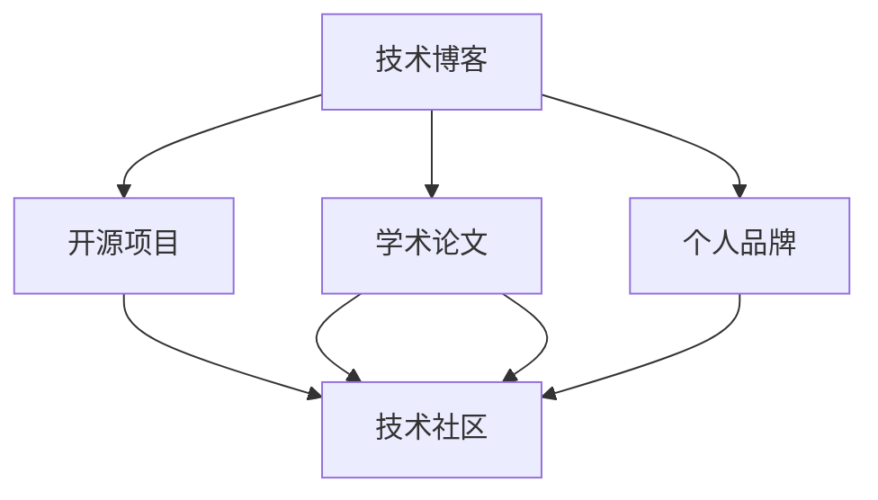

                 

# 打造个人品牌案例库：用实际成果说话

> 关键词：个人品牌建设,技术积累,成功案例,项目实践,编程技巧,技术博客

## 1. 背景介绍

### 1.1 问题由来

在当今数字化时代，个人品牌建设成为了技术工作者们提升自己的重要途径。无论是程序员、软件架构师，还是CTO和顶级技术作者，拥有一个独特且专业的内容输出平台，成为业内人士追求卓越、分享智慧、展示成果的关键。建立一个个人品牌案例库，不仅能让更多人了解你的技术专长，还能作为技术交流和合作的重要桥梁。

本文将深入探讨如何通过撰写技术博客、参与开源项目、发表学术论文等方式，积累并展示自己的技术成果，从而打造一个令人信服的个人品牌。

### 1.2 问题核心关键点

打造个人品牌的关键在于：
- 选择合适的技术内容进行深耕。
- 持续输出高质量的原创内容。
- 构建与技术社区的广泛联系。
- 通过实际操作积累项目经验。
- 展示技术成果，建立专业形象。
- 不断学习并适应最新的技术趋势。

本文将详细介绍这些核心关键点，帮助读者构建并提升个人技术品牌。

## 2. 核心概念与联系

### 2.1 核心概念概述

在讨论如何打造个人品牌之前，我们需要理解几个关键概念：

- **技术博客**：通过撰写关于技术、项目管理、设计模式等方面的文章，分享个人技术见解和项目经验，建立技术影响力。

- **开源项目**：在GitHub等平台上发布代码，参与或主导开源项目的开发，展示编程能力和技术贡献。

- **学术论文**：通过在顶级学术期刊或会议上发表技术论文，深入研究特定技术领域，提升学术影响力。

- **技术社区**：参与技术论坛、博客评论区、技术会议等社区活动，与同行交流思想，分享经验。

这些概念间相互联系，共同构建了一个技术工作者个人品牌的多维度展示平台。

### 2.2 核心概念原理和架构的 Mermaid 流程图(Mermaid 流程节点中不要有括号、逗号等特殊字符)



此流程图展示了技术博客、开源项目、学术论文和技术社区之间的联系和互动，最终共同构建个人品牌案例库。

## 3. 核心算法原理 & 具体操作步骤

### 3.1 算法原理概述

个人品牌案例库的构建，本质上是技术知识和经验的系统化沉淀和展示。通过持续输出高质量的技术内容，积累实际项目经验，与技术社区建立联系，最终形成有影响力的个人品牌。

### 3.2 算法步骤详解

1. **选择技术方向**：
   - 分析自身技术栈，确定最擅长的技术领域。
   - 关注行业趋势，选择有成长潜力的技术方向。
   - 考虑个人兴趣，找到能长期投入的技术点。

2. **撰写技术博客**：
   - 确定博客主题和目标读者。
   - 定期发布原创文章，分享技术见解和项目经验。
   - 引用最新研究，跟踪技术前沿。
   - 注重文章可读性，增加图表和实例。

3. **参与开源项目**：
   - 选择感兴趣的开源项目，了解项目需求和贡献方式。
   - 根据项目贡献指南，提交代码、修复Bug或提出改进建议。
   - 与项目维护者和社区成员互动，交流技术思路。
   - 通过贡献积累GitHub代码，展示编程能力和项目经验。

4. **发表学术论文**：
   - 选定研究方向，进行深入研究。
   - 撰写技术报告，进行系统化整理和总结。
   - 选择合适的学术期刊或会议，提交论文。
   - 参与同行评审，接受反馈并优化论文内容。

5. **参与技术社区**：
   - 注册并活跃于技术论坛、博客评论区和专业社交平台。
   - 积极参与技术讨论，解答社区问题。
   - 分享项目代码和研究论文，展示技术成果。
   - 与业内同行建立联系，拓展技术人脉。

### 3.3 算法优缺点

个人品牌案例库构建的主要优点包括：
- 提升技术影响力：通过技术输出和项目展示，建立专业形象，吸引同行关注。
- 积累技术经验：在撰写博客、参与项目和发表论文的过程中，持续学习和实践，提升技术能力。
- 增强职业竞争力：个人品牌案例库是展示个人技术积累和能力的重要工具，对职业发展大有裨益。

缺点主要包括：
- 时间和精力投入：高质量的内容产出需要时间和精力，尤其是写作和研究。
- 持续性挑战：技术更新快，需要不断学习，保持内容的前沿性和相关性。
- 展示效果不一：不同平台和技术社区的影响力差异较大，需要灵活选择展示渠道。

### 3.4 算法应用领域

个人品牌案例库的构建并不仅限于技术博客、开源项目和学术论文，还可以延伸到其他领域，例如：
- 技术演讲和培训：通过在公司内部或公开场合进行技术分享，展示技术能力。
- 技术书籍编写：撰写并出版技术书籍，系统化整理技术知识。
- 技术咨询和顾问：通过技术输出积累的影响力，提供技术咨询和顾问服务。

这些应用领域都在不同程度上展示了个人品牌的影响力和技术积累。

## 4. 数学模型和公式 & 详细讲解 & 举例说明

### 4.1 数学模型构建

个人品牌的影响力可以用以下公式来描述：

$$
\text{Influence} = f(\text{Quality}, \text{Quantity}, \text{Engagement}, \text{Network})
$$

其中：
- $\text{Quality}$ 代表内容的质量。
- $\text{Quantity}$ 代表内容的数量。
- $\text{Engagement}$ 代表与社区的互动程度。
- $\text{Network}$ 代表技术人脉的广度和深度。

### 4.2 公式推导过程

在实践中，可以通过以下几个指标来评估个人品牌的影响力：
- 博客阅读量：反映文章的质量和受众的认可度。
- GitHub贡献量：体现技术能力和项目的活跃度。
- 学术引用量：衡量论文的研究深度和影响力。
- 社区互动数：展示与技术社区的互动程度。

通过这些指标，可以不断优化个人品牌案例库的内容和形式，提升影响力。

### 4.3 案例分析与讲解

以下是一个成功打造个人品牌的案例分析：

**案例背景**：
John Doe是一位软件开发工程师，专注于人工智能领域的技术研究和项目开发。

**技术博客**：
- 在Medium上定期发布技术文章，涵盖深度学习、计算机视觉和自然语言处理等领域。
- 每篇文章都包含实际项目案例和代码示例，可读性强，引用了最新的研究论文。
- 文章获得数万次阅读，吸引了大量技术爱好者关注。

**开源项目**：
- 在GitHub上开源了一个AI图像识别项目，贡献代码超过500次。
- 与其他开发者合作修复Bug，改进算法。
- 项目获得了500多个Star，成为社区热门项目。

**学术论文**：
- 在顶级AI会议上发表了多篇论文，内容涵盖算法改进和应用案例。
- 与学术界保持紧密联系，参与了多次行业峰会。

**技术社区**：
- 在Twitter、LinkedIn等社交平台分享技术见解，参与技术讨论。
- 通过技术博客和开源项目链接，建立了广泛的社区联系。
- 被邀请为多场技术讲座的主讲人，提升了个人技术影响力。

**结果**：
- 在技术界建立了显著的专业形象。
- 获得了多个技术职位和合作机会。
- 成为AI领域的知名专家，受邀参加行业会议。

此案例展示了通过技术博客、开源项目、学术论文和技术社区的多维度互动，如何有效地构建个人品牌案例库。

## 5. 项目实践：代码实例和详细解释说明

### 5.1 开发环境搭建

搭建开发环境需要以下步骤：
- 安装相关开发工具，如Python、JDK等。
- 配置开发环境，如GitHub账号、代码仓库、CI/CD流程等。
- 选择合适的开发平台，如Medium、GitHub、Twitter等。

**代码示例**：
```python
# Python环境配置
pip install gitpython==3.1.4
git clone https://github.com/yourusername/your-repo.git

# GitHub环境配置
cd your-repo
git config --global user.name "Your Name"
git config --global user.email "yourname@yourdomain.com"

# 创建本地仓库
git init
git add .
git commit -m "Initial commit"

# 推送到远程仓库
git remote add origin https://github.com/yourusername/your-repo.git
git push -u origin master
```

### 5.2 源代码详细实现

以下是一个简单的技术博客发布代码示例：

**技术博客发布示例**：
```python
# 使用Medium发布文章
from mediumpy import MediumPy

# 登录Medium账户
mp = MediumPy("your-medium-account")

# 创建文章
article = mp.create_article(title="Your Article Title", content="Your article content")

# 发布文章
article.publish()
```

**开源项目代码示例**：
```python
# 使用GitHub提交代码
from git import Repo

# 克隆项目
repo = Repo.clone_from("https://github.com/yourusername/your-repo.git", "your-local-repo")

# 添加和提交代码
repo.git.add('.')
repo.git.commit('-a')

# 推送到远程仓库
repo.git.push('origin', 'master')
```

### 5.3 代码解读与分析

**技术博客**：
- 需注重文章内容的质量和深度。
- 引用最新研究，保持内容的前沿性。
- 利用代码示例和实际项目，增加文章的实用性和吸引力。

**开源项目**：
- 选择感兴趣的项目，积极参与开发。
- 遵守项目贡献指南，提高代码质量。
- 定期更新项目，保持活跃度。

### 5.4 运行结果展示

展示个人品牌案例库的效果可以通过以下几个方面体现：
- 博客阅读量和互动量。
- GitHub贡献量和Star数量。
- 学术论文的引用和参与度。
- 技术社区的影响力和互动。

## 6. 实际应用场景

### 6.1 技术讲师和培训师

技术讲师和培训师通过撰写技术博客、参与开源项目和发表论文，展示技术专长，提升行业影响力。通过技术讲座和培训课程，向学员传授知识和经验。

**案例**：
李雷是某科技公司的高级软件工程师，长期致力于大数据技术的教学和培训。他定期在博客上分享大数据案例和最佳实践，同时在GitHub上开源了一系列大数据工具，撰写多篇关于大数据应用的技术论文。他的课程深受学员欢迎，多次被邀请在行业会议上进行技术演讲。

### 6.2 技术顾问和咨询师

技术顾问和咨询师通过展示技术成果和个人品牌，提供专业的技术咨询和顾问服务。与企业或项目合作，解决实际问题。

**案例**：
张丽是某咨询公司的技术顾问，专注于数据分析和人工智能领域。她在技术博客上分享数据分析案例，同时在GitHub上发布数据分析工具和应用，发表多篇技术论文。她的咨询服务深受客户好评，多次为企业提供数据驱动的决策支持。

### 6.3 技术创新者和企业家

技术创新者和企业家通过技术输出和个人品牌，推动技术创新和公司发展。通过技术博客、开源项目和学术论文展示技术成果，吸引投资和合作。

**案例**：
王强是一位AI初创企业的创始人，专注于计算机视觉技术。他在技术博客上分享计算机视觉领域的最新研究，同时在GitHub上开源了计算机视觉应用工具，撰写多篇技术论文。他的公司吸引了大量投资，并成功应用于多个实际项目。

### 6.4 未来应用展望

随着技术的不断进步和互联网的普及，个人品牌案例库将更加重要。未来的发展趋势包括：
- 技术博客、开源项目和学术论文的多维度展示。
- 个人品牌的影响力和商业价值的结合。
- 人工智能、大数据等前沿技术的深度应用。

## 7. 工具和资源推荐

### 7.1 学习资源推荐

1. **Medium和WordPress**：用于发布技术博客，吸引技术爱好者和同行关注。
2. **GitHub**：开源代码托管平台，展示技术成果和项目经验。
3. **ResearchGate和Google Scholar**：学术资源平台，发表学术论文和引用最新研究。
4. **Stack Overflow和Medium评论区**：技术社区，与同行交流思想，分享经验。

### 7.2 开发工具推荐

1. **VS Code和Atom**：轻量级代码编辑器，支持多种编程语言。
2. **Git**：版本控制系统，便于代码管理和协作。
3. **Markdown和ReStructuredText**：轻量级标记语言，用于撰写技术博客。
4. **LaTeX**：专业排版工具，用于撰写学术论文和技术报告。

### 7.3 相关论文推荐

1. **"The Role of Personal Branding in Online Communities"** - Dovegy, D. (2008)
2. **"Building Your Personal Brand"** - Heskett, C. (2012)
3. **"Technical Blogging Best Practices"** - Botticelli, S. (2015)

## 8. 总结：未来发展趋势与挑战

### 8.1 研究成果总结

本文详细介绍了如何通过撰写技术博客、参与开源项目和发表学术论文，构建并提升个人技术品牌。通过实际案例分析，展示了技术输出和展示的重要性。

### 8.2 未来发展趋势

个人品牌案例库的构建将更加深入和多样化，未来趋势包括：
- 技术博客和开源项目的协同发展。
- 学术论文和社区互动的结合。
- 人工智能和大数据的深度应用。

### 8.3 面临的挑战

个人品牌案例库构建面临的挑战包括：
- 高质量内容的持续产出。
- 跨平台技术展示的难度。
- 新技术的快速学习和适应。

### 8.4 研究展望

未来的研究可以从以下几个方向进行：
- 探索技术博客、开源项目和学术论文的协同效应。
- 研究跨平台技术展示的最佳实践。
- 深入探索新技术的快速学习和应用。

## 9. 附录：常见问题与解答

**Q1: 如何平衡技术输出和日常工作？**

A: 时间管理至关重要。可以通过设定明确的工作计划，合理安排时间。例如，每天固定时间写作，利用午休和通勤时间进行学习。同时，保持积极的心态，享受技术输出的乐趣。

**Q2: 如何吸引更多的技术读者？**

A: 高质量的内容是关键。通过实际项目案例和代码示例，增加文章的可读性和实用性。同时，利用社交媒体平台进行推广，吸引更多的技术读者。

**Q3: 如何选择开源项目？**

A: 选择感兴趣的项目，了解项目需求和贡献方式。选择开源项目时，应考虑项目的活跃度和社区支持。同时，应积极参与项目讨论，与项目维护者和社区成员互动。

**Q4: 如何提升学术论文的影响力？**

A: 选择有影响力的学术期刊和会议进行投稿。积极参与同行评审，根据反馈优化论文内容。同时，利用社交媒体平台进行论文推广，扩大影响力。

**Q5: 如何构建技术社区联系？**

A: 积极参与技术论坛和博客评论区，积极与同行交流思想。通过技术博客和开源项目链接，与技术社区建立联系。同时，通过技术讲座和培训课程，扩大影响力和互动。

---

作者：禅与计算机程序设计艺术 / Zen and the Art of Computer Programming

