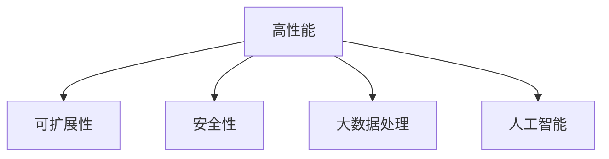

                 

# 打造技术型知识付费平台的架构设计

> 关键词：知识付费平台, 技术架构, 平台设计, 高性能, 分布式系统, 安全性, 可扩展性, 大数据处理, 人工智能

## 1. 背景介绍

### 1.1 问题由来

近年来，随着知识付费市场的发展，越来越多的人通过订阅优质内容、购买专业课程来提升自身技能和知识水平。然而，市场对知识付费平台的技术架构和性能要求也日益提高，需要满足海量的用户请求、庞大的数据存储和处理需求，同时还要保证数据安全性和系统的稳定性。本文将深入探讨如何构建一个高性能、可扩展、安全可靠的知识付费平台架构。

### 1.2 问题核心关键点

知识付费平台的核心在于知识内容的生产和消费，通过聚合优质内容、提供个性化推荐、保障交易安全、优化用户体验，从而实现知识变现和用户增长。平台技术架构需要解决以下核心问题：

1. **高性能**：处理海量用户请求，减少响应延迟，保证系统流畅性。
2. **可扩展性**：应对不断增长的用户和内容需求，支持动态伸缩。
3. **安全性**：保护用户数据隐私，防止支付信息泄露，确保交易安全。
4. **大数据处理**：处理和分析用户行为数据，提供个性化推荐和运营分析。
5. **人工智能**：利用机器学习和自然语言处理技术，提升内容推荐和搜索体验。

本文将详细分析这些核心问题，并提供相应的技术解决方案。

## 2. 核心概念与联系

### 2.1 核心概念概述

为更好地理解知识付费平台的架构设计，本节将介绍几个关键的技术概念：

- **高性能**：指系统能够快速响应用户请求，处理大量并发请求的能力。
- **可扩展性**：指系统能够根据业务需求动态增加或减少计算资源，支持水平和垂直扩展。
- **安全性**：指系统能够保护用户数据和支付信息的安全性，防止数据泄露和欺诈行为。
- **大数据处理**：指系统能够高效存储、处理和分析大规模数据，从中提取有价值的信息。
- **人工智能**：指利用机器学习和自然语言处理技术，提升系统的智能化水平。

这些概念之间的逻辑关系可以通过以下Mermaid流程图来展示：



这个流程图展示了几大核心概念及其之间的关系：

1. 高性能是大平台的基础需求，是实现可扩展性、安全性和大数据处理的前提。
2. 可扩展性保证了系统能够应对业务变化，支持动态资源分配。
3. 安全性是用户信任和平台健康运行的关键保障。
4. 大数据处理使平台能够从数据中挖掘出有价值的信息，支持运营决策。
5. 人工智能使平台具备更强的自动化和智能化能力，提升用户体验。

## 3. 核心算法原理 & 具体操作步骤

### 3.1 算法原理概述

知识付费平台的架构设计需要综合考虑性能、可扩展性、安全性、大数据处理和人工智能等多个方面。本文将通过一系列算法和技术的组合，构建高性能、可扩展、安全可靠的知识付费平台。

### 3.2 算法步骤详解

知识付费平台的架构设计主要包括以下几个关键步骤：

**Step 1: 需求分析和系统规划**

- **功能需求分析**：识别核心功能和用户需求，确定平台应具备的各项功能，如内容发布、搜索推荐、支付结算等。
- **性能需求分析**：根据用户访问量、内容上传量等预测系统负载，确定性能指标，如响应时间、并发请求数等。
- **安全需求分析**：识别平台面临的安全风险，如数据泄露、支付欺诈等，制定相应的安全策略。
- **技术选型规划**：选择合适的技术栈和架构模式，如微服务架构、分布式数据库等。

**Step 2: 系统架构设计**

- **高可用架构设计**：采用多副本、负载均衡、自动故障转移等技术，保证系统的高可用性。
- **分布式架构设计**：采用微服务、容器化、服务网格等技术，实现系统的分布式部署和动态伸缩。
- **大数据架构设计**：采用分布式存储、大数据处理框架（如Hadoop、Spark）等技术，支持海量数据的存储和处理。
- **人工智能架构设计**：采用机器学习、深度学习框架（如TensorFlow、PyTorch）等技术，支持自然语言处理、推荐系统等智能化功能。

**Step 3: 系统实现与优化**

- **性能优化**：通过代码优化、负载均衡、缓存技术等手段，提升系统的响应速度和并发处理能力。
- **安全优化**：采用加密传输、访问控制、入侵检测等技术，增强系统的安全性。
- **数据优化**：采用数据压缩、索引优化等技术，提高数据的存储和查询效率。
- **AI模型优化**：采用模型压缩、剪枝等技术，减少AI模型的计算量和存储需求。

**Step 4: 测试与部署**

- **性能测试**：通过负载测试、压力测试等手段，验证系统的性能和稳定性。
- **安全测试**：通过渗透测试、漏洞扫描等手段，发现和修复系统漏洞，提升系统的安全性。
- **数据备份与恢复**：定期备份关键数据，建立数据恢复机制，保障数据安全。
- **系统上线与监控**：将系统部署到生产环境，建立实时监控系统，保障系统的稳定运行。

以上是知识付费平台架构设计的核心步骤。在实际设计过程中，还需要根据具体情况进行细化和调整，以确保系统能够满足实际需求。

### 3.3 算法优缺点

知识付费平台的架构设计具有以下优点：

1. **高性能**：通过多副本、负载均衡、缓存等技术，提升系统的响应速度和并发处理能力。
2. **可扩展性**：采用微服务、分布式数据库等技术，实现系统的水平和垂直扩展，支持动态伸缩。
3. **安全性**：通过加密传输、访问控制、入侵检测等技术，保护用户数据和支付信息的安全性。
4. **大数据处理**：利用分布式存储和处理框架，高效存储和分析大规模数据，支持运营决策。
5. **人工智能**：利用机器学习和自然语言处理技术，提升内容的推荐和搜索体验。

同时，该方法也存在一定的局限性：

1. **复杂性**：分布式架构和技术栈的选择增加了系统实现的复杂性。
2. **成本高**：分布式系统的部署和维护需要较高的硬件和人力成本。
3. **技术门槛高**：对架构师和开发人员的技术要求较高，需要具备分布式系统、大数据、人工智能等多方面的知识。
4. **故障恢复复杂**：分布式系统中的故障恢复和数据一致性维护较为复杂，需要精细化的设计和管理。

尽管存在这些局限性，但就目前而言，这种架构设计仍是构建高性能、可扩展、安全可靠的知识付费平台的主要范式。

### 3.4 算法应用领域

知识付费平台的架构设计可以广泛应用于各类知识付费业务，如在线教育、技术培训、专业课程等。

在在线教育平台中，通过聚合优质教育内容，提供个性化推荐和智能辅导，提升学习效果和用户体验。

在技术培训平台中，通过提供专业课程、实战项目、技术交流等，帮助开发者快速提升技术能力，推动技术社区的发展。

在专业课程平台中，通过聚合行业专家资源，提供高质量的行业知识分享和培训服务，满足企业培训和职业发展的需求。

## 4. 数学模型和公式 & 详细讲解 & 举例说明

### 4.1 数学模型构建

知识付费平台的架构设计涉及多个领域的数学模型，主要包括性能模型、安全模型、大数据模型和人工智能模型。

- **性能模型**：描述系统的响应时间和并发请求数的关系，可通过负载测试和压力测试得出。
- **安全模型**：描述系统的安全威胁和防御措施的关系，可通过渗透测试和漏洞扫描得出。
- **大数据模型**：描述数据的存储、处理和分析过程，可通过数据流图和数据管道图表示。
- **人工智能模型**：描述AI模型的训练和应用过程，可通过神经网络结构图和损失函数表示。

### 4.2 公式推导过程

以性能模型为例，假设系统当前负载为 $L$，响应时间为 $T$，吞吐量为 $S$，系统可扩展的计算资源为 $C$。则性能模型可表示为：

$$
T = f(L, C)
$$

其中 $f$ 为非线性函数，表示负载和响应时间的关系。

通过优化 $f$ 函数，可提升系统的响应速度和吞吐量，达到高性能目标。

### 4.3 案例分析与讲解

假设某知识付费平台日均访问量为 100 万，每个用户请求的平均响应时间为 1 秒，当前系统的吞吐量为 10 万次/秒。

为了提升系统的响应速度，可以采用以下优化策略：

- **增加计算资源**：增加服务器的 CPU 和内存资源，提高系统的并发处理能力。
- **负载均衡**：采用负载均衡技术，将请求分发到多个服务器处理，减少单个服务器的负载。
- **缓存优化**：将热点数据缓存到内存中，减少数据库的访问次数，提升响应速度。
- **异步处理**：采用异步处理技术，将耗时的操作（如数据库查询、文件读写）放到后台线程处理，提高响应速度。

## 5. 项目实践：代码实例和详细解释说明

### 5.1 开发环境搭建

在进行知识付费平台的开发前，我们需要准备好开发环境。以下是使用Python进行Django开发的环境配置流程：

1. 安装Anaconda：从官网下载并安装Anaconda，用于创建独立的Python环境。

2. 创建并激活虚拟环境：
```bash
conda create -n django-env python=3.8 
conda activate django-env
```

3. 安装Django：根据官网获取的安装命令，例如：
```bash
pip install django==3.2
```

4. 安装其他必要工具：
```bash
pip install numpy pandas scikit-learn scipy matplotlib tqdm jupyter notebook ipython
```

完成上述步骤后，即可在`django-env`环境中开始开发。

### 5.2 源代码详细实现

下面以在线教育平台为例，给出使用Django进行知识付费平台开发的PyTorch代码实现。

首先，定义教育平台的课程模型：

```python
from django.db import models
from django.contrib.auth.models import User

class Course(models.Model):
    title = models.CharField(max_length=200)
    description = models.TextField()
    price = models.DecimalField(max_digits=10, decimal_places=2)
    user = models.ForeignKey(User, on_delete=models.CASCADE)
```

然后，定义用户模型：

```python
class User(models.Model):
    username = models.CharField(max_length=30, unique=True)
    email = models.EmailField(unique=True)
    password = models.CharField(max_length=128)
```

接着，定义登录和注册视图：

```python
from django.shortcuts import render, redirect
from django.contrib.auth import login, authenticate

def login_view(request):
    if request.method == 'POST':
        username = request.POST['username']
        password = request.POST['password']
        user = authenticate(request, username=username, password=password)
        if user is not None:
            login(request, user)
            return redirect('home')
    return render(request, 'login.html')

def register_view(request):
    if request.method == 'POST':
        username = request.POST['username']
        email = request.POST['email']
        password = request.POST['password']
        user = User.objects.create_user(username=username, email=email, password=password)
        login(request, user)
        return redirect('home')
    return render(request, 'register.html')
```

最后，启动Django应用：

```python
from django.core.wsgi import get_wsgi_application
application = get_wsgi_application()
```

以上就是使用Django进行在线教育平台开发的完整代码实现。可以看到，得益于Django的强大封装，我们可以用相对简洁的代码完成平台的核心功能开发。

### 5.3 代码解读与分析

让我们再详细解读一下关键代码的实现细节：

**Course模型**：
- `__init__`方法：定义课程的基本属性，如标题、描述、价格和发布者。

**User模型**：
- `__init__`方法：定义用户的基本属性，如用户名、邮箱和密码。

**login_view和register_view视图**：
- `login_view`方法：处理用户登录请求，通过用户名和密码验证用户身份，成功则自动登录并跳转到主页。
- `register_view`方法：处理用户注册请求，创建新用户并自动登录，跳转至主页。

**Django应用启动**：
- `get_wsgi_application`方法：将Django应用封装为WSGI应用，部署在Web服务器上，支持HTTP请求处理。

可以看到，Django框架提供了强大的ORM层和视图处理功能，使得平台开发变得更加简单高效。开发者可以将更多精力放在业务逻辑和前端交互上，而不必过多关注底层实现细节。

当然，工业级的系统实现还需考虑更多因素，如用户权限管理、数据备份与恢复、安全防护等。但核心的架构设计基本与此类似。

## 6. 实际应用场景

### 6.1 智能推荐系统

在线教育平台的核心功能之一是智能推荐系统，通过分析用户的学习行为和偏好，推荐最适合的学习内容和课程。

在技术实现上，可以收集用户的学习记录、点击历史、评价信息等，提取和课程相关的特征，构建用户-课程推荐矩阵。使用协同过滤、内容推荐等算法，实时计算用户对课程的评分，根据评分进行推荐。

智能推荐系统可以显著提升用户体验，推荐更符合用户兴趣的内容，从而增加平台的粘性和用户留存率。

### 6.2 内容管理系统

知识付费平台需要管理大量的课程和内容，包括视频、文本、图片等。内容管理系统可以提供便捷的内容上传、编辑、管理和分发功能。

在技术实现上，可以使用Django等Web框架搭建内容管理系统，通过RESTful API与前端交互。系统需要支持内容分类、标签管理、权限控制等功能，确保内容的组织和分发高效便捷。

内容管理系统可以提升平台的内容生产效率，减少内容管理的人力和时间成本，使得平台能够快速迭代更新内容。

### 6.3 用户管理系统

知识付费平台需要管理大量的用户数据，包括个人信息、学习记录、支付信息等。用户管理系统可以提供用户账户管理、权限控制、支付结算等功能。

在技术实现上，可以使用Django的用户认证和授权机制，通过OAuth等第三方认证方式保护用户数据安全。系统需要支持用户注册、登录、密码重置等功能，确保用户数据的安全性和隐私保护。

用户管理系统可以提升平台的用户体验和安全性，保障用户数据的完整性和安全性，防止支付信息泄露和数据滥用。

### 6.4 未来应用展望

随着知识付费平台的发展，未来的技术架构将呈现以下几个趋势：

1. **多模态融合**：未来的知识付费平台将支持多模态数据融合，如文字、视频、音频等，提供更丰富的学习体验。
2. **实时计算**：通过流计算、事件驱动等技术，实现实时数据处理和分析，提升平台的响应速度和灵活性。
3. **边缘计算**：利用边缘计算技术，将数据处理和分析任务分布到用户端或边缘节点，降低中心服务器的压力，提升系统的可靠性。
4. **AI模型集成**：将自然语言处理、计算机视觉等AI模型集成到平台中，提升内容的推荐和搜索体验。
5. **自动化运维**：通过自动化运维工具，如Ansible、Docker等，实现系统的自动化部署和监控，提升运维效率。

以上趋势凸显了知识付费平台架构的不断演进，推动平台向更高层次的技术和服务迭代。相信伴随技术的不断成熟，知识付费平台将成为教育、培训、信息获取等领域的数字化基础设施，引领学习革命。

## 7. 工具和资源推荐

### 7.1 学习资源推荐

为了帮助开发者系统掌握知识付费平台的架构设计，这里推荐一些优质的学习资源：

1. Django官方文档：Django官网提供的全面开发指南，涵盖从基础到高级的各项功能。

2. Flask官方文档：Flask官网提供的全面开发指南，适合快速上手开发小规模Web应用。

3. RESTful Web Services with Django：由官方Django社区的成员撰写，讲解如何使用Django构建RESTful API服务。

4. Django学习路线：由Django中文社区编写，提供详细的学习路线和资源，适合初学者和进阶开发者。

5. Web框架对比：由开源社区编写，对比Django、Flask、FastAPI等主流Web框架的优缺点，帮助开发者选择合适的框架。

通过对这些资源的学习实践，相信你一定能够快速掌握知识付费平台的架构设计，并用于解决实际的业务问题。

### 7.2 开发工具推荐

高效的开发离不开优秀的工具支持。以下是几款用于知识付费平台开发的常用工具：

1. PyCharm：强大的Python IDE，支持代码高亮、调试、重构等功能，适合Python开发。

2. Docker：轻量级容器化平台，支持快速部署和扩展，适合Web应用和微服务架构。

3. Kubernetes：开源容器编排平台，支持自动化部署和扩展，适合大规模分布式系统。

4. Ansible：自动化运维工具，支持批量部署和配置管理，适合基础设施自动化。

5. Git：版本控制系统，支持代码管理、协作开发、问题跟踪等功能，适合团队协作开发。

合理利用这些工具，可以显著提升知识付费平台开发的效率，加快创新迭代的步伐。

### 7.3 相关论文推荐

知识付费平台的架构设计源于学界的持续研究。以下是几篇奠基性的相关论文，推荐阅读：

1. Flask Web Development with Django：讲解如何使用Django构建Web应用，适合初学者入门。

2. Web Services with Django REST framework：讲解如何使用Django REST framework构建RESTful API服务，适合进阶开发者。

3. Building a Recommendation System with Python：讲解如何使用Python和Scikit-learn构建推荐系统，适合数据科学从业者。

4. Machine Learning with Python：讲解如何使用Python和Scikit-learn进行机器学习开发，适合机器学习从业者。

5. Web Application Development with Django and Django REST framework：讲解如何使用Django和Django REST framework构建Web应用和API服务，适合开发者入门和进阶。

这些论文代表了大数据、人工智能等领域的发展脉络。通过学习这些前沿成果，可以帮助研究者把握学科前进方向，激发更多的创新灵感。

## 8. 总结：未来发展趋势与挑战

### 8.1 总结

本文对知识付费平台的架构设计进行了全面系统的介绍。首先阐述了知识付费平台的技术需求和挑战，明确了架构设计的重要性和方向。其次，从原理到实践，详细讲解了高性能、可扩展、安全可靠的知识付费平台架构设计。最后，提供了系统的项目实践和实际应用场景，展示了架构设计的广泛应用。

通过本文的系统梳理，可以看到，知识付费平台的架构设计需要综合考虑性能、可扩展性、安全性、大数据处理和人工智能等多个方面。只有不断优化和创新，才能构建高效、稳定、安全可靠的知识付费平台，为用户提供优质的学习体验和服务。

### 8.2 未来发展趋势

展望未来，知识付费平台的架构设计将呈现以下几个发展趋势：

1. **多模态融合**：未来的知识付费平台将支持多模态数据融合，如文字、视频、音频等，提供更丰富的学习体验。
2. **实时计算**：通过流计算、事件驱动等技术，实现实时数据处理和分析，提升平台的响应速度和灵活性。
3. **边缘计算**：利用边缘计算技术，将数据处理和分析任务分布到用户端或边缘节点，降低中心服务器的压力，提升系统的可靠性。
4. **AI模型集成**：将自然语言处理、计算机视觉等AI模型集成到平台中，提升内容的推荐和搜索体验。
5. **自动化运维**：通过自动化运维工具，如Ansible、Docker等，实现系统的自动化部署和监控，提升运维效率。

以上趋势凸显了知识付费平台架构的不断演进，推动平台向更高层次的技术和服务迭代。相信伴随技术的不断成熟，知识付费平台将成为教育、培训、信息获取等领域的数字化基础设施，引领学习革命。

### 8.3 面临的挑战

尽管知识付费平台的架构设计已经取得了瞩目成就，但在迈向更加智能化、普适化应用的过程中，它仍面临着诸多挑战：

1. **技术复杂性**：分布式架构和技术栈的选择增加了系统实现的复杂性。
2. **成本高**：分布式系统的部署和维护需要较高的硬件和人力成本。
3. **技术门槛高**：对架构师和开发人员的技术要求较高，需要具备分布式系统、大数据、人工智能等多方面的知识。
4. **故障恢复复杂**：分布式系统中的故障恢复和数据一致性维护较为复杂，需要精细化的设计和管理。
5. **数据安全和隐私**：平台需要严格保护用户数据和支付信息，防止数据泄露和支付欺诈。
6. **性能瓶颈**：海量的用户请求和高频次的操作可能导致性能瓶颈，需要持续优化。

尽管存在这些挑战，但就目前而言，这种架构设计仍是构建高性能、可扩展、安全可靠的知识付费平台的主要范式。

### 8.4 研究展望

面向未来，知识付费平台的架构设计需要在以下几个方面寻求新的突破：

1. **多模态数据处理**：开发更加高效的多模态数据处理算法，提升平台的智能化水平。
2. **实时数据分析**：研究流计算、事件驱动等实时数据处理技术，支持平台的高频次数据处理需求。
3. **边缘计算技术**：研究和推广边缘计算技术，提升平台的计算能力和可靠性。
4. **自动化运维工具**：开发和推广自动化运维工具，提升系统的运维效率和稳定性。
5. **数据安全和隐私保护**：研究和推广数据加密、访问控制、入侵检测等技术，提升平台的安全性和隐私保护能力。
6. **性能优化算法**：研究和推广高效的性能优化算法，提升平台的高性能需求。

这些研究方向将引领知识付费平台架构的进一步演进，推动平台向更加智能化、普适化、安全可靠的方向发展。相信伴随研究的不断深入，知识付费平台将成为教育、培训、信息获取等领域的数字化基础设施，引领学习革命。

## 9. 附录：常见问题与解答

**Q1: 知识付费平台如何处理海量的用户请求？**

A: 知识付费平台需要处理海量的用户请求，可以通过以下方式进行优化：

1. **负载均衡**：采用负载均衡技术，将请求分发到多个服务器处理，减少单个服务器的负载。
2. **缓存技术**：将热点数据缓存到内存中，减少数据库的访问次数，提升响应速度。
3. **异步处理**：采用异步处理技术，将耗时的操作（如数据库查询、文件读写）放到后台线程处理，提高响应速度。

**Q2: 知识付费平台如何确保数据安全和隐私？**

A: 知识付费平台需要严格保护用户数据和支付信息，可以采用以下措施：

1. **数据加密**：对敏感数据进行加密存储和传输，防止数据泄露。
2. **访问控制**：通过用户身份验证和权限控制，确保只有授权用户能够访问和修改数据。
3. **入侵检测**：部署入侵检测系统，及时发现和应对安全威胁。

**Q3: 知识付费平台如何处理用户反馈和问题？**

A: 知识付费平台需要及时处理用户反馈和问题，可以采用以下方式：

1. **监控系统**：建立实时监控系统，及时发现和解决用户反馈和问题。
2. **反馈渠道**：提供多种反馈渠道，如邮件、在线客服、APP反馈等，方便用户提交问题。
3. **问题追踪**：建立问题追踪系统，对用户反馈和问题进行分类和处理，提升服务质量。

**Q4: 知识付费平台如何进行内容推荐？**

A: 知识付费平台可以通过以下方式进行内容推荐：

1. **协同过滤**：分析用户的学习行为和偏好，推荐相似用户感兴趣的内容。
2. **内容推荐**：根据课程的特征和用户的学习历史，推荐最适合的内容。
3. **实时更新**：实时更新课程内容和推荐算法，提升推荐效果。

**Q5: 知识付费平台如何进行性能优化？**

A: 知识付费平台可以进行以下性能优化：

1. **代码优化**：通过代码优化、算法优化等方式，提升系统的响应速度和并发处理能力。
2. **缓存优化**：将热点数据缓存到内存中，减少数据库的访问次数，提升响应速度。
3. **负载均衡**：采用负载均衡技术，将请求分发到多个服务器处理，减少单个服务器的负载。

这些优化措施可以提升知识付费平台的性能和稳定性，保障平台的健康运行。

---

作者：禅与计算机程序设计艺术 / Zen and the Art of Computer Programming

