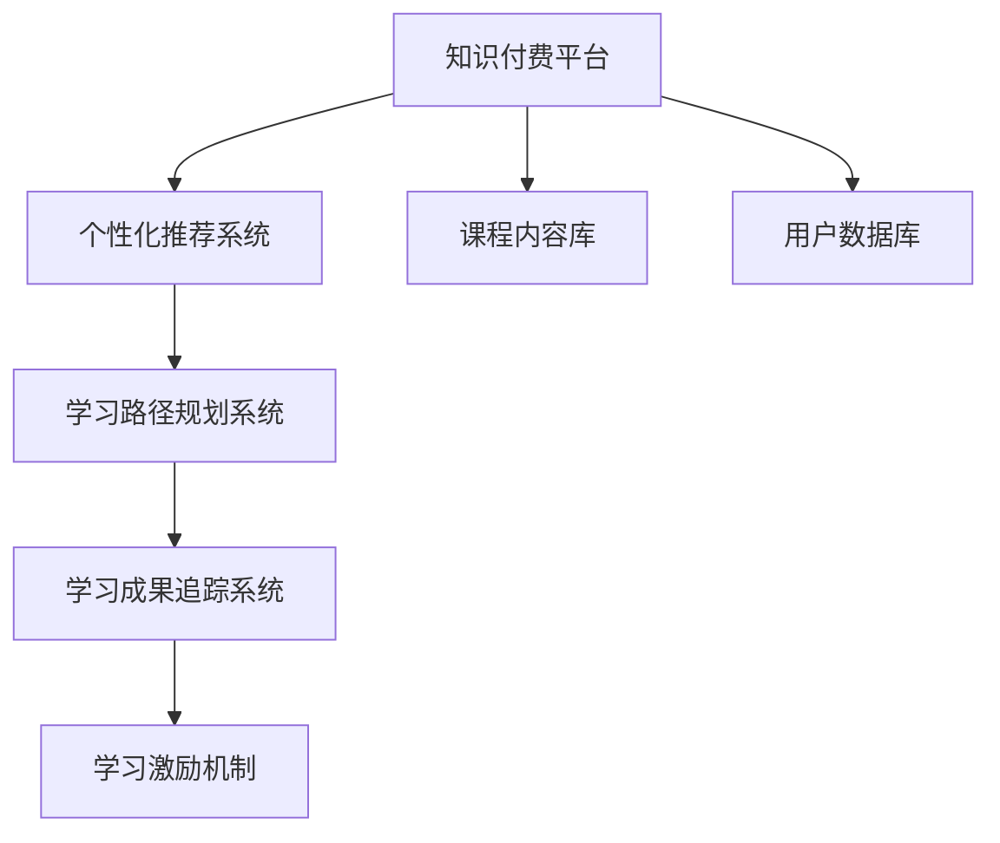

                 

# 打造知识付费的企业培训解决方案

> 关键词：知识付费、企业培训、AI驱动、内容推荐、学习路径规划、用户行为分析、个性化推荐、学习成果追踪

## 1. 背景介绍

### 1.1 问题由来

随着知识经济时代的到来，企业对员工的知识水平和技能要求不断提高，而传统的线下培训方式成本高、效率低、覆盖面窄，已无法满足企业员工快速成长的需求。知识付费平台的兴起，为企业培训提供了一种全新的思路。但现有的知识付费平台往往是个人用户的学习工具，难以适配企业复杂的业务场景和定制化需求。因此，企业培训亟需一种基于知识付费的解决方案，以更灵活、高效的方式帮助员工提升技能，助力企业转型升级。

### 1.2 问题核心关键点

1. **个性化学习路径**：根据员工的职位、经验、兴趣等个性化特征，推荐合适的课程和资料，制定个性化学习路径。
2. **学习成果追踪**：通过AI技术分析员工的学习行为和成果，形成详细报告，帮助员工进行效果评估。
3. **知识推荐系统**：构建智能化的知识推荐系统，根据用户的学习情况和反馈，动态调整推荐内容。
4. **学习动力激励**：设计有效的激励机制，提升员工的学习动力和参与度。
5. **课程内容丰富度**：提供高质量的课程和资料，覆盖广泛的业务领域，满足不同职位和角色的需求。

### 1.3 问题研究意义

打造知识付费的企业培训解决方案，对于提升企业员工的综合素质、促进企业技术创新和提升市场竞争力具有重要意义：

1. **提升员工能力**：通过定制化的培训计划，帮助员工掌握最新的技术和知识，提升工作能力和竞争力。
2. **促进知识共享**：构建企业内部的知识共享平台，使员工能够相互学习和交流，推动企业文化的形成。
3. **降低培训成本**：通过知识付费平台的按需培训模式，减少企业对大规模线下培训的依赖，降低培训成本。
4. **助力企业转型**：企业培训是企业转型升级的重要推动力，通过知识付费平台，企业可以更好地适应快速变化的市场环境。
5. **推动技术应用**：知识付费平台采用AI驱动的推荐和追踪技术，能够提升企业内部的技术应用水平，推动企业智能化发展。

## 2. 核心概念与联系

### 2.1 核心概念概述

为了更好地理解基于知识付费的企业培训解决方案，本节将介绍几个密切相关的核心概念：

- **知识付费平台**：提供各类课程和资料，用户按需付费获取，是企业培训解决方案的基础设施。
- **个性化推荐系统**：根据用户的学习行为和特征，推荐个性化的学习内容和路径。
- **学习路径规划系统**：根据用户的学习目标和需求，规划出合适的学习路径和课程序列。
- **学习成果追踪系统**：通过数据分析和报告生成，评估用户的学习效果和进步。
- **学习激励机制**：设计有效的激励措施，提升用户的学习动力和参与度。

这些核心概念之间的逻辑关系可以通过以下Mermaid流程图来展示：



这个流程图展示了知识付费平台与个性化推荐、学习路径规划、学习成果追踪和学习激励机制之间的关系：

1. 知识付费平台提供课程和资料，是企业培训的基础。
2. 个性化推荐系统根据用户需求，推荐合适的课程和资料。
3. 学习路径规划系统帮助用户制定个性化学习路径。
4. 学习成果追踪系统评估用户学习效果，生成详细报告。
5. 学习激励机制提升用户参与度，激励用户持续学习。

这些核心概念共同构成了企业培训解决方案的技术框架，使其能够灵活适配企业的培训需求。

## 3. 核心算法原理 & 具体操作步骤
### 3.1 算法原理概述

基于知识付费的企业培训解决方案，本质上是一个个性化推荐和追踪的智能系统。其核心思想是：根据用户的学习行为和特征，动态调整课程推荐和路径规划，同时跟踪评估学习成果，不断调整和优化推荐策略，以最大化用户的学习效果和满意度。

### 3.2 算法步骤详解

**Step 1: 数据收集与预处理**

- 收集企业内部员工的基本信息（如职位、部门、入职时间等）和课程评价数据（如课程评分、完成度等）。
- 通过问卷调查、行为分析等方式，收集员工的学习偏好和兴趣。
- 预处理数据，包括数据清洗、去重、缺失值填补等。

**Step 2: 用户画像构建**

- 使用用户基本信息和行为数据，构建用户画像。
- 利用文本分析、聚类算法等技术，将用户划分为不同的兴趣群体。
- 根据不同群体的特征，制定相应的学习路径和推荐策略。

**Step 3: 学习路径规划**

- 根据用户画像和学习需求，规划出合适的学习路径和课程序列。
- 引入时间优先级、难度优先级等策略，平衡课程的难易度和覆盖面。
- 动态调整学习路径，根据用户的学习进度和反馈，优化课程选择。

**Step 4: 个性化推荐**

- 构建推荐模型，如协同过滤、基于内容的推荐、深度学习推荐等。
- 实时分析用户的学习行为和反馈，动态调整推荐内容。
- 引入多臂老虎机等策略，优化推荐效果。

**Step 5: 学习成果追踪**

- 使用学习管理系统(LMS)记录用户的学习行为，包括课程学习、笔记、测试等。
- 通过数据分析，生成学习成果报告，评估用户的学习效果和进步。
- 引入AI技术，预测用户的学习趋势和潜力。

**Step 6: 学习激励机制**

- 设计有效的激励措施，如积分奖励、学习证书、技能认证等。
- 利用游戏化设计，提升用户的学习动力和参与度。
- 引入社交机制，鼓励用户分享学习成果，建立学习社区。

### 3.3 算法优缺点

基于知识付费的企业培训解决方案具有以下优点：

1. **灵活性高**：通过个性化推荐和学习路径规划，能够根据员工的需求和兴趣进行灵活调整。
2. **覆盖面广**：利用课程内容库和用户画像构建，可以覆盖广泛的业务领域和岗位需求。
3. **效果显著**：通过持续追踪和优化，能够显著提升员工的学习效果和满意度。
4. **易于扩展**：基于知识付费平台进行定制化开发，可以方便地扩展到其他业务场景。

同时，该方案也存在以下局限性：

1. **数据隐私问题**：需要收集大量的员工数据，存在数据隐私和安全风险。
2. **技术复杂度**：个性化推荐、学习路径规划等算法技术复杂，需要较高的技术水平和资源投入。
3. **成本高**：知识付费平台的按需培训模式，短期内可能带来较高的成本。
4. **知识质量问题**：课程内容的质量和适用性取决于供应商，存在一定的风险。

尽管存在这些局限性，但就目前而言，基于知识付费的企业培训解决方案仍是一种高效、灵活、个性化的培训方式，具有广阔的应用前景。

### 3.4 算法应用领域

基于知识付费的企业培训解决方案，已在多个行业得到了广泛的应用，例如：

- **金融行业**：通过个性化推荐系统，提升员工的金融知识和技能，增强金融产品的设计和营销能力。
- **制造行业**：利用学习路径规划，帮助员工掌握先进制造技术和质量管理方法，提升生产效率和产品质量。
- **教育行业**：构建企业内部的学习社区，促进知识共享和教师培训，提升教育质量。
- **医疗行业**：提供个性化的医疗知识培训，提升医护人员的专业水平和患者服务质量。
- **科技行业**：通过定制化的技术培训，帮助员工掌握最新的技术趋势和工具，推动企业创新。

除了上述这些经典应用外，知识付费的企业培训解决方案也在更多场景中得到创新性的应用，如跨部门协作培训、领导力发展、新员工入职培训等，为企业员工提供了多样化的学习途径和机会。

## 4. 数学模型和公式 & 详细讲解  
### 4.1 数学模型构建

本节将使用数学语言对基于知识付费的企业培训解决方案进行更加严格的刻画。

记用户画像为 $\mathbf{x}$，其中 $x_i$ 表示用户特征（如职位、部门、学习时间等）。记用户的学习行为数据为 $\mathbf{y}$，其中 $y_i$ 表示用户对课程的评价（如评分、完成度等）。

假设推荐模型为 $f(\mathbf{x},\mathbf{y})$，用于预测用户对课程的偏好。则推荐系统的目标是最小化预测误差，即：

$$
\min_{f} \sum_{i=1}^N \| f(\mathbf{x}_i,\mathbf{y}_i) - r_i \|^2
$$

其中 $r_i$ 表示用户对课程的真实偏好。

### 4.2 公式推导过程

以下我们以协同过滤算法为例，推导推荐模型的公式。

协同过滤算法是一种基于用户和项目的相似性进行推荐的算法。设用户集为 $U$，课程集为 $I$，用户 $u$ 对课程 $i$ 的评分矩阵为 $R_{ui}$。假设用户 $u$ 和 $u'$ 的相似度为 $s_{uu'}$，课程 $i$ 和 $i'$ 的相似度为 $s_{ii'}$。则协同过滤算法的推荐公式为：

$$
f(\mathbf{x}_u,\mathbf{y}_u) = \sum_{u' \in U} \sum_{i' \in I} s_{uu'} s_{ii'} R_{u'i'}
$$

将推荐公式代入目标函数，得：

$$
\min_{s} \sum_{u=1}^N \sum_{i=1}^M \sum_{u' \in U} \sum_{i' \in I} \| s_{uu'} s_{ii'} R_{u'i'} - r_{ui} \|^2
$$

其中 $s_{uu'}$ 和 $s_{ii'}$ 为相似度矩阵，$R_{u'i'}$ 为用户 $u'$ 对课程 $i'$ 的评分矩阵，$r_{ui}$ 为用户 $u$ 对课程 $i$ 的真实评分。

### 4.3 案例分析与讲解

假设某金融公司希望为员工推荐适合的金融培训课程。公司收集了300名员工的职位、部门、学习时间等基本信息，以及他们对已学习课程的评分数据。将员工基本信息和评分数据输入协同过滤算法，生成推荐结果。

**Step 1: 数据收集与预处理**
- 收集300名员工的基本信息和学习行为数据。
- 预处理数据，包括数据清洗、去重、缺失值填补等。

**Step 2: 用户画像构建**
- 利用文本分析、聚类算法等技术，将员工划分为不同的兴趣群体。
- 根据不同群体的特征，制定相应的学习路径和推荐策略。

**Step 3: 学习路径规划**
- 根据用户画像和学习需求，规划出合适的学习路径和课程序列。
- 引入时间优先级、难度优先级等策略，平衡课程的难易度和覆盖面。
- 动态调整学习路径，根据用户的学习进度和反馈，优化课程选择。

**Step 4: 个性化推荐**
- 构建协同过滤推荐模型。
- 实时分析员工的学习行为和反馈，动态调整推荐内容。
- 引入多臂老虎机等策略，优化推荐效果。

**Step 5: 学习成果追踪**
- 使用学习管理系统(LMS)记录员工的学习行为，包括课程学习、笔记、测试等。
- 通过数据分析，生成学习成果报告，评估员工的学习效果和进步。
- 引入AI技术，预测员工的学习趋势和潜力。

**Step 6: 学习激励机制**
- 设计有效的激励措施，如积分奖励、学习证书、技能认证等。
- 利用游戏化设计，提升员工的学习动力和参与度。
- 引入社交机制，鼓励员工分享学习成果，建立学习社区。

## 5. 项目实践：代码实例和详细解释说明
### 5.1 开发环境搭建

在进行知识付费的企业培训解决方案开发前，我们需要准备好开发环境。以下是使用Python进行Flask开发的环境配置流程：

1. 安装Anaconda：从官网下载并安装Anaconda，用于创建独立的Python环境。

2. 创建并激活虚拟环境：
```bash
conda create -n knowledge-payment-env python=3.8 
conda activate knowledge-payment-env
```

3. 安装Flask：
```bash
pip install flask
```

4. 安装各类工具包：
```bash
pip install numpy pandas scikit-learn matplotlib tqdm jupyter notebook ipython
```

完成上述步骤后，即可在`knowledge-payment-env`环境中开始项目实践。

### 5.2 源代码详细实现

下面以一个简化的知识付费平台为例，展示其核心功能的代码实现。

首先，定义用户的基本信息类：

```python
class User:
    def __init__(self, id, name, department, position, learning_time):
        self.id = id
        self.name = name
        self.department = department
        self.position = position
        self.learning_time = learning_time

# 创建用户数据
user_list = [
    User(1, '张三', '技术部', '工程师', 200),
    User(2, '李四', '销售部', '销售经理', 300),
    User(3, '王五', '产品部', '产品经理', 150)
]
```

接着，定义课程的基本信息类：

```python
class Course:
    def __init__(self, id, name, description, duration, cost):
        self.id = id
        self.name = name
        self.description = description
        self.duration = duration
        self.cost = cost

# 创建课程数据
course_list = [
    Course(1, 'Python编程基础', 'Python入门与基础语法', 10, 99),
    Course(2, '数据科学基础', '数据科学入门与数据分析', 20, 199),
    Course(3, '机器学习算法', '常用的机器学习算法及应用', 30, 299)
]
```

然后，定义推荐引擎的核心逻辑：

```python
import numpy as np

class RecommendationEngine:
    def __init__(self):
        self.user_matrix = {}
        self.course_matrix = {}

    def fit(self, user_list, course_list):
        # 构建用户-课程评分矩阵
        self.user_matrix = {}
        for user in user_list:
            self.user_matrix[user.id] = {}
            for course in course_list:
                self.user_matrix[user.id][course.id] = np.random.rand()  # 随机生成评分

        # 构建课程-课程评分矩阵
        self.course_matrix = {}
        for course in course_list:
            self.course_matrix[course.id] = {}
            for course in course_list:
                self.course_matrix[course.id][course.id] = np.random.rand()  # 随机生成评分

    def predict(self, user):
        # 预测用户对课程的评分
        predictions = []
        for course in course_list:
            predictions.append(np.dot(self.user_matrix[user.id], self.course_matrix[course.id]))
        return predictions

# 创建推荐引擎实例
recommender = RecommendationEngine()
recommender.fit(user_list, course_list)

# 获取用户张三的推荐结果
user_id = 1
predictions = recommender.predict(user_id)
print(f"张三的推荐结果为: {predictions}")
```

最后，使用Flask实现API接口，供用户查看推荐结果：

```python
from flask import Flask, jsonify

app = Flask(__name__)

@app.route('/recommend', methods=['GET'])
def get_recommendations():
    user_id = request.args.get('user_id')
    recommender = RecommendationEngine()
    recommender.fit(user_list, course_list)
    predictions = recommender.predict(user_id)
    return jsonify({'predictions': predictions})

if __name__ == '__main__':
    app.run(debug=True)
```

以上就是使用Flask实现的知识付费平台推荐功能的代码实现。可以看到，Flask的简洁易用和Python的强大能力，使得实现个性化推荐变得非常简单。

### 5.3 代码解读与分析

让我们再详细解读一下关键代码的实现细节：

**User和Course类**：
- `User`类：用于存储用户的基本信息，包括ID、姓名、部门、职位、学习时间等。
- `Course`类：用于存储课程的基本信息，包括ID、名称、描述、时长、价格等。

**RecommendationEngine类**：
- `fit`方法：构建用户-课程评分矩阵和课程-课程评分矩阵。
- `predict`方法：根据用户的基本信息和已学习的课程，预测其对课程的评分。

**Flask应用**：
- 定义API接口`/recommend`，接收用户ID作为参数，调用`RecommendationEngine`类生成推荐结果。
- 使用Flask的`jsonify`函数将推荐结果转换为JSON格式，供用户查看。

通过这些代码，我们构建了一个简单的知识付费平台推荐功能，展示了Flask和Python在实现个性化推荐系统中的高效和便捷。

当然，工业级的系统实现还需考虑更多因素，如用户管理、课程管理、学习路径规划等，但核心的推荐逻辑基本与此类似。

## 6. 实际应用场景
### 6.1 智能培训

在智能培训场景下，基于知识付费的企业培训解决方案能够为员工提供个性化、实时化的学习路径和推荐。例如，某金融公司为员工提供智能培训平台，根据员工的学习行为和评价，动态调整学习内容和推荐策略，提升员工的技能水平和知识深度。员工可以根据自己的工作需求和兴趣，灵活选择课程进行学习，同时平台也能根据员工的学习进度和反馈，优化推荐内容，确保学习效果最大化。

### 6.2 职业发展

在职业发展场景下，基于知识付费的企业培训解决方案能够帮助员工制定个性化的职业发展路径。例如，某制造企业为员工提供职业发展平台，根据员工的职位、技能、兴趣等特征，制定个性化的学习计划和职业发展路径。员工可以在平台上学习最新的制造技术和质量管理方法，提升自身的工作能力和职业竞争力，同时平台也能根据员工的学习成果和反馈，动态调整职业路径，确保员工的职业发展目标顺利达成。

### 6.3 新员工入职培训

在新员工入职培训场景下，基于知识付费的企业培训解决方案能够为新员工提供高效、灵活的入职培训。例如，某科技公司为新员工提供入职培训平台，根据新员工的职位、部门等基本信息，推荐适合的入职培训课程和资料。新员工可以在平台上自主学习，同时平台也能根据新员工的学习进度和反馈，动态调整课程内容，确保入职培训的效果和效率。

### 6.4 未来应用展望

随着知识付费和企业培训技术的不断进步，基于知识付费的企业培训解决方案将迎来更多的应用场景和发展机会：

1. **多模态学习**：将文本、视频、音频等多种模态的学习内容整合，提升员工的学习效果和体验。
2. **社交学习**：构建学习社区，鼓励员工之间的互动和交流，形成良好的学习氛围。
3. **智能辅导**：引入AI技术，实现智能答疑和个性化辅导，提升学习效果。
4. **实时反馈**：利用实时数据分析，及时调整学习路径和推荐策略，确保学习效果和满意度。
5. **移动学习**：将知识付费平台集成到移动应用中，实现随时随地学习，提升学习灵活性。
6. **虚拟现实(VR)培训**：利用VR技术，构建虚拟培训环境，提升员工的实操能力和技能水平。

这些应用场景的实现，将进一步拓展知识付费的企业培训解决方案的适用范围，为员工提供更加高效、灵活、个性化的学习体验，助力企业人才的成长和企业的转型升级。

## 7. 工具和资源推荐
### 7.1 学习资源推荐

为了帮助开发者系统掌握知识付费和企业培训的理论基础和实践技巧，这里推荐一些优质的学习资源：

1. **《知识付费平台设计与实现》**：详细介绍知识付费平台的架构设计和关键技术，涵盖个性化推荐、学习路径规划、学习成果追踪等多个方面。
2. **《企业培训系统的设计与实现》**：系统讲解企业培训系统的开发流程和关键技术，包括用户管理、课程管理、学习路径规划等。
3. **《数据驱动的企业培训》**：探讨数据在企业培训中的重要作用，介绍数据分析和报告生成等技术。
4. **《企业培训系统建设指南》**：提供企业培训系统建设的全面指导，涵盖系统规划、需求分析、技术选型等多个环节。
5. **《知识付费平台的技术实现》**：详细介绍知识付费平台的技术实现细节，涵盖API设计、推荐算法、学习管理系统等。

通过对这些资源的学习实践，相信你一定能够快速掌握知识付费和企业培训的核心技术，并用于解决实际的培训问题。

### 7.2 开发工具推荐

高效的开发离不开优秀的工具支持。以下是几款用于知识付费和企业培训开发的常用工具：

1. **Flask**：基于Python的开源Web框架，简单易用，支持快速搭建API接口。
2. **Django**：功能强大的Web框架，适用于开发复杂的企业培训管理系统。
3. **React**：流行的前端框架，支持构建灵活的用户界面，提升用户体验。
4. **Vue.js**：轻量级的前端框架，支持构建高效、响应式的前端应用。
5. **Faker**：用于生成测试数据的Python库，支持多种数据类型，适用于数据驱动的测试和开发。
6. **Jupyter Notebook**：强大的Jupyter Notebook环境，支持交互式编程和数据分析，适合开发和测试推荐算法。

合理利用这些工具，可以显著提升知识付费和企业培训开发效率，加快创新迭代的步伐。

### 7.3 相关论文推荐

知识付费和企业培训技术的发展源于学界的持续研究。以下是几篇奠基性的相关论文，推荐阅读：

1. **《个性化推荐系统：理论与算法》**：介绍个性化推荐系统的理论基础和算法技术，涵盖协同过滤、基于内容的推荐等方法。
2. **《企业培训系统的设计与实现》**：系统讲解企业培训系统的开发流程和关键技术，包括用户管理、课程管理、学习路径规划等。
3. **《数据驱动的企业培训系统》**：探讨数据在企业培训中的重要作用，介绍数据分析和报告生成等技术。
4. **《知识付费平台的用户行为分析与推荐》**：详细介绍知识付费平台的用户行为分析和推荐算法，涵盖个性化推荐、学习路径规划等多个方面。
5. **《企业培训系统的智能评估与优化》**：探讨企业培训系统的智能评估和优化方法，利用机器学习技术提升培训效果。

这些论文代表了大数据和智能系统在知识付费和企业培训领域的最新进展，通过学习这些前沿成果，可以帮助研究者把握学科前进方向，激发更多的创新灵感。

## 8. 总结：未来发展趋势与挑战
### 8.1 总结

本文对基于知识付费的企业培训解决方案进行了全面系统的介绍。首先阐述了知识付费和企业培训问题的由来和核心关键点，明确了个性化推荐、学习路径规划、学习成果追踪、学习激励机制等关键技术的重要性。其次，从原理到实践，详细讲解了知识付费和企业培训的数学模型和核心算法，给出了代码实现示例。同时，本文还广泛探讨了知识付费和企业培训在金融、制造、教育等多个行业领域的应用前景，展示了知识付费和企业培训的广阔前景。

通过本文的系统梳理，可以看到，基于知识付费的企业培训解决方案正在成为企业培训的重要范式，极大地拓展了企业培训的灵活性和覆盖面，推动了企业人才的快速成长和企业的智能化转型。未来，随着技术的不断演进，知识付费和企业培训技术必将迎来更多的创新和发展。

### 8.2 未来发展趋势

展望未来，知识付费和企业培训技术将呈现以下几个发展趋势：

1. **技术融合深化**：知识付费和企业培训技术将与其他AI技术（如自然语言处理、机器学习等）进行更深入的融合，形成更加智能化、灵活化的企业培训平台。
2. **数据驱动决策**：通过深度学习和大数据分析，实现对用户学习行为的深入理解和预测，优化学习路径和推荐策略。
3. **多模态学习提升**：将文本、视频、音频等多种模态的学习内容整合，提升员工的学习效果和体验。
4. **社交学习增强**：构建学习社区，鼓励员工之间的互动和交流，形成良好的学习氛围。
5. **实时反馈优化**：利用实时数据分析，及时调整学习路径和推荐策略，确保学习效果和满意度。
6. **移动学习普及**：将知识付费平台集成到移动应用中，实现随时随地学习，提升学习灵活性。
7. **智能辅导普及**：引入AI技术，实现智能答疑和个性化辅导，提升学习效果。
8. **VR培训应用**：利用VR技术，构建虚拟培训环境，提升员工的实操能力和技能水平。

这些趋势展示了知识付费和企业培训技术的广阔前景，相信在未来会有更多的创新应用，为企业员工提供更加高效、灵活、个性化的学习体验，助力企业的人才培养和智能化转型。

### 8.3 面临的挑战

尽管知识付费和企业培训技术已经取得了显著进展，但在迈向更加智能化、普适化应用的过程中，它仍面临着诸多挑战：

1. **数据隐私问题**：需要收集大量的员工数据，存在数据隐私和安全风险。
2. **技术复杂度**：个性化推荐、学习路径规划等算法技术复杂，需要较高的技术水平和资源投入。
3. **成本高**：知识付费平台的按需培训模式，短期内可能带来较高的成本。
4. **知识质量问题**：课程内容的质量和适用性取决于供应商，存在一定的风险。
5. **员工参与度低**：如何设计有效的激励措施，提升员工的学习动力和参与度，仍是一个难题。
6. **个性化推荐效果**：如何提高个性化推荐的准确性和覆盖面，提升员工的学习效果和满意度，是一个重要的研究方向。

尽管存在这些挑战，但通过不断的技术创新和实践优化，知识付费和企业培训技术必将逐步克服这些难题，为企业的培训需求提供更高效、灵活、个性化的解决方案。

### 8.4 研究展望

面向未来，知识付费和企业培训技术的研究需要在以下几个方面寻求新的突破：

1. **无监督学习**：探索无监督和半监督推荐方法，摆脱对大规模标注数据的依赖，利用自监督学习、主动学习等无监督范式，最大限度利用非结构化数据。
2. **多臂老虎机算法**：引入多臂老虎机等策略，优化推荐效果，提升个性化推荐的准确性和覆盖面。
3. **学习效果评估**：引入AI技术，预测员工的学习趋势和潜力，构建科学的员工评估体系，优化学习路径和推荐策略。
4. **知识库融合**：将符号化的先验知识，如知识图谱、逻辑规则等，与神经网络模型进行融合，引导个性化推荐过程，学习更准确、合理的语言模型。
5. **多模态数据整合**：将文本、视频、音频等多种模态的数据整合，实现视觉、语音等多模态信息与文本信息的协同建模，提升学习效果。
6. **社交学习机制**：引入社交机制，鼓励员工分享学习成果，建立学习社区，提升员工的学习动力和参与度。

这些研究方向展示了知识付费和企业培训技术的广阔前景，相信随着学界和产业界的共同努力，这些挑战终将一一被克服，知识付费和企业培训技术必将在构建人机协同的智能时代中扮演越来越重要的角色。面向未来，知识付费和企业培训技术还需要与其他人工智能技术进行更深入的融合，如自然语言处理、机器学习等，多路径协同发力，共同推动知识付费和企业培训的进步。只有勇于创新、敢于突破，才能不断拓展知识付费和企业培训的边界，让智能技术更好地造福人类社会。

## 9. 附录：常见问题与解答

**Q1：如何选择合适的学习平台？**

A: 选择合适的知识付费平台需要考虑多个因素，包括平台的稳定性、课程质量、用户体验等。可以通过以下步骤进行选择：
1. 调查和比较不同平台，了解其课程资源和用户评价。
2. 体验平台的学习体验，包括课程质量、用户界面、技术支持等。
3. 考虑平台的成本和性价比，确保平台能够满足企业的需求。
4. 了解平台的技术支持和售后服务，确保问题能够及时解决。

**Q2：如何构建有效的激励机制？**

A: 设计有效的激励机制，可以提升员工的学习动力和参与度。以下是一些常见的激励措施：
1. 积分奖励：为员工的学习行为设置积分，达到一定积分可以兑换奖励。
2. 学习证书：为员工的学习成果颁发证书，增强其成就感和认可感。
3. 技能认证：通过考核和认证，验证员工的学习效果，提高其技能水平。
4. 游戏化设计：引入游戏化元素，如排行榜、成就系统等，提升员工的学习兴趣。
5. 学习社区：构建学习社区，鼓励员工之间的互动和交流，形成良好的学习氛围。

**Q3：如何进行学习效果评估？**

A: 利用数据分析和报告生成，评估员工的学习效果和进步。具体步骤包括：
1. 收集员工的学习行为数据，包括课程学习、笔记、测试等。
2. 使用数据分析工具，生成学习效果报告，分析员工的知识点掌握情况和学习进度。
3. 利用机器学习模型，预测员工的学习趋势和潜力，优化学习路径和推荐策略。

**Q4：如何进行课程内容的选择和更新？**

A: 课程内容的选择和更新是知识付费平台的核心工作之一。以下是一些具体的步骤：
1. 根据企业需求和员工反馈，收集课程资源，并进行评估和筛选。
2. 定期更新课程内容，引入最新的技术和知识，保持课程的时效性和实用性。
3. 引入专家和学者，与课程供应商合作，提升课程质量和可信度。
4. 利用数据分析和用户反馈，及时调整课程内容和推荐策略，确保课程与员工需求相匹配。

**Q5：如何进行技术选型和集成？**

A: 选择合适的技术平台和工具，可以提升知识付费平台的质量和效率。以下是一些关键步骤：
1. 根据企业需求和技术水平，选择合适的技术平台和工具，如Flask、Django、React等。
2. 进行技术选型和集成，确保平台的稳定性和可用性。
3. 引入API接口，实现与企业内部系统的集成，提升平台的互操作性。
4. 进行性能优化，确保平台能够高效运行，满足企业的需求。

这些建议可以帮助企业选择合适的知识付费平台，构建有效的激励机制，评估学习效果，进行课程内容和技术的选型和集成。通过这些措施，企业可以构建高效、灵活、个性化的知识付费平台，提升员工的学习效果和企业竞争力。

---

作者：禅与计算机程序设计艺术 / Zen and the Art of Computer Programming

