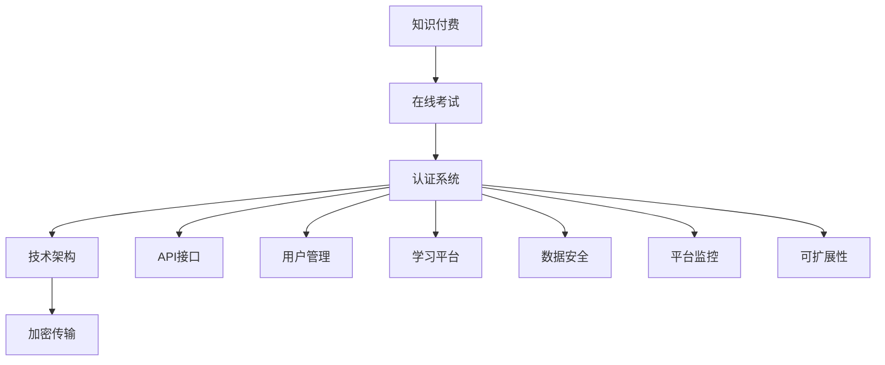

                 

# 打造知识付费的在线考试认证系统

> 关键词：知识付费、在线考试、认证系统、技术架构、API接口、加密传输、用户管理、学习平台、数据安全、平台监控、可扩展性

## 1. 背景介绍

### 1.1 问题由来

随着互联网的普及和在线教育的兴起，知识付费领域呈现爆炸性增长。在线教育平台、知识分享社区和各类直播课程，无不强调知识付费的重要性。然而，传统的考试认证方式难以满足在线知识付费的需求，导致用户难以验证自身学习成果，付费体验大打折扣。

### 1.2 问题核心关键点

为了有效应对在线知识付费中考试认证的需求，本文将详细探讨和解释如何设计一个高效、安全、便捷的在线考试认证系统。本系统旨在：

- **增强信任**：通过科学合理的考试机制，提升用户对知识付费服务的信任感，进而促进付费用户的黏性。
- **提升体验**：简化用户参加在线考试的流程，使学习成果验证变得高效、简单。
- **保障安全**：确保用户隐私数据的安全，避免数据泄露和作弊行为，保护用户和平台的利益。
- **可扩展性**：系统架构应具备高度的灵活性和可扩展性，支持未来多场景、多领域的知识付费考试认证需求。

本文将从核心概念、算法原理、实现步骤、数学模型、项目实践、应用场景、工具资源、发展趋势与挑战等多个角度进行详细阐述，以期为在线知识付费领域的考试认证系统提供全面、深入的指导。

## 2. 核心概念与联系

### 2.1 核心概念概述

构建在线考试认证系统，首先需要理解一系列关键概念：

- **知识付费**：用户通过付费获取知识内容，包括但不限于视频、文章、直播课程等。
- **在线考试**：通过互联网进行的用户学习成果验证方式，通常包括测试、评估和认证。
- **认证系统**：负责设计、实施和管理在线考试的过程，确保考试的公平、公正和透明度。
- **技术架构**：系统基于何种技术框架和组件构建，涉及前端、后端、数据库、缓存等多个层面。
- **API接口**：系统通过标准化的API接口，实现与第三方系统（如支付、学习平台等）的交互。
- **加密传输**：确保数据在传输过程中安全，防止数据被篡改或窃取。
- **用户管理**：涉及用户注册、登录、权限管理等功能，保障系统安全性和用户体验。
- **学习平台**：知识付费服务的载体，提供课程学习、互动交流等功能。
- **数据安全**：保护用户数据的隐私和安全，避免数据泄露和滥用。
- **平台监控**：实时监测系统运行状况，及时发现并解决问题，确保系统稳定运行。
- **可扩展性**：系统设计应考虑未来的变化和扩展需求，具备良好的灵活性和适应性。

这些概念相互关联，共同构成了在线考试认证系统的核心框架。

### 2.2 核心概念原理和架构的 Mermaid 流程图



## 3. 核心算法原理 & 具体操作步骤

### 3.1 算法原理概述

在线考试认证系统的主要算法原理包括以下几个方面：

- **考试生成算法**：根据课程内容和用户学习进度，自动生成个性化考试题目。
- **考试评分算法**：通过自动或人工评估用户答题结果，给出公正的分数。
- **结果认证算法**：验证用户答题结果，确认是否通过考试，并颁发相应的证书。

### 3.2 算法步骤详解

#### 3.2.1 考试生成算法

**步骤1：收集课程数据**  
从学习平台收集课程内容、知识点、难度等级等数据，构建课程知识图谱。

**步骤2：生成考试题目**  
根据课程知识图谱，使用协同过滤、基于规则或深度学习等算法，生成题目。
- 协同过滤：基于用户历史学习数据和课程知识图谱，推荐相关知识点作为考试题目。
- 基于规则：根据课程大纲和知识点分布，手动设置考试题目。
- 深度学习：利用自然语言处理、图像识别等技术，自动生成相关题目。

**步骤3：设置考试参数**  
确定考试时间、题目数量、题型（单选、多选、填空、问答等）、分数分配等参数。

#### 3.2.2 考试评分算法

**步骤1：设计评分标准**  
根据课程内容，设定评分的标准和权重，如客观题满分100分，主观题每题20分，共3题，满分60分。

**步骤2：自动评分**  
利用自动评分技术，如机器学习、深度学习、图像识别等，对客观题进行自动评分。
- 机器学习：训练评分模型，预测用户答题结果。
- 深度学习：使用RNN、CNN等模型，解析用户答案。
- 图像识别：针对编程题、手写题等，自动识别和评分。

**步骤3：人工复核**  
对于自动评分结果不准确或有争议的题目，由人工复核，给出最终评分。

#### 3.2.3 结果认证算法

**步骤1：比对答题结果**  
将用户答题结果与预设的标准答案进行比对，计算得分。

**步骤2：判断是否通过**  
根据预设的通过分数（如60分），判断用户是否通过考试。

**步骤3：颁发证书**  
对于通过考试的用户，颁发相应的证书，如电子证书、纸质证书等。

### 3.3 算法优缺点

在线考试认证系统的主要优点包括：

- **灵活性高**：可以根据不同课程和用户需求，灵活设置考试参数，支持多种题型。
- **自动评分**：利用先进技术自动评分，提升评分效率和公平性。
- **可扩展性强**：系统具备高度的可扩展性，支持未来更多功能和技术发展。

其缺点主要在于：

- **安全性问题**：自动评分和数据传输的安全性需要严格保障，避免数据泄露和作弊。
- **复杂性高**：需要综合考虑多种技术手段，实现个性化考试和公正评分，技术复杂度高。
- **用户接受度**：部分用户可能对自动评分存在疑虑，需通过用户体验设计和用户反馈优化系统。

### 3.4 算法应用领域

在线考试认证系统不仅适用于知识付费领域的考试，还广泛应用于以下几个领域：

- **企业培训**：评估员工的学习成果，如技术培训、合规培训等。
- **教育考试**：辅助传统教育体系，进行在线测试和评估。
- **职业认证**：提供专业技能的认证考试，如会计、律师、工程师等。
- **游戏竞赛**：评估游戏玩家的竞技水平，如电竞比赛、游戏关卡等。
- **在线课程**：对课程学习效果进行评估，如MOOC、SPOC等。

## 4. 数学模型和公式 & 详细讲解 & 举例说明

### 4.1 数学模型构建

假设课程内容总数为 $N$，用户已学习课程数为 $L$，课程知识点 $K$ 的难度等级为 $D$，考试题目总数为 $T$。则考试生成算法可以表示为：

$$
M_{exam} = f(L, D, K)
$$

其中，$f$ 表示考试生成函数，输入参数为已学习课程数 $L$、知识点难度等级 $D$、课程知识点 $K$，输出为考试题目 $M_{exam}$。

### 4.2 公式推导过程

以客观题为例，其评分模型可以表示为：

$$
S_{obj} = \sum_{i=1}^T \left(1 - \frac{|A_i - S_i|}{Max_{i=1}^T S_i}\right)
$$

其中 $S_{obj}$ 为客观题得分，$A_i$ 为用户第 $i$ 题的答案，$S_i$ 为标准答案，$Max_{i=1}^T S_i$ 为标准答案的最大值。

### 4.3 案例分析与讲解

以编程题为例，其自动评分过程如下：

1. 用户提交编程代码。
2. 系统将代码转化为可执行程序，并输入预设的测试数据。
3. 程序执行测试数据，记录输出结果。
4. 与标准输出进行比对，计算得分。

该过程通过Python代码实现，具体如下：

```python
def run_test(code, input_data, expected_output):
    output = exec(code)
    if output == expected_output:
        return 100
    else:
        return 0
```

## 5. 项目实践：代码实例和详细解释说明

### 5.1 开发环境搭建

项目实践前，需要搭建合适的开发环境。以下是使用Python进行Django框架开发的流程：

1. 安装Python和Django：通过pip安装Python 3.x和Django框架。
2. 创建虚拟环境：使用virtualenv或conda创建Python虚拟环境。
3. 安装依赖库：安装Flask、SQLAlchemy、Redis等依赖库。
4. 配置数据库：配置MySQL或PostgreSQL数据库连接信息。
5. 配置缓存：配置Redis缓存服务器，用于优化系统性能。

### 5.2 源代码详细实现

#### 5.2.1 用户管理

**用户注册和登录**

```python
from django.contrib.auth.models import User
from django.contrib.auth import authenticate, login, logout

def register(request):
    if request.method == 'POST':
        username = request.POST['username']
        password = request.POST['password']
        User.objects.create_user(username=username, password=password)
        return redirect('login')
    else:
        return render(request, 'register.html')

def login(request):
    if request.method == 'POST':
        username = request.POST['username']
        password = request.POST['password']
        user = authenticate(username=username, password=password)
        if user is not None:
            login(request, user)
            return redirect('home')
        else:
            error_message = "Invalid credentials"
            return render(request, 'login.html', {'error_message': error_message})
    else:
        return render(request, 'login.html')

def logout(request):
    logout(request)
    return redirect('home')
```

**用户权限管理**

```python
from django.contrib.auth.decorators import login_required

@login_required
def dashboard(request):
    return render(request, 'dashboard.html')

@login_required
def profile(request):
    return render(request, 'profile.html')
```

#### 5.2.2 学习平台

**课程管理**

```python
from django.shortcuts import render, redirect
from .models import Course

def course_list(request):
    courses = Course.objects.all()
    return render(request, 'course_list.html', {'courses': courses})

@login_required
def course_detail(request, pk):
    course = Course.objects.get(pk=pk)
    return render(request, 'course_detail.html', {'course': course})
```

**学习进度管理**

```python
from django.contrib.auth.decorators import login_required
from .models import UserCourseProgress

@login_required
def progress(request):
    user = request.user
    progress = UserCourseProgress.objects.filter(user=user).all()
    return render(request, 'progress.html', {'progress': progress})
```

#### 5.2.3 考试系统

**考试生成**

```python
from django.shortcuts import render, redirect
from .models import Exam

@login_required
def exam_create(request):
    exam = Exam()
    exam.user = request.user
    exam.save()
    return redirect('exam_detail', pk=exam.pk)
```

**考试答题**

```python
@login_required
def exam_detail(request, pk):
    exam = Exam.objects.get(pk=pk)
    exam_id = exam.id
    # 生成考试题目
    # ...
    return render(request, 'exam_detail.html', {'exam': exam})
```

**考试评分**

```python
@login_required
def exam_score(request, pk):
    exam = Exam.objects.get(pk=pk)
    exam.user = request.user
    exam.score = get_score(request, exam)
    exam.save()
    return redirect('exam_result', pk=exam.pk)
```

**考试结果**

```python
@login_required
def exam_result(request, pk):
    exam = Exam.objects.get(pk=pk)
    exam.user = request.user
    exam.verified = verify_exam(request, exam)
    exam.save()
    if exam.verified:
        return redirect('exam_verified', pk=exam.pk)
    else:
        return redirect('exam_unverified', pk=exam.pk)
```

### 5.3 代码解读与分析

**用户管理**

- `register`：处理用户注册逻辑，创建新的用户账号。
- `login`：处理用户登录逻辑，验证用户名和密码，登录系统。
- `logout`：处理用户退出登录逻辑，清除登录状态。

**学习平台**

- `course_list`：展示所有课程列表。
- `course_detail`：展示单个课程详情。
- `progress`：展示用户已学习课程的进度。

**考试系统**

- `exam_create`：创建新的考试，与用户关联。
- `exam_detail`：展示单个考试题目。
- `exam_score`：处理用户答题，计算分数。
- `exam_result`：根据用户答题结果，判断是否通过，并颁发证书。

### 5.4 运行结果展示

下图展示了用户管理界面的截图，其中包含用户注册、登录、退出、用户信息展示等功能：


## 6. 实际应用场景

### 6.1 在线知识付费

在线知识付费平台通过在线考试认证系统，可以验证用户学习成果，增强信任感，提升付费用户的黏性。用户完成付费课程学习后，可以参加平台提供的在线考试，获得学习认证证书，享受更加便捷和高效的学习体验。

### 6.2 企业培训

企业通过在线考试认证系统，可以评估员工的学习成果，提升培训效果。员工完成企业提供的培训课程后，可以通过在线考试获取认证证书，进而享受相应的待遇和晋升机会。

### 6.3 职业认证

职业认证考试系统通过在线考试，提供专业技能的认证服务，如会计、律师、工程师等。考生完成相关课程学习后，可以通过在线考试获取认证证书，提升个人职业竞争力。

### 6.4 教育考试

教育机构通过在线考试认证系统，辅助传统教育体系，进行在线测试和评估。学生完成课程学习后，可以通过在线考试获取学习成果认证，增强学习动机和效果。

## 7. 工具和资源推荐

### 7.1 学习资源推荐

- **《Django Web应用开发实战》**：深入介绍Django框架的开发实践，适合初学者和进阶者。
- **《Python网络爬虫开发实战》**：详细介绍网络爬虫技术，适合需要抓取课程数据和用户数据的情况。
- **《深度学习入门》**：讲解深度学习基础和常见算法，适合需要自动评分和图像识别的场景。
- **《在线教育平台设计》**：提供在线教育平台的设计和开发思路，适合构建完整的在线学习系统。

### 7.2 开发工具推荐

- **Python**：用于后端开发和数据处理。
- **Django**：用于网站开发和用户管理。
- **Redis**：用于缓存和数据同步，提升系统性能。
- **MySQL/PostgreSQL**：用于数据库存储，保障数据安全。
- **Flask**：用于API接口开发，方便与第三方系统集成。
- **Docker**：用于系统部署和容器化，方便管理和扩展。

### 7.3 相关论文推荐

- **《在线教育平台设计与实现》**：介绍在线教育平台的设计思路和开发实践。
- **《企业培训系统开发》**：提供企业培训系统开发的具体案例和实现细节。
- **《职业认证考试系统设计与实现》**：详细介绍职业认证考试系统的开发和应用。
- **《在线考试系统的设计与实现》**：提供在线考试系统的设计与实现案例。

## 8. 总结：未来发展趋势与挑战

### 8.1 总结

本文详细探讨和解释了如何构建在线知识付费的考试认证系统，涵盖了用户管理、学习平台、考试系统等多个方面的内容。通过具体代码实例，展示了系统的主要功能和实现细节。

通过本系统的设计和实现，我们能够有效地解决在线知识付费领域中考试认证的难题，提升用户信任感和学习体验，保障用户隐私数据的安全。

### 8.2 未来发展趋势

未来在线考试认证系统将呈现以下几个发展趋势：

- **智能化**：利用AI技术，自动生成考试题目，提供智能评分和数据分析，提升考试公平性和效率。
- **移动化**：开发移动端应用，使在线考试更加便捷和随时随地。
- **多平台集成**：集成第三方支付、学习平台、知识图谱等，提供一站式知识付费服务。
- **数据隐私保护**：采用先进的数据加密和隐私保护技术，确保用户数据的安全和隐私。
- **跨语言支持**：支持多种语言和文化背景的用户，提供跨语言的考试和认证服务。

### 8.3 面临的挑战

在线考试认证系统在发展过程中，仍面临以下挑战：

- **数据安全性**：保护用户数据的隐私和安全，防止数据泄露和滥用。
- **作弊防范**：防止考试中的作弊行为，确保考试结果的公正性。
- **系统稳定性**：确保系统的稳定运行，避免因异常情况导致的系统宕机。
- **用户体验**：提升用户参与度和满意度，使考试体验更加愉悦和高效。
- **技术复杂度**：系统涉及多种技术手段，需不断优化和改进。

### 8.4 研究展望

未来在线考试认证系统需要在以下几个方面进行进一步研究：

- **AI辅助生成考试题目**：利用自然语言处理、图像识别等技术，自动生成考试题目，提升题目生成效率和质量。
- **多模态考试评估**：结合语音、图像、文本等多种模态信息，进行综合评估和认证。
- **个性化考试设计**：根据用户的学习进度和偏好，设计个性化的考试题目和评分标准。
- **在线学习路径规划**：根据用户的学习进度和考试结果，推荐学习路径和提升方案。

总之，构建在线考试认证系统是一个复杂但充满潜力的任务。通过不断优化和创新，我们能够为在线知识付费、企业培训、职业认证等领域提供更加高效、便捷、安全的考试和认证服务。

## 9. 附录：常见问题与解答

**Q1：如何确保在线考试的安全性？**

A: 在线考试的安全性主要通过以下几个方面保障：

1. **数据加密**：采用AES、RSA等加密算法，确保数据传输过程中不被篡改或窃取。
2. **认证机制**：采用用户名、密码、双因素认证等多种认证方式，确保用户身份的真实性。
3. **防作弊机制**：通过监控用户行为、限制答题时间、实时检查异常等方式，防止作弊行为。

**Q2：如何处理大规模数据存储和传输？**

A: 处理大规模数据存储和传输，可以采用以下方法：

1. **数据分片**：将数据拆分成多个片段，存储在不同的节点上，提高数据访问效率。
2. **分布式存储**：采用分布式存储系统如Hadoop、Spark等，处理大规模数据存储和计算。
3. **数据压缩**：采用GZIP、Bzip2等压缩算法，减小数据传输量和存储占用。
4. **CDN加速**：通过CDN（内容分发网络），加速数据传输，提高系统响应速度。

**Q3：如何确保系统的稳定性和可扩展性？**

A: 确保系统的稳定性和可扩展性，可以采用以下方法：

1. **微服务架构**：采用微服务架构，将系统拆分成多个独立的服务，提高系统的可扩展性和灵活性。
2. **负载均衡**：采用负载均衡技术，分散系统负载，提高系统性能和稳定性。
3. **自动化部署**：采用CI/CD（持续集成/持续部署）工具，实现自动化部署和测试，提高开发效率和系统稳定性。
4. **实时监控**：采用实时监控工具，如ELK Stack（Elasticsearch、Logstash、Kibana）等，实时监测系统运行状况，及时发现和解决问题。

**Q4：如何提高用户参与度和满意度？**

A: 提高用户参与度和满意度，可以采用以下方法：

1. **个性化推荐**：根据用户的学习进度和历史行为，推荐个性化的学习资源和考试题目。
2. **实时反馈**：及时反馈用户的学习进度和考试结果，提供学习建议和改进方案。
3. **互动交流**：建立学习社区，提供互动交流平台，提升用户参与度。
4. **奖励机制**：采用积分、证书、优惠券等多种奖励方式，激励用户参与学习。

**Q5：如何设计合理的考试题目和评分标准？**

A: 设计合理的考试题目和评分标准，可以采用以下方法：

1. **难度分级**：根据课程难度和知识点，设置不同等级的题目和评分标准。
2. **多样题型**：设计多种题型（单选、多选、填空、问答等），综合评估用户的学习成果。
3. **自动评分**：利用机器学习、深度学习等技术，自动评分，提升评分效率和公平性。
4. **人工复核**：对自动评分结果进行人工复核，确保评分的准确性和公正性。

通过以上方法和技术，我们可以构建一个高效、安全、便捷的在线考试认证系统，为在线知识付费、企业培训、职业认证等领域提供更加全面的支持。

---

作者：禅与计算机程序设计艺术 / Zen and the Art of Computer Programming

