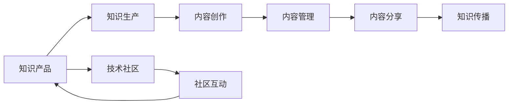

                 

# 打造被程序员需要的知识产品

> 关键词：知识产品, 程序员, 软件开发, 知识管理, 技术分享, 技术社区

## 1. 背景介绍

在快速发展的技术时代，程序员面临着前所未有的挑战：技术的更新换代加速，知识的积累与传播变得愈发重要。如何有效地掌握和分享知识，成为了每个程序员必须面对的问题。传统的书籍、文档、博客等已经不能满足程序员对知识获取的需求，因此，需要一种新的知识产品形态，以满足程序员在开发过程中对高效、灵活、可持续知识分享的需求。

本文将探讨如何打造符合程序员需求的知识产品，包括知识产品的定义、核心特征、构建方法、实际案例等，旨在为技术人员提供全方位的指导，帮助他们在知识海洋中游刃有余。

## 2. 核心概念与联系

### 2.1 核心概念概述

知识产品（Knowledge Product）是一种新的信息传递形式，旨在将复杂、分散的知识信息以更加高效、易于理解的方式呈现给用户，主要应用于软件开发、技术分享、知识管理等领域。知识产品不仅包括传统意义上的书籍、论文、视频，还包括在线课程、技术博客、开源项目、技术社区等，涵盖了从知识生产、分享、传播到应用的整个流程。

知识产品的核心特征包括：

- **高效性**：快速获取和理解信息。
- **实用性**：紧密结合实际应用场景。
- **可分享性**：方便知识交流与传播。
- **可扩展性**：支持长期内容更新与扩展。

通过上述特征的实现，知识产品能够帮助程序员快速提升技术水平，同时促进技术社区的活跃与发展。

### 2.2 核心概念原理和架构的 Mermaid 流程图



## 3. 核心算法原理 & 具体操作步骤

### 3.1 算法原理概述

知识产品的构建主要基于以下几个核心算法原理：

- **信息抽取（Information Extraction）**：从原始数据中提取关键信息，并进行结构化处理。
- **文本分类（Text Classification）**：对抽取到的信息进行分类，以便快速索引和查找。
- **推荐系统（Recommendation System）**：根据用户行为，推荐最相关的知识产品。
- **内容生成（Content Generation）**：利用自然语言处理（NLP）技术生成新的知识内容。

### 3.2 算法步骤详解

知识产品的构建可以分为以下几个主要步骤：

**Step 1: 知识收集与预处理**
- 收集大量高质量的技术文档、博客、论文等原始内容。
- 对原始内容进行去重、清洗、格式转换等预处理，以提高后续处理效率。

**Step 2: 信息抽取与分类**
- 利用信息抽取技术，从处理后的文本中提取出关键词、实体、关系等关键信息。
- 根据信息的重要性和关联度，对提取到的信息进行分类。

**Step 3: 内容管理与索引**
- 对分类后的信息进行结构化管理，建立知识图谱、索引等。
- 采用搜索引擎技术，对知识进行快速查询和检索。

**Step 4: 内容推荐与呈现**
- 利用推荐系统算法，根据用户行为和偏好推荐相关的知识产品。
- 设计友好的用户界面，方便用户浏览、阅读、互动。

**Step 5: 社区互动与反馈**
- 搭建技术社区平台，促进用户之间的交流和反馈。
- 利用机器学习算法，根据用户反馈不断优化推荐系统。

### 3.3 算法优缺点

知识产品的构建基于多种先进算法，但也存在一定的局限性：

**优点：**
- **高效性**：利用算法自动化处理大量信息，快速生成有用内容。
- **实时性**：推荐系统和社区互动可以实时更新，提供最新信息。
- **个性化**：根据用户行为个性化推荐，提高用户满意度。

**缺点：**
- **成本高**：算法实现和维护需要投入大量资源。
- **数据隐私**：用户行为数据可能涉及隐私问题。
- **技术门槛**：需要一定的算法和工程背景才能实现。

### 3.4 算法应用领域

知识产品构建的核心算法应用于多个领域：

- **软件开发**：技术博客、开源项目、API文档等。
- **技术分享**：在线课程、视频教程、技术讲座等。
- **知识管理**：企业内部知识库、文档管理系统等。

这些领域共同构成了知识产品生态，为技术传播提供了丰富的内容来源和表现形式。

## 4. 数学模型和公式 & 详细讲解 & 举例说明

### 4.1 数学模型构建

知识产品的构建涉及多个数学模型，其中最重要的是内容推荐模型。这里以协同过滤（Collaborative Filtering）为例，构建一个简单的推荐系统模型。

**协同过滤模型的数学模型**：

- **用户-项目评分矩阵**：$R_{ui} \in [0,1]$，表示用户$u$对项目$i$的评分。
- **用户特征向量**：$U_u$，表示用户$u$的兴趣偏好。
- **项目特征向量**：$P_i$，表示项目$i$的属性特征。
- **用户-项目评分预测**：$\hat{R}_{ui} = \langle U_u, P_i \rangle$，其中$\langle,\rangle$为向量内积。

### 4.2 公式推导过程

协同过滤模型的评分预测公式可以推导如下：

$$
\hat{R}_{ui} = \langle U_u, P_i \rangle = \sum_{j=1}^d U_{uj} P_{ij}
$$

其中$d$为特征向量的维度。

在实际应用中，协同过滤模型可以通过矩阵分解等方法，进一步优化评分预测的准确性。

### 4.3 案例分析与讲解

**案例：GitHub代码推荐系统**

GitHub是一个全球最大的开源代码托管平台，每天都会产生大量的代码更新和项目。为了帮助用户快速找到感兴趣的代码，GitHub引入了协同过滤算法，构建了一个高效的代码推荐系统。

- **数据收集**：从GitHub上收集用户的提交历史、仓库访问记录等数据。
- **特征抽取**：提取代码的语言类型、作者、更新时间、代码风格等特征。
- **评分预测**：利用协同过滤模型预测用户对不同代码的评分。
- **推荐排序**：根据评分预测结果，对代码进行排序推荐。

该系统在提高代码查找效率和用户体验方面发挥了重要作用。

## 5. 项目实践：代码实例和详细解释说明

### 5.1 开发环境搭建

为了实现上述推荐系统，首先需要搭建相应的开发环境：

**Step 1: 安装Python和相关库**
- 使用Anaconda安装Python3和相关依赖库，如Pandas、NumPy、Scikit-learn、TensorFlow等。

**Step 2: 数据收集与预处理**
- 从GitHub API获取用户和代码数据。
- 进行数据清洗和预处理，包括去重、缺失值处理、格式转换等。

**Step 3: 特征抽取与评分预测**
- 使用NLP工具进行代码特征抽取。
- 构建协同过滤模型，进行评分预测。

### 5.2 源代码详细实现

**代码实现示例**：

```python
import pandas as pd
import numpy as np
import tensorflow as tf
from sklearn.decomposition import TruncatedSVD

# 加载数据
user_data = pd.read_csv('user_data.csv')
repo_data = pd.read_csv('repo_data.csv')

# 数据清洗与预处理
user_data = user_data.drop_duplicates()
repo_data = repo_data.drop_duplicates()

# 特征抽取
user_features = user_data[['name', 'commit_count', 'last_access']]
repo_features = repo_data[['name', 'language', 'created_at', 'update_frequency']]

# 评分预测
svd = TruncatedSVD(n_components=100, random_state=42)
user_feats = svd.fit_transform(user_features)
repo_feats = svd.transform(repo_features)

# 构建评分矩阵
R = np.dot(user_feats, repo_feats.T)

# 评分预测
preds = R @ repo_feats

# 推荐排序
top_n = 10
recommendations = [(i, score) for i, score in enumerate(preds) if score > 0.5][:top_n]

# 输出推荐结果
for i, score in recommendations:
    print(f"推荐代码 {i}: {score:.2f}")
```

### 5.3 代码解读与分析

**代码解析**：
- **数据加载**：使用Pandas库加载用户和代码数据。
- **数据预处理**：去除重复数据，处理缺失值。
- **特征抽取**：提取用户和代码的特征，如用户名、提交次数、代码语言等。
- **评分预测**：使用TruncatedSVD算法进行降维，构建用户-代码评分矩阵，预测用户对代码的评分。
- **推荐排序**：根据评分预测结果，选择高评分代码进行推荐。

### 5.4 运行结果展示

运行上述代码后，将输出推荐结果列表，展示了用户可能感兴趣的代码及其评分。

## 6. 实际应用场景

### 6.1 软件开发

知识产品在软件开发领域的应用非常广泛，如技术博客、开源项目、API文档等。这些产品帮助开发者快速掌握新技术、提高代码质量、降低开发成本。

**案例：Stack Overflow技术博客**

Stack Overflow是一个著名的技术问答平台，其中的技术博客和文章深受开发者欢迎。

- **内容创建**：开发者上传技术分享文章，包括代码示例、使用方法、解决方案等。
- **内容管理**：平台对文章进行分类、索引、标注，便于用户查找。
- **社区互动**：用户可以通过评论、点赞等方式进行互动，提高文章质量。

Stack Overflow技术博客成为了开发者学习和交流的重要渠道。

### 6.2 技术分享

知识产品还可以应用于技术分享领域，如在线课程、视频教程、技术讲座等。这些产品使得知识传播更加高效、覆盖更广。

**案例：Udacity在线课程**

Udacity提供大量高质量的在线课程，涵盖机器学习、人工智能、Web开发等多个领域。

- **课程设计**：专家录制课程视频，编写教学资料，设计练习题目。
- **课程推荐**：根据用户学习历史和兴趣，推荐相关课程。
- **互动学习**：用户可以在课程评论区提问、讨论，形成良好的学习氛围。

Udacity在线课程成为了众多开发者学习新知识的重要平台。

### 6.3 知识管理

知识产品在企业知识管理领域也有重要应用，如企业内部知识库、文档管理系统等。这些产品帮助企业积累和传播技术知识，提升整体技术水平。

**案例：Confluence文档管理系统**

Confluence是Atlassian公司开发的企业文档管理工具，帮助团队协作、知识共享。

- **文档创建**：团队成员上传技术文档、项目文档、会议纪要等。
- **文档分类**：对文档进行分类、标签、索引等管理。
- **文档搜索**：快速搜索和检索所需文档，提高团队效率。

Confluence文档管理系统在企业知识管理中发挥了重要作用。

## 7. 工具和资源推荐

### 7.1 学习资源推荐

为了帮助开发者更好地理解和应用知识产品，以下是一些优秀的学习资源：

**书籍推荐：**
- 《深度学习》（Ian Goodfellow等著）：深入介绍深度学习算法及其应用。
- 《机器学习实战》（Peter Harrington著）：实用的机器学习项目实战案例。
- 《Python数据科学手册》（Jake VanderPlas著）：Python数据科学基础与应用。

**在线课程推荐：**
- Coursera：提供众多高质量的在线课程，涵盖计算机科学、数据科学等多个领域。
- Udacity：提供实战项目导向的课程，帮助学员掌握实际技能。
- edX：提供与全球顶尖大学合作的在线课程，涵盖多个学科领域。

**社区推荐：**
- Stack Overflow：技术问答社区，提供丰富的代码示例和解决方案。
- GitHub：全球最大的开源代码托管平台，方便开发者协作和分享。
- Kaggle：数据科学竞赛平台，提供大量数据集和算法竞赛。

**工具推荐：**
- Pandas：数据处理和分析工具，支持大规模数据处理。
- TensorFlow：开源机器学习框架，支持深度学习和自然语言处理。
- Jupyter Notebook：交互式编程环境，方便开发和分享代码。

**论文推荐：**
- 《协同过滤推荐系统研究综述》（Shuai Zhang等）：全面介绍协同过滤推荐系统的发展和应用。
- 《深度学习在自然语言处理中的应用》（Yoshua Bengio等）：探讨深度学习在NLP中的最新进展。
- 《分布式深度学习系统设计》（Jeff Dean等）：介绍分布式深度学习系统设计原理和实践。

### 7.2 开发工具推荐

为了构建知识产品，以下是一些常用的开发工具：

**数据处理与分析：**
- Pandas：数据处理和分析工具，支持大规模数据处理。
- NumPy：科学计算库，支持高效矩阵计算。
- Scikit-learn：机器学习库，提供多种算法实现。

**机器学习与深度学习：**
- TensorFlow：开源机器学习框架，支持深度学习和自然语言处理。
- PyTorch：深度学习框架，提供动态图机制，易于调试和优化。
- Keras：高级深度学习库，支持快速原型开发。

**开发与协作：**
- Jupyter Notebook：交互式编程环境，方便开发和分享代码。
- GitHub：全球最大的开源代码托管平台，方便开发者协作和分享。
- Docker：容器化技术，支持应用程序的跨平台部署和运行。

**代码质量与性能：**
- PyTest：测试框架，支持自动化测试和代码覆盖率统计。
- Black：代码格式化工具，支持自动化代码风格检查。
- Profiler：性能分析工具，帮助优化代码性能。

### 7.3 相关论文推荐

为了深入了解知识产品的构建和应用，以下是一些相关的学术论文：

**协同过滤推荐系统：**
- 《基于协同过滤的推荐系统研究》（Bing Liu等）：介绍协同过滤推荐系统的基本原理和实现方法。
- 《矩阵分解算法在推荐系统中的应用》（Jiawei Han等）：探讨矩阵分解算法在推荐系统中的应用。

**深度学习在NLP中的应用：**
- 《Transformer模型及其在机器翻译中的应用》（Ashish Vaswani等）：介绍Transformer模型及其在机器翻译中的应用。
- 《BERT：预训练语言表示模型》（Jacob Devlin等）：介绍BERT模型及其在NLP任务中的应用。

**知识产品构建：**
- 《基于知识图谱的推荐系统研究综述》（Ding Liu等）：全面介绍基于知识图谱的推荐系统。
- 《知识管理系统的设计与实现》（Yannis Demiray等）：介绍知识管理系统的设计与实现方法。

## 8. 总结：未来发展趋势与挑战

### 8.1 研究成果总结

知识产品作为一种新型信息传递形式，在软件开发、技术分享、知识管理等领域具有广泛应用前景。通过构建高效、实用、可扩展的知识产品，能够帮助开发者快速掌握新技术，提高开发效率，促进技术交流与合作。

### 8.2 未来发展趋势

未来，知识产品将继续发展，呈现以下几个趋势：

**趋势一：智能化提升**
- 利用人工智能技术，提升知识产品的智能化程度，如内容推荐、自动生成等。
- 引入自然语言处理（NLP）技术，使得知识产品更加自然流畅。

**趋势二：交互性增强**
- 增强用户与知识产品的互动体验，如互动式教程、虚拟实验室等。
- 利用增强现实（AR）和虚拟现实（VR）技术，提供沉浸式学习体验。

**趋势三：数据驱动**
- 利用大数据分析技术，深入挖掘用户行为和需求，提升知识产品的个性化推荐能力。
- 结合用户反馈和行为数据，不断优化知识产品的内容和形式。

**趋势四：跨平台协同**
- 支持多种平台和设备，提供跨平台的学习和交流体验。
- 实现知识产品与外部系统（如企业知识库、在线教育平台等）的协同工作。

### 8.3 面临的挑战

尽管知识产品具备诸多优势，但在实际应用中也面临一些挑战：

**挑战一：数据隐私与安全**
- 用户数据隐私保护和安全性问题，需要在设计时充分考虑。
- 防止恶意攻击和数据泄露，保障知识产品的安全运行。

**挑战二：内容质量与一致性**
- 如何保证知识内容的准确性和一致性，避免误导用户。
- 避免过度商业化，保持知识产品的公益性和普适性。

**挑战三：用户体验与界面设计**
- 设计友好的用户界面，提升用户使用体验。
- 界面设计需要考虑不同用户的需求和使用习惯。

**挑战四：知识更新与维护**
- 知识产品需要不断更新和维护，保持内容的实时性和相关性。
- 合理分配资源，提高知识产品更新和维护的效率。

### 8.4 研究展望

未来，知识产品的研究将围绕以下几个方向展开：

**方向一：知识表示与语义理解**
- 深入研究知识表示方法，构建更加丰富、准确的语义模型。
- 引入知识图谱、本体等技术，提升知识产品的语义理解能力。

**方向二：跨领域知识整合**
- 实现不同领域知识的无缝整合，提升知识产品的综合应用能力。
- 探索跨领域知识图谱的构建方法，促进知识产品的跨领域应用。

**方向三：知识社区的智能化**
- 引入智能算法，提升知识社区的自动化管理水平。
- 探索知识社区的协作机制，促进知识的共享与创新。

**方向四：知识产品的开放性与合作**
- 实现知识产品的开放性，促进知识社区的协同创新。
- 探索知识产品的合作机制，促进跨组织、跨学科的合作与交流。

通过以上研究方向的探索，相信知识产品将不断完善和发展，成为程序员在知识海洋中游刃有余的有力工具。

## 9. 附录：常见问题与解答

**Q1: 如何设计高效的知识产品？**

A: 设计高效的知识产品需要考虑以下几个方面：
- **用户需求分析**：充分了解用户需求和使用场景。
- **内容质量保证**：确保知识内容的准确性、权威性和实用性。
- **用户体验优化**：设计友好的用户界面，提升用户使用体验。
- **系统性能优化**：采用高效的数据处理和算法实现，提升系统性能。

**Q2: 如何保证知识产品的数据隐私与安全？**

A: 保证知识产品的数据隐私与安全需要考虑以下几个方面：
- **数据加密**：采用数据加密技术，防止数据泄露。
- **访问控制**：设置合理的访问权限，防止非法访问。
- **隐私保护**：遵守数据隐私法律法规，保护用户隐私。
- **安全监控**：实时监控系统安全状态，及时发现和应对安全威胁。

**Q3: 如何设计知识产品的推荐系统？**

A: 设计知识产品的推荐系统需要考虑以下几个方面：
- **用户行为分析**：收集用户行为数据，建立用户画像。
- **协同过滤算法**：利用协同过滤算法，预测用户对不同内容的兴趣。
- **内容推荐排序**：根据评分预测结果，对内容进行排序推荐。
- **系统优化**：不断优化推荐算法和模型，提升推荐效果。

**Q4: 如何构建知识产品的社区平台？**

A: 构建知识产品的社区平台需要考虑以下几个方面：
- **社区管理**：制定社区规则，管理社区秩序。
- **用户互动**：提供用户交流与互动功能，促进知识共享。
- **内容审核**：对社区内容进行审核，防止有害信息传播。
- **反馈机制**：建立用户反馈机制，不断优化社区功能。

通过系统回答这些常见问题，希望能够帮助开发者更好地理解知识产品的构建和应用，为知识产品的发展提供更多支持和指导。

---

作者：禅与计算机程序设计艺术 / Zen and the Art of Computer Programming

