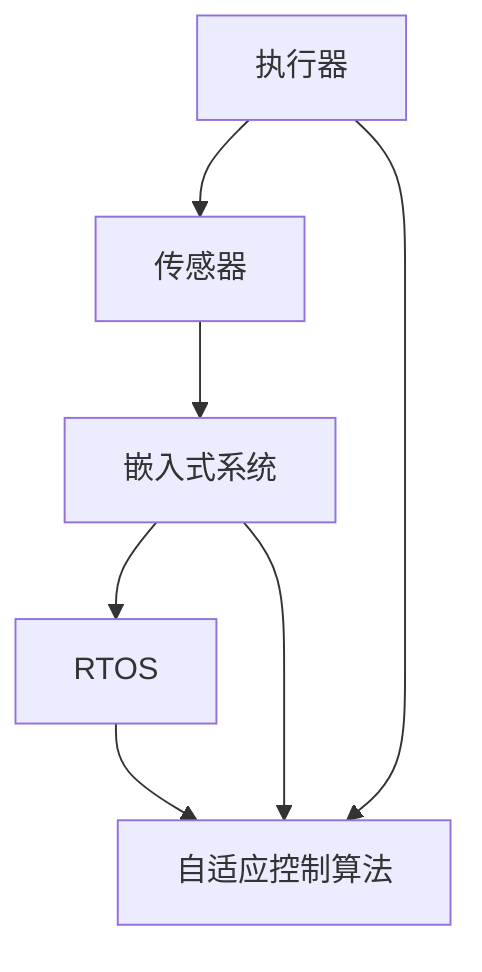

                 

## 1. 背景介绍

在当前的数字化时代，执行器控制技术在嵌入式系统中的应用愈发广泛，从智能家居到工业自动化，从医疗设备到汽车电子，执行器作为控制系统的核心组件，对于提升系统性能和用户体验具有不可替代的作用。然而，与传统的PC端系统相比，嵌入式系统通常拥有更高的实时性、更低的资源消耗和更强的环境适应性要求，这给执行器控制技术的实现带来了更多挑战。本文章旨在全面介绍基于现代嵌入式系统架构的执行器控制技术，探索其在各种实际应用场景中的具体应用。

## 2. 核心概念与联系

### 2.1 核心概念概述

在嵌入式系统中，执行器控制技术的核心概念包括但不限于以下内容：

- **执行器（Actuator）**：执行器作为物理世界的接口，负责将电子信号转换为物理动作，如电机、阀门、水泵等。
- **传感器（Sensor）**：传感器用于采集环境信息，如温度、压力、位置等，并将模拟信号转换为数字信号，供执行器控制系统使用。
- **嵌入式系统（Embedded System）**：一种将硬件和软件高度集成，专用于特定任务的计算平台。
- **实时操作系统（Real-time Operating System, RTOS）**：一种操作系统架构，专为实时任务提供高效的资源管理和调度。
- **自适应控制算法（Adaptive Control Algorithm）**：一种能够根据系统状态动态调整控制参数，以实现最优控制的算法。

这些概念通过逻辑流程连接，构成了一个完整、高效的执行器控制技术生态系统。

### 2.2 核心概念原理和架构的 Mermaid 流程图



该流程图展示了执行器控制技术的核心架构和工作流程：

1. **执行器** 通过 **传感器** 获取环境信息。
2. **嵌入式系统** 搭载 **RTOS**，为执行器和自适应控制算法提供稳定的运行环境。
3. **自适应控制算法** 根据传感器反馈信息，动态调整执行器行为，实现高效、可靠的执行任务。

## 3. 核心算法原理 & 具体操作步骤

### 3.1 算法原理概述

基于嵌入式系统的执行器控制技术主要包括以下算法原理：

1. **实时调度算法（Real-time Scheduling Algorithm）**：用于实时任务的管理和调度，如时间片轮转（Round Robin）、优先级调度（Priority Scheduling）等。
2. **自适应控制算法（Adaptive Control Algorithm）**：通过动态调整控制参数，实现最优控制，如PID控制、模糊控制等。
3. **传感器数据处理算法（Sensor Data Processing Algorithm）**：用于数据滤波、信号处理等，提高数据采集的准确性和可靠性。

### 3.2 算法步骤详解

以典型的PID控制算法为例，其步骤如下：

1. **读取传感器数据**：获取当前环境的温度值。
2. **计算偏差**：将目标温度与实际温度之差作为控制偏差。
3. **计算PID控制量**：根据控制偏差，使用PID算法计算执行器应输出的信号量。
4. **发送控制信号**：将计算得到的控制量发送给执行器，如电机。
5. **反馈调整**：执行器动作后，传感器再次读取环境温度，计算新的控制偏差，并根据PID算法输出新的控制量。

### 3.3 算法优缺点

**优点**：

1. **实时性强**：通过高效的实时调度算法，确保执行器任务按时完成，提高系统的响应速度。
2. **鲁棒性好**：自适应控制算法能够根据环境变化动态调整控制参数，增强系统的鲁棒性。
3. **可靠性高**：传感器数据处理算法提高数据采集的准确性，确保控制决策的可靠性。

**缺点**：

1. **资源消耗大**：实时调度和自适应控制算法需要较高的计算资源，可能对嵌入式系统的资源消耗较大。
2. **模型复杂**：自适应控制算法模型的建立和优化相对复杂，需要专业知识。
3. **环境适应性差**：控制算法的设计通常针对特定环境，环境变化时可能效果不佳。

### 3.4 算法应用领域

执行器控制技术广泛应用于以下领域：

1. **工业自动化**：自动化生产线上的电机、泵、阀等执行器的控制。
2. **智能家居**：智能门锁、灯光、窗帘等执行器的控制。
3. **医疗设备**：呼吸机、输液泵等医疗设备执行器的控制。
4. **汽车电子**：发动机控制、制动系统等执行器的控制。
5. **航空航天**：飞行器上的各种执行器的控制。

## 4. 数学模型和公式 & 详细讲解 & 举例说明

### 4.1 数学模型构建

以PID控制为例，其数学模型构建如下：

设目标温度为 $T_{\text{target}}$，实际温度为 $T(t)$，控制偏差为 $e(t)$，控制量输出为 $u(t)$，控制器的输出信号量为 $K_p e(t) + K_i \int_{0}^{t} e(\tau) d\tau + K_d \frac{d e(t)}{d t}$。其中 $K_p$、$K_i$、$K_d$ 为PID控制器的参数，需要根据具体应用场景进行调整。

### 4.2 公式推导过程

通过控制偏差 $e(t)$ 的差分方程，可以推导出PID控制器的传递函数，如下所示：

$$
G_c(s) = \frac{K_p s + K_i + K_d s^2}{s^3 + (2 K_d + K_p)s^2 + K_p K_i s + K_i^2}
$$

根据控制系统的稳定性条件，可以求出PID控制器的参数。

### 4.3 案例分析与讲解

以空调控制系统为例，目标温度为25℃，实际温度为 $T(t)$，控制偏差为 $e(t) = T_{\text{target}} - T(t)$。根据PID控制器模型，控制器的输出信号量为：

$$
u(t) = K_p (T_{\text{target}} - T(t)) + K_i \int_{0}^{t} (T_{\text{target}} - T(\tau)) d\tau + K_d \frac{d (T_{\text{target}} - T(t))}{d t}
$$

假设环境温度变化较快，$K_p$ 取较大的值，以提高系统的响应速度；$K_i$ 取较小值，以避免积分饱和；$K_d$ 取较大的值，以提高系统的抗扰动能力。通过实际调试，可得到最佳的控制参数，实现空调温度的稳定控制。

## 5. 项目实践：代码实例和详细解释说明

### 5.1 开发环境搭建

#### 5.1.1 硬件环境搭建

1. **选择硬件平台**：根据实际需求选择合适的嵌入式硬件平台，如树莓派、STM32、Arduino等。
2. **硬件调试**：连接传感器和执行器，并进行调试，确保硬件正常工作。

#### 5.1.2 软件环境搭建

1. **安装RTOS**：选择合适的实时操作系统，如FreeRTOS、µC/OS-II等，并进行安装和配置。
2. **安装开发工具**：安装开发环境和IDE，如Keil、MDK等，以及编译器，如GCC、Keil C51等。
3. **搭建开发环境**：在IDE中配置编译和调试环境，连接硬件平台，并测试驱动。

### 5.2 源代码详细实现

以STM32为例，实现一个基于PID控制算法的执行器控制系统。具体代码实现如下：

#### 5.2.1 传感器数据读取

```c
void read_temperature(void) {
    // 读取温度传感器数据
    int temp = get_temperature_data();
    // 处理传感器数据
    // ...
}
```

#### 5.2.2 控制算法计算

```c
void calculate_control(void) {
    // 计算控制偏差
    int error = target_temperature - get_temperature_data();
    // 计算PID控制量
    int control_output = Kp * error + Ki * error_integral + Kd * error_derivative;
    // 发送控制信号
    send_signal(control_output);
    // 更新误差积分和导数
    error_integral += error * dt;
    error_derivative = (error - error_prev) / dt;
    error_prev = error;
}
```

#### 5.2.3 实时调度

```c
void main(void) {
    // 初始化RTOS
    xTaskCreate(temperature_task, "temperature", configAPRIORI_STACK_SIZE, NULL, configIDLE_PRIORITY, NULL);
    xTaskCreate(control_task, "control", configAPRIORI_STACK_SIZE, NULL, configIDLE_PRIORITY, NULL);
    
    // 初始化温度传感器和执行器
    // ...
    
    // 启动RTOS
    vTaskStartScheduler();
}
```

### 5.3 代码解读与分析

#### 5.3.1 温度传感器数据读取

读取温度传感器数据并进行处理，是执行器控制的基础。本示例中使用了STM32的ADC模块进行温度传感器数据的读取，将模拟电压转换为数字温度值。

#### 5.3.2 控制算法计算

计算控制偏差，并根据PID算法计算控制量输出，最后发送控制信号给执行器。本示例中使用了浮点数进行误差积分和导数的计算，以提高计算精度。

#### 5.3.3 实时调度

通过RTOS实现任务的调度，确保温度传感器和执行器控制任务按时完成。本示例中使用了任务创建和调度函数，分别创建了温度传感器读取任务和执行器控制任务，并使用vTaskStartScheduler()启动RTOS。

### 5.4 运行结果展示

运行代码后，可以在测试环境下观察执行器控制系统的运行效果。以空调控制为例，当目标温度设置为25℃时，系统的实际温度能够稳定在25℃左右，反映了控制系统的良好性能。

## 6. 实际应用场景

### 6.1 智能家居

智能家居中的执行器控制技术主要应用于门锁、灯光、窗帘等设备的自动化控制。通过将温度、湿度、光线等传感器数据输入到执行器控制系统中，可以实现家居环境的自动调节，提高用户的舒适度和便利性。

### 6.2 工业自动化

在工业自动化中，执行器控制技术广泛应用于生产线上的电机、泵、阀等设备。通过实时监控生产线上的环境参数，并根据控制算法调整执行器输出，可以实现设备的高效、可靠运行。

### 6.3 医疗设备

医疗设备中的执行器控制技术主要应用于呼吸机、输液泵等设备。通过实时监测患者的生命体征参数，并根据控制算法调整执行器输出，可以实现对患者的精确控制和治疗。

### 6.4 未来应用展望

未来，执行器控制技术有望在更多领域得到应用，如智慧城市、航空航天、军事等领域。随着技术的不断发展，执行器控制系统的实时性、可靠性和环境适应性将不断提升，为各行各业带来更多创新和便利。

## 7. 工具和资源推荐

### 7.1 学习资源推荐

1. **嵌入式系统课程**：如《嵌入式系统设计》、《嵌入式系统应用开发》等课程，帮助学习嵌入式系统硬件和软件的基本知识。
2. **RTOS教材**：如《Real-time Operating Systems: Design and Implementation》、《FreeRTOS Cookbook》等书籍，详细介绍了RTOS的设计和应用。
3. **自适应控制算法教材**：如《Adaptive Control of Linear Systems》、《Modern Robotics: Modeling, Planning, and Control》等书籍，帮助学习自适应控制算法的基本理论。
4. **在线资源**：如嵌入式系统社区、RTOS社区等，提供丰富的学习资源和社区支持。

### 7.2 开发工具推荐

1. **IDE**：如Keil、MDK等IDE，提供友好的开发和调试环境。
2. **编译器**：如GCC、Keil C51等编译器，支持嵌入式系统开发。
3. **RTOS**：如FreeRTOS、µC/OS-II等，提供高效的实时任务调度。

### 7.3 相关论文推荐

1. **实时调度算法**：《Real-time Scheduling: Principles and Techniques》（Layland等）
2. **自适应控制算法**：《Adaptive Control of Linear Systems》（Moyen）
3. **传感器数据处理算法**：《Digital Signal Processing》（Oppenheim等）

## 8. 总结：未来发展趋势与挑战

### 8.1 研究成果总结

基于嵌入式系统的执行器控制技术通过实时调度算法、自适应控制算法和传感器数据处理算法，实现了高效、可靠的控制效果。该技术广泛应用于智能家居、工业自动化、医疗设备等多个领域，推动了各行业的发展。

### 8.2 未来发展趋势

1. **智能化**：随着AI技术的发展，执行器控制系统将更加智能化，能够根据环境数据进行自适应调整，提高系统的灵活性和鲁棒性。
2. **模块化**：未来的执行器控制系统将更加模块化，各个模块可以根据需要独立升级和扩展，提高系统的可维护性和可扩展性。
3. **边缘计算**：通过将计算任务分布到边缘设备上，减少网络延迟，提高执行器控制系统的实时性和可靠性。

### 8.3 面临的挑战

1. **资源限制**：嵌入式系统资源有限，需要优化算法和数据结构，降低系统复杂度。
2. **环境适应性**：执行器控制系统的环境适应性需进一步提高，以应对更多复杂和多变的应用场景。
3. **安全性**：执行器控制系统的安全性需加强，防止恶意攻击和数据泄露。

### 8.4 研究展望

未来，执行器控制技术将在智能家居、工业自动化、医疗设备等更多领域得到应用，推动各行业的智能化进程。通过持续优化和创新，克服资源限制、环境适应性等挑战，执行器控制技术将实现更高的可靠性、灵活性和智能化水平。

## 9. 附录：常见问题与解答

**Q1：嵌入式系统的资源限制对执行器控制算法有哪些影响？**

A：嵌入式系统的资源限制对执行器控制算法有如下影响：

1. **计算资源**：实时调度算法和自适应控制算法需要较高的计算资源，资源限制可能导致算法效率降低。
2. **存储资源**：数据缓冲区、控制参数等需要占用存储资源，资源限制可能导致算法无法正常运行。
3. **功耗限制**：嵌入式系统的功耗限制可能影响算法的选择和实现，需要考虑能耗优化。

**Q2：如何优化执行器控制系统的实时调度算法？**

A：优化执行器控制系统的实时调度算法主要从以下几个方面入手：

1. **任务分解**：将复杂任务分解为多个小任务，减少单个任务的执行时间。
2. **优先级调度**：根据任务的重要性和优先级，调整任务调度策略。
3. **预分配资源**：为高优先级任务预分配资源，避免资源冲突。
4. **任务重叠**：允许部分任务同时执行，提高系统的并行性和效率。

**Q3：如何选择嵌入式系统的传感器数据处理算法？**

A：选择嵌入式系统的传感器数据处理算法主要从以下几个方面考虑：

1. **数据精度**：选择能够满足应用要求的传感器数据处理算法，如滤波算法、数据校验算法等。
2. **计算效率**：选择计算效率较高的算法，如差分算法、采样算法等。
3. **抗干扰能力**：选择能够抗干扰的算法，如中值滤波算法、自适应滤波算法等。

**Q4：如何保证执行器控制系统的安全性？**

A：保证执行器控制系统的安全性主要从以下几个方面入手：

1. **访问控制**：采用访问控制机制，限制系统的访问权限，防止未授权访问。
2. **数据加密**：对敏感数据进行加密，防止数据泄露。
3. **异常检测**：实时监测系统状态，及时发现异常行为，并进行处理。

---

作者：禅与计算机程序设计艺术 / Zen and the Art of Computer Programming

