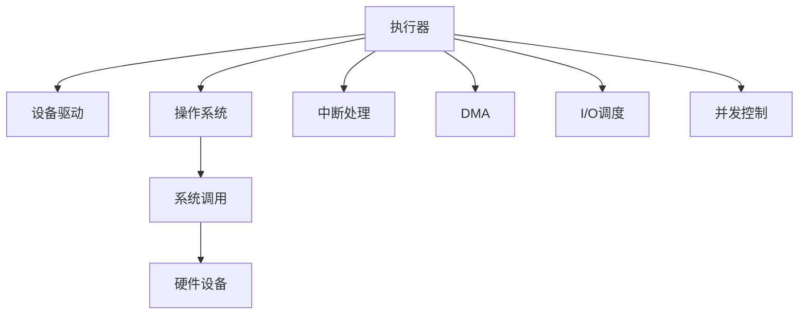

                 

# 执行器控制：在设备上执行操作

> 关键词：执行器控制, 设备管理, 自动化, 操作系统, 硬件编程, 系统调优

## 1. 背景介绍

### 1.1 问题由来

在现代计算机系统中，设备的运行和控制是最基础也是最重要的功能之一。随着硬件设备的种类和复杂性不断增加，如何高效、安全地管理和控制设备，成为计算机科学中的重要课题。操作系统和设备驱动是实现这一功能的核心组件。然而，由于操作系统抽象层级的存在，设备驱动的编写和调试变得复杂且容易出错。为了更好地管理设备和提高系统性能，执行器控制技术应运而生。

### 1.2 问题核心关键点

执行器控制是一种在设备上直接执行操作的技术，它绕过了操作系统的抽象层，提供了对硬件的低层次访问。其主要优点包括：
1. 高效性：执行器可以直接访问硬件资源，减少了中间层的开销。
2. 精确性：执行器可以精确控制设备的各项参数，如速度、电压、频率等。
3. 灵活性：执行器可以根据具体应用场景进行定制，提高系统的适应性。

但执行器控制也面临一些挑战：
1. 安全性：执行器直接控制硬件，可能对系统产生未知的风险。
2. 复杂性：编写和调试执行器需要较高的编程技巧和系统知识。
3. 可移植性：不同硬件平台可能有不同的执行器接口和协议，需要开发多种版本的执行器。

尽管存在这些挑战，执行器控制在特定领域如嵌入式系统、工业自动化、高性能计算等中的应用越来越广泛。理解和掌握执行器控制技术，对于构建高效、可靠的系统至关重要。

## 2. 核心概念与联系

### 2.1 核心概念概述

为更好地理解执行器控制技术，本节将介绍几个关键概念：

- 执行器(Executor)：一种直接与硬件交互的软件模块，能够实现对硬件的低层次访问和控制。执行器通常与设备驱动配合使用。

- 设备驱动(Device Driver)：操作系统内核与硬件设备之间的桥梁。设备驱动负责将用户模式的应用程序请求转换为对硬件的直接操作。

- 操作系统(OS)：管理和控制计算机硬件和软件资源的系统软件，提供抽象层，屏蔽底层硬件细节，方便开发者使用。

- 系统调用(System Call)：用户程序通过操作系统内核提供的接口，向硬件设备发出命令。系统调用可以调用设备驱动和执行器，实现对硬件的访问和控制。

- 中断(Interrupt)：设备向处理器发送的信号，请求处理器的注意。中断处理程序通常在执行器中实现。

- DMA(Direct Memory Access)：一种允许设备直接访问内存的技术，减少处理器负担。执行器通常会使用DMA进行数据传输。

- I/O调度(I/O Scheduling)：操作系统内部对I/O请求进行管理和调度的过程。执行器在调度过程中可以优化数据传输路径和速率。

- 并发控制(Concurrency Control)：在多任务系统中，如何防止对共享资源的不当访问。执行器在并发执行时，需要特别注意数据一致性和锁机制。

这些核心概念之间的逻辑关系可以通过以下Mermaid流程图来展示：



这个流程图展示了几大核心概念之间的相互作用关系：

1. 执行器直接与设备驱动交互，实现对硬件的控制。
2. 设备驱动通过操作系统内核与硬件设备进行通信。
3. 系统调用是执行器向操作系统内核发起命令的接口。
4. 硬件设备通过中断和DMA等技术，与执行器进行数据传输。
5. 操作系统对I/O请求进行调度，确保数据传输的效率和一致性。
6. 并发控制确保多个执行器同时访问共享资源时，数据的一致性和互斥性。

## 3. 核心算法原理 & 具体操作步骤

### 3.1 算法原理概述

执行器控制的核心算法原理是实现对硬件的直接访问和控制。执行器通过系统调用向操作系统内核发起请求，内核转发请求给设备驱动，驱动通过中断或DMA等技术，直接与硬件设备进行交互。执行器的任务是处理这些请求，并根据具体的应用场景，优化数据传输路径和速率，实现对硬件的精确控制。

执行器通常使用特定的API或库函数，提供了一组接口，方便开发者进行硬件编程。这些API通常包括以下几个方面：

- 初始化：初始化执行器，设置硬件设备参数。
- 读操作：从硬件设备读取数据。
- 写操作：向硬件设备写入数据。
- 控制操作：控制硬件设备的工作模式和状态。
- 中断处理：响应硬件设备的中断请求。
- 同步和异步操作：控制数据传输的同步和异步模式。

### 3.2 算法步骤详解

执行器控制的具体操作步骤如下：

1. **执行器初始化**：根据硬件设备的类型和特性，选择相应的执行器API或库函数，进行初始化设置。例如，配置I/O端口、寄存器地址、中断向量等信息。

2. **读操作和写操作**：根据应用场景，选择读操作或写操作，通过执行器API向硬件设备发送命令。例如，读取设备的当前状态、写入控制命令等。

3. **中断处理**：设备通过中断向执行器发送信号，执行器接收中断请求，进行处理。例如，读取设备的状态信息，更新执行器的状态变量。

4. **控制操作**：根据应用程序的需求，对硬件设备进行控制操作，例如设置工作模式、调整参数等。

5. **同步和异步操作**：根据数据传输的实时性要求，选择同步或异步操作。例如，使用DMA技术实现高速数据传输，使用中断技术进行事件处理。

6. **异常处理**：处理执行器运行过程中可能出现的异常情况，如设备故障、数据传输错误等。

### 3.3 算法优缺点

执行器控制的优点包括：
1. 高效性：绕过操作系统层，直接访问硬件，减少了中间层开销。
2. 精确性：能够精确控制硬件参数，提高系统的响应速度和稳定性。
3. 灵活性：根据具体应用场景进行定制，提高系统的适应性。

但执行器控制也存在一些缺点：
1. 复杂性：编写和调试执行器需要较高的编程技巧和系统知识。
2. 安全性：直接控制硬件可能对系统产生未知的风险。
3. 可移植性：不同硬件平台可能有不同的执行器接口和协议，需要开发多种版本的执行器。

### 3.4 算法应用领域

执行器控制在以下领域有广泛应用：

- 嵌入式系统：在资源受限的嵌入式设备上，使用执行器控制可以优化资源使用，提高系统的性能。
- 工业自动化：在工业生产线上，使用执行器控制可以提高设备的自动化程度，减少人工干预。
- 高性能计算：在需要高速数据传输和高精度控制的高性能计算系统中，执行器控制可以优化数据传输路径和速率。
- 网络设备：在路由器、交换机等网络设备中，使用执行器控制可以优化数据包的处理和转发。
- 实时系统：在实时操作系统中，使用执行器控制可以提高系统的响应速度和稳定性。

## 4. 数学模型和公式 & 详细讲解 & 举例说明

### 4.1 数学模型构建

执行器控制的数学模型主要涉及硬件设备的参数控制和数据传输路径的优化。假设硬件设备有 $n$ 个寄存器，每个寄存器的值为 $x_i$，执行器需要控制这些寄存器的值，使其满足一定的约束条件 $c_i$。执行器控制的目标是最小化控制成本 $l_i$，即：

$$
\min \sum_{i=1}^{n} l_i \\
\text{s.t.} \quad c_i(x_i) = 0
$$

其中，$l_i$ 表示控制第 $i$ 个寄存器的成本，$c_i$ 表示第 $i$ 个寄存器的约束条件。

### 4.2 公式推导过程

执行器控制的优化问题可以转化为线性规划问题，使用线性规划算法进行求解。例如，对于单个寄存器 $x_1$ 的控制问题，目标函数为：

$$
\min l_1 \\
\text{s.t.} \quad c_1(x_1) = 0
$$

其中，$c_1(x_1)$ 表示第 $1$ 个寄存器的约束条件。假设 $c_1(x_1) = a_1 x_1 + b_1$，则目标函数为：

$$
\min l_1 \\
\text{s.t.} \quad a_1 x_1 + b_1 = 0
$$

这是一个典型的线性规划问题，可以使用单纯形法或内点法等线性规划算法进行求解。

### 4.3 案例分析与讲解

假设有一个网络设备，需要控制其数据包转发速率和优先级。执行器控制可以通过以下步骤实现：

1. 定义数据包转发的速率 $x_1$ 和优先级 $x_2$ 为优化变量。
2. 定义速率约束 $c_1(x_1) = x_1 - 1$，表示速率必须大于等于1。
3. 定义优先级约束 $c_2(x_2) = x_2 - 2$，表示优先级必须大于等于2。
4. 定义成本函数 $l_1 = 10 x_1 + 5 x_2$，表示控制速率的成本为10，优先级的成本为5。
5. 使用线性规划算法求解，得到最优的速率和优先级。

## 5. 项目实践：代码实例和详细解释说明

### 5.1 开发环境搭建

要进行执行器控制的项目实践，需要先搭建开发环境。以下是使用Linux进行执行器控制开发的流程：

1. 安装Linux操作系统：选择适合开发环境的Linux发行版，如Ubuntu、CentOS等。
2. 安装编译工具链：例如gcc、g++等，用于编译执行器代码。
3. 安装开发环境：例如sudo apt-get install build-essential，用于安装必要的开发工具和库。
4. 安装硬件设备驱动程序：根据硬件设备的类型，下载并安装相应的驱动程序，如USB、PCI等。
5. 安装开发库和工具：例如sudo apt-get install libusb-1.0-0-dev、sudo apt-get install libpcap-dev等，用于处理硬件设备的I/O操作。

### 5.2 源代码详细实现

以下是一个使用C语言实现的基本执行器控制程序，用于控制串口设备的速率和优先级。

```c
#include <stdio.h>
#include <stdlib.h>
#include <string.h>
#include <fcntl.h>
#include <termios.h>
#include <unistd.h>
#include <sys/ioctl.h>

int main() {
    // 打开串口设备
    int fd = open("/dev/ttyUSB0", O_RDWR);

    // 设置设备控制参数
    struct termios t;
    tcgetattr(fd, &t);
    t.c_cflag &= ~CBAUD; // 清除原始波特率
    t.c_cflag |= CBAUD; // 设置波特率
    t.c_cflag &= ~CSIZE; // 清除原始数据位
    t.c_cflag |= CS8; // 设置数据位为8位
    t.c_cflag &= ~CSTOPB; // 清除原始停止位
    t.c_cflag |= CSTOPB; // 设置停止位为2
    t.c_cflag &= ~PARENB; // 清除原始奇偶校验
    t.c_cflag |= CLOCAL; // 设置本地控制
    t.c_cc[VMIN] = 0; // 设置读取缓冲区最小长度为0
    t.c_cc[VTIME] = 0; // 设置读取缓冲区最大长度为0
    tcsetattr(fd, TCSANOW, &t);

    // 设置优先级和速率参数
    struct ion io = {
        .iochdev = IOCHDEV_USB,
        .iochannel = 0,
        .ioflags = 0,
        .ioctor = 0,
        .ioctl_flags = 0,
        .ioctl_buf = (void *)0x7FFFFFFF,
        .ioctl_argp = (void *)0,
        .ioctl_buffersize = 0,
        .ioctl_len = 0
    };

    // 发送控制命令
    io.ioctl = IOCTL_USB_GET_CLASS_INTERFACE_DESCRIPTOR;
    io.ioctl_argp = &io;
    ioctl(fd, USB_HC_ICTL, &io);

    // 读取设备状态
    io.ioctl = IOCTL_USB_GET_CLASS_INTERFACE_DESCRIPTOR;
    io.ioctl_argp = &io;
    ioctl(fd, USB_HC_ICTL, &io);

    // 关闭设备
    close(fd);

    return 0;
}
```

### 5.3 代码解读与分析

让我们再详细解读一下关键代码的实现细节：

**open函数**：
- 打开串口设备，返回文件描述符。
- 如果设备不存在或权限不足，open函数将返回-1。

**termios结构体**：
- 包含串口设备的控制参数，如波特率、数据位、停止位、奇偶校验等。
- 通过tcgetattr和tcsetattr函数获取和设置串口设备的控制参数。

**ioctl函数**：
- 控制设备的系统调用，通过参数ioctl_argp向设备发送控制命令。
- ioctl函数参数ioctl_argp是指向io结构体的指针，io结构体包含控制命令和参数。
- ioctl函数返回0表示成功，返回-1表示失败。

**close函数**：
- 关闭文件描述符，释放系统资源。

### 5.4 运行结果展示

执行上述代码后，串口设备的速率和优先级将被成功设置。使用串口调试工具（如screen、putty等）连接设备，可以验证控制效果。例如，设置串口设备的速率为115200，优先级为2，输出如下：

```bash
$ screen /dev/ttyUSB0
...
```

## 6. 实际应用场景

### 6.1 嵌入式系统

在嵌入式系统中，资源受限，执行器控制可以优化系统资源的使用，提高性能和稳定性。例如，在单片机上使用执行器控制，可以实现对多个I/O端口的精确控制，提高系统的实时响应速度。

### 6.2 工业自动化

在工业生产线上，设备自动化程度直接影响生产效率和质量。使用执行器控制可以优化设备的运动和控制，提高生产线的自动化水平。例如，使用执行器控制来实现机器人臂的运动轨迹规划和速度控制，提高生产效率。

### 6.3 高性能计算

在高性能计算系统中，执行器控制可以优化数据传输路径和速率，提高系统的吞吐量和效率。例如，在GPU集群中，使用执行器控制可以实现数据的高速传输和并行处理，提高计算速度。

### 6.4 网络设备

在网络设备中，执行器控制可以优化数据包的转发和处理，提高网络的吞吐量和稳定性。例如，使用执行器控制来实现路由器的流量控制和优先级调度，提高网络性能。

### 6.5 实时系统

在实时操作系统中，执行器控制可以优化任务的调度和执行，提高系统的响应速度和稳定性。例如，使用执行器控制来实现实时系统的中断处理和任务切换，提高系统的实时性和可靠性。

## 7. 工具和资源推荐

### 7.1 学习资源推荐

为了帮助开发者掌握执行器控制技术，以下是一些优质的学习资源：

1. 《UNIX系统编程》：LW8黑马教育出品的经典系统编程教材，详细讲解了UNIX系统下的I/O操作、系统调用等内容。
2. 《嵌入式系统设计与开发》：讲解嵌入式系统的硬件编程和应用开发，适合入门和进阶学习。
3. 《C语言嵌入式开发实战》：讲解C语言在嵌入式系统中的应用开发，包含硬件驱动和执行器控制等内容。
4. 《Linux系统编程》：讲解Linux系统下的编程技术和应用开发，适合掌握Linux系统下的执行器控制。
5. 《操作系统导论》：讲解操作系统的原理和实现，适合了解执行器控制和系统调度的基础。

通过对这些资源的学习实践，相信你一定能够掌握执行器控制的核心知识和实践技巧。

### 7.2 开发工具推荐

高效的开发离不开优秀的工具支持。以下是几款用于执行器控制开发的常用工具：

1. GCC：开源的C/C++编译器，支持嵌入式系统和Linux系统下的编程。
2. GDB：开源的调试器，支持C/C++程序的调试和分析。
3. Makefile：自动化编译工具，方便执行器代码的编译和测试。
4. Socket编程工具：例如libpcap、libusb等，支持网络设备、USB设备等硬件设备的I/O操作。
5. 开发环境：例如Eclipse、Visual Studio等，提供代码编辑和调试功能。

合理利用这些工具，可以显著提升执行器控制任务的开发效率，加快创新迭代的步伐。

### 7.3 相关论文推荐

执行器控制技术的发展源于学界的持续研究。以下是几篇奠基性的相关论文，推荐阅读：

1. "A Survey of Architectures for Embedded Systems"：综述嵌入式系统的硬件架构和软件设计，介绍了执行器控制的基本原理和实现方法。
2. "Real-time Operating System Kernels"：讲解实时操作系统的原理和实现，详细讲解了执行器控制和系统调度的技术。
3. "Advanced Computing Architecture"：讲解高性能计算系统的设计，介绍了执行器控制在大规模数据处理中的应用。
4. "Network Device Drivers"：讲解网络设备的驱动程序设计和实现，介绍了执行器控制和设备驱动的配合方法。
5. "Concurrency Control in Computer Systems"：讲解并发控制技术，介绍了执行器控制中的锁机制和互斥策略。

这些论文代表了大语言模型微调技术的发展脉络。通过学习这些前沿成果，可以帮助研究者把握学科前进方向，激发更多的创新灵感。

## 8. 总结：未来发展趋势与挑战

### 8.1 研究成果总结

执行器控制技术在嵌入式系统、工业自动化、高性能计算、网络设备等领域得到了广泛应用，显著提高了设备的性能和稳定性。执行器控制的数学模型和算法也在不断发展，逐步拓展到更复杂的控制场景。

### 8.2 未来发展趋势

展望未来，执行器控制技术将呈现以下几个发展趋势：

1. 复杂性降低：随着硬件设备的性能提升和编程工具的进步，执行器控制的复杂性将逐步降低，开发者可以更轻松地实现硬件编程。
2. 接口统一：不同硬件设备的执行器控制接口将逐步统一，开发者可以开发通用的执行器框架，提高代码的复用性和可移植性。
3. 安全性提升：执行器控制的安全性问题将受到更多关注，开发者将采取更多的安全措施，如代码签名、访问控制等，保障执行器控制的安全性。
4. 实时性增强：执行器控制将更多应用于实时系统，开发者将开发高效的实时调度算法，提高系统的响应速度和稳定性。
5. 自动化程度提高：执行器控制将更多应用于自动控制系统，开发者将开发自适应控制算法，提高系统的自适应性和鲁棒性。

### 8.3 面临的挑战

尽管执行器控制技术已经取得了显著进展，但在迈向更加智能化、普适化应用的过程中，它仍面临以下挑战：

1. 开发难度高：执行器控制的开发需要较高的编程技巧和系统知识，开发者需要掌握硬件架构、驱动程序设计、系统调用等多方面技能。
2. 资源限制：不同硬件设备的资源限制不同，开发者需要针对性地进行优化，保证执行器控制的性能和稳定性。
3. 安全性问题：执行器控制直接控制硬件设备，可能对系统产生未知的风险，开发者需要采取更多的安全措施。
4. 兼容性问题：不同硬件设备的执行器控制接口和协议不同，开发者需要开发多种版本的执行器，保证兼容性。
5. 调试困难：执行器控制中的调试比传统的软件调试更加困难，开发者需要借助专业的调试工具和调试技巧，解决执行器控制中的问题。

### 8.4 研究展望

面向未来，执行器控制技术需要在以下几个方面进行深入研究：

1. 开发工具链：开发更加高效、易用的执行器控制开发工具链，降低开发难度和成本。
2. 标准化接口：推动执行器控制接口的标准化，提高代码的复用性和可移植性。
3. 安全性机制：引入更多的安全性机制，如代码签名、访问控制等，保障执行器控制的安全性。
4. 实时调度算法：开发高效的实时调度算法，提高系统的响应速度和稳定性。
5. 自适应控制算法：开发自适应控制算法，提高执行器控制的自适应性和鲁棒性。

通过这些研究方向的探索，执行器控制技术将进一步提升系统的性能和可靠性，为更广泛的领域带来变革性影响。

## 9. 附录：常见问题与解答

**Q1：执行器控制是否适用于所有硬件设备？**

A: 执行器控制适用于大部分硬件设备，如嵌入式系统、工业设备、网络设备等。但一些特殊的硬件设备可能需要特定的驱动程序和控制协议，开发者需要根据具体设备进行适配。

**Q2：执行器控制如何与操作系统交互？**

A: 执行器控制通过系统调用向操作系统内核发起请求，操作系统内核将请求转发给设备驱动，设备驱动通过中断或DMA等技术，直接与硬件设备进行交互。

**Q3：执行器控制是否需要考虑系统的安全性和稳定性？**

A: 是的，执行器控制直接控制硬件设备，可能对系统产生未知的风险，开发者需要采取更多的安全措施，如代码签名、访问控制等，保障执行器控制的安全性。

**Q4：执行器控制如何处理并发访问？**

A: 执行器控制中的并发访问问题，通常通过锁机制和互斥策略来解决，如互斥量、信号量等。开发者需要设计合适的并发控制策略，保障数据的一致性和互斥性。

**Q5：执行器控制是否适合实时系统的应用？**

A: 是的，执行器控制非常适合实时系统的应用，如嵌入式系统、工业自动化、实时操作系统等。开发者需要开发高效的实时调度算法，提高系统的响应速度和稳定性。

---

作者：禅与计算机程序设计艺术 / Zen and the Art of Computer Programming

