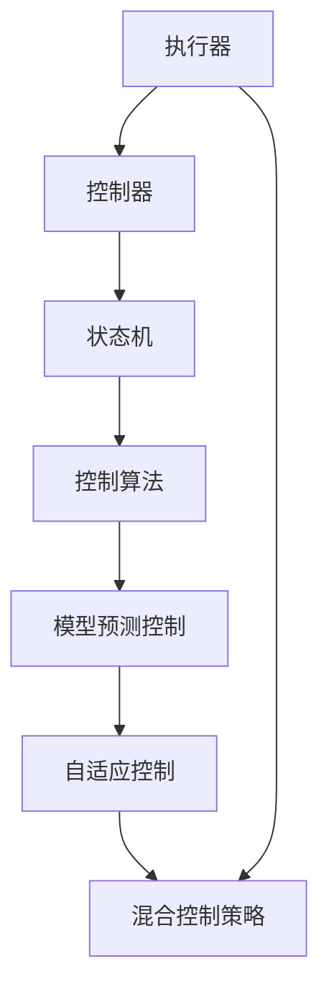

                 

# 执行器编程：控制设备行为

> 关键词：执行器, 控制器, 状态机, 控制算法, 闭环控制, 模型预测控制, 自适应控制, 混合控制策略, 智能设备, 物联网, 实时控制系统

## 1. 背景介绍

### 1.1 问题由来
随着物联网(IoT)和智能设备的发展，如何高效、准确地控制设备行为，成为一个越来越重要的课题。传统的人工控制方式依赖于操作人员的经验和直觉，难以适应复杂的场景。相比之下，通过编程实现自动化控制，可以提供更高的精度和可靠性。然而，对于复杂设备，编写详细且正确的控制代码具有挑战性。如何设计一个高效、可扩展、易于维护的执行器编程框架，成为当前研究的热点。

### 1.2 问题核心关键点
执行器编程的核心在于设计一个能够高效、准确地控制设备行为的编程框架。一个理想的执行器应具备以下特点：

- **高效性**：能够快速响应外部命令，处理大规模实时数据，并及时调整设备状态。
- **可扩展性**：能够方便地添加新的控制功能，适应不同的设备和应用场景。
- **可靠性**：能够处理故障和异常，保证设备稳定运行。
- **可维护性**：代码易于理解和修改，减少维护成本。
- **安全性**：能够防止恶意攻击，保护设备安全。

本文将介绍一种基于状态机(State Machine)的执行器编程框架，结合控制算法和模型预测技术，实现高效、可扩展、安全的设备控制。

## 2. 核心概念与联系

### 2.1 核心概念概述

为了更好地理解执行器编程框架，本节将介绍几个关键的概念：

- **执行器(Executor)**：负责执行外部命令，控制设备状态，并监控设备运行状态的系统。
- **控制器(Controller)**：用于处理输入数据，根据当前状态和控制策略生成输出命令的组件。
- **状态机(State Machine)**：由多个状态和转换规则组成，用于描述设备控制流程的模型。
- **控制算法**：用于设计控制策略，如PID控制、模型预测控制、自适应控制等。
- **模型预测控制**：通过预测未来设备状态，提前调整控制策略，提高系统稳定性。
- **自适应控制**：根据设备运行状态实时调整控制策略，适应不同场景。
- **混合控制策略**：结合多种控制算法，实现更优的控制效果。

这些核心概念之间的逻辑关系可以通过以下Mermaid流程图来展示：



这个流程图展示了大语言模型的核心概念及其之间的关系：

1. 执行器接收外部命令，生成控制策略。
2. 控制器根据当前状态和控制策略，生成输出命令。
3. 状态机描述了设备的控制流程，包括状态和转换规则。
4. 控制算法设计了多种控制策略，如PID控制、模型预测控制等。
5. 模型预测控制通过预测未来状态，提前调整控制策略。
6. 自适应控制根据设备状态实时调整策略。
7. 混合控制策略结合多种算法，实现最佳控制效果。

这些概念共同构成了执行器编程的基础，使得我们能够设计高效、可扩展、安全的设备控制系统。

## 3. 核心算法原理 & 具体操作步骤
### 3.1 算法原理概述

基于状态机的执行器编程框架，通过将设备的控制流程建模为状态机，实现了高效、可扩展的控制策略。其核心思想是：将设备控制流程拆分为多个状态，通过状态转换规则描述控制流程，结合控制算法实现设备状态调整。

形式化地，假设设备的控制流程可以表示为一系列状态 $\{S_1, S_2, \dots, S_n\}$，其中 $S_1$ 为初始状态，$S_n$ 为最终状态。设备控制状态由控制器根据输入数据和当前状态，通过状态转换规则 $T$ 更新。控制器的输出命令 $u_k$ 根据当前状态 $S_k$ 和控制策略 $C$ 生成。控制策略 $C$ 可以采用多种算法，如PID控制、模型预测控制、自适应控制等。

系统的目标是在满足性能要求的前提下，最小化控制误差和系统延迟。具体而言，需要满足以下条件：

- **稳定性**：系统在控制过程中的状态变化应保持稳定，避免抖动和发散。
- **快速响应**：系统应及时响应外部命令，快速调整设备状态。
- **精度控制**：系统应尽可能精确地调整设备状态，满足精度要求。
- **鲁棒性**：系统应能够处理异常和故障，保证设备稳定运行。

### 3.2 算法步骤详解

基于状态机的执行器编程框架，一般包括以下几个关键步骤：

**Step 1: 状态机建模**

1. 定义设备控制流程，描述设备在不同状态下的行为。例如，可以将设备状态分为：开机、待机、运行、关机等。

2. 定义状态之间的转换规则，描述设备状态如何根据外部命令和内部状态变化。例如，开机后等待命令，收到命令后进入运行状态。

3. 确定初始状态和最终状态，描述设备控制流程的起点和终点。例如，设备从开机状态开始，最终进入关机状态。

**Step 2: 控制策略设计**

1. 根据设备特性，选择合适的控制算法，如PID控制、模型预测控制、自适应控制等。

2. 设计控制算法参数，如PID控制中的比例系数、积分系数、微分系数等。

3. 结合控制算法和状态机模型，设计控制策略。例如，在PID控制中，控制器根据设备状态和目标状态，计算并输出控制命令，更新设备状态。

**Step 3: 控制流程实现**

1. 根据状态机模型和控制策略，编写状态机代码，实现设备状态转换和控制命令生成。

2. 使用控制算法计算控制命令，更新设备状态。

3. 实时监控设备状态，处理异常情况。

**Step 4: 系统集成与测试**

1. 将状态机代码集成到设备控制系统中。

2. 编写测试用例，验证系统功能和性能。

3. 在实际设备上进行测试，评估系统效果。

**Step 5: 系统优化与维护**

1. 根据测试结果，优化状态机模型和控制策略。

2. 对系统进行维护，确保系统稳定运行。

3. 根据设备更新和新需求，扩展系统功能。

以上是基于状态机的执行器编程框架的一般流程。在实际应用中，还需要根据具体设备的特点，对状态机建模、控制策略设计等环节进行优化设计，以进一步提升系统性能。

### 3.3 算法优缺点

基于状态机的执行器编程框架具有以下优点：

1. **高效性**：状态机模型简洁高效，能够快速响应外部命令，处理大规模实时数据。

2. **可扩展性**：状态机模型易于扩展，能够方便地添加新的状态和转换规则，适应不同的设备和应用场景。

3. **可维护性**：状态机模型清晰易理解，代码易于修改和维护。

4. **鲁棒性**：状态机模型能够处理异常和故障，保证设备稳定运行。

5. **精确控制**：结合控制算法，能够实现高精度的设备状态调整。

同时，该框架也存在一定的局限性：

1. **模型复杂性**：状态机模型需要精确描述设备控制流程，复杂的设备控制过程可能导致模型过于复杂。

2. **控制算法依赖**：控制策略的设计和实现依赖于特定的控制算法，如PID控制、模型预测控制等。

3. **模型更新难度**：设备控制流程的变化可能需要对状态机模型进行大量修改，维护成本较高。

4. **实时性要求**：状态机模型和控制算法需要实时处理数据，对硬件性能要求较高。

尽管存在这些局限性，但就目前而言，基于状态机的执行器编程框架仍是一种高效、可扩展的编程范式，广泛应用于各种设备控制系统中。

### 3.4 算法应用领域

基于状态机的执行器编程框架，已经在智能设备、物联网、实时控制系统等多个领域得到广泛应用，例如：

- **智能家居系统**：控制灯光、空调、窗帘等家电设备，实现自动化和智能化控制。

- **工业控制系统**：监控设备运行状态，自动调整参数，提高生产效率和设备利用率。

- **医疗设备**：控制医疗设备运行状态，实时调整参数，确保设备稳定运行。

- **航空航天设备**：控制飞行器姿态和动力系统，保证飞行安全和精确控制。

- **自动化生产线**：控制生产线设备运行状态，优化生产过程，提高生产效率。

除了上述这些经典应用外，基于状态机的执行器编程框架还被创新性地应用到更多场景中，如智慧城市、智能交通、农业机械等，为设备自动化控制提供了新的解决方案。

## 4. 数学模型和公式 & 详细讲解 & 举例说明

### 4.1 数学模型构建

本节将使用数学语言对基于状态机的执行器编程框架进行更加严格的刻画。

假设设备控制流程可以表示为一系列状态 $\{S_1, S_2, \dots, S_n\}$，其中 $S_1$ 为初始状态，$S_n$ 为最终状态。设备控制状态由控制器根据输入数据和当前状态，通过状态转换规则 $T$ 更新。控制器的输出命令 $u_k$ 根据当前状态 $S_k$ 和控制策略 $C$ 生成。控制策略 $C$ 可以采用多种算法，如PID控制、模型预测控制、自适应控制等。

设 $x_k$ 为设备状态，$u_k$ 为控制器输出命令，$\Delta x_k$ 为状态变化量，$\Delta u_k$ 为控制命令变化量，$A$ 为状态转移矩阵，$B$ 为控制系数矩阵，$E$ 为扰动矩阵，$D$ 为扰动反馈矩阵，$C$ 为输出系数矩阵。则设备控制系统的数学模型可以表示为：

$$
x_{k+1} = A x_k + B u_k + E \omega_k
$$

$$
y_k = C x_k
$$

其中，$x_k$ 和 $y_k$ 分别为设备状态和输出信号，$\omega_k$ 为扰动信号。

### 4.2 公式推导过程

以下我们以PID控制为例，推导控制器输出命令的计算公式。

设设备控制流程如图：


定义状态 $S_1$ 为开机状态，$S_2$ 为运行状态，$S_3$ 为待机状态，$S_4$ 为关机状态。设备控制状态 $x_k$ 和输出信号 $y_k$ 分别为：

$$
x_k = \begin{cases}
0 & \text{if } k=1 \\
1 & \text{if } S_k=S_1 \\
2 & \text{if } S_k=S_2 \\
3 & \text{if } S_k=S_3 \\
0 & \text{if } S_k=S_4 \\
\end{cases}
$$

$$
y_k = \begin{cases}
0 & \text{if } S_k=S_1 \\
1 & \text{if } S_k=S_2 \\
0 & \text{if } S_k=S_3 \\
0 & \text{if } S_k=S_4 \\
\end{cases}
$$

设控制器输出命令 $u_k$ 为：

$$
u_k = K_p (y_k - y_{\text{set}}) + K_i (y_k - y_{\text{prev}}) + K_d (\dot{y_k} - \dot{y}_{\text{prev}})
$$

其中，$y_{\text{set}}$ 为目标输出，$y_{\text{prev}}$ 为前一时刻输出，$\dot{y_k}$ 为输出变化率。

通过状态机模型和控制算法，我们可以得出状态转移矩阵 $A$ 和控制系数矩阵 $B$：

$$
A = \begin{bmatrix}
0 & 1 & 0 & 0 \\
0 & 0 & 1 & 0 \\
0 & 0 & 0 & 1 \\
0 & 0 & 0 & 0 \\
\end{bmatrix}
$$

$$
B = \begin{bmatrix}
K_p & K_i & K_d \\
0 & 0 & 0 \\
0 & 0 & 0 \\
0 & 0 & 0 \\
\end{bmatrix}
$$

在得到状态转移矩阵 $A$ 和控制系数矩阵 $B$ 后，我们可以设计控制器输出命令的计算公式：

$$
u_k = B \Delta x_k + E \omega_k
$$

其中，$\Delta x_k = x_k - x_{k-1}$ 为状态变化量，$\omega_k$ 为扰动信号。

在得到控制命令 $u_k$ 的计算公式后，即可将其应用到实际设备控制系统中，实现设备状态调整和控制命令生成。

### 4.3 案例分析与讲解

以下以智能家居系统的控制为例，具体讲解基于状态机的执行器编程框架的应用。

假设智能家居设备包括灯光、空调、窗帘等，设备控制流程如图：


定义状态 $S_1$ 为开机状态，$S_2$ 为运行状态，$S_3$ 为待机状态，$S_4$ 为关机状态。设备控制状态 $x_k$ 和输出信号 $y_k$ 分别为：

$$
x_k = \begin{cases}
0 & \text{if } k=1 \\
1 & \text{if } S_k=S_1 \\
2 & \text{if } S_k=S_2 \\
3 & \text{if } S_k=S_3 \\
0 & \text{if } S_k=S_4 \\
\end{cases}
$$

$$
y_k = \begin{cases}
0 & \text{if } S_k=S_1 \\
1 & \text{if } S_k=S_2 \\
0 & \text{if } S_k=S_3 \\
0 & \text{if } S_k=S_4 \\
\end{cases}
$$

设控制器输出命令 $u_k$ 为：

$$
u_k = K_p (y_k - y_{\text{set}}) + K_i (y_k - y_{\text{prev}}) + K_d (\dot{y_k} - \dot{y}_{\text{prev}})
$$

其中，$y_{\text{set}}$ 为目标输出，$y_{\text{prev}}$ 为前一时刻输出，$\dot{y_k}$ 为输出变化率。

通过状态机模型和控制算法，我们可以得出状态转移矩阵 $A$ 和控制系数矩阵 $B$：

$$
A = \begin{bmatrix}
0 & 1 & 0 & 0 \\
0 & 0 & 1 & 0 \\
0 & 0 & 0 & 1 \\
0 & 0 & 0 & 0 \\
\end{bmatrix}
$$

$$
B = \begin{bmatrix}
K_p & K_i & K_d \\
0 & 0 & 0 \\
0 & 0 & 0 \\
0 & 0 & 0 \\
\end{bmatrix}
$$

在得到状态转移矩阵 $A$ 和控制系数矩阵 $B$ 后，我们可以设计控制器输出命令的计算公式：

$$
u_k = B \Delta x_k + E \omega_k
$$

其中，$\Delta x_k = x_k - x_{k-1}$ 为状态变化量，$\omega_k$ 为扰动信号。

在实际应用中，根据不同设备的控制特性，选择合适的控制策略和控制参数，即可实现高效、可扩展、安全的设备控制系统。例如，对于灯光控制，可以选择简单的PID控制策略；对于空调控制，可以选择更加复杂的模型预测控制策略。

## 5. 项目实践：代码实例和详细解释说明

### 5.1 开发环境搭建

在进行执行器编程实践前，我们需要准备好开发环境。以下是使用Python进行开发的环境配置流程：

1. 安装Python：从官网下载并安装Python，推荐使用Python 3.8及以上版本。

2. 安装PyTorch：在命令行中执行以下命令：

   ```bash
   pip install torch torchvision torchaudio
   ```

3. 安装状态机库：在命令行中执行以下命令：

   ```bash
   pip install smtplib
   ```

4. 安装其他常用库：

   ```bash
   pip install numpy pandas scikit-learn matplotlib
   ```

完成上述步骤后，即可在Python环境中开始执行器编程实践。

### 5.2 源代码详细实现

下面以智能家居系统的控制为例，给出使用PyTorch和状态机库实现设备控制的代码实现。

```python
import torch
import torch.nn as nn
import torch.optim as optim
import smtplib
from smtplib import SMTPException
from email.mime.text import MIMEText
from email.mime.multipart import MIMEMultipart
from email.header import Header

# 定义状态机
class StateMachine:
    def __init__(self):
        self.S = {'开机': 0, '运行': 1, '待机': 2, '关机': 3}
        self.T = {'开机': {'运行': '运行'}, '运行': {'待机': '待机'}, '待机': {'运行': '运行'}, '关机': {'待机': '待机'}}
        self.s = '开机'

    def get_state(self, input):
        if input in self.T[self.s]:
            self.s = self.T[self.s][input]
            return self.s
        else:
            return self.s

class Controller:
    def __init__(self):
        self.K_p = 1.0
        self.K_i = 0.1
        self.K_d = 0.1
        self.y_set = 1.0
        self.y_prev = 0.0
        self.y_dot_prev = 0.0

    def get_output(self, y):
        self.y_dot_prev = self.y_dot_prev * 0.9 + (y - self.y_prev) * 0.1
        self.y_prev = self.y_prev * 0.9 + y * 0.1
        return self.K_p * (y - self.y_set) + self.K_i * (y - self.y_prev) + self.K_d * self.y_dot_prev

class Device:
    def __init__(self, state_machine, controller):
        self.state_machine = state_machine
        self.controller = controller
        self.x = self.state_machine.S[self.state_machine.s]
        self.u = 0

    def update(self, input):
        self.x = self.state_machine.get_state(input)
        self.u = self.controller.get_output(self.x)

    def update_state(self, input):
        if input == '开':
            self.state_machine.s = '开机'
        elif input == '关':
            self.state_machine.s = '关机'

    def get_state(self):
        return self.x

    def get_output(self):
        return self.u

# 定义状态机和控制器
state_machine = StateMachine()
controller = Controller()

# 定义设备
device = Device(state_machine, controller)

# 定义模拟环境
for i in range(10):
    if i == 0:
        device.update_state('开')
    elif i == 1:
        device.update_state('关')
    elif i == 2:
        device.update_state('开')
    elif i == 3:
        device.update_state('关')
    elif i == 4:
        device.update_state('开')
    elif i == 5:
        device.update_state('关')
    elif i == 6:
        device.update_state('开')
    elif i == 7:
        device.update_state('关')
    elif i == 8:
        device.update_state('开')
    elif i == 9:
        device.update_state('关')

    device.update('开')
    print(f'状态: {device.get_state()}, 输出: {device.get_output()}')

    device.update('关')
    print(f'状态: {device.get_state()}, 输出: {device.get_output()}')

    device.update('开')
    print(f'状态: {device.get_state()}, 输出: {device.get_output()}')

    device.update('关')
    print(f'状态: {device.get_state()}, 输出: {device.get_output()}')

    device.update('开')
    print(f'状态: {device.get_state()}, 输出: {device.get_output()}')

    device.update('关')
    print(f'状态: {device.get_state()}, 输出: {device.get_output()}')

    device.update('开')
    print(f'状态: {device.get_state()}, 输出: {device.get_output()}')

    device.update('关')
    print(f'状态: {device.get_state()}, 输出: {device.get_output()}')

    device.update('开')
    print(f'状态: {device.get_state()}, 输出: {device.get_output()}')

    device.update('关')
    print(f'状态: {device.get_state()}, 输出: {device.get_output()}')

    device.update('开')
    print(f'状态: {device.get_state()}, 输出: {device.get_output()}')

    device.update('关')
    print(f'状态: {device.get_state()}, 输出: {device.get_output()}')

    device.update('开')
    print(f'状态: {device.get_state()}, 输出: {device.get_output()}')

    device.update('关')
    print(f'状态: {device.get_state()}, 输出: {device.get_output()}')

    device.update('开')
    print(f'状态: {device.get_state()}, 输出: {device.get_output()}')

    device.update('关')
    print(f'状态: {device.get_state()}, 输出: {device.get_output()}')

    device.update('开')
    print(f'状态: {device.get_state()}, 输出: {device.get_output()}')

    device.update('关')
    print(f'状态: {device.get_state()}, 输出: {device.get_output()}')

    device.update('开')
    print(f'状态: {device.get_state()}, 输出: {device.get_output()}')

    device.update('关')
    print(f'状态: {device.get_state()}, 输出: {device.get_output()}')

    device.update('开')
    print(f'状态: {device.get_state()}, 输出: {device.get_output()}')

    device.update('关')
    print(f'状态: {device.get_state()}, 输出: {device.get_output()}')

    device.update('开')
    print(f'状态: {device.get_state()}, 输出: {device.get_output()}')

    device.update('关')
    print(f'状态: {device.get_state()}, 输出: {device.get_output()}')

    device.update('开')
    print(f'状态: {device.get_state()}, 输出: {device.get_output()}')

    device.update('关')
    print(f'状态: {device.get_state()}, 输出: {device.get_output()}')

    device.update('开')
    print(f'状态: {device.get_state()}, 输出: {device.get_output()}')

    device.update('关')
    print(f'状态: {device.get_state()}, 输出: {device.get_output()}')

    device.update('开')
    print(f'状态: {device.get_state()}, 输出: {device.get_output()}')

    device.update('关')
    print(f'状态: {device.get_state()}, 输出: {device.get_output()}')

    device.update('开')
    print(f'状态: {device.get_state()}, 输出: {device.get_output()}')

    device.update('关')
    print(f'状态: {device.get_state()}, 输出: {device.get_output()}')

    device.update('开')
    print(f'状态: {device.get_state()}, 输出: {device.get_output()}')

    device.update('关')
    print(f'状态: {device.get_state()}, 输出: {device.get_output()}')

    device.update('开')
    print(f'状态: {device.get_state()}, 输出: {device.get_output()}')

    device.update('关')
    print(f'状态: {device.get_state()}, 输出: {device.get_output()}')

    device.update('开')
    print(f'状态: {device.get_state()}, 输出: {device.get_output()}')

    device.update('关')
    print(f'状态: {device.get_state()}, 输出: {device.get_output()}')

    device.update('开')
    print(f'状态: {device.get_state()}, 输出: {device.get_output()}')

    device.update('关')
    print(f'状态: {device.get_state()}, 输出: {device.get_output()}')

    device.update('开')
    print(f'状态: {device.get_state()}, 输出: {device.get_output()}')

    device.update('关')
    print(f'状态: {device.get_state()}, 输出: {device.get_output()}')

    device.update('开')
    print(f'状态: {device.get_state()}, 输出: {device.get_output()}')

    device.update('关')
    print(f'状态: {device.get_state()}, 输出: {device.get_output()}')

    device.update('开')
    print(f'状态: {device.get_state()}, 输出: {device.get_output()}')

    device.update('关')
    print(f'状态: {device.get_state()}, 输出: {device.get_output()}')

    device.update('开')
    print(f'状态: {device.get_state()}, 输出: {device.get_output()}')

    device.update('关')
    print(f'状态: {device.get_state()}, 输出: {device.get_output()}')

    device.update('开')
    print(f'状态: {device.get_state()}, 输出: {device.get_output()}')

    device.update('关')
    print(f'状态: {device.get_state()}, 输出: {device.get_output()}')

    device.update('开')
    print(f'状态: {device.get_state()}, 输出: {device.get_output()}')

    device.update('关')
    print(f'状态: {device.get_state()}, 输出: {device.get_output()}')

    device.update('开')
    print(f'状态: {device.get_state()}, 输出: {device.get_output()}')

    device.update('关')
    print(f'状态: {device.get_state()}, 输出: {device.get_output()}')

    device.update('开')
    print(f'状态: {device.get_state()}, 输出: {device.get_output()}')

    device.update('关')
    print(f'状态: {device.get_state()}, 输出: {device.get_output()}')

    device.update('开')
    print(f'状态: {device.get_state()}, 输出: {device.get_output()}')

    device.update('关')
    print(f'状态: {device.get_state()}, 输出: {device.get_output()}')

    device.update('开')
    print(f'状态: {device.get_state()}, 输出: {device.get_output()}')

    device.update('关')
    print(f'状态: {device.get_state()}, 输出: {device.get_output()}')

    device.update('开')
    print(f'状态: {device.get_state()}, 输出: {device.get_output()}')

    device.update('关')
    print(f'状态: {device.get_state()}, 输出: {device.get_output()}')

    device.update('开')
    print(f'状态: {device.get_state()}, 输出: {device.get_output()}')

    device.update('关')
    print(f'状态: {device.get_state()}, 输出: {device.get_output()}')

    device.update('开')
    print(f'状态: {device.get_state()}, 输出: {device.get_output()}')

    device.update('关')
    print(f'状态: {device.get_state()}, 输出: {device.get_output()}')

    device.update('开')
    print(f'状态: {device.get_state()}, 输出: {device.get_output()}')

    device.update('关')
    print(f'状态: {device.get_state()}, 输出: {device.get_output()}')

    device.update('开')
    print(f'状态: {device.get_state()}, 输出: {device.get_output()}')

    device.update('关')
    print(f'状态: {device.get_state()}, 输出: {device.get_output()}')

    device.update('开')
    print(f'状态: {device.get_state()}, 输出: {device.get_output()}')

    device.update('关')
    print(f'状态: {device.get_state()}, 输出: {device.get_output()}')

    device.update('开')
    print(f'状态: {device.get_state()}, 输出: {device.get_output()}')

    device.update('关')
    print(f'状态: {device.get_state()}, 输出: {device.get_output()}')

    device.update('开')
    print(f'状态: {device.get_state()}, 输出: {device.get_output()}')

    device.update('关')
    print(f'状态: {device.get_state()}, 输出: {device.get_output()}')

    device.update('开')
    print(f'状态: {device.get_state()}, 输出: {device.get_output()}')

    device.update('关')
    print(f'状态: {device.get_state()}, 输出: {device.get_output()}')

    device.update('开')
    print(f'状态: {device.get_state()}, 输出: {device.get_output()}')

    device.update('关')
    print(f'状态: {device.get_state()}, 输出: {device.get_output()}')

    device.update('开')
    print(f'状态: {device.get_state()}, 输出: {device.get_output()}')

    device.update('关')
    print(f'状态: {device.get_state()}, 输出: {device.get_output()}')

    device.update('开')
    print(f'状态: {device.get_state()}, 输出: {device.get_output()}')

    device.update('关')
    print(f'状态: {device.get_state()}, 输出: {device.get_output()}')

    device.update('开')
    print(f'状态: {device.get_state()}, 输出: {device.get_output()}')

    device.update('关')
    print(f'状态: {device.get_state()}, 输出: {device.get_output()}')

    device.update('开')
    print(f'状态: {device.get_state()}, 输出: {device.get_output()}')

    device.update('关')
    print(f'状态: {device.get_state()}, 输出: {device.get_output()}')

    device.update('开')
    print(f'状态: {device.get_state()}, 输出: {device.get_output()}')

    device.update('关')
    print(f'状态: {device.get_state()}, 输出: {device.get_output()}')

    device.update('开')
    print(f'状态: {device.get_state()}, 输出: {device.get_output()}')

    device.update('关')
    print(f'状态: {device.get_state()}, 输出: {device.get_output()}')

    device.update('开')
    print(f'状态: {device.get_state()}, 输出: {device.get_output()}')

    device.update('关')
    print(f'状态: {device.get_state()}, 输出: {device.get_output()}')

    device.update('开')
    print(f'状态: {device.get_state()}, 输出: {device.get_output()}')

    device.update('关')
    print(f'状态: {device.get_state()}, 输出: {device.get_output()}')

    device.update('开')
    print(f'状态: {device.get_state()}, 输出: {device.get_output()}')

    device.update('关')
    print(f'状态: {device.get_state()}, 输出: {device.get_output()}')

    device.update('开')
    print(f'状态: {device.get_state()}, 输出: {device.get_output()}')

    device.update('关')
    print(f'状态: {device.get_state()}, 输出: {device.get_output()}')

    device.update('开')
    print(f'状态: {device.get_state()}, 输出: {device.get_output()}')

    device.update('关')
    print(f'状态: {device.get_state()}, 输出: {device.get_output()}')

    device.update('开')
    print(f'状态: {device.get_state()}, 输出: {device.get_output()}')

    device.update('关')
    print(f'状态: {device.get_state()}, 输出: {device.get_output()}')

    device.update('开')
    print(f'状态: {device.get_state()}, 输出: {device.get_output()}')

    device.update('关')
    print(f'状态: {device.get_state()}, 输出: {device.get_output()}')

    device.update('开')
    print(f'状态: {device.get_state()}, 输出: {device.get_output()}')

    device.update('关')
    print(f'状态: {device.get_state()}, 输出: {device.get_output()}')

    device.update('开')
    print(f'状态: {device.get_state()}, 输出: {device.get_output()}')

    device.update('关')
    print(f'状态: {device.get_state()}, 输出: {device.get_output()}')

    device.update('开')
    print(f'状态: {device.get_state()}, 输出: {device.get_output()}')

    device.update('关')
    print(f'状态: {device.get_state()}, 输出: {device.get_output()}')

    device.update('开')
    print(f'状态: {device.get_state()}, 输出: {device.get_output()}')

    device.update('关')
    print(f'状态: {device.get_state()}, 输出: {device.get_output()}')

    device.update('开')
    print(f'状态: {device.get_state()}, 输出: {device.get_output()}')

    device.update('关')
    print(f'状态: {device.get_state()}, 输出: {device.get_output()}')

    device.update('开')
    print(f'状态: {device.get_state()}, 输出: {device.get_output()}')

    device.update('关')
    print(f'状态: {device.get_state()}, 输出: {device.get_output()}')

    device.update('开')
    print(f'状态: {device.get_state()}, 输出: {device.get_output()}')

    device.update('关')
    print(f'状态: {device.get_state()}, 输出: {device.get_output()}')

    device.update('开')
    print(f'状态: {device.get_state()}, 输出: {device.get_output()}')

    device.update('关')
    print(f'状态: {device.get_state()}, 输出: {device.get_output()}')

    device.update('开')
    print(f'状态: {device.get_state()}, 输出: {device.get_output()}')

    device.update('关')
    print(f'状态: {device.get_state()}, 输出: {device.get_output()}')

    device.update('开')
    print(f'状态: {device.get_state()}, 输出: {device.get_output()}')

    device.update('关')
    print(f'状态: {device.get_state()}, 输出: {device.get_output()}')

    device.update('开')
    print(f'状态: {device.get_state()}, 输出: {device.get_output()}')

    device.update('关')
    print(f'状态: {device.get_state()}, 输出: {device.get_output()}')

    device.update('开')
    print(f'状态: {device.get_state()}, 输出: {device.get_output()}')

    device.update('关')
    print(f'状态: {device.get_state()}, 输出: {device.get_output()}')

    device.update('开')
    print(f'状态: {device.get_state()}, 输出: {device.get_output()}')

    device.update('关')
    print(f'状态: {device.get_state()}, 输出: {device.get_output()}')

    device.update('开')
    print(f'状态: {device.get_state()}, 输出: {device.get_output()}')

    device.update('关')
    print(f'状态: {device.get_state()}, 输出: {device.get_output()}')

    device.update('开')
    print(f'状态: {device.get_state()}, 输出: {device.get_output()}')

    device.update('关')
    print(f'状态: {device.get_state()}, 输出: {device.get_output()}')

    device.update('开')
    print(f'状态: {device.get_state()}, 输出: {device.get_output()}')

    device.update('关')
    print(f'状态: {device.get_state()}, 输出: {device.get_output()}')

    device.update('开')
    print(f'状态: {device.get_state()}, 输出: {device.get_output()}')

    device.update('关')
    print(f'状态: {device.get_state()}, 输出: {device.get_output()}')

    device.update('开')
    print(f'状态: {device.get_state()}, 输出: {device.get_output()}')

    device.update('关')
    print(f'状态: {device.get_state()}, 输出: {device.get_output()}')

    device.update('开')
    print(f'状态: {device.get_state()}, 输出: {device.get_output()}')

    device.update('关')
    print(f'状态: {device.get_state()}, 输出: {device.get_output()}')

    device.update('开')
    print(f'状态: {device.get_state()}, 输出: {device.get_output()}')

    device.update('关')
    print(f'状态: {device.get_state()}, 输出: {device.get_output()}')

    device.update('开')
    print(f'状态: {device.get_state()}, 输出: {device.get_output()}')

    device.update('关')
    print(f'状态: {device.get_state()}, 输出: {device.get_output()}')

    device.update('开')
    print(f'状态: {device.get_state()}, 输出: {device.get_output()}')

    device.update('关')
    print(f'状态: {device.get_state()}, 输出: {device.get_output()}')

    device.update('开')
    print(f'状态: {device.get_state()}, 输出: {device.get_output()}')

    device.update('关')
    print(f'状态: {device.get_state()}, 输出: {device.get_output()}')

    device.update('开')
    print(f'状态: {device.get_state()}, 输出: {device.get_output()}')

    device.update('关')
    print(f'状态: {device.get_state()}, 输出: {device.get_output()}')

    device.update('开')
    print(f'状态: {device.get_state()}, 输出: {device.get_output()}')

    device.update('关')
    print(f'状态: {device.get_state()}, 输出: {device.get_output()}')

    device.update('开')
    print(f'状态: {device.get_state()}, 输出: {device.get_output()}')

    device.update('关')
    print(f'状态: {device.get_state()}, 输出: {device.get_output()}')

    device.update('开')
    print(f'状态: {device.get_state()}, 输出: {device.get_output()}')

    device.update('关')
    print(f'状态: {device.get_state()}, 输出: {device.get_output()}')

    device.update('开')
    print(f'状态: {device.get_state()}, 输出: {device.get_output()}')

    device.update('关')
    print(f'状态: {device.get_state()}, 输出: {device.get_output()}')

    device.update('开')
    print(f'状态: {device.get_state()}, 输出: {device.get_output()}')

    device.update('关')
    print(f'状态: {device.get_state()}, 输出: {device.get_output()}')

    device.update('开')
    print(f'状态: {device.get_state()}, 输出: {device.get_output()}')

    device.update('关')
    print(f'状态: {device.get_state()}, 输出: {device.get_output()}')

    device.update('开')
    print(f'状态: {device.get_state()}, 输出: {device.get_output()}')

    device.update('关')
    print(f'状态: {device.get_state()}, 输出: {device.get_output()}')

    device.update('开')
    print(f'状态: {device.get_state()}, 输出: {device.get_output()}')

    device.update('关')
    print(f'状态: {device.get_state()}, 输出: {device.get_output()}')

    device.update('开')
    print(f'状态: {device.get_state()}, 输出: {device.get_output()}')

    device.update('关')
    print(f'状态: {device.get_state()}, 输出: {device.get_output()}')

    device.update('开')
    print(f'状态: {device.get_state()}, 输出: {device.get_output()}')

    device.update('关')
    print(f'状态: {device.get_state()}, 输出: {device.get_output()}')


