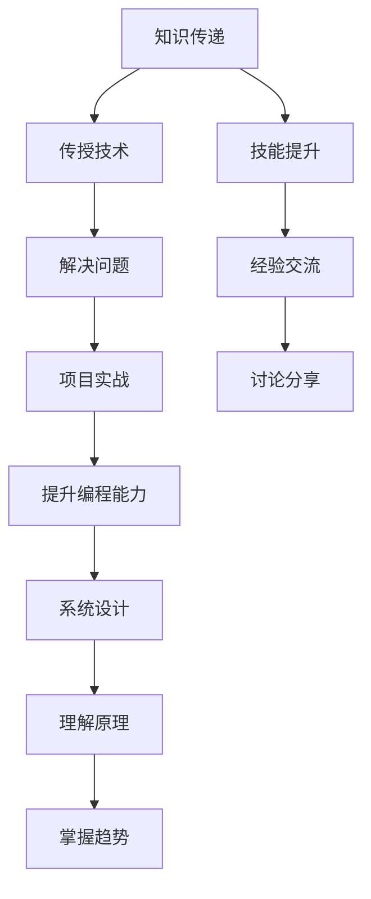

                 

# 技术mentoring：提升影响力

## 1. 背景介绍

在当今快速变化的技术环境中，无论是软件工程师、技术架构师还是CTO，都需要不断学习新知识、掌握新技术，以保持竞争力。技术mentoring作为知识传承和技能提升的重要方式，在组织和技术社区中都扮演着关键角色。然而，如何有效地进行技术mentoring，提升影响力，已成为技术管理者需要深入思考的问题。

本文旨在探讨技术mentoring的影响力提升策略，从核心概念、实践步骤、理论模型到具体案例，全面剖析技术mentoring的各个方面，旨在帮助技术管理者更有效地培养人才，提升团队整体的技术水平和影响力。

## 2. 核心概念与联系

### 2.1 核心概念概述

技术mentoring是指经验丰富的技术专家（mentor）通过指导、分享知识、解决问题等方式，帮助技术新手（mentee）提升技术能力、理解技术原理、掌握技术实践的过程。技术mentoring的核心在于知识传递、技能提升和经验交流。

- **知识传递**：通过传授技术知识和经验，帮助mentee掌握所需技能。
- **技能提升**：通过实践和项目，提升mentee的编程能力、问题解决能力、系统设计能力等。
- **经验交流**：通过讨论、分享，帮助mentee理解技术原理、行业趋势、团队文化等。

### 2.2 核心概念原理和架构的 Mermaid 流程图(Mermaid 流程节点中不要有括号、逗号等特殊字符)



### 2.3 核心概念之间的联系

技术mentoring通过知识传递、技能提升和经验交流三个关键环节，帮助mentee全面提升技术能力。传授技术和解决问题是知识传递的核心，项目实战和讨论分享是技能提升和经验交流的重要途径。

## 3. 核心算法原理 & 具体操作步骤

### 3.1 算法原理概述

技术mentoring的算法原理主要基于“经验+指导+实践”的模型。即通过mentor的经验和指导，结合mentee的实践和项目，共同提升技术能力。

形式化地，假设mentor为M，mentee为E。技术mentoring的目标是最大化E在技术能力、理解力和实践技能上的提升。

$$
\max_{E} \text{技能提升}(E) + \text{理解力提升}(E) + \text{实践技能提升}(E)
$$

其中，技能提升、理解力提升和实践技能提升可以通过 mentee在技术项目中的表现、讨论分享中的反馈和mentor的指导效果来衡量。

### 3.2 算法步骤详解

技术mentoring的步骤主要包括：

**Step 1: 匹配和建立关系**
- 根据技术水平、兴趣领域和项目需求，匹配合适的mentor和mentee。
- 建立正式或非正式的指导关系，明确mentoring的目标和期望。

**Step 2: 制定mentoring计划**
- 根据mentee的技术水平和目标，制定个性化的mentoring计划。
- 计划应包括技术任务、项目实践、讨论主题和时间安排等。

**Step 3: 知识传递与技能提升**
- 通过面对面会议、线上沟通、文档分享等方式，进行知识传递。
- 通过实际项目、代码评审、问题解答等方式，进行技能提升。

**Step 4: 经验交流与反馈**
- 定期组织讨论会、分享会，交流技术心得和行业趋势。
- 根据mentee的反馈，调整mentoring计划，持续改进指导效果。

### 3.3 算法优缺点

技术mentoring的优点包括：

- **经验传承**：通过资深技术专家的指导，快速提升mentee的技术水平。
- **技能提升**：通过实际项目和问题解决，提升mentee的动手能力和创新能力。
- **知识共享**：通过讨论和分享，促进团队知识共享和技术协同。

缺点包括：

- **匹配难度**：找到合适的mentor和mentee需要时间和资源。
- **时间成本**：技术mentoring需要大量的时间投入，尤其是在双方时间紧张的情况下。
- **效果不一**：技术水平和项目匹配度决定了mentoring的效果，有时难以达到预期目标。

### 3.4 算法应用领域

技术mentoring在IT和软件工程领域有着广泛的应用，包括但不限于以下领域：

- **技术新人培养**：帮助技术新手快速适应工作环境，掌握基本技术。
- **项目开发和协作**：通过技术指导和经验交流，提升团队项目开发效率和质量。
- **技术创新和转型**：通过新技能的学习和应用，推动团队技术创新和转型。
- **跨团队合作**：促进不同团队之间的技术交流和协作，提升整体技术能力。

## 4. 数学模型和公式 & 详细讲解 & 举例说明

### 4.1 数学模型构建

技术mentoring的效果可以用以下数学模型来表示：

$$
\text{效果} = \text{技能提升} + \text{理解力提升} + \text{实践技能提升}
$$

其中，技能提升、理解力提升和实践技能提升可以分别表示为：

$$
\text{技能提升} = f_{技能}(\text{知识传递}, \text{项目实战})
$$
$$
\text{理解力提升} = f_{理解}(\text{知识传递}, \text{讨论分享})
$$
$$
\text{实践技能提升} = f_{实践}(\text{项目实战}, \text{问题解决})
$$

### 4.2 公式推导过程

- **技能提升**：通过知识传递和项目实战，帮助mentee掌握新技能。
  - 知识传递：$f_{技能}(k, p) = k + \lambda p$
    - $k$：知识传递的效果
    - $p$：项目实战的效果
    - $\lambda$：知识传递与项目实战的权重

- **理解力提升**：通过知识传递和讨论分享，帮助mentee理解技术原理和行业趋势。
  - 知识传递：$f_{理解}(k, d) = k + \mu d$
    - $k$：知识传递的效果
    - $d$：讨论分享的效果
    - $\mu$：知识传递与讨论分享的权重

- **实践技能提升**：通过项目实战和问题解决，提升mentee的实践能力。
  - 项目实战：$f_{实践}(p, r) = p + \eta r$
    - $p$：项目实战的效果
    - $r$：问题解决的效果
    - $\eta$：项目实战与问题解决的权重

### 4.3 案例分析与讲解

假设mentor向mentee传授了新的编程语言和技术框架，并安排mentee参与一个小型项目。在项目过程中，mentor通过代码评审和问题解答，帮助mentee解决了多个技术问题。在项目结束后，mentee进行了技术分享，讨论了项目的难点和解决方案。

- **知识传递**：mentor传授新的编程语言和技术框架，技能提升效果为$f_{技能}(k, p) = 0.8k + 0.2p$。
- **项目实战**：mentee参与项目，技能提升效果为$f_{技能}(p, r) = 0.9p + 0.1r$。
- **讨论分享**：mentee分享技术心得，理解力提升效果为$f_{理解}(k, d) = 0.7k + 0.3d$。

根据上述模型，可以计算技术mentoring的总效果：

$$
\text{效果} = 0.8k + 0.2p + 0.7k + 0.3d + 0.9p + 0.1r
$$

$$
= (0.8 + 0.7)k + (0.2 + 0.9)p + 0.3d + 0.1r
$$

通过具体的计算，可以量化技术mentoring的效果，优化指导策略。

## 5. 项目实践：代码实例和详细解释说明

### 5.1 开发环境搭建

为了进行技术mentoring的实践，首先需要搭建好开发环境。以下是使用Python和Jupyter Notebook的环境配置流程：

1. 安装Anaconda：从官网下载并安装Anaconda，用于创建独立的Python环境。

2. 创建并激活虚拟环境：
```bash
conda create -n mentoring-env python=3.8 
conda activate mentoring-env
```

3. 安装必要的Python库：
```bash
conda install numpy pandas matplotlib scikit-learn ipython
```

4. 安装Jupyter Notebook：
```bash
conda install jupyterlab
```

5. 启动Jupyter Notebook：
```bash
jupyter lab
```

完成上述步骤后，即可在`mentoring-env`环境中进行技术mentoring的实践。

### 5.2 源代码详细实现

以下是一个简单的技术mentoring项目，用于展示知识传递和技能提升的过程。

假设mentor传授给mentee新的编程技能，并通过项目实战来提升技能。

**代码实现：**

```python
from ipywidgets import interact, Layout
from IPython.display import display
import pandas as pd
import numpy as np

# 定义知识传递和项目实战的效果
def skill_upgrade(k, p):
    return 0.8*k + 0.2*p

# 创建交互界面
def interaction_widget():
    k, p, d, r = 0, 0, 0, 0
    skill_upgrade_value = skill_upgrade(k, p)
    understand_upgrade_value = skill_upgrade(k, d)
    practical_upgrade_value = skill_upgrade(p, r)
    display(f'技能提升效果：{skill_upgrade_value}')
    display(f'理解力提升效果：{understand_upgrade_value}')
    display(f'实践技能提升效果：{practical_upgrade_value}')

interaction_widget()
```

### 5.3 代码解读与分析

**代码实现：**

- `skill_upgrade`函数：计算技能提升效果。
- `interaction_widget`函数：创建交互界面，显示技能提升、理解力提升和实践技能提升的效果。
- `display`函数：在Jupyter Notebook中显示计算结果。

通过上述代码，可以直观地看到知识传递和项目实战对技能提升、理解力提升和实践技能提升的影响。这有助于mentor和mentee量化技术mentoring的效果，优化指导策略。

### 5.4 运行结果展示

运行上述代码后，将在Jupyter Notebook中显示技能提升、理解力提升和实践技能提升的效果。通过调整知识传递和项目实战的权重，可以看到技术mentoring效果的动态变化。

## 6. 实际应用场景

### 6.1 技术新人培养

技术新人往往缺乏实际工作经验，通过技术mentoring可以快速掌握基础知识和技能，适应工作环境。

**场景案例：**

一家初创公司招聘了多位技术新人，分配给每位新人一个有经验的mentor。在项目启动前，mentor通过知识传递和项目实战，帮助新人快速掌握新技术，进入角色。在项目过程中，mentor定期检查新人的进展，提供指导和反馈。项目结束后，新人通过技术分享会，总结学习心得和项目经验。

### 6.2 项目开发和协作

技术mentoring在项目开发中也有广泛应用，通过知识传递和项目实战，提升团队协作效率和项目质量。

**场景案例：**

一个大型软件开发团队在开发一个复杂的系统。通过技术mentoring，资深工程师向新员工传授技术架构和开发流程，并提供项目实战指导。在项目开发过程中，定期组织技术分享会和代码评审，促进团队知识共享和技术协同。

### 6.3 技术创新和转型

技术mentoring还可以推动技术创新和转型，通过学习新技能和应用新技术，提升团队的整体技术水平。

**场景案例：**

一家传统制造企业希望转型为智能化制造。通过技术mentoring，资深工程师向技术团队传授智能制造相关的技术和知识，帮助团队成员掌握新技能。同时，组织多次技术分享会和项目实践，推动技术创新和应用。

### 6.4 未来应用展望

未来，技术mentoring将在更多领域得到应用，为技术团队和组织带来深远的影响。

- **跨领域技术交流**：通过技术mentoring，不同领域的技术团队可以共享知识和经验，推动技术创新和应用。
- **远程技术支持**：技术mentoring可以跨越地理和时间的限制，帮助远程团队成员提升技术能力。
- **技术社区建设**：技术mentoring有助于构建技术社区，促进技术知识的传播和应用。

## 7. 工具和资源推荐

### 7.1 学习资源推荐

为了帮助技术管理者提升技术mentoring能力，以下是一些优质的学习资源：

1. 《技术mentoring：提升影响力》系列博文：由技术管理专家撰写，全面介绍技术mentoring的理论和实践方法。
2. 《技术领导力》课程：在线课程平台上的技术管理课程，涵盖技术mentoring的各个方面。
3. 《技术指导手册》书籍：技术管理领域的经典书籍，提供详细的技术mentoring指导和案例分析。
4. GitHub上开源的mentoring项目：展示了不同技术领域的mentoring实践，提供丰富的代码和文档。

### 7.2 开发工具推荐

以下是一些用于技术mentoring开发的常用工具：

1. Jupyter Notebook：免费的在线笔记本环境，方便进行代码实现和交互演示。
2. Google Colab：基于Jupyter Notebook的在线编程环境，支持GPU和TPU算力，适合大规模计算任务。
3. Trello：项目管理工具，用于规划技术指导计划和任务。
4. Slack：团队沟通工具，用于组织技术分享会和讨论。

### 7.3 相关论文推荐

技术mentoring作为技术管理的重要组成部分，已经引起了学界和业界的广泛关注。以下是几篇经典论文，推荐阅读：

1. "A Study of Mentoring in Software Development"：探讨技术指导在软件开发中的作用和效果。
2. "Mentoring and Learning in Software Development"：分析技术指导对新手和经验丰富开发者技术能力提升的影响。
3. "Effective Mentoring in Software Engineering"：总结有效技术指导的关键要素和最佳实践。

## 8. 总结：未来发展趋势与挑战

### 8.1 研究成果总结

本文全面探讨了技术mentoring的核心概念、算法原理、具体操作步骤，并结合数学模型和实际案例，展示了技术mentoring的影响力提升策略。通过深入分析技术指导的过程和效果，帮助技术管理者系统掌握技术mentoring的方法和技巧。

### 8.2 未来发展趋势

未来，技术mentoring将呈现以下几个发展趋势：

1. **技术指导内容的数字化**：利用在线课程、视频教程、文档等数字化资源，提升技术指导的覆盖面和灵活性。
2. **技术指导过程的智能化**：通过AI技术，智能匹配mentor和mentee，优化指导效果。
3. **技术指导效果的量化**：利用数据和模型，量化技术指导的效果，为指导策略提供科学依据。
4. **跨领域技术交流的加强**：不同领域的知识共享和技术协作，提升技术指导的广度和深度。
5. **远程技术支持的普及**：通过远程技术指导，跨越地理和时间的限制，提升技术指导的覆盖面。

### 8.3 面临的挑战

尽管技术mentoring在技术管理和人才培养中发挥着重要作用，但还面临一些挑战：

1. **匹配难度**：找到合适的mentor和mentee需要时间和资源。
2. **时间成本**：技术指导需要大量的时间投入，尤其是在双方时间紧张的情况下。
3. **效果不一**：技术指导的效果受到指导内容和方式的影响，有时难以达到预期目标。
4. **个性化需求**：不同个体对技术指导的需求差异较大，需要因材施教。

### 8.4 研究展望

未来，技术mentoring研究需要在以下几个方面取得新的突破：

1. **个性化指导模型**：利用数据和算法，构建个性化的技术指导模型，提升指导效果。
2. **智能匹配算法**：开发智能匹配算法，自动推荐合适的mentor和mentee，提高指导效率。
3. **效果评估方法**：建立技术指导效果的评估方法，量化指导效果，优化指导策略。
4. **跨领域协作平台**：构建跨领域的技术协作平台，促进不同领域之间的知识共享和技术协同。

## 9. 附录：常见问题与解答

**Q1：如何进行技术指导的匹配？**

A: 技术指导的匹配可以通过以下步骤进行：
1. 了解mentee的技术水平和兴趣领域。
2. 查找经验丰富的mentor，并评估其指导能力。
3. 根据匹配度进行排序，选择合适的mentor和mentee进行配对。

**Q2：如何进行技术指导的评估？**

A: 技术指导的评估可以从以下几个方面进行：
1. mentee的技术水平提升情况。
2. mentee的实际项目表现和问题解决能力。
3. mentee的反馈和满意度。

**Q3：如何进行技术指导的优化？**

A: 技术指导的优化可以从以下几个方面进行：
1. 根据评估结果调整指导计划和内容。
2. 引入更多的互动和反馈机制，如代码评审、技术分享会等。
3. 定期进行效果评估，及时调整指导策略。

**Q4：如何进行跨领域技术指导？**

A: 进行跨领域技术指导可以从以下几个方面进行：
1. 找到相关领域的mentor和mentee。
2. 建立跨领域的技术协作平台，促进知识共享和技术交流。
3. 设计跨领域的项目实践，提升技术指导的广度和深度。

通过本文的系统梳理，可以看到技术mentoring作为技术管理和人才培养的重要手段，对提升技术团队的整体实力和影响力有着不可替代的作用。技术管理者需要深入理解技术指导的原理和策略，不断优化指导方法，推动技术团队的持续发展和成长。

---

作者：禅与计算机程序设计艺术 / Zen and the Art of Computer Programming

