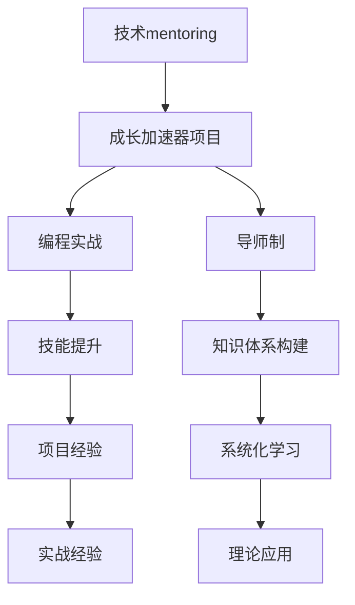

                 

# 技术mentoring：构建程序员成长加速器项目

> 关键词：技术mentoring, 程序员成长, 加速器项目, 技能提升, 导师制, 项目驱动, 编程实战

## 1. 背景介绍

### 1.1 问题由来
在当下快速发展的信息技术时代，程序员们面对的是日新月异的技术革新和复杂多变的市场需求。尽管市场对程序员的需求日益旺盛，但许多新手程序员仍然面临“成长的烦恼”：

- **学习资源匮乏**：缺乏系统化的学习资源和实践机会，难以形成完整的技术栈和项目经验。
- **自学效果不佳**：孤立无援的学习方式，往往难以坚持，容易产生倦怠感。
- **知识结构单一**：互联网零散的学习材料难以形成系统的知识体系，导致编程能力不全面。
- **真实项目经验不足**：缺乏真实的项目实践，难以将理论知识转化为实际能力。

这些问题不仅影响着个人职业发展，还制约了企业的技术人才储备和创新能力。因此，构建一个系统的程序员成长加速器项目，成为提升程序员技能、加速技术团队发展的关键。

## 2. 核心概念与联系

### 2.1 核心概念概述

为了更好地理解和构建程序员成长加速器项目，我们需要介绍几个关键概念：

- **技术mentoring**：指通过有经验的导师指导，帮助初学者掌握编程技能、解决技术难题、提升实战经验的一种培养方式。
- **成长加速器项目**：一种系统化、结构化的学习平台，通过导师制和项目驱动，快速提升程序员的编程技能和实战经验。
- **编程实战**：指通过参与真实或模拟项目，将所学知识应用于解决实际问题的过程，以提升解决实际问题的能力。
- **导师制**：即由经验丰富的导师指导学习者，通过一对一的指导、点评和反馈，帮助学习者提升技能、解决问题。
- **项目驱动**：通过设计和实现项目，帮助学习者实践所学知识，构建系统的技术栈，提升编程和协作能力。

这些概念之间的联系可以通过以下Mermaid流程图来展示：



这个流程图展示了一系列概念之间的逻辑关系：

1. 技术mentoring是成长加速器项目的核心，通过一对一的导师制帮助学习者提升技能。
2. 成长加速器项目通过编程实战和项目驱动，使学习者将知识应用于实际问题中。
3. 导师制在项目驱动中起到指导和点评作用，帮助学习者解决技术难题。
4. 编程实战和项目驱动使学习者构建系统的技术栈和实战经验。
5. 技能提升和知识体系构建，通过系统化的学习，帮助学习者构建完整的技术体系。
6. 项目经验通过实战积累，提升解决实际问题的能力。

## 3. 核心算法原理 & 具体操作步骤

### 3.1 算法原理概述

成长加速器项目是一种混合了理论学习和实战项目的培养模式，核心算法原理主要包括以下几点：

1. **知识体系构建**：通过导师制和系统化的学习资源，帮助学习者构建完整的技术体系，包括编程语言、算法数据结构、操作系统、网络协议等基础知识。
2. **项目驱动**：通过设计和实现真实或模拟项目，使学习者将所学知识应用于解决实际问题，提升编程和协作能力。
3. **技能提升**：通过导师的一对一指导和项目评审，帮助学习者提升编码技能和问题解决能力。
4. **实战经验**：通过参与项目和实时反馈，积累实战经验，提升解决实际问题的能力。

### 3.2 算法步骤详解

一个典型的成长加速器项目包括以下几个步骤：

**Step 1: 确定目标与规划**
- 定义项目目标：明确学习者的技能提升方向，如前端开发、后端开发、全栈开发等。
- 制定学习计划：根据目标设计详细的学习路径和时间安排，包括理论学习、实战项目、导师辅导等环节。

**Step 2: 资源准备**
- 收集和整理学习资源：包括技术书籍、在线课程、技术博客、开源项目等。
- 配置学习环境：搭建开发环境，安装必要的开发工具和软件包。

**Step 3: 理论学习**
- 系统学习编程基础：学习编程语言、算法数据结构、操作系统等基础知识。
- 学习实战项目：分析经典项目案例，理解项目架构和设计思路。

**Step 4: 实战项目**
- 设计与实现项目：根据学习路径，设计和实现一系列实战项目，涵盖技术栈和应用场景。
- 实时反馈与迭代：导师定期检查项目进展，提供反馈和建议，指导学习者迭代改进。

**Step 5: 技能提升**
- 一对一导师指导：根据学习者的项目进展，导师提供个性化的指导和点评。
- 代码评审与优化：导师帮助学习者优化代码，提升编码质量。

**Step 6: 项目验收**
- 项目展示与评审：学习者展示项目成果，导师和团队成员进行评审和点评。
- 知识应用与总结：学习者总结项目经验，形成系统的技术栈和知识体系。

### 3.3 算法优缺点

成长加速器项目的优点包括：

1. **系统化学习**：通过导师制的指导和系统化的学习资源，帮助学习者构建完整的技术体系。
2. **实战经验丰富**：通过设计和实现多个实战项目，积累丰富的实践经验，提升解决实际问题的能力。
3. **个性化指导**：导师的一对一指导，帮助学习者解决技术难题，提升编码技能。
4. **快速成长**：通过系统化的项目驱动，使学习者在较短时间内实现技能提升。

同时，该方法也存在一定的局限性：

1. **资源依赖度高**：需要导师制和系统化的学习资源，对资源配备要求较高。
2. **时间和精力投入大**：需要投入大量时间和精力，尤其适合有一定学习动力的初学者。
3. **师资力量要求高**：需要经验丰富的导师团队，以确保指导质量。

尽管存在这些局限性，但就目前而言，成长加速器项目仍是一种高效且有效的程序员培养方式，特别适用于初入行和技术升级的程序员。

### 3.4 算法应用领域

成长加速器项目的应用领域广泛，涵盖了技术学习、企业人才培养、职业发展等多个方面：

- **技术学习**：适用于新手程序员的系统化学习，帮助其掌握编程技能、构建技术栈。
- **企业人才培养**：帮助企业快速培养技术骨干，提升整体技术实力。
- **职业发展**：帮助在职程序员通过系统学习，提升技能，实现职业晋升。
- **个人项目**：适用于个人技术爱好者的项目驱动学习，提升实战经验和技能。

## 4. 数学模型和公式 & 详细讲解 & 举例说明

### 4.1 数学模型构建

在成长加速器项目中，数学模型的构建主要围绕以下两个方面：

1. **学习路径模型**：定义学习者的技能提升路径和时间安排，通过数学建模，规划各个阶段的学习内容和目标。
2. **项目评估模型**：设计项目评估指标，通过数学建模，评估项目的技术难度、复杂度和学习价值。

### 4.2 公式推导过程

以一个简单的学习路径模型为例，设学习者的技能提升路径为 $P$，包括 $n$ 个学习阶段 $S_1, S_2, ..., S_n$，每个阶段需学习的时间为 $t_i$，技能提升的量为 $s_i$。则学习路径模型可以表示为：

$$
P = \{S_1, S_2, ..., S_n\}
$$

每个学习阶段的学习时间 $t_i$ 可以通过实际经验确定，技能提升的量 $s_i$ 可以通过专家评估和实际测试得到。

通过数学建模，可以计算出学习者在总时间 $T$ 内，各个阶段的技能提升总和 $S$：

$$
S = \sum_{i=1}^n s_i t_i
$$

其中 $T = \sum_{i=1}^n t_i$。

### 4.3 案例分析与讲解

假设学习者需要进行前端开发技能的提升，其学习路径模型如下：

- 第1阶段：基础编程（C语言），学习时间 $t_1=3个月$，技能提升 $s_1=50$。
- 第2阶段：数据结构与算法，学习时间 $t_2=2个月$，技能提升 $s_2=70$。
- 第3阶段：前端框架（React），学习时间 $t_3=4个月$，技能提升 $s_3=90$。

则学习者在总时间 $T=3+2+4=9$ 个月内，技能提升总和为：

$$
S = 50 \times 3 + 70 \times 2 + 90 \times 4 = 800
$$

通过这个案例可以看出，学习路径模型可以帮助我们清晰地规划学习路径，量化技能提升的量，从而提高学习效率。

## 5. 项目实践：代码实例和详细解释说明

### 5.1 开发环境搭建

在开始项目实践前，需要准备好开发环境，以下是一个简单的搭建流程：

1. 安装Python：从官网下载并安装Python，作为项目的编程语言。
2. 配置IDE：安装Python IDE，如PyCharm、VSCode等，用于编写和调试代码。
3. 安装依赖库：安装必要的第三方库，如numpy、pandas、matplotlib等。
4. 配置版本控制：安装Git，并进行版本控制配置，如创建仓库、分支等。

### 5.2 源代码详细实现

以下是一个简单的Python代码实例，演示如何实现一个数据结构栈：

```python
class Stack:
    def __init__(self):
        self.items = []

    def push(self, item):
        self.items.append(item)

    def pop(self):
        return self.items.pop()

    def is_empty(self):
        return len(self.items) == 0

    def peek(self):
        return self.items[-1]

    def size(self):
        return len(self.items)
```

在这个代码实例中，我们定义了一个栈类，实现了入栈、出栈、判断栈空、查看栈顶元素、获取栈大小等基本操作。

### 5.3 代码解读与分析

- **初始化**：定义栈对象时，初始化一个空列表 `items`，用于存储栈元素。
- **入栈**：`push`方法将新元素添加到栈顶，使用 `append` 方法实现。
- **出栈**：`pop` 方法删除并返回栈顶元素，使用 `pop` 方法实现。
- **判断栈空**：`is_empty` 方法判断栈是否为空，使用 `len` 方法获取栈的大小。
- **查看栈顶元素**：`peek` 方法返回栈顶元素，使用列表的索引访问。
- **获取栈大小**：`size` 方法返回栈的大小，使用 `len` 方法获取。

### 5.4 运行结果展示

我们可以通过以下代码，验证栈类的实现：

```python
stack = Stack()
stack.push(1)
stack.push(2)
stack.push(3)

print(stack.peek())  # 输出3
print(stack.pop())   # 输出3
print(stack.pop())   # 输出2
print(stack.pop())   # 输出1
print(stack.is_empty())  # 输出True
```

运行结果如下：

```
3
3
2
1
True
```

以上代码实现了栈的基本操作，验证了栈类的正确性。

## 6. 实际应用场景

### 6.1 企业技术培训

成长加速器项目在企业技术培训中具有重要应用价值。许多企业面临人才储备和培训的挑战，尤其是在技术快速发展的今天。通过成长加速器项目，企业可以：

- **系统化培训**：帮助员工掌握最新技术，构建系统的技术栈。
- **提升实战能力**：通过实战项目，提升员工解决实际问题的能力。
- **加速技术迭代**：快速培养技术骨干，推动企业技术进步。

### 6.2 高校计算机课程

在高等教育中，成长加速器项目可以弥补传统课程的不足，帮助学生：

- **掌握实际技能**：通过项目驱动，使学生将理论知识转化为实践能力。
- **培养团队协作**：通过团队合作项目，提升学生的协作能力。
- **增强就业竞争力**：通过系统化的培训，提高学生的就业竞争力。

### 6.3 自学编程平台

在自学编程平台中，成长加速器项目可以帮助用户：

- **系统学习编程知识**：提供系统的学习路径和资源，帮助用户构建完整的技术体系。
- **提升实战经验**：通过设计和实现项目，积累实战经验。
- **快速入门**：帮助初学者快速掌握编程技能，提升自学效果。

## 7. 工具和资源推荐

### 7.1 学习资源推荐

为了帮助学习者系统掌握成长加速器项目，以下是几项优质学习资源：

1. **LeetCode**：提供海量编程题目和实战项目，帮助学习者提升算法和编程技能。
2. **Codecademy**：提供在线编程课程，涵盖多种编程语言和技术栈，帮助学习者掌握实际技能。
3. **Coursera**：提供大学级别的在线课程，涵盖计算机科学和技术栈的各个方面。
4. **Stack Overflow**：提供丰富的编程问题和解决方案，帮助学习者解决实际问题。
5. **GitHub**：提供开源项目和代码库，帮助学习者参考和借鉴优秀项目。

### 7.2 开发工具推荐

以下是几款常用的成长加速器项目开发工具：

1. **PyCharm**：功能强大的Python IDE，提供丰富的代码调试和编辑功能。
2. **VSCode**：轻量级的代码编辑器，支持多种编程语言和插件扩展。
3. **Git**：版本控制系统，方便管理和协作开发。
4. **Docker**：容器化平台，支持打包和部署开发环境。
5. **JIRA**：项目管理工具，帮助团队规划和跟踪项目进展。

### 7.3 相关论文推荐

成长加速器项目的研究涉及到多种学科和领域，以下是几篇具有代表性的相关论文：

1. **Learning from Data**：D. Sontag等人的经典论文，介绍了机器学习算法的基本原理和应用。
2. **Deep Learning**：I. Goodfellow等人的著名教材，系统介绍了深度学习的基本概念和算法。
3. **Programming Pearls**：J. Kernighan等人的经典著作，通过实例介绍了编程技巧和最佳实践。
4. **The Pragmatic Programmer**：D. Skrenta等人的经典著作，介绍了编程技术和实践经验。
5. **Clean Code**：R. C. Martin的畅销书，介绍了如何编写清晰、可读性强的代码。

## 8. 总结：未来发展趋势与挑战

### 8.1 总结

本文详细介绍了成长加速器项目的核心概念和操作步骤，通过系统的理论分析和实践实例，帮助读者理解如何构建一个高效、系统的程序员培养平台。

通过本文的系统梳理，可以看到，成长加速器项目作为一种技术mentoring，其核心在于通过导师制和系统化的学习资源，帮助初学者掌握编程技能，提升实战经验。这种方式不仅适用于企业技术培训和高校计算机课程，还适用于自学编程平台和各类技术社区，是提升程序员技能、加速技术团队发展的重要手段。

### 8.2 未来发展趋势

展望未来，成长加速器项目将呈现以下几个发展趋势：

1. **在线化与智能化**：随着技术的发展，越来越多的成长加速器项目将向在线化和智能化方向发展，通过AI辅助和自动化评估，提升学习效果。
2. **跨领域融合**：成长加速器项目将与其他技术如云计算、大数据、人工智能等进行深度融合，提升整体技术实力。
3. **国际化和本地化**：全球化的技术培训需求将推动成长加速器项目的国际化和本地化发展，提供多语言、多文化的支持。
4. **开放与协作**：开放平台和开源社区将成为未来成长加速器项目的重要形式，促进技术共享和知识传播。
5. **个性化与自适应**：根据学习者的个性化需求和反馈，动态调整学习路径和资源，提升学习效果。

这些趋势表明，成长加速器项目将迎来更多的机遇和挑战，未来必将不断发展和完善，成为技术人才培养的重要手段。

### 8.3 面临的挑战

尽管成长加速器项目在技术培训中已取得显著成效，但在迈向更加智能化、普适化应用的过程中，仍面临诸多挑战：

1. **资源与成本**：高质量的导师和系统化的学习资源需要投入大量成本，如何在资源有限的条件下实现高效培训，仍是一大难题。
2. **个性化需求**：学习者的技术背景、兴趣和学习速度各不相同，如何满足个性化的学习需求，提供定制化的学习路径，还需要更多的研究和实践。
3. **技术迭代**：技术快速迭代更新，如何保证培训内容的及时更新和升级，保持学习资源的有效性和前沿性，仍需不断努力。
4. **学习效果评估**：如何客观评估学习效果，量化学习者的技能提升，需要更多的评估指标和量化方法。
5. **用户体验**：如何提升学习者的用户体验，减少学习负担，提高学习效果，仍需要不断优化学习平台和教学方法。

### 8.4 研究展望

针对上述挑战，未来研究需要在以下几个方面寻求新的突破：

1. **自动化评估与反馈**：引入AI辅助，通过自动化的评估和反馈，提升学习效果。
2. **动态调整与优化**：根据学习者的反馈和进度，动态调整学习路径和资源，优化学习效果。
3. **社区与协作**：建立开源社区，促进学习者之间的交流与协作，分享经验和知识。
4. **个性化学习**：开发个性化学习推荐系统，根据学习者的需求和背景，推荐合适的学习资源和项目。
5. **技术融合**：将技术mentoring与云计算、大数据、人工智能等技术进行深度融合，提升整体技术实力。

这些研究方向将推动成长加速器项目的不断发展和完善，使技术培训变得更加高效、个性化和智能化。总之，成长加速器项目需要在技术、方法、资源等方面进行全面优化，才能真正成为技术人才成长的加速器。

## 9. 附录：常见问题与解答

**Q1: 成长加速器项目如何选择合适的导师？**

A: 选择合适的导师是成长加速器项目成功的关键之一。以下是几点建议：

- **技术背景**：选择技术背景深厚、经验丰富的导师，确保能够提供高水平的技术指导。
- **亲和力**：选择亲和力强、易于沟通的导师，帮助学习者建立良好的学习氛围。
- **多样化**：选择不同领域、不同背景的导师，拓展学习者的视野和技能。

**Q2: 成长加速器项目如何设计合适的学习路径？**

A: 设计合适的学习路径是成长加速器项目的重要环节。以下是几点建议：

- **目标明确**：根据学习者的职业目标，设计符合其需求的学习路径。
- **循序渐进**：从基础知识到进阶技能，循序渐进地设计学习路径，避免跨越过多。
- **实际应用**：结合实际项目和案例，设计学习路径，提升学习者的实战能力。

**Q3: 成长加速器项目如何评估学习效果？**

A: 评估学习效果是成长加速器项目的重要环节。以下是几点建议：

- **代码评审**：通过导师的代码评审，评估学习者的编码质量和问题解决能力。
- **项目评估**：通过项目成果和指标，评估学习者的技能提升和技术水平。
- **定期测试**：通过定期的技能测试，量化学习者的技能提升，评估学习效果。

**Q4: 成长加速器项目如何提升学习者的实战经验？**

A: 提升实战经验是成长加速器项目的重要目标。以下是几点建议：

- **设计实际项目**：通过设计和实现真实或模拟项目，提升学习者的实战经验。
- **导师指导**：导师通过一对一的指导和点评，帮助学习者解决技术难题，提升实战能力。
- **项目迭代**：通过多次迭代和改进，提升学习者的项目完成质量和效果。

**Q5: 成长加速器项目如何提升学习者的技能提升效果？**

A: 提升技能提升效果是成长加速器项目的关键目标。以下是几点建议：

- **系统学习**：通过系统化的学习资源，帮助学习者构建完整的技术体系。
- **实践应用**：通过实践项目，将理论知识转化为实际技能。
- **实时反馈**：导师通过实时反馈和点评，帮助学习者及时调整和改进。

---

作者：禅与计算机程序设计艺术 / Zen and the Art of Computer Programming

