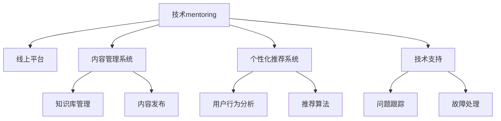

                 

# 技术mentoring：线上平台的搭建与运营

> 关键词：线上平台,技术mentoring,平台架构,用户管理,内容管理系统,个性化推荐,技术支持

## 1. 背景介绍

### 1.1 问题由来
在当下互联网时代，技术mentoring成为了企业和个人成长的重要环节。线上平台的出现，为技术知识的传播和技能的学习提供了全新的平台和方式。然而，如何高效搭建和运营这样一个技术学习平台，成为了企业和组织需要关注的重要问题。在线上技术平台的搭建与运营过程中，会遇到诸多挑战，如用户管理、内容管理系统、个性化推荐、技术支持等问题。本文将从这些角度出发，对技术mentoring线上平台的搭建与运营进行全面探讨。

### 1.2 问题核心关键点
构建技术mentoring线上平台的核心关键点在于：
- 选择合适的技术架构和工具栈。
- 设计合理的用户管理体系，保证平台的可扩展性和用户粘性。
- 构建灵活的内容管理系统，支持丰富的内容形式和多样化的知识组织方式。
- 实现智能化的个性化推荐系统，提升用户体验和平台活跃度。
- 提供高效的技术支持和服务体系，解决用户在使用过程中遇到的各种技术问题。

### 1.3 问题研究意义
技术mentoring线上平台的搭建与运营对于提升企业员工技能、推动技术知识传播、加速技术人才的培养具有重要意义。具体来说：
- 为企业内部技术传播提供了一个便捷、高效的平台。
- 帮助员工实时掌握行业最新技术动态，保持技术领先优势。
- 通过互动交流，促进企业内部技术社区的形成，提升团队协作效率。
- 助力企业实现技术人才的储备和培养，提升企业竞争力。

## 2. 核心概念与联系

### 2.1 核心概念概述

为更好地理解技术mentoring线上平台的搭建与运营，本节将介绍几个密切相关的核心概念：

- 技术mentoring（技术辅导）：指通过一对一或一对多、线上或线下的方式，向技术开发者传授知识、技能和经验，帮助其提升技术水平和职业发展。
- 线上平台：利用互联网技术搭建的技术知识传播和互动交流平台，具备高度的灵活性和可扩展性。
- 内容管理系统（CMS）：管理网站或应用程序上的内容，支持内容创建、编辑、发布和检索的系统。
- 个性化推荐系统：根据用户的行为和偏好，为用户推荐相关内容，提升用户体验和平台活跃度。
- 技术支持：为用户提供快速、高效的技术问题解答和故障处理服务。

这些核心概念之间的逻辑关系可以通过以下Mermaid流程图来展示：



这个流程图展示了大语言模型的核心概念及其之间的关系：

1. 技术mentoring作为平台的根本目的，利用线上平台进行知识传播和技能培训。
2. 内容管理系统支持知识内容的创建和组织，提供丰富的内容形式和多样化的知识组织方式。
3. 个性化推荐系统提升用户体验，通过智能推荐机制，使用户在平台上的停留时间更长。
4. 技术支持体系保障平台稳定运行，及时解决用户遇到的技术问题，提升用户满意度。

这些概念共同构成了技术mentoring线上平台的核心功能框架，使其能够高效实现技术知识传播和技能培训。通过理解这些核心概念，我们可以更好地把握技术mentoring平台的工作原理和优化方向。

## 3. 核心算法原理 & 具体操作步骤

### 3.1 算法原理概述

技术mentoring线上平台的搭建与运营，本质上是利用互联网技术实现知识传播和技能培训的过程。其核心在于如何高效组织和管理知识内容，为用户提供个性化的学习体验，以及及时解决用户在使用过程中遇到的技术问题。

形式化地，假设平台拥有的技术知识为 $K$，用户数量为 $U$，推荐算法为 $A$，技术支持团队为 $S$。平台的搭建与运营过程可以表示为：

$$
\text{Platform} = \text{Content Management System} \times \text{Recommendation System} \times \text{Technical Support}
$$

其中：
- 内容管理系统（CMS）负责管理 $K$，支持内容的创建、编辑、发布和检索。
- 个性化推荐系统（ARS）根据用户行为分析 $H$，利用推荐算法 $I$ 为用户推荐 $K$ 中的相关内容。
- 技术支持团队（ST）负责维护平台的稳定性，及时解决用户技术问题 $J$，提升用户体验。

通过梯度下降等优化算法，平台的搭建与运营过程不断更新内容、优化推荐算法和改进技术支持，最小化用户流失率 $E$，使得平台能够持续吸引用户，传播技术知识。

### 3.2 算法步骤详解

技术mentoring线上平台的搭建与运营一般包括以下几个关键步骤：

**Step 1: 平台规划与需求分析**
- 根据企业的技术需求，确定平台的建设目标、功能模块和核心技术栈。
- 分析目标用户群体的技术水平、学习习惯和期望，设计符合用户需求的用户管理体系。

**Step 2: 选择技术架构和工具栈**
- 选择合适的编程语言、数据库、服务器、存储等技术栈，支持平台的快速搭建和稳定运行。
- 设计合理的系统架构，保证系统的可扩展性和灵活性。

**Step 3: 设计内容管理系统**
- 设计内容库和内容分类方式，支持知识内容的组织和管理。
- 开发内容管理系统，实现内容的上传、审核、发布和检索。
- 集成编辑器、标签系统、权限控制等功能模块，提升内容管理效率。

**Step 4: 实现个性化推荐系统**
- 收集用户行为数据，包括浏览历史、评分记录、评论等。
- 设计推荐算法，根据用户行为和偏好，生成推荐列表。
- 实时更新推荐列表，使用户始终能够获取到最新、最相关的技术知识。

**Step 5: 搭建技术支持体系**
- 设计技术支持流程，包括问题收集、分类、分配、解决和反馈等环节。
- 集成技术支持工具，如问题跟踪系统、知识库、故障处理机制等。
- 建立技术支持团队，提供7x24小时的技术问题解答和故障处理服务。

**Step 6: 部署与测试**
- 将平台部署到生产环境，进行全面的功能测试和安全测试。
- 收集用户反馈，根据测试结果不断优化和改进平台功能。

**Step 7: 运营与迭代**
- 实时监控平台各项指标，包括用户活跃度、内容浏览量、技术支持响应时间等。
- 根据监控数据和用户反馈，进行平台迭代和功能升级。
- 不断引入新的内容和技术，保持平台的知识更新和技术领先。

以上是技术mentoring线上平台搭建与运营的一般流程。在实际应用中，还需要根据具体平台的特点和需求，对各个环节进行优化设计，如改进推荐算法，引入更多用户行为特征，搜索最优的超参数组合等，以进一步提升平台性能。

### 3.3 算法优缺点

技术mentoring线上平台的搭建与运营方法具有以下优点：
1. 灵活高效。利用互联网技术，可以高效搭建和运营平台，快速传播技术知识。
2. 覆盖广泛。通过线上平台，可以实现对全球技术开发者的覆盖，提升技术传播的广度和深度。
3. 互动性强。通过互动交流，促进技术社区的形成，提升用户粘性和平台活跃度。
4. 个性化服务。利用个性化推荐系统，为用户提供个性化的学习体验，提高学习效率。

同时，该方法也存在一定的局限性：
1. 数据依赖度高。平台依赖用户行为数据进行推荐，数据量和质量直接影响推荐效果。
2. 技术门槛高。平台搭建与运营需要高水平的技术支撑，对技术团队的要求较高。
3. 用户体验复杂。平台功能多，用户体验设计和界面优化需花费大量时间和精力。
4. 安全问题突出。平台涉及大量技术数据和用户信息，安全性保障难度大。

尽管存在这些局限性，但就目前而言，技术mentoring线上平台仍是技术知识传播和技能培训的重要手段。未来相关研究的重点在于如何进一步降低平台搭建和运营的复杂度，提高平台的可扩展性和用户满意度，同时兼顾技术支持和数据安全等因素。

### 3.4 算法应用领域

技术mentoring线上平台在技术开发和IT行业得到了广泛应用，覆盖了几乎所有常见场景，例如：

- 技术培训课程：如编程语言、开发框架、工具使用等课程的在线学习。
- 技术知识库：通过汇集和组织技术文档、代码片段、学习视频等，为开发者提供全面的技术参考。
- 技术社区：通过在线互动和讨论，促进技术开发者之间的知识分享和交流。
- 技术交流会议：通过视频会议、直播互动等方式，举办线上技术交流活动，提升技术社区的活跃度。
- 技术竞赛：通过线上平台，组织编程竞赛、技术挑战等，激发开发者创新热情。

除了上述这些经典场景外，技术mentoring线上平台也被创新性地应用到更多场景中，如远程协作、软件开发、技术支持等，为技术开发者的学习、交流和创新提供了新的平台。随着技术知识的不断积累和传播，相信技术mentoring线上平台将在更广泛的领域得到应用，推动技术开发者的成长和技术社区的发展。

## 4. 数学模型和公式 & 详细讲解 & 举例说明

### 4.1 数学模型构建

本节将使用数学语言对技术mentoring线上平台的搭建与运营过程进行更加严格的刻画。

假设技术知识库 $K$ 包含 $N$ 个知识点，每个知识点 $i$ 的用户浏览次数为 $v_i$，用户的期望浏览次数为 $v_0$。用户 $u$ 对知识点 $i$ 的评分和评价为 $r_{ui}$。用户 $u$ 的技术水平为 $s_u$，平台的平均技术水平为 $s_{avg}$。

定义平台的用户流失率为 $E$，技术支持响应时间为 $t_{support}$，用户满意度为 $S_u$。平台的运营目标为最小化用户流失率 $E$，即：

$$
\min_{K,U,R,S} E = \sum_{u=1}^U E_u
$$

其中 $E_u$ 为单个用户流失率，可表示为：

$$
E_u = \prod_{i=1}^N (1 - P_u(i))
$$

$P_u(i)$ 为知识点 $i$ 对用户 $u$ 的吸引概率，可表示为：

$$
P_u(i) = \frac{v_i / v_0}{1 + \alpha \cdot (s_{avg} - s_u)}
$$

$\alpha$ 为技术水平对知识点吸引概率的影响系数。

### 4.2 公式推导过程

以下我们以推荐系统为例，推导推荐算法的基本公式。

假设用户 $u$ 的浏览历史为 $H_u = \{h_1, h_2, ..., h_n\}$，每个浏览行为 $h_k$ 对应的知识点为 $K_{h_k}$，用户的浏览行为向量 $H_u$ 可以表示为：

$$
H_u = \{K_{h_1}, K_{h_2}, ..., K_{h_n}\}
$$

推荐算法 $A$ 可以根据用户的浏览历史，计算每个知识点的吸引力 $P_i$，为用户推荐 $K$ 中的相关知识点。推荐算法 $A$ 的基本公式为：

$$
P_i = \frac{r_{ui}}{\sum_{j=1}^N r_{uj}}
$$

其中 $r_{ui}$ 为知识点 $i$ 对用户 $u$ 的评分，$\sum_{j=1}^N r_{uj}$ 为用户对所有知识点的评分总和。

在得到每个知识点的吸引力后，推荐算法 $A$ 可以按照吸引力大小进行排序，生成推荐列表 $L_u$。推荐列表 $L_u$ 中排名前 $M$ 的知识点即为用户 $u$ 的推荐内容，$M$ 为用户推荐的知识点数量。

### 4.3 案例分析与讲解

假设某技术平台拥有10个知识点，每个用户浏览过5个知识点。根据公式推导，平台可以计算每个知识点的吸引力，为每个用户生成推荐列表。例如：

- 用户 $u_1$ 浏览过知识点 $K_1$ 和 $K_3$，平台计算 $P_{K_1} = 0.5$，$P_{K_3} = 0.2$，用户 $u_1$ 的推荐列表为 $L_{u_1} = \{K_1, K_3\}$。
- 用户 $u_2$ 浏览过知识点 $K_2$、$K_4$、$K_5$，平台计算 $P_{K_2} = 0.3$，$P_{K_4} = 0.2$，$P_{K_5} = 0.1$，用户 $u_2$ 的推荐列表为 $L_{u_2} = \{K_2, K_4, K_5\}$。

通过这种方式，平台可以根据用户的浏览行为和评分数据，动态生成推荐列表，提升用户的学习体验和平台活跃度。

## 5. 项目实践：代码实例和详细解释说明

### 5.1 开发环境搭建

在进行技术mentoring线上平台实践前，我们需要准备好开发环境。以下是使用Python进行Django开发的环境配置流程：

1. 安装Anaconda：从官网下载并安装Anaconda，用于创建独立的Python环境。

2. 创建并激活虚拟环境：
```bash
conda create -n django-env python=3.8 
conda activate django-env
```

3. 安装Django：
```bash
pip install django
```

4. 安装相关的Python包：
```bash
pip install markdown django-crispy-forms django-contents-typeahead django-filter
```

5. 安装前端框架和库：
```bash
npm install react react-dom react-router-dom axios @material-ui/core
```

6. 安装数据库：安装MySQL或PostgreSQL等关系型数据库。

完成上述步骤后，即可在`django-env`环境中开始技术mentoring平台的开发实践。

### 5.2 源代码详细实现

下面我们以技术培训课程平台为例，给出使用Django框架对技术知识库进行管理的PyTorch代码实现。

首先，定义课程类：

```python
from django.db import models
from django.contrib.auth.models import User
from markdown import Markdown

class Course(models.Model):
    title = models.CharField(max_length=100)
    description = models.TextField()
    markdown_description = models.TextField()
    slug = models.SlugField(unique=True)
    tags = models.ManyToManyField('Tag', blank=True)
    author = models.ForeignKey(User, on_delete=models.CASCADE)
    published = models.BooleanField(default=False)

    def __str__(self):
        return self.title
```

然后，定义标签类：

```python
class Tag(models.Model):
    name = models.CharField(max_length=30, unique=True)

    def __str__(self):
        return self.name
```

接下来，定义内容管理系统和推荐系统：

```python
class Article(models.Model):
    title = models.CharField(max_length=100)
    markdown_title = models.TextField()
    content = models.TextField()
    markdown_content = models.TextField()
    published = models.BooleanField(default=False)
    course = models.ForeignKey(Course, on_delete=models.CASCADE)

    def __str__(self):
        return self.title

class Recommendation(models.Model):
    user = models.ForeignKey(User, on_delete=models.CASCADE)
    score = models.DecimalField(max_digits=4, decimal_places=2)
    timestamp = models.DateTimeField(auto_now=True)

    class Meta:
        ordering = ['-score', '-timestamp']
```

最后，定义技术支持系统：

```python
class Ticket(models.Model):
    title = models.CharField(max_length=100)
    description = models.TextField()
    user = models.ForeignKey(User, on_delete=models.CASCADE)
    created_at = models.DateTimeField(auto_now_add=True)
    updated_at = models.DateTimeField(auto_now=True)

    def __str__(self):
        return self.title
```

在代码实现中，我们使用了Django的ORM框架进行数据建模，定义了课程、标签、文章、推荐、工单等模型，并实现了基本的CRUD操作。同时，通过Markdown库将课程和文章的富文本转换为HTML格式，支持富文本编辑和渲染。

### 5.3 代码解读与分析

让我们再详细解读一下关键代码的实现细节：

**Course类**：
- 定义了课程的基本属性，如标题、描述、发布状态等。
- 使用Markdown将课程描述转换为HTML格式，支持富文本编辑和渲染。
- 定义了文章、标签、作者和发布状态等字段。

**Tag类**：
- 定义了标签的基本属性，如名称和唯一性。

**Article类**：
- 定义了文章的基本属性，如标题、内容、发布状态等。
- 使用Markdown将文章标题和内容转换为HTML格式，支持富文本编辑和渲染。
- 定义了课程外键，支持课程与文章的关联。

**Recommendation类**：
- 定义了推荐的基本属性，如用户、评分和时间戳。
- 通过时间戳和评分进行排序，生成推荐列表。

**Ticket类**：
- 定义了工单的基本属性，如标题、描述、用户和创建时间。

可以看到，通过Django的ORM框架和Markdown库，我们可以很方便地实现技术mentoring平台的内容管理系统。开发者可以将更多精力放在业务逻辑和页面设计上，而不必过多关注底层的实现细节。

当然，工业级的系统实现还需考虑更多因素，如数据库性能优化、缓存机制、消息队列等，但核心的技术知识库管理模块基本与此类似。

## 6. 实际应用场景

### 6.1 智能培训系统

技术培训系统通过技术mentoring线上平台，可以为企业的技术开发者提供便捷的学习途径和丰富的学习资源。企业可以针对特定的技术需求，收集并组织相关的课程和文章，建立专业的技术知识库，帮助开发者系统学习和掌握新技术。

在技术培训系统的实现上，可以利用文章管理模块，支持企业内部的技术专家发布技术文章和课程，及时更新最新的技术动态。通过评论、点赞等功能模块，促进用户之间的互动交流，提升学习效果。

### 6.2 技术社区

技术社区是技术开发者交流和分享技术的平台，通过技术mentoring线上平台，可以构建一个开放、活跃的技术社区。开发者可以在社区中发布技术问题、分享技术心得、参与技术讨论，与其他开发者共同学习和进步。

技术社区的实现需要依赖文章管理和评论系统，通过文章发布和评论反馈，构建知识分享的网络。利用标签和分类系统，用户可以轻松查找和筛选感兴趣的技术内容。同时，通过推荐系统和排行榜，提升平台的活跃度和用户粘性。

### 6.3 技术竞赛

技术竞赛是激发开发者创新热情和提升技术水平的有效方式，通过技术mentoring线上平台，可以组织线上编程竞赛、技术挑战等活动，吸引更多开发者参与。

技术竞赛的实现需要依赖比赛管理和奖励系统，通过比赛流程的自动化，保障比赛的公平性和公开性。通过奖励机制，激发开发者的参与热情，提升竞赛质量。同时，利用比赛结果分析和反馈系统，帮助开发者改进和提升技术水平。

### 6.4 未来应用展望

随着技术知识传播和技能培训的不断发展，基于技术mentoring线上平台的应用场景将进一步拓展，为技术开发者的学习、交流和创新提供新的平台。

在智慧医疗领域，技术mentoring平台可以为医疗技术开发者提供便捷的学习途径和丰富的学习资源，加速医疗技术的发展和应用。

在智能教育领域，技术mentoring平台可以帮助学生系统学习技术知识，提升技术素养，推动技术教育的普及和提升。

在智慧城市治理中，技术mentoring平台可以构建技术开发者社区，促进城市技术创新和应用，提升城市管理水平。

此外，在企业生产、社会治理、文娱传媒等众多领域，技术mentoring平台也将不断涌现，为技术开发者的学习、交流和创新提供新的平台。相信随着技术的日益成熟，技术mentoring线上平台必将在构建人机协同的智能时代中扮演越来越重要的角色。

## 7. 工具和资源推荐

### 7.1 学习资源推荐

为了帮助开发者系统掌握技术mentoring线上平台的搭建与运营的理论基础和实践技巧，这里推荐一些优质的学习资源：

1. Django官方文档：详细介绍了Django框架的使用方法和最佳实践，是Django开发者的必备参考资料。

2. Django实战教程：通过实际项目案例，详细讲解了Django的开发流程和最佳实践，适合初学者和进阶开发者。

3. Django REST框架教程：介绍了如何使用Django REST框架构建API接口，实现前后端分离，提升系统扩展性和可维护性。

4. Django Admin教程：详细讲解了如何使用Django Admin管理网站后台，提升网站的管理效率。

5. Markdown教程：介绍了Markdown的基本语法和应用场景，适合开发者进行富文本编辑和渲染。

通过这些资源的学习实践，相信你一定能够快速掌握技术mentoring平台的搭建与运营的精髓，并用于解决实际的业务问题。

### 7.2 开发工具推荐

高效的开发离不开优秀的工具支持。以下是几款用于技术mentoring平台开发常用的工具：

1. Django：基于Python的Web框架，开发高效，易于扩展。

2. Bootstrap：流行的前端UI库，可以快速搭建现代化的Web页面。

3. React：前端开发框架，支持组件化开发，提升页面交互性。

4. Elasticsearch：搜索引擎，用于高效检索和推荐。

5. Jenkins：自动化构建工具，支持CI/CD，保障系统稳定运行。

6. Docker：容器化技术，支持系统快速部署和迁移。

合理利用这些工具，可以显著提升技术mentoring平台的开发效率，加快创新迭代的步伐。

### 7.3 相关论文推荐

技术mentoring平台的发展源于学界的持续研究。以下是几篇奠基性的相关论文，推荐阅读：

1. Large Scale Learning for a New Kind of Web Search Engine: Collaborative Web Search（Google的Web搜索引擎论文）：介绍了Google搜索引擎的实现方法和优化策略，对搜索引擎技术有深入的理解。

2. Deep Web Mining and Summarization using Webminer and Semantic Grouping（CiteSeerX）：介绍了Deep Web技术在信息检索和文本摘要中的应用，对搜索引擎技术有深入的理解。

3. Deep Learning based Knowledge Graph Embedding: An Overview（CSLI论文）：介绍了知识图谱嵌入技术的基本原理和应用场景，对知识图谱技术有深入的理解。

4. Dynamic Recommender System Design and Evaluation Framework（NIST论文）：介绍了推荐系统设计的基本框架和评价指标，对推荐系统技术有深入的理解。

5. Online Advertising Revenue Prediction with Deep Learning Models（Kaggle论文）：介绍了基于深度学习的在线广告预测技术，对广告技术有深入的理解。

这些论文代表了大语言模型微调技术的发展脉络。通过学习这些前沿成果，可以帮助研究者把握学科前进方向，激发更多的创新灵感。

## 8. 总结：未来发展趋势与挑战

### 8.1 总结

本文对技术mentoring线上平台的搭建与运营进行了全面系统的介绍。首先阐述了技术mentoring平台的研究背景和意义，明确了平台搭建与运营的目标和关键点。其次，从原理到实践，详细讲解了技术mentoring平台的数学模型和算法实现，给出了平台搭建与运营的完整代码实例。同时，本文还广泛探讨了技术mentoring平台在智能培训系统、技术社区、技术竞赛等多个领域的应用前景，展示了技术平台的重要价值。此外，本文精选了平台搭建与运营的技术资源，力求为读者提供全方位的技术指引。

通过本文的系统梳理，可以看到，技术mentoring线上平台的搭建与运营对于提升技术知识传播、加速技术人才的培养具有重要意义。通过科学规划、精心设计和持续运营，技术mentoring平台可以为技术开发者的学习、交流和创新提供新平台，推动技术知识传播和技能培训的发展。

### 8.2 未来发展趋势

展望未来，技术mentoring线上平台的发展趋势如下：

1. 系统化与个性化并重。平台将更加注重用户的学习体验，通过个性化推荐和动态调整，提升用户的学习效果和平台活跃度。

2. 智能化的知识管理。平台将利用自然语言处理和知识图谱技术，对技术知识进行智能分类和关联，提升知识的检索效率和应用效果。

3. 多模态的交互方式。平台将支持文本、语音、视频等多种交互方式，提升用户的使用便捷性和平台互动性。

4. 社区化与社交化融合。平台将构建技术开发者社区，通过社交化互动，提升用户粘性和平台活跃度。

5. 云平台与本地化结合。平台将支持云平台与本地化部署，满足不同场景下的需求。

以上趋势凸显了技术mentoring平台的发展方向，技术开发者需要不断优化和改进平台功能，提升用户体验和技术知识的传播效率。

### 8.3 面临的挑战

尽管技术mentoring线上平台的发展前景广阔，但在迈向更加智能化、普适化应用的过程中，仍面临诸多挑战：

1. 数据质量与数据隐私。平台需要依赖大量的技术知识数据和用户行为数据，数据质量直接影响到推荐效果和用户体验。同时，如何保护用户隐私，避免数据泄露，也是平台的重要挑战。

2. 技术复杂度。平台涉及多种技术栈和工具，技术复杂度较高，需要高水平的技术团队进行开发和维护。

3. 用户教育与平台教育。平台需要持续进行用户教育和技术培训，提升用户的技术水平和平台使用体验。

4. 性能优化与资源管理。平台需要优化系统性能，提升用户体验和系统稳定性。同时，需要进行资源管理，保障系统的可靠运行。

5. 用户体验设计。平台需要注重用户体验设计，提升界面的易用性和互动性。

正视技术mentoring平台面临的这些挑战，积极应对并寻求突破，将是大语言模型微调走向成熟的必由之路。相信随着学界和产业界的共同努力，这些挑战终将一一被克服，技术mentoring平台必将在构建人机协同的智能时代中扮演越来越重要的角色。

### 8.4 研究展望

面向未来，技术mentoring线上平台的研究需要在以下几个方面寻求新的突破：

1. 探索个性化学习路径。通过分析用户的学习行为和反馈，为每个用户生成个性化的学习路径，提升学习效果和平台粘性。

2. 引入协同过滤推荐算法。通过协同过滤推荐算法，根据用户的历史行为和偏好，推荐相关内容，提升推荐效果和用户体验。

3. 引入用户画像技术。通过用户画像技术，构建用户画像，支持更精准的内容推荐和用户行为分析。

4. 引入知识图谱技术。通过知识图谱技术，对技术知识进行关联和整合，提升知识的检索效率和应用效果。

5. 引入自然语言处理技术。通过自然语言处理技术，支持文本处理和信息抽取，提升平台的智能化程度。

6. 引入机器学习技术。通过机器学习技术，提升推荐算法和知识管理的准确性和效率。

这些研究方向的探索，必将引领技术mentoring平台技术迈向更高的台阶，为技术开发者的学习、交流和创新提供新的平台。面向未来，技术mentoring线上平台需要与其他人工智能技术进行更深入的融合，如知识表示、因果推理、强化学习等，多路径协同发力，共同推动自然语言理解和智能交互系统的进步。只有勇于创新、敢于突破，才能不断拓展技术平台的边界，让技术知识传播和技能培训更好地造福人类社会。

## 9. 附录：常见问题与解答

**Q1：技术mentoring平台如何保证内容的准确性和权威性？**

A: 技术mentoring平台需要通过多种手段保证内容的准确性和权威性，具体包括：
1. 内容审核机制：平台需要设置内容审核机制，对新发布的文章和课程进行严格审核，确保内容的真实性和权威性。
2. 专家认证：邀请行业专家参与内容审核，提升内容的权威性和可信度。
3. 用户反馈机制：建立用户反馈机制，及时收集用户对内容的评价和建议，不断优化和改进内容质量。
4. 知识库更新：定期更新知识库，引入最新的技术动态和研究成果，确保内容的的时效性。

**Q2：技术mentoring平台如何实现个性化推荐？**

A: 技术mentoring平台实现个性化推荐的核心在于构建用户画像，分析用户行为和兴趣，推荐相关内容。具体步骤包括：
1. 数据收集：收集用户的行为数据，如浏览历史、评论记录等，构建用户画像。
2. 协同过滤：通过协同过滤算法，分析用户的历史行为和偏好，生成推荐列表。
3. 内容标签：为课程和文章打上标签，通过标签匹配，推荐相关内容。
4. 实时更新：实时更新推荐列表，根据用户的新行为和新兴趣，动态调整推荐算法。

**Q3：技术mentoring平台如何进行技术支持？**

A: 技术mentoring平台进行技术支持的核心在于建立技术支持流程，提供快速、高效的问题解答和故障处理服务。具体步骤包括：
1. 建立技术支持团队：组建专业的技术支持团队，提供7x24小时的技术支持。
2. 问题跟踪系统：建立问题跟踪系统，记录和分析用户遇到的技术问题。
3. 故障处理机制：建立故障处理机制，及时解决系统故障，保障平台的稳定运行。
4. 技术文档：编写详细的技术文档，帮助用户快速解决问题，提升用户体验。

**Q4：技术mentoring平台如何进行知识管理？**

A: 技术mentoring平台进行知识管理的核心在于构建知识库和分类体系，提升知识的检索效率和应用效果。具体步骤包括：
1. 知识库管理：建立知识库，管理平台上的所有技术知识，支持知识的上传、编辑、发布和检索。
2. 分类体系：构建知识分类体系，支持知识的分类和组织，方便用户查找和浏览。
3. 搜索引擎：引入搜索引擎，支持快速搜索和过滤知识库中的内容。
4. 内容审核：设置内容审核机制，确保知识库中内容的质量和权威性。

**Q5：技术mentoring平台如何进行用户教育？**

A: 技术mentoring平台进行用户教育的核心在于提供高质量的学习资源和引导用户主动学习。具体步骤包括：
1. 高质量的学习资源：提供高质量的学习资源，如技术文章、视频课程、案例分析等，提升用户的知识水平。
2. 用户引导：通过引导用户参与学习活动，如学习小组、在线讨论等，提升用户的学习动力和效果。
3. 学习评估：建立学习评估机制，评估用户的学习效果，并提供个性化的学习建议。
4. 技术支持：提供技术支持，解答用户在学习过程中遇到的问题，提升学习体验。

通过这些问题解答，相信你能够更好地理解技术mentoring平台的搭建与运营的关键点和方法。通过不断优化和改进平台功能，提升用户体验和技术知识的传播效率，技术mentoring平台必将在技术开发者的学习、交流和创新中扮演越来越重要的角色。

---

作者：禅与计算机程序设计艺术 / Zen and the Art of Computer Programming

