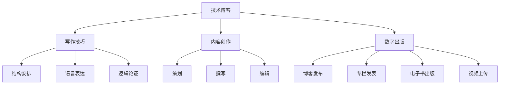

                 

# 技术写作：从博客到专栏作家之路

> 关键词：技术写作,博客写作,专栏作家,写作技巧,持续学习,内容创作,数字出版

## 1. 背景介绍

### 1.1 问题由来
随着互联网的发展，技术博客和专栏作家成为了一种新的职业形态，为技术工作者提供了一个分享知识和经验、表达见解和思考的舞台。尤其是随着移动设备的普及和社交媒体的兴起，技术写作的受众群体和传播方式都在发生深刻变化。

### 1.2 问题核心关键点
技术写作的核心在于如何用简洁明了的语言，准确传达复杂的知识和技术。对于从事技术写作的博客作者和专栏作家而言，他们需要具备以下核心能力：
- 扎实的基础知识：对特定技术领域有深入理解，能够准确讲解技术原理和实现细节。
- 清晰的表达能力：能够用通俗易懂的语言，将复杂的技术概念转化为易于理解的内容。
- 独特的见解和视角：除了介绍技术，还应该能够提供独到的分析和思考，提出创新的解决方案。
- 持续的学习和更新：技术不断演进，持续学习是保持写作内容和技巧永不过时的关键。

## 2. 核心概念与联系

### 2.1 核心概念概述

为了更好地理解技术写作，本节将介绍几个密切相关的核心概念：

- 技术博客（Tech Blog）：指专注于技术领域的博客，旨在分享最新的技术动态、实战经验、行业趋势等内容。
- 专栏作家（Columnist）：指在媒体或平台上定期发表技术相关文章的作者，内容深度和广度通常较博客更高。
- 写作技巧（Writing Skills）：指在技术写作中使用的各种技术和方法，如结构安排、语言表达、逻辑论证等。
- 内容创作（Content Creation）：指从策划、撰写、编辑到发布整个流程，确保内容的准确性、相关性和可读性。
- 数字出版（Digital Publishing）：指利用互联网技术，发布和传播技术内容的现代方式，包括博客、专栏、电子书、视频等形式。

这些概念之间的逻辑关系可以通过以下Mermaid流程图来展示：



这个流程图展示了一些核心概念及其之间的关系：

1. 技术博客通过内容创作和写作技巧，向读者提供技术信息和知识。
2. 专栏作家基于博客内容，进一步提升文章的深度和广度。
3. 数字出版技术使得文章可以通过多种形式进行传播和发布。
4. 结构安排、语言表达和逻辑论证是提升文章质量的关键技巧。

## 3. 核心算法原理 & 具体操作步骤

### 3.1 算法原理概述

技术写作的核心算法原理可以概括为：通过优化结构、语言和逻辑的运用，将技术知识转化为易于理解的内容，并利用数字出版技术进行广泛传播。具体步骤如下：

1. 确定写作目标：明确要传达的核心信息和技术要点。
2. 设计文章结构：通过合理的结构安排，让读者能够清晰地跟随作者的思路。
3. 选择表达语言：根据读者群体的特点，选择合适的语言和术语，确保内容的可读性。
4. 强化逻辑论证：通过逻辑严密的论证和实例分析，增强文章的说服力和权威性。
5. 发布和传播：利用数字出版技术，将文章发布到合适的平台，扩大影响力。

### 3.2 算法步骤详解

以下是技术写作的主要操作步骤：

**Step 1: 确定写作目标**
- 明确文章的主题和目标受众。
- 确定文章的核心信息和技术要点。

**Step 2: 设计文章结构**
- 将文章分为引言、主体和结论三大部分。
- 引言部分简要介绍背景和文章主旨。
- 主体部分详细介绍技术实现和案例分析。
- 结论部分总结主要观点，提出建议或展望。

**Step 3: 选择表达语言**
- 根据目标受众选择合适的语言风格，如专业术语、通俗易懂的语言等。
- 避免使用过于复杂的句式和难以理解的词汇。

**Step 4: 强化逻辑论证**
- 引入权威数据和实验结果，增强论据的可靠性。
- 通过对比分析和实例展示，详细说明技术原理和应用场景。

**Step 5: 发布和传播**
- 选择合适的数字出版平台，如博客、技术论坛、社交媒体等。
- 利用SEO和社交网络工具，提高文章的曝光率和传播范围。

### 3.3 算法优缺点

技术写作的优势在于其高度的专业性和知识的传递效率，但也存在以下缺点：
1. 门槛较高：需要较强的技术背景和写作能力。
2. 内容更新周期长：技术演进较快，需要频繁更新内容以保持时效性。
3. 阅读门槛高：过于专业的文章可能难以被非专业人士理解。
4. 获取流量困难：如何在茫茫信息海洋中吸引读者关注，是一个挑战。

尽管存在这些挑战，但技术写作在传递知识和技术方面仍然具有不可替代的价值。

### 3.4 算法应用领域

技术写作广泛应用于以下领域：

- 技术博客：如CSDN、博客园、Stack Overflow等，提供技术分享和交流平台。
- 专业杂志：如IEEE、ACM等，刊登高质量的技术论文和案例分析。
- 技术论坛：如GitHub的Discussions、知乎等，进行技术讨论和问题解答。
- 企业内刊：为内部员工提供技术培训和行业趋势分析。
- 技术培训教材：如Udacity、Coursera等在线课程和教学材料。

## 4. 数学模型和公式 & 详细讲解 & 举例说明

### 4.1 数学模型构建

在技术写作中，虽然不需要复杂的数学模型，但可以通过一些简单的模型来分析文章的效果和传播效果。例如，可以使用PageRank算法来评估文章在搜索引擎中的权重，使用回归模型来预测文章的阅读量和受众群体的分析。

### 4.2 公式推导过程

以下是一些简单的数学模型推导过程：

**PageRank算法**

PageRank是Google搜索引擎中用于评估网页权重的算法，可以将文章在搜索引擎中的权重计算公式表示为：

$$
PR_i = (1-d) + d \sum_{j} \frac{PR_j \cdot A_{ij}}{out-degree(j)}
$$

其中 $PR_i$ 表示网页 $i$ 的PageRank值，$d$ 是阻尼系数（0.85），$A_{ij}$ 表示网页 $j$ 到网页 $i$ 的超链数量，$out-degree(j)$ 表示网页 $j$ 的出链数量。

**回归模型**

假设文章阅读量 $y$ 可以用时间 $t$ 和受众特征 $x$ 进行回归分析，则可以建立线性回归模型：

$$
y = \beta_0 + \beta_1 t + \beta_2 x
$$

其中 $\beta_0$ 为截距，$\beta_1$ 为时间影响系数，$\beta_2$ 为受众特征系数。

**案例分析与讲解**

假设一篇文章的PageRank值为0.5，点击率为0.1，则通过Google PageRank算法可以计算出这篇文章在搜索引擎中的权重，进而估算其被搜索的概率。同时，通过回归模型可以预测不同时间段的阅读量，帮助作者调整发布策略。

## 5. 项目实践：代码实例和详细解释说明

### 5.1 开发环境搭建

在进行技术写作实践前，我们需要准备好开发环境。以下是使用Python进行技术写作环境配置的流程：

1. 安装Anaconda：从官网下载并安装Anaconda，用于创建独立的Python环境。

2. 创建并激活虚拟环境：
```bash
conda create -n tech-env python=3.8 
conda activate tech-env
```

3. 安装必要的工具包：
```bash
pip install pandas numpy matplotlib seaborn scikit-learn
```

4. 安装Markdown工具：
```bash
pip install markdown
```

完成上述步骤后，即可在`tech-env`环境中开始技术写作实践。

### 5.2 源代码详细实现

以下是使用Python进行技术写作的代码实现：

```python
import pandas as pd
import numpy as np
import seaborn as sns
import matplotlib.pyplot as plt

# 假设收集到的数据
data = pd.read_csv('tech_article_data.csv')

# 计算PageRank值
def calculate_pagerank(pr_values, out_degrees, a=0.85):
    pagerank_values = np.zeros(len(pr_values))
    for i in range(len(pr_values)):
        pagerank_values[i] = (1 - a) + a * np.sum((pagerank_values * a) / out_degrees)
    return pagerank_values

# 使用PageRank算法计算文章权重
pagerank_values = calculate_pagerank(data['pagerank'], data['out_degree'])

# 绘制文章权重分布图
sns.distplot(pagerank_values, bins=20)
plt.title('Article PageRank Distribution')
plt.xlabel('PageRank Value')
plt.ylabel('Frequency')
plt.show()

# 建立线性回归模型预测文章阅读量
from sklearn.linear_model import LinearRegression
X = data[['time', 'x1', 'x2', 'x3']]  # 假设x1, x2, x3为受众特征
y = data['reading_count']
model = LinearRegression()
model.fit(X, y)

# 预测未来文章阅读量
future_data = pd.DataFrame({
    'time': [next_time],
    'x1': [future_x1],
    'x2': [future_x2],
    'x3': [future_x3]
})
predictions = model.predict(future_data)
print(f'Predicted Reading Count: {predictions[0]}')
```

### 5.3 代码解读与分析

让我们再详细解读一下关键代码的实现细节：

**技术写作数据处理**

```python
data = pd.read_csv('tech_article_data.csv')
```

读取包含技术文章数据的CSV文件，并进行初步处理。

**计算PageRank值**

```python
def calculate_pagerank(pr_values, out_degrees, a=0.85):
    pagerank_values = np.zeros(len(pr_values))
    for i in range(len(pr_values)):
        pagerank_values[i] = (1 - a) + a * np.sum((pagerank_values * a) / out_degrees)
    return pagerank_values
```

实现PageRank算法，计算每个网页的PageRank值。

**绘制文章权重分布图**

```python
sns.distplot(pagerank_values, bins=20)
plt.title('Article PageRank Distribution')
plt.xlabel('PageRank Value')
plt.ylabel('Frequency')
plt.show()
```

使用Seaborn库绘制PageRank值的分布图，直观展示文章权重分布情况。

**建立线性回归模型**

```python
from sklearn.linear_model import LinearRegression
X = data[['time', 'x1', 'x2', 'x3']]  # 假设x1, x2, x3为受众特征
y = data['reading_count']
model = LinearRegression()
model.fit(X, y)
```

使用线性回归模型预测文章阅读量，其中X为特征数据，y为阅读量。

**预测未来文章阅读量**

```python
future_data = pd.DataFrame({
    'time': [next_time],
    'x1': [future_x1],
    'x2': [future_x2],
    'x3': [future_x3]
})
predictions = model.predict(future_data)
print(f'Predicted Reading Count: {predictions[0]}')
```

使用模型预测未来文章的阅读量，其中future_data为预测数据，predictions为预测结果。

## 6. 实际应用场景

### 6.1 技术博客写作

技术博客是技术写作的主要形式之一，可以通过博客分享最新技术动态、实战经验、行业趋势等内容。例如，在博客园上，程序员可以分享自己的项目经验和代码案例，帮助其他开发者学习和借鉴。

### 6.2 专栏作家写作

专栏作家通常具有较高的写作水平和行业影响力，他们可以在媒体平台上定期发表深度技术文章，为读者提供有价值的见解和分析。例如，在《MIT Technology Review》中，专栏作家可以分享最新的科研成果和技术趋势，引导读者思考和讨论。

### 6.3 技术培训教材编写

技术培训教材是技术写作的重要应用场景之一，可以为培训人员和学生提供系统化的知识体系和技术指导。例如，Coursera上的课程讲义和教材，就是通过技术写作呈现的技术知识和实战案例。

### 6.4 企业内刊撰写

企业内刊是内部技术交流的平台，可以帮助员工分享技术经验和行业动态。例如，IBM的内部期刊《IBM Research》，通过技术写作展示了IBM在技术研发和应用方面的最新进展和研究成果。

### 6.5 技术论坛贡献

技术论坛是技术交流和问题解答的重要渠道，可以通过技术写作参与技术讨论和问题解答。例如，Stack Overflow上的技术问答和讨论，通过技术写作帮助其他开发者解决技术难题。

## 7. 工具和资源推荐

### 7.1 学习资源推荐

为了帮助技术写作者提升写作技能，这里推荐一些优质的学习资源：

1. 《技术写作的艺术》（The Art of Technical Writing）：详细介绍了技术写作的基础知识和写作技巧，适合初学者入门。
2. 《文案写作原理》（Writing Tools: 50 Essential Strategies for Every Writer）：涵盖各种写作技巧和工具，提升写作水平。
3. 《新媒体写作手册》（The Web Writer's Handbook）：专为互联网内容创作而设计，提供从内容策划到传播的全流程指导。
4. 《深度学习入门：基于Python的理论与实现》：介绍深度学习的基础知识和技术实现，帮助技术写作者理解技术原理。
5. GitHub和Stack Overflow：这些平台提供了大量的开源项目和技术讨论，是学习技术写作的好资源。

### 7.2 开发工具推荐

以下是几款用于技术写作开发的常用工具：

1. Sublime Text：支持多种编程语言和语法高亮，具备强大的代码编辑功能，适合技术写作。
2. VSCode：轻量级代码编辑器，支持Git、GitHub等版本控制工具，适合开发和写作。
3. Markdown Editor：专业的Markdown编辑器，支持Markdown语法和插件，适合写作博客和文档。
4. LaTeX：专业的排版系统，适合撰写论文和技术文档。
5. GitLab和GitHub：代码托管平台，提供版本控制和代码协作功能，适合技术博客和项目开发。

### 7.3 相关论文推荐

技术写作的不断发展依赖于学界的持续研究。以下是几篇奠基性的相关论文，推荐阅读：

1. "Improving the Accuracy of Information Retrieval"（Bolter和Griffiths）：介绍了信息检索的原理和算法，对技术写作的传播效果有重要指导意义。
2. "A Taxonomy of Scientific Writing"（Swales）：分类总结了科学写作的不同类型和风格，对技术写作的学术表达有重要参考价值。
3. "Technical Writing"（Madler）：详细介绍了技术写作的各个环节和最佳实践，是技术写作的指南书。
4. "Digital Publishing Trends and Challenges"（Boyd and Luke）：分析了数字出版的趋势和挑战，对技术写作的出版传播有重要参考价值。
5. "Writing Effective Documentation"（Kaner）：介绍如何编写有效的技术文档，对技术写作的实用性和可读性有重要指导意义。

## 8. 总结：未来发展趋势与挑战

### 8.1 总结

本文对技术写作的核心概念和操作步骤进行了全面系统的介绍。首先阐述了技术写作的背景和意义，明确了技术写作的核心能力和关键技巧。其次，从原理到实践，详细讲解了技术写作的数学模型和具体操作步骤，给出了技术写作任务开发的完整代码实例。同时，本文还广泛探讨了技术写作在技术博客、专栏、培训教材等多个场景中的应用前景，展示了技术写作范式的强大价值。最后，本文精选了技术写作的学习资源、开发工具和相关论文，力求为技术写作者提供全方位的技术指引。

通过本文的系统梳理，可以看到，技术写作在传递知识和技术方面具有不可替代的价值。技术写作不仅仅是表达技术，更是一种艺术，需要不断提升自身的写作水平和表达能力。随着技术的发展和互联网的普及，技术写作将会有更广阔的应用前景和更多的发展机遇。

### 8.2 未来发展趋势

展望未来，技术写作将呈现以下几个发展趋势：

1. 内容形式多样化：随着移动互联网的发展，技术写作将更加注重多媒体内容的创作和传播，如视频、音频、图像等。
2. 互动性增强：技术写作将更多地采用互动性工具，如在线问答、投票、评论区等，增加读者参与度。
3. 个性化定制：技术写作将更加注重个性化推荐和定制化服务，根据读者的兴趣和需求，推荐相关内容和文章。
4. 数据驱动写作：通过数据分析和机器学习技术，优化内容创作和传播策略，提升技术写作的效果和影响力。
5. 开源化普及：技术写作将更多地采用开源工具和平台，如Jupyter Notebook、GitHub等，促进技术和知识的无障碍共享。

这些趋势凸显了技术写作在未来的发展方向和潜在的增长空间。技术写作者应积极拥抱这些变化，不断提升自己的技能和适应性，以应对未来的挑战和机遇。

### 8.3 面临的挑战

尽管技术写作在技术传播方面具有重要价值，但在其发展和应用过程中，仍面临诸多挑战：

1. 内容质量控制：如何保证技术写作内容的准确性和权威性，避免误导读者。
2. 技术更新迅速：如何及时更新技术写作内容，保持文章的时效性和实用性。
3. 读者多样性：如何针对不同背景和需求的读者，选择适合的表达方式和内容形式。
4. 平台多样性：如何在不同的平台和渠道上，保持技术写作的一致性和可读性。
5. 版权和合规性：如何确保技术写作内容的版权合规，避免侵犯知识产权。

这些挑战需要技术写作者不断努力和创新，以应对未来的发展需求和应用场景。

### 8.4 研究展望

面向未来，技术写作的研究需要在新技术、新工具和新平台的支持下，不断探索和创新：

1. 引入AI技术：通过自然语言处理和机器学习技术，提高技术写作的自动化和智能化水平。
2. 推动开源运动：通过开源工具和平台，促进技术和知识的无障碍共享，提高技术写作的普及度和影响力。
3. 探索新媒介：利用新兴媒介和技术，如虚拟现实、增强现实等，提升技术写作的表现力和沉浸感。
4. 注重伦理和隐私：在技术写作中注重伦理和隐私问题，确保技术传播的正面影响和合规性。

只有不断探索和创新，技术写作才能更好地适应未来的发展需求，为技术传播和知识共享提供新的动力和方向。总之，技术写作需要技术写作者不断学习、实践和创新，方能与时俱进，保持技术传播的高效性和准确性。

## 9. 附录：常见问题与解答

**Q1：如何提升技术写作的阅读体验？**

A: 提升技术写作的阅读体验需要从多个方面入手：
1. 使用清晰的标题和子标题，使文章结构清晰。
2. 使用简洁明了的语言和段落，避免过于复杂和冗长的句子。
3. 使用图表、代码片段等可视化手段，帮助读者更好地理解技术内容。
4. 提供交互式链接和参考文献，增加文章的权威性和可访问性。

**Q2：如何保持技术写作的持续更新？**

A: 保持技术写作的持续更新需要不断学习和跟踪技术动态，具体方法包括：
1. 订阅技术博客和新闻网站，及时获取最新技术信息。
2. 参加技术会议和讲座，与技术社区互动交流。
3. 加入技术社区和论坛，与同行交流经验和心得。
4. 使用RSS订阅工具，自动化获取最新技术文章。

**Q3：如何提高技术写作的传播效果？**

A: 提高技术写作的传播效果需要采用多种策略：
1. 优化SEO，提升文章在搜索引擎中的排名。
2. 利用社交媒体，通过分享和评论增加文章的曝光率。
3. 参与技术讨论和问答，增加文章的互动性和传播范围。
4. 利用数据驱动的方法，分析读者反馈和传播效果，优化写作策略。

**Q4：如何选择适合的技术写作平台？**

A: 选择适合的技术写作平台需要考虑以下因素：
1. 目标受众：选择符合目标受众的写作平台，如技术论坛、博客、视频平台等。
2. 写作需求：选择支持多种格式和功能的技术写作平台，如GitHub、Medium等。
3. 平台特性：选择具备互动性强、社区活跃度高的平台，如Stack Overflow、知乎等。
4. 平台支持：选择支持多种编程语言和工具的平台，如Jupyter Notebook、GitLab等。

**Q5：如何处理技术写作中的版权问题？**

A: 处理技术写作中的版权问题需要遵循以下原则：
1. 尊重知识产权：在使用他人技术和知识时，要注明出处并获取授权。
2. 开放共享：采用开源授权方式，如GPL、CC等，鼓励技术知识的共享和传播。
3. 遵循法律规定：了解并遵守相关版权法律和规定，确保技术写作的合规性。
4. 使用非商业用途：在技术写作中避免商业化，保持技术的公益性和透明度。

这些常见问题及其解答，可以帮助技术写作者在实践中更好地应对各种挑战，提升技术写作的水平和影响力。

---

作者：禅与计算机程序设计艺术 / Zen and the Art of Computer Programming

