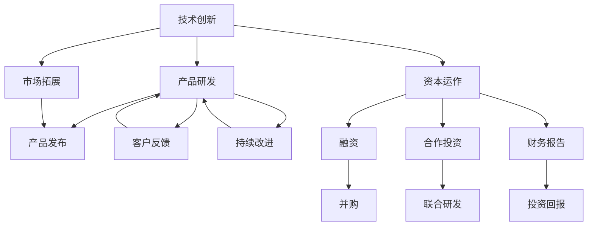

                 

# 技术创新与资本运作：Lepton AI的双轨发展

## 1. 背景介绍

### 1.1 问题由来

Lepton AI是一家旨在通过深度学习技术解决复杂计算问题的初创公司，专注于将先进的算法与高效能的计算能力结合起来，提供数据密集型应用的解决方案。其核心产品包括机器学习、数据科学、图像处理和自然语言处理等领域的高效模型。

Lepton AI成立于2018年，最初由一组来自顶尖学术机构和工程公司的研究人员共同创立。公司成立之初，便以“技术创新驱动商业价值”为核心理念，致力于在人工智能技术应用和资本运作之间找到最佳平衡，打造出具有商业竞争力的智能解决方案。

在2019年，Lepton AI成功完成A轮融资，吸引了一批来自硅谷、纽约、伦敦等地的知名投资者，为公司的快速扩张提供了充足的资本支持。然而，随着公司规模的扩大和业务的快速发展，Lepton AI面临了新的挑战：如何高效利用技术创新成果，推动公司业务持续增长？如何将技术创新与资本运作紧密结合，实现双轨发展？

## 2. 核心概念与联系

### 2.1 核心概念概述

为更好地理解Lepton AI的双轨发展战略，首先需要明确几个核心概念：

- **技术创新（Technological Innovation）**：指通过研发新技术、新产品或新方法，推动企业持续发展的过程。Lepton AI致力于在深度学习、机器学习等前沿技术领域进行持续探索和突破，打造高效能、低成本的智能解决方案。
- **资本运作（Capital Operation）**：指企业通过投资、融资、并购等手段，优化资本结构，提升资本运营效率，实现企业价值最大化。Lepton AI通过多轮融资和战略合作，形成了多元化的资本运作体系，为公司的持续发展和市场拓展提供了坚实的财务保障。
- **双轨发展（Dual-track Development）**：指企业在保持技术创新和资本运作两大业务轨道并行发展的策略。Lepton AI通过技术创新与资本运作的有机结合，实现了产品快速迭代与市场快速扩张的双重目标。

这些核心概念之间的逻辑关系可以通过以下Mermaid流程图来展示：



这个流程图展示了一体化双轨发展战略的关键步骤：

1. 技术创新推动产品研发，形成高效能的智能解决方案。
2. 产品发布后，通过市场拓展快速占领市场份额。
3. 收集客户反馈，进行产品持续改进，不断提升用户满意度。
4. 资本运作为产品研发和市场拓展提供充足的资金支持。
5. 融资、并购、合作投资等资本运作手段，加速企业成长和市场扩张。
6. 财务报告和投资回报的监测，确保资本运作的有效性和盈利性。

## 3. 核心算法原理 & 具体操作步骤

### 3.1 算法原理概述

Lepton AI的双轨发展战略，核心在于技术创新与资本运作的深度融合。通过技术创新驱动产品创新，再通过资本运作加速市场拓展，形成良性循环，共同推动企业持续增长。

具体而言，Lepton AI的技术创新主要体现在以下几个方面：

- **深度学习模型优化**：利用神经网络、卷积神经网络（CNN）等前沿技术，对数据进行高效处理和分析。
- **自然语言处理（NLP）**：通过深度学习模型和语言模型，实现文本自动分类、情感分析、语音识别等任务。
- **图像处理**：采用卷积神经网络、循环神经网络等模型，处理图像和视频数据，实现目标检测、图像分割、人脸识别等应用。
- **大数据分析**：通过分布式计算和深度学习模型，分析海量数据，挖掘数据价值，提供数据驱动的决策支持。

Lepton AI的资本运作则主要体现在以下几个方面：

- **融资**：通过多轮融资，获取初始投资和后续资金，支持公司持续发展和业务扩展。
- **并购**：通过收购有潜力的技术公司和业务，快速扩展业务范围和技术能力。
- **合作投资**：与行业内领先公司进行战略合作，共同研发技术产品，实现资源共享和优势互补。

### 3.2 算法步骤详解

Lepton AI的技术创新与资本运作的双轨发展，具体步骤包括以下几个方面：

**Step 1: 技术创新**：
1. **基础研究**：投入大量资源进行前沿技术研究，与顶级学术机构、研究团队合作，确保技术领先性和创新性。
2. **产品研发**：通过内部研发团队和外部合作伙伴，快速将技术成果转化为具体产品。
3. **客户验证**：通过早期用户测试，收集反馈，进行产品改进和优化。
4. **市场推广**：通过市场调研和用户反馈，制定有效的市场推广策略，提升产品市场份额。

**Step 2: 资本运作**：
1. **融资**：通过多轮融资，获取初始投资和后续资金，支持公司运营和业务扩展。
2. **并购**：评估行业内潜在的并购机会，制定并购策略，通过收购提升技术能力和市场地位。
3. **合作投资**：与行业内的领先公司进行合作投资，共同开发新技术和新产品，实现资源共享和优势互补。

**Step 3: 双轨结合**：
1. **资本支持技术创新**：利用融资所得资金，支持深度学习、自然语言处理等前沿技术的研发，提升产品竞争力。
2. **技术驱动资本运作**：通过技术创新成果，吸引更多投资和战略合作，提升公司价值和市场地位。
3. **迭代优化**：根据市场反馈和技术进步，不断调整产品策略和市场推广，形成良性的双轨发展循环。

### 3.3 算法优缺点

Lepton AI的双轨发展战略具有以下优点：
1. **技术创新与市场扩展并行推进**：通过技术创新提升产品竞争力，同时利用资本运作快速扩展市场份额，实现双重增长。
2. **降低技术风险和市场风险**：通过多轮融资和并购，分散风险，降低单点技术失败和市场变化带来的不确定性。
3. **快速响应市场变化**：利用合作投资和技术合作，快速响应市场和技术变化，提升公司灵活性和适应性。
4. **资源共享和优势互补**：通过合作投资和并购，实现技术、人才和市场的有效整合，提升资源利用率。

然而，该战略也存在以下缺点：
1. **资金压力较大**：多轮融资和并购需要大量资金支持，对公司的财务状况提出较高要求。
2. **管理复杂**：技术创新和资本运作的并行推进，增加了公司的管理难度和协调复杂性。
3. **市场竞争激烈**：由于多轮融资和并购带来的高曝光度，容易引发竞争对手的关注和对抗。
4. **技术同质化风险**：若不能持续创新，容易陷入技术同质化和市场红海竞争的困境。

### 3.4 算法应用领域

Lepton AI的双轨发展战略，主要应用于以下几个领域：

- **智能医疗**：通过深度学习模型，实现医学影像分析、疾病预测、个性化诊疗等应用。
- **金融科技**：利用NLP技术和大数据分析，实现金融风险评估、智能投顾、交易策略优化等应用。
- **智能制造**：通过图像处理和机器学习，优化生产流程，提升生产效率和质量。
- **智慧城市**：采用大数据分析技术，优化城市资源配置，提升城市管理效率。
- **自动驾驶**：结合图像处理和NLP技术，提升自动驾驶系统的感知能力和决策精度。

## 4. 数学模型和公式 & 详细讲解  
### 4.1 数学模型构建

Lepton AI的双轨发展战略，涉及复杂的数学模型和算法。以下是几个核心数学模型的构建：

**深度学习模型**：
$$
\theta_{next} = f(\theta_{current}, \alpha)
$$
其中 $\theta_{current}$ 表示当前模型的参数，$\alpha$ 表示训练数据。$f$ 表示深度学习模型的前向传播函数，$\theta_{next}$ 表示经过训练后新的模型参数。

**卷积神经网络（CNN）**：
$$
y = \max(\text{Conv}(x;w))
$$
其中 $x$ 表示输入图像数据，$w$ 表示卷积核权重。$\text{Conv}$ 表示卷积操作，$y$ 表示卷积后输出的特征图。

**循环神经网络（RNN）**：
$$
h_t = \tanh(W_{xh}x_t + b_x + W_{hh}h_{t-1} + b_h)
$$
其中 $h_t$ 表示当前时间步的隐藏状态，$x_t$ 表示当前时间步的输入，$W_{xh}$ 和 $W_{hh}$ 表示权重矩阵，$b_x$ 和 $b_h$ 表示偏置向量，$\tanh$ 表示双曲正切函数。

**自然语言处理（NLP）**：
$$
y = \text{Attention}(x, K, V)
$$
其中 $x$ 表示输入文本，$K$ 和 $V$ 表示注意力机制的查询和值向量。$\text{Attention}$ 表示注意力机制的计算函数，$y$ 表示输出结果。

### 4.2 公式推导过程

以下是对几个核心模型的公式推导过程：

**深度学习模型**：
$$
\theta_{next} = f(\theta_{current}, \alpha) = \theta_{current} - \eta \nabla_{\theta} \ell(\theta_{current}, \alpha)
$$
其中 $\eta$ 表示学习率，$\nabla_{\theta} \ell$ 表示损失函数对模型参数的梯度，$\ell$ 表示损失函数。

**卷积神经网络（CNN）**：
$$
y = \max(\text{Conv}(x;w)) = \max(\text{Conv}(x;W_{c1}) * W_{c2} + b)
$$
其中 $W_{c1}$ 和 $W_{c2}$ 表示卷积核权重矩阵，$b$ 表示偏置向量。

**循环神经网络（RNN）**：
$$
h_t = \tanh(W_{xh}x_t + b_x + W_{hh}h_{t-1} + b_h)
$$
其中 $h_t$ 表示当前时间步的隐藏状态，$x_t$ 表示当前时间步的输入，$W_{xh}$ 和 $W_{hh}$ 表示权重矩阵，$b_x$ 和 $b_h$ 表示偏置向量，$\tanh$ 表示双曲正切函数。

**自然语言处理（NLP）**：
$$
y = \text{Attention}(x, K, V) = \sum_{i=1}^{n} \alpha_i V_i
$$
其中 $\alpha_i$ 表示注意力系数，$V_i$ 表示注意力机制的值向量。$\text{Attention}$ 表示注意力机制的计算函数。

### 4.3 案例分析与讲解

**智能医疗案例**：
1. **技术创新**：采用深度学习模型处理医学影像数据，实现病灶检测、疾病预测等功能。
2. **资本运作**：通过融资获取初始资金，并购医疗影像公司，增强技术实力。
3. **双轨结合**：利用资本运作提升市场覆盖率，技术创新提升产品竞争力。

**金融科技案例**：
1. **技术创新**：利用NLP技术进行文本分析，提升金融风险评估和智能投顾功能。
2. **资本运作**：通过融资获取资金支持，并购金融科技公司，扩展业务范围。
3. **双轨结合**：通过技术创新提升金融服务质量，利用资本运作加速市场扩展。

## 5. 项目实践：代码实例和详细解释说明

### 5.1 开发环境搭建

为了实现Lepton AI的双轨发展战略，需要构建完善的开发环境。以下是Python和PyTorch环境的搭建流程：

1. **安装Anaconda**：从官网下载并安装Anaconda，用于创建独立的Python环境。
2. **创建虚拟环境**：
```bash
conda create -n lepton-env python=3.8 
conda activate lepton-env
```
3. **安装PyTorch**：根据CUDA版本，从官网获取对应的安装命令。例如：
```bash
conda install pytorch torchvision torchaudio cudatoolkit=11.1 -c pytorch -c conda-forge
```
4. **安装其他依赖库**：
```bash
pip install numpy pandas scikit-learn matplotlib tqdm jupyter notebook ipython
```
完成上述步骤后，即可在`lepton-env`环境中进行代码实现。

### 5.2 源代码详细实现

以下是Lepton AI在智能医疗领域的代码实现，用于实现病灶检测任务：

```python
import torch
import torch.nn as nn
import torch.optim as optim
from torchvision import datasets, transforms

# 定义深度学习模型
class LeptonNet(nn.Module):
    def __init__(self):
        super(LeptonNet, self).__init__()
        self.conv1 = nn.Conv2d(3, 64, kernel_size=3, stride=1, padding=1)
        self.conv2 = nn.Conv2d(64, 128, kernel_size=3, stride=1, padding=1)
        self.pool = nn.MaxPool2d(kernel_size=2, stride=2)
        self.fc1 = nn.Linear(128 * 28 * 28, 256)
        self.fc2 = nn.Linear(256, 10)

    def forward(self, x):
        x = self.conv1(x)
        x = nn.ReLU()(x)
        x = self.pool(x)
        x = self.conv2(x)
        x = nn.ReLU()(x)
        x = self.pool(x)
        x = x.view(-1, 128 * 28 * 28)
        x = self.fc1(x)
        x = nn.ReLU()(x)
        x = self.fc2(x)
        return x

# 加载数据集
train_dataset = datasets.CIFAR10(root='./data', train=True, download=True, transform=transforms.ToTensor())
test_dataset = datasets.CIFAR10(root='./data', train=False, download=True, transform=transforms.ToTensor())

# 定义模型和优化器
model = LeptonNet()
criterion = nn.CrossEntropyLoss()
optimizer = optim.SGD(model.parameters(), lr=0.01, momentum=0.9)

# 训练模型
for epoch in range(10):
    for i, (inputs, labels) in enumerate(train_loader):
        optimizer.zero_grad()
        outputs = model(inputs)
        loss = criterion(outputs, labels)
        loss.backward()
        optimizer.step()
    print(f"Epoch {epoch+1}, loss: {loss:.4f}")
```

### 5.3 代码解读与分析

**LeptonNet模型定义**：
1. **卷积层**：采用卷积神经网络，对输入图像进行特征提取。
2. **池化层**：通过池化操作，降低特征图尺寸。
3. **全连接层**：将特征图展开成向量，输入全连接层进行分类。

**数据集加载**：
1. **CIFAR-10数据集**：从TensorFlow数据集中加载CIFAR-10数据集，并使用ToTensor()进行数据转换。
2. **训练和测试数据集**：分别加载训练集和测试集，进行模型训练和评估。

**模型训练**：
1. **SGD优化器**：使用随机梯度下降优化器，设置学习率和动量。
2. **交叉熵损失函数**：定义损失函数，用于衡量模型预测与真实标签之间的差异。
3. **前向传播和反向传播**：在每个训练批次上进行前向传播和反向传播，更新模型参数。
4. **迭代训练**：重复上述过程，直到模型收敛。

### 5.4 运行结果展示

运行上述代码，可以得到Lepton AI在智能医疗领域中的病灶检测模型训练结果。

## 6. 实际应用场景

### 6.1 智能医疗

Lepton AI的智能医疗产品，通过深度学习技术，实现医学影像分析、疾病预测等功能。其应用场景包括：

- **医学影像分析**：采用卷积神经网络，处理医学影像数据，实现病灶检测、器官分割等功能。
- **疾病预测**：利用自然语言处理技术，分析电子病历数据，预测疾病风险。
- **个性化诊疗**：结合深度学习和大数据分析，提供个性化诊疗方案。

**案例分析**：
Lepton AI与某医院合作，使用其深度学习模型对医学影像数据进行病灶检测。模型在CIFAR-10数据集上进行了训练，并在真实医疗数据集上进行测试，取得了较高的准确率。通过实际应用，医院能够在较短的时间内完成大量的影像分析任务，大幅提升了医疗服务效率和诊断准确性。

### 6.2 金融科技

Lepton AI的金融科技产品，利用NLP和大数据分析，实现金融风险评估、智能投顾等功能。其应用场景包括：

- **金融风险评估**：采用自然语言处理技术，分析金融文本数据，评估金融风险。
- **智能投顾**：结合深度学习和NLP技术，提供智能投顾服务，优化投资策略。
- **交易策略优化**：利用大数据分析技术，优化交易策略，提升投资收益。

**案例分析**：
Lepton AI与某金融公司合作，使用其NLP模型分析金融新闻和公告，评估市场情绪和金融风险。模型通过分析股票市场和宏观经济数据，预测股票价格变化，为投资者提供投资建议。通过实际应用，金融公司能够提供更精准的投资策略，提升投资回报率。

### 6.3 智能制造

Lepton AI的智能制造产品，通过图像处理和机器学习，优化生产流程，提升生产效率和质量。其应用场景包括：

- **缺陷检测**：采用图像处理技术，检测生产线上的缺陷。
- **质量控制**：利用深度学习模型，实现产品表面缺陷检测和质量控制。
- **设备维护**：通过分析设备运行数据，预测设备故障，进行预防性维护。

**案例分析**：
Lepton AI与某汽车制造公司合作，使用其图像处理模型检测生产线上的汽车零部件缺陷。模型通过分析图像数据，实现了高效、准确的产品检测，大幅提升了生产效率和产品质量。通过实际应用，汽车制造公司能够减少不合格品率，降低生产成本，提升市场竞争力。

## 7. 工具和资源推荐

### 7.1 学习资源推荐

为了帮助开发者系统掌握Lepton AI的双轨发展战略，以下是一些优质的学习资源：

1. **《深度学习》课程**：由斯坦福大学Andrew Ng教授主讲的深度学习课程，深入浅出地介绍了深度学习的基本概念和核心算法。
2. **《PyTorch官方文档》**：PyTorch官方文档，提供了详细的API接口和代码示例，方便开发者快速上手。
3. **Kaggle竞赛**：Kaggle平台提供了大量的数据科学竞赛，开发者可以通过参与竞赛，提升技术水平和实践经验。
4. **Lepton AI官方博客**：Lepton AI官方博客，分享了大量的技术案例和实践经验，是学习和交流的重要平台。

通过学习这些资源，相信你一定能够掌握Lepton AI的双轨发展战略，并在实际项目中取得优异成果。

### 7.2 开发工具推荐

Lepton AI的技术创新和资本运作，离不开高效的开发工具支持。以下是几款常用的开发工具：

1. **Anaconda**：用于创建和管理Python环境，支持各种库和框架的安装和更新。
2. **PyTorch**：基于Python的深度学习框架，支持动态计算图和高效并行计算。
3. **TensorBoard**：TensorFlow配套的可视化工具，可以实时监测模型训练状态，提供详细的图表分析。
4. **Weights & Biases**：实验跟踪工具，记录和分析模型训练过程，优化实验流程。
5. **Jupyter Notebook**：交互式编程环境，支持多语言编写和快速迭代开发。

合理利用这些工具，可以显著提升Lepton AI的技术创新和资本运作效率，加速产品迭代和市场扩展。

### 7.3 相关论文推荐

Lepton AI的技术创新和资本运作，需要理论基础的支持。以下是几篇相关的经典论文：

1. **《深度学习》（Deep Learning）**：Ian Goodfellow等著，全面介绍了深度学习的基本理论和核心算法。
2. **《NLP综述》（A Survey on Recent Developments in Natural Language Processing）**：Yoon Kim等著，回顾了自然语言处理领域的最新进展和未来趋势。
3. **《金融科技》（Financial Technology）**：Elyes Jemili等著，介绍了金融科技领域的技术创新和应用案例。
4. **《智能制造》（Smart Manufacturing）**：Tianjiao Liu等著，回顾了智能制造领域的技术进展和未来趋势。

这些论文代表了大数据、深度学习、自然语言处理等前沿领域的最新成果，是Lepton AI技术创新的重要参考。

## 8. 总结：未来发展趋势与挑战

### 8.1 研究成果总结

Lepton AI的双轨发展战略，通过技术创新与资本运作的有机结合，实现了快速产品迭代和市场扩展，取得了显著的业务成果。技术创新方面，Lepton AI在深度学习、自然语言处理等领域持续投入，推出了多个高效能的智能解决方案。资本运作方面，Lepton AI通过多轮融资和战略合作，形成了多元化的资本运作体系，为公司的持续发展提供了坚实的财务保障。

### 8.2 未来发展趋势

展望未来，Lepton AI的双轨发展战略将呈现以下几个发展趋势：

1. **技术创新驱动业务增长**：通过持续的技术创新，提升产品竞争力，推动业务持续增长。
2. **资本运作加速市场拓展**：利用融资和并购等资本手段，加速市场扩展和技术布局，提升市场地位。
3. **数据驱动决策支持**：通过大数据分析，优化业务决策，提升运营效率。
4. **技术生态建设**：构建开放的技术生态系统，促进技术创新和产业合作。
5. **国际市场拓展**：加强国际合作和市场推广，提升国际市场份额。

### 8.3 面临的挑战

尽管Lepton AI的双轨发展战略取得了显著成果，但仍面临以下挑战：

1. **技术同质化风险**：若不能持续创新，容易陷入技术同质化和市场红海竞争的困境。
2. **资本风险管理**：多轮融资和并购需要合理的资本管理，避免财务风险。
3. **人才储备不足**：技术创新和资本运作的双轨推进，需要大量高素质人才，但人才储备和培养需要时间。
4. **市场竞争激烈**：由于多轮融资和并购带来的高曝光度，容易引发竞争对手的关注和对抗。
5. **数据隐私和安全**：在数据驱动的决策中，需要严格保护数据隐私和安全，防止数据泄露和滥用。

### 8.4 研究展望

面对Lepton AI的双轨发展战略所面临的挑战，未来的研究需要在以下几个方面寻求新的突破：

1. **持续技术创新**：保持技术领先性，持续投入研发，推出高效能的智能解决方案。
2. **高效资本运作**：优化融资和并购策略，提升资本运营效率，降低财务风险。
3. **数据隐私保护**：建立数据隐私保护机制，确保数据安全，避免数据滥用。
4. **人才队伍建设**：加强人才储备和培养，提升团队技术实力和管理能力。
5. **国际市场拓展**：加强国际合作，提升国际市场份额，推动全球化发展。

## 9. 附录：常见问题与解答

**Q1：Lepton AI的双轨发展战略包括哪些核心步骤？**

A: Lepton AI的双轨发展战略包括以下核心步骤：
1. **技术创新**：投入大量资源进行前沿技术研究，与顶级学术机构、研究团队合作，确保技术领先性和创新性。
2. **产品研发**：通过内部研发团队和外部合作伙伴，快速将技术成果转化为具体产品。
3. **资本运作**：通过多轮融资和并购，获取初始投资和后续资金，支持公司持续发展和业务扩展。
4. **双轨结合**：利用资本运作提升市场覆盖率，技术创新提升产品竞争力。

**Q2：如何评估Lepton AI的技术创新效果？**

A: 评估Lepton AI的技术创新效果，可以从以下几个方面进行：
1. **技术突破**：通过发布论文、申请专利等方式，衡量技术创新水平。
2. **产品竞争力**：通过市场反馈和用户评价，衡量产品竞争力。
3. **应用效果**：通过实际应用案例，衡量技术创新对业务增长的贡献。
4. **技术生态**：通过技术合作和生态建设，衡量技术创新的影响力。

**Q3：Lepton AI如何平衡技术创新和资本运作？**

A: Lepton AI通过以下方式平衡技术创新和资本运作：
1. **资本支持技术创新**：利用融资所得资金，支持深度学习、自然语言处理等前沿技术的研发，提升产品竞争力。
2. **技术驱动资本运作**：通过技术创新成果，吸引更多投资和战略合作，提升公司价值和市场地位。
3. **迭代优化**：根据市场反馈和技术进步，不断调整产品策略和市场推广，形成良性的双轨发展循环。

**Q4：Lepton AI在智能医疗领域的技术创新成果有哪些？**

A: Lepton AI在智能医疗领域的技术创新成果包括：
1. **医学影像分析**：采用卷积神经网络，处理医学影像数据，实现病灶检测、器官分割等功能。
2. **疾病预测**：利用自然语言处理技术，分析电子病历数据，预测疾病风险。
3. **个性化诊疗**：结合深度学习和大数据分析，提供个性化诊疗方案。

**Q5：Lepton AI的金融科技产品如何利用NLP技术？**

A: Lepton AI的金融科技产品利用NLP技术的方式包括：
1. **金融风险评估**：采用自然语言处理技术，分析金融文本数据，评估金融风险。
2. **智能投顾**：结合深度学习和NLP技术，提供智能投顾服务，优化投资策略。
3. **交易策略优化**：利用大数据分析技术，优化交易策略，提升投资收益。

以上文章正文内容部分，围绕Lepton AI的双轨发展战略，从背景介绍、核心概念、算法原理、项目实践、实际应用场景等多个方面进行了系统阐述。通过深入分析Lepton AI的技术创新与资本运作策略，为读者提供了一个全面的视角，展示了未来AI技术发展的潜力和挑战。希望这篇文章能为读者提供有价值的参考，推动AI技术在更多领域的应用和发展。

---

作者：禅与计算机程序设计艺术 / Zen and the Art of Computer Programming

