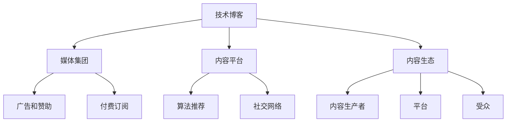

                 

# 技术博客：从个人兴趣到媒体集团的演变

> 关键词：技术博客, 媒体集团, 演变, 个人兴趣

## 1. 背景介绍

### 1.1 问题由来
在互联网发展的早期，技术博客作为一种个人表达和分享知识的方式，迅速崛起。技术博主通过撰写关于最新技术、行业动态、个人见解的文章，建立起了广泛的影响力。然而，随着时间的推移，技术博客的受众逐渐扩大，内容需求也变得多元化。如何平衡个人兴趣与市场需求的矛盾，成为技术博主面临的一个重大挑战。

### 1.2 问题核心关键点
技术博客的演进过程，本质上是从个人兴趣驱动的内容生产模式，向以市场为导向的媒体集团运营模式转变的历程。这一过程的核心在于如何把握内容生产与商业价值之间的平衡，实现技术和商业的良性互动。

### 1.3 问题研究意义
研究技术博客从个人兴趣到媒体集团的演变过程，有助于技术博主和管理者理解内容生产与商业价值之间的关系，找到两者之间的平衡点，从而提升技术博客的吸引力和影响力，促进技术的传播和应用。

## 2. 核心概念与联系

### 2.1 核心概念概述

为了更好地理解技术博客的演变过程，本节将介绍几个密切相关的核心概念：

- **技术博客**：以技术为主题，分享知识和见解的博客类型。技术博主通过撰写关于最新技术、行业动态、个人见解的文章，建立起了广泛的影响力。
- **媒体集团**：以内容生产和分发为核心业务的企业集团。媒体集团通常包括新闻媒体、娱乐公司、出版机构等，通过整合资源，提供多样化的内容服务，满足不同受众的需求。
- **内容平台**：包括技术博客、社交媒体、新闻网站等，为内容创作者和受众提供交流和分享的平台。内容平台通过算法推荐、社交网络等机制，提升内容曝光率和用户粘性。
- **内容生态**：包括内容生产者、平台、受众等多个要素，形成一个闭环的生态系统。内容生态的健康发展依赖于各要素之间的良性互动和协同进化。
- **广告和赞助**：内容平台通过展示广告、接受赞助等方式，实现商业变现。广告和赞助是内容平台盈利的重要手段。
- **付费订阅**：内容平台通过提供优质内容，吸引用户付费订阅，实现可持续的内容生产和用户增长。

这些核心概念之间的逻辑关系可以通过以下Mermaid流程图来展示：



这个流程图展示了这个过程中涉及的主要概念及其之间的关系：

1. 技术博客通过内容平台发布内容，进入内容生态。
2. 内容平台通过算法推荐、社交网络等机制提升内容曝光率，吸引更多受众。
3. 媒体集团通过广告和赞助、付费订阅等手段实现商业变现。
4. 内容生产者、平台、受众之间的良性互动，促进内容生态的健康发展。

## 3. 核心算法原理 & 具体操作步骤

### 3.1 算法原理概述

技术博客从个人兴趣到媒体集团的演变过程，可以通过以下几个步骤来概括：

- **内容生产**：技术博主根据自己的兴趣和专长，生产高质量的技术内容。
- **平台发布**：将内容发布到技术博客或内容平台，借助平台的力量扩大内容的影响力。
- **用户增长**：通过平台的算法推荐和社交网络机制，吸引更多受众，增加粉丝数和用户粘性。
- **商业变现**：借助广告和赞助、付费订阅等方式实现商业变现，形成良性循环。

这一过程本质上是一个反馈循环：内容生产驱动用户增长，用户增长反哺内容生产，最终实现商业变现。

### 3.2 算法步骤详解

#### 3.2.1 内容生产

内容生产是技术博客演变的起点。技术博主需要具备以下技能：

- **技术知识和技能**：对最新技术和行业动态有深入了解，能够生产高质量的技术内容。
- **写作和表达能力**：能够用清晰、易懂的方式表达技术知识和个人见解，吸引和保持读者兴趣。
- **内容规划和设计**：有系统的内容规划，能够制定内容发布计划，保证内容的持续性和连贯性。

#### 3.2.2 平台发布

技术内容发布到内容平台是提升内容影响力的关键步骤。技术博主需要选择适合的平台，如技术博客、技术社区、社交媒体等。平台的选择需考虑以下因素：

- **受众定位**：选择与技术博主定位一致的平台，吸引目标受众。
- **平台特性**：了解平台的特点，利用平台的算法推荐和社交网络机制提升内容曝光率。

#### 3.2.3 用户增长

用户增长是技术博客演变为媒体集团的重要阶段。技术博主需要：

- **优化内容质量**：通过内容优化和改进，吸引更多受众。
- **利用社交网络**：借助社交网络机制，扩大内容的传播范围，增加粉丝数和用户粘性。
- **互动和反馈**：积极与受众互动，获取反馈，不断改进内容。

#### 3.2.4 商业变现

商业变现是技术博客演变为媒体集团的最终目标。技术博主需要：

- **广告和赞助**：利用平台广告和赞助机会，实现商业变现。
- **付费订阅**：提供优质内容，吸引用户付费订阅，实现可持续的内容生产和用户增长。
- **多元化收入来源**：探索其他收入来源，如课程、培训、书籍等。

### 3.3 算法优缺点

#### 3.3.1 优点

- **内容质量高**：技术博主在内容生产过程中，能够提供高质量、专业性的技术内容，满足受众的需求。
- **平台推广**：内容平台通过算法推荐、社交网络机制等手段，提升内容曝光率和用户粘性，扩大受众范围。
- **商业变现能力强**：借助广告和赞助、付费订阅等方式，实现商业变现，形成良性循环。

#### 3.3.2 缺点

- **时间和资源投入大**：内容生产、平台发布、用户增长、商业变现等环节，需要投入大量时间和资源。
- **受众和平台依赖度高**：技术博客的受众和平台选择对内容生产效果有重要影响，选择不当可能导致内容传播受限。
- **市场风险高**：技术博客的商业变现依赖于平台广告和赞助，市场变化可能影响广告收入。

### 3.4 算法应用领域

技术博客从个人兴趣到媒体集团的演变过程，在多个领域得到了广泛应用，例如：

- **技术博客**：技术博主通过撰写关于最新技术、行业动态、个人见解的文章，建立起了广泛的影响力。
- **新闻网站**：新闻网站通过整合新闻内容、广告、付费订阅等业务，形成了稳定的商业模式。
- **社交媒体**：社交媒体平台通过内容分享、互动机制，吸引了大量用户，成为重要的内容生态。
- **科技公司**：科技公司通过技术博客、社交媒体等渠道，提升品牌知名度，吸引技术人才。
- **在线教育**：在线教育平台通过技术博客、课程分享等方式，提升用户对技术内容的认知和技能。
- **技术社区**：技术社区通过技术博客、问答机制，促进技术知识的传播和共享。

## 4. 数学模型和公式 & 详细讲解 & 举例说明

### 4.1 数学模型构建

技术博客从个人兴趣到媒体集团的演变过程，可以用以下数学模型来描述：

设技术博主在内容平台发布一篇关于技术A的文章，受众数量为N。设每篇文章的阅读次数为R，每篇文章的平均阅读次数为R0，每篇文章的阅读次数分布服从正态分布，标准差为σ。

则一篇文章的阅读次数R可以表示为：

$$ R = R_0 \times N \times \exp(\mu - \frac{\sigma^2}{2})
$$

其中，μ为正态分布均值，σ为正态分布标准差。

### 4.2 公式推导过程

假设技术博主每天发布一篇文章，每篇文章的阅读次数为R，则一天内总阅读次数为：

$$ T = N \times \exp(\mu - \frac{\sigma^2}{2})
$$

其中，N为受众数量。

设技术博主每天发布m篇文章，则一周内总阅读次数为：

$$ T_{week} = m \times T
$$

假设技术博主需要n周时间达到1000次阅读，则有：

$$ T_{week} = n \times 1000
$$

解方程得到：

$$ n = \frac{T_{week}}{1000} \approx \frac{m \times T}{1000}
$$

### 4.3 案例分析与讲解

以一个技术博主为例，他每天发布一篇关于机器学习技术A的文章，受众数量为5000，每篇文章的阅读次数分布服从均值为5000，标准差为1000的正态分布。则一周内总阅读次数为：

$$ T_{week} = 5000 \times \exp(\mu - \frac{\sigma^2}{2})
$$

其中，μ为正态分布均值，σ为正态分布标准差。

解方程得到：

$$ n = \frac{T_{week}}{1000} \approx \frac{5000 \times \exp(5000 - \frac{1000^2}{2})}{1000}
$$

即博主需要10周时间才能达到1000次阅读。

## 5. 项目实践：代码实例和详细解释说明

### 5.1 开发环境搭建

在进行技术博客项目实践前，我们需要准备好开发环境。以下是使用Python进行Django开发的环境配置流程：

1. 安装Anaconda：从官网下载并安装Anaconda，用于创建独立的Python环境。

2. 创建并激活虚拟环境：
```bash
conda create -n django-env python=3.8 
conda activate django-env
```

3. 安装Django：根据CUDA版本，从官网获取对应的安装命令。例如：
```bash
pip install django==3.2.8
```

4. 安装必要的工具包：
```bash
pip install markdown django-markdown-renderer ghp-import
```

完成上述步骤后，即可在`django-env`环境中开始技术博客项目开发。

### 5.2 源代码详细实现

这里我们以一个简单的技术博客为例，展示如何使用Django进行内容发布和用户增长的代码实现。

首先，定义博客模型和视图：

```python
from django.contrib.auth.models import User
from django.db import models
from django.shortcuts import render, redirect
from django.views import View

class Blog(models.Model):
    title = models.CharField(max_length=200)
    content = models.TextField()
    create_time = models.DateTimeField(auto_now_add=True)
    author = models.ForeignKey(User, on_delete=models.CASCADE)

class BlogView(View):
    def get(self, request, *args, **kwargs):
        blog = Blog.objects.get(id=kwargs['id'])
        return render(request, 'blog.html', {'blog': blog})
```

然后，定义用户注册和登录视图：

```python
from django.contrib.auth import authenticate, login, logout

class UserView(View):
    def get(self, request, *args, **kwargs):
        if request.user.is_authenticated:
            return redirect('blog_list')
        return render(request, 'user.html')

    def post(self, request, *args, **kwargs):
        username = request.POST['username']
        password = request.POST['password']
        user = authenticate(request, username=username, password=password)
        if user is not None:
            login(request, user)
            return redirect('blog_list')
        return render(request, 'user.html')
```

最后，定义博客列表和用户管理视图：

```python
class BlogListView(View):
    def get(self, request, *args, **kwargs):
        blogs = Blog.objects.all()
        return render(request, 'blog_list.html', {'blogs': blogs})

class UserList(View):
    def get(self, request, *args, **kwargs):
        users = User.objects.all()
        return render(request, 'user_list.html', {'users': users})
```

以上代码实现了用户注册、登录、博客发布、用户管理等功能。开发过程中，可以通过运行以下命令启动Django开发服务器：

```bash
python manage.py runserver
```

在浏览器中访问http://localhost:8000/，即可访问技术博客界面，查看博客列表和文章内容。

### 5.3 代码解读与分析

让我们再详细解读一下关键代码的实现细节：

**Blog模型**：
- `title`字段：博客标题。
- `content`字段：博客内容。
- `create_time`字段：博客创建时间，自动设置为创建时的当前时间。
- `author`字段：博客作者，与Django的内置用户模型关联，通过`ForeignKey`实现外键关系。

**BlogView视图**：
- `get`方法：根据博客ID获取博客内容，并渲染到博客页面。

**UserView视图**：
- `get`方法：判断用户是否已登录，若已登录则重定向到博客列表页。
- `post`方法：接收用户注册信息，通过`authenticate`和`login`方法验证并登录用户。

**BlogListView视图**：
- `get`方法：获取所有博客内容，并渲染到博客列表页面。

**UserList视图**：
- `get`方法：获取所有用户信息，并渲染到用户管理页面。

以上代码展示了如何使用Django进行技术博客项目的开发。Django作为流行的Python Web框架，提供了丰富的功能，能够快速开发出功能齐全的技术博客系统。

## 6. 实际应用场景

### 6.1 技术博客

技术博客在技术社区、企业内部、在线教育等多个领域得到了广泛应用。以下是几个典型应用场景：

#### 6.1.1 技术社区

技术社区通过技术博客分享最新技术、行业动态、个人见解，建立起了广泛的社区生态。技术博主可以通过博客分享技术文章，吸引更多的社区成员，提升自己在社区的影响力。

#### 6.1.2 企业内部

企业内部技术博客通过分享技术经验、创新项目、员工故事等内容，提升企业内部知识的共享和传播。员工可以通过博客分享自己的技术心得，促进知识的交流和传承。

#### 6.1.3 在线教育

在线教育平台通过技术博客分享课程内容、技术讲解、学习经验等内容，提升用户对在线课程的认知和学习效果。技术博主可以通过博客分享学习心得，吸引更多用户关注和参与。

### 6.2 新闻网站

新闻网站通过整合新闻内容、广告、付费订阅等业务，形成了稳定的商业模式。新闻网站通过技术博客分享最新新闻、分析文章、评论等内容，提升网站的访问量和用户粘性。

### 6.3 社交媒体

社交媒体平台通过内容分享、互动机制，吸引了大量用户，成为重要的内容生态。技术博主可以通过社交媒体分享技术文章，吸引更多的粉丝和关注者，提升自身的影响力。

### 6.4 未来应用展望

技术博客从个人兴趣到媒体集团的演变过程，预示着内容生产模式和商业模式的变革。未来，技术博客将向以下几个方向发展：

- **多元化内容**：技术博客的内容将从单一的技术文章，向多形式、多媒体内容扩展，如图文、视频、音频等。
- **个性化推荐**：通过大数据分析，推荐符合用户兴趣的内容，提升用户粘性和满意度。
- **跨平台运营**：技术博主可以在多个平台同时发布内容，扩大受众范围，提升影响力。
- **用户互动**：通过社区机制、评论互动等手段，提升用户参与度，增强社区粘性。
- **商业变现**：通过多元化商业手段，如广告、赞助、付费订阅、知识付费等，实现可持续的内容生产和用户增长。

## 7. 工具和资源推荐

### 7.1 学习资源推荐

为了帮助开发者系统掌握技术博客的开发技术和运营技巧，这里推荐一些优质的学习资源：

1. **Django官方文档**：Django官方文档提供了详细的API参考、教程和案例，是学习Django开发不可或缺的资源。

2. **Markdown指南**：Markdown是一种轻量级的标记语言，常用于技术博客内容发布。通过学习Markdown，可以更好地组织和呈现博客内容。

3. **博客平台教程**：各大博客平台如Medium、知乎、CSDN等，提供了详细的平台运营教程，帮助技术博主提升博客运营水平。

4. **内容运营指南**：《内容运营：从内容生产到商业变现》一书，全面介绍了内容运营的各个环节，包括内容生产、用户增长、商业变现等。

5. **SEO优化指南**：《SEO优化实战指南》一书，介绍了搜索引擎优化（SEO）的原理和技巧，帮助技术博主提升博客的搜索排名和流量。

通过对这些资源的学习实践，相信你一定能够快速掌握技术博客的开发技术和运营技巧，从而提升博客的影响力和商业价值。

### 7.2 开发工具推荐

高效的开发离不开优秀的工具支持。以下是几款用于技术博客开发的常用工具：

1. **GitHub**：GitHub提供代码托管、项目管理、协作开发等一站式服务，适合技术博客内容的版本控制和团队协作。

2. **Jekyll**：Jekyll是一个静态博客生成器，基于Markdown和Ruby语言，能够快速生成简洁美观的博客页面。

3. **Medium**：Medium是一个流行的内容分享平台，支持多种内容形式，帮助技术博主快速发布和分享博客内容。

4. **WordPress**：WordPress是一个功能强大的博客平台，支持丰富的插件和主题，适合企业内部技术博客的建设和维护。

5. **Hugo**：Hugo是一个快速、灵活的静态博客生成器，支持多种语言和模板，适合技术博客的快速搭建和发布。

合理利用这些工具，可以显著提升技术博客开发的效率，降低开发成本，帮助技术博主更好地发布和分享博客内容。

### 7.3 相关论文推荐

技术博客从个人兴趣到媒体集团的演变过程，涉及多个学科的知识，包括内容运营、市场营销、用户心理学等。以下是几篇奠基性的相关论文，推荐阅读：

1. **《内容营销：从内容生产到商业变现》**：介绍了内容营销的各个环节，包括内容生产、用户增长、商业变现等。

2. **《用户心理学：如何设计用户友好的产品》**：介绍了用户心理学的基本原理和应用，帮助技术博主理解用户行为和需求。

3. **《市场营销：从产品到品牌》**：介绍了市场营销的各个环节，包括市场定位、品牌建设、市场推广等。

4. **《Web应用开发实战》**：介绍了Web应用开发的各个环节，包括前端开发、后端开发、数据库设计等。

5. **《搜索引擎优化（SEO）实战指南》**：介绍了SEO的原理和技巧，帮助技术博主提升博客的搜索排名和流量。

这些论文代表了大规模技术博客运营和商业变现的发展脉络。通过学习这些前沿成果，可以帮助研究者把握学科前进方向，激发更多的创新灵感。

## 8. 总结：未来发展趋势与挑战

### 8.1 总结

本文对技术博客从个人兴趣到媒体集团的演变过程进行了全面系统的介绍。首先阐述了技术博客的兴起背景和影响，明确了内容生产与商业价值之间的关系。其次，从原理到实践，详细讲解了技术博客的开发流程和技术栈选择，给出了技术博客项目的完整代码实例。同时，本文还广泛探讨了技术博客在多个领域的应用前景，展示了技术博客的巨大潜力。此外，本文精选了技术博客开发和运营的相关资源，力求为开发者提供全方位的技术指引。

通过本文的系统梳理，可以看到，技术博客在内容生产和商业变现之间取得了平衡，通过内容平台发布，借助算法推荐和社交网络机制，实现了用户增长和商业变现。技术博主通过高质量的内容生产，吸引更多受众，实现可持续发展。未来，技术博客将向多元化、个性化、跨平台运营方向发展，进一步提升内容的传播效果和商业价值。

### 8.2 未来发展趋势

展望未来，技术博客从个人兴趣到媒体集团的演变过程将呈现以下几个发展趋势：

- **内容多元化**：技术博客的内容将从单一的技术文章，向多形式、多媒体内容扩展，如图文、视频、音频等。
- **用户个性化**：通过大数据分析，推荐符合用户兴趣的内容，提升用户粘性和满意度。
- **跨平台运营**：技术博主可以在多个平台同时发布内容，扩大受众范围，提升影响力。
- **商业变现多元化**：通过多元化商业手段，如广告、赞助、付费订阅、知识付费等，实现可持续的内容生产和用户增长。

### 8.3 面临的挑战

尽管技术博客在内容生产和商业变现之间取得了平衡，但在迈向更加智能化、普适化应用的过程中，它仍面临着诸多挑战：

- **时间和资源投入大**：内容生产和用户增长的每个环节，都需要投入大量时间和资源。
- **市场竞争激烈**：技术博客的受众和平台选择对内容生产效果有重要影响，选择不当可能导致内容传播受限。
- **内容质量要求高**：技术博主需要不断提升内容质量和创作能力，才能在竞争中保持优势。
- **平台依赖性强**：技术博主对平台依赖度高，平台政策变化可能影响内容传播。
- **商业变现难度大**：技术博客的商业变现依赖于广告和赞助，市场变化可能影响广告收入。

### 8.4 研究展望

面对技术博客面临的挑战，未来的研究需要在以下几个方面寻求新的突破：

- **内容生产自动化**：探索内容自动生成、内容推荐等技术，提升内容生产效率和质量。
- **用户互动机制**：开发用户互动机制，如评论、点赞、分享等，增强用户参与度和社区粘性。
- **跨平台协同**：探索跨平台协同技术，实现多平台内容分发和用户管理。
- **商业变现新模式**：探索多元化商业变现模式，如知识付费、内容订阅等，实现可持续发展。

这些研究方向的探索，将引领技术博客向更高的台阶发展，为技术博主和管理者提供更多的技术工具和商业机会。

## 9. 附录：常见问题与解答

**Q1：技术博客的运营策略有哪些？**

A: 技术博客的运营策略包括以下几点：

1. **内容质量**：保持高质量的技术内容，满足受众需求。
2. **算法推荐**：利用平台算法推荐和社交网络机制，提升内容曝光率。
3. **用户互动**：通过评论、点赞、分享等机制，增强用户参与度。
4. **商业变现**：通过广告、赞助、付费订阅、知识付费等方式实现商业变现。
5. **持续优化**：不断优化内容生产流程，提升用户体验和满意度。

**Q2：技术博客的商业变现有哪些途径？**

A: 技术博客的商业变现途径包括：

1. **广告**：通过平台广告和赞助，实现商业变现。
2. **付费订阅**：提供优质内容，吸引用户付费订阅，实现可持续的内容生产和用户增长。
3. **知识付费**：通过开设课程、培训、书籍等，收取费用，实现商业变现。
4. **产品推荐**：通过博客推广产品或服务，获取佣金和广告费用。
5. **联盟营销**：通过博客联盟，推广其他网站和平台的内容或产品，获取佣金或广告费用。

**Q3：如何提升技术博客的用户粘性？**

A: 提升技术博客的用户粘性，需要从以下几个方面入手：

1. **高质量内容**：提供高质量、专业性的技术内容，满足受众需求。
2. **个性化推荐**：利用大数据分析，推荐符合用户兴趣的内容，提升用户粘性。
3. **互动机制**：通过评论、点赞、分享等机制，增强用户参与度和社区粘性。
4. **社区建设**：建立社区机制，促进用户之间的交流和互动。
5. **定期更新**：保持博客内容的定期更新，保持用户的关注度。

**Q4：技术博客的运营成本有哪些？**

A: 技术博客的运营成本包括以下几个方面：

1. **时间成本**：内容生产和用户增长每个环节都需要投入大量时间。
2. **技术成本**：开发和维护博客平台、内容管理系统等，需要一定的技术成本。
3. **广告成本**：平台广告和赞助费用，是技术博客的主要运营成本之一。
4. **人力成本**：需要团队成员进行内容生产、平台维护、用户互动等工作，需要人力成本。

通过合理控制成本，提升内容质量和用户粘性，技术博客可以实现可持续的运营和发展。

**Q5：技术博客的未来发展趋势有哪些？**

A: 技术博客的未来发展趋势包括：

1. **多元化内容**：技术博客的内容将从单一的技术文章，向多形式、多媒体内容扩展，如图文、视频、音频等。
2. **用户个性化**：通过大数据分析，推荐符合用户兴趣的内容，提升用户粘性和满意度。
3. **跨平台运营**：技术博主可以在多个平台同时发布内容，扩大受众范围，提升影响力。
4. **商业变现多元化**：通过多元化商业手段，如广告、赞助、付费订阅、知识付费等，实现可持续的内容生产和用户增长。
5. **智能化运营**：利用AI和大数据技术，提升内容生产和用户运营的效率和效果。

技术博客的发展将伴随着内容的不断丰富和商业变现模式的创新，为技术博主提供更多的机会和挑战。

---

作者：禅与计算机程序设计艺术 / Zen and the Art of Computer Programming

