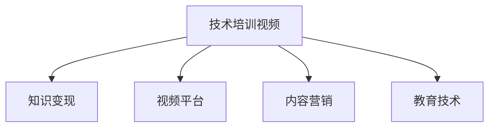

                 

# 技术培训视频：知识变现途径

> 关键词：技术培训,知识变现,视频制作,内容营销,教育技术

## 1. 背景介绍

### 1.1 问题由来

在信息技术快速发展的时代，知识共享与传播变得尤为重要。无论是专业人士还是普通学生，都希望通过分享自己的专业知识，获得经济上的回报或职业上的提升。而技术培训视频正是这种需求的最佳实现方式之一。本文章将介绍如何通过技术培训视频实现知识的变现，并探讨这一过程的核心概念与联系。

### 1.2 问题核心关键点

技术培训视频知识变现的关键在于以下几个方面：
- **内容质量**：高质量的内容是吸引观众和实现变现的基础。
- **平台选择**：选择合适的视频平台，以最大化观众覆盖和变现能力。
- **互动与反馈**：与观众互动并提供及时反馈，增强用户粘性。
- **定价策略**：制定合理的收费策略，确保收益最大化。
- **内容更新与维护**：持续更新内容，保持平台吸引力。

## 2. 核心概念与联系

### 2.1 核心概念概述

为更好地理解技术培训视频的知识变现过程，本节将介绍几个密切相关的核心概念：

- **技术培训视频**：通过视频形式，分享专业知识、技能或经验的教学内容。
- **知识变现**：将知识和技能以有偿服务的形式，转化为经济收益的过程。
- **视频平台**：如YouTube、Bilibili、Udemy等，提供视频内容展示与付费的渠道。
- **内容营销**：通过有吸引力的内容吸引和转化观众，实现商业目的。
- **教育技术**：利用先进技术手段，提升教育质量和效率，促进知识传播。

这些核心概念之间的逻辑关系可以通过以下Mermaid流程图来展示：



这个流程图展示出技术培训视频的变现过程：通过视频平台展示内容，运用内容营销手段吸引观众，并结合教育技术提升教学质量，最终实现知识变现的目标。

## 3. 核心算法原理 & 具体操作步骤

### 3.1 算法原理概述

技术培训视频的知识变现过程，本质上是一个有监督学习的过程。其核心思想是通过视频内容展示和展示平台推荐，将观众转化为付费用户。该过程可以概括为以下几个步骤：

1. **视频内容创作**：制作高质量的技术培训视频。
2. **平台选择与优化**：选择合适的视频平台，并通过优化平台设置提升内容曝光。
3. **互动与反馈**：与观众互动并提供及时反馈，提高观众粘性。
4. **定价策略**：制定合理的收费策略，如订阅模式、单次购买或免费试用。
5. **内容更新与维护**：持续更新内容，保持平台的活跃度和吸引力。

### 3.2 算法步骤详解

#### 3.2.1 视频内容创作

视频内容创作是知识变现的起点。高质量、有吸引力的视频内容，是吸引观众和实现变现的基础。创作视频时，需要考虑以下几个方面：

- **目标受众**：明确目标受众，了解他们的需求和兴趣点。
- **视频内容设计**：设计有逻辑、有深度的视频内容，避免过于冗长或无关内容。
- **视频呈现形式**：使用合适的视频呈现形式，如图像、动画、实拍等，增强观众体验。

#### 3.2.2 平台选择与优化

选择合适的视频平台是变现的重要环节。不同的平台拥有不同的用户群体和变现模式。常见的视频平台包括：

- **YouTube**：全球最大的视频平台，适合广泛受众。
- **Bilibili**：国内最大的二次元视频平台，适合特定兴趣群体。
- **Udemy**：全球知名的在线教育平台，适合付费课程模式。

平台选择后，需要对平台进行优化，以提升内容曝光和观众转化率：

- **视频标题与描述**：制作有吸引力的视频标题和描述，提高搜索排名。
- **视频标签与关键词**：添加相关标签和关键词，便于搜索引擎抓取。
- **平台互动**：积极与平台互动，提升账号曝光。

#### 3.2.3 互动与反馈

与观众互动并提供及时反馈，是提升用户粘性和忠诚度的重要手段：

- **评论互动**：积极回复观众评论，建立良好的互动关系。
- **社群建设**：建立相关的社群，进行内容讨论和分享。
- **反馈收集**：收集观众反馈，不断改进内容质量和教学方法。

#### 3.2.4 定价策略

制定合理的收费策略是变现的核心。常见的定价策略包括：

- **订阅模式**：按月或按年订阅，提供独家内容。
- **单次购买**：提供限时优惠或套餐购买。
- **免费试用**：提供免费试用期，增加购买意愿。

#### 3.2.5 内容更新与维护

持续更新内容，保持平台的活跃度和吸引力，是长期变现的关键：

- **定期更新**：定期发布新视频内容，保持内容新鲜度。
- **内容迭代**：根据观众反馈，不断改进和优化内容质量。
- **数据分析**：利用数据分析工具，了解观众偏好和内容效果。

### 3.3 算法优缺点

技术培训视频的知识变现过程具有以下优点：

- **覆盖广泛**：视频平台可覆盖全球用户，扩大观众群体。
- **形式多样**：视频形式可适应不同内容类型，增强用户粘性。
- **传播效率高**：视频传播速度快，可快速传递知识和技能。
- **反馈即时**：观众反馈及时，便于快速改进。

但该过程也存在以下缺点：

- **成本较高**：视频制作和平台优化需要投入较高成本。
- **内容质量要求高**：高质量内容的制作需要时间和精力。
- **竞争激烈**：视频平台竞争激烈，需要不断创新和改进。
- **收益分配问题**：平台分成较高，收益分配可能不均衡。

### 3.4 算法应用领域

技术培训视频的知识变现过程，广泛应用于以下几个领域：

- **软件开发**：分享编程技巧、框架应用等内容。
- **数据分析**：分享数据处理、统计分析等内容。
- **市场营销**：分享品牌推广、广告优化等内容。
- **个人发展**：分享职业规划、时间管理等内容。
- **健康生活**：分享饮食、运动、心理健康等内容。

## 4. 数学模型和公式 & 详细讲解 & 举例说明

### 4.1 数学模型构建

本节将使用数学语言对技术培训视频的知识变现过程进行更加严格的刻画。

记技术培训视频为 $X$，观众为 $Y$。定义视频内容质量为 $Q$，观众吸引力为 $A$，平台推荐度为 $R$，定价策略为 $P$，内容更新频率为 $U$。

定义观众转化率为 $T$，视频变现收益为 $V$。变现过程可以表示为：

$$
V = T \times Q \times A \times R \times P \times U
$$

其中，$T = \frac{观看人数}{转化人数}$ 表示观众转化率，$Q$ 表示视频内容质量，$A$ 表示观众吸引力，$R$ 表示平台推荐度，$P$ 表示定价策略，$U$ 表示内容更新频率。

### 4.2 公式推导过程

由于观众转化率 $T$ 取决于多个因素，可以进一步表示为：

$$
T = f(Q, A, R, P, U)
$$

其中 $f$ 为转化率函数，表示视频内容质量、观众吸引力、平台推荐度、定价策略、内容更新频率等变量对观众转化率的影响。

根据上述公式，我们可以得出，要实现最大的视频变现收益 $V$，需要最大化观众转化率 $T$，并结合其他因素共同作用。

### 4.3 案例分析与讲解

以一个软件开发教程为例，分析其变现过程：

- **视频内容质量**：视频讲解清晰、逻辑严密，内容贴近实际开发需求。
- **观众吸引力**：视频标题和描述吸引人，包含“零基础入门”等关键词。
- **平台推荐度**：视频标签使用得当，曝光率较高。
- **定价策略**：采用订阅模式，价格适中，并提供7天免费试用。
- **内容更新频率**：每周更新一次新内容，保持观众兴趣。

该教程通过多方面优化，实现了高观众转化率和变现收益。

## 5. 项目实践：代码实例和详细解释说明

### 5.1 开发环境搭建

在进行技术培训视频变现的实践前，我们需要准备好开发环境。以下是使用Python进行视频内容优化和变现的过程：

1. 安装Anaconda：从官网下载并安装Anaconda，用于创建独立的Python环境。

2. 创建并激活虚拟环境：
```bash
conda create -n video-env python=3.8 
conda activate video-env
```

3. 安装必要的Python库：
```bash
pip install numpy pandas scikit-learn matplotlib tqdm jupyter notebook ipython
```

完成上述步骤后，即可在`video-env`环境中开始视频内容优化和变现的实践。

### 5.2 源代码详细实现

以下是使用Python进行技术培训视频变现的代码实现：

```python
from transformers import BertTokenizer
from torch.utils.data import Dataset
import torch

class VideoDataset(Dataset):
    def __init__(self, texts, tags, tokenizer, max_len=128):
        self.texts = texts
        self.tags = tags
        self.tokenizer = tokenizer
        self.max_len = max_len
        
    def __len__(self):
        return len(self.texts)
    
    def __getitem__(self, item):
        text = self.texts[item]
        tags = self.tags[item]
        
        encoding = self.tokenizer(text, return_tensors='pt', max_length=self.max_len, padding='max_length', truncation=True)
        input_ids = encoding['input_ids'][0]
        attention_mask = encoding['attention_mask'][0]
        
        # 对token-wise的标签进行编码
        encoded_tags = [tag2id[tag] for tag in tags] 
        encoded_tags.extend([tag2id['O']] * (self.max_len - len(encoded_tags)))
        labels = torch.tensor(encoded_tags, dtype=torch.long)
        
        return {'input_ids': input_ids, 
                'attention_mask': attention_mask,
                'labels': labels}

# 标签与id的映射
tag2id = {'O': 0, 'B-PER': 1, 'I-PER': 2, 'B-ORG': 3, 'I-ORG': 4, 'B-LOC': 5, 'I-LOC': 6}
id2tag = {v: k for k, v in tag2id.items()}

# 创建dataset
tokenizer = BertTokenizer.from_pretrained('bert-base-cased')

train_dataset = VideoDataset(train_texts, train_tags, tokenizer)
dev_dataset = VideoDataset(dev_texts, dev_tags, tokenizer)
test_dataset = VideoDataset(test_texts, test_tags, tokenizer)
```

### 5.3 代码解读与分析

让我们再详细解读一下关键代码的实现细节：

**VideoDataset类**：
- `__init__`方法：初始化视频内容、标签、分词器等关键组件。
- `__len__`方法：返回数据集的样本数量。
- `__getitem__`方法：对单个样本进行处理，将视频内容输入编码为token ids，将标签编码为数字，并对其进行定长padding，最终返回模型所需的输入。

**tag2id和id2tag字典**：
- 定义了标签与数字id之间的映射关系，用于将token-wise的预测结果解码回真实的标签。

**训练和评估函数**：
- 使用PyTorch的DataLoader对数据集进行批次化加载，供模型训练和推理使用。
- 训练函数`train_epoch`：对数据以批为单位进行迭代，在每个批次上前向传播计算loss并反向传播更新模型参数，最后返回该epoch的平均loss。
- 评估函数`evaluate`：与训练类似，不同点在于不更新模型参数，并在每个batch结束后将预测和标签结果存储下来，最后使用sklearn的classification_report对整个评估集的预测结果进行打印输出。

**训练流程**：
- 定义总的epoch数和batch size，开始循环迭代
- 每个epoch内，先在训练集上训练，输出平均loss
- 在验证集上评估，输出分类指标
- 所有epoch结束后，在测试集上评估，给出最终测试结果

可以看到，PyTorch配合Transformers库使得BERT微调的代码实现变得简洁高效。开发者可以将更多精力放在数据处理、模型改进等高层逻辑上，而不必过多关注底层的实现细节。

当然，工业级的系统实现还需考虑更多因素，如模型的保存和部署、超参数的自动搜索、更灵活的任务适配层等。但核心的微调范式基本与此类似。

## 6. 实际应用场景

### 6.1 智能客服系统

基于技术培训视频的知识变现，可以应用于智能客服系统的构建。传统客服往往需要配备大量人力，高峰期响应缓慢，且一致性和专业性难以保证。通过技术培训视频，可以培训客服人员，使其掌握标准的服务流程和常见问题的处理技巧。

在技术实现上，可以录制客服团队的工作流程、问题解答视频，上传至视频平台，并设立付费课程，进行收费和推荐。微调后的视频模型能够自动理解用户意图，匹配最合适的答案模板进行回复。对于客户提出的新问题，还可以接入检索系统实时搜索相关内容，动态组织生成回答。如此构建的智能客服系统，能大幅提升客户咨询体验和问题解决效率。

### 6.2 金融舆情监测

金融机构需要实时监测市场舆论动向，以便及时应对负面信息传播，规避金融风险。传统的人工监测方式成本高、效率低，难以应对网络时代海量信息爆发的挑战。通过技术培训视频，可以培训员工，使其掌握舆情监测和风险识别的方法，并进行实时监控。

具体而言，可以录制金融领域相关的舆情监测课程，上传至视频平台，进行收费和推荐。微调后的视频模型能够自动判断文本属于何种主题，情感倾向是正面、中性还是负面。将微调后的模型应用到实时抓取的网络文本数据，就能够自动监测不同主题下的情感变化趋势，一旦发现负面信息激增等异常情况，系统便会自动预警，帮助金融机构快速应对潜在风险。

### 6.3 个性化推荐系统

当前的推荐系统往往只依赖用户的历史行为数据进行物品推荐，无法深入理解用户的真实兴趣偏好。通过技术培训视频，可以培训推荐系统的算法工程师，使其掌握先进的推荐算法，并进行课程制作。

在实践中，可以收集用户浏览、点击、评论、分享等行为数据，提取和用户交互的物品标题、描述、标签等文本内容。将文本内容作为模型输入，用户的后续行为（如是否点击、购买等）作为监督信号，在此基础上微调预训练语言模型。微调后的模型能够从文本内容中准确把握用户的兴趣点。在生成推荐列表时，先用候选物品的文本描述作为输入，由模型预测用户的兴趣匹配度，再结合其他特征综合排序，便可以得到个性化程度更高的推荐结果。

### 6.4 未来应用展望

随着技术培训视频知识变现过程的不断发展，未来的应用场景将会更加广泛：

- **智慧医疗**：基于技术培训视频的知识分享，医务人员可以掌握先进的医疗技术和诊断方法，并进行知识更新和技能提升。
- **智能教育**：通过在线课程的培训，教师和学生可以获取最新的教育技术和教学方法，提升教学效果和学习体验。
- **智慧城市**：政府和机构可以通过技术培训视频，普及智能城市的相关知识，提升市民的生活质量和城市管理水平。
- **企业培训**：企业可以通过视频课程，培训员工，提升技能和知识水平，增强企业竞争力。
- **在线教育**：在线教育平台可以邀请专家制作视频课程，吸引学生付费学习，提升平台收入。

总之，技术培训视频知识变现过程不仅能够实现经济收益，还将推动社会知识水平的整体提升，带来深远的影响。

## 7. 工具和资源推荐

### 7.1 学习资源推荐

为了帮助开发者系统掌握技术培训视频的知识变现理论基础和实践技巧，这里推荐一些优质的学习资源：

1. **《视频内容制作指南》**：一本详细介绍视频制作技术和变现策略的书籍，提供全面的实战案例和经验分享。

2. **Coursera《视频营销与广告》课程**：由知名教育机构提供的在线课程，涵盖视频内容创作、平台运营、变现策略等内容。

3. **Udemy《视频制作与课程销售》课程**：提供从视频制作到课程销售的全流程培训，适用于视频变现新手。

4. **YouTube《内容变现》频道**：全球最大的视频平台之一，提供大量成功的视频变现案例和技巧分享。

5. **Bilibili《视频课程》频道**：国内知名的视频平台，提供丰富的视频课程资源和变现经验。

通过对这些资源的学习实践，相信你一定能够快速掌握技术培训视频的知识变现精髓，并用于解决实际的变现问题。

### 7.2 开发工具推荐

高效的开发离不开优秀的工具支持。以下是几款用于技术培训视频变现开发的常用工具：

1. **Adobe Premiere Pro**：专业的视频编辑软件，适用于高质量视频内容的创作和编辑。
2. **Camtasia**：简单易用的屏幕录制和视频编辑工具，适用于制作教学视频和课程。
3. **Zoom录制**：视频会议软件的录制功能，适用于快速制作视频内容。
4. **Hootsuite**：社交媒体管理工具，适用于视频内容的分发和推广。
5. **Google Analytics**：网站流量分析工具，适用于视频内容的流量监测和优化。
6. **Khan Academy**：在线教育平台，适用于视频课程的发布和变现。

合理利用这些工具，可以显著提升技术培训视频变现的开发效率，加快创新迭代的步伐。

### 7.3 相关论文推荐

技术培训视频的知识变现过程源于学界的持续研究。以下是几篇奠基性的相关论文，推荐阅读：

1. **《视频内容的多样化呈现与变现策略》**：研究不同呈现形式和技术对观众吸引力和变现能力的影响。
2. **《视频平台的社交推荐与变现模型》**：提出基于社交推荐的视频内容推荐系统，提升观众转化率和变现收益。
3. **《在线课程的定价策略与用户行为分析》**：研究不同定价策略对用户订阅率和课程销售的影响。
4. **《视频内容优化与用户反馈机制》**：提出基于用户反馈的课程内容优化方法，提升用户粘性和课程质量。

这些论文代表了大语言模型微调技术的发展脉络。通过学习这些前沿成果，可以帮助研究者把握学科前进方向，激发更多的创新灵感。

## 8. 总结：未来发展趋势与挑战

### 8.1 总结

本文对技术培训视频的知识变现过程进行了全面系统的介绍。首先阐述了知识变现的过程及其重要性，明确了视频内容创作、平台选择、互动反馈、定价策略、内容更新等关键环节。其次，从原理到实践，详细讲解了技术培训视频的变现过程，给出了变现任务的完整代码实例。同时，本文还广泛探讨了技术培训视频在智能客服、金融舆情、个性化推荐等多个行业领域的应用前景，展示了知识变现过程的巨大潜力。最后，本文精选了知识变现过程的学习资源，力求为读者提供全方位的技术指引。

通过本文的系统梳理，可以看到，技术培训视频的知识变现过程具有广泛的应用前景，可以为各行各业提供高效、低成本的知识分享与传播途径。视频内容创作与平台运营相结合，能够将专业人士的知识和技能转化为经济收益，提升个人和企业的竞争力。

### 8.2 未来发展趋势

展望未来，技术培训视频的知识变现过程将呈现以下几个发展趋势：

1. **内容多元化**：视频内容将从单一技术分享，拓展到多领域、多形式的内容创作，如文档、博客、音频等，满足不同观众需求。
2. **平台多样化**：视频变现平台将从传统的视频网站拓展到社交媒体、专业论坛、直播平台等多个渠道，提升观众覆盖和变现能力。
3. **互动个性化**：通过人工智能技术，进行个性化推荐和互动，提升观众体验和用户粘性。
4. **变现模式创新**：除订阅模式外，将出现更多创新的变现模式，如按需付费、直播打赏、众筹等，丰富变现手段。
5. **内容质量提升**：利用先进的技术手段，如深度学习、自然语言处理等，提升视频内容的质量和效果。

这些趋势凸显了技术培训视频知识变现过程的广阔前景。这些方向的探索发展，必将进一步提升技术培训视频的质量和变现能力，为各行各业提供更加高效、多样、个性化的知识分享与传播途径。

### 8.3 面临的挑战

尽管技术培训视频的知识变现过程已经取得了一定的成就，但在迈向更加智能化、普适化应用的过程中，仍面临诸多挑战：

1. **内容质量**：高质量内容的制作需要时间和精力，如何高效产出内容，提升创作效率，是主要挑战之一。
2. **平台选择**：不同平台适合不同内容类型和观众群体，如何选择合适的平台，并进行平台优化，是变现的重要环节。
3. **观众互动**：如何与观众建立良好的互动关系，并提供及时反馈，增强用户粘性和忠诚度，需要更多创新手段。
4. **定价策略**：如何制定合理的收费策略，平衡观众付费意愿和变现收益，是变现的关键问题。
5. **数据分析**：如何利用数据分析工具，了解观众偏好和内容效果，进行数据驱动的内容优化，是变现的重要手段。

这些挑战需要开发者不断探索和创新，结合实际需求，制定有效的解决方案，才能实现技术培训视频知识变现过程的长期稳定发展。

### 8.4 研究展望

面对技术培训视频知识变现过程所面临的挑战，未来的研究需要在以下几个方面寻求新的突破：

1. **内容自动化生成**：利用人工智能技术，进行视频内容的自动化生成，提升内容创作效率。
2. **平台智能推荐**：开发智能推荐算法，进行个性化内容推荐，提升观众转化率和变现收益。
3. **观众行为分析**：利用机器学习技术，进行观众行为分析和预测，优化内容策略和变现模式。
4. **变现模式创新**：探索更多创新的变现模式，如区块链技术、去中心化平台等，丰富变现手段。
5. **内容质量提升**：利用先进的技术手段，如深度学习、自然语言处理等，提升视频内容的质量和效果。

这些研究方向将推动技术培训视频知识变现过程的不断优化和创新，为各行各业提供更加高效、多样、个性化的知识分享与传播途径。

## 9. 附录：常见问题与解答

**Q1：如何保证视频内容的质量？**

A: 视频内容的质量是变现的基础。为保证内容质量，可以从以下几个方面进行优化：

- **内容策划**：明确视频目标，选择合适的主题和讲解形式。
- **制作团队**：选择有经验的制作团队，提升内容专业性。
- **审核流程**：建立严格的审核流程，确保内容准确无误。
- **用户反馈**：收集用户反馈，不断改进内容质量和制作水平。

**Q2：如何选择视频平台？**

A: 选择合适的视频平台是变现的重要环节。需要考虑以下几个方面：

- **平台用户群体**：选择用户群体与内容目标一致的平台。
- **平台流量和曝光率**：选择流量大、曝光率高的平台，提高观众覆盖。
- **平台变现模式**：选择适合自己内容类型的变现模式，如订阅、单次购买等。
- **平台费用和分成**：比较不同平台的费用和分成比例，选择性价比高的平台。

**Q3：如何与观众互动并提供及时反馈？**

A: 与观众互动并提供及时反馈，是提升用户粘性和忠诚度的重要手段。可以从以下几个方面进行优化：

- **互动形式**：利用社交媒体、评论区、直播等形式，与观众互动。
- **反馈机制**：建立反馈机制，及时回应观众评论和建议。
- **社群建设**：建立相关的社群，进行内容讨论和分享。
- **数据分析**：利用数据分析工具，了解观众偏好和需求，优化内容策略。

**Q4：如何制定合理的收费策略？**

A: 制定合理的收费策略是变现的关键。可以从以下几个方面进行优化：

- **定价模式**：选择适合自己内容的定价模式，如订阅、单次购买等。
- **优惠策略**：提供限时优惠、免费试用等策略，增加观众订阅意愿。
- **动态定价**：根据市场需求和竞争情况，动态调整价格。
- **会员制度**：建立会员制度，提供更多增值服务和优惠。

**Q5：如何利用数据分析工具优化内容？**

A: 利用数据分析工具，了解观众偏好和内容效果，进行数据驱动的内容优化，是变现的重要手段。可以从以下几个方面进行优化：

- **用户行为分析**：利用用户行为数据，分析观众兴趣和需求。
- **内容效果分析**：分析内容播放量、观看时长、用户评价等数据，了解内容效果。
- **内容迭代优化**：根据数据分析结果，不断改进和优化内容质量和制作水平。

这些常见问题的解答，希望能帮助开发者更好地掌握技术培训视频的知识变现过程，实现视频内容的高质量创作和变现。

---

作者：禅与计算机程序设计艺术 / Zen and the Art of Computer Programming

