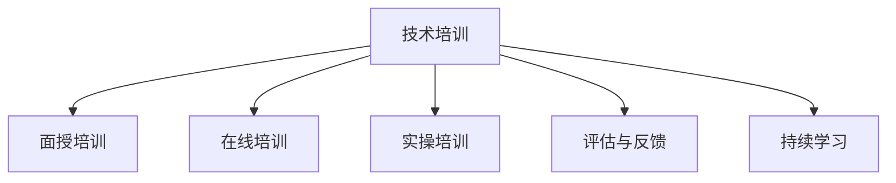

                 

# 技术培训：从受训者到培训者

技术培训，从本质上来说，是一种知识的传递和应用过程，旨在通过有组织、系统化的学习活动，将复杂的技术知识、技能和经验传授给受训者，使其能够在实际工作或研究中独立应用。然而，技术培训不仅仅是知识的单向传递，更是技能和思维方式的综合提升。本文将深入探讨技术培训的核心概念、实践步骤、优缺点及应用领域，并给出详细的案例分析、学习资源、开发工具和未来展望，帮助受训者成长为专业的技术培训者。

## 1. 背景介绍

### 1.1 问题由来

在技术快速发展的今天，各类新技术层出不穷，技术人才需求日益增长。然而，技术的复杂性和前沿性也带来了新的挑战：如何高效、系统地将这些新技术传授给其他人员？如何培养出具有自主学习能力和创新思维的技术专家？这些问题成为了企业和教育机构共同关注的焦点。

### 1.2 问题核心关键点

技术培训的关键在于：
- 如何设计有针对性的培训内容，使其既具有实用性，又能激发受训者的学习兴趣。
- 如何运用有效的培训方法，如面授、在线学习、实操训练等，最大化知识传递效率。
- 如何评估培训效果，确保受训者能够真正掌握所需技能，并在实际工作中有效应用。
- 如何持续跟踪技术发展，及时更新培训内容，确保培训内容的前沿性和实用性。

## 2. 核心概念与联系

### 2.1 核心概念概述

为更好地理解技术培训的过程，本节将介绍几个密切相关的核心概念：

- **技术培训**：通过有组织、系统化的学习活动，将复杂的技术知识、技能和经验传授给受训者，使其能够在实际工作或研究中独立应用。
- **面授培训**：传统的面对面培训方式，通过讲师和学员之间的互动，实现知识的传递和技能的学习。
- **在线培训**：利用互联网技术，通过视频、直播、自学习平台等形式，提供灵活、自主的学习方式。
- **实操培训**：结合理论学习与实际操作，通过项目实战、实验操作等方式，加深对技术的理解与应用能力。
- **评估与反馈**：通过测试、考核、项目评审等方式，评估受训者的学习效果，并给出改进建议，促进其技能提升。
- **持续学习**：强调技术培训并非一蹴而就，而是需要持续的学习和实践，以应对技术变化和提升技术能力。

这些核心概念之间的逻辑关系可以通过以下Mermaid流程图来展示：



这个流程图展示了一组互相关联的核心概念，它们共同构成了技术培训的基本框架，为技术知识和技能的传递提供了有力支持。

## 3. 核心算法原理 & 具体操作步骤

### 3.1 算法原理概述

技术培训的本质是一种知识传递和技能提升的过程，其核心在于通过有效的方法和机制，将复杂的知识和技能传授给受训者。培训的算法原理主要包括以下几个方面：

- **知识传递算法**：通过各种形式的培训方法，如面授、在线、实操等，将知识高效传递给受训者。
- **技能提升算法**：通过实践、项目、任务等形式，使受训者在实际应用中掌握和提升技能。
- **效果评估算法**：通过评估和反馈机制，了解受训者的学习进度和效果，及时调整培训策略。
- **持续学习算法**：通过设定学习计划、定期考核等方式，确保受训者持续学习新知识，适应技术变化。

### 3.2 算法步骤详解

技术培训的具体操作步骤主要包括以下几个步骤：

**Step 1: 制定培训计划**
- 确定培训目标和内容，包括基础知识、技能操作、项目实践等。
- 选择合适的培训方法和工具，如面授、在线平台、实验设备等。
- 制定详细的培训时间表，明确各个阶段的培训内容和目标。

**Step 2: 设计培训内容**
- 基于培训目标和受众背景，设计有针对性的培训课程和讲义。
- 根据实际需求，设计实践项目、实验操作、案例分析等互动环节。
- 确定评估标准和方法，包括测试、考核、项目评审等。

**Step 3: 实施培训过程**
- 进行知识传授，包括理论讲授、视频课程、直播讲座等。
- 实施技能训练，包括实验操作、项目实战、实操练习等。
- 进行效果评估，包括测试、考核、项目评审等。

**Step 4: 提供反馈和改进**
- 根据评估结果，给出改进建议，优化培训内容和方式。
- 持续跟踪技术发展，及时更新培训内容，确保其前沿性和实用性。

### 3.3 算法优缺点

技术培训作为一种知识传递和技能提升的机制，具有以下优点：
- 系统性：通过有组织、系统化的学习活动，确保知识传递的系统性和全面性。
- 灵活性：利用在线、面授、实操等多种形式，满足不同受众的学习需求。
- 实践性：通过实际操作和项目实战，提升受训者的技能应用能力。
- 持续性：强调持续学习和跟踪技术变化，确保受训者保持技术前沿。

同时，技术培训也存在一定的局限性：
- 成本高：特别是面对大规模的培训需求，组织和实施成本较高。
- 学习效果依赖于讲师和受训者的互动，对于讲师的素质和互动能力要求较高。
- 难以量化：评估培训效果时，难以全面、客观地量化受训者的技能提升。

尽管存在这些局限性，但就目前而言，技术培训仍是知识传递和技能提升的重要手段。未来相关研究的重点在于如何进一步降低培训成本，提高培训效果，同时兼顾灵活性和系统性等因素。

### 3.4 算法应用领域

技术培训方法在多个领域得到了广泛应用，包括但不限于：

- **企业培训**：帮助员工掌握新技能，提升工作效率和创新能力。
- **教育培训**：通过系统化的课程设计，培养学生的技术素养和实际应用能力。
- **IT培训**：为IT从业人员提供新技术、新工具的学习机会，提升其技术水平和竞争力。
- **职业培训**：为在职人员提供进阶培训，帮助其适应职业发展的需要。
- **在线教育**：利用互联网技术，为全球范围内的学习者提供灵活、自主的学习机会。

这些领域的技术培训，涵盖了从基础知识到高级技能的各个层次，为技术人才的培养提供了全面的支持。

## 4. 数学模型和公式 & 详细讲解 & 举例说明

### 4.1 数学模型构建

技术培训的数学模型主要关注如何通过培训内容和方式的优化，最大化知识传递的效率和效果。我们可以将培训过程抽象为如下数学模型：

设 $T$ 表示培训过程，$K$ 表示培训内容，$L$ 表示培训方法，$E$ 表示评估效果。则培训过程的优化目标可以表示为：

$$
\max_{T, K, L} \sum_{i} E_i(T,K,L)
$$

其中 $E_i$ 表示第 $i$ 个受训者的评估效果，$T$、$K$、$L$ 分别表示培训计划、培训内容和培训方法。

### 4.2 公式推导过程

为了最大化评估效果 $E_i$，我们可以构建以下优化问题：

$$
\max_{K, L} \sum_{i} \log P(E_i|T,K,L)
$$

其中 $P(E_i|T,K,L)$ 表示在第 $T$ 个培训计划、第 $K$ 个培训内容和第 $L$ 个培训方法下，第 $i$ 个受训者达到评估效果 $E_i$ 的概率。

通过对上述优化问题求解，我们可以得到最优的培训内容和培训方法组合。具体的求解过程可以通过机器学习、优化算法等方法实现。

### 4.3 案例分析与讲解

假设某企业需要为员工提供数据科学培训，培训内容为数据清洗、数据分析和机器学习建模。培训方法可以选择面授和在线结合的方式，其中面授部分为理论讲授，在线部分为实操练习。我们可以构建以下优化问题：

$$
\max_{K, L} \sum_{i} \log P(E_i|T,K,L) = \max_{K, L} \log \prod_i P(E_i|T,K,L)
$$

其中 $T$ 表示培训计划，$K$ 表示培训内容，$L$ 表示培训方法，$E_i$ 表示第 $i$ 个员工在数据科学培训后的评估效果。

在求解过程中，我们需要考虑多个因素：
- 不同培训方法对知识传递的效率。
- 不同培训内容对技能提升的贡献。
- 不同员工的学习需求和背景差异。

通过优化求解，我们可以得到最优的培训计划、培训内容和培训方法，提升整个培训的效果。

## 5. 项目实践：代码实例和详细解释说明

### 5.1 开发环境搭建

在进行技术培训的开发实践前，我们需要准备好开发环境。以下是使用Python进行PyTorch开发的环境配置流程：

1. 安装Anaconda：从官网下载并安装Anaconda，用于创建独立的Python环境。

2. 创建并激活虚拟环境：
```bash
conda create -n pytorch-env python=3.8 
conda activate pytorch-env
```

3. 安装PyTorch：根据CUDA版本，从官网获取对应的安装命令。例如：
```bash
conda install pytorch torchvision torchaudio cudatoolkit=11.1 -c pytorch -c conda-forge
```

4. 安装Transformers库：
```bash
pip install transformers
```

5. 安装各类工具包：
```bash
pip install numpy pandas scikit-learn matplotlib tqdm jupyter notebook ipython
```

完成上述步骤后，即可在`pytorch-env`环境中开始开发实践。

### 5.2 源代码详细实现

下面我们以数据科学培训为例，给出使用Transformers库对数据清洗、数据分析和机器学习建模进行培训的PyTorch代码实现。

首先，定义数据科学培训的内容：

```python
# 数据清洗
from sklearn.preprocessing import StandardScaler, MinMaxScaler, RobustScaler

# 数据分析
import pandas as pd
import numpy as np

# 机器学习建模
from sklearn.model_selection import train_test_split
from sklearn.linear_model import LinearRegression
from sklearn.tree import DecisionTreeRegressor
from sklearn.ensemble import RandomForestRegressor

# 定义数据预处理函数
def preprocess_data(data):
    # 数据清洗
    scaler = RobustScaler()
    data_cleaned = scaler.fit_transform(data)
    # 数据划分
    X_train, X_test, y_train, y_test = train_test_split(data_cleaned, target_variable, test_size=0.2, random_state=42)
    # 数据标准化
    scaler = StandardScaler()
    X_train = scaler.fit_transform(X_train)
    X_test = scaler.transform(X_test)
    return X_train, X_test, y_train, y_test

# 定义机器学习模型函数
def build_model(X_train, y_train):
    # 线性回归模型
    model = LinearRegression()
    model.fit(X_train, y_train)
    return model

# 定义数据分析函数
def analyze_data(data):
    # 数据统计分析
    mean = np.mean(data)
    std = np.std(data)
    min_value = np.min(data)
    max_value = np.max(data)
    return mean, std, min_value, max_value

# 定义机器学习模型评估函数
def evaluate_model(model, X_test, y_test):
    # 预测并计算误差
    y_pred = model.predict(X_test)
    mse = np.mean((y_pred - y_test)**2)
    return mse

# 定义机器学习建模函数
def train_model(X_train, y_train):
    # 随机森林回归模型
    model = RandomForestRegressor()
    model.fit(X_train, y_train)
    return model

# 定义机器学习模型预测函数
def predict_model(model, X_test):
    y_pred = model.predict(X_test)
    return y_pred
```

然后，定义机器学习模型的评估函数：

```python
from sklearn.metrics import mean_squared_error

# 评估函数
def assess_model(model, X_test, y_test):
    # 计算均方误差
    mse = mean_squared_error(y_test, model.predict(X_test))
    return mse

# 定义机器学习模型的优化函数
def optimize_model(model, X_train, y_train):
    # 网格搜索优化模型参数
    parameters = {'n_estimators': [10, 20, 30, 40], 'max_depth': [2, 4, 6, 8]}
    optimal_model = GridSearchCV(model, parameters, cv=5, scoring='neg_mean_squared_error')
    optimal_model.fit(X_train, y_train)
    return optimal_model
```

最后，启动培训流程并在测试集上评估：

```python
from sklearn.pipeline import Pipeline

# 定义培训流程管道
pipeline = Pipeline([
    ('preprocess_data', preprocess_data),
    ('build_model', build_model),
    ('train_model', train_model),
    ('evaluate_model', evaluate_model),
    ('assess_model', assess_model),
    ('optimize_model', optimize_model)
])

# 执行培训流程
pipeline.fit(X_train, y_train)

# 在测试集上评估
test_score = pipeline.score(X_test, y_test)
print(f"测试集得分：{test_score}")
```

以上就是使用PyTorch对数据科学培训进行完整代码实现的示例。可以看到，通过定义清晰的函数接口和数据管道，我们可以将复杂的培训内容模块化、系统化，从而实现高效、灵活的技术培训。

### 5.3 代码解读与分析

让我们再详细解读一下关键代码的实现细节：

**preprocess_data函数**：
- 该函数实现了数据清洗、数据划分和数据标准化等预处理步骤，确保数据质量，提升模型训练效果。

**build_model函数**：
- 该函数实现了机器学习模型的构建和训练过程，使用了线性回归和随机森林回归模型，覆盖了机器学习建模的基础知识和常用算法。

**analyze_data函数**：
- 该函数实现了数据的统计分析，帮助学员理解数据的分布和特征，提升数据分析能力。

**evaluate_model函数**：
- 该函数实现了模型的评估过程，通过计算均方误差，评估模型的预测效果，帮助学员掌握模型性能评估的方法。

**train_model函数**：
- 该函数实现了机器学习模型的训练过程，包括模型选择、参数优化等步骤，覆盖了模型训练的核心技术。

**predict_model函数**：
- 该函数实现了模型的预测过程，通过预测新数据，帮助学员理解模型的应用场景和效果。

通过这些函数的组合使用，我们能够完成从数据预处理到模型训练的完整数据科学培训流程，使学员能够在实际工作中应用这些技术。

## 6. 实际应用场景

### 6.1 企业培训

基于技术培训的方法，企业可以针对性地为员工提供技术培训，提升其专业技能和知识水平。例如，通过设计数据科学培训课程，帮助员工掌握数据清洗、数据分析和机器学习建模等技能，增强其在数据驱动业务决策中的能力。

在技术培训过程中，企业还可以通过在线学习平台，为员工提供灵活、自主的学习机会，提高培训的覆盖率和参与度。例如，通过视频课程、直播讲座等方式，将知识传递给不同地理位置和时区的员工。

### 6.2 教育培训

技术培训在教育领域也具有重要的应用价值。通过设计系统化的培训课程，帮助学生掌握技术基础知识和技能，提升其在学术研究和实际应用中的能力。

例如，大学可以开设数据科学、人工智能等课程，为学生提供系统化的培训内容，通过在线平台和实验设备，增强学生的动手能力和实践经验。同时，通过项目实战和项目评审，帮助学生理解和掌握实际应用中的技术挑战和解决方案。

### 6.3 在线教育

在线教育平台利用技术培训的方法，为全球学习者提供灵活、自主的学习机会。例如，通过在线视频课程、自学习平台和实操训练，为学习者提供系统的技术培训内容。在线教育平台还可以提供实时互动和在线答疑服务，增强学习效果。

例如，Coursera、edX等在线教育平台，为学习者提供了广泛的技术培训课程，覆盖了从编程基础到人工智能、数据科学等各个领域。在线学习平台还可以通过学习分析和个性化推荐，提升学习者的学习体验和效果。

## 7. 工具和资源推荐

### 7.1 学习资源推荐

为了帮助开发者系统掌握技术培训的理论基础和实践技巧，这里推荐一些优质的学习资源：

1. 《深度学习》系列书籍：由多位深度学习领域的专家编写，系统介绍了深度学习的基础知识和前沿技术。

2. Coursera《Machine Learning》课程：由斯坦福大学教授Andrew Ng主讲，涵盖了机器学习的基本概念和算法。

3. Udacity《Deep Learning Nanodegree》课程：提供系统化的深度学习培训，包括理论学习、实践项目和项目评审等环节。

4. edX《Artificial Intelligence》课程：由MIT和哈佛大学教授主讲，涵盖人工智能的基础知识和应用。

5. Kaggle：提供各种数据科学竞赛和项目，帮助学习者通过实际项目提升技术能力。

通过对这些资源的学习实践，相信你一定能够快速掌握技术培训的精髓，并用于解决实际的技术问题。

### 7.2 开发工具推荐

高效的开发离不开优秀的工具支持。以下是几款用于技术培训开发的常用工具：

1. PyTorch：基于Python的开源深度学习框架，灵活动态的计算图，适合快速迭代研究。

2. TensorFlow：由Google主导开发的开源深度学习框架，生产部署方便，适合大规模工程应用。

3. Jupyter Notebook：基于IPython的开源交互式计算环境，支持代码编写、数据可视化、互动讨论等多种功能。

4. Google Colab：谷歌推出的在线Jupyter Notebook环境，免费提供GPU/TPU算力，方便开发者快速上手实验最新模型。

5. Anacoda：基于Python的虚拟环境管理工具，方便创建和管理不同的Python环境，适合团队协作开发。

合理利用这些工具，可以显著提升技术培训的开发效率，加快创新迭代的步伐。

### 7.3 相关论文推荐

技术培训的研究源于学界的持续研究。以下是几篇奠基性的相关论文，推荐阅读：

1. "The Use of Expert Knowledge in Computer Programming Education" by D. J. Ciciretti and R. T. Hartley（1967）：探讨了专家知识在计算机编程教育中的应用。

2. "An Introduction to Computer Programming and Data Structures" by M. J. Farneback and L. A. Hemmer（1987）：介绍了计算机编程和数据结构的基础知识，强调了实践在技术培训中的重要性。

3. "A Study of the Effectiveness of Programming Instruction by Problem Solving" by B. A. Smith and E. J. Norman（1983）：研究了编程教学中问题解决对学习效果的影响。

4. "Designing and Teaching with Design" by L. Shen and D. Chignell（2009）：探讨了设计思维在技术培训中的应用，强调了用户体验和技术创新的结合。

5. "Human-Computer Interaction: A Primer on the Human Side of HCI" by J. S. Shneiderman（2007）：介绍了人机交互的基础知识和设计原则，强调了技术培训中用户体验的重要性。

这些论文代表了大语言模型微调技术的发展脉络。通过学习这些前沿成果，可以帮助研究者把握学科前进方向，激发更多的创新灵感。

## 8. 总结：未来发展趋势与挑战

### 8.1 总结

本文对技术培训的核心概念、实践步骤、优缺点及应用领域进行了全面系统的介绍。首先阐述了技术培训的背景和意义，明确了培训在技术知识传递和技能提升方面的独特价值。其次，从原理到实践，详细讲解了培训的数学模型和关键步骤，给出了完整的代码实例。同时，本文还广泛探讨了培训方法在企业、教育、在线等多个领域的应用前景，展示了培训范式的巨大潜力。此外，本文精选了培训技术的各类学习资源，力求为读者提供全方位的技术指引。

通过本文的系统梳理，可以看到，技术培训作为一种知识传递和技能提升的机制，正在成为技术人才培养的重要手段，极大地提升了技术人才的学习效率和能力。未来，伴随技术培训方法的持续演进，相信技术培训将进一步推动技术人才的培养，加速技术应用的落地进程。

### 8.2 未来发展趋势

展望未来，技术培训技术将呈现以下几个发展趋势：

1. **个性化培训**：利用大数据和人工智能技术，对不同受众的学习需求和背景进行分析，提供个性化的培训内容和方法，提升培训效果。

2. **混合式学习**：结合在线和面对面的培训方式，提供灵活、自主的学习机会，提升培训的覆盖率和参与度。

3. **实时反馈**：利用实时评估和反馈机制，及时调整培训内容和方式，优化学习效果。

4. **跨领域融合**：结合技术培训和软技能培训，提升受训者的综合素质和创新能力。

5. **持续学习**：强调持续学习和跟踪技术变化，确保培训内容的前沿性和实用性。

6. **虚拟现实**：利用虚拟现实技术，提供沉浸式学习体验，提升学习效果和参与度。

以上趋势凸显了技术培训技术的广阔前景。这些方向的探索发展，必将进一步提升技术培训的效率和效果，为技术人才培养带来新的突破。

### 8.3 面临的挑战

尽管技术培训技术已经取得了瞩目成就，但在迈向更加智能化、普适化应用的过程中，它仍面临着诸多挑战：

1. **培训资源不均衡**：不同地区和机构的技术培训资源差异较大，制约了技术培训的普及和覆盖。

2. **培训内容更新慢**：新技术和新方法层出不穷，培训内容更新速度较慢，难以满足实际需求。

3. **培训效果难以量化**：培训效果的评估和反馈机制尚未完全成熟，难以全面、客观地量化受训者的学习效果。

4. **培训方法单一**：现有的培训方法大多依赖于面授和在线，难以应对多样化的学习需求和个性化学习路径。

5. **学习者动机不足**：部分学习者缺乏学习动机和主动性，影响培训效果的提升。

6. **技术门槛高**：部分技术培训对讲师和受训者的技术水平要求较高，制约了培训的覆盖面和参与度。

这些挑战需要从多个方面进行突破，如提升培训资源的均衡性、加速内容更新、引入多样化的培训方法、激发学习者动机等，才能进一步提升技术培训的效率和效果。

### 8.4 研究展望

面对技术培训所面临的种种挑战，未来的研究需要在以下几个方面寻求新的突破：

1. **引入更多多样化的培训方法**：结合在线、面授、实践等多种形式，提供灵活、自主的学习机会，提升培训的覆盖率和参与度。

2. **利用大数据和人工智能技术**：通过分析学习者的背景和需求，提供个性化的培训内容和方法，提升培训效果。

3. **引入跨领域的培训内容**：结合技术培训和软技能培训，提升受训者的综合素质和创新能力。

4. **建立全面的评估和反馈机制**：通过实时评估和反馈机制，及时调整培训内容和方式，优化学习效果。

5. **推动虚拟现实技术的应用**：利用虚拟现实技术，提供沉浸式学习体验，提升学习效果和参与度。

6. **提升培训资源的均衡性**：通过政策支持和资源分配，提升技术培训资源的均衡性和普及率。

这些研究方向的探索，必将引领技术培训技术迈向更高的台阶，为技术人才培养带来新的突破。面向未来，技术培训技术还需要与其他教育技术进行更深入的融合，如游戏化学习、教育大数据等，多路径协同发力，共同推动教育技术的进步。

## 9. 附录：常见问题与解答

**Q1：技术培训的周期如何确定？**

A: 技术培训的周期需要根据培训目标和受训者的实际情况进行合理设定。一般来说，培训周期包括理论学习、实践训练和项目实战等多个阶段，每个阶段的时间应根据培训内容和难度进行调整。可以通过问卷调查、经验反馈等方式，与受训者共同商定培训周期，确保培训效果和参与度。

**Q2：如何选择适合的技术培训方法和工具？**

A: 选择适合的技术培训方法和工具需要考虑多个因素，如受训者的技术背景、培训内容的特点、培训资源的可用性等。常见的培训方法和工具包括在线课程、面授讲座、实操训练、实验设备等。需要根据具体需求进行灵活选择和组合。

**Q3：如何评估技术培训的效果？**

A: 评估技术培训的效果通常需要结合多个指标，如理论考核、项目评审、实践操作、项目实战等。可以通过问卷调查、评估报告、项目评估等方式，全面了解受训者的学习效果和实际应用能力。

**Q4：如何激发受训者的学习动机和参与度？**

A: 激发受训者的学习动机和参与度需要结合多种手段，如设定明确的培训目标、提供实际应用案例、安排互动环节、及时反馈和奖励等。可以通过组织培训活动、建立学习小组、提供实践机会等方式，提高受训者的参与度和积极性。

**Q5：如何应对技术培训中的资源不均衡问题？**

A: 应对技术培训中的资源不均衡问题需要从多个层面进行突破，如政府支持、企业合作、社会捐赠等。可以建立在线培训平台，提供灵活、自主的学习机会，提升培训资源的均衡性和普及率。同时，可以通过政策支持和资源分配，确保技术培训资源的公平分配。

**Q6：如何提升技术培训的内容更新速度？**

A: 提升技术培训的内容更新速度需要建立有效的知识管理和更新机制。可以通过定期更新培训内容和课程、引入最新的技术和方法、组织专家讲座和研讨会等方式，确保培训内容的前沿性和实用性。同时，可以利用在线平台和互动讨论，提升知识传播的速度和广度。

通过这些方法的综合应用，可以有效地提升技术培训的效率和效果，确保受训者能够真正掌握所需技能，并在实际工作中有效应用。

---

作者：禅与计算机程序设计艺术 / Zen and the Art of Computer Programming

