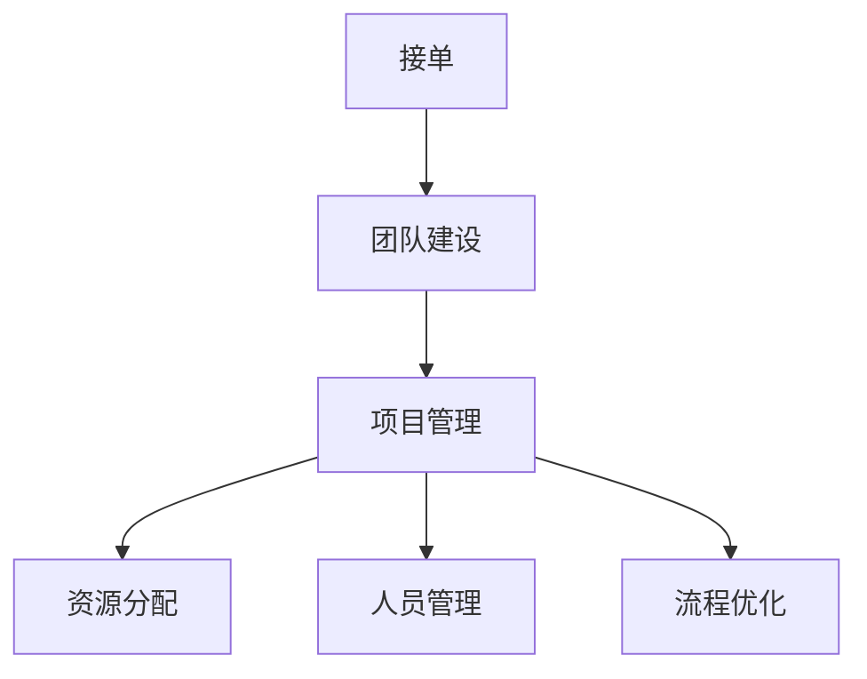

                 

# 技术外包：从接单到建立团队

> 关键词：技术外包, 接单, 团队建设, 项目管理, 资源分配, 人员管理, 流程优化

## 1. 背景介绍

### 1.1 问题由来

在现代科技飞速发展的背景下，越来越多的企业选择将非核心业务外包给专业的技术团队，专注于自身的核心竞争力。这一趋势不仅在跨国公司中普遍存在，也在中小型企业中悄然兴起。技术外包服务因其高效、专业、成本低等优势，成为许多企业的重要选择。

### 1.2 问题核心关键点

技术外包服务的主要核心关键点包括以下几个方面：

- 接单：选择合适的技术外包服务，确保其具备所需的技术能力和项目经验。
- 团队建设：组建一个高效、稳定的技术团队，满足项目的长期需求。
- 项目管理：运用合适的项目管理方法，确保项目按时、按质、按预算完成。
- 资源分配：合理分配项目资源，包括时间、人员、资金等。
- 人员管理：有效管理团队成员，提升团队凝聚力和工作效率。
- 流程优化：不断优化工作流程，提高项目执行效率和质量。

这些关键点共同构成了一个技术外包服务的高效运作体系，需要企业在接单、团队建设、项目管理、资源分配、人员管理和流程优化等方面进行系统化的考虑和执行。

### 1.3 问题研究意义

技术外包服务的研究意义主要体现在以下几个方面：

1. **提升企业效率**：外包非核心业务，让企业可以将更多精力专注于核心业务，提升整体运营效率。
2. **降低成本**：通过外包，企业可以降低人力、设备、办公空间等资源的成本，提高资金利用效率。
3. **获取专业能力**：外包服务通常由专业的技术团队提供，能够带来先进的技术和管理经验。
4. **灵活应对市场变化**：外包团队可以根据市场需求快速调整工作重心，灵活应对市场变化。
5. **风险分摊**：外包服务将部分项目风险分摊给专业团队，降低企业运营风险。

理解这些关键点和研究意义，有助于企业更好地利用技术外包服务，提升自身竞争力。

## 2. 核心概念与联系

### 2.1 核心概念概述

为更好地理解技术外包服务，本文将介绍几个核心概念及其联系：

- **技术外包**：指企业将部分技术项目或业务外包给专业的第三方技术团队进行实施。
- **接单**：指企业选择和评估外包服务商的过程，决定哪些项目需要外包，并选择合适的团队。
- **团队建设**：指组建、管理和发展技术团队的过程，确保团队能够高效完成项目。
- **项目管理**：指规划、执行和控制项目的全过程，确保项目按时、按质、按预算完成。
- **资源分配**：指在项目执行过程中，合理分配项目所需的时间、人员、资金等资源。
- **人员管理**：指管理技术团队成员，提升团队协作和效率。
- **流程优化**：指持续优化工作流程，提高项目执行效率和质量。

这些概念之间的逻辑关系可以通过以下Mermaid流程图来展示：



这个流程图展示了技术外包服务的关键环节及其相互关系：

1. 接单是选择合适外包团队的前提。
2. 团队建设是保证项目顺利执行的基础。
3. 项目管理是控制项目进度和质量的核心。
4. 资源分配是合理利用资源的保障。
5. 人员管理是提升团队协作和效率的关键。
6. 流程优化是持续提升项目执行效率的手段。

## 3. 核心算法原理 & 具体操作步骤

### 3.1 算法原理概述

技术外包服务的核心算法原理主要围绕以下几个方面：

- **接单评估**：通过评分系统评估外包服务商的技术能力、项目经验和客户评价，选择合适的团队。
- **项目管理**：运用敏捷开发、Scrum、Kanban等项目管理方法，确保项目按时、按质、按预算完成。
- **资源分配**：使用资源规划和优化算法，合理分配项目资源，确保项目顺利进行。
- **人员管理**：采用OKR、KPI等绩效管理工具，提升团队成员的工作积极性和效率。
- **流程优化**：使用流程改进工具和方法，持续优化工作流程，提升项目执行效率。

### 3.2 算法步骤详解

**接单评估算法**：

1. **收集信息**：收集外包服务商的技术能力、项目经验、客户评价等信息。
2. **评分系统设计**：设计评分系统，包含技术能力、项目经验、客户评价等多个维度。
3. **评分计算**：根据评分系统的定义，计算每个服务商的综合得分。
4. **选择团队**：根据评分结果，选择最优的外包团队。

**项目管理算法**：

1. **项目规划**：定义项目的目标、范围、时间和资源。
2. **任务分解**：将项目分解为多个子任务，分配到不同团队成员。
3. **进度跟踪**：使用Scrum或Kanban等项目管理工具，跟踪任务进展。
4. **风险管理**：识别项目风险，制定应对策略，确保项目顺利进行。

**资源分配算法**：

1. **资源需求分析**：分析项目所需的时间、人员、资金等资源。
2. **资源规划**：根据项目需求和可用资源，制定资源分配计划。
3. **资源调整**：根据项目进展和资源使用情况，动态调整资源分配。

**人员管理算法**：

1. **绩效评估**：使用OKR或KPI等工具，评估团队成员的工作表现。
2. **激励机制**：根据绩效评估结果，设计激励机制，提升团队积极性。
3. **团队培训**：定期组织团队培训，提升团队技能和知识。

**流程优化算法**：

1. **流程分析**：分析项目执行过程中的工作流程。
2. **流程改进**：识别流程瓶颈，设计改进方案。
3. **流程执行**：实施改进方案，提升流程效率。
4. **持续优化**：定期评估流程效果，持续改进。

### 3.3 算法优缺点

技术外包服务的算法优点主要体现在以下几个方面：

- **效率高**：通过外包专业团队，企业可以快速获取所需技术，缩短项目开发周期。
- **专业性强**：外包服务商通常具备丰富经验和专业技能，能提供高质量的解决方案。
- **成本低**：外包服务通常按项目收费，相比雇佣全职团队，成本较低。
- **灵活性强**：外包团队可以根据项目需求灵活调整资源，快速应对市场变化。

然而，技术外包服务也存在一些缺点：

- **沟通难度大**：外包团队与企业之间的沟通可能存在障碍，影响项目进展。
- **控制难度大**：外包团队的工作过程难以完全掌控，可能导致质量问题。
- **信任风险**：外包团队的专业性和诚信度可能存在风险，需要严格评估和监控。
- **资源依赖高**：企业对外包团队的依赖度高，一旦出现问题，可能影响项目进度。

### 3.4 算法应用领域

技术外包服务的应用领域非常广泛，包括但不限于以下方面：

- **软件开发**：外包软件开发项目，包括应用开发、系统集成等。
- **数据分析**：外包数据分析项目，包括数据清洗、数据挖掘、数据分析等。
- **测试和质量保证**：外包软件测试和质量保证项目，确保软件质量。
- **云计算服务**：外包云计算服务项目，包括云架构设计、云资源管理等。
- **安全保障**：外包网络安全项目，包括安全评估、漏洞修复、应急响应等。
- **用户体验设计**：外包用户体验设计项目，提升产品用户满意度。

除了上述应用领域，技术外包服务还可以应用于任何需要专业技术和资源的项目，为企业的技术需求提供解决方案。

## 4. 数学模型和公式 & 详细讲解 & 举例说明

### 4.1 数学模型构建

本节将使用数学语言对技术外包服务的接单和项目管理进行更加严格的刻画。

假设企业需要外包一个软件项目，涉及的任务为 $T$，外包服务商的数量为 $n$，每个服务商的综合得分为 $s_i$。

定义接单评分系统为 $Scoring System=\{W_1,W_2,W_3,\ldots,W_k\}$，其中 $W_j$ 表示第 $j$ 个维度的权重，$w_j>0$ 且 $\sum_{j=1}^k w_j=1$。

接单评分系统的计算公式为：

$$
s_i = \sum_{j=1}^k w_j S_{i,j}
$$

其中 $S_{i,j}$ 表示服务商 $i$ 在第 $j$ 个维度上的得分。

在项目管理的流程优化中，假设项目 $T$ 有 $m$ 个任务，每个任务 $t$ 的完成时间 $t_k$ 和成本 $c_k$ 已知，资源总数为 $R$。

定义任务时间坐标序列为 $t_k=(k=1,2,\ldots,m)$，任务成本序列为 $c_k=(k=1,2,\ldots,m)$。

定义资源需求序列为 $r_k=(k=1,2,\ldots,m)$，资源分配策略为 $a_k=(k=1,2,\ldots,m)$，其中 $a_k\in[0,1]$ 表示任务 $k$ 使用的资源比例。

资源分配的优化目标为：

$$
\min_{a_k} \sum_{k=1}^m c_k a_k
$$

满足约束条件：

$$
\sum_{k=1}^m r_k a_k \leq R
$$

上述模型即为资源分配问题的数学模型。

### 4.2 公式推导过程

以下我们以资源分配问题为例，推导其优化模型和求解方法。

假设任务 $t$ 的完成时间和成本已知，资源需求和总资源约束如下：

- 任务时间坐标序列为 $t_k=(k=1,2,\ldots,m)$。
- 任务成本序列为 $c_k=(k=1,2,\ldots,m)$。
- 资源需求序列为 $r_k=(k=1,2,\ldots,m)$。
- 资源总数为 $R$。

资源分配问题的目标是最小化总成本，满足资源约束：

$$
\min_{a_k} \sum_{k=1}^m c_k a_k
$$

满足约束条件：

$$
\sum_{k=1}^m r_k a_k \leq R
$$

将资源需求和总资源约束代入目标函数，得：

$$
\min_{a_k} \sum_{k=1}^m c_k a_k \quad \text{subject to} \quad \sum_{k=1}^m r_k a_k \leq R
$$

这是一个典型的线性规划问题。使用单纯形法等线性规划求解算法，可以找到最优解 $a_k^*$，使得总成本最小，资源需求满足。

### 4.3 案例分析与讲解

以软件开发项目为例，解释资源分配的优化过程：

假设某企业需要将一个软件开发项目外包给5个服务商，项目涉及的任务为10个。每个任务的时间坐标和成本已知，资源总数为1000小时。

使用线性规划求解器，可以得到最优的资源分配方案 $a_k^*$，使得总成本最小，资源需求满足。例如：

- 任务1和任务2分别分配300小时和200小时，任务3和任务4分别分配400小时和100小时，其余任务根据具体情况分配。
- 最终总成本为 $c_1 a_{1}^* + c_2 a_{2}^* + \ldots + c_{10} a_{10}^* = 5000$。

在实际操作中，资源分配需要考虑任务的优先级、服务商的熟练度等因素，通过调整权重和优化算法，可以得到更合理的资源分配方案。

## 5. 项目实践：代码实例和详细解释说明

### 5.1 开发环境搭建

在进行技术外包服务项目实践前，我们需要准备好开发环境。以下是使用Python进行接单和项目管理的环境配置流程：

1. 安装Anaconda：从官网下载并安装Anaconda，用于创建独立的Python环境。

2. 创建并激活虚拟环境：
```bash
conda create -n project-env python=3.8 
conda activate project-env
```

3. 安装PyTorch：根据CUDA版本，从官网获取对应的安装命令。例如：
```bash
conda install pytorch torchvision torchaudio cudatoolkit=11.1 -c pytorch -c conda-forge
```

4. 安装Pandas、Numpy等数据分析工具：
```bash
pip install pandas numpy matplotlib scikit-learn
```

5. 安装项目管理工具如ScrumPy：
```bash
pip install scrumpy
```

完成上述步骤后，即可在`project-env`环境中开始接单和项目管理实践。

### 5.2 源代码详细实现

下面我们以软件开发项目为例，给出使用ScrumPy进行项目管理以及优化资源分配的PyTorch代码实现。

首先，定义项目和任务的基本信息：

```python
import pandas as pd

# 定义项目任务信息
tasks = pd.DataFrame({
    'task_id': [1, 2, 3, 4, 5, 6, 7, 8, 9, 10],
    'name': ['任务1', '任务2', '任务3', '任务4', '任务5', '任务6', '任务7', '任务8', '任务9', '任务10'],
    'start_time': [1, 2, 3, 4, 5, 6, 7, 8, 9, 10],
    'end_time': [5, 6, 7, 8, 9, 10, 11, 12, 13, 14],
    'cost': [500, 700, 800, 900, 1000, 1100, 1200, 1300, 1400, 1500],
    'resource': [200, 300, 400, 500, 600, 700, 800, 900, 1000, 1100]
})
```

然后，定义项目的时间坐标序列和资源需求序列：

```python
# 定义任务时间坐标序列
time_series = pd.DataFrame({
    'time': [i for i in range(1, 15)],
    'task': tasks['task_id']
})

# 定义资源需求序列
resource_series = pd.DataFrame({
    'time': [i for i in range(1, 15)],
    'task': tasks['task_id'],
    'resource': tasks['resource']
})
```

接着，使用ScrumPy进行资源分配和优化：

```python
from scrumpy import ResourcePlanning

# 创建资源规划对象
rp = ResourcePlanning(time_series, resource_series)

# 优化资源分配
solution = rp.optimize()

# 输出优化结果
print(solution)
```

以上代码实现了使用ScrumPy进行项目资源的优化分配。通过ScrumPy的线性规划算法，可以找到最优的资源分配方案，最小化项目总成本，满足资源约束。

### 5.3 代码解读与分析

让我们再详细解读一下关键代码的实现细节：

**定义项目任务信息**：
- 使用Pandas库创建任务信息DataFrame，包含任务ID、名称、开始时间、结束时间、成本和资源需求。

**定义时间坐标序列和资源需求序列**：
- 使用Pandas库创建时间坐标序列和资源需求序列DataFrame，用于描述任务时间坐标和资源需求。

**创建资源规划对象**：
- 使用ScrumPy库创建资源规划对象，传入时间坐标序列和资源需求序列。

**优化资源分配**：
- 使用optimize()方法进行资源分配的优化，返回最优解。

**输出优化结果**：
- 输出优化后的资源分配方案，包含任务ID、起始时间、结束时间、使用资源量等信息。

可以看到，ScrumPy的资源规划算法非常直观和易于使用，只需简单几行代码，即可得到最优的资源分配方案。

## 6. 实际应用场景

### 6.1 软件开发外包

软件开发外包是技术外包服务的一个重要领域。通过外包软件开发项目，企业可以快速获取高质量的软件解决方案，缩短产品上市时间，提升竞争力。

例如，某公司需要开发一款新型的电商平台，可以选择将部分开发任务外包给专业的技术团队，如UI设计、后端开发、数据库设计等。外包团队可以根据需求快速响应，提供高质量的软件开发服务，同时企业也可以将更多精力投入到市场推广和运营中。

### 6.2 数据分析外包

数据分析外包是另一个重要的技术外包服务领域。数据驱动的决策越来越重要，许多企业需要专业的数据分析师进行数据清洗、数据挖掘、数据分析等工作。

例如，某公司需要分析客户购买行为数据，可以选择将数据分析项目外包给专业的数据团队，获取有价值的客户洞察和市场趋势。外包团队可以使用先进的数据分析方法和工具，快速获取分析结果，提供数据支持。

### 6.3 云计算外包

云计算外包是技术外包服务的最新趋势之一。云计算技术在企业的IT架构中应用广泛，许多企业选择将云基础设施建设和云资源管理等任务外包给专业的云服务提供商。

例如，某公司需要构建和管理云架构，可以选择将云计算项目外包给专业的云服务团队。外包团队可以提供云架构设计、云资源管理、云应用部署等服务，帮助企业快速构建和部署云应用，提升IT效率。

### 6.4 未来应用展望

随着技术外包服务的不断成熟，其在更多领域的应用前景广阔。未来，技术外包服务将更加注重客户需求和市场变化，提供更加灵活、高效、专业化的服务。

1. **数字化转型**：技术外包服务将成为企业数字化转型的重要支撑，帮助企业快速实现数字化运营和智能化管理。
2. **全球化合作**：技术外包服务将打破地域限制，实现全球化资源配置和协同开发。
3. **创新驱动**：技术外包服务将推动技术创新和应用落地，帮助企业抢占市场先机。
4. **可持续发展**：技术外包服务将注重可持续发展，推动绿色技术和节能减排。
5. **教育培训**：技术外包服务将推动技术教育培训，培养更多技术人才，促进技术进步。

## 7. 工具和资源推荐

### 7.1 学习资源推荐

为了帮助开发者系统掌握技术外包服务的理论基础和实践技巧，这里推荐一些优质的学习资源：

1. **《软件开发外包：案例分析与实践》**：这本书详细介绍了软件开发外包的案例分析和实际操作方法，是学习软件开发外包的必备参考资料。
2. **《数据分析外包：方法与工具》**：这本书介绍了数据分析外包的方法和工具，涵盖了数据分析的各个环节，是学习数据分析外包的必备资料。
3. **《云计算外包：基础与实践》**：这本书详细介绍了云计算外包的基础知识和实践方法，是学习云计算外包的必备参考资料。
4. **《项目管理和资源分配：理论与实践》**：这本书详细介绍了项目管理和资源分配的理论和实践方法，是学习项目管理和资源分配的必备资料。
5. **Scrum.org**：提供Scrum认证培训和考试，帮助企业建立高效的项目管理团队。
6. **ScrumPy**：提供Scrum框架的实现工具，帮助企业快速构建和管理敏捷项目。

通过对这些资源的学习实践，相信你一定能够快速掌握技术外包服务的精髓，并用于解决实际的NLP问题。

### 7.2 开发工具推荐

高效的开发离不开优秀的工具支持。以下是几款用于技术外包服务开发的常用工具：

1. **Python**：作为技术外包服务的主要开发语言，Python具有丰富的库和工具支持，开发效率高，易于学习。
2. **Pandas**：数据处理和分析的必备工具，可以方便地进行数据清洗、数据挖掘等操作。
3. **ScrumPy**：Scrum框架的实现工具，提供资源规划、项目管理等功能。
4. **JIRA**：项目管理工具，支持敏捷开发和Scrum方法，帮助企业高效管理项目。
5. **Slack**：团队协作工具，支持即时通讯、文件共享等功能，帮助团队高效协作。
6. **Git**：版本控制工具，支持团队协作和代码管理，保证项目代码的准确性和稳定性。

合理利用这些工具，可以显著提升技术外包服务的开发效率，加快创新迭代的步伐。

### 7.3 相关论文推荐

技术外包服务的发展离不开学界的持续研究。以下是几篇奠基性的相关论文，推荐阅读：

1. **《技术外包服务：案例分析与评估》**：论文分析了技术外包服务的案例和评估方法，提出了一套系统的评估框架。
2. **《软件开发外包的挑战与解决方案》**：论文探讨了软件开发外包的挑战和解决方案，提出了一系列有效的管理方法。
3. **《数据分析外包的实践与挑战》**：论文介绍了数据分析外包的实践经验和挑战，提出了一系列有效的项目管理方法。
4. **《云计算外包的趋势与展望》**：论文分析了云计算外包的趋势和展望，提出了一系列创新的技术和方法。
5. **《敏捷开发方法在技术外包中的应用》**：论文探讨了敏捷开发方法在技术外包中的应用，提出了一系列高效的项目管理方法。

这些论文代表了大规模技术外包服务的发展脉络，通过学习这些前沿成果，可以帮助研究者把握学科前进方向，激发更多的创新灵感。

## 8. 总结：未来发展趋势与挑战

### 8.1 总结

本文对技术外包服务进行了全面系统的介绍。首先阐述了技术外包服务的研究背景和意义，明确了接单、团队建设、项目管理、资源分配、人员管理和流程优化等关键环节。其次，从原理到实践，详细讲解了技术外包服务的数学模型和关键算法，给出了接单和项目管理的代码实例。同时，本文还广泛探讨了技术外包服务在软件开发、数据分析、云计算等多个领域的应用前景，展示了技术外包服务的广阔前景。最后，本文精选了技术外包服务的学习资源、开发工具和相关论文，力求为读者提供全方位的技术指引。

通过本文的系统梳理，可以看到，技术外包服务在现代科技飞速发展的背景下，为企业提供了高效、专业、灵活的技术解决方案，具有广泛的应用前景。然而，技术外包服务也面临着诸多挑战，如沟通难度大、控制难度大、信任风险高等问题，需要通过不断的技术创新和实践优化，逐步克服这些挑战，推动技术外包服务向更高的台阶发展。

### 8.2 未来发展趋势

展望未来，技术外包服务将呈现以下几个发展趋势：

1. **数字化转型**：技术外包服务将成为企业数字化转型的重要支撑，帮助企业快速实现数字化运营和智能化管理。
2. **全球化合作**：技术外包服务将打破地域限制，实现全球化资源配置和协同开发。
3. **创新驱动**：技术外包服务将推动技术创新和应用落地，帮助企业抢占市场先机。
4. **可持续发展**：技术外包服务将注重可持续发展，推动绿色技术和节能减排。
5. **教育培训**：技术外包服务将推动技术教育培训，培养更多技术人才，促进技术进步。

以上趋势凸显了技术外包服务的重要性和发展潜力，相信随着技术外包服务的不断成熟，其将在更多领域得到应用，为经济社会发展注入新的动力。

### 8.3 面临的挑战

尽管技术外包服务已经取得了一定的发展，但在迈向更加智能化、普适化应用的过程中，仍面临诸多挑战：

1. **沟通难度大**：技术外包团队与企业之间的沟通可能存在障碍，影响项目进展。
2. **控制难度大**：外包团队的工作过程难以完全掌控，可能导致质量问题。
3. **信任风险**：外包团队的专业性和诚信度可能存在风险，需要严格评估和监控。
4. **资源依赖高**：企业对外包团队的依赖度高，一旦出现问题，可能影响项目进度。
5. **成本控制难**：项目成本的精细化管理难度大，可能存在成本超支的风险。

正视技术外包服务面临的这些挑战，积极应对并寻求突破，将是大规模技术外包服务走向成熟的必由之路。相信随着技术外包服务理论与实践的不断成熟，这些挑战终将一一被克服，技术外包服务必将在构建人机协同的智能时代中扮演越来越重要的角色。

### 8.4 研究展望

面向未来，技术外包服务需要在以下几个方面寻求新的突破：

1. **优化沟通机制**：建立高效的沟通渠道和工具，提升团队协作效率。
2. **增强控制能力**：运用先进的管理方法和技术，增强对外包团队的控制能力。
3. **强化信任机制**：通过合同签订、质量评估等手段，增强对外包团队的信任度。
4. **优化资源分配**：运用先进的管理算法和工具，优化资源分配，提高资源利用率。
5. **精细化成本控制**：引入先进的成本管理工具和方法，精细化控制项目成本。

这些研究方向的探索，必将引领技术外包服务向更高的台阶发展，为构建安全、可靠、高效、灵活的技术外包服务体系铺平道路。总之，技术外包服务需要在不断优化和创新中，逐步提升服务质量和用户体验，推动企业数字化转型和智能化升级。

## 9. 附录：常见问题与解答

**Q1：如何选择合适的外包服务商？**

A: 选择合适的外包服务商需要考虑以下因素：
1. **技术能力**：评估服务商的技术能力、项目经验、客户评价等。
2. **项目管理能力**：评估服务商的项目管理能力和经验。
3. **服务质量**：评估服务商的服务质量和历史表现。
4. **价格和成本**：评估服务商的价格和成本，确保项目预算可控。

**Q2：如何管理技术外包团队？**

A: 管理技术外包团队需要考虑以下因素：
1. **目标设定**：设定明确的项目目标和里程碑，确保团队成员对任务有清晰认知。
2. **绩效评估**：使用OKR、KPI等工具，评估团队成员的工作表现。
3. **激励机制**：设计激励机制，提升团队成员的工作积极性和效率。
4. **团队培训**：定期组织团队培训，提升团队技能和知识。
5. **沟通渠道**：建立高效的沟通渠道，确保团队成员能够及时交流和反馈。

**Q3：如何进行项目管理？**

A: 项目管理需要考虑以下因素：
1. **需求分析**：分析项目需求，明确项目范围、时间和资源。
2. **任务分解**：将项目分解为多个子任务，分配到不同团队成员。
3. **进度跟踪**：使用Scrum或Kanban等项目管理工具，跟踪任务进展。
4. **风险管理**：识别项目风险，制定应对策略，确保项目顺利进行。
5. **质量控制**：设置质量控制标准，确保项目交付质量。

**Q4：如何优化资源分配？**

A: 优化资源分配需要考虑以下因素：
1. **资源需求分析**：分析项目所需的时间、人员、资金等资源。
2. **资源规划**：根据项目需求和可用资源，制定资源分配计划。
3. **资源调整**：根据项目进展和资源使用情况，动态调整资源分配。

**Q5：如何应对技术外包服务的挑战？**

A: 应对技术外包服务的挑战需要考虑以下因素：
1. **沟通机制优化**：建立高效的沟通渠道和工具，提升团队协作效率。
2. **控制能力增强**：运用先进的管理方法和技术，增强对外包团队的控制能力。
3. **信任机制强化**：通过合同签订、质量评估等手段，增强对外包团队的信任度。
4. **资源优化分配**：运用先进的管理算法和工具，优化资源分配，提高资源利用率。
5. **成本精细化控制**：引入先进的成本管理工具和方法，精细化控制项目成本。

通过本文的系统梳理，可以看到，技术外包服务在现代科技飞速发展的背景下，为企业提供了高效、专业、灵活的技术解决方案，具有广泛的应用前景。然而，技术外包服务也面临着诸多挑战，需要通过不断的技术创新和实践优化，逐步克服这些挑战，推动技术外包服务向更高的台阶发展。相信随着技术外包服务理论与实践的不断成熟，这些挑战终将一一被克服，技术外包服务必将在构建人机协同的智能时代中扮演越来越重要的角色。

---

作者：禅与计算机程序设计艺术 / Zen and the Art of Computer Programming

