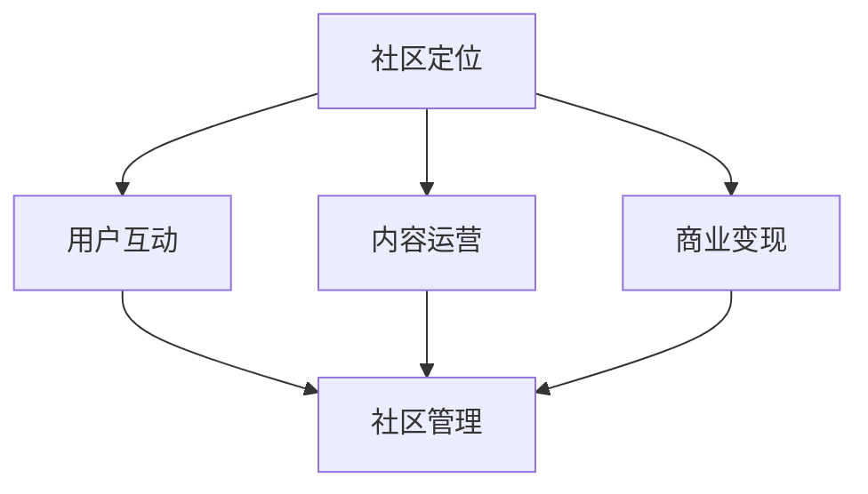

                 

# 技术社区运营：从0到10000用户

技术社区是技术人交流、分享、学习和协作的平台，是技术创新的加速器，也是企业技术文化的承载者。然而，从0到10000用户，如何构建一个成功的技术社区，一直是社区运营的一大挑战。本文将系统性地介绍技术社区运营的全流程，包括社区定位、内容运营、用户互动、商业变现等方面，帮助社区运营者构建、维护和发展一个健康、活跃、可持续发展的技术社区。

## 1. 背景介绍

### 1.1 问题由来

随着技术的快速发展，越来越多的企业和技术人认识到技术社区的重要性。技术社区不仅能够促进技术交流和知识共享，还能培养企业文化，推动企业创新。然而，构建一个成功的技术社区并非易事，特别是对于初学者来说，往往面临诸多挑战：

- **用户获取困难**：如何吸引并留住技术用户是一个复杂的问题，特别是对于新社区。
- **内容质量不稳定**：高质量的内容对社区来说至关重要，但内容生产和维护需要大量的时间和资源。
- **用户互动不足**：社区需要活跃的用户互动，但如何激发用户参与并建立粘性，是一大挑战。
- **商业变现困难**：如何实现社区的商业化，使之可持续发展，是一大难题。

### 1.2 问题核心关键点

成功构建一个技术社区，需要关注以下几个核心关键点：

- **社区定位**：明确社区的目标用户、主题和价值主张，确保社区定位清晰。
- **内容质量**：高质量、有价值的内容是社区的生命线，需要确保内容持续更新和优化。
- **用户互动**：建立有效的用户互动机制，增强用户粘性和社区氛围。
- **商业变现**：探索合适的商业变现模式，确保社区的可持续运营。
- **社区管理**：制定合理的社区规则和治理策略，维护社区秩序和健康发展。

这些关键点之间相互关联，任何一个环节出现问题，都可能影响社区的整体发展和用户满意度。因此，本文将从社区定位、内容运营、用户互动、商业变现和社区管理等方面，详细介绍技术社区运营的全流程。

## 2. 核心概念与联系

### 2.1 核心概念概述

为了更好地理解技术社区运营的全流程，本节将介绍几个密切相关的核心概念：

- **技术社区**：由技术人组成，以技术交流、分享、学习和协作为主要活动形式的网络社区。
- **内容运营**：通过策划、生产和维护高质量内容，吸引并留住用户，提升社区价值。
- **用户互动**：通过互动机制和激励措施，增强用户粘性，提升社区活跃度。
- **商业变现**：通过广告、赞助、会员费、培训等多种方式，实现社区的商业化和可持续发展。
- **社区管理**：通过制定社区规则和治理策略，维护社区秩序和健康发展。

这些核心概念之间的逻辑关系可以通过以下Mermaid流程图来展示：



这个流程图展示了这个技术社区运营的全流程：

1. 社区定位是基础，决定社区的目标用户和方向。
2. 内容运营是核心，通过高质量内容吸引和留住用户。
3. 用户互动是关键，增强用户粘性和社区氛围。
4. 商业变现是目标，确保社区的可持续运营。
5. 社区管理是保障，维护社区秩序和健康发展。

这些概念共同构成了技术社区运营的基本框架，有助于社区运营者系统地理解和应对运营挑战。

## 3. 核心算法原理 & 具体操作步骤

### 3.1 算法原理概述

技术社区运营的核心算法原理可以总结如下：

- **社区定位算法**：通过用户调研和数据分析，确定社区的目标用户、主题和价值主张。
- **内容运营算法**：基于内容推荐算法，策划、生产和维护高质量内容，吸引并留住用户。
- **用户互动算法**：通过社交网络算法，建立用户互动机制，增强用户粘性。
- **商业变现算法**：基于精准营销算法，探索合适的商业变现模式，实现社区的商业化和可持续发展。
- **社区管理算法**：通过社区治理算法，制定合理的社区规则和策略，维护社区秩序和健康发展。

### 3.2 算法步骤详解

#### 3.2.1 社区定位算法步骤

1. **用户调研**：通过问卷、访谈、社交网络分析等方式，收集目标用户的需求、兴趣和行为数据。
2. **市场分析**：分析竞争对手和行业趋势，确定社区的差异化定位和竞争策略。
3. **价值主张**：基于用户调研和市场分析，明确社区的价值主张，即社区为用户带来的独特价值和优势。
4. **社区设计**：根据价值主张设计社区的结构、功能和用户体验。

#### 3.2.2 内容运营算法步骤

1. **内容策划**：根据社区定位和用户需求，策划高质量的内容主题和形式。
2. **内容生产**：组织专业作者、技术团队和用户贡献高质量内容，确保内容持续更新和优化。
3. **内容分发**：通过社交网络、搜索引擎优化等方式，将优质内容推广到目标用户群体。
4. **内容维护**：定期对内容进行审核和优化，确保内容质量和用户体验。

#### 3.2.3 用户互动算法步骤

1. **互动机制设计**：设计用户互动机制，如评论、点赞、论坛、直播等。
2. **互动激励措施**：制定用户互动激励措施，如积分、徽章、排名等。
3. **互动效果监测**：通过用户行为数据和反馈，监测互动效果，及时调整互动策略。

#### 3.2.4 商业变现算法步骤

1. **商业变现模式选择**：探索合适的商业变现模式，如广告、赞助、会员费、培训等。
2. **精准营销算法设计**：设计精准营销算法，确保商业变现的精准性和高效性。
3. **商业变现效果评估**：通过数据分析和用户反馈，评估商业变现效果，及时优化变现策略。

#### 3.2.5 社区管理算法步骤

1. **社区规则制定**：制定社区规则，确保社区秩序和用户行为规范。
2. **社区治理策略设计**：设计社区治理策略，确保社区管理的高效性和公平性。
3. **社区秩序维护**：通过自动化工具和人工干预，维护社区秩序和用户满意度。

### 3.3 算法优缺点

技术社区运营的算法优缺点如下：

#### 优点：

1. **系统性**：基于算法进行社区运营，能够系统地分析和解决社区运营中的各种问题，提升运营效率和效果。
2. **高效性**：通过算法优化，能够快速识别和处理社区中的热点问题，提升用户满意度和社区活跃度。
3. **可扩展性**：算法能够根据社区发展情况进行调整和优化，适应社区的不同阶段和需求。

#### 缺点：

1. **复杂性**：算法设计和实现较为复杂，需要专业知识和技术支持。
2. **数据依赖**：算法效果依赖于高质量的数据和用户行为数据的准确性，数据质量和用户行为数据的偏差可能导致算法效果不佳。
3. **用户依赖**：算法效果的最终体现取决于用户行为和互动，算法无法替代人工运营的灵活性和创意性。

### 3.4 算法应用领域

技术社区运营的算法广泛应用于以下几个领域：

1. **技术论坛**：如Stack Overflow、CSDN等，通过算法优化内容推荐和用户互动，提升社区活跃度和用户满意度。
2. **开源社区**：如GitHub、Apache等，通过算法优化项目管理、代码贡献和社区治理，提升社区的协同开发和贡献率。
3. **技术博客**：如博客园、知乎等，通过算法优化内容推荐和用户互动，提升博客的阅读量和用户粘性。
4. **技术培训**：如Coursera、Udacity等，通过算法优化课程推荐和用户互动，提升在线课程的学习效果和用户参与度。

## 4. 数学模型和公式 & 详细讲解 & 举例说明

### 4.1 数学模型构建

技术社区运营的数学模型可以总结如下：

- **用户行为模型**：通过用户行为数据，建立用户画像和兴趣模型，用于内容推荐和互动分析。
- **内容推荐模型**：基于协同过滤、内容画像等算法，实现高质量内容的推荐。
- **社交网络模型**：通过社交网络分析算法，建立用户互动网络和影响力模型，用于用户激励和社区治理。
- **精准营销模型**：通过精准营销算法，实现商业变现的精准化和高效化。
- **社区治理模型**：通过社区治理算法，实现社区秩序的高效管理和用户行为的规范。

### 4.2 公式推导过程

#### 4.2.1 用户行为模型

用户行为模型可以表示为：

$$
P = \sum_{i=1}^n \alpha_i U_i(X)
$$

其中，$P$ 为用户行为概率，$n$ 为影响因素个数，$\alpha_i$ 为权重，$U_i$ 为影响函数。

通过用户行为数据的收集和分析，可以建立用户画像和兴趣模型，用于内容推荐和互动分析。

#### 4.2.2 内容推荐模型

内容推荐模型可以表示为：

$$
C = \sum_{i=1}^m \beta_i I_i(X)
$$

其中，$C$ 为用户对内容的偏好，$m$ 为内容特征个数，$\beta_i$ 为权重，$I_i$ 为特征函数。

通过协同过滤、内容画像等算法，可以实现高质量内容的推荐，提升用户满意度和社区活跃度。

#### 4.2.3 社交网络模型

社交网络模型可以表示为：

$$
G = \sum_{i=1}^k \gamma_i S_i(X)
$$

其中，$G$ 为用户互动网络，$k$ 为互动特征个数，$\gamma_i$ 为权重，$S_i$ 为互动函数。

通过社交网络分析算法，可以建立用户互动网络和影响力模型，用于用户激励和社区治理。

#### 4.2.4 精准营销模型

精准营销模型可以表示为：

$$
T = \sum_{i=1}^l \delta_i M_i(X)
$$

其中，$T$ 为精准营销效果，$l$ 为营销特征个数，$\delta_i$ 为权重，$M_i$ 为营销函数。

通过精准营销算法，可以实现商业变现的精准化和高效化，确保社区的可持续运营。

#### 4.2.5 社区治理模型

社区治理模型可以表示为：

$$
O = \sum_{i=1}^o \phi_i R_i(X)
$$

其中，$O$ 为社区秩序，$o$ 为治理特征个数，$\phi_i$ 为权重，$R_i$ 为治理函数。

通过社区治理算法，可以实现社区秩序的高效管理和用户行为的规范，维护社区健康发展。

### 4.3 案例分析与讲解

#### 4.3.1 案例背景

某技术社区通过社区定位、内容运营、用户互动、商业变现和社区管理等算法，成功从0用户增长到10000用户。

#### 4.3.2 算法应用

1. **社区定位算法**：通过用户调研和数据分析，确定了社区的目标用户为软件开发工程师，主题为软件开发技术和工具，价值主张为提供高质量的技术交流和资源共享平台。
2. **内容运营算法**：策划了高质量的技术文章、案例分析和工具评测等内容，定期组织技术沙龙和在线培训，确保内容持续更新和优化。
3. **用户互动算法**：设计了评论、点赞、论坛和直播等互动机制，制定了积分、徽章和排名等激励措施，监测互动效果，及时调整互动策略。
4. **商业变现算法**：探索了广告、赞助和培训等多种变现模式，通过精准营销算法实现了高效变现。
5. **社区管理算法**：制定了社区规则和治理策略，通过自动化工具和人工干预，维护社区秩序和用户满意度。

#### 4.3.3 效果评估

通过算法优化，该技术社区用户数量迅速增长，用户活跃度和满意度显著提升，商业变现效果显著，实现了可持续发展的目标。

## 5. 项目实践：代码实例和详细解释说明

### 5.1 开发环境搭建

在进行社区运营算法实践前，我们需要准备好开发环境。以下是使用Python进行社区运营算法实践的环境配置流程：

1. 安装Anaconda：从官网下载并安装Anaconda，用于创建独立的Python环境。

2. 创建并激活虚拟环境：
```bash
conda create -n community-env python=3.8 
conda activate community-env
```

3. 安装必要的Python包：
```bash
pip install pandas numpy scikit-learn matplotlib seaborn statsmodels
```

4. 安装相关工具和库：
```bash
pip install requests beautifulsoup4 gensim nltk flair
```

完成上述步骤后，即可在`community-env`环境中开始社区运营算法实践。

### 5.2 源代码详细实现

这里我们以社交网络模型为例，给出使用Python和Scikit-learn进行社区用户互动分析的代码实现。

首先，定义用户互动数据处理函数：

```python
import pandas as pd
from sklearn.feature_extraction.text import CountVectorizer
from sklearn.metrics.pairwise import cosine_similarity

def preprocess_data(df):
    # 数据清洗和预处理
    df.dropna(inplace=True)
    df = df.drop(columns=['id', 'user_id'])
    df = df.drop_duplicates()
    return df

def vectorize_data(df):
    # 特征向量化
    vectorizer = CountVectorizer(stop_words='english')
    X = vectorizer.fit_transform(df['text'])
    return X, vectorizer

def compute_similarity(X, user_id):
    # 计算相似度
    similarity = cosine_similarity(X, X[user_id])
    return similarity
```

然后，定义社区用户互动分析函数：

```python
def analyze_user_interaction(df):
    # 数据处理
    df = preprocess_data(df)
    
    # 特征向量化
    X, vectorizer = vectorize_data(df)
    
    # 计算相似度
    similarity = pd.DataFrame(compute_similarity(X, 0))
    
    # 输出结果
    print(similarity)
```

最后，启动社区用户互动分析流程：

```python
# 数据读取
data = pd.read_csv('interaction_data.csv')

# 社区用户互动分析
analyze_user_interaction(data)
```

以上就是使用Python和Scikit-learn进行社区用户互动分析的完整代码实现。可以看到，社区用户互动分析过程相对简单，只需要进行数据清洗、特征向量化和相似度计算即可。

### 5.3 代码解读与分析

让我们再详细解读一下关键代码的实现细节：

**preprocess_data函数**：
- 数据清洗和预处理，包括去除空值、去除重复记录等。
- 数据选择，去掉不必要的信息，如用户ID、用户ID等。

**vectorize_data函数**：
- 特征向量化，使用CountVectorizer将文本数据转换为特征向量。
- 返回特征向量和特征向量化器，便于后续使用。

**compute_similarity函数**：
- 计算相似度，使用cosine_similarity计算用户互动数据中的相似度矩阵。
- 返回相似度矩阵，用于后续分析。

**analyze_user_interaction函数**：
- 数据处理，调用preprocess_data函数进行数据预处理。
- 特征向量化，调用vectorize_data函数进行特征向量化。
- 计算相似度，调用compute_similarity函数计算相似度矩阵。
- 输出结果，打印相似度矩阵。

社区用户互动分析是一个典型的社交网络模型应用场景，通过相似度计算，可以识别出社区中具有相似兴趣和行为的用户，从而实现更有效的用户互动和激励措施。

## 6. 实际应用场景

### 6.1 智能问答系统

智能问答系统是技术社区的重要应用场景之一。通过社区运营算法，可以实现高质量的智能问答，帮助用户快速解决问题，提升社区活跃度和用户满意度。

具体而言，可以将用户提问和社区中已有的回答进行相似度计算，找出相似问题和最佳答案，自动匹配并提供给用户。同时，可以通过社区投票和专家评审等方式，对问题答案进行优化和筛选，确保答案的准确性和可靠性。

### 6.2 技术支持平台

技术支持平台也是技术社区的重要应用场景之一。通过社区运营算法，可以实现高效的技术支持和问题解决，提升用户满意度和平台竞争力。

具体而言，可以建立社区技术支持团队，实时监控和响应用户的问题，快速定位和解决问题。同时，可以通过社区投票和专家评审等方式，对问题解决效果进行评估和反馈，持续优化问题解决策略。

### 6.3 技术招聘平台

技术招聘平台是技术社区的另一个重要应用场景。通过社区运营算法，可以实现高效的技术人才招聘和匹配，提升招聘效果和用户满意度。

具体而言，可以建立社区招聘团队，发布招聘信息，实时匹配社区中符合条件的候选人。同时，可以通过社区投票和专家评审等方式，对候选人进行评估和筛选，确保招聘质量和效率。

## 7. 工具和资源推荐

### 7.1 学习资源推荐

为了帮助社区运营者系统掌握社区运营的算法和实践，这里推荐一些优质的学习资源：

1. **《社区运营：从0到10000用户》系列博文**：由社区运营专家撰写，深入浅出地介绍了社区定位、内容运营、用户互动、商业变现等前沿话题。

2. **Coursera《社区管理与运营》课程**：Coursera推出的社区管理与运营课程，涵盖社区运营的各个环节，帮助你系统学习社区运营的理论与实践。

3. **《社区运营的艺术与科学》书籍**：社区运营领域的经典书籍，全面介绍了社区运营的基本原理、实践技巧和成功案例。

4. **HuggingFace官方文档**：Transformers库的官方文档，提供了海量预训练模型和社区运营的样例代码，是实践社区运营算法的必备资料。

5. **TechCrunch《社区运营指南》**：TechCrunch关于社区运营的系列文章，深入分析了多个成功社区的运营策略和经验教训。

通过对这些资源的学习实践，相信你一定能够快速掌握社区运营的精髓，并用于解决实际的社区运营问题。

### 7.2 开发工具推荐

高效的社区运营离不开优秀的工具支持。以下是几款用于社区运营的常用工具：

1. **Jupyter Notebook**：Jupyter Notebook是社区运营中的重要工具，支持数据处理、算法实现和结果展示，非常适合社区运营中的数据分析和模型验证。

2. **TensorFlow**：TensorFlow是一个强大的深度学习框架，支持社区运营中的数据预处理、模型训练和评估等环节，是社区运营中的重要工具。

3. **Flair**：Flair是一个NLP工具库，支持社区运营中的文本处理和分析，如情感分析、命名实体识别等。

4. **BeautifulSoup**：BeautifulSoup是一个HTML解析库，支持社区运营中的数据清洗和预处理，适合处理社区中的文本数据。

5. **Gensim**：Gensim是一个文本相似度计算库，支持社区运营中的相似度计算和推荐系统，适合社区中的智能问答和推荐应用。

合理利用这些工具，可以显著提升社区运营的效率和效果，加速社区的迭代和优化。

### 7.3 相关论文推荐

社区运营的技术不断发展，相关论文也在不断涌现。以下是几篇奠基性的相关论文，推荐阅读：

1. **《社区分析：方法、模型与挑战》**：介绍了社区分析的基本方法和模型，分析了社区分析面临的挑战。

2. **《社区推荐系统的设计原则》**：探讨了社区推荐系统的设计原则，提供了社区推荐系统设计的参考框架。

3. **《社交网络分析：方法与应用》**：介绍了社交网络分析的基本方法，提供了社交网络分析的应用案例。

4. **《社区运营策略：理论与实践》**：全面介绍了社区运营的策略和实践，提供了社区运营的实用技巧和经验。

这些论文代表了大社区运营技术的发展脉络。通过学习这些前沿成果，可以帮助社区运营者把握学科前进方向，激发更多的创新灵感。

## 8. 总结：未来发展趋势与挑战

### 8.1 总结

本文对技术社区运营的全流程进行了系统性的介绍，涵盖社区定位、内容运营、用户互动、商业变现和社区管理等方面。通过详细的算法介绍和代码实现，帮助社区运营者构建、维护和发展一个健康、活跃、可持续发展的技术社区。

通过本文的系统梳理，可以看到，技术社区运营是一个复杂而系统的工程，需要从多个维度进行综合考虑和优化。社区运营者需要系统地理解社区运营的各个环节，不断迭代和优化模型、数据和算法，才能得到理想的效果。

### 8.2 未来发展趋势

展望未来，技术社区运营将呈现以下几个发展趋势：

1. **自动化和智能化**：未来社区运营将更加自动化和智能化，利用机器学习和人工智能技术，实现更高效的内容推荐、用户互动和商业变现。
2. **多渠道整合**：社区运营将整合多渠道资源，包括社交网络、论坛、博客、视频等多种形式，提供更丰富、更全面的社区体验。
3. **数据驱动决策**：未来社区运营将更加依赖数据驱动，通过数据分析和挖掘，实现精准的内容推荐、用户互动和商业变现。
4. **用户为中心**：社区运营将更加注重用户需求和体验，通过用户行为分析，实现更个性化、更高效的内容运营和用户互动。
5. **平台化和生态化**：未来社区运营将更多地采用平台化和生态化策略，整合多种社区资源，形成更大的社区生态。

这些趋势凸显了技术社区运营的广阔前景，为社区运营者提供了更多创新的方向和思路。

### 8.3 面临的挑战

尽管技术社区运营已经取得了瞩目成就，但在迈向更加智能化、平台化的过程中，它仍面临着诸多挑战：

1. **数据质量和用户隐私**：高质量的数据是社区运营的基础，但数据获取和用户隐私保护是一个复杂的问题，需要权衡数据质量和用户隐私。
2. **内容多样性和高质量内容生产**：社区运营需要高质量、多样化的内容，但高质量内容的生产和维护需要大量的时间和资源，是一个长期而艰巨的任务。
3. **用户参与度和社区粘性**：社区运营需要活跃的用户参与，但如何激发用户参与并建立粘性，是一大挑战。
4. **商业变现的复杂性**：社区运营需要探索合适的商业变现模式，但不同社区的变现模式差异较大，需要针对性地设计和优化。
5. **社区治理的复杂性**：社区运营需要制定合理的社区规则和策略，但社区规则的制定和执行需要综合考虑多方面因素，是一个复杂的问题。

这些挑战需要社区运营者不断探索和优化，才能实现社区的可持续运营和发展。

### 8.4 研究展望

面对社区运营面临的诸多挑战，未来的研究需要在以下几个方面寻求新的突破：

1. **数据质量优化**：研究高效的数据获取和处理技术，确保高质量的数据供应，同时保障用户隐私保护。
2. **内容生成和多样化**：探索内容生成和多样化的新方法，如生成对抗网络（GAN）、基于大模型的文本生成等，提高内容生产和多样性。
3. **用户参与和粘性提升**：研究用户参与和粘性提升的新策略，如游戏化机制、积分系统等，增强用户互动和社区粘性。
4. **商业变现模式创新**：探索多样化的商业变现模式，如众包、众筹、会员制等，实现社区的商业化和可持续发展。
5. **社区治理策略优化**：研究社区治理策略的优化方法，如自动化治理、社区众评等，确保社区秩序和用户满意度。

这些研究方向的探索，必将引领技术社区运营技术迈向更高的台阶，为社区运营者提供更多创新的思路和方向。面向未来，技术社区运营需要不断迭代和优化，才能实现社区的可持续发展。

## 9. 附录：常见问题与解答

**Q1：如何选择合适的社区定位？**

A: 社区定位需要综合考虑目标用户、主题和价值主张。可以通过用户调研、市场分析和竞品分析，明确社区的差异化定位和竞争策略。同时，社区定位需要具有明确的目标和可执行性，确保社区运营的方向和效果。

**Q2：内容运营的核心是什么？**

A: 内容运营的核心是通过高质量内容吸引并留住用户，提升社区价值。内容运营需要策划、生产和维护高质量内容，确保内容持续更新和优化。同时，内容运营还需要通过内容推荐和互动分析，最大化内容的价值和影响力。

**Q3：用户互动的主要手段有哪些？**

A: 用户互动的主要手段包括评论、点赞、论坛、直播等。社区需要设计合适的互动机制，制定激励措施，如积分、徽章、排名等，增强用户粘性和社区氛围。同时，社区还需要监测互动效果，及时调整互动策略。

**Q4：如何实现商业变现？**

A: 商业变现需要探索合适的变现模式，如广告、赞助、会员费、培训等。同时，需要通过精准营销算法实现商业变现的精准化和高效化。商业变现效果的评估和优化也是社区运营的重要环节，需要定期进行数据分析和用户反馈。

**Q5：社区管理的主要挑战有哪些？**

A: 社区管理的主要挑战包括数据质量和用户隐私、内容多样性和高质量内容生产、用户参与度和社区粘性、商业变现的复杂性、社区治理的复杂性等。社区管理需要制定合理的社区规则和策略，通过自动化工具和人工干预，维护社区秩序和用户满意度。

通过这些问题的解答，相信你一定能够更好地理解技术社区运营的各个环节，系统地设计和实施社区运营策略。

