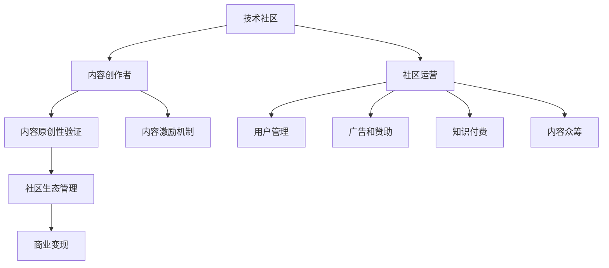

                 

# 技术社区运营：影响力变现

> 关键词：社区运营, 技术社区, 内容创作者, 知识付费, 社交网络

## 1. 背景介绍

### 1.1 问题由来
在互联网迅速发展的今天，技术社区已成为知识传播、技术交流、职业发展的关键平台。然而，尽管社区中的内容丰富多样，内容创作者的权益往往得不到有效保护，进而影响了他们的创作积极性和社区生态的健康发展。

当前，技术社区运营面临以下挑战：
1. **内容创作者权益保护不足**：技术社区中的原创内容往往被随意转载、盗版，创作者难以获得应有的回报。
2. **高质量内容的稀缺**：高质量内容的产出需要投入大量的时间和精力，但这些原创内容往往难以在社区中获得足够的曝光和回报。
3. **社区生态管理困难**：技术社区中的内容良莠不齐，如何有效筛选和管理内容，保持社区的活跃度和高质量内容，成为运营者面临的一大难题。
4. **技术社区的商业模式不明确**：如何通过社区运营实现商业变现，赋予内容创作者更多价值，同时吸引更多用户和投资者的关注，是社区运营的核心问题。

这些问题不仅影响着技术社区的发展，也对技术创新的进程产生了制约。因此，如何通过社区运营提升技术内容的影响力，实现社区价值的最大化，是本文探讨的核心议题。

### 1.2 问题核心关键点
本文聚焦于技术社区运营中的几个关键点：
- **内容创作者的权益保护**：通过技术手段实现内容原创性的验证和保护。
- **高质量内容的激励机制**：构建完善的激励机制，提升内容创作者的积极性和社区的活跃度。
- **社区生态的良性循环**：通过管理机制和运营策略，营造健康的社区生态，吸引更多的高质量内容。
- **商业模式的创新**：探索多样化的商业变现方式，提升社区的整体价值。

## 2. 核心概念与联系

### 2.1 核心概念概述

为了更好地理解技术社区运营的影响力变现，本节将介绍几个核心概念：

- **技术社区**：由技术爱好者、开发者、研究人员等群体构成的在线社区，如Stack Overflow、GitHub、知乎等。
- **内容创作者**：在社区中积极生产和分享原创技术内容的用户，如技术博客作者、代码贡献者、问题解答者等。
- **内容原创性验证**：通过技术手段，对社区中的内容进行原创性验证，保护内容创作者的权益。
- **内容激励机制**：构建多种激励措施，提升内容创作者的创作动力和社区的活跃度。
- **社区生态管理**：通过管理策略和技术手段，维持社区的健康、高效和有序发展。
- **商业变现**：通过社区的运营，实现内容创作者、社区成员以及投资者的多方共赢。

这些核心概念之间的逻辑关系可以通过以下Mermaid流程图来展示：



这个流程图展示了几大核心概念及其之间的关系：

1. 技术社区由内容创作者组成，提供丰富的技术内容。
2. 内容原创性验证保障创作者权益。
3. 内容激励机制提升创作者动力。
4. 社区生态管理维持社区健康。
5. 商业变现赋予社区价值。
6. 社区运营涵盖用户管理、广告、知识付费、内容众筹等多种方式。

这些概念共同构成了技术社区运营的理论基础，指引着社区的可持续发展。

## 3. 核心算法原理 & 具体操作步骤
### 3.1 算法原理概述

技术社区运营中的影响力变现，本质上是一个多目标优化问题。其核心思想是：通过管理技术社区，最大化地提升内容创作者的影响力和社区的整体价值。

形式化地，设社区中内容创作者的集合为 $\mathcal{C}$，社区的总体价值为 $V$，内容创作者 $c \in \mathcal{C}$ 的影响力为 $I(c)$。则影响力和社区总体价值的关系可表示为：

$$
V = \sum_{c \in \mathcal{C}} w_{c} I(c)
$$

其中 $w_c$ 为内容创作者 $c$ 的权重，表示其对社区总体价值的贡献。

为了最大化总体价值 $V$，运营者需要考虑以下几个关键目标：
1. **内容原创性**：确保社区中的内容都是原创的，防止盗版和抄袭。
2. **内容质量**：提升社区中高质量内容的数量和质量，满足用户需求。
3. **内容创作者激励**：通过多种激励措施，提升内容创作者的积极性和创作动力。
4. **社区生态**：维持社区的健康、有序和活跃，吸引更多高质量内容和用户。
5. **商业变现**：通过多元化的商业策略，实现社区价值和创作者的收益最大化。

### 3.2 算法步骤详解

基于上述目标，技术社区运营的影响力变现可以遵循以下步骤：

**Step 1: 内容原创性验证**

- 引入区块链或分布式账本技术，对社区中的内容进行原创性验证。
- 使用Hash函数对内容进行唯一标识，记录内容创建的最早时间戳。
- 采用共识机制，确保内容的原创性和可信度。

**Step 2: 内容激励机制构建**

- 定义内容价值指标，如阅读量、点赞数、评论数、分享数等。
- 设计多样化的激励措施，如内容打赏、版权分成、流量曝光、专家认证等。
- 定期评估内容价值和创作者贡献，动态调整激励机制。

**Step 3: 社区生态管理**

- 建立严格的社区管理规则，确保内容的健康和秩序。
- 采用人工智能技术，自动化筛选和管理内容，防止低质量内容的泛滥。
- 引入社区治理机制，允许社区成员共同管理和维护社区。

**Step 4: 商业变现策略制定**

- 探索多种商业变现模式，如广告、赞助、知识付费、内容众筹等。
- 与企业、机构合作，推出商业合作计划，提升社区的商业价值。
- 开发社区付费平台，提供多种订阅服务和增值服务，增强社区的经济价值。

**Step 5: 用户和创作者互动**

- 提供多渠道的用户沟通渠道，如论坛、私信、评论等，促进用户与创作者之间的互动。
- 定期组织技术交流会、编程大赛等活动，增强社区的活跃度。
- 引入虚拟货币或代币系统，激励用户和创作者的积极参与。

### 3.3 算法优缺点

基于上述算法步骤，技术社区运营的影响力变现方法具有以下优点：

1. **保障内容原创性**：通过区块链等技术，确保内容的原创性和可信度，保护内容创作者的权益。
2. **提升内容质量**：通过激励机制，提升内容创作者的动力，从而增加高质量内容。
3. **营造社区生态**：通过严格管理规则和人工智能技术，维护社区的健康和有序。
4. **实现商业变现**：通过多样化的商业策略，提升社区的整体价值。
5. **增强用户和创作者互动**：通过互动平台和虚拟货币系统，增强社区的活跃度和用户黏性。

同时，该方法也存在一些局限性：

1. **技术复杂性**：内容原创性验证和社区管理需要引入区块链、人工智能等技术，增加了实现难度。
2. **激励机制设计**：多样化的激励机制设计需要精细化的操作和管理。
3. **用户接受度**：引入虚拟货币或代币系统，需要用户有较高的接受度和参与意愿。
4. **商业变现挑战**：单一的商业策略可能难以应对多样化的市场需求。

尽管存在这些局限性，但该方法提供了一个较为系统的技术社区运营框架，有望在提升社区影响力、实现商业变现方面发挥重要作用。

### 3.4 算法应用领域

基于内容原创性验证、内容激励机制、社区生态管理、商业变现等核心概念，该方法可以应用于多个技术社区运营场景，例如：

- **技术博客平台**：通过区块链技术验证内容原创性，提供内容打赏、广告分成等激励机制，同时开发付费订阅服务，实现社区变现。
- **开源社区**：采用分布式账本技术记录代码贡献者的贡献，提供代码打赏、开源项目赞助等激励，通过知识付费和开源商业化探索商业模式。
- **技术论坛和问答社区**：通过人工智能技术自动化筛选和管理内容，确保内容的健康和高质量，同时引入虚拟货币系统，增强用户互动和社区活力。
- **技术培训和教育平台**：提供高质量的课程和教学资源，通过知识付费、课程订阅等方式实现商业变现，同时通过内容创作者激励和社区管理，提升用户满意度和社区活跃度。

以上场景展示了该方法在不同技术社区中的广泛应用潜力，为社区运营提供了新的思路和方法。

## 4. 数学模型和公式 & 详细讲解 & 举例说明
### 4.1 数学模型构建

技术社区运营的影响力变现是一个复杂的多目标优化问题。以下是该问题的数学模型构建：

设社区中内容创作者的集合为 $\mathcal{C}$，社区的总体价值为 $V$，内容创作者 $c \in \mathcal{C}$ 的影响力为 $I(c)$，内容价值指标为 $v_{c} = (r_{c}, p_{c}, c_{c}, s_{c})$，其中 $r_{c}$ 表示阅读量，$p_{c}$ 表示点赞数，$c_{c}$ 表示评论数，$s_{c}$ 表示分享数。

定义内容创作者 $c$ 的权重为 $w_{c}$，社区运营的目标为最大化总体价值 $V$，则模型可表示为：

$$
V = \sum_{c \in \mathcal{C}} w_{c} I(c) = \sum_{c \in \mathcal{C}} w_{c} \sum_{v \in V_{c}} \alpha_{v} v_{c}
$$

其中 $\alpha_{v}$ 为内容价值指标 $v$ 的权重系数，需根据实际情况进行调整。

### 4.2 公式推导过程

**Step 1: 内容原创性验证**

设内容 $A$ 的原创性验证结果为 $P(A)$，则该步骤的优化目标为：

$$
\max \sum_{A \in \mathcal{A}} P(A)
$$

其中 $\mathcal{A}$ 为社区中的所有内容集合，$P(A)$ 为内容 $A$ 的原创性验证结果。

**Step 2: 内容激励机制构建**

设内容创作者 $c$ 的激励结果为 $R_{c}$，则该步骤的优化目标为：

$$
\max \sum_{c \in \mathcal{C}} w_{c} R_{c}
$$

其中 $R_{c}$ 为内容创作者 $c$ 的激励结果，包括内容打赏、版权分成、流量曝光、专家认证等。

**Step 3: 社区生态管理**

设社区生态管理结果为 $E$，则该步骤的优化目标为：

$$
\max E
$$

其中 $E$ 为社区生态管理结果，包括内容筛选、社区治理、用户互动等。

**Step 4: 商业变现策略制定**

设商业变现结果为 $B$，则该步骤的优化目标为：

$$
\max B
$$

其中 $B$ 为商业变现结果，包括广告收入、赞助、知识付费、内容众筹等。

### 4.3 案例分析与讲解

**案例1: 技术博客平台**

某技术博客平台，采用区块链技术对内容进行原创性验证，并引入内容打赏、广告分成等激励机制，同时开发付费订阅服务，实现商业变现。假设平台中有 1000 位内容创作者，内容价值指标的权重系数分别为 $(r_{c}, p_{c}, c_{c}, s_{c}) = (0.5, 0.3, 0.1, 0.1)$。通过模型优化，发现阅读量 $r_{c}$ 对总体价值的贡献最大，需特别关注提升内容质量和读者互动。

**案例2: 开源社区**

某开源社区，采用分布式账本技术记录代码贡献者的贡献，提供代码打赏、开源项目赞助等激励，通过知识付费和开源商业化探索商业模式。假设社区中有 500 位贡献者，内容价值指标的权重系数分别为 $(r_{c}, p_{c}, c_{c}, s_{c}) = (0.3, 0.4, 0.2, 0.1)$。通过模型优化，发现代码质量和项目参与度对总体价值的贡献最大，需特别关注提升社区的创新能力和用户黏性。

## 5. 项目实践：代码实例和详细解释说明
### 5.1 开发环境搭建

在进行技术社区运营的影响力变现实践前，我们需要准备好开发环境。以下是使用Python进行Flask开发的环境配置流程：

1. 安装Anaconda：从官网下载并安装Anaconda，用于创建独立的Python环境。

2. 创建并激活虚拟环境：
```bash
conda create -n flask-env python=3.8 
conda activate flask-env
```

3. 安装Flask：
```bash
pip install Flask
```

4. 安装Gunicorn：
```bash
pip install gunicorn
```

5. 安装必要的库：
```bash
pip install markdown pygments
```

6. 安装虚拟货币系统：
```bash
pip install blockstack
```

完成上述步骤后，即可在`flask-env`环境中开始实践。

### 5.2 源代码详细实现

我们以技术博客平台为例，给出使用Flask构建社区运营影响力的代码实现。

首先，定义Flask应用：

```python
from flask import Flask, render_template, request
from markdown import markdown
from pygments import highlight
from pygments.lexers import get_lexer_by_name

app = Flask(__name__)

app.config['BLOCKSTACK_APP_ID'] = 'your_app_id'
app.config['BLOCKSTACK_API_KEY'] = 'your_api_key'
```

然后，定义内容验证和激励机制：

```python
def verify原创性(content):
    # 使用区块链技术验证内容原创性，返回验证结果
    pass

def calculate激励结果(c):
    # 根据内容价值指标计算激励结果
    pass
```

接着，定义社区生态管理和商业变现：

```python
def manage社区生态():
    # 采用人工智能技术筛选和管理内容
    pass

def monetize社区():
    # 探索多样化的商业策略，实现社区价值和创作者收益
    pass
```

最后，定义用户和创作者互动：

```python
@app.route('/')
def home():
    # 渲染主页，展示社区内容
    pass

@app.route('/<id>')
def content(id):
    # 展示具体内容，支持虚拟货币打赏
    pass

@app.route('/post', methods=['POST'])
def post_content():
    # 发布新内容，验证原创性并计算激励结果
    pass
```

以上就是使用Flask构建技术社区运营影响力的完整代码实现。可以看到，Flask提供了简单易用的框架，可以快速搭建社区平台。

### 5.3 代码解读与分析

让我们再详细解读一下关键代码的实现细节：

**Flask应用**：
- 引入Flask框架，并配置虚拟货币系统的App ID和API Key。

**内容验证**：
- `verify原创性`函数模拟使用区块链技术验证内容原创性，实际实现中需引入相应的区块链库和API。

**激励结果计算**：
- `calculate激励结果`函数根据内容价值指标计算激励结果，实际实现中需根据具体情况设定激励方式和权重。

**社区生态管理**：
- `manage社区生态`函数采用人工智能技术筛选和管理内容，实际实现中需引入自然语言处理和机器学习库，如NLTK、Scikit-learn等。

**商业变现探索**：
- `monetize社区`函数探索多样化的商业策略，实际实现中需设计不同的变现模式，如广告、赞助、知识付费、内容众筹等。

**用户和创作者互动**：
- `home`函数渲染主页，展示社区内容，支持虚拟货币打赏。
- `content`函数展示具体内容，支持虚拟货币打赏。
- `post_content`函数发布新内容，验证原创性并计算激励结果。

以上代码实现了技术社区运营影响力的基础功能，开发者可以根据实际需求进一步扩展和优化。

### 5.4 运行结果展示

运行上述代码，启动Flask应用：

```bash
flask run
```

访问 `http://localhost:5000`，展示社区内容和管理界面。用户可以在页面上浏览、评论、点赞、分享内容，并使用虚拟货币打赏创作者。通过管理和商业变现模块，社区运营者可以对内容进行筛选和管理，实现商业变现。

## 6. 实际应用场景
### 6.1 智能客服系统

基于技术社区运营的影响力变现方法，智能客服系统可以引入内容原创性验证和激励机制，提升客服内容的质量和用户的满意度。通过社区治理机制，智能客服系统可以自动筛选和管理客服对话，减少低质量内容，提升系统效率。

在技术实施上，可以收集客服对话记录，将其作为社区内容，在社区中进行验证和激励。对于服务效果较好的客服人员，系统可以提供虚拟货币奖励，进一步提升其工作积极性。通过社区变现模块，系统可以探索多样化的商业策略，如广告、赞助、知识付费等，实现商业化运营。

### 6.2 金融舆情监测

金融舆情监测平台可以引入内容原创性验证和激励机制，确保舆情分析报告的原创性和高质量。通过社区生态管理，平台可以自动筛选和管理舆情数据，确保数据的质量和时效性。

在技术实现上，可以收集金融领域的新闻、评论等文本数据，将其作为社区内容，在社区中进行验证和激励。对于高质量的舆情报告，平台可以提供虚拟货币奖励，进一步提升内容创作者的积极性。通过社区变现模块，平台可以探索广告、知识付费等商业策略，实现商业化运营。

### 6.3 个性化推荐系统

个性化推荐系统可以引入内容原创性验证和激励机制，确保推荐内容的质量和原创性。通过社区生态管理，系统可以自动筛选和管理推荐内容，确保内容的健康和多样化。

在技术实现上，可以收集用户浏览、点击、评论等行为数据，将其作为社区内容，在社区中进行验证和激励。对于高质量的推荐内容，系统可以提供虚拟货币奖励，进一步提升内容创作者的积极性。通过社区变现模块，系统可以探索知识付费、内容众筹等商业策略，实现商业化运营。

### 6.4 未来应用展望

随着技术社区运营影响力的不断提升，基于影响力变现的方法将在更多领域得到应用，为技术社区带来新的发展动力。

在智慧医疗领域，基于影响力变现的社区可以提供高质量的医学知识、病例分享、健康咨询等内容，帮助患者获得更好的医疗服务。在智能教育领域，社区可以提供优质的教学资源、学习指导、职业培训等服务，提升教育质量和职业竞争力。在智慧城市治理中，社区可以提供城市事件监测、舆情分析、应急指挥等服务，提升城市管理的智能化水平。

此外，在企业生产、社会治理、文娱传媒等众多领域，基于影响力变现的社区也将不断涌现，为各行各业带来新的发展机遇。

## 7. 工具和资源推荐
### 7.1 学习资源推荐

为了帮助开发者系统掌握技术社区运营的理论基础和实践技巧，这里推荐一些优质的学习资源：

1. **《社区运营实战指南》**：介绍社区运营的各个环节，涵盖内容管理、用户互动、商业变现等，提供丰富的案例和实践建议。
2. **《区块链技术入门与实践》**：深入浅出地介绍区块链技术的基本概念和应用场景，帮助开发者理解内容原创性验证的技术实现。
3. **《Python网络爬虫实战》**：详细讲解Python爬虫技术，帮助开发者从互联网获取高质量的社区内容。
4. **《社区管理与运营》**：介绍社区生态管理的理论和方法，涵盖内容筛选、用户互动、社区治理等。
5. **《社区变现的商业逻辑》**：探讨社区变现的多种模式，帮助开发者设计有效的商业策略。

通过对这些资源的学习实践，相信你一定能够快速掌握技术社区运营的影响力变现技巧，并用于解决实际的社区运营问题。

### 7.2 开发工具推荐

高效的开发离不开优秀的工具支持。以下是几款用于技术社区运营开发的工具：

1. **Flask**：简单易用的Web框架，适合快速搭建社区平台，支持多种模板引擎和静态文件上传。
2. **Gunicorn**：基于Python的Web服务器，适合部署Flask等Web应用，支持异步I/O和长连接。
3. **Jupyter Notebook**：交互式笔记本，适合数据分析、模型训练和社区内容的可视化展示。
4. **GitHub**：版本控制系统，适合社区内容的版本控制和协作开发。
5. **Blockstack**：虚拟货币系统，适合社区变现中的虚拟货币管理。

合理利用这些工具，可以显著提升技术社区运营的影响力变现开发效率，加速创新迭代的步伐。

### 7.3 相关论文推荐

技术社区运营影响力的提升，得益于学界的持续研究。以下是几篇奠基性的相关论文，推荐阅读：

1. **《社区运营的理论与实践》**：介绍社区运营的基本概念和理论基础，提供系统化的运营框架和方法。
2. **《区块链技术在社区中的应用》**：探讨区块链技术在内容原创性验证和激励机制中的应用，提供技术实现的案例和分析。
3. **《个性化推荐系统的理论与实践》**：详细介绍个性化推荐系统的原理和算法，提供技术实现的案例和实验结果。
4. **《智慧医疗中的社区运营》**：探讨智慧医疗领域中社区运营的影响力和商业化策略，提供实际应用的案例和建议。
5. **《智能教育中的社区治理》**：介绍智能教育领域中的社区生态管理方法，提供技术实现的案例和分析。

这些论文代表了大社区运营影响力的发展脉络。通过学习这些前沿成果，可以帮助研究者把握学科前进方向，激发更多的创新灵感。

## 8. 总结：未来发展趋势与挑战

### 8.1 总结

本文对技术社区运营中的影响力变现方法进行了全面系统的介绍。首先阐述了社区运营面临的核心挑战和问题，明确了内容创作者权益保护、高质量内容激励、社区生态管理、商业模式创新等关键目标。其次，从原理到实践，详细讲解了内容原创性验证、激励机制构建、社区生态管理、商业变现等步骤，给出了技术社区运营影响力的完整代码实现。同时，本文还广泛探讨了影响力变现方法在多个技术社区中的应用场景，展示了其广泛的应用潜力。

通过本文的系统梳理，可以看到，技术社区运营中的影响力变现方法为社区运营提供了新的思路和方法，有望在提升社区影响力、实现商业变现方面发挥重要作用。随着技术社区运营影响力的不断提升，基于影响力变现的方法将在更多领域得到应用，为技术社区带来新的发展动力。

### 8.2 未来发展趋势

展望未来，技术社区运营中的影响力变现方法将呈现以下几个发展趋势：

1. **内容原创性验证技术的完善**：随着区块链技术的不断发展，内容原创性验证将变得更加便捷和高效，确保社区内容的健康和原创性。
2. **激励机制的多样化**：除了虚拟货币激励，社区运营者将探索更多的激励方式，如知识付费、内容众筹等，提升内容创作者的积极性。
3. **社区生态的智能化**：通过人工智能技术，自动筛选和管理内容，提升社区的智能化水平，减少运营成本。
4. **商业变现模式的创新**：多样化的商业策略将不断涌现，如广告、赞助、知识付费、内容众筹等，提升社区的整体价值。
5. **用户和创作者互动的增强**：通过社交网络、虚拟货币等手段，增强用户和创作者之间的互动，提升社区的活跃度和用户黏性。

以上趋势凸显了技术社区运营影响力的广阔前景，这些方向的探索发展，必将进一步提升社区运营的效果，推动技术社区的可持续发展。

### 8.3 面临的挑战

尽管技术社区运营中的影响力变现方法已经取得了一定的成果，但在迈向更加智能化、普适化应用的过程中，它仍面临诸多挑战：

1. **内容原创性验证的复杂性**：区块链技术虽然可以验证内容的原创性，但技术实现和维护成本较高，如何降低验证成本是一个重要的研究方向。
2. **激励机制的设计难度**：多样化的激励机制需要精细化的操作和管理，如何设计合理的激励机制，确保激励效果的最大化，是一个亟待解决的问题。
3. **虚拟货币系统的普及**：虚拟货币系统的推广和普及需要用户有较高的接受度和参与意愿，如何提升用户对虚拟货币系统的接受度，是一个重要的研究方向。
4. **社区生态的复杂性**：社区生态管理需要考虑到用户的参与度、内容的健康度、社区的活跃度等多个因素，如何构建健康的社区生态，是一个复杂的系统工程。
5. **商业变现的可行性**：多样化的商业策略需要针对不同的市场和需求进行设计和调整，如何设计合理的商业策略，确保社区变现的可行性，是一个重要的研究方向。

尽管存在这些挑战，但未来的研究需要在技术创新、政策引导、市场机制等方面共同发力，才能解决这些难题，推动技术社区运营影响力的不断提升。

### 8.4 研究展望

面对技术社区运营影响力的挑战，未来的研究需要在以下几个方面寻求新的突破：

1. **区块链技术的进一步优化**：探索低成本、高效能的区块链技术，降低内容原创性验证的技术门槛。
2. **智能激励机制的设计**：引入机器学习、深度学习等技术，设计更加智能、自适应的激励机制，提升内容创作者的积极性。
3. **社区治理的智能化**：引入自然语言处理、人工智能等技术，自动筛选和管理社区内容，提升社区的智能化水平。
4. **多样化的商业策略**：设计多样化的商业策略，探索广告、赞助、知识付费、内容众筹等多种变现方式，提升社区的整体价值。
5. **用户和创作者互动的增强**：引入社交网络、虚拟货币等手段，增强用户和创作者之间的互动，提升社区的活跃度和用户黏性。

这些研究方向将引领技术社区运营影响力的不断提升，为社区运营提供新的思路和方法，推动技术社区的可持续发展。

## 9. 附录：常见问题与解答

**Q1：如何保护内容创作者的权益？**

A: 通过区块链技术对内容进行原创性验证，记录内容创建的最早时间戳，确保内容的原创性和可信度。

**Q2：如何提升内容创作者的积极性？**

A: 设计多样化的激励机制，如内容打赏、版权分成、流量曝光、专家认证等，定期评估内容价值和创作者贡献，动态调整激励机制。

**Q3：如何管理社区生态？**

A: 建立严格的社区管理规则，采用人工智能技术，自动化筛选和管理内容，引入社区治理机制，允许社区成员共同管理和维护社区。

**Q4：如何实现社区变现？**

A: 探索多样化的商业策略，如广告、赞助、知识付费、内容众筹等，与企业、机构合作，推出商业合作计划，开发社区付费平台，提供多种订阅服务和增值服务，增强社区的经济价值。

**Q5：社区运营中面临的最大挑战是什么？**

A: 社区运营面临的最大挑战包括内容原创性验证的复杂性、激励机制的设计难度、虚拟货币系统的普及、社区生态的复杂性和商业变现的可行性。

---

作者：禅与计算机程序设计艺术 / Zen and the Art of Computer Programming

