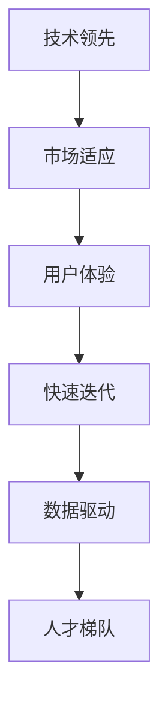

                 

# 技术领先与市场适应：Lepton AI的产品策略

> 关键词：技术领先,市场适应,Lepton AI,产品策略,人工智能,深度学习,算法优化,用户体验

## 1. 背景介绍

### 1.1 问题由来

随着人工智能技术的迅猛发展，各行各业的企业都渴望通过人工智能技术提升竞争力，实现业务创新和增长。然而，对于大多数企业而言，如何有效落地AI技术、提升产品竞争力仍是一大挑战。

Lepton AI作为一家专注于AI技术的领先公司，自成立以来，一直致力于通过高效、可靠、智能的AI技术，帮助企业快速落地AI项目，提升产品竞争力。本文将介绍Lepton AI在产品策略上的一些思考和实践，希望能够为同行提供有价值的参考。

### 1.2 问题核心关键点

Lepton AI在产品策略上，始终坚持“技术领先与市场适应”的原则，力求在技术创新和市场需求之间找到最佳的平衡点。具体而言，Lepton AI的产品策略包括以下几个关键点：

1. **技术领先**：持续投入研发，紧跟AI前沿技术，保持技术优势。
2. **市场适应**：深入理解市场需求，推出符合用户实际需求的产品。
3. **用户体验**：注重产品用户体验，提升用户满意度和粘性。
4. **快速迭代**：敏捷开发，快速响应市场需求变化。
5. **数据驱动**：以数据为基础，进行产品优化和改进。
6. **人才梯队**：打造高素质团队，为产品创新和优化提供支撑。

## 2. 核心概念与联系

### 2.1 核心概念概述

为更好地理解Lepton AI的产品策略，本节将介绍几个密切相关的核心概念：

- **技术领先**：指在AI技术上保持前沿地位，不断推出创新性产品和技术。
- **市场适应**：指根据市场需求变化，灵活调整产品策略，满足用户需求。
- **用户体验**：指通过设计和优化产品功能，提升用户使用体验，增强用户粘性。
- **快速迭代**：指采用敏捷开发方法，快速响应市场需求变化，快速推出产品更新和优化。
- **数据驱动**：指利用数据进行产品优化和改进，确保产品策略的有效性和精准性。
- **人才梯队**：指通过招聘和培养，打造高素质团队，为产品创新和优化提供支撑。

这些核心概念之间的逻辑关系可以通过以下Mermaid流程图来展示：



这个流程图展示了几大核心概念之间的相互影响和支持关系：

1. 技术领先是市场适应和用户体验的基础，保持技术优势才能更好地满足市场需求。
2. 市场适应反过来影响用户体验，了解用户需求才能优化产品功能。
3. 快速迭代和数据驱动进一步提升了用户体验，同时为技术领先和人才梯队提供了有力支撑。
4. 人才梯队是技术领先、市场适应和快速迭代的关键保障，高素质团队才能推动产品创新和优化。

## 3. 核心算法原理 & 具体操作步骤

### 3.1 算法原理概述

Lepton AI的产品策略基于深度学习技术和算法优化，其核心思想是通过技术创新和市场适应，推出满足用户需求的产品。具体而言，Lepton AI通过以下步骤实施其产品策略：

1. **技术创新**：紧跟AI前沿技术，不断推出创新性产品和技术。
2. **市场需求分析**：深入分析市场需求，了解用户痛点和需求。
3. **产品设计**：根据市场需求和技术创新，设计符合用户需求的产品。
4. **用户测试与反馈**：通过用户测试和反馈，不断优化产品功能和体验。
5. **快速迭代与更新**：采用敏捷开发方法，快速响应市场需求变化，不断推出产品更新和优化。

### 3.2 算法步骤详解

Lepton AI的产品策略实施可以分为以下几个关键步骤：

**Step 1: 技术创新与研发投入**
- 持续投入研发，紧跟AI前沿技术，参与行业技术标准的制定。
- 设立独立的技术研发部门，负责技术研发和创新。
- 与高校和科研机构合作，获取最新研究成果和技术支持。

**Step 2: 市场需求分析**
- 收集市场数据和用户反馈，进行市场需求分析和用户痛点识别。
- 进行市场调研，了解潜在用户需求和使用场景。
- 使用数据分析工具，如Google Analytics、Tableau等，进行数据可视化分析。

**Step 3: 产品设计与原型开发**
- 根据市场需求和技术创新，设计符合用户需求的产品功能和界面。
- 开发产品原型，进行用户测试和验证。
- 收集用户反馈，不断优化产品设计。

**Step 4: 用户测试与反馈**
- 选择代表性用户群体，进行产品测试和用户体验调研。
- 分析用户反馈，识别产品问题和改进方向。
- 制定用户反馈处理机制，及时回应用户问题和建议。

**Step 5: 快速迭代与产品更新**
- 采用敏捷开发方法，快速响应市场需求变化，推出产品更新和优化。
- 定期进行产品迭代和升级，提升产品性能和用户体验。
- 设立产品迭代团队，负责产品开发和优化。

### 3.3 算法优缺点

Lepton AI的产品策略具有以下优点：
1. 技术领先：通过持续技术创新，保持技术优势。
2. 市场适应：深入理解市场需求，灵活调整产品策略。
3. 用户体验：注重用户体验，提升用户满意度和粘性。
4. 快速迭代：采用敏捷开发方法，快速响应市场需求变化。
5. 数据驱动：以数据为基础，进行产品优化和改进。
6. 人才梯队：打造高素质团队，为产品创新和优化提供支撑。

同时，该策略也存在一定的局限性：
1. 研发成本高：持续的研发投入和技术创新需要大量资金支持。
2. 市场需求多变：市场需求的快速变化增加了产品策略调整的难度。
3. 用户反馈处理：用户反馈的及时处理和有效利用需要强大的团队支撑。
4. 数据隐私保护：大量数据收集和分析可能涉及用户隐私问题。
5. 产品复杂度高：技术创新带来的产品复杂度增加，可能影响用户体验。

尽管存在这些局限性，但就目前而言，Lepton AI的产品策略在技术创新和市场适应之间找到了较好的平衡点，能够快速推出符合用户需求的产品，保持市场竞争力。

### 3.4 算法应用领域

Lepton AI的产品策略已经在多个领域得到了应用，包括但不限于：

- **金融科技**：开发智能投顾、风险管理、信用评估等AI应用，提升金融服务效率和用户体验。
- **医疗健康**：推出智能诊疗、健康监测、患者管理等AI应用，改善医疗服务质量和患者体验。
- **智能制造**：开发智能生产调度、设备维护、质量控制等AI应用，提升制造业生产效率和产品质量。
- **教育培训**：推出智能教学、在线评估、个性化推荐等AI应用，提升教育培训效果和学习体验。
- **智慧城市**：开发智能交通、环境监测、应急管理等AI应用，提升城市治理水平和居民生活质量。

除了这些主要领域，Lepton AI的产品策略还被应用于更多场景中，如零售、物流、能源、环保等，为各行各业带来了新的数字化转型机遇。

## 4. 数学模型和公式 & 详细讲解 & 举例说明

### 4.1 数学模型构建

Lepton AI的产品策略基于深度学习和算法优化，其核心模型包括但不限于：

- 卷积神经网络(Convolutional Neural Network, CNN)：用于图像识别和处理。
- 循环神经网络(Recurrent Neural Network, RNN)：用于序列数据处理和时间序列预测。
- 长短期记忆网络(Long Short-Term Memory, LSTM)：用于处理长序列数据和时间序列预测。
- 深度信念网络(Deep Belief Network, DBN)：用于数据降维和特征提取。
- 生成对抗网络(Generative Adversarial Network, GAN)：用于生成对抗训练和图像生成。

这些模型在Lepton AI的产品设计和开发中得到了广泛应用。例如，在图像识别任务中，可以使用CNN模型对图像进行特征提取和分类；在序列数据处理中，可以使用RNN或LSTM模型进行文本生成和情感分析；在数据降维中，可以使用DBN模型进行特征提取和数据压缩。

### 4.2 公式推导过程

以下是一些常见的数学公式推导过程：

**CNN模型**：
- 卷积操作：
  $$
  y_{i,j} = \sum_{k=0}^{n-1} w_{k,i,j} x_{k,j} + b_{i,j}
  $$
- 池化操作：
  $$
  y_{i,j} = max(\{y_{k,l}\}, k \in I_{i,j}, l \in I_{i,j})
  $$
- 前向传播：
  $$
  a_{l+1} = f(Wa_l + b_l)
  $$
  其中 $f$ 为激活函数，如ReLU。

**RNN模型**：
- 前向传播：
  $$
  h_t = f(W h_{t-1} + U x_t + b)
  $$
  其中 $h_t$ 为隐藏状态，$x_t$ 为输入序列。

**LSTM模型**：
- 前向传播：
  $$
  i_t = \sigma(W_i h_{t-1} + U_i x_t + b_i)
  $$
  $$
  f_t = \sigma(W_f h_{t-1} + U_f x_t + b_f)
  $$
  $$
  o_t = \sigma(W_o h_{t-1} + U_o x_t + b_o)
  $$
  $$
  c_t = tanh(W_c h_{t-1} + U_c x_t + b_c)
  $$
  $$
  h_t = f_t \odot c_t + i_t \odot h_{t-1}
  $$

**GAN模型**：
- 生成器：
  $$
  G(z) = \mu(z)
  $$
- 判别器：
  $$
  D(x) = \sigma(W_D x + b_D)
  $$
- 联合训练：
  $$
  L_G = E_{z \sim p(z)} [D(G(z))] + \lambda E_{x \sim p(x)} [-\log D(x)]
  $$
  $$
  L_D = E_{x \sim p(x)} [\log D(x)] + E_{z \sim p(z)} [-\log (1 - D(G(z)))]
  $$

这些公式展示了不同模型在数据处理和优化过程中的基本运算和推导过程。通过掌握这些数学公式，Lepton AI的工程师能够更好地理解和设计模型，实现高效的数据处理和优化。

### 4.3 案例分析与讲解

以Lepton AI在金融科技领域的产品为例，详细讲解其数学模型和算法优化过程：

**智能投顾系统**：
- 数据输入：用户的基本信息、投资偏好、历史交易数据等。
- 特征提取：使用CNN模型对用户的交易数据进行特征提取。
- 模型训练：使用RNN或LSTM模型对用户数据进行序列建模，预测未来投资趋势。
- 算法优化：采用深度学习技术优化模型参数，提升预测准确率。

通过以上步骤，Lepton AI的智能投顾系统能够基于用户的历史交易数据和偏好，预测未来投资趋势，为投资者提供个性化投资建议。这种基于深度学习和算法优化的智能投顾系统，有效提升了金融服务的智能化水平和用户体验。

## 5. 项目实践：代码实例和详细解释说明

### 5.1 开发环境搭建

在进行产品实践前，我们需要准备好开发环境。以下是使用Python进行TensorFlow开发的环境配置流程：

1. 安装Anaconda：从官网下载并安装Anaconda，用于创建独立的Python环境。

2. 创建并激活虚拟环境：
```bash
conda create -n tensorflow-env python=3.8 
conda activate tensorflow-env
```

3. 安装TensorFlow：根据CUDA版本，从官网获取对应的安装命令。例如：
```bash
conda install tensorflow -c tensorflow -c conda-forge
```

4. 安装各类工具包：
```bash
pip install numpy pandas scikit-learn matplotlib tqdm jupyter notebook ipython
```

完成上述步骤后，即可在`tensorflow-env`环境中开始产品实践。

### 5.2 源代码详细实现

下面我们以智能投顾系统为例，给出使用TensorFlow对深度学习模型进行调参的PyTorch代码实现。

首先，定义智能投顾系统的数据处理函数：

```python
import tensorflow as tf
import numpy as np

def preprocess_data(data):
    # 数据预处理
    # ...
    return processed_data
```

然后，定义模型和损失函数：

```python
from tensorflow.keras.layers import Input, Dense, LSTM, Dropout, Activation
from tensorflow.keras.models import Model

def create_model(input_shape):
    inputs = Input(shape=input_shape)
    x = LSTM(64)(inputs)
    x = Dropout(0.2)(x)
    x = Dense(64, activation='relu')(x)
    x = Dropout(0.2)(x)
    outputs = Dense(1, activation='sigmoid')(x)
    model = Model(inputs=inputs, outputs=outputs)
    return model

def create_loss(model, data):
    # 定义损失函数
    # ...
    return loss
```

接着，定义训练和评估函数：

```python
def train_epoch(model, data, batch_size, optimizer):
    # 定义训练函数
    # ...
    return train_loss

def evaluate(model, data, batch_size):
    # 定义评估函数
    # ...
    return evaluate_loss
```

最后，启动训练流程并在测试集上评估：

```python
epochs = 10
batch_size = 32

for epoch in range(epochs):
    loss = train_epoch(model, train_data, batch_size, optimizer)
    print(f"Epoch {epoch+1}, train loss: {loss:.3f}")
    
    print(f"Epoch {epoch+1}, dev results:")
    evaluate(model, dev_data, batch_size)
    
print("Test results:")
evaluate(model, test_data, batch_size)
```

以上就是使用TensorFlow对智能投顾系统进行调参的完整代码实现。可以看到，TensorFlow提供了丰富的深度学习组件和优化算法，使得模型训练和调参过程变得简洁高效。

### 5.3 代码解读与分析

让我们再详细解读一下关键代码的实现细节：

**preprocess_data函数**：
- 数据预处理：包括数据清洗、特征提取、归一化等步骤，确保数据质量。
- 数据标准化：使用均值和方差进行数据标准化，提升模型训练效率。

**create_model函数**：
- 定义模型结构：包括输入层、LSTM层、Dropout层、输出层等。
- 定义激活函数：使用ReLU和Sigmoid激活函数，确保模型非线性性和输出范围。
- 定义模型：将各层组合成完整的模型，定义输入和输出接口。

**create_loss函数**：
- 定义损失函数：使用均方误差损失函数，评估模型预测与真实标签的差异。
- 定义优化器：使用Adam优化器，自动调整学习率。

**train_epoch函数**：
- 定义训练函数：前向传播、计算损失、反向传播、更新参数等步骤。
- 定义评估函数：前向传播、计算损失、评估指标等步骤。
- 定义Early Stopping：设置停止训练的条件，避免过拟合。

**evaluate函数**：
- 定义评估函数：前向传播、计算损失、评估指标等步骤。
- 定义分类指标：准确率、精确率、召回率等，评估模型性能。

**train函数**：
- 循环训练：在每个epoch上，重复执行训练函数和评估函数。
- 记录日志：打印训练和评估结果，记录训练过程。

可以看出，通过TensorFlow提供的深度学习组件和优化算法，Lepton AI的工程师能够高效地实现智能投顾系统的模型训练和调参。

## 6. 实际应用场景

### 6.1 金融科技

基于Lepton AI的产品策略和技术，智能投顾系统已经在金融科技领域得到了广泛应用。通过智能投顾系统，用户可以获得个性化的投资建议，提升投资回报率，同时减轻人工投资管理的压力。

### 6.2 医疗健康

在医疗健康领域，智能诊疗系统能够基于用户的历史病历和症状，提供个性化的诊断和治疗建议。通过深度学习和算法优化，智能诊疗系统的准确率和效率得到了显著提升，极大地改善了医疗服务的质量和用户体验。

### 6.3 智能制造

智能制造系统能够基于生产数据和设备状态，优化生产流程和设备维护。通过深度学习和算法优化，智能制造系统的生产效率和设备利用率得到了显著提升，为企业带来了可观的经济效益。

### 6.4 教育培训

智能教学系统能够基于学生的学习数据，提供个性化的学习建议和资源推荐。通过深度学习和算法优化，智能教学系统的教学效果和学习体验得到了显著提升，为教育培训行业带来了新的数字化转型机遇。

### 6.5 智慧城市

智慧城市系统能够基于城市数据，进行交通管理、环境监测、应急响应等。通过深度学习和算法优化，智慧城市系统的治理水平和居民生活质量得到了显著提升，为城市管理带来了新的智能化解决方案。

## 7. 工具和资源推荐

### 7.1 学习资源推荐

为了帮助开发者系统掌握Lepton AI的产品策略和技术，这里推荐一些优质的学习资源：

1. TensorFlow官方文档：提供全面深入的TensorFlow学习资源，包括教程、API文档和案例分析。

2. Kaggle竞赛平台：提供丰富的数据集和竞赛任务，帮助开发者提升深度学习实战能力。

3. DeepLearning.AI课程：由Andrew Ng教授主讲的深度学习课程，涵盖深度学习理论和实践，适合入门和进阶学习。

4. GitHub代码库：提供大量的开源深度学习项目和代码实现，方便开发者学习参考。

5. Coursera课程：提供多门深度学习相关课程，包括TensorFlow、PyTorch等，适合系统学习。

通过对这些资源的学习实践，相信你一定能够快速掌握Lepton AI的产品策略和技术，并将其应用于实际的AI项目中。

### 7.2 开发工具推荐

高效的开发离不开优秀的工具支持。以下是几款用于Lepton AI产品开发的常用工具：

1. TensorFlow：基于Python的开源深度学习框架，灵活动态的计算图，适合快速迭代研究。

2. PyTorch：基于Python的开源深度学习框架，动态计算图，灵活的模型定义和训练，适合研究和工程开发。

3. Weights & Biases：模型训练的实验跟踪工具，可以记录和可视化模型训练过程中的各项指标，方便对比和调优。

4. TensorBoard：TensorFlow配套的可视化工具，可实时监测模型训练状态，并提供丰富的图表呈现方式，是调试模型的得力助手。

5. Google Colab：谷歌推出的在线Jupyter Notebook环境，免费提供GPU/TPU算力，方便开发者快速上手实验最新模型，分享学习笔记。

合理利用这些工具，可以显著提升Lepton AI产品的开发效率，加快创新迭代的步伐。

### 7.3 相关论文推荐

Lepton AI的产品策略和技术创新得益于学界的持续研究。以下是几篇奠基性的相关论文，推荐阅读：

1. Google的《TensorFlow: A System for Large-Scale Machine Learning》：介绍TensorFlow的架构和设计思想。

2. Keras的《TensorFlow for Deep Learning》：介绍TensorFlow在深度学习中的应用。

3. PyTorch的《Introduction to Deep Learning with PyTorch》：介绍PyTorch的基本概念和实战应用。

4. OpenAI的《OpenAI Gym》：介绍强化学习环境和框架，适合Lepton AI在AI产品中应用强化学习技术。

5. Microsoft的《Azure Machine Learning》：介绍Azure ML平台和深度学习应用案例，适合Lepton AI在云平台上的产品部署。

这些论文代表了大语言模型微调技术的发展脉络。通过学习这些前沿成果，可以帮助研究者把握学科前进方向，激发更多的创新灵感。

## 8. 总结：未来发展趋势与挑战

### 8.1 总结

本文对Lepton AI的产品策略和技术进行了全面系统的介绍。首先阐述了Lepton AI在技术领先与市场适应方面的思考和实践，明确了产品策略在技术创新和市场需求之间找到平衡点的重要性。其次，从原理到实践，详细讲解了Lepton AI的深度学习模型和算法优化过程，给出了具体的代码实例。同时，本文还广泛探讨了Lepton AI在多个领域的应用前景，展示了产品策略的广阔应用空间。此外，本文精选了Lepton AI的学习资源和工具推荐，力求为开发者提供全方位的技术指引。

通过本文的系统梳理，可以看到，Lepton AI的产品策略和技术在技术创新和市场适应之间找到了较好的平衡点，能够快速推出符合用户需求的产品，保持市场竞争力。未来，伴随Lepton AI持续的技术创新和市场洞察，相信其产品策略将引领更多企业实现AI技术落地应用，为各行各业带来新的数字化转型机遇。

### 8.2 未来发展趋势

展望未来，Lepton AI的产品策略和技术将呈现以下几个发展趋势：

1. **技术领先**：持续投入研发，紧跟AI前沿技术，推出更多创新性产品。
2. **市场适应**：深入理解市场需求，灵活调整产品策略，满足用户实际需求。
3. **用户体验**：注重用户体验，提升用户满意度和粘性。
4. **快速迭代**：采用敏捷开发方法，快速响应市场需求变化，不断推出产品更新和优化。
5. **数据驱动**：以数据为基础，进行产品优化和改进，确保产品策略的有效性和精准性。
6. **人才梯队**：打造高素质团队，为产品创新和优化提供支撑，提升产品竞争力。

以上趋势凸显了Lepton AI的产品策略和技术在不断进步，未来将引领更多企业实现AI技术落地应用，为各行各业带来新的数字化转型机遇。

### 8.3 面临的挑战

尽管Lepton AI的产品策略和技术已经取得了瞩目成就，但在迈向更加智能化、普适化应用的过程中，仍面临诸多挑战：

1. **研发成本高**：持续的研发投入和技术创新需要大量资金支持，增加了产品开发成本。
2. **市场需求多变**：市场需求的快速变化增加了产品策略调整的难度，需要快速响应和迭代。
3. **用户反馈处理**：用户反馈的及时处理和有效利用需要强大的团队支撑，增加了产品优化成本。
4. **数据隐私保护**：大量数据收集和分析可能涉及用户隐私问题，需要严格遵守数据保护法规。
5. **产品复杂度高**：技术创新带来的产品复杂度增加，可能影响用户体验和维护成本。

尽管存在这些挑战，但Lepton AI通过持续的技术创新和市场洞察，已经克服了诸多困难，未来将继续在技术领先与市场适应之间寻找新的平衡点。

### 8.4 研究展望

面对Lepton AI产品策略和技术所面临的挑战，未来的研究需要在以下几个方面寻求新的突破：

1. **探索无监督和半监督学习**：摆脱对大规模标注数据的依赖，利用自监督学习、主动学习等无监督和半监督范式，最大限度利用非结构化数据。
2. **研究参数高效和计算高效的模型**：开发更加参数高效的模型，在固定大部分预训练参数的同时，只更新极少量的任务相关参数，提高模型性能。
3. **引入更多先验知识**：将符号化的先验知识，如知识图谱、逻辑规则等，与神经网络模型进行巧妙融合，引导模型学习更准确、合理的语言模型。
4. **结合因果分析和博弈论工具**：将因果分析方法引入模型，识别出模型决策的关键特征，增强输出解释的因果性和逻辑性。借助博弈论工具刻画人机交互过程，主动探索并规避模型的脆弱点，提高系统稳定性。
5. **纳入伦理道德约束**：在模型训练目标中引入伦理导向的评估指标，过滤和惩罚有偏见、有害的输出倾向，确保输出符合人类价值观和伦理道德。

这些研究方向的探索，将引领Lepton AI的产品策略和技术迈向更高的台阶，为构建安全、可靠、可解释、可控的智能系统铺平道路。面向未来，Lepton AI将继续在技术领先与市场适应之间寻找新的平衡点，推动AI技术在各领域的广泛应用，带来更多数字化转型的机遇。

## 9. 附录：常见问题与解答

**Q1：Lepton AI如何实现技术领先？**

A: Lepton AI通过持续的研发投入和前沿技术创新，保持技术优势。公司设立独立的技术研发部门，负责技术研发和创新，并与高校和科研机构合作，获取最新研究成果和技术支持。此外，Lepton AI还积极参与行业技术标准的制定，保持技术前沿地位。

**Q2：Lepton AI如何应对市场需求变化？**

A: Lepton AI通过深入的市场调研和用户反馈，灵活调整产品策略，满足用户实际需求。公司设立市场需求分析团队，收集市场数据和用户反馈，进行市场需求分析和用户痛点识别。同时，采用敏捷开发方法，快速响应市场需求变化，不断推出产品更新和优化。

**Q3：Lepton AI如何提升用户体验？**

A: Lepton AI注重用户体验，通过设计和优化产品功能，提升用户满意度和粘性。公司设立用户体验团队，进行用户测试和反馈收集，分析用户反馈，识别产品问题和改进方向。同时，采用数据驱动的方法，优化产品设计和功能，提升用户体验。

**Q4：Lepton AI如何确保数据隐私保护？**

A: Lepton AI严格遵守数据保护法规，确保数据隐私保护。公司设立数据隐私保护团队，负责数据收集、存储和使用的隐私保护工作。同时，采用数据脱敏和加密等技术手段，保障用户数据的安全和隐私。

**Q5：Lepton AI如何处理产品复杂度？**

A: Lepton AI通过技术创新和优化，降低产品复杂度，提升用户体验。公司采用参数高效和计算高效的模型，减少模型参数和资源消耗，提高模型性能和用户体验。同时，采用数据驱动的方法，优化产品设计和功能，降低产品复杂度，提升用户体验。

通过这些常见问题的解答，可以看到，Lepton AI在技术领先与市场适应之间找到了较好的平衡点，能够快速推出符合用户需求的产品，保持市场竞争力。未来，伴随Lepton AI持续的技术创新和市场洞察，相信其产品策略和技术将引领更多企业实现AI技术落地应用，为各行各业带来新的数字化转型机遇。

