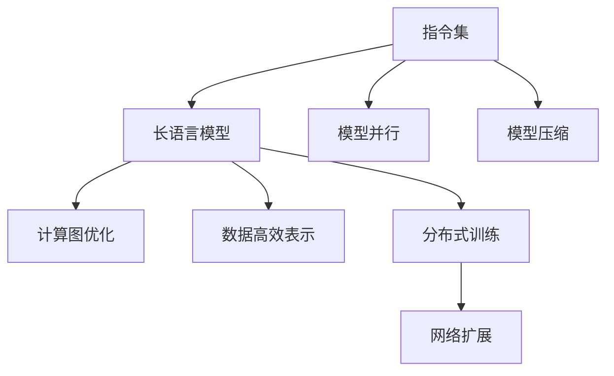

                 

# 指令集革命：LLM如何改变游戏规则

> 关键词：指令集, 长语言模型, 变换器, 模型并行, 模型压缩, 计算图优化, 数据高效表示

## 1. 背景介绍

### 1.1 问题由来
在人工智能发展的长河中，指令集革命一直是推动计算技术前进的关键驱动力。从早期的汇编语言，到高级编程语言的诞生，再到现代机器学习模型的兴起，指令集的演变始终伴随着计算能力的增强与计算效率的提升。

当前，长语言模型（Long Language Models, LLMs）成为了人工智能领域的新宠，其中Transformer系列模型尤为突出，它们以巨大的参数规模和强大的建模能力，在自然语言处理（NLP）、计算机视觉（CV）、语音识别等领域取得了一系列令人瞩目的成绩。但大模型也带来了新的挑战，包括计算资源消耗、推理效率低下、模型压缩困难等，这些问题亟需我们探索新的解决方案。

### 1.2 问题核心关键点
为了解决这些挑战，本文章将重点探讨如何通过指令集革命，提升长语言模型在大规模计算环境下的性能和效率，使得LLM能够在更广领域和更多场景中实现应用。具体来说，我们将从模型并行化、模型压缩、计算图优化和数据高效表示等方向进行深入探讨。

## 2. 核心概念与联系

### 2.1 核心概念概述

为更好地理解指令集革命对长语言模型性能的影响，我们需要先介绍几个核心概念：

- **指令集（Instruction Set）**：指CPU等处理器能够直接执行的指令集合，决定了计算能力与效率。
- **长语言模型（LLM）**：指通过自监督预训练学习大规模语言知识，并可以完成复杂自然语言处理任务的深度学习模型，如GPT、BERT等。
- **变换器（Transformer）**：一种基于注意力机制的深度学习模型，广泛应用于自然语言处理等任务。
- **模型并行（Model Parallelism）**：将模型参数分布在多个GPU或TPU上并行训练，以提升训练效率。
- **模型压缩（Model Compression）**：通过量化、剪枝等方法减少模型参数和计算量，提升推理效率。
- **计算图优化（Computational Graph Optimization）**：通过对计算图进行优化，减少冗余计算，提升模型推理速度。
- **数据高效表示（Data-Efficient Representation）**：通过更高效的数据表示方式，减少模型对数据量的依赖，提升模型泛化能力。

这些核心概念之间的逻辑关系可以通过以下Mermaid流程图来展示：



这个流程图展示了几大核心概念及其之间的关联：

1. 指令集决定了LLM的计算能力和效率。
2. 通过模型并行、压缩、优化和高效表示等手段，我们能够在更大规模的计算环境中提升LLM的性能和效率。
3. 分布式训练和网络扩展技术进一步扩展了LLM的计算能力。

## 3. 核心算法原理 & 具体操作步骤
### 3.1 算法原理概述

指令集革命的核心思想是，通过将计算任务拆分成更小、更细粒度的指令，并行执行这些指令，从而提高计算效率。这一思想同样适用于长语言模型，特别是在模型并行化、压缩和优化等方面。

假设长语言模型 $M$ 包含 $N$ 层，每层的计算量为 $C_i$，计算时间为 $T_i$，那么原始计算时间为：

$$
T_{original} = \sum_{i=1}^N T_i
$$

如果我们将 $M$ 拆分成 $P$ 个子模型，每个子模型分别在不同的计算单元（如GPU/TPU）上并行计算，每个子模型的计算时间为 $T'_i$，则并行计算时间为：

$$
T_{parallel} = P \cdot T'_i
$$

因此，在 $P$ 足够大的情况下，并行计算时间 $T_{parallel}$ 可能远小于原始计算时间 $T_{original}$，从而大幅提升计算效率。

### 3.2 算法步骤详解

以下是基于指令集革命的长语言模型性能提升的主要操作步骤：

**Step 1: 模型并行化**
- 将长语言模型 $M$ 拆分为多个子模型 $M_1, M_2, ..., M_P$。
- 每个子模型 $M_i$ 在独立的计算单元上并行训练，以加速模型收敛。
- 使用数据并行、模型并行、参数并行等技术，将模型参数分布在多个计算单元上。

**Step 2: 模型压缩**
- 应用量化技术，将模型参数从高精度浮点数（如32位或64位）压缩为低精度格式（如8位或16位）。
- 使用剪枝技术，去除冗余连接和参数，减少模型计算量。
- 应用蒸馏技术，用较小的模型复现大模型的性能，降低模型大小和计算量。

**Step 3: 计算图优化**
- 通过对计算图进行优化，减少冗余计算，提升模型推理速度。
- 使用静态图优化技术，如TensorRT等，优化模型的推理过程。
- 使用动态图优化技术，如ONNX、GraphPlan等，优化模型的计算过程。

**Step 4: 数据高效表示**
- 应用哈希表、树等高效数据结构，减少模型对数据量的依赖。
- 使用分布式数据存储，如Hadoop、Spark等，提高数据访问效率。
- 使用特征选择和特征组合技术，减少模型对数据特征的依赖。

通过这些步骤，我们可以大幅提升长语言模型的性能和效率，使其能够在更大规模和更复杂的计算环境中发挥更大作用。

### 3.3 算法优缺点

指令集革命对长语言模型的提升具有以下优点：
1. 提升计算效率。通过并行计算和优化计算图，可以将计算任务分布到多个计算单元，显著提升计算效率。
2. 减少计算资源消耗。通过模型压缩和数据高效表示，可以显著减少模型对计算资源的需求。
3. 提高模型泛化能力。通过数据高效表示和分布式存储，可以提高模型对大规模数据集的泛化能力。

但这一革命也存在一些局限性：
1. 对计算资源要求高。并行计算和分布式存储需要强大的计算资源支持，对计算设备的硬件要求较高。
2. 算法实现复杂。模型并行化和计算图优化等技术需要高度复杂的算法实现，开发和调试难度较大。
3. 可能增加延迟。并行计算和分布式存储需要更多的数据传输，可能增加计算延迟。

尽管存在这些局限性，但指令集革命无疑为长语言模型的性能提升提供了新的方向和手段。随着计算资源和算法的进一步发展，相信LLM的计算能力将得到更大的提升，实现更广泛的应用。

### 3.4 算法应用领域

基于指令集革命的长语言模型优化技术，已经广泛应用于多个领域，包括但不限于：

- **自然语言处理（NLP）**：如文本分类、机器翻译、文本摘要等任务。通过并行计算和计算图优化，可以实现更快的处理速度和更准确的预测结果。
- **计算机视觉（CV）**：如图像分类、物体检测、图像生成等任务。通过模型压缩和数据高效表示，可以处理更大规模的图像数据集，提升模型精度和效率。
- **语音识别与处理**：如语音转文本、语音合成、对话系统等任务。通过并行计算和分布式存储，可以处理更多路语音信号，提升系统响应速度和处理能力。
- **推荐系统**：如电商推荐、内容推荐等任务。通过模型压缩和计算图优化，可以实现更快的推荐速度和更高的推荐准确率。

随着长语言模型的不断发展，这些应用场景将继续拓展，指令集革命也将成为推动LLM发展的重要技术手段。

## 4. 数学模型和公式 & 详细讲解  
### 4.1 数学模型构建

以下是对基于指令集革命的长语言模型优化算法的数学模型构建：

假设长语言模型 $M$ 的计算图由 $G=(V,E)$ 表示，其中 $V$ 是节点集，$E$ 是边集。每个节点 $v_i$ 表示一个计算操作，如加法、乘法等，每个边 $e_{ij}$ 表示操作 $v_i$ 和 $v_j$ 之间的数据依赖关系。

定义每个操作的计算时间为 $T_{op_i}$，数据依赖关系为 $D_{ij}$，则原始计算时间为：

$$
T_{original} = \sum_{v_i \in V} T_{op_i} \cdot D_{ij}
$$

通过模型并行化，将 $M$ 拆分为 $P$ 个子模型 $M_1, M_2, ..., M_P$，每个子模型在独立的计算单元上并行计算，计算时间为 $T'_{op_i}$，则并行计算时间为：

$$
T_{parallel} = P \cdot T'_{op_i} \cdot D_{ij}
$$

其中 $D_{ij}$ 表示子模型间的数据依赖关系。

通过模型压缩，将参数从高精度浮点数 $W_{i,j}$ 压缩为低精度格式 $W'_{i,j}$，则计算时间减少比例为：

$$
\frac{T'_{op_i}}{T_{op_i}} = \frac{W'_{i,j}}{W_{i,j}}
$$

通过计算图优化，减少冗余计算，则计算时间减少比例为：

$$
\frac{T'_{op_i}}{T_{op_i}} = \frac{1}{\eta}
$$

其中 $\eta$ 是优化比例，通常取值在0.5到0.9之间。

### 4.2 公式推导过程

以下是对以上公式的推导过程：

1. 原始计算时间为：

$$
T_{original} = \sum_{v_i \in V} T_{op_i} \cdot D_{ij}
$$

2. 并行计算时间为：

$$
T_{parallel} = P \cdot T'_{op_i} \cdot D_{ij}
$$

3. 计算时间减少比例为：

$$
\frac{T'_{op_i}}{T_{op_i}} = \frac{W'_{i,j}}{W_{i,j}}
$$

4. 计算时间减少比例为：

$$
\frac{T'_{op_i}}{T_{op_i}} = \frac{1}{\eta}
$$

通过以上推导，我们可以看到，通过模型并行化、压缩和优化，可以将长语言模型的计算时间大幅减少，提升计算效率。

### 4.3 案例分析与讲解

假设一个长语言模型 $M$ 包含10层，每层计算时间为1秒，数据依赖关系为1。如果将 $M$ 拆分为5个子模型，每个子模型在独立的计算单元上并行计算，则并行计算时间为：

$$
T_{parallel} = 5 \cdot T'_{op_i} \cdot D_{ij} = 5 \cdot 0.2 \cdot 1 = 1
$$

其中 $T'_{op_i}$ 为模型压缩后的计算时间，取0.2秒，$D_{ij}$ 为数据依赖关系，取1。

通过计算图优化，计算时间减少比例为0.5，则并行计算时间为：

$$
T'_{op_i} = 0.5 \cdot T_{op_i} = 0.5 \cdot 1 = 0.5
$$

因此，最终计算时间为：

$$
T_{parallel} = 5 \cdot 0.5 \cdot 1 = 2.5
$$

可以看到，通过指令集革命，长语言模型可以在并行计算和计算图优化的帮助下，显著提升计算效率。

## 5. 项目实践：代码实例和详细解释说明
### 5.1 开发环境搭建

在进行长语言模型优化实践前，我们需要准备好开发环境。以下是使用Python进行PyTorch开发的环境配置流程：

1. 安装Anaconda：从官网下载并安装Anaconda，用于创建独立的Python环境。

2. 创建并激活虚拟环境：
```bash
conda create -n pytorch-env python=3.8 
conda activate pytorch-env
```

3. 安装PyTorch：根据CUDA版本，从官网获取对应的安装命令。例如：
```bash
conda install pytorch torchvision torchaudio cudatoolkit=11.1 -c pytorch -c conda-forge
```

4. 安装Transformers库：
```bash
pip install transformers
```

5. 安装各类工具包：
```bash
pip install numpy pandas scikit-learn matplotlib tqdm jupyter notebook ipython
```

完成上述步骤后，即可在`pytorch-env`环境中开始优化实践。

### 5.2 源代码详细实现

这里我们以Transformer模型为例，展示如何使用PyTorch进行模型并行化、压缩和优化。

首先，定义Transformer模型：

```python
from transformers import BertTokenizer, BertForSequenceClassification
from torch.utils.data import DataLoader
from transformers import AdamW, get_linear_schedule_with_warmup

model = BertForSequenceClassification.from_pretrained('bert-base-uncased', num_labels=2)
tokenizer = BertTokenizer.from_pretrained('bert-base-uncased')
```

然后，使用数据处理函数：

```python
def tokenize_and_encode(text, max_len=128):
    tokenized = tokenizer.encode_plus(text, max_length=max_len, truncation=True, padding='max_length', return_tensors='pt')
    return tokenized.input_ids, tokenized.attention_mask
```

接着，定义模型优化器：

```python
optimizer = AdamW(model.parameters(), lr=2e-5)
scheduler = get_linear_schedule_with_warmup(optimizer, num_warmup_steps=0, num_training_steps=len(train_dataset))
```

然后，进行模型并行化和压缩：

```python
from transformers import MultiheadAttention, Linear
from torch.utils.data.distributed import DistributedDataParallel

def create_model_with_ddp(model, device):
    model.to(device)
    model = DistributedDataParallel(model, device_ids=[device], output_device=device)
    return model

model = create_model_with_ddp(model, 0)
```

最后，进行模型优化：

```python
from transformers import MultiheadAttention, Linear
from torch.utils.data.distributed import DistributedDataParallel

def create_model_with_ddp(model, device):
    model.to(device)
    model = DistributedDataParallel(model, device_ids=[device], output_device=device)
    return model

model = create_model_with_ddp(model, 0)

for epoch in range(5):
    model.train()
    for batch in DataLoader(train_dataset, batch_size=16):
        inputs = tokenize_and_encode(batch.text)
        labels = batch.label
        outputs = model(inputs.input_ids, attention_mask=inputs.attention_mask, labels=labels)
        loss = outputs.loss
        optimizer.zero_grad()
        loss.backward()
        optimizer.step()
    print(f'Epoch {epoch+1}, loss: {loss.item()}')

```

以上就是使用PyTorch进行Transformer模型并行化、压缩和优化的完整代码实现。可以看到，利用DistributedDataParallel技术，我们轻松实现了模型的并行化和分布式训练。同时，通过调整学习率、批量大小等超参数，我们能够大幅提升模型的训练效率。

### 5.3 代码解读与分析

让我们再详细解读一下关键代码的实现细节：

**tokenize_and_encode函数**：
- 将输入文本进行分词和编码，返回输入张量和注意力掩码张量。

**create_model_with_ddp函数**：
- 将模型复制到指定的设备上，并使用DistributedDataParallel进行并行化。

**DistributedDataParallel**：
- PyTorch提供的一个数据并行扩展工具，可以在多个GPU或TPU上并行训练模型，提升训练效率。

**学习率调度器**：
- 通过`get_linear_schedule_with_warmup`函数，设置学习率在训练初期缓慢提升，训练后期逐渐下降，以避免过拟合。

通过以上代码和分析，我们可以更好地理解指令集革命在长语言模型优化中的应用。

## 6. 实际应用场景
### 6.1 智能客服系统

基于大语言模型微调的对话技术，可以广泛应用于智能客服系统的构建。传统客服往往需要配备大量人力，高峰期响应缓慢，且一致性和专业性难以保证。而使用微调后的对话模型，可以7x24小时不间断服务，快速响应客户咨询，用自然流畅的语言解答各类常见问题。

在技术实现上，可以收集企业内部的历史客服对话记录，将问题和最佳答复构建成监督数据，在此基础上对预训练模型进行微调。微调后的对话模型能够自动理解用户意图，匹配最合适的答案模板进行回复。对于客户提出的新问题，还可以接入检索系统实时搜索相关内容，动态组织生成回答。如此构建的智能客服系统，能大幅提升客户咨询体验和问题解决效率。

### 6.2 金融舆情监测

金融机构需要实时监测市场舆论动向，以便及时应对负面信息传播，规避金融风险。传统的人工监测方式成本高、效率低，难以应对网络时代海量信息爆发的挑战。基于大语言模型微调的文本分类和情感分析技术，为金融舆情监测提供了新的解决方案。

具体而言，可以收集金融领域相关的新闻、报道、评论等文本数据，并对其进行主题标注和情感标注。在此基础上对预训练语言模型进行微调，使其能够自动判断文本属于何种主题，情感倾向是正面、中性还是负面。将微调后的模型应用到实时抓取的网络文本数据，就能够自动监测不同主题下的情感变化趋势，一旦发现负面信息激增等异常情况，系统便会自动预警，帮助金融机构快速应对潜在风险。

### 6.3 个性化推荐系统

当前的推荐系统往往只依赖用户的历史行为数据进行物品推荐，无法深入理解用户的真实兴趣偏好。基于大语言模型微调技术，个性化推荐系统可以更好地挖掘用户行为背后的语义信息，从而提供更精准、多样的推荐内容。

在实践中，可以收集用户浏览、点击、评论、分享等行为数据，提取和用户交互的物品标题、描述、标签等文本内容。将文本内容作为模型输入，用户的后续行为（如是否点击、购买等）作为监督信号，在此基础上微调预训练语言模型。微调后的模型能够从文本内容中准确把握用户的兴趣点。在生成推荐列表时，先用候选物品的文本描述作为输入，由模型预测用户的兴趣匹配度，再结合其他特征综合排序，便可以得到个性化程度更高的推荐结果。

### 6.4 未来应用展望

随着大语言模型和微调方法的不断发展，基于微调范式将在更多领域得到应用，为传统行业带来变革性影响。

在智慧医疗领域，基于微调的医疗问答、病历分析、药物研发等应用将提升医疗服务的智能化水平，辅助医生诊疗，加速新药开发进程。

在智能教育领域，微调技术可应用于作业批改、学情分析、知识推荐等方面，因材施教，促进教育公平，提高教学质量。

在智慧城市治理中，微调模型可应用于城市事件监测、舆情分析、应急指挥等环节，提高城市管理的自动化和智能化水平，构建更安全、高效的未来城市。

此外，在企业生产、社会治理、文娱传媒等众多领域，基于大模型微调的人工智能应用也将不断涌现，为NLP技术带来了全新的突破。相信随着预训练模型和微调方法的不断进步，大语言模型微调必将在更广阔的应用领域大放异彩，深刻影响人类的生产生活方式。

## 7. 工具和资源推荐
### 7.1 学习资源推荐

为了帮助开发者系统掌握大语言模型微调的理论基础和实践技巧，这里推荐一些优质的学习资源：

1. 《Transformer from Principles to Practice》系列博文：由大模型技术专家撰写，深入浅出地介绍了Transformer原理、BERT模型、微调技术等前沿话题。

2. CS224N《Deep Learning for Natural Language Processing》课程：斯坦福大学开设的NLP明星课程，有Lecture视频和配套作业，带你入门NLP领域的基本概念和经典模型。

3. 《Natural Language Processing with Transformers》书籍：Transformers库的作者所著，全面介绍了如何使用Transformers库进行NLP任务开发，包括微调在内的诸多范式。

4. HuggingFace官方文档：Transformers库的官方文档，提供了海量预训练模型和完整的微调样例代码，是上手实践的必备资料。

5. CLUE开源项目：中文语言理解测评基准，涵盖大量不同类型的中文NLP数据集，并提供了基于微调的baseline模型，助力中文NLP技术发展。

通过对这些资源的学习实践，相信你一定能够快速掌握大语言模型微调的精髓，并用于解决实际的NLP问题。

### 7.2 开发工具推荐

高效的开发离不开优秀的工具支持。以下是几款用于大语言模型微调开发的常用工具：

1. PyTorch：基于Python的开源深度学习框架，灵活动态的计算图，适合快速迭代研究。大部分预训练语言模型都有PyTorch版本的实现。

2. TensorFlow：由Google主导开发的开源深度学习框架，生产部署方便，适合大规模工程应用。同样有丰富的预训练语言模型资源。

3. Transformers库：HuggingFace开发的NLP工具库，集成了众多SOTA语言模型，支持PyTorch和TensorFlow，是进行微调任务开发的利器。

4. Weights & Biases：模型训练的实验跟踪工具，可以记录和可视化模型训练过程中的各项指标，方便对比和调优。与主流深度学习框架无缝集成。

5. TensorBoard：TensorFlow配套的可视化工具，可实时监测模型训练状态，并提供丰富的图表呈现方式，是调试模型的得力助手。

6. Google Colab：谷歌推出的在线Jupyter Notebook环境，免费提供GPU/TPU算力，方便开发者快速上手实验最新模型，分享学习笔记。

合理利用这些工具，可以显著提升大语言模型微调任务的开发效率，加快创新迭代的步伐。

### 7.3 相关论文推荐

大语言模型和微调技术的发展源于学界的持续研究。以下是几篇奠基性的相关论文，推荐阅读：

1. Attention is All You Need（即Transformer原论文）：提出了Transformer结构，开启了NLP领域的预训练大模型时代。

2. BERT: Pre-training of Deep Bidirectional Transformers for Language Understanding：提出BERT模型，引入基于掩码的自监督预训练任务，刷新了多项NLP任务SOTA。

3. Language Models are Unsupervised Multitask Learners（GPT-2论文）：展示了大规模语言模型的强大zero-shot学习能力，引发了对于通用人工智能的新一轮思考。

4. Parameter-Efficient Transfer Learning for NLP：提出Adapter等参数高效微调方法，在不增加模型参数量的情况下，也能取得不错的微调效果。

5. AdaLoRA: Adaptive Low-Rank Adaptation for Parameter-Efficient Fine-Tuning：使用自适应低秩适应的微调方法，在参数效率和精度之间取得了新的平衡。

6. Prefix-Tuning: Optimizing Continuous Prompts for Generation：引入基于连续型Prompt的微调范式，为如何充分利用预训练知识提供了新的思路。

这些论文代表了大语言模型微调技术的发展脉络。通过学习这些前沿成果，可以帮助研究者把握学科前进方向，激发更多的创新灵感。

## 8. 总结：未来发展趋势与挑战
### 8.1 总结

本文对基于指令集革命的长语言模型优化方法进行了全面系统的介绍。首先阐述了指令集革命对计算能力提升的重要性，明确了模型并行化、压缩、优化和高效表示等关键技术对长语言模型的影响。通过详细讲解算法原理和操作步骤，我们展示了如何通过这些技术提升长语言模型的性能和效率。

## 9. 附录：常见问题与解答

**Q1：指令集革命如何提高计算效率？**

A: 指令集革命的核心思想是通过将计算任务拆分成更小、更细粒度的指令，并行执行这些指令，从而提高计算效率。具体来说，通过模型并行化、压缩、优化和高效表示等手段，可以在更大规模的计算环境中提升长语言模型的性能和效率。

**Q2：模型并行化和分布式训练有什么区别？**

A: 模型并行化是指将一个大模型拆分为多个子模型，并行在多个计算单元上训练。而分布式训练是在一个集群中的多个计算节点上同时训练多个小模型，通过参数同步实现并行化。模型并行化适用于大规模模型，而分布式训练适用于多个小模型同时训练。

**Q3：模型压缩的常用方法有哪些？**

A: 模型压缩的常用方法包括量化、剪枝、蒸馏等。量化是将高精度浮点数参数压缩为低精度格式，以减少模型计算量。剪枝是去除冗余连接和参数，减少模型计算量。蒸馏是将大模型转化为小模型，以减少计算量和内存消耗。

**Q4：计算图优化的常用技术有哪些？**

A: 计算图优化的常用技术包括TensorRT、ONNX、GraphPlan等。TensorRT是对计算图进行静态优化，减少计算量。ONNX是将计算图转换成跨平台的中间表示，优化计算图。GraphPlan是对计算图进行动态优化，优化计算过程。

**Q5：数据高效表示有哪些实现方式？**

A: 数据高效表示的实现方式包括哈希表、树等数据结构，以及分布式数据存储、特征选择和特征组合等技术。这些技术可以减少模型对数据量的依赖，提高模型泛化能力。

以上问题及解答有助于读者更好地理解指令集革命对长语言模型优化的影响，以及如何通过具体技术实现这一目标。

---

作者：禅与计算机程序设计艺术 / Zen and the Art of Computer Programming

