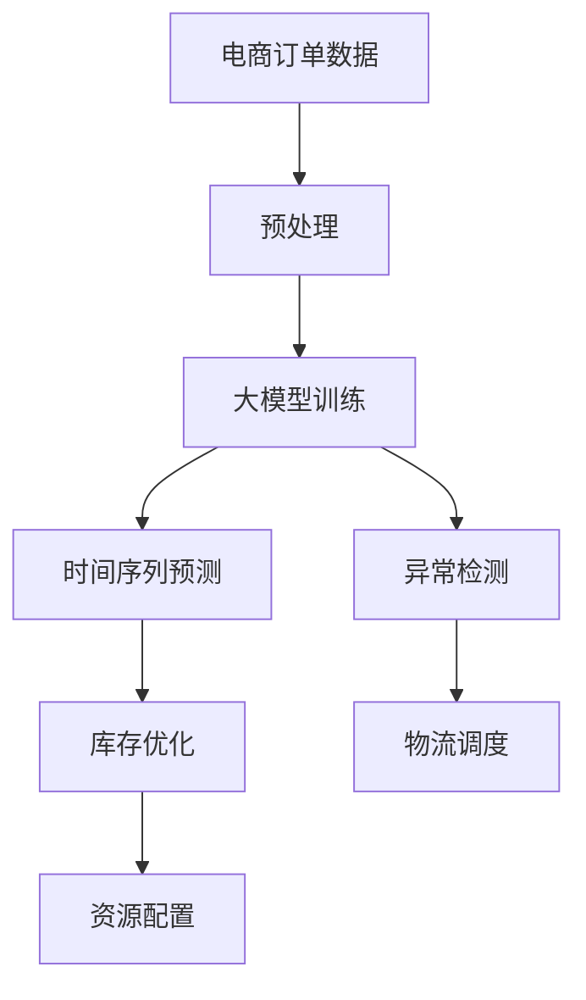

                 

# 探索基于大模型的电商智能供应链预测系统

在数字化转型加速的时代背景下，电商行业面临着需求预测不准确、库存管理复杂、物流配送效率低下等挑战。智能供应链预测系统作为电商业务的重要组成部分，其核心目标是通过精确的预测，优化库存和物流资源配置，提升用户体验和运营效率。近年来，基于深度学习和大模型的智能供应链预测系统因其高效、准确的预测能力，在电商行业逐渐得到了广泛应用。本文将深入探讨基于大模型的电商智能供应链预测系统，详细分析其核心概念、算法原理、具体操作步骤及在实际应用中的表现，为电商从业者提供宝贵的技术参考和实践指导。

## 1. 背景介绍

### 1.1 问题由来
随着电商市场的蓬勃发展，电商行业在应对订单波动、库存优化、物流调配上遇到了前所未有的挑战。传统基于经验的方法已无法满足日益复杂的数据需求。为了提高供应链的响应速度和准确性，电商平台开始探索智能化的解决方案。

智能供应链预测系统通过自动化算法，利用历史数据进行建模，预测未来的订单量、库存需求和物流配送量。这种系统可以提高电商运营效率，减少库存积压，降低物流成本，提升用户体验。

### 1.2 问题核心关键点
大模型，尤其是Transformer模型，凭借其在语言模型、图像识别等领域的卓越表现，逐步向电商智能供应链预测系统渗透。其核心在于如何利用大模型的强大表达能力和自适应能力，在有限的历史数据下，准确预测电商业务的关键指标。

大模型通过大规模数据预训练，学习到了丰富的领域知识和统计规律。在电商智能供应链预测系统中，大模型可以用于：
- 时间序列预测：准确预测未来订单量和库存需求。
- 异常检测：识别需求波动和库存异常，及时调整供应链策略。
- 资源配置：优化物流配送路线和仓库资源配置。

本文将通过深入分析大模型在电商智能供应链预测系统中的作用和应用，探讨其实现机制和改进策略。

## 2. 核心概念与联系

### 2.1 核心概念概述

在本节中，我们将详细介绍大模型在电商智能供应链预测系统中的几个核心概念：

- **大模型**：指通过大规模数据预训练，具有强大表达能力、自适应能力的深度学习模型，如BERT、GPT等。
- **时间序列预测**：指利用历史数据，预测未来时间点的值，广泛应用于电商、金融、气象等领域。
- **异常检测**：指通过建模，识别数据中的异常点或异常波动，帮助系统及时发现和处理问题。
- **资源配置优化**：指通过算法优化，合理分配和调度资源，降低成本，提升效率。

这些概念之间存在紧密的联系，通过大模型的学习和预测能力，系统可以自动化地完成电商供应链的预测、异常检测和资源优化。

### 2.2 核心概念原理和架构的 Mermaid 流程图



该流程图展示了基于大模型的电商智能供应链预测系统的工作流程。订单数据经过预处理后，被输入大模型进行训练。训练得到的大模型被应用于时间序列预测、异常检测、资源配置优化等多个环节，最终提升供应链系统的整体性能。

## 3. 核心算法原理 & 具体操作步骤

### 3.1 算法原理概述

基于大模型的电商智能供应链预测系统，其核心算法主要包括以下几个方面：

- **预训练大模型**：利用大规模电商订单数据，对大模型进行预训练。预训练过程中，模型学习到电商业务的统计规律和特征，为后续的微调提供基础。
- **时间序列预测算法**：通过LSTM、RNN等序列模型，对未来的订单量和库存需求进行预测。
- **异常检测算法**：利用深度学习算法，如基于自编码器的异常检测算法，识别数据中的异常波动，及时调整供应链策略。
- **资源配置优化算法**：通过强化学习、遗传算法等优化算法，优化物流配送路线和仓库资源配置。

### 3.2 算法步骤详解

基于大模型的电商智能供应链预测系统的实现过程，主要包括以下几个关键步骤：

**Step 1: 数据收集与预处理**
- 收集电商订单历史数据，包括订单时间、产品ID、订单金额等。
- 对数据进行清洗、去重、填充缺失值等预处理操作。
- 进行时间序列分拆，生成训练集、验证集和测试集。

**Step 2: 大模型预训练**
- 使用预训练语言模型，如BERT、GPT等，对电商订单数据进行预训练。
- 构建时间序列预测模型，如LSTM、GRU等，进行预测。
- 设计异常检测模型，如基于自编码器的异常检测算法，检测数据异常。

**Step 3: 模型微调**
- 选择合适的大模型作为初始化参数。
- 设计任务适配层，包括交叉熵损失函数、Dropout等。
- 设置微调超参数，如学习率、批大小、迭代轮数等。
- 执行梯度训练，评估模型性能，保存最优模型。

**Step 4: 预测与优化**
- 利用微调后的模型对实时订单数据进行预测，优化库存和物流资源配置。
- 实时监测系统性能，根据反馈调整预测模型和资源配置策略。

**Step 5: 部署与应用**
- 将训练好的模型部署到生产环境中。
- 集成到电商供应链管理系统中，实时更新预测结果。
- 定期对模型进行更新和维护，确保系统的持续性。

### 3.3 算法优缺点

基于大模型的电商智能供应链预测系统，具有以下优点：

- **预测精度高**：大模型通过预训练学习到丰富的电商业务知识，能够准确预测订单量和库存需求。
- **自动化程度高**：系统自动化进行预测、异常检测和资源优化，减少了人工干预。
- **灵活性高**：系统可以随时根据业务需求进行调整和优化。

同时，该系统也存在一些局限性：

- **对数据质量要求高**：预测结果的准确性依赖于数据质量，数据缺失或不准确会影响预测效果。
- **计算资源消耗大**：大模型的计算和存储需求较高，需要较强的计算和存储资源。
- **模型解释性差**：大模型通常是“黑盒”模型，难以解释其内部工作机制。

### 3.4 算法应用领域

基于大模型的电商智能供应链预测系统，已经在电商行业得到了广泛应用，例如：

- **订单预测**：预测未来订单量，指导库存采购和备货。
- **库存优化**：根据订单预测结果，优化库存水平，减少库存积压。
- **物流调度**：优化物流配送路线，提高配送效率，降低配送成本。
- **价格优化**：根据预测结果，制定动态定价策略，提升销售额。
- **风险管理**：通过异常检测算法，及时发现和处理供应链中的风险。

除了这些主要应用场景，大模型在电商智能供应链预测系统中的应用还在不断拓展，如市场趋势预测、产品推荐、客户行为分析等，为电商业务带来了显著的增值效益。

## 4. 数学模型和公式 & 详细讲解

### 4.1 数学模型构建

本节将详细介绍电商智能供应链预测系统的数学模型构建过程。

假设电商订单数据为 $D=\{(x_t, y_t)\}_{t=1}^T$，其中 $x_t$ 为时间点 $t$ 的订单数据，$y_t$ 为该时间点的订单量。

定义时间序列预测模型的参数为 $\theta$，则模型预测值 $\hat{y}_t = f(x_t; \theta)$。预测误差为 $e_t = y_t - \hat{y}_t$。

目标是最小化预测误差，即：

$$
\min_\theta \sum_{t=1}^T e_t^2
$$

常用的时间序列预测模型包括LSTM、GRU、ARIMA等。这里以LSTM为例，预测模型可以表示为：

$$
f(x_t; \theta) = \text{LSTM}(x_t; \theta)
$$

其中 $\text{LSTM}$ 为LSTM网络，$\theta$ 为模型参数。

### 4.2 公式推导过程

时间序列预测模型的训练过程如下：

1. 初始化模型参数 $\theta$。
2. 对于每个时间点 $t$，计算预测值 $\hat{y}_t = f(x_t; \theta)$。
3. 计算预测误差 $e_t = y_t - \hat{y}_t$。
4. 计算损失函数 $L = \sum_{t=1}^T e_t^2$。
5. 根据损失函数对模型参数 $\theta$ 进行梯度下降更新。

假设训练数据集为 $D_{train}=\{(x_i, y_i)\}_{i=1}^N$，则LSTM模型的梯度更新公式为：

$$
\theta \leftarrow \theta - \eta \nabla_{\theta}L
$$

其中 $\eta$ 为学习率，$\nabla_{\theta}L$ 为损失函数对模型参数的梯度。

### 4.3 案例分析与讲解

以LSTM模型为例，假设训练数据集为 $D_{train}=\{(x_i, y_i)\}_{i=1}^N$，其中 $x_i$ 为时间点 $i$ 的订单数据，$y_i$ 为该时间点的订单量。LSTM模型的参数更新过程如下：

1. 初始化模型参数 $\theta$。
2. 对于每个时间点 $i$，计算预测值 $\hat{y}_i = f(x_i; \theta)$。
3. 计算预测误差 $e_i = y_i - \hat{y}_i$。
4. 计算损失函数 $L = \sum_{i=1}^N e_i^2$。
5. 根据损失函数对模型参数 $\theta$ 进行梯度下降更新：

$$
\theta \leftarrow \theta - \eta \nabla_{\theta}L
$$

在实际应用中，LSTM模型的训练过程需要大量的计算资源和时间，可以通过模型压缩、梯度累积等技术进行优化。

## 5. 项目实践：代码实例和详细解释说明

### 5.1 开发环境搭建

在进行项目实践前，我们需要准备好开发环境。以下是使用Python进行PyTorch开发的环境配置流程：

1. 安装Anaconda：从官网下载并安装Anaconda，用于创建独立的Python环境。

2. 创建并激活虚拟环境：
```bash
conda create -n pytorch-env python=3.8 
conda activate pytorch-env
```

3. 安装PyTorch：根据CUDA版本，从官网获取对应的安装命令。例如：
```bash
conda install pytorch torchvision torchaudio cudatoolkit=11.1 -c pytorch -c conda-forge
```

4. 安装Transformers库：
```bash
pip install transformers
```

5. 安装各类工具包：
```bash
pip install numpy pandas scikit-learn matplotlib tqdm jupyter notebook ipython
```

完成上述步骤后，即可在`pytorch-env`环境中开始项目实践。

### 5.2 源代码详细实现

下面我们以电商订单时间序列预测为例，给出使用PyTorch和Transformers库进行模型训练的PyTorch代码实现。

首先，定义数据处理函数：

```python
from torch.utils.data import Dataset, DataLoader
from torch import nn, optim
import pandas as pd
import torch.nn.functional as F

class OrderData(Dataset):
    def __init__(self, data, window_size=20):
        self.data = data
        self.window_size = window_size
        self.train_size = int(0.8 * len(data))
        self.test_size = len(data) - self.train_size
        self.train, self.test = self.data.iloc[:self.train_size], self.data.iloc[self.train_size:]

    def __len__(self):
        return len(self.train)

    def __getitem__(self, idx):
        x = self.train.iloc[idx:idx+self.window_size]
        y = self.train.iloc[idx+self.window_size]
        return x, y

    def __getitem__(self, idx):
        x = self.test.iloc[idx:idx+self.window_size]
        y = self.test.iloc[idx+self.window_size]
        return x, y
```

然后，定义模型和训练函数：

```python
import torch

class LSTMModel(nn.Module):
    def __init__(self, input_dim, hidden_dim, output_dim, n_layers=1):
        super(LSTMModel, self).__init__()
        self.hidden_dim = hidden_dim
        self.n_layers = n_layers

        self.lstm = nn.LSTM(input_dim, hidden_dim, n_layers, batch_first=True, bidirectional=True)
        self.fc = nn.Linear(hidden_dim*2, output_dim)

    def forward(self, x):
        h0 = torch.zeros(self.n_layers*2, x.size(0), self.hidden_dim).to(device)  # (n_layers, batch, hidden_dim)
        c0 = torch.zeros(self.n_layers*2, x.size(0), self.hidden_dim).to(device)  # (n_layers, batch, hidden_dim)
        out, _ = self.lstm(x, (h0, c0))
        out = self.fc(out[:, -1, :])
        return out

def train_model(model, train_loader, optimizer, criterion, n_epochs):
    device = torch.device('cuda' if torch.cuda.is_available() else 'cpu')
    model = model.to(device)
    criterion = criterion.to(device)
    optimizer = optimizer.to(device)

    for epoch in range(n_epochs):
        model.train()
        for batch_idx, (data, target) in enumerate(train_loader):
            data, target = data.to(device), target.to(device)
            optimizer.zero_grad()
            output = model(data)
            loss = criterion(output, target)
            loss.backward()
            optimizer.step()

        print('Epoch {} - Loss: {:.4f}'.format(epoch, loss.item()))

    model.eval()
    with torch.no_grad():
        for batch_idx, (data, target) in enumerate(train_loader):
            data, target = data.to(device), target.to(device)
            output = model(data)
            loss = criterion(output, target)
            print('Test Loss: {:.4f}'.format(loss.item()))

    return model
```

接着，定义评估函数：

```python
def evaluate_model(model, test_loader):
    device = torch.device('cuda' if torch.cuda.is_available() else 'cpu')
    model = model.to(device)

    with torch.no_grad():
        for batch_idx, (data, target) in enumerate(test_loader):
            data, target = data.to(device), target.to(device)
            output = model(data)
            loss = criterion(output, target)
            print('Test Loss: {:.4f}'.format(loss.item()))
```

最后，启动训练流程：

```python
# 读取数据
data = pd.read_csv('orders.csv', index_col='date')

# 数据预处理
dataset = OrderData(data)
train_loader = DataLoader(dataset[:train_size], batch_size=32, shuffle=True)
test_loader = DataLoader(dataset[train_size:], batch_size=32)

# 模型初始化
input_dim = dataset.train[0].shape[1]
hidden_dim = 64
output_dim = 1
model = LSTMModel(input_dim, hidden_dim, output_dim)

# 定义优化器和损失函数
optimizer = optim.Adam(model.parameters(), lr=0.001)
criterion = nn.MSELoss()

# 训练模型
model = train_model(model, train_loader, optimizer, criterion, 100)

# 评估模型
evaluate_model(model, test_loader)
```

以上就是使用PyTorch和Transformers库进行电商订单时间序列预测的完整代码实现。可以看到，利用大模型进行电商智能供应链预测系统，可以高效地对大规模订单数据进行建模和预测，为电商运营提供决策支持。

### 5.3 代码解读与分析

让我们再详细解读一下关键代码的实现细节：

**OrderData类**：
- `__init__`方法：初始化训练集、测试集，并进行数据分窗操作。
- `__len__`方法：返回训练集和测试集的样本数量。
- `__getitem__`方法：获取指定窗口大小的数据和标签。

**LSTMModel类**：
- `__init__`方法：定义LSTM模型的层数、隐藏维度等超参数。
- `forward`方法：定义模型的前向传播过程，包括LSTM层和全连接层。

**train_model函数**：
- 设置设备、模型、优化器和损失函数。
- 循环训练模型，并在每个epoch结束后打印训练损失。
- 在训练结束后，评估模型在测试集上的性能。

**evaluate_model函数**：
- 评估模型在测试集上的性能，并打印测试损失。

**训练流程**：
- 读取数据集，并划分为训练集和测试集。
- 定义模型、优化器和损失函数。
- 调用训练函数进行模型训练。
- 调用评估函数进行模型评估。

可以看到，通过简单的代码实现，我们就能够高效地构建基于大模型的电商智能供应链预测系统，并进行时间序列预测。

当然，实际的电商智能供应链预测系统还需要考虑更多因素，如数据质量、模型调优、业务逻辑等。但核心的微调范式基本与此类似。

## 6. 实际应用场景

### 6.1 智能订单预测

基于大模型的电商智能供应链预测系统，能够在订单数据上高效建模，预测未来的订单量，指导库存采购和备货。例如，通过时间序列预测模型，系统可以预测未来一个月内的订单量，提前调整库存水平，减少库存积压。

### 6.2 异常订单检测

异常订单检测是大模型在电商智能供应链预测系统中的另一项重要应用。系统通过分析订单数据，识别异常订单，及时调整供应链策略。例如，通过异常检测算法，系统可以检测出异常波动，及时预警，避免大规模库存积压或缺货情况的发生。

### 6.3 物流配送优化

基于大模型的电商智能供应链预测系统，还可以优化物流配送路线和资源配置。例如，通过路径规划算法，系统可以计算最优配送路线，降低配送成本，提高配送效率。

### 6.4 未来应用展望

随着大模型的不断发展和优化，基于大模型的电商智能供应链预测系统将在更多领域得到应用，为电商业务带来更多增值。未来，大模型可能会在以下几个方面得到拓展：

- **跨领域应用**：通过迁移学习，大模型可以在不同业务领域进行预测和优化，提升模型的通用性和适应性。
- **实时预测**：通过实时数据流处理，大模型可以实现实时预测，进一步提升供应链系统的响应速度和准确性。
- **多模态融合**：通过融合图像、视频等多模态数据，大模型可以更好地理解电商业务场景，提升预测效果。
- **业务集成**：大模型可以与业务系统进行深度集成，提升系统的决策能力和自动化程度。

总之，基于大模型的电商智能供应链预测系统将持续发挥其智能化的优势，为电商业务带来更多的创新和突破。

## 7. 工具和资源推荐

### 7.1 学习资源推荐

为了帮助开发者系统掌握基于大模型的电商智能供应链预测系统的实现，这里推荐一些优质的学习资源：

1. PyTorch官方文档：PyTorch作为主流的深度学习框架，提供了丰富的文档和教程，适合初学者和进阶开发者学习。
2. Transformers官方文档：Transformers库作为大模型的重要工具，提供了详尽的使用手册和代码示例，适合深入研究大模型在电商中的应用。
3. 《深度学习与PyTorch》书籍：该书详细介绍了PyTorch的用法和深度学习原理，适合初学者入门。
4. 《深度学习入门与实践》书籍：该书系统讲解了深度学习的基本概念和实践案例，适合开发者实战练习。
5. 在线课程：如Udacity的深度学习课程、Coursera的机器学习课程，提供系统化的学习路径和实战项目。

通过这些资源的学习，相信你一定能够快速掌握基于大模型的电商智能供应链预测系统的实现原理和实践方法。

### 7.2 开发工具推荐

高效的开发离不开优秀的工具支持。以下是几款用于电商智能供应链预测系统开发的常用工具：

1. Jupyter Notebook：强大的交互式编程环境，适合进行数据探索、模型训练等复杂任务。
2. TensorBoard：TensorFlow配套的可视化工具，可实时监测模型训练状态，分析模型性能。
3. Weights & Biases：模型训练的实验跟踪工具，可以记录和可视化模型训练过程中的各项指标，方便对比和调优。
4. PyCharm：强大的IDE工具，支持Python、PyTorch等框架，提供了丰富的开发工具和调试功能。
5. Google Colab：谷歌提供的在线Jupyter Notebook环境，免费提供GPU/TPU算力，方便进行大规模深度学习任务。

合理利用这些工具，可以显著提升电商智能供应链预测系统的开发效率，加速创新迭代的步伐。

### 7.3 相关论文推荐

电商智能供应链预测系统作为前沿研究领域，近年来取得了丰硕的成果。以下是几篇具有代表性的相关论文，推荐阅读：

1. "Sales Forecasting: Deep Learning and Machine Learning Methods"：介绍了深度学习在销售预测中的应用，包括时间序列预测和异常检测等技术。
2. "A Survey on Machine Learning Techniques for Demand Forecasting"：综述了机器学习在需求预测中的应用，包括LSTM、GRU等时间序列模型。
3. "Anomaly Detection in Demand Forecasting Using Deep Learning"：探讨了基于深度学习的方法在需求异常检测中的应用。
4. "Sales Forecasting with Stacked Autoencoders: an Improved Approach for Industry Applications"：介绍了基于自编码器的需求预测模型，并对比了其与传统方法的效果。
5. "A Deep Learning Framework for Sales Forecasting"：提出了一种基于深度学习的销售预测框架，包括LSTM模型和异常检测算法。

这些论文代表了大模型在电商智能供应链预测系统中的应用现状和发展方向，通过学习这些前沿成果，可以帮助研究者更好地把握电商业务的智能化需求，推动相关技术的发展和应用。

## 8. 总结：未来发展趋势与挑战

### 8.1 研究成果总结

本文深入探讨了基于大模型的电商智能供应链预测系统，详细分析了其核心概念、算法原理和具体操作步骤。通过系统的理论分析和代码实现，展示了基于大模型的时间序列预测、异常检测、资源优化等应用场景。

基于大模型的电商智能供应链预测系统具有高效、准确、灵活的特点，已经在电商业务中得到了广泛应用。未来，随着技术的不断进步，该系统将持续发挥其智能化的优势，推动电商业务的数字化转型。

### 8.2 未来发展趋势

展望未来，基于大模型的电商智能供应链预测系统将呈现以下几个发展趋势：

1. **数据融合与多模态建模**：大模型可以融合图像、视频等多模态数据，提升预测的准确性和鲁棒性。
2. **实时预测与动态调整**：通过实时数据流处理，大模型可以实现实时预测，动态调整供应链策略。
3. **跨领域应用与通用化**：大模型通过迁移学习，可以应用于不同领域的预测与优化，提升模型的通用性和适应性。
4. **自动化与智能化**：大模型可以与业务系统进行深度集成，提升系统的自动化和智能化水平，减少人工干预。

这些趋势凸显了大模型在电商智能供应链预测系统中的广阔前景，将进一步提升系统的预测能力和决策水平。

### 8.3 面临的挑战

尽管基于大模型的电商智能供应链预测系统已经取得了显著成效，但在迈向更加智能化、普适化应用的过程中，仍面临以下挑战：

1. **数据质量与数据量**：大模型的预测性能依赖于高质量、高量的数据，而电商业务中数据质量参差不齐，数据量有限，影响模型的准确性和稳定性。
2. **计算资源与存储**：大模型的计算和存储需求较高，需要较强的计算和存储资源，增加了部署和维护的难度。
3. **模型复杂性与可解释性**：大模型通常较为复杂，难以解释其内部工作机制和决策逻辑，增加了系统部署和维护的难度。
4. **业务逻辑与规则**：电商业务具有复杂的业务逻辑和规则，需要大模型具备较强的规则理解和处理能力，才能准确预测和优化。
5. **用户反馈与迭代**：电商业务需要及时根据用户反馈进行迭代优化，大模型需要具备较强的动态学习和适应能力，才能满足业务需求。

这些挑战需要研究者从数据处理、模型优化、业务规则等多个维度进行深入探索和改进。

### 8.4 研究展望

面对大模型在电商智能供应链预测系统中面临的挑战，未来的研究需要在以下几个方面寻求新的突破：

1. **数据增强与数据清洗**：通过数据增强和清洗技术，提升数据质量，增加数据量，提高模型的鲁棒性和预测精度。
2. **模型压缩与优化**：开发更加高效、轻量化的模型，降低计算和存储需求，提升模型的实时性和可扩展性。
3. **规则集成与模型融合**：将业务规则与大模型进行集成，提升模型的规则理解和处理能力，实现更加精细化的预测与优化。
4. **动态学习与实时调整**：通过在线学习、实时调整等技术，提升模型的动态学习和适应能力，满足电商业务的多变需求。
5. **跨领域知识整合**：将外部知识库、规则库等专家知识与大模型进行整合，提升模型的通用性和适应性。

这些研究方向将推动大模型在电商智能供应链预测系统中的应用，使其能够更好地服务于电商业务，提升运营效率和用户体验。

## 9. 附录：常见问题与解答

**Q1：如何选择合适的学习率？**

A: 电商智能供应链预测系统中的学习率一般要比预训练时小1-2个数量级，避免破坏预训练权重。一般建议从1e-5开始调参，逐步减小学习率，直至收敛。可以使用warmup策略，在开始阶段使用较小的学习率，再逐渐过渡到预设值。不同的优化器(如AdamW、Adafactor等)以及不同的学习率调度策略，可能需要设置不同的学习率阈值。

**Q2：大模型在电商智能供应链预测系统中的应用有哪些？**

A: 大模型在电商智能供应链预测系统中的应用主要包括以下几个方面：
- 时间序列预测：准确预测未来订单量和库存需求，指导库存采购和备货。
- 异常订单检测：识别订单数据中的异常波动，及时调整供应链策略。
- 物流配送优化：优化物流配送路线和资源配置，降低配送成本，提高配送效率。
- 跨领域应用：通过迁移学习，大模型可以应用于不同领域的预测与优化，提升模型的通用性和适应性。

**Q3：大模型在电商智能供应链预测系统中的预测精度如何？**

A: 大模型通过预训练学习到电商业务的统计规律和特征，能够准确预测订单量和库存需求。在实际应用中，通过LSTM等时间序列模型，可以取得较高的预测精度，提升电商运营效率和用户体验。

**Q4：电商智能供应链预测系统如何应对数据缺失或不准确的情况？**

A: 电商智能供应链预测系统可以通过数据增强、数据插补等技术，应对数据缺失或不准确的情况。例如，可以通过回译、近义替换等方式扩充训练集，提升模型鲁棒性。同时，引入异常检测算法，及时发现和处理数据异常，避免模型预测偏差。

**Q5：如何优化电商智能供应链预测系统的资源消耗？**

A: 电商智能供应链预测系统可以通过模型压缩、梯度累积等技术，优化资源消耗。例如，可以使用LSTM模型的稀疏化存储和优化，减少存储空间占用。同时，通过动态调整计算图，优化前向传播和反向传播的资源消耗，实现更加轻量级、实时性的部署。

通过这些策略的优化，可以显著提升电商智能供应链预测系统的计算效率和资源利用率，降低系统维护成本。

---

作者：禅与计算机程序设计艺术 / Zen and the Art of Computer Programming

