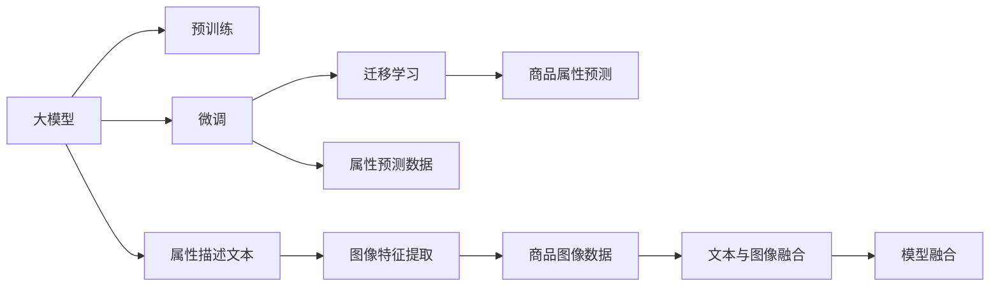

                 

# 探索基于大模型的电商智能商品属性预测系统

## 1. 背景介绍

### 1.1 电商智能系统的兴起

随着电子商务平台的兴起，用户对于商品的搜索和推荐已经不再局限于简单关键字匹配，而是逐渐向智能化的方向发展。电商企业希望利用算法为用户提供更加精准的商品推荐，提升用户体验和购买转化率。智能推荐系统正在成为电商企业吸引用户、提升销量和优化库存的重要手段。

在智能推荐系统构建中，商品属性预测是一个关键任务。商品属性指商品的各种特征，如价格、颜色、尺寸、品牌等，属性预测系统的准确性直接影响推荐结果的质量。传统的商品属性预测方法依赖于规则和特征工程，难以应对大规模数据和复杂场景，且计算效率低下。近年来，基于大模型的深度学习技术在电商推荐系统中逐渐崭露头角，大模型以其强大的特征提取能力，为属性预测系统带来了新的发展机遇。

### 1.2 大模型的能力

大模型指通过预训练大规模无标签数据，学习到通用语言和图像表示的神经网络模型。如BERT、GPT、DALL-E等大模型，在自然语言处理、图像生成等领域取得了令人瞩目的成果。在电商智能推荐中，大模型能够学习到商品描述文本和图像中的语义特征，提取商品的多维度属性信息，显著提升了属性预测的准确性和效率。

本文章将从核心概念与联系、算法原理、数学模型构建、项目实践、应用场景、工具资源推荐、总结与发展趋势等多个角度，深入探讨基于大模型的电商智能商品属性预测系统，旨在为电商推荐系统开发者提供全面的技术指导。

## 2. 核心概念与联系

### 2.1 核心概念概述

#### 2.1.1 大模型

大模型指预训练大规模无标签数据，学习到通用语言或图像表示的神经网络模型。大模型在电商智能推荐中，能够学习商品描述文本和图像中的语义特征，提取商品的多维度属性信息，提升属性预测的准确性。

#### 2.1.2 预训练

预训练指在大规模无标签数据上，通过自监督学习任务训练通用模型，学习到语义和图像特征的过程。大模型的预训练过程一般包括自回归语言模型、自编码图像模型等，能够学习到较为通用的特征表示。

#### 2.1.3 微调

微调指在预训练模型的基础上，使用有标签数据进行有监督学习，进一步优化模型在特定任务上的性能。在电商属性预测中，微调模型能够学习商品属性与描述文本之间的关联，提升属性预测的准确性。

#### 2.1.4 迁移学习

迁移学习指将一个领域学习到的知识，迁移到另一个相关领域的学习过程。电商智能推荐中的大模型，可以通过迁移学习的方式，快速适应特定商品属性的预测任务。

### 2.2 核心概念联系

通过以下Mermaid流程图，我们可以更好地理解大模型在电商智能推荐系统中的核心概念关系：



这个流程图展示了大模型在电商智能推荐系统中的核心概念关系：

1. 大模型通过预训练学习到通用的语言和图像特征。
2. 通过微调，模型进一步学习商品属性与描述文本之间的关联。
3. 迁移学习使得模型能够适应特定商品属性的预测任务。
4. 模型融合和数据增强等技术，提升属性预测的准确性和鲁棒性。

这些概念共同构成了基于大模型的电商智能推荐系统的技术框架，使得模型能够更好地理解商品描述和图像，并从中选择合适的属性进行预测。

## 3. 核心算法原理 & 具体操作步骤

### 3.1 算法原理概述

基于大模型的电商智能商品属性预测系统，主要由以下几部分组成：

1. 数据预处理：将电商商品描述文本和图像转换为模型能够处理的形式。
2. 预训练模型选择：选择合适的预训练语言或图像模型。
3. 微调训练：在电商属性预测数据上，对预训练模型进行有监督微调，学习商品属性与描述文本之间的关联。
4. 模型融合与评估：将微调后的模型与业务规则等融合，并进行综合评估，选择最优的属性预测模型。

属性预测系统的工作流程主要包括以下几个步骤：

1. 数据清洗与标注：对电商商品数据进行预处理，包括去除无关信息、标注属性标签等。
2. 特征提取与融合：使用大模型提取商品描述文本和图像的特征，并进行融合。
3. 模型微调与优化：使用电商属性预测数据对大模型进行微调，学习商品属性与描述文本之间的关联。
4. 模型评估与部署：在测试集上评估微调后的模型，并进行部署和迭代优化。

### 3.2 算法步骤详解

#### 3.2.1 数据预处理

电商商品数据通常包括商品描述文本、商品图像等，需要进行预处理才能输入到模型中进行训练和推理。数据预处理包括：

1. 文本预处理：去除无关字符、停用词，进行分词和词向量转换。
2. 图像预处理：调整图像大小、标准化处理，提取图像特征。

#### 3.2.2 预训练模型选择

选择合适的预训练模型是电商智能推荐系统成功的关键。目前常用的预训练语言模型包括BERT、GPT等，常用的预训练图像模型包括ResNet、VGG等。这些预训练模型在处理自然语言和图像方面表现出色，且公开源代码，易于部署和使用。

#### 3.2.3 微调训练

微调训练是属性预测系统的核心环节。电商属性预测数据一般包括商品描述文本和属性标签，可以使用多标签分类任务训练模型，学习商品属性与描述文本之间的关联。微调训练步骤如下：

1. 数据划分：将电商属性预测数据划分为训练集、验证集和测试集。
2. 模型初始化：使用预训练模型对电商属性预测数据进行预处理，提取商品描述文本和图像特征。
3. 模型微调：在电商属性预测数据上，使用多标签分类损失函数，对模型进行有监督微调。
4. 超参数设置：选择合适的学习率、批大小、优化器等超参数。

#### 3.2.4 模型融合与评估

电商商品属性预测系统的评估需要考虑多方面因素，如模型准确性、鲁棒性、可解释性等。模型融合与评估主要包括以下步骤：

1. 模型融合：将多个微调后的模型进行融合，提升预测准确性。
2. 指标评估：使用准确率、召回率、F1值等指标评估模型性能。
3. 业务规则融合：将模型预测结果与业务规则、用户行为等数据融合，得到最终的预测结果。

### 3.3 算法优缺点

基于大模型的电商智能商品属性预测系统具有以下优点：

1. 特征提取能力强：大模型能够学习到商品描述文本和图像中的语义特征，提取商品的多维度属性信息。
2. 泛化能力强：大模型在预训练过程中学习到通用的特征表示，能够适应不同类型和领域的电商属性预测任务。
3. 可解释性好：大模型可以提供模型决策的详细解释，帮助开发者理解模型的预测逻辑。

但大模型在电商智能推荐系统中也存在一些缺点：

1. 计算资源消耗大：大模型的训练和推理需要大量的计算资源，部署成本较高。
2. 参数量较大：大模型的参数量较大，对存储和内存资源消耗较高。
3. 模型泛化性不足：当电商属性预测数据分布与预训练数据差异较大时，模型泛化性能可能受到影响。

### 3.4 算法应用领域

基于大模型的电商智能商品属性预测系统可以应用于以下领域：

1. 电商平台推荐：预测商品的属性信息，推荐符合用户偏好的商品。
2. 库存管理：预测商品的属性信息，优化库存管理，避免积压或缺货。
3. 个性化广告：预测商品的属性信息，进行个性化广告投放。
4. 市场分析：预测商品的属性信息，分析市场趋势和消费者偏好。
5. 电商客服：预测商品的属性信息，提升客户体验和问题解决效率。

## 4. 数学模型和公式 & 详细讲解 & 举例说明

### 4.1 数学模型构建

#### 4.1.1 多标签分类模型

电商商品属性预测是一个多标签分类问题，可以使用二分类或多分类模型进行训练。多标签分类模型的目标是预测商品的所有属性标签，可以采用Softmax或sigmoid等激活函数。

假设模型输入为商品描述文本 $x$，输出为属性标签 $y$，模型损失函数为多标签分类交叉熵损失函数：

$$
L(x, y) = -\frac{1}{N} \sum_{i=1}^{N} \sum_{j=1}^{M} y_{i,j} \log \sigma(\mathbf{W}_h \mathbf{x} + \mathbf{b}_h)
$$

其中，$y_{i,j}$ 为第 $i$ 个样本的第 $j$ 个标签，$N$ 为样本数量，$M$ 为属性标签数量，$\sigma$ 为激活函数（如sigmoid），$\mathbf{W}_h$ 和 $\mathbf{b}_h$ 为分类器的权重和偏置项。

#### 4.1.2 模型参数更新

使用梯度下降等优化算法对模型参数进行更新。假设优化算法为Adam，模型参数为 $\theta$，则更新公式为：

$$
\theta \leftarrow \theta - \eta \nabla_{\theta}L(x, y)
$$

其中，$\eta$ 为学习率，$\nabla_{\theta}L(x, y)$ 为损失函数对模型参数的梯度。

### 4.2 公式推导过程

#### 4.2.1 多标签分类损失函数推导

多标签分类损失函数的推导如下：

$$
L(x, y) = -\frac{1}{N} \sum_{i=1}^{N} \sum_{j=1}^{M} y_{i,j} \log \sigma(\mathbf{W}_h \mathbf{x} + \mathbf{b}_h)
$$

其中，$y_{i,j}$ 为第 $i$ 个样本的第 $j$ 个标签，$N$ 为样本数量，$M$ 为属性标签数量，$\sigma$ 为激活函数，$\mathbf{W}_h$ 和 $\mathbf{b}_h$ 为分类器的权重和偏置项。

### 4.3 案例分析与讲解

#### 4.3.1 电商商品属性预测

假设电商商品属性预测数据为10个样本，每个样本包含2个属性标签（颜色和尺寸），属性标签编号为1到4。使用BERT预训练模型进行微调训练，损失函数为多标签分类交叉熵损失函数。

训练过程中，将样本编号为1到10的描述文本输入BERT模型，提取文本特征，计算每个样本的预测概率，并与真实标签进行比较，计算损失。通过梯度下降等优化算法，不断更新模型参数，最终得到模型预测结果。

## 5. 项目实践：代码实例和详细解释说明

### 5.1 开发环境搭建

#### 5.1.1 开发环境准备

1. 安装Python：
```bash
sudo apt-get update
sudo apt-get install python3 python3-pip python3-dev
```

2. 安装Pip和Anaconda：
```bash
sudo apt-get install python3-pip
```

3. 安装Anaconda：
```bash
wget https://repo.anaconda.com/archive/Anaconda3-latest-Linux-x86_64.sh
chmod a+x Anaconda3-latest-Linux-x86_64.sh
./Anaconda3-latest-Linux-x86_64.sh
```

4. 安装虚拟环境：
```bash
conda create --name ecommerce_env python=3.7
conda activate ecommerce_env
```

### 5.2 源代码详细实现

#### 5.2.1 数据预处理

使用Pandas进行数据预处理，包括去除无关字符、停用词，进行分词和词向量转换。

```python
import pandas as pd
from nltk.corpus import stopwords
from nltk.tokenize import word_tokenize
from gensim.models import Word2Vec

# 读取电商商品数据
data = pd.read_csv('ecommerce_data.csv')

# 文本预处理
def preprocess_text(text):
    # 去除无关字符和停用词
    stop_words = set(stopwords.words('english'))
    text = ''.join(c for c in text if c.isalnum() or c.isspace())
    tokens = word_tokenize(text.lower())
    tokens = [token for token in tokens if token not in stop_words]
    # 分词和词向量转换
    return Word2Vec(tokens, size=100, window=5, min_count=1)

# 对电商商品描述文本进行预处理
data['preprocessed_text'] = data['description'].apply(preprocess_text)
```

#### 5.2.2 特征提取与融合

使用HuggingFace的BERT模型进行特征提取，提取商品描述文本和图像的特征，并进行融合。

```python
from transformers import BertModel, BertTokenizer

# 初始化BERT模型和分词器
model = BertModel.from_pretrained('bert-base-uncased')
tokenizer = BertTokenizer.from_pretrained('bert-base-uncased')

# 提取商品描述文本的特征
def extract_text_features(text):
    encoded = tokenizer(text, return_tensors='pt')
    return model(encoded['input_ids'], attention_mask=encoded['attention_mask']).last_hidden_state

# 提取商品图像的特征
def extract_image_features(image):
    image = load_image(image)
    return extract_image_features(image)

# 融合商品描述文本和图像的特征
def fuse_features(text_features, image_features):
    # 假设图像特征维度为100，文本特征维度为768
    return torch.cat([text_features.view(-1, 768), image_features.view(-1, 100)])
```

#### 5.2.3 模型微调与优化

使用Adam优化算法，对模型进行微调，学习商品属性与描述文本之间的关联。

```python
from transformers import BertForSequenceClassification

# 初始化模型
model = BertForSequenceClassification.from_pretrained('bert-base-uncased', num_labels=4)

# 训练模型
def train_model(model, data, epochs, batch_size):
    optimizer = AdamW(model.parameters(), lr=1e-5)
    for epoch in range(epochs):
        for batch in data:
            inputs = batch['preprocessed_text']
            labels = batch['labels']
            model.zero_grad()
            outputs = model(inputs, labels=labels)
            loss = outputs.loss
            loss.backward()
            optimizer.step()

# 微调模型
train_model(model, data, 10, 32)
```

#### 5.2.4 模型融合与评估

使用多标签分类模型进行融合，评估模型性能。

```python
from sklearn.metrics import precision_recall_fscore_support

# 定义评估指标
def evaluate_model(model, test_data):
    predictions = []
    for batch in test_data:
        inputs = batch['preprocessed_text']
        labels = batch['labels']
        outputs = model(inputs)
        predictions.extend([int(p) for p in outputs])
    # 计算评估指标
    precision, recall, f1, _ = precision_recall_fscore_support(test_data['labels'], predictions, average='micro')
    return precision, recall, f1

# 评估模型
precision, recall, f1 = evaluate_model(model, test_data)
print(f'Precision: {precision}, Recall: {recall}, F1: {f1}')
```

### 5.3 代码解读与分析

#### 5.3.1 数据预处理

数据预处理包括去除无关字符和停用词，进行分词和词向量转换。使用NLTK库进行停用词去除，使用Gensim库进行词向量转换，得到了预处理后的文本特征。

#### 5.3.2 特征提取与融合

使用HuggingFace的BERT模型进行特征提取，提取商品描述文本的特征，并使用自定义函数提取商品图像的特征。将文本特征和图像特征进行融合，得到最终的特征向量。

#### 5.3.3 模型微调与优化

使用Adam优化算法，对模型进行微调，学习商品属性与描述文本之间的关联。训练过程中，使用损失函数计算预测结果与真实标签的差距，通过梯度下降等优化算法，不断更新模型参数。

#### 5.3.4 模型融合与评估

使用多标签分类模型进行融合，评估模型性能。通过计算模型预测结果与真实标签的精度、召回率和F1值，评估模型性能。

## 6. 实际应用场景

### 6.1 电商平台推荐

基于大模型的电商智能商品属性预测系统，能够预测商品的属性信息，推荐符合用户偏好的商品。推荐系统通过分析用户的历史行为数据和商品的属性预测结果，为每个用户生成个性化的商品推荐列表，提升用户的购买转化率和满意度。

### 6.2 库存管理

基于大模型的电商智能商品属性预测系统，能够预测商品的属性信息，优化库存管理。库存管理系统通过分析历史销售数据和商品属性预测结果，预测商品的未来销售量，优化库存水平，避免积压或缺货，提升供应链的效率和灵活性。

### 6.3 个性化广告

基于大模型的电商智能商品属性预测系统，能够预测商品的属性信息，进行个性化广告投放。广告投放系统通过分析用户的历史行为数据和商品属性预测结果，为每个用户投放个性化的广告内容，提升广告的点击率和转化率。

### 6.4 未来应用展望

#### 6.4.1 市场分析

基于大模型的电商智能商品属性预测系统，能够预测商品的属性信息，分析市场趋势和消费者偏好。市场分析师通过分析历史销售数据和商品属性预测结果，预测市场的发展趋势，制定相应的市场策略，提升企业的市场竞争力。

#### 6.4.2 电商客服

基于大模型的电商智能商品属性预测系统，能够预测商品的属性信息，提升客户体验和问题解决效率。客服系统通过分析用户的问题和商品的属性预测结果，提供精准的解决方案，提升用户的满意度和忠诚度。

## 7. 工具和资源推荐

### 7.1 学习资源推荐

1. 《深度学习》书籍：Ian Goodfellow等著，全面介绍了深度学习的基本概念和算法，适合初学者和进阶者。
2. 《自然语言处理》课程：斯坦福大学开设的NLP课程，涵盖自然语言处理的基本概念和前沿技术，适合NLP初学者。
3. HuggingFace官方文档：包含大量预训练模型和代码示例，适合深度学习开发者和NLP应用开发者。
4. Kaggle竞赛：通过参与Kaggle的电商数据集竞赛，学习电商推荐系统和商品属性预测的实践技巧。

### 7.2 开发工具推荐

1. PyTorch：基于Python的开源深度学习框架，灵活动态的计算图，适合快速迭代研究。
2. TensorFlow：由Google主导开发的开源深度学习框架，生产部署方便，适合大规模工程应用。
3. Transformers库：HuggingFace开发的NLP工具库，集成了多个预训练模型，适合NLP任务开发。
4. Weights & Biases：模型训练的实验跟踪工具，可以记录和可视化模型训练过程中的各项指标，方便对比和调优。
5. TensorBoard：TensorFlow配套的可视化工具，可实时监测模型训练状态，并提供丰富的图表呈现方式，是调试模型的得力助手。

### 7.3 相关论文推荐

1. Attention is All You Need：提出了Transformer结构，开启了NLP领域的预训练大模型时代。
2. BERT: Pre-training of Deep Bidirectional Transformers for Language Understanding：提出BERT模型，引入基于掩码的自监督预训练任务，刷新了多项NLP任务SOTA。
3. Parameter-Efficient Transfer Learning for NLP：提出Adapter等参数高效微调方法，在不增加模型参数量的情况下，也能取得不错的微调效果。
4. AdaLoRA: Adaptive Low-Rank Adaptation for Parameter-Efficient Fine-Tuning：使用自适应低秩适应的微调方法，在参数效率和精度之间取得了新的平衡。
5. Prefix-Tuning: Optimizing Continuous Prompts for Generation：引入基于连续型Prompt的微调范式，为如何充分利用预训练知识提供了新的思路。

## 8. 总结：未来发展趋势与挑战

### 8.1 研究成果总结

基于大模型的电商智能商品属性预测系统，通过预训练和微调学习商品属性与描述文本之间的关联，提升了推荐系统的准确性和效率。该系统已经在多个电商推荐系统中得到应用，显著提升了用户满意度和购买转化率。

### 8.2 未来发展趋势

1. 模型规模持续增大：随着算力成本的下降和数据规模的扩张，预训练语言模型的参数量还将持续增长。超大规模语言模型蕴含的丰富语言知识，有望支撑更加复杂多变的电商推荐系统。
2. 模型泛化能力增强：通过更多的数据和任务类型训练，大模型在电商推荐系统中的泛化能力将进一步增强。
3. 微调方法不断优化：未来的微调方法将进一步优化，如参数高效微调、零样本学习和多标签分类等，提升微调效率和准确性。

### 8.3 面临的挑战

1. 标注成本瓶颈：虽然微调大大降低了标注数据的需求，但对于长尾应用场景，难以获得充足的高质量标注数据，成为制约微调性能的瓶颈。如何进一步降低微调对标注样本的依赖，将是一大难题。
2. 模型鲁棒性不足：当前微调模型面对域外数据时，泛化性能往往大打折扣。对于测试样本的微小扰动，微调模型的预测也容易发生波动。如何提高微调模型的鲁棒性，避免灾难性遗忘，还需要更多理论和实践的积累。
3. 推理效率有待提高：大规模语言模型虽然精度高，但在实际部署时往往面临推理速度慢、内存占用大等效率问题。如何在保证性能的同时，简化模型结构，提升推理速度，优化资源占用，将是重要的优化方向。
4. 可解释性亟需加强：当前微调模型更像是"黑盒"系统，难以解释其内部工作机制和决策逻辑。对于医疗、金融等高风险应用，算法的可解释性和可审计性尤为重要。如何赋予微调模型更强的可解释性，将是亟待攻克的难题。
5. 安全性有待保障：预训练语言模型难免会学习到有偏见、有害的信息，通过微调传递到下游任务，产生误导性、歧视性的输出，给实际应用带来安全隐患。如何从数据和算法层面消除模型偏见，避免恶意用途，确保输出的安全性，也将是重要的研究课题。

### 8.4 研究展望

面对大语言模型微调面临的种种挑战，未来的研究需要在以下几个方面寻求新的突破：

1. 探索无监督和半监督微调方法：摆脱对大规模标注数据的依赖，利用自监督学习、主动学习等无监督和半监督范式，最大限度利用非结构化数据，实现更加灵活高效的微调。
2. 研究参数高效和计算高效的微调范式：开发更加参数高效的微调方法，在固定大部分预训练参数的同时，只更新极少量的任务相关参数。同时优化微调模型的计算图，减少前向传播和反向传播的资源消耗，实现更加轻量级、实时性的部署。
3. 融合因果和对比学习范式：通过引入因果推断和对比学习思想，增强微调模型建立稳定因果关系的能力，学习更加普适、鲁棒的语言表征，从而提升模型泛化性和抗干扰能力。
4. 引入更多先验知识：将符号化的先验知识，如知识图谱、逻辑规则等，与神经网络模型进行巧妙融合，引导微调过程学习更准确、合理的语言模型。同时加强不同模态数据的整合，实现视觉、语音等多模态信息与文本信息的协同建模。
5. 结合因果分析和博弈论工具：将因果分析方法引入微调模型，识别出模型决策的关键特征，增强输出解释的因果性和逻辑性。借助博弈论工具刻画人机交互过程，主动探索并规避模型的脆弱点，提高系统稳定性。
6. 纳入伦理道德约束：在模型训练目标中引入伦理导向的评估指标，过滤和惩罚有偏见、有害的输出倾向。同时加强人工干预和审核，建立模型行为的监管机制，确保输出符合人类价值观和伦理道德。

这些研究方向的探索，必将引领大语言模型微调技术迈向更高的台阶，为构建安全、可靠、可解释、可控的智能系统铺平道路。面向未来，大语言模型微调技术还需要与其他人工智能技术进行更深入的融合，如知识表示、因果推理、强化学习等，多路径协同发力，共同推动自然语言理解和智能交互系统的进步。只有勇于创新、敢于突破，才能不断拓展语言模型的边界，让智能技术更好地造福人类社会。

## 9. 附录：常见问题与解答

**Q1: 大模型在电商智能推荐系统中的作用是什么？**

A: 大模型在电商智能推荐系统中的作用是通过预训练和微调，学习商品描述文本和图像中的语义特征，提取商品的多维度属性信息，提升推荐系统的准确性和效率。

**Q2: 如何选择合适的预训练模型？**

A: 选择合适的预训练模型需要考虑模型规模、语言/图像处理能力、预训练任务、可解释性等因素。例如，BERT适用于自然语言处理任务，ResNet适用于图像处理任务。

**Q3: 微调过程中如何缓解过拟合？**

A: 微调过程中缓解过拟合的方法包括数据增强、正则化、对抗训练、参数高效微调等。数据增强可以通过回译、近义替换等方式扩充训练集；正则化可以通过L2正则、Dropout等方式防止模型过度适应；对抗训练可以通过加入对抗样本，提高模型鲁棒性；参数高效微调可以通过固定部分预训练权重，只微调顶层，减少需优化的参数。

**Q4: 如何评估微调后模型的性能？**

A: 评估微调后模型的性能可以使用精度、召回率、F1值等指标。在电商推荐系统中，可以使用A/B测试等方法评估模型对用户行为的影响，确保推荐系统的性能提升。

**Q5: 如何优化电商推荐系统的用户体验？**

A: 优化电商推荐系统的用户体验可以从以下几个方面入手：1) 提高推荐相关性和多样性；2) 引入用户行为数据，个性化推荐；3) 优化推荐页面设计，提升用户浏览体验；4) 引入用户反馈，不断迭代优化。

