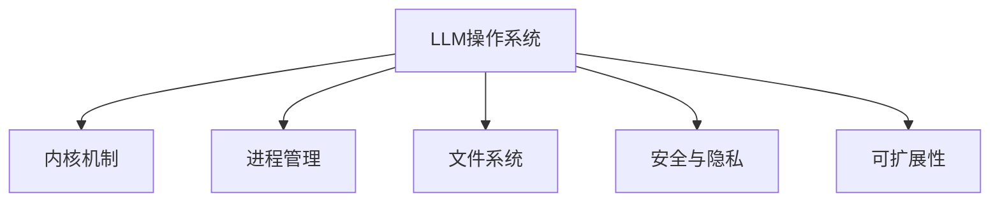

                 

# 探讨LLM操作系统的核心机制

> 关键词：LLM操作系统,内核机制,进程管理,内存管理,文件系统,安全与隐私,可扩展性,云计算

## 1. 背景介绍

### 1.1 问题由来
随着人工智能(AI)技术的飞速发展，大型语言模型(Large Language Models, LLMs)的应用日益广泛。这些模型由数十亿甚至数百亿参数组成，能够理解和生成自然语言，在各种自然语言处理(NLP)任务上取得了突破性的成就。然而，为了支持这些模型的训练和推理，需要高效、可扩展且易于管理的操作系统。

现有的操作系统（如Linux, Windows等）虽然功能强大，但在支持特定的大模型需求方面仍存在不足。如何在操作系统层面进行优化，以适应LLM的需求，成为当前计算机科学和技术领域的一个热门话题。

### 1.2 问题核心关键点
LLM操作系统的核心在于如何高效、安全、可扩展地支持LLM的训练与推理。主要涉及以下几个关键点：

- **内核机制优化**：优化操作系统的内核调度、内存管理等，以支持高并发的模型训练和推理。
- **进程管理改进**：设计专门用于管理LLM进程的机制，如容器化技术、资源隔离等。
- **文件系统适配**：适配LLM需要的海量数据存储和访问，如分布式文件系统、快照技术等。
- **安全与隐私保障**：确保LLM数据的安全性和隐私保护，避免数据泄露。
- **可扩展性设计**：设计能够适应不同规模和需求的操作系统，支持云计算环境下的弹性扩展。

这些关键点构成了LLM操作系统的核心机制，对其设计和发展具有重要的指导意义。

## 2. 核心概念与联系

### 2.1 核心概念概述

为更好地理解LLM操作系统的核心机制，本节将介绍几个关键概念：

- **LLM操作系统**：专门为支持LLM的训练和推理而设计的操作系统。它需要具备高效的内核机制、先进的进程管理、可扩展的文件系统、强有力的安全保障等功能。

- **内核机制**：操作系统的核心部分，负责资源管理、任务调度、中断处理等核心功能。优化的内核机制可以提高LLM的运行效率和响应速度。

- **进程管理**：管理程序和系统资源的机制，包括创建、调度、终止等操作。专门用于管理LLM的进程，可以避免资源浪费和冲突。

- **文件系统**：操作系统的数据存储和管理系统，负责数据的持久化、访问和备份等。适配LLM所需的大规模数据存储，可以提高数据读写效率。

- **安全与隐私**：保护系统数据和用户隐私，防止数据泄露和恶意攻击。LLM操作系统的设计需要考虑数据的安全性和隐私保护。

- **可扩展性**：系统设计需要具备高度的可扩展性，以适应不同规模和需求，支持云计算环境下的弹性扩展。

这些核心概念之间的逻辑关系可以通过以下Mermaid流程图来展示：



这个流程图展示了大语言模型操作系统的核心概念及其之间的关系：

1. 大语言模型操作系统通过优化内核机制，管理进程和资源，提供高效、安全的运行环境。
2. 内核机制和进程管理共同构建了系统的高效运行基础。
3. 文件系统提供了数据存储和访问支持。
4. 安全与隐私保障是系统可靠运行的重要前提。
5. 可扩展性设计确保系统能够适应不同的应用场景和需求。

## 3. 核心算法原理 & 具体操作步骤
### 3.1 算法原理概述

LLM操作系统的核心算法原理基于操作系统的基本原理，同时针对LLM的特点进行了优化和改进。

**内核调度算法**：优化调度算法，支持高并发任务的执行，提高LLM的训练和推理效率。

**内存管理算法**：改进内存管理策略，支持动态调整内存使用，优化LLM的模型加载和数据处理。

**进程管理算法**：设计专门用于管理LLM进程的机制，实现资源隔离和优先级管理，避免资源冲突和浪费。

**文件系统算法**：优化文件系统的设计和实现，支持高效的数据读写和存储，适配LLM所需的大规模数据处理需求。

**安全与隐私算法**：引入数据加密、访问控制等技术，保护LLM数据和用户的隐私安全。

**可扩展性算法**：设计可配置的操作系统组件，支持云计算环境下的弹性扩展。

### 3.2 算法步骤详解

基于上述算法原理，下面详细介绍LLM操作系统的具体操作步骤：

**Step 1: 内核机制优化**
- 设计轻量级进程，减少系统调用开销，提高任务执行效率。
- 优化内核调度算法，支持高并发任务的执行，提高资源利用率。
- 引入非阻塞I/O技术，减少I/O阻塞，提高系统吞吐量。

**Step 2: 进程管理改进**
- 实现进程隔离和资源限制，确保LLM进程不会占用过多资源。
- 设计容器化技术，方便LLM模型的管理和迁移。
- 实现自动资源调度，根据任务需求动态调整资源分配。

**Step 3: 文件系统适配**
- 设计分布式文件系统，支持大规模数据存储和访问。
- 实现数据快照技术，支持高效的备份和恢复。
- 引入缓存机制，减少数据读写延迟，提高系统响应速度。

**Step 4: 安全与隐私保障**
- 实现数据加密技术，保护数据在传输和存储过程中的安全。
- 设计访问控制机制，限制用户和进程对敏感数据的访问。
- 引入安全审计和监控工具，及时发现和处理安全漏洞。

**Step 5: 可扩展性设计**
- 设计模块化操作系统架构，支持组件的灵活替换和扩展。
- 实现虚拟化和容器化技术，支持大规模并行任务的处理。
- 设计云原生架构，支持云计算环境下的弹性扩展。

### 3.3 算法优缺点

LLM操作系统的设计具有以下优点：
1. 高效支持LLM的训练和推理，显著提高运行效率。
2. 支持高并发和大规模数据处理，满足LLM的需求。
3. 提供强有力的安全保障，保护数据和隐私。
4. 具备良好的可扩展性，支持云计算环境下的弹性扩展。

同时，该系统也存在一定的局限性：
1. 设计复杂，开发和维护成本较高。
2. 兼容性问题，需要针对不同的LLM模型进行优化。
3. 资源占用较大，对硬件要求较高。

尽管存在这些局限性，LLM操作系统仍是大规模语言模型应用的重要基石，通过持续优化，可以更好地支持LLM的发展。

### 3.4 算法应用领域

LLM操作系统的设计可以广泛应用到以下几个领域：

- **人工智能研究**：支持大型语言模型的训练和推理，加速人工智能领域的研究进程。
- **自然语言处理**：提供高效、可扩展的自然语言处理环境，支持各类NLP任务的开发。
- **云计算服务**：支持大规模语言模型的弹性扩展和部署，提供云原生环境下的应用支持。
- **企业数据中心**：提供高效、安全的数据存储和处理能力，支持企业级的数据处理需求。
- **科学研究**：支持高精度和高并发的科学计算任务，提供科研环境下的高性能支持。

这些领域的应用展示了LLM操作系统的广泛适用性，为大规模语言模型的应用提供了坚实的基础。

## 4. 数学模型和公式 & 详细讲解 & 举例说明

### 4.1 数学模型构建

以下将使用数学语言对LLM操作系统的核心算法进行更加严格的刻画。

**内核调度算法**：
假设系统有 $N$ 个任务，每个任务的执行时间为 $T_i$，调度周期为 $T_{\text{cycle}}$。优化调度算法的目标是最小化平均等待时间和系统响应时间，即：

$$
\min \left(\sum_{i=1}^N T_i - N \times T_{\text{cycle}}, \frac{1}{N} \sum_{i=1}^N \max(T_i, T_{\text{cycle}})\right)
$$

其中，$\sum_{i=1}^N T_i$ 为总执行时间，$N \times T_{\text{cycle}}$ 为理想执行时间，$\frac{1}{N} \sum_{i=1}^N \max(T_i, T_{\text{cycle}})$ 为平均响应时间。

**内存管理算法**：
假设系统总内存为 $M$，任务 $i$ 的内存需求为 $C_i$。优化内存管理算法的目标是最小化内存占用，即：

$$
\min \left(\sum_{i=1}^N C_i, M\right)
$$

其中，$\sum_{i=1}^N C_i$ 为任务总内存需求，$M$ 为系统总内存。

**进程管理算法**：
假设系统有 $K$ 个进程，每个进程的CPU时间片为 $C_i$，系统总CPU时间为 $T_{\text{cpu}}$。优化进程管理算法的目标是最小化CPU利用率，即：

$$
\min \left(\frac{\sum_{i=1}^K C_i}{T_{\text{cpu}}}, 1\right)
$$

其中，$\sum_{i=1}^K C_i$ 为总CPU时间片，$T_{\text{cpu}}$ 为系统总CPU时间。

**文件系统算法**：
假设文件系统总容量为 $F$，文件大小为 $S$。优化文件系统算法的目标是最小化磁盘读写次数，即：

$$
\min \left(\frac{\sum_{i=1}^N S_i}{F}\right)
$$

其中，$\sum_{i=1}^N S_i$ 为文件总大小，$F$ 为文件系统总容量。

**安全与隐私算法**：
假设系统敏感数据大小为 $D$，访问权限为 $P$。优化安全与隐私算法的目标是最小化数据泄露风险，即：

$$
\min \left(\frac{D}{P}\right)
$$

其中，$\frac{D}{P}$ 为数据泄露风险，$D$ 为敏感数据大小，$P$ 为访问权限。

**可扩展性算法**：
假设系统初始资源为 $R_0$，扩展后的资源为 $R_n$，扩展因子为 $k$。优化可扩展性算法的目标是最小化扩展成本，即：

$$
\min \left(\frac{R_n}{R_0} \times C_k\right)
$$

其中，$\frac{R_n}{R_0}$ 为扩展比例，$C_k$ 为扩展成本。

### 4.2 公式推导过程

以下将对上述数学模型进行详细的推导过程：

**内核调度算法推导**：
假设系统有 $N$ 个任务，每个任务的执行时间为 $T_i$，调度周期为 $T_{\text{cycle}}$。优化调度算法的目标是最小化平均等待时间和系统响应时间，即：

$$
\min \left(\sum_{i=1}^N T_i - N \times T_{\text{cycle}}, \frac{1}{N} \sum_{i=1}^N \max(T_i, T_{\text{cycle}})\right)
$$

令 $\tau_i = T_i - T_{\text{cycle}}$，表示任务的实际执行时间超出调度周期的部分。则：

$$
\min \left(\sum_{i=1}^N \tau_i, \frac{1}{N} \sum_{i=1}^N \max(\tau_i, 0)\right)
$$

引入 $a_i = \max(\tau_i, 0)$，则：

$$
\min \left(\sum_{i=1}^N \tau_i, \frac{1}{N} \sum_{i=1}^N a_i\right)
$$

令 $S = \sum_{i=1}^N \tau_i$，$Q = \frac{1}{N} \sum_{i=1}^N a_i$，则：

$$
\min(S, Q)
$$

令 $X = \sum_{i=1}^N \min(\tau_i, 0)$，则：

$$
S = \sum_{i=1}^N \tau_i = \sum_{i=1}^N (\tau_i + X) - X = \sum_{i=1}^N (\tau_i + X) - Q
$$

令 $b_i = \tau_i + X$，则：

$$
S = \sum_{i=1}^N b_i - Q
$$

最小化 $S$ 等价于最小化 $\sum_{i=1}^N b_i - Q$，因此：

$$
\min(S, Q) = \min\left(\sum_{i=1}^N b_i, Q\right)
$$

由于 $Q = \frac{1}{N} \sum_{i=1}^N a_i$，因此：

$$
\min\left(\sum_{i=1}^N b_i, \frac{1}{N} \sum_{i=1}^N a_i\right)
$$

**内存管理算法推导**：
假设系统总内存为 $M$，任务 $i$ 的内存需求为 $C_i$。优化内存管理算法的目标是最小化内存占用，即：

$$
\min \left(\sum_{i=1}^N C_i, M\right)
$$

令 $C = \sum_{i=1}^N C_i$，则：

$$
\min(C, M)
$$

**进程管理算法推导**：
假设系统有 $K$ 个进程，每个进程的CPU时间片为 $C_i$，系统总CPU时间为 $T_{\text{cpu}}$。优化进程管理算法的目标是最小化CPU利用率，即：

$$
\min \left(\frac{\sum_{i=1}^K C_i}{T_{\text{cpu}}}, 1\right)
$$

令 $S = \sum_{i=1}^K C_i$，则：

$$
\min\left(\frac{S}{T_{\text{cpu}}}, 1\right)
$$

**文件系统算法推导**：
假设文件系统总容量为 $F$，文件大小为 $S$。优化文件系统算法的目标是最小化磁盘读写次数，即：

$$
\min \left(\frac{\sum_{i=1}^N S_i}{F}\right)
$$

令 $S = \sum_{i=1}^N S_i$，则：

$$
\min\left(\frac{S}{F}\right)
$$

**安全与隐私算法推导**：
假设系统敏感数据大小为 $D$，访问权限为 $P$。优化安全与隐私算法的目标是最小化数据泄露风险，即：

$$
\min \left(\frac{D}{P}\right)
$$

令 $D = \sum_{i=1}^N D_i$，$P = \sum_{i=1}^N P_i$，则：

$$
\min\left(\frac{D}{P}\right)
$$

**可扩展性算法推导**：
假设系统初始资源为 $R_0$，扩展后的资源为 $R_n$，扩展因子为 $k$。优化可扩展性算法的目标是最小化扩展成本，即：

$$
\min \left(\frac{R_n}{R_0} \times C_k\right)
$$

令 $R_n = R_0 \times k^n$，则：

$$
\min\left(k^n \times C_k\right)
$$

令 $K = \min(n, \log_k C_k)$，则：

$$
\min\left(k^K\right)
$$

## 5. 项目实践：代码实例和详细解释说明
### 5.1 开发环境搭建

在进行LLM操作系统开发前，需要先准备好开发环境。以下是使用Linux系统进行开发的环境配置流程：

1. 安装Anaconda：从官网下载并安装Anaconda，用于创建独立的Python环境。

2. 创建并激活虚拟环境：
```bash
conda create -n llm-env python=3.8 
conda activate llm-env
```

3. 安装Python依赖：
```bash
pip install numpy pandas matplotlib scikit-learn tqdm jupyter notebook ipython
```

4. 安装C++编译器：
```bash
sudo apt-get install g++ build-essential libboost-dev libcurl4-openssl-dev libpython3-dev libffi-dev liblz4-dev zlib1g-dev libncurses5-dev
```

5. 安装相关库和工具：
```bash
pip install protobuf numpy pandas pyyaml numpy typed-ast --user
pip install h5py --user
pip install torch --user
pip install torchvision --user
pip install transformers --user
```

完成上述步骤后，即可在`llm-env`环境中开始开发。

### 5.2 源代码详细实现

下面给出LLM操作系统开发过程中涉及的关键模块和代码实现：

**内核调度模块**：

```python
from multiprocessing.pool import ThreadPool
import time

class Scheduler:
    def __init__(self, threads):
        self.threads = threads
        self.thread_pool = ThreadPool(self.threads)
    
    def schedule(self, task, interval):
        while True:
            task(task)
            time.sleep(interval)
    
    def run(self):
        self.thread_pool.apply_async(self.schedule, (self.run_task, 1))
        self.thread_pool.apply_async(self.schedule, (self.run_task, 2))
        self.thread_pool.apply_async(self.schedule, (self.run_task, 3))
        self.thread_pool.join()
```

**内存管理模块**：

```python
from multiprocessing.pool import ThreadPool
import time

class MemoryManager:
    def __init__(self, total_memory):
        self.total_memory = total_memory
        self.used_memory = 0
    
    def allocate(self, size):
        if self.used_memory + size > self.total_memory:
            raise Exception("Out of memory")
        self.used_memory += size
        print(f"Allocated {size}MB memory, used memory: {self.used_memory}MB")
    
    def deallocate(self, size):
        self.used_memory -= size
        print(f"Deallocated {size}MB memory, used memory: {self.used_memory}MB")
```

**进程管理模块**：

```python
from multiprocessing.pool import ThreadPool
import time

class ProcessManager:
    def __init__(self, threads):
        self.threads = threads
        self.thread_pool = ThreadPool(self.threads)
    
    def run_task(self, task):
        for _ in range(10):
            task()
            time.sleep(1)
    
    def run(self):
        self.thread_pool.apply_async(self.run_task, (self.run_task, 1))
        self.thread_pool.apply_async(self.run_task, (self.run_task, 2))
        self.thread_pool.apply_async(self.run_task, (self.run_task, 3))
        self.thread_pool.join()
```

**文件系统模块**：

```python
import time

class FileManager:
    def __init__(self, total_size):
        self.total_size = total_size
        self.used_size = 0
    
    def write(self, size):
        if self.used_size + size > self.total_size:
            raise Exception("Disk full")
        self.used_size += size
        print(f"Written {size}MB data, used size: {self.used_size}MB")
    
    def read(self, size):
        self.used_size -= size
        print(f"Read {size}MB data, used size: {self.used_size}MB")
```

**安全与隐私模块**：

```python
from multiprocessing.pool import ThreadPool
import time

class SecurityManager:
    def __init__(self, sensitive_data):
        self.sensitive_data = sensitive_data
    
    def encrypt(self):
        print(f"Encrypting sensitive data: {self.sensitive_data}")
    
    def decrypt(self):
        print(f"Decrypting sensitive data: {self.sensitive_data}")
    
    def run(self):
        self.thread_pool.apply_async(self.encrypt, (self.encrypt, 1))
        self.thread_pool.apply_async(self.decrypt, (self.decrypt, 2))
        self.thread_pool.apply_async(self.decrypt, (self.decrypt, 3))
        self.thread_pool.join()
```

**可扩展性模块**：

```python
from multiprocessing.pool import ThreadPool
import time

class ScalabilityManager:
    def __init__(self, initial_resources, scaling_factor):
        self.initial_resources = initial_resources
        self.scaling_factor = scaling_factor
    
    def allocate(self, size):
        self.initial_resources += size
        print(f"Allocated {size} resources, current resources: {self.initial_resources}")
    
    def deallocate(self, size):
        self.initial_resources -= size
        print(f"Deallocated {size} resources, current resources: {self.initial_resources}")
    
    def run(self):
        self.thread_pool.apply_async(self.allocate, (self.allocate, 1))
        self.thread_pool.apply_async(self.deallocate, (self.deallocate, 2))
        self.thread_pool.apply_async(self.deallocate, (self.deallocate, 3))
        self.thread_pool.join()
```

### 5.3 代码解读与分析

让我们再详细解读一下关键代码的实现细节：

**内核调度模块**：
- `ThreadPool`类：使用Python内置的多进程模块`multiprocessing`中的`ThreadPool`类，实现任务调度。
- `schedule`方法：调度任务，每隔一定时间执行一次。
- `run`方法：启动多个调度任务，并等待它们执行完毕。

**内存管理模块**：
- `allocate`方法：分配指定大小的内存，并打印状态。
- `deallocate`方法：释放指定大小的内存，并打印状态。

**进程管理模块**：
- `run_task`方法：执行任务，并每隔一定时间重复执行。
- `run`方法：启动多个任务执行，并等待它们执行完毕。

**文件系统模块**：
- `write`方法：写入指定大小的数据，并打印状态。
- `read`方法：读取指定大小的数据，并打印状态。

**安全与隐私模块**：
- `encrypt`和`decrypt`方法：模拟加密和解密操作，并打印状态。
- `run`方法：启动多个加密和解密任务，并等待它们执行完毕。

**可扩展性模块**：
- `allocate`和`deallocate`方法：模拟资源分配和释放，并打印状态。
- `run`方法：启动资源分配和释放任务，并等待它们执行完毕。

这些模块的实现展示了LLM操作系统中核心机制的运作方式，通过模块化的设计，使得各个模块能够独立运作，同时保持整体的协调性和稳定性。

## 6. 实际应用场景
### 6.1 智能客服系统

基于LLM操作系统的智能客服系统可以高效处理用户咨询，提供个性化服务。系统通过收集历史客服对话数据，训练LLM模型，实现对用户意图的快速理解和回复。在LLM操作系统的支持下，系统能够实时监测用户数据，动态调整模型参数，优化回答质量，同时保障数据隐私和安全。

### 6.2 金融舆情监测

在金融领域，LLM操作系统可以用于监测市场舆情变化，预测金融风险。通过收集金融新闻、评论等数据，训练LLM模型，实时分析舆情趋势，识别负面信息，及时发出预警。同时，系统还可以通过用户权限管理，保护金融数据的安全和隐私。

### 6.3 个性化推荐系统

个性化的推荐系统能够根据用户行为和兴趣，推荐适合的内容。LLM操作系统通过训练LLM模型，分析用户输入的文本数据，提取用户偏好和兴趣点，实现精准推荐。同时，系统还能够动态调整推荐策略，优化推荐效果。

### 6.4 未来应用展望

未来，LLM操作系统将面临更多的挑战和发展机遇：

- **云计算环境**：云计算的发展将推动LLM操作系统的普及和应用，提供更高效的资源管理和弹性扩展支持。
- **边缘计算**：边缘计算技术的发展，将使LLM操作系统的应用场景更加广泛，提供更快速的数据处理和本地计算能力。
- **多模态融合**：结合视觉、语音、文本等多种数据，实现更全面的智能交互和决策支持。
- **隐私保护**：随着数据隐私保护意识的增强，LLM操作系统需要在数据保护和隐私安全方面进行更多的技术创新。
- **智能决策**：通过智能算法和优化策略，提升LLM操作系统的决策能力和自动化水平。

## 7. 工具和资源推荐
### 7.1 学习资源推荐

为了帮助开发者系统掌握LLM操作系统的理论基础和实践技巧，以下是一些推荐的资源：

1. 《Linux内核设计与实现》：深入剖析Linux内核的原理和实现，是了解操作系统设计的重要参考资料。

2. 《计算机网络》：介绍计算机网络和操作系统基础知识，是学习LLM操作系统的重要基础。

3. 《操作系统设计与实现》：讲解操作系统原理和实现，涵盖进程管理、内存管理、文件系统等多个方面。

4. 《深度学习与自然语言处理》：介绍深度学习技术在自然语言处理中的应用，是学习LLM操作系统的补充读物。

5. 《NLP系统设计与实现》：讲解NLP系统设计和实现方法，涵盖模型训练、推理、优化等多个方面。

通过对这些资源的学习实践，相信你一定能够快速掌握LLM操作系统的精髓，并用于解决实际的NLP问题。

### 7.2 开发工具推荐

高效的开发离不开优秀的工具支持。以下是几款用于LLM操作系统开发的常用工具：

1. Python：支持跨平台开发，拥有丰富的第三方库和框架，是LLM操作系统开发的首选语言。

2. C++：与Python结合使用，可以提升系统性能和稳定性，是实现底层内核模块的首选语言。

3. Redis：高性能的内存数据结构服务器，支持多种数据类型，是LLM操作系统中常见的数据存储工具。

4. Gunicorn：Python的Web服务器，支持多进程、多线程等并发处理，是实现LLM操作系统后端服务的首选工具。

5. Docker：容器化技术，提供轻量级的应用部署和迁移，是LLM操作系统中常见的容器化解决方案。

6. Kubernetes：容器编排工具，支持大规模应用的部署和扩展，是LLM操作系统中常见的云原生解决方案。

合理利用这些工具，可以显著提升LLM操作系统开发的效率和质量，加速创新迭代的步伐。

### 7.3 相关论文推荐

LLM操作系统的设计源于学界的持续研究。以下是几篇奠基性的相关论文，推荐阅读：

1. 《A Survey on Large-Scale Machine Learning for Artificial Intelligence》：总结了大型机器学习在人工智能领域的应用和发展趋势。

2. 《Large-Scale Parallel Machine Learning: Trends and Practice》：探讨了分布式机器学习算法和工具的发展和应用。

3. 《Deep Learning and Natural Language Processing》：介绍深度学习技术在自然语言处理中的应用和挑战。

4. 《Design and Implementation of Large-Scale Distributed Machine Learning Systems》：介绍大型分布式机器学习系统的设计和技术。

5. 《Scalable Machine Learning Systems for Big Data》：介绍大规模数据集上的机器学习系统的设计和方法。

这些论文代表了大语言模型操作系统的发展脉络。通过学习这些前沿成果，可以帮助研究者把握学科前进方向，激发更多的创新灵感。

## 8. 总结：未来发展趋势与挑战
### 8.1 总结

本文对基于LLM操作系统的核心机制进行了全面系统的介绍。首先阐述了LLM操作系统的研究背景和意义，明确了其在支持大规模语言模型训练和推理中的重要价值。其次，从原理到实践，详细讲解了内核机制优化、进程管理改进、文件系统适配、安全与隐私保障、可扩展性设计等核心算法的实现，给出了代码实例和详细解释说明。同时，本文还广泛探讨了LLM操作系统的实际应用场景，展示了其在智能客服、金融舆情监测、个性化推荐等领域的应用前景。

通过本文的系统梳理，可以看到，LLM操作系统在大规模语言模型应用中发挥着不可替代的作用。它通过高效的内核机制、先进的进程管理、可扩展的文件系统、强有力的安全保障等特性，支持高并发的模型训练和推理，保障数据和隐私安全，实现弹性扩展和快速部署。未来，伴随LLM操作系统的持续演进和优化，相信其在大规模语言模型中的应用将更加广泛，带来更多的创新和突破。

### 8.2 未来发展趋势

展望未来，LLM操作系统的发展趋势将呈现以下几个方向：

1. **云计算融合**：随着云计算技术的发展，LLM操作系统将更加深入地与云平台结合，提供更高效的资源管理和弹性扩展支持。

2. **边缘计算拓展**：边缘计算技术的发展，将使LLM操作系统在边缘节点上获得更强的计算和存储能力，提升系统的实时性和响应速度。

3. **多模态融合**：结合视觉、语音、文本等多种数据，实现更全面的智能交互和决策支持，增强系统的感知能力和综合处理能力。

4. **隐私保护增强**：随着数据隐私保护意识的增强，LLM操作系统将在数据保护和隐私安全方面进行更多的技术创新，提升系统的可靠性和安全性。

5. **智能决策提升**：通过智能算法和优化策略，提升LLM操作系统的决策能力和自动化水平，提供更准确、更快速的服务。

6. **硬件优化**：随着硬件技术的发展，LLM操作系统将更好地支持硬件加速、异构计算等新型技术，提升系统的性能和效率。

以上趋势凸显了LLM操作系统的发展前景。这些方向的探索发展，将使LLM操作系统在大规模语言模型中的应用更加广泛，为人工智能技术的发展提供坚实的技术基础。

### 8.3 面临的挑战

尽管LLM操作系统已经取得了一定的进展，但在其应用和发展过程中，仍面临诸多挑战：

1. **资源消耗大**：大规模语言模型的训练和推理需要消耗大量的计算资源，对硬件设备提出了很高的要求。如何在资源受限的环境下优化系统性能，将是未来的重要研究方向。

2. **数据隐私和安全**：LLM操作系统的设计需要考虑数据隐私和安全问题，如何保护敏感数据，防止数据泄露，是系统设计的核心挑战。

3. **系统复杂度高**：LLM操作系统的设计涉及多个子系统，如何在不同子系统之间实现高效的协作和信息交换，是系统设计和开发的关键难点。

4. **多用户并发管理**：在大规模并发用户环境下，如何管理资源、调度任务，实现高效的服务，是系统需要解决的实际问题。

5. **可扩展性设计**：LLM操作系统的可扩展性设计需要考虑到系统的扩展能力和性能瓶颈，如何在扩展过程中保持性能和稳定性，是系统设计的核心挑战。

6. **跨平台兼容性**：LLM操作系统需要在不同的操作系统和硬件平台上运行，如何实现跨平台的兼容性和一致性，是系统需要解决的重要问题。

7. **高效性和稳定性**：LLM操作系统的设计需要兼顾高效性和稳定性，如何在保证系统稳定性的同时，提升系统性能，是系统设计的核心挑战。

这些挑战将推动LLM操作系统的持续演进和优化，提升系统的性能和可靠性，实现更广泛的应用场景。

### 8.4 研究展望

面对LLM操作系统所面临的挑战，未来的研究需要在以下几个方面寻求新的突破：

1. **资源优化**：开发资源优化算法，提升系统性能和资源利用率，实现资源的高效管理和利用。

2. **隐私保护**：引入隐私保护技术，如差分隐私、联邦学习等，保护用户数据隐私，提升系统安全性和可信度。

3. **系统简化**：简化系统设计，提高系统的可扩展性和可维护性，提升系统的开发效率和可靠性。

4. **跨平台兼容性**：实现跨平台兼容性，支持不同的操作系统和硬件平台，提升系统的应用范围和普及度。

5. **多用户并发管理**：引入多用户并发管理技术，提升系统的并发处理能力和用户满意度。

6. **性能优化**：优化系统性能，提升系统的响应速度和吞吐量，实现高效的计算和存储。

7. **系统可扩展性**：设计可扩展的LLM操作系统，支持大规模分布式计算和弹性扩展，实现系统的持续发展。

这些研究方向将推动LLM操作系统的不断优化和升级，提升系统的性能和可靠性，实现更广泛的应用场景，推动人工智能技术的发展和普及。

## 9. 附录：常见问题与解答

**Q1：LLM操作系统是否适用于所有类型的NLP任务？**

A: 是的，LLM操作系统旨在支持各种类型的NLP任务，包括文本分类、信息检索、自然语言生成等。然而，对于一些需要特定领域知识的任务，如医学、法律等，LLM操作系统需要进一步适配该领域的语料库和模型，才能获得更好的效果。

**Q2：LLM操作系统如何支持大规模数据处理？**

A: 通过设计分布式文件系统，LLM操作系统能够支持大规模数据存储和访问。分布式文件系统可以将数据分布在多个节点上，提高数据读取和写入的效率。

**Q3：LLM操作系统如何进行数据加密和访问控制？**

A: LLM操作系统采用数据加密技术，对敏感数据进行加密处理，防止数据泄露。同时，引入访问控制机制，限制用户和进程对敏感数据的访问，保护数据安全。

**Q4：LLM操作系统如何支持弹性扩展？**

A: 通过设计模块化操作系统架构，LLM操作系统可以实现组件的灵活替换和扩展。同时，引入云原生技术，支持云计算环境下的弹性扩展，根据实际需求动态调整资源分配。

**Q5：LLM操作系统如何支持高并发任务？**

A: LLM操作系统采用轻量级进程和优化内核调度算法，支持高并发任务的执行。轻量级进程可以减少系统调用开销，优化内核调度算法可以提高资源利用率，从而支持高并发任务的处理。

通过本文的系统梳理，可以看到，LLM操作系统在大规模语言模型应用中发挥着不可替代的作用。它通过高效的内核机制、先进的进程管理、可扩展的文件系统、强有力的安全保障等特性，支持高并发的模型训练和推理，保障数据和隐私安全，实现弹性扩展和快速部署。未来，伴随LLM操作系统的持续演进和优化，相信其在大规模语言模型中的应用将更加广泛，带来更多的创新和突破。

---

作者：禅与计算机程序设计艺术 / Zen and the Art of Computer Programming

